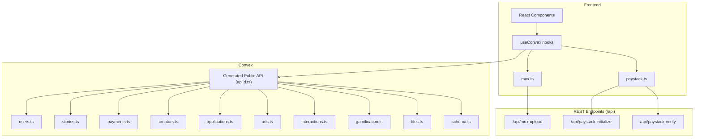
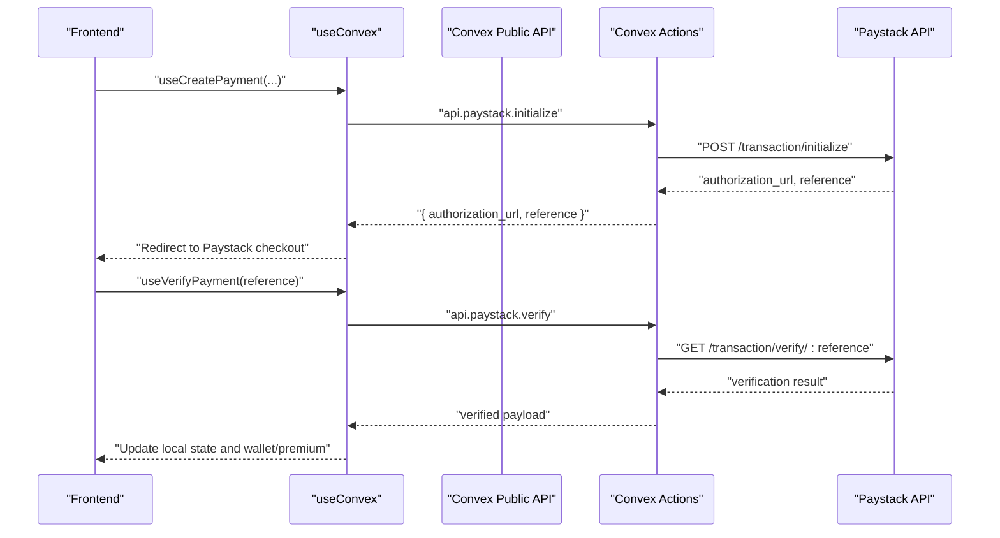
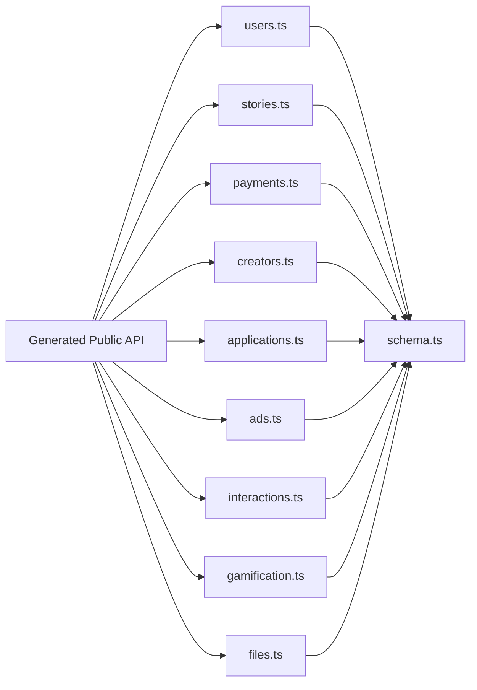

# API Reference

<cite>
**Referenced Files in This Document**
- [api/mux-upload.ts](file://api/mux-upload.ts)
- [api/paystack-initialize.ts](file://api/paystack-initialize.ts)
- [api/paystack-verify.ts](file://api/paystack-verify.ts)
- [convex/_generated/api.d.ts](file://convex/_generated/api.d.ts)
- [convex/_generated/server.d.ts](file://convex/_generated/server.d.ts)
- [convex/schema.ts](file://convex/schema.ts)
- [convex/users.ts](file://convex/users.ts)
- [convex/stories.ts](file://convex/stories.ts)
- [convex/payments.ts](file://convex/payments.ts)
- [convex/creators.ts](file://convex/creators.ts)
- [convex/applications.ts](file://convex/applications.ts)
- [convex/ads.ts](file://convex/ads.ts)
- [convex/interactions.ts](file://convex/interactions.ts)
- [convex/gamification.ts](file://convex/gamification.ts)
- [convex/files.ts](file://convex/files.ts)
- [src/lib/convex.ts](file://src/lib/convex.ts)
- [src/lib/mux.ts](file://src/lib/mux.ts)
- [src/lib/paystack.ts](file://src/lib/paystack.ts)
- [src/hooks/useConvex.ts](file://src/hooks/useConvex.ts)
</cite>

## Table of Contents
1. [Introduction](#introduction)
2. [Project Structure](#project-structure)
3. [Core Components](#core-components)
4. [Architecture Overview](#architecture-overview)
5. [Detailed Component Analysis](#detailed-component-analysis)
6. [Dependency Analysis](#dependency-analysis)
7. [Performance Considerations](#performance-considerations)
8. [Troubleshooting Guide](#troubleshooting-guide)
9. [Conclusion](#conclusion)
10. [Appendices](#appendices)

## Introduction
This document provides comprehensive API documentation for the Lemonade platform, covering:
- Convex-generated public API functions for users, stories, payments, creators, applications, ads, interactions, gamification, and files.
- RESTful integration endpoints for Mux video uploads and Paystack payment initialization and verification.
- Authentication and authorization patterns, request/response schemas, error handling, rate limiting considerations, API versioning, backward compatibility, and security measures.
- Practical usage examples and integration patterns for frontend clients.

## Project Structure
The Lemonade backend is powered by Convex and integrates with external services for payments and media:
- Convex modules define typed public and internal functions and manage the data model.
- Frontend utilities wrap Convex actions and expose convenient hooks for React components.
- REST endpoints proxy to external providers (Mux, Paystack) and are exposed under /api.

**Diagram sources**
- [convex/_generated/api.d.ts:33-78](file://convex/_generated/api.d.ts#L33-L78)
- [convex/users.ts:15-360](file://convex/users.ts#L15-L360)
- [convex/stories.ts:6-180](file://convex/stories.ts#L6-L180)
- [convex/payments.ts:1-291](file://convex/payments.ts#L1-L291)
- [convex/creators.ts:7-87](file://convex/creators.ts#L7-L87)
- [convex/applications.ts:32-224](file://convex/applications.ts#L32-L224)
- [convex/ads.ts:105-360](file://convex/ads.ts#L105-L360)
- [convex/interactions.ts:6-207](file://convex/interactions.ts#L6-L207)
- [convex/gamification.ts:4-331](file://convex/gamification.ts#L4-L331)
- [convex/files.ts:4-21](file://convex/files.ts#L4-L21)
- [api/mux-upload.ts:8-45](file://api/mux-upload.ts#L8-L45)
- [api/paystack-initialize.ts:5-47](file://api/paystack-initialize.ts#L5-L47)
- [api/paystack-verify.ts:5-36](file://api/paystack-verify.ts#L5-L36)
- [src/lib/convex.ts:1-12](file://src/lib/convex.ts#L1-L12)
- [src/lib/mux.ts:15-66](file://src/lib/mux.ts#L15-L66)
- [src/lib/paystack.ts:24-115](file://src/lib/paystack.ts#L24-L115)
- [src/hooks/useConvex.ts:1-213](file://src/hooks/useConvex.ts#L1-L213)

**Section sources**
- [convex/_generated/api.d.ts:33-78](file://convex/_generated/api.d.ts#L33-L78)
- [convex/schema.ts:24-493](file://convex/schema.ts#L24-L493)
- [src/lib/convex.ts:1-12](file://src/lib/convex.ts#L1-L12)

## Core Components
- Convex public API: Exposes typed functions for client-side calls via generated bindings.
- REST endpoints: Thin wrappers around external services (Mux, Paystack) for secure and controlled access.
- Frontend utilities: Encapsulate environment configuration, error normalization, and convenient function calls.

Key capabilities:
- User management, roles, profiles, wallet, and notifications.
- Story lifecycle, discovery, and interactions.
- Payments via Paystack with wallet top-ups and premium subscriptions.
- Creator onboarding and profiles.
- Advertising selection and revenue tracking.
- Community interactions (comments, follows, saves).
- Gamification (XP, streaks, spins, currencies).
- File storage URLs generation.

**Section sources**
- [convex/users.ts:15-360](file://convex/users.ts#L15-L360)
- [convex/stories.ts:6-180](file://convex/stories.ts#L6-L180)
- [convex/payments.ts:1-291](file://convex/payments.ts#L1-L291)
- [convex/creators.ts:7-87](file://convex/creators.ts#L7-L87)
- [convex/applications.ts:32-224](file://convex/applications.ts#L32-L224)
- [convex/ads.ts:105-360](file://convex/ads.ts#L105-L360)
- [convex/interactions.ts:6-207](file://convex/interactions.ts#L6-L207)
- [convex/gamification.ts:4-331](file://convex/gamification.ts#L4-L331)
- [convex/files.ts:4-21](file://convex/files.ts#L4-L21)

## Architecture Overview
The platform uses a typed, strongly-validated backend with Convex and integrates external services through controlled endpoints.

**Diagram sources**
- [src/hooks/useConvex.ts:65-109](file://src/hooks/useConvex.ts#L65-L109)
- [src/lib/paystack.ts:56-84](file://src/lib/paystack.ts#L56-L84)
- [api/paystack-initialize.ts:5-47](file://api/paystack-initialize.ts#L5-L47)
- [api/paystack-verify.ts:5-36](file://api/paystack-verify.ts#L5-L36)

## Detailed Component Analysis

### Convex Public API Functions
All public functions are defined in modules and exposed via generated bindings. Types and signatures are enforced at compile-time.

- Users
  - Queries: list, getByUsername, getByFirebaseUid, getFullProfile
  - Mutations: upsertFromAuth, updateRole, setStatus, addWalletBalance, updateProfile, createNotification, unlockChapter, toggleSave, toggleFollow
  - Validation: Username normalization and constraints; unique username checks; role and status enums; wallet balance updates; chapter unlock logic with prior unlocks and transaction logging.

- Stories
  - Queries: listPublished, listFeatured, getByExternalId, listByCreator
  - Mutations: create, update, incrementViews, publish
  - Validation: External ID uniqueness; status transitions; sanitization of optional images; draft/published lifecycle.

- Payments
  - Queries: list, listByUser, creatorPayoutSummary
  - Mutations: record, creditWalletAfterPaystack, activatePremiumAfterPaystack, cancelPremium
  - Validation: Reference deduplication; user lookup by Firebase UID or legacy IDs; premium plan activation with billing cycles; amount sanity checks.

- Creators
  - Queries: list, getByUsername
  - Mutations: upsert, adjustFollowerCount
  - Validation: Category normalization; follower adjustments bounded to non-negative values.

- Applications
  - Queries: list, listByStatus, getById
  - Mutations: submit, review
  - Validation: User resolution via Firebase UID or external ID; role updates on approval; creator profile creation/updation.

- Ads
  - Mutations: selectForContent, trackEvent
  - Queries: creatorSummary, adminSummary, listCampaigns
  - Mutations: createCampaign, updateCampaignStatus
  - Validation: Content type normalization; gating rules by format and chapter; revenue calculation; creator/advertiser revenue splits; frequency caps and targeting.

- Interactions
  - Mutations: followCreator, unfollowCreator, saveStory, unsaveStory, trackReading, trackReadingByFirebaseUid, createComment, toggleLikeComment
  - Queries: listComments, listCommentsPaged
  - Validation: Unique histories; nested comment filtering; like toggling logic.

- Gamification
  - Queries: getSpinInventory, eligibleForWeeklySpin, getUserStreak, getUserCurrencies
  - Mutations: recordEngagement, performWeeklySpin, useStreakInsurance
  - Validation: Eligibility thresholds; weighted spin selection; XP/level progression; streak protection mechanics.

- Files
  - Mutations: generateUploadUrl, getUrl
  - Validation: Storage URL retrieval with existence checks.

**Section sources**
- [convex/_generated/api.d.ts:33-78](file://convex/_generated/api.d.ts#L33-L78)
- [convex/_generated/server.d.ts:24-96](file://convex/_generated/server.d.ts#L24-L96)
- [convex/users.ts:15-360](file://convex/users.ts#L15-L360)
- [convex/stories.ts:6-180](file://convex/stories.ts#L6-L180)
- [convex/payments.ts:1-291](file://convex/payments.ts#L1-L291)
- [convex/creators.ts:7-87](file://convex/creators.ts#L7-L87)
- [convex/applications.ts:32-224](file://convex/applications.ts#L32-L224)
- [convex/ads.ts:105-360](file://convex/ads.ts#L105-L360)
- [convex/interactions.ts:6-207](file://convex/interactions.ts#L6-L207)
- [convex/gamification.ts:4-331](file://convex/gamification.ts#L4-L331)
- [convex/files.ts:4-21](file://convex/files.ts#L4-L21)

### REST Endpoints

#### Mux Upload Endpoint
- Path: /api/mux-upload
- Method: POST
- Purpose: Create a signed upload URL for Mux direct uploads.
- Request
  - Headers: Content-Type: application/json
  - Body: Empty or minimal payload (endpoint constructs Mux upload payload internally).
- Response
  - 200 OK: { data: { url: string } }
  - 400 Bad Request: Missing required fields or invalid request shape.
  - 405 Method Not Allowed: Non-POST requests.
  - 500 Internal Server Error: Missing credentials or upstream failure.
- Security
  - Uses Basic Auth with MUX_TOKEN_ID/MUX_TOKEN_SECRET.
  - Enforces CORS origin via request origin header.
- Notes
  - Requires MUX_TOKEN_ID and MUX_TOKEN_SECRET environment variables.

**Section sources**
- [api/mux-upload.ts:8-45](file://api/mux-upload.ts#L8-L45)

#### Paystack Payment Initialization
- Path: /api/paystack-initialize
- Method: POST
- Purpose: Initialize a Paystack transaction and return an authorization URL.
- Request
  - Headers: Content-Type: application/json
  - Body fields:
    - email: string (required)
    - amount: number (optional if plan is provided)
    - reference: string (optional)
    - metadata: object (optional)
    - callbackUrl: string (optional)
    - plan: string (optional)
- Response
  - 200 OK: { authorization_url: string, reference: string }
  - 400 Bad Request: Missing email or conflicting amount/plan.
  - 405 Method Not Allowed: Non-POST requests.
  - 500 Internal Server Error: Missing secret key or upstream failure.
- Security
  - Uses Bearer token from PAYSTACK_SECRET_KEY.
- Notes
  - Supports plans for recurring subscriptions.

**Section sources**
- [api/paystack-initialize.ts:5-47](file://api/paystack-initialize.ts#L5-L47)

#### Paystack Verification Endpoint
- Path: /api/paystack-verify
- Method: GET
- Purpose: Verify a Paystack transaction by reference.
- Request
  - Query: reference (string, required)
- Response
  - 200 OK: { status: string, reference: string, ... }
  - 400 Bad Request: Missing reference.
  - 405 Method Not Allowed: Non-GET requests.
  - 500 Internal Server Error: Missing secret key or upstream failure.
- Security
  - Uses Bearer token from PAYSTACK_SECRET_KEY.

**Section sources**
- [api/paystack-verify.ts:5-36](file://api/paystack-verify.ts#L5-L36)

### Frontend Integration Utilities

#### Convex Client Setup
- Reads VITE_CONVEX_URL from environment.
- Warns if not configured; returns null to disable Convex.

**Section sources**
- [src/lib/convex.ts:1-12](file://src/lib/convex.ts#L1-L12)

#### Mux Integration
- getMuxConfig: Validates VITE_MUX_TOKEN_ID presence.
- getMuxStreamUrl: Builds HLS playback URL from playbackId.
- createMuxDirectUploadUrl: Calls /api/mux-upload to obtain a pre-signed upload URL.

**Section sources**
- [src/lib/mux.ts:15-66](file://src/lib/mux.ts#L15-L66)

#### Paystack Integration
- getPaystackConfig: Validates VITE_PAYSTACK_PUBLIC_KEY presence.
- initializePayment: Invokes Convex action api.paystack.initialize with normalized arguments.
- verifyPayment: Invokes Convex action api.paystack.verify with reference.
- generateReference: Creates unique payment reference.
- Currency helpers: naiiraToKobo, koboToNaira.

**Section sources**
- [src/lib/paystack.ts:24-115](file://src/lib/paystack.ts#L24-L115)

#### React Hooks
- useCreatePayment: Builds metadata, resolves plan codes from environment, and returns authorization URL and reference.
- useVerifyPayment: Placeholder wrapper for verification flow.
- useUpdateUserProfile, useApplyForCreatorAccess, useCreateStory, useUpdateStory, useIncrementStoryView, usePublishStory, useUnlockChapter: Thin wrappers around Convex mutations.

**Section sources**
- [src/hooks/useConvex.ts:65-213](file://src/hooks/useConvex.ts#L65-L213)

## Dependency Analysis
Convex-generated API acts as the central contract for client-to-backend communication. Modules depend on the schema for data typing and indexing. REST endpoints depend on environment variables for provider credentials.

**Diagram sources**
- [convex/_generated/api.d.ts:33-78](file://convex/_generated/api.d.ts#L33-L78)
- [convex/schema.ts:24-493](file://convex/schema.ts#L24-L493)

**Section sources**
- [convex/_generated/api.d.ts:33-78](file://convex/_generated/api.d.ts#L33-L78)
- [convex/schema.ts:24-493](file://convex/schema.ts#L24-L493)

## Performance Considerations
- Query caching: Convex caches queries by default; leverage useQuery-like hooks to minimize redundant network calls.
- Index usage: Ensure database indexes align with frequent filters (e.g., by_username, by_firebaseUid, by_status).
- Batch operations: Use Promise.all for concurrent reads/writes where safe.
- Payload sizes: Avoid transferring unnecessary fields; prefer projections via indexes.
- Rate limiting: External providers (Paystack, Mux) enforce limits; implement client-side throttling and exponential backoff for retries.
- Real-time updates: Prefer reactive queries to auto-update UI on data changes.

[No sources needed since this section provides general guidance]

## Troubleshooting Guide
Common issues and resolutions:
- "Convex is not configured": Ensure VITE_CONVEX_URL is set in the environment.
- "Mux credentials are not configured": Set MUX_TOKEN_ID and MUX_TOKEN_SECRET.
- "Paystack secret key is not configured": Set PAYSTACK_SECRET_KEY.
- "User not found": Verify Firebase UID or external ID mapping in users table.
- "Payment verification failed": Confirm webhook configuration and reference correctness.
- "Query returning undefined": Check database indexes and ensure proper field types.

**Section sources**
- [src/lib/convex.ts:5-7](file://src/lib/convex.ts#L5-L7)
- [api/mux-upload.ts:14-17](file://api/mux-upload.ts#L14-L17)
- [api/paystack-initialize.ts:11-14](file://api/paystack-initialize.ts#L11-L14)
- [api/paystack-verify.ts:11-14](file://api/paystack-verify.ts#L11-L14)

## Conclusion
The Lemonade platform offers a strongly-typed, validated backend via Convex and secure integrations with Mux and Paystack. By following the documented patterns for authentication, request/response schemas, error handling, and performance best practices, integrators can build reliable and scalable features.

[No sources needed since this section summarizes without analyzing specific files]

## Appendices

### Authentication and Authorization
- Convex functions are public or internal as declared in generated server utilities.
- Frontend uses Firebase for identity; user IDs are mapped to backend records via externalId or firebaseUid.
- Environment variables secure provider credentials.

**Section sources**
- [convex/_generated/server.d.ts:24-96](file://convex/_generated/server.d.ts#L24-L96)
- [src/lib/convex.ts:1-12](file://src/lib/convex.ts#L1-L12)

### Request/Response Schemas

- Mux Upload
  - Request: None (endpoint constructs payload)
  - Response: { data: { url: string } }

- Paystack Initialize
  - Request: { email, amount?, reference?, metadata?, callbackUrl?, plan? }
  - Response: { authorization_url: string, reference: string }

- Paystack Verify
  - Request: query reference
  - Response: { status: string, reference: string, ... }

**Section sources**
- [api/mux-upload.ts:8-45](file://api/mux-upload.ts#L8-L45)
- [api/paystack-initialize.ts:16-36](file://api/paystack-initialize.ts#L16-L36)
- [api/paystack-verify.ts:16-25](file://api/paystack-verify.ts#L16-L25)

### Error Handling Patterns
- Frontend utilities normalize errors and surface user-friendly messages.
- REST endpoints return structured JSON errors with HTTP status codes.
- Convex mutations throw descriptive errors for invalid inputs or missing resources.

**Section sources**
- [src/lib/paystack.ts:40-51](file://src/lib/paystack.ts#L40-L51)
- [api/mux-upload.ts:37-41](file://api/mux-upload.ts#L37-L41)
- [api/paystack-initialize.ts:17-19](file://api/paystack-initialize.ts#L17-L19)
- [api/paystack-verify.ts:17-19](file://api/paystack-verify.ts#L17-L19)

### Rate Limiting and Backward Compatibility
- Rate limiting: Apply client-side throttling and retry with backoff for external APIs.
- Versioning: No explicit API versioning observed; maintain backward compatibility by preserving argument names and response shapes.
- Deprecation: Introduce deprecation notices and phased removal for breaking changes.

[No sources needed since this section provides general guidance]

### Security Measures
- Environment variables for secrets.
- HTTPS for all external API calls.
- Input validation and sanitization in Convex functions.
- Access controls via module-level public/internal scoping.

**Section sources**
- [api/mux-upload.ts:14-17](file://api/mux-upload.ts#L14-L17)
- [api/paystack-initialize.ts:11-14](file://api/paystack-initialize.ts#L11-L14)
- [api/paystack-verify.ts:11-14](file://api/paystack-verify.ts#L11-L14)

### Usage Examples
- Initialize a payment:
  - Call useCreatePayment with amount, userId, planType, billingCycle.
  - Redirect to returned authorization_url.
- Verify a payment:
  - Call useVerifyPayment with reference; update UI accordingly.
- Upload a video:
  - Call createMuxDirectUploadUrl(filename) to obtain a pre-signed URL.
  - Upload directly to Mux using the returned URL.

**Section sources**
- [src/hooks/useConvex.ts:65-109](file://src/hooks/useConvex.ts#L65-L109)
- [src/lib/paystack.ts:56-84](file://src/lib/paystack.ts#L56-L84)
- [src/lib/mux.ts:35-59](file://src/lib/mux.ts#L35-L59)