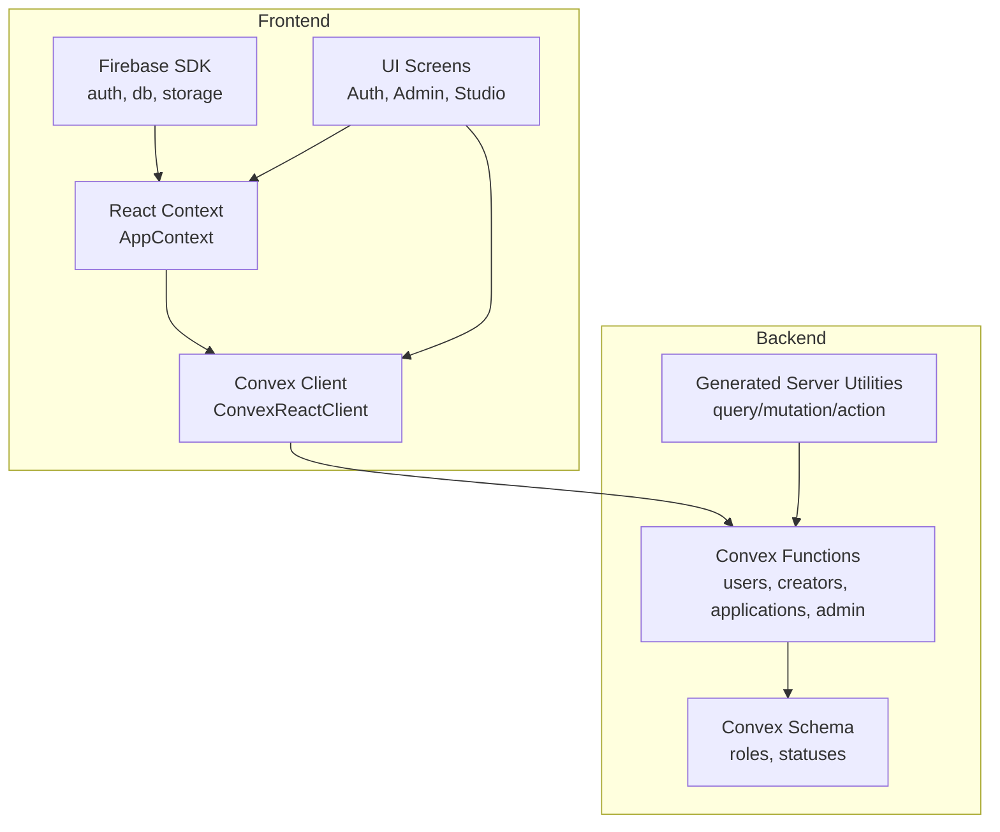
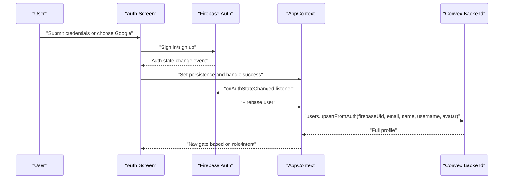
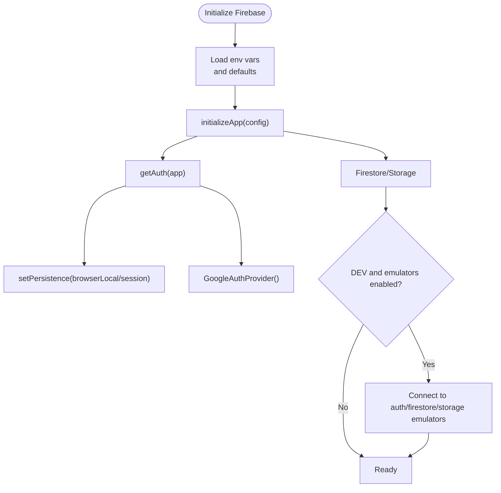
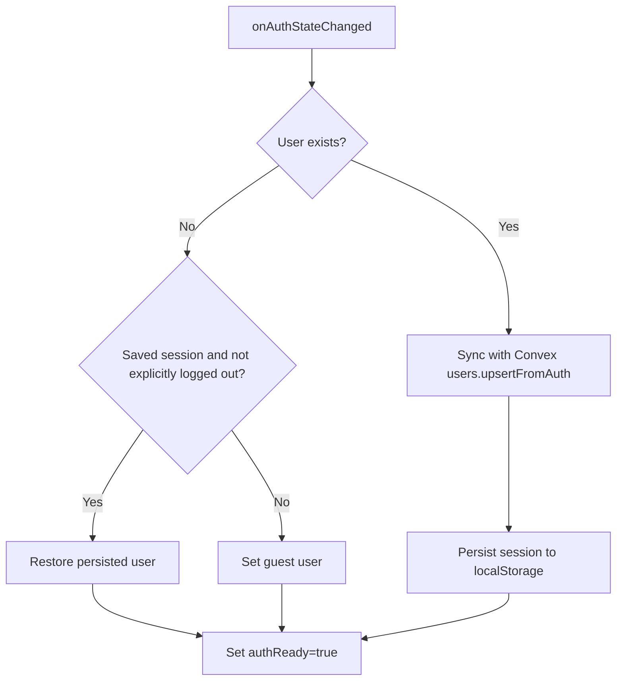
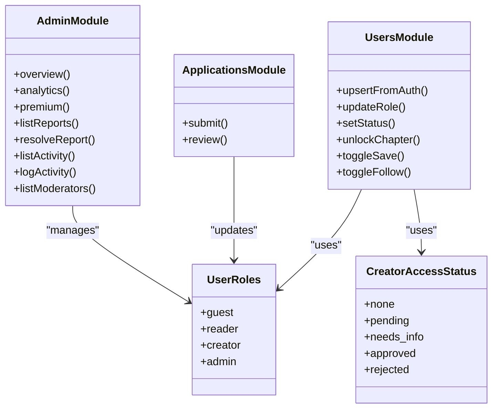
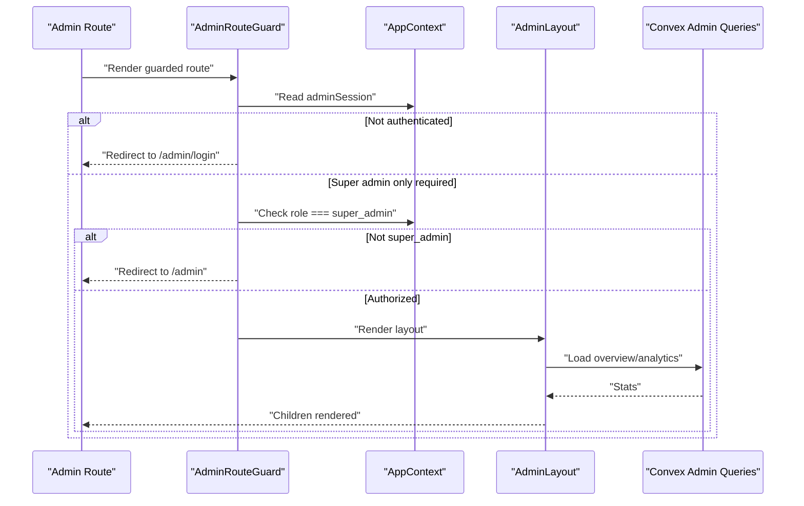
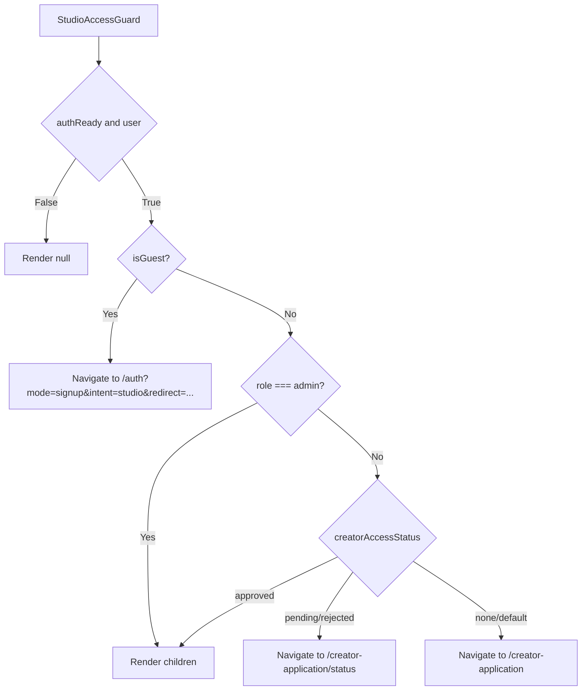
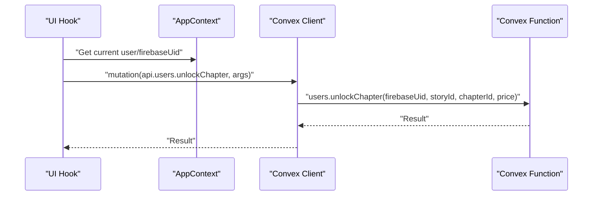
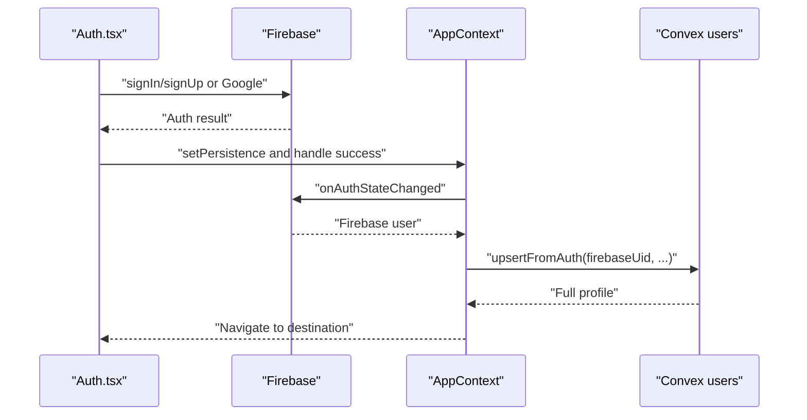
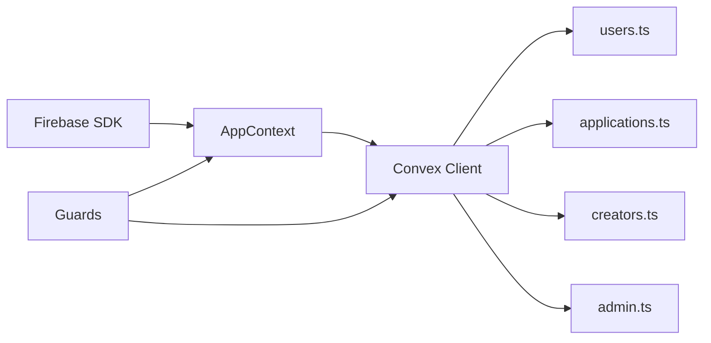

# Authentication & Authorization

<cite>
**Referenced Files in This Document**
- [firebase.ts](file://src/lib/firebase.ts)
- [convex.ts](file://src/lib/convex.ts)
- [AppContext.tsx](file://src/contexts/AppContext.tsx)
- [Auth.tsx](file://src/screens/Auth.tsx)
- [useConvex.ts](file://src/hooks/useConvex.ts)
- [schema.ts](file://convex/schema.ts)
- [users.ts](file://convex/users.ts)
- [applications.ts](file://convex/applications.ts)
- [creators.ts](file://convex/creators.ts)
- [admin.ts](file://convex/admin.ts)
- [AdminRouteGuard.tsx](file://src/components/admin/AdminRouteGuard.tsx)
- [AdminLayout.tsx](file://src/components/admin/AdminLayout.tsx)
- [StudioAccessGuard.tsx](file://src/components/StudioAccessGuard.tsx)
- [server.js](file://convex/_generated/server.js)
</cite>

## Table of Contents
1. [Introduction](#introduction)
2. [Project Structure](#project-structure)
3. [Core Components](#core-components)
4. [Architecture Overview](#architecture-overview)
5. [Detailed Component Analysis](#detailed-component-analysis)
6. [Dependency Analysis](#dependency-analysis)
7. [Performance Considerations](#performance-considerations)
8. [Troubleshooting Guide](#troubleshooting-guide)
9. [Conclusion](#conclusion)
10. [Appendices](#appendices)

## Introduction
This document explains the authentication and authorization mechanisms across the frontend and backend. It covers Firebase authentication integration, session management, user context propagation, Convex function authentication patterns, role-based access control, and permission systems. It also documents the authentication flow from the frontend to backend, token refresh mechanisms, session persistence, API key management, OAuth integration patterns, and third-party authentication providers. Security best practices, examples of protected API calls, role-checking patterns, and user context usage in Convex functions are included, along with common authentication issues, debugging techniques, and security considerations.

## Project Structure
Authentication spans three layers:
- Frontend authentication and session management via Firebase and a React context
- Convex server functions that enforce access control and manage user roles
- Admin and creator access guards that gate routes based on roles and statuses

**Diagram sources**
- [firebase.ts:1-55](file://src/lib/firebase.ts#L1-L55)
- [convex.ts:1-12](file://src/lib/convex.ts#L1-L12)
- [AppContext.tsx:509-712](file://src/contexts/AppContext.tsx#L509-L712)
- [schema.ts:24-67](file://convex/schema.ts#L24-L67)
- [users.ts:42-90](file://convex/users.ts#L42-L90)
- [server.js:11-94](file://convex/_generated/server.js#L11-L94)

**Section sources**
- [firebase.ts:1-55](file://src/lib/firebase.ts#L1-L55)
- [convex.ts:1-12](file://src/lib/convex.ts#L1-L12)
- [AppContext.tsx:509-712](file://src/contexts/AppContext.tsx#L509-L712)
- [schema.ts:24-67](file://convex/schema.ts#L24-L67)
- [server.js:11-94](file://convex/_generated/server.js#L11-L94)

## Core Components
- Firebase authentication integration:
  - Initializes Firebase app and services
  - Configures auth persistence (session/local)
  - Connects to emulators in development
  - Exposes auth, db, storage, and Google provider
- React authentication context:
  - Listens to Firebase auth state
  - Syncs user to Convex on sign-in
  - Persists authenticated sessions to localStorage
  - Provides actions: sign-in, sign-up, Google sign-in, reset password, guest mode
- Convex schema and functions:
  - Defines user roles and creator access statuses
  - Upserts users from Firebase, sets default roles and premium status
  - Manages creator applications and role promotion
  - Enforces admin roles and permissions
- Guards and navigation:
  - AdminRouteGuard and AdminLayout for admin-only areas
  - StudioAccessGuard for creator studio access control

**Section sources**
- [firebase.ts:12-55](file://src/lib/firebase.ts#L12-L55)
- [AppContext.tsx:612-680](file://src/contexts/AppContext.tsx#L612-L680)
- [AppContext.tsx:279-316](file://src/contexts/AppContext.tsx#L279-L316)
- [schema.ts:4-17](file://convex/schema.ts#L4-L17)
- [users.ts:42-90](file://convex/users.ts#L42-L90)
- [applications.ts:70-118](file://convex/applications.ts#L70-L118)
- [admin.ts:179-244](file://convex/admin.ts#L179-L244)
- [AdminRouteGuard.tsx:10-23](file://src/components/admin/AdminRouteGuard.tsx#L10-L23)
- [StudioAccessGuard.tsx:9-35](file://src/components/StudioAccessGuard.tsx#L9-L35)

## Architecture Overview
The system integrates Firebase for identity and Convex for data and access control. The flow:
- User authenticates via Firebase (email/password or Google)
- AppContext persists the session and syncs with Convex
- Convex functions enforce roles and statuses for data access
- Guards restrict access to admin and creator studio routes

**Diagram sources**
- [Auth.tsx:68-102](file://src/screens/Auth.tsx#L68-L102)
- [Auth.tsx:108-128](file://src/screens/Auth.tsx#L108-L128)
- [AppContext.tsx:650-680](file://src/contexts/AppContext.tsx#L650-L680)
- [users.ts:42-90](file://convex/users.ts#L42-L90)

## Detailed Component Analysis

### Firebase Authentication Integration
- Initialization and emulator connectivity
- Auth persistence configuration (session vs local)
- Google OAuth provider export
- Environment-driven configuration with fallbacks

**Diagram sources**
- [firebase.ts:6-55](file://src/lib/firebase.ts#L6-L55)

**Section sources**
- [firebase.ts:6-55](file://src/lib/firebase.ts#L6-L55)

### Session Management and User Context Propagation
- onAuthStateChanged listener restores persisted sessions or falls back to guest
- Syncs Firebase user to Convex to upsert or fetch profile
- Persists authenticated sessions to localStorage keyed by user state
- Provides guest mode and explicit logout markers

**Diagram sources**
- [AppContext.tsx:650-680](file://src/contexts/AppContext.tsx#L650-L680)
- [AppContext.tsx:301-316](file://src/contexts/AppContext.tsx#L301-L316)
- [users.ts:42-90](file://convex/users.ts#L42-L90)

**Section sources**
- [AppContext.tsx:650-680](file://src/contexts/AppContext.tsx#L650-L680)
- [AppContext.tsx:301-316](file://src/contexts/AppContext.tsx#L301-L316)
- [users.ts:42-90](file://convex/users.ts#L42-L90)

### Convex Function Authentication Patterns and Role-Based Access Control
- Schema defines user roles and creator access statuses
- users.upsertFromAuth creates or updates user records with default role and premium status
- applications.submit and applications.review promote users to creator upon approval
- admin module exposes admin-only queries and mutations
- Guards enforce access based on role and status

**Diagram sources**
- [schema.ts:4-17](file://convex/schema.ts#L4-L17)
- [users.ts:42-111](file://convex/users.ts#L42-L111)
- [applications.ts:70-223](file://convex/applications.ts#L70-L223)
- [admin.ts:31-244](file://convex/admin.ts#L31-L244)

**Section sources**
- [schema.ts:4-17](file://convex/schema.ts#L4-L17)
- [users.ts:42-111](file://convex/users.ts#L42-L111)
- [applications.ts:70-223](file://convex/applications.ts#L70-L223)
- [admin.ts:31-244](file://convex/admin.ts#L31-L244)

### Admin Authentication and Permissions
- Admin session stored in localStorage and React state
- AdminRouteGuard enforces admin presence and optional super_admin requirement
- AdminLayout renders navigation filtered by role
- Admin queries and mutations are exposed via Convex

**Diagram sources**
- [AdminRouteGuard.tsx:10-23](file://src/components/admin/AdminRouteGuard.tsx#L10-L23)
- [AdminLayout.tsx:56-94](file://src/components/admin/AdminLayout.tsx#L56-L94)
- [admin.ts:31-128](file://convex/admin.ts#L31-L128)

**Section sources**
- [AdminRouteGuard.tsx:10-23](file://src/components/admin/AdminRouteGuard.tsx#L10-L23)
- [AdminLayout.tsx:56-94](file://src/components/admin/AdminLayout.tsx#L56-L94)
- [admin.ts:31-128](file://convex/admin.ts#L31-L128)

### Creator Studio Access Control
- StudioAccessGuard redirects guests to Auth with intent
- For non-guests, checks role and creatorAccessStatus to allow or redirect
- Supports admin bypass and pending/rejected states

**Diagram sources**
- [StudioAccessGuard.tsx:9-35](file://src/components/StudioAccessGuard.tsx#L9-L35)

**Section sources**
- [StudioAccessGuard.tsx:9-35](file://src/components/StudioAccessGuard.tsx#L9-L35)

### Protected API Calls and User Context Usage in Convex
- useConvex hooks wrap Convex mutations/queries and pass user context
- Example: unlockChapter requires firebaseUid and price
- Example: updateProfile uses firebaseUid to locate user
- Payment flow uses Convex to call Paystack and passes metadata including firebaseUid

**Diagram sources**
- [useConvex.ts:167-171](file://src/hooks/useConvex.ts#L167-L171)
- [useConvex.ts:205-212](file://src/hooks/useConvex.ts#L205-L212)
- [users.ts:269-310](file://convex/users.ts#L269-L310)

**Section sources**
- [useConvex.ts:167-171](file://src/hooks/useConvex.ts#L167-L171)
- [useConvex.ts:205-212](file://src/hooks/useConvex.ts#L205-L212)
- [users.ts:269-310](file://convex/users.ts#L269-L310)

### Authentication Flow: Frontend to Backend
- Auth.tsx handles form submission, sets persistence, and triggers Firebase sign-in
- AppContext.onAuthStateChanged listens for state changes, syncs with Convex, and persists session
- Convex users.upsertFromAuth ensures a user record exists with default role and premium status
- Navigation depends on role and intent

**Diagram sources**
- [Auth.tsx:68-102](file://src/screens/Auth.tsx#L68-L102)
- [Auth.tsx:108-128](file://src/screens/Auth.tsx#L108-L128)
- [AppContext.tsx:650-680](file://src/contexts/AppContext.tsx#L650-L680)
- [users.ts:42-90](file://convex/users.ts#L42-L90)

**Section sources**
- [Auth.tsx:68-102](file://src/screens/Auth.tsx#L68-L102)
- [Auth.tsx:108-128](file://src/screens/Auth.tsx#L108-L128)
- [AppContext.tsx:650-680](file://src/contexts/AppContext.tsx#L650-L680)
- [users.ts:42-90](file://convex/users.ts#L42-L90)

## Dependency Analysis
- Frontend depends on Firebase SDK and Convex client
- AppContext orchestrates Firebase state and Convex synchronization
- Convex functions depend on schema-defined roles and statuses
- Guards depend on AppContext state and Convex data

**Diagram sources**
- [firebase.ts:1-55](file://src/lib/firebase.ts#L1-L55)
- [convex.ts:1-12](file://src/lib/convex.ts#L1-L12)
- [AppContext.tsx:509-712](file://src/contexts/AppContext.tsx#L509-L712)
- [users.ts:1-360](file://convex/users.ts#L1-L360)
- [applications.ts:1-224](file://convex/applications.ts#L1-L224)
- [creators.ts:1-87](file://convex/creators.ts#L1-L87)
- [admin.ts:1-364](file://convex/admin.ts#L1-L364)

**Section sources**
- [firebase.ts:1-55](file://src/lib/firebase.ts#L1-L55)
- [convex.ts:1-12](file://src/lib/convex.ts#L1-L12)
- [AppContext.tsx:509-712](file://src/contexts/AppContext.tsx#L509-L712)
- [users.ts:1-360](file://convex/users.ts#L1-L360)
- [applications.ts:1-224](file://convex/applications.ts#L1-L224)
- [creators.ts:1-87](file://convex/creators.ts#L1-L87)
- [admin.ts:1-364](file://convex/admin.ts#L1-L364)

## Performance Considerations
- Minimize repeated Convex calls by batching queries and caching in React state
- Use indexes efficiently (e.g., by_firebaseUid, by_username) to reduce query cost
- Debounce or throttle frequent UI interactions that trigger mutations
- Persist sessions locally to avoid repeated network calls during page reloads
- Avoid unnecessary re-renders by memoizing derived data and callbacks

## Troubleshooting Guide
Common issues and resolutions:
- Auth state not persisting:
  - Verify localStorage keys and that explicit logout marker is not present
  - Confirm authPersistenceReady resolves before setting persistence
- Guest fallback unexpectedly active:
  - Check persisted session validity and explicit logout flag
- Firebase emulator connection errors:
  - Ensure emulator ports are free and environment variables are set
- Convex disabled warnings:
  - Confirm VITE_CONVEX_URL is set; otherwise, Convex features are disabled
- Role or status not updating:
  - Verify applications.review updates user role and creator profile creation
  - Check admin activity logging for audit trail

**Section sources**
- [AppContext.tsx:301-316](file://src/contexts/AppContext.tsx#L301-L316)
- [AppContext.tsx:650-680](file://src/contexts/AppContext.tsx#L650-L680)
- [firebase.ts:34-52](file://src/lib/firebase.ts#L34-L52)
- [convex.ts:5-7](file://src/lib/convex.ts#L5-L7)
- [applications.ts:120-223](file://convex/applications.ts#L120-L223)
- [admin.ts:209-244](file://convex/admin.ts#L209-L244)

## Conclusion
The system combines Firebase for identity and Convex for robust access control and data operations. Session persistence, role-based routing, and creator application workflows provide a cohesive authentication and authorization model. Guards and schema-enforced roles ensure secure access to admin and creator-only features. Following the best practices and troubleshooting steps outlined here will help maintain a secure and reliable authentication pipeline.

## Appendices

### Security Best Practices
- Prefer local persistence only for trusted devices; use session persistence for shared devices
- Enforce HTTPS in production and secure cookies for any server-side sessions
- Validate and sanitize all inputs in Convex functions
- Limit admin privileges and use super_admin sparingly
- Rotate secrets and monitor admin activity logs
- Use index-backed queries to prevent expensive scans

### Token Storage and Secure Communication
- No JWT tokens are used in the referenced code; rely on Firebase Auth tokens managed by the SDK
- Ensure Convex URL is served over HTTPS
- Avoid storing sensitive data in localStorage; keep only non-sensitive session identifiers

### Examples Index
- Protected API calls:
  - [useConvex.ts:167-171](file://src/hooks/useConvex.ts#L167-L171)
  - [useConvex.ts:205-212](file://src/hooks/useConvex.ts#L205-L212)
- Role checking patterns:
  - [AdminRouteGuard.tsx:10-23](file://src/components/admin/AdminRouteGuard.tsx#L10-L23)
  - [StudioAccessGuard.tsx:25-34](file://src/components/StudioAccessGuard.tsx#L25-L34)
- User context usage in Convex:
  - [users.ts:42-90](file://convex/users.ts#L42-L90)
  - [applications.ts:70-118](file://convex/applications.ts#L70-L118)