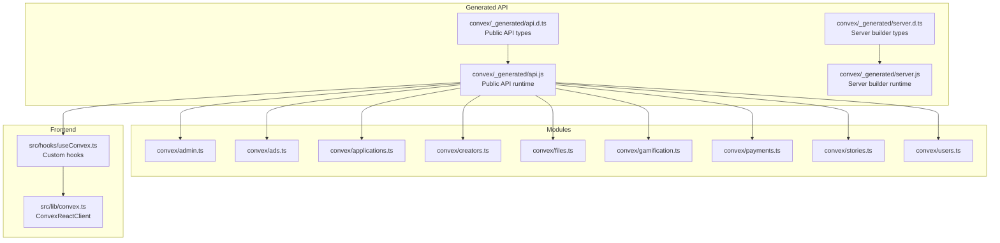
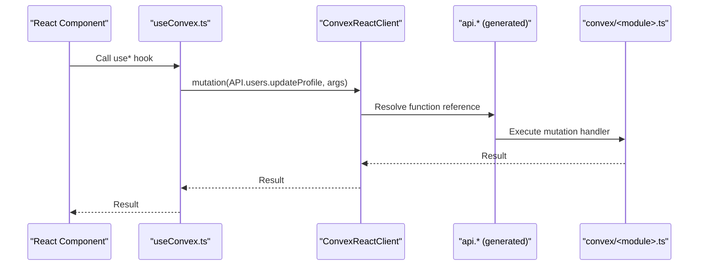
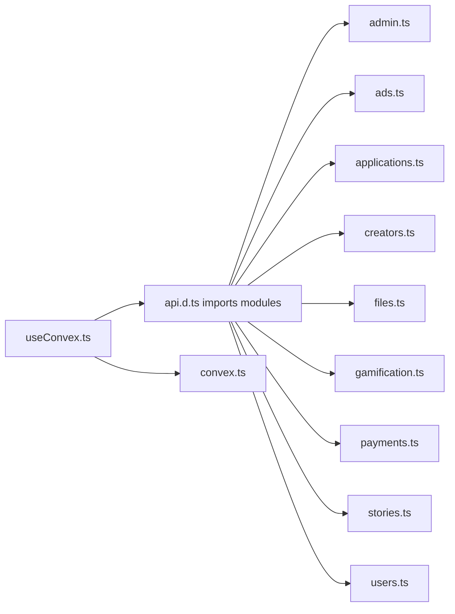

# Convex Generated API

<cite>
**Referenced Files in This Document**
- [api.d.ts](file://convex/_generated/api.d.ts)
- [api.js](file://convex/_generated/api.js)
- [server.d.ts](file://convex/_generated/server.d.ts)
- [server.js](file://convex/_generated/server.js)
- [admin.ts](file://convex/admin.ts)
- [ads.ts](file://convex/ads.ts)
- [applications.ts](file://convex/applications.ts)
- [creators.ts](file://convex/creators.ts)
- [files.ts](file://convex/files.ts)
- [gamification.ts](file://convex/gamification.ts)
- [payments.ts](file://convex/payments.ts)
- [stories.ts](file://convex/stories.ts)
- [users.ts](file://convex/users.ts)
- [convex.ts](file://src/lib/convex.ts)
- [useConvex.ts](file://src/hooks/useConvex.ts)
</cite>

## Table of Contents
1. [Introduction](#introduction)
2. [Project Structure](#project-structure)
3. [Core Components](#core-components)
4. [Architecture Overview](#architecture-overview)
5. [Detailed Component Analysis](#detailed-component-analysis)
6. [Dependency Analysis](#dependency-analysis)
7. [Performance Considerations](#performance-considerations)
8. [Troubleshooting Guide](#troubleshooting-guide)
9. [Conclusion](#conclusion)
10. [Appendices](#appendices)

## Introduction
This document describes the Convex-generated API system used by the Lemonade application. It explains how the TypeScript definitions and JavaScript runtime are auto-generated and consumed by the frontend. It documents the module-based organization across admin, ads, applications, creators, files, gamification, payments, stories, and users modules. It also details the API filtering mechanism that separates public (api.*) from internal (internal.*) functions, authentication requirements, error handling patterns, and practical usage examples for calling Convex functions from React components via custom hooks.

## Project Structure
The Convex-generated API consists of:
- Public and internal API utilities that wrap all server-defined functions
- Strongly-typed utilities for authoring server-side functions (queries, mutations, actions)
- Module-specific function definitions under convex/<module>.ts
- Frontend integration via a ConvexReactClient and custom React hooks

**Diagram sources**
- [api.d.ts:1-78](file://convex/_generated/api.d.ts#L1-L78)
- [api.js:1-24](file://convex/_generated/api.js#L1-L24)
- [server.d.ts:1-144](file://convex/_generated/server.d.ts#L1-L144)
- [server.js:1-94](file://convex/_generated/server.js#L1-L94)
- [admin.ts:1-364](file://convex/admin.ts#L1-L364)
- [ads.ts:1-360](file://convex/ads.ts#L1-L360)
- [applications.ts:1-224](file://convex/applications.ts#L1-L224)
- [creators.ts:1-87](file://convex/creators.ts#L1-L87)
- [files.ts:1-21](file://convex/files.ts#L1-L21)
- [gamification.ts:1-331](file://convex/gamification.ts#L1-L331)
- [payments.ts:1-291](file://convex/payments.ts#L1-L291)
- [stories.ts:1-180](file://convex/stories.ts#L1-L180)
- [users.ts:1-360](file://convex/users.ts#L1-L360)
- [convex.ts:1-12](file://src/lib/convex.ts#L1-L12)
- [useConvex.ts:1-213](file://src/hooks/useConvex.ts#L1-L213)

**Section sources**
- [api.d.ts:1-78](file://convex/_generated/api.d.ts#L1-L78)
- [api.js:1-24](file://convex/_generated/api.js#L1-L24)
- [server.d.ts:1-144](file://convex/_generated/server.d.ts#L1-L144)
- [server.js:1-94](file://convex/_generated/server.js#L1-L94)

## Core Components
- Public API utility (api.*): Exposes only functions marked as public in the server builders. Types and runtime are generated.
- Internal API utility (internal.*): Exposes only functions marked as internal in the server builders. Intended for server-to-server or internal orchestration.
- Server builders (query, mutation, action, internalQuery, internalMutation, internalAction, httpAction): Typed wrappers to define functions with explicit visibility and capabilities.

Key behaviors:
- api.* filters to functions with public visibility.
- internal.* filters to functions with internal visibility.
- The runtime exports anyApi for both, but the types restrict usage to the appropriate visibility.

**Section sources**
- [api.d.ts:51-75](file://convex/_generated/api.d.ts#L51-L75)
- [api.js:13-23](file://convex/_generated/api.js#L13-L23)
- [server.d.ts:24-96](file://convex/_generated/server.d.ts#L24-L96)
- [server.js:21-93](file://convex/_generated/server.js#L21-L93)

## Architecture Overview
The frontend obtains a typed reference to a function via api.<module>.<function>, then invokes it through the ConvexReactClient. The client routes the call to the Convex backend, which executes the corresponding server-side function definition.

**Diagram sources**
- [useConvex.ts:167-171](file://src/hooks/useConvex.ts#L167-L171)
- [api.js:21-22](file://convex/_generated/api.js#L21-L22)
- [users.ts:183-243](file://convex/users.ts#L183-L243)

**Section sources**
- [convex.ts:1-12](file://src/lib/convex.ts#L1-L12)
- [useConvex.ts:1-213](file://src/hooks/useConvex.ts#L1-L213)

## Detailed Component Analysis

### Module: admin
- Purpose: Administrative analytics, reporting, activity logging, fraud detection, and spin reward management.
- Visibility: Public (exposed via api.*).
- Notable functions:
  - Queries: overview, analytics, premium, listReports, listActivity, listModerators, listSpinRewards, listFraudEvents
  - Mutations: createReport, resolveReport, logActivity, createSpinReward, updateSpinReward, deleteSpinReward, scanEngagementForFraud, resolveFraudEvent
- Authentication: Typically requires admin credentials; enforcement occurs at the caller layer.
- Error handling: Throws descriptive errors for invalid states (e.g., unresolved report status).

Usage pattern:
- Call api.admin.<function> with typed arguments.
- Handle returned data or thrown errors in the hook.

**Section sources**
- [admin.ts:31-364](file://convex/admin.ts#L31-L364)

### Module: ads
- Purpose: Ad campaign management, targeting, and revenue attribution.
- Visibility: Public.
- Notable functions:
  - selectForContent (mutation): Decide whether to show an ad based on user, content, and frequency caps.
  - trackEvent (mutation): Record impressions/completions/skips/clicks and compute revenue splits.
  - creatorSummary (query): Aggregated ad metrics per creator.
  - adminSummary (query): Platform-wide ad metrics.
  - listCampaigns (query), createCampaign (mutation), updateCampaignStatus (mutation).
- Validation: Uses union validators for content types, placements, and event types.
- Revenue: Computes creator and platform shares based on CPM and event quality.

**Section sources**
- [ads.ts:105-360](file://convex/ads.ts#L105-L360)

### Module: applications
- Purpose: Creator application lifecycle (submit, review, status updates).
- Visibility: Public.
- Notable functions:
  - list, listByStatus, getById (queries)
  - submit (mutation): Creates an application and attempts to update user role/access.
  - review (mutation): Updates application status, user role, and optionally creates/upserts creator profile.
- Data enrichment: Joins application records with user data for richer responses.

**Section sources**
- [applications.ts:32-224](file://convex/applications.ts#L32-L224)

### Module: creators
- Purpose: Creator profiles and follower counts.
- Visibility: Public.
- Notable functions:
  - list, getByUsername (queries)
  - upsert (mutation): Upserts creator profile; normalizes categories.
  - adjustFollowerCount (mutation): Adjusts follower count safely.

**Section sources**
- [creators.ts:7-87](file://convex/creators.ts#L7-L87)

### Module: files
- Purpose: Storage operations for uploads and URLs.
- Visibility: Public.
- Notable functions:
  - generateUploadUrl (mutation): Returns a pre-signed upload URL.
  - getUrl (mutation): Resolves a stored file URL; throws if not found.

**Section sources**
- [files.ts:4-21](file://convex/files.ts#L4-L21)

### Module: gamification
- Purpose: Engagement tracking, XP, streaks, weekly spins, and currencies.
- Visibility: Public.
- Notable functions:
  - getSpinInventory (query)
  - recordEngagement (mutation): Validates engagement and awards XP and Lemon Coins.
  - eligibleForWeeklySpin (query), performWeeklySpin (mutation): Weighted spin mechanics.
  - useStreakInsurance (mutation): Deducts Lemon Coins to extend streak protection.
  - getUserStreak (query), getUserCurrencies (query).

**Section sources**
- [gamification.ts:4-331](file://convex/gamification.ts#L4-L331)

### Module: payments
- Purpose: Wallet transactions, premium activation, payouts, and Paystack integration helpers.
- Visibility: Public.
- Notable functions:
  - list, listByUser (queries)
  - creatorPayoutSummary (query): Aggregates earnings and recent support transactions.
  - record (mutation): General transaction recorder.
  - creditWalletAfterPaystack (mutation): Credits wallet after successful Paystack top-up.
  - activatePremiumAfterPaystack (mutation): Activates premium with plan and billing cycle.
  - cancelPremium (mutation): Cancels premium at period end.
- Metadata: Rich metadata for linking transactions to users, creators, and providers.

**Section sources**
- [payments.ts:4-291](file://convex/payments.ts#L4-L291)

### Module: stories
- Purpose: Story lifecycle management (list, create, update, publish, view increments).
- Visibility: Public.
- Notable functions:
  - listPublished, listFeatured (queries)
  - getByExternalId (query)
  - listByCreator (query)
  - create (mutation): Inserts a new story with defaults and validations.
  - update (mutation): Partial updates by externalId.
  - incrementViews (mutation): Increments view count.
  - publish (mutation): Publishes a story with safety checks.

**Section sources**
- [stories.ts:6-180](file://convex/stories.ts#L6-L180)

### Module: users
- Purpose: User profiles, roles, statuses, notifications, unlocks, and balances.
- Visibility: Public.
- Notable functions:
  - list, getByUsername, getByFirebaseUid (queries)
  - upsertFromAuth (mutation): Upserts user on auth sign-in.
  - updateRole (mutation), setStatus (mutation)
  - addWalletBalance (mutation)
  - getFullProfile (query): Aggregates user data with related collections.
  - updateProfile (mutation): Username change policy and validation.
  - createNotification (mutation)
  - unlockChapter (mutation): Deducts balance and records transaction.
  - toggleSave (mutation), toggleFollow (mutation)

**Section sources**
- [users.ts:15-360](file://convex/users.ts#L15-L360)

## Dependency Analysis
- Generated API depends on module files via imports in the generated d.ts.
- Frontend hooks depend on the generated api.* references and the ConvexReactClient.
- Server builders (query/mutation/action) are used inside each module to define functions.

**Diagram sources**
- [api.d.ts:11-25](file://convex/_generated/api.d.ts#L11-L25)
- [admin.ts:1-364](file://convex/admin.ts#L1-L364)
- [ads.ts:1-360](file://convex/ads.ts#L1-L360)
- [applications.ts:1-224](file://convex/applications.ts#L1-L224)
- [creators.ts:1-87](file://convex/creators.ts#L1-L87)
- [files.ts:1-21](file://convex/files.ts#L1-L21)
- [gamification.ts:1-331](file://convex/gamification.ts#L1-L331)
- [payments.ts:1-291](file://convex/payments.ts#L1-L291)
- [stories.ts:1-180](file://convex/stories.ts#L1-L180)
- [users.ts:1-360](file://convex/users.ts#L1-L360)
- [useConvex.ts:1-213](file://src/hooks/useConvex.ts#L1-L213)
- [convex.ts:1-12](file://src/lib/convex.ts#L1-L12)

**Section sources**
- [api.d.ts:11-25](file://convex/_generated/api.d.ts#L11-L25)
- [useConvex.ts:1-213](file://src/hooks/useConvex.ts#L1-L213)

## Performance Considerations
- Prefer indexed queries and targeted reads to minimize collection scans.
- Batch reads/writes when possible (e.g., Promise.all) to reduce round-trips.
- Use minimal field projections and avoid unnecessary joins in queries.
- Limit result sizes with take() and order() to control payload sizes.
- Cache frequently accessed data in the frontend where safe and appropriate.

## Troubleshooting Guide
Common issues and resolutions:
- Missing Convex URL: If VITE_CONVEX_URL is not set, the ConvexReactClient is disabled. Ensure environment configuration is present.
- Function not found: Verify the function exists in the correct module and is exported as public.
- Type mismatches: Ensure arguments match the validators defined in the module; mismatched types cause runtime errors.
- Authorization failures: Some functions require authenticated users or admin privileges; ensure the caller is properly authenticated.
- Duplicate operations: Functions like story creation check for duplicates; handle “already exists” errors gracefully.
- Payment verification: After payment, call the appropriate mutation to credit wallet or activate premium; otherwise, the backend may not reflect the transaction.

**Section sources**
- [convex.ts:5-7](file://src/lib/convex.ts#L5-L7)
- [stories.ts:75-84](file://convex/stories.ts#L75-L84)
- [payments.ts:132-139](file://convex/payments.ts#L132-L139)

## Conclusion
The Convex-generated API provides a strongly-typed, module-based interface for frontend consumption. The api.* namespace exposes public functions, while internal.* isolates server-internal functions. Modules encapsulate domain logic with clear validation and error handling. Frontend integration is streamlined via custom hooks that call the generated API through the ConvexReactClient.

## Appendices

### API Filtering Mechanism
- api.*: Filters to functions with public visibility.
- internal.*: Filters to functions with internal visibility.
- Regeneration: Run the documented command to refresh generated files when server functions change.

**Section sources**
- [api.d.ts:59-75](file://convex/_generated/api.d.ts#L59-L75)
- [api.js:21-22](file://convex/_generated/api.js#L21-L22)

### Function Reference Patterns
- Import the generated API reference in your hook or service:
  - import { api } from "path/to/convex/_generated/api"
- Invoke a function with typed arguments:
  - await convex.mutation(api.<module>.<function>, args)
- Handle results and errors in your component or service layer.

**Section sources**
- [useConvex.ts:167-171](file://src/hooks/useConvex.ts#L167-L171)

### Authentication Requirements
- Many functions operate on authenticated users (e.g., users, payments, stories).
- Ensure the user is signed in before invoking user-scoped functions.
- Admin functions require administrative privileges at the caller layer.

**Section sources**
- [useConvex.ts:67-71](file://src/hooks/useConvex.ts#L67-L71)
- [payments.ts:113-172](file://convex/payments.ts#L113-L172)

### Error Handling Patterns
- Functions throw descriptive errors for invalid states or missing resources.
- Frontend hooks should catch and surface errors to users.
- Validate inputs early (client-side) to reduce backend errors.

**Section sources**
- [ads.ts:178-180](file://convex/ads.ts#L178-L180)
- [users.ts:198-199](file://convex/users.ts#L198-L199)

### Practical Examples: Calling Functions from the Frontend
- Update user profile:
  - Call useUpdateUserProfile with typed args; the hook resolves api.users.updateProfile and invokes it via ConvexReactClient.
- Unlock a chapter:
  - Call useUnlockChapter with firebaseUid, storyId, chapterId, and price; the hook resolves api.users.unlockChapter.
- Create a story:
  - Call useCreateStory with story fields; the hook resolves api.stories.create.
- Publish a story:
  - Call usePublishStory with externalId; the hook resolves api.stories.publish.

**Section sources**
- [useConvex.ts:167-171](file://src/hooks/useConvex.ts#L167-L171)
- [useConvex.ts:205-212](file://src/hooks/useConvex.ts#L205-L212)
- [useConvex.ts:179-183](file://src/hooks/useConvex.ts#L179-L183)
- [useConvex.ts:200-204](file://src/hooks/useConvex.ts#L200-L204)

### API Versioning and Regeneration
- Regenerate the API when server functions change:
  - Use the documented command to refresh generated TypeScript and JS files.
- Keep generated files under version control to ensure reproducible builds.

**Section sources**
- [api.d.ts:7-7](file://convex/_generated/api.d.ts#L7-L7)
- [api.js:7-7](file://convex/_generated/api.js#L7-L7)

### Integration with React Components Through Custom Hooks
- Initialize ConvexReactClient with VITE_CONVEX_URL.
- Consume typed API references via hooks to call server functions.
- Centralize error handling and loading states in hooks.

**Section sources**
- [convex.ts:1-12](file://src/lib/convex.ts#L1-L12)
- [useConvex.ts:1-213](file://src/hooks/useConvex.ts#L1-L213)