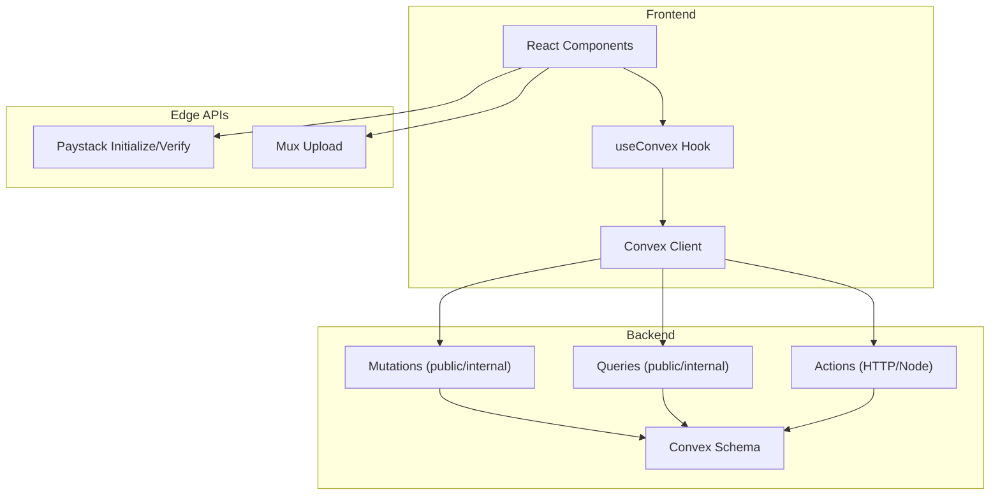
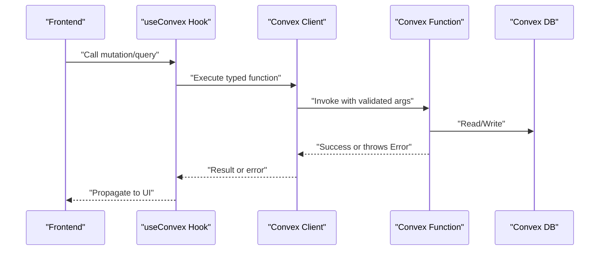
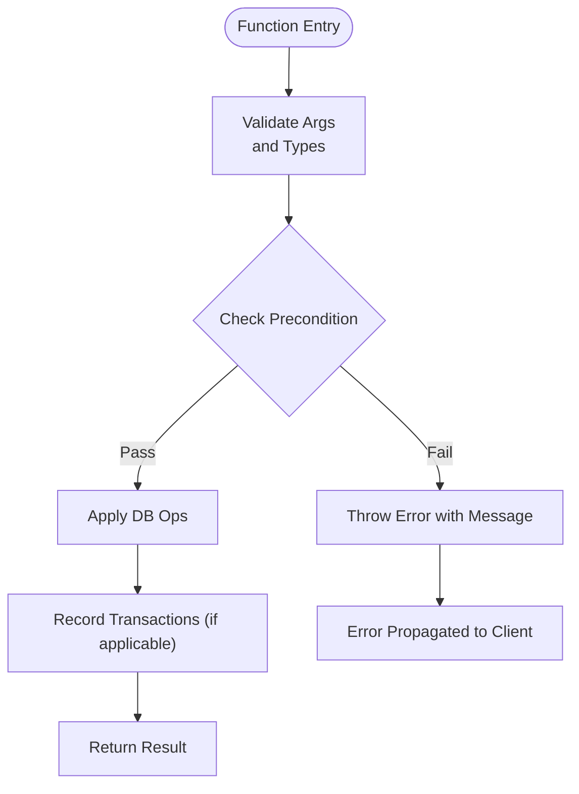
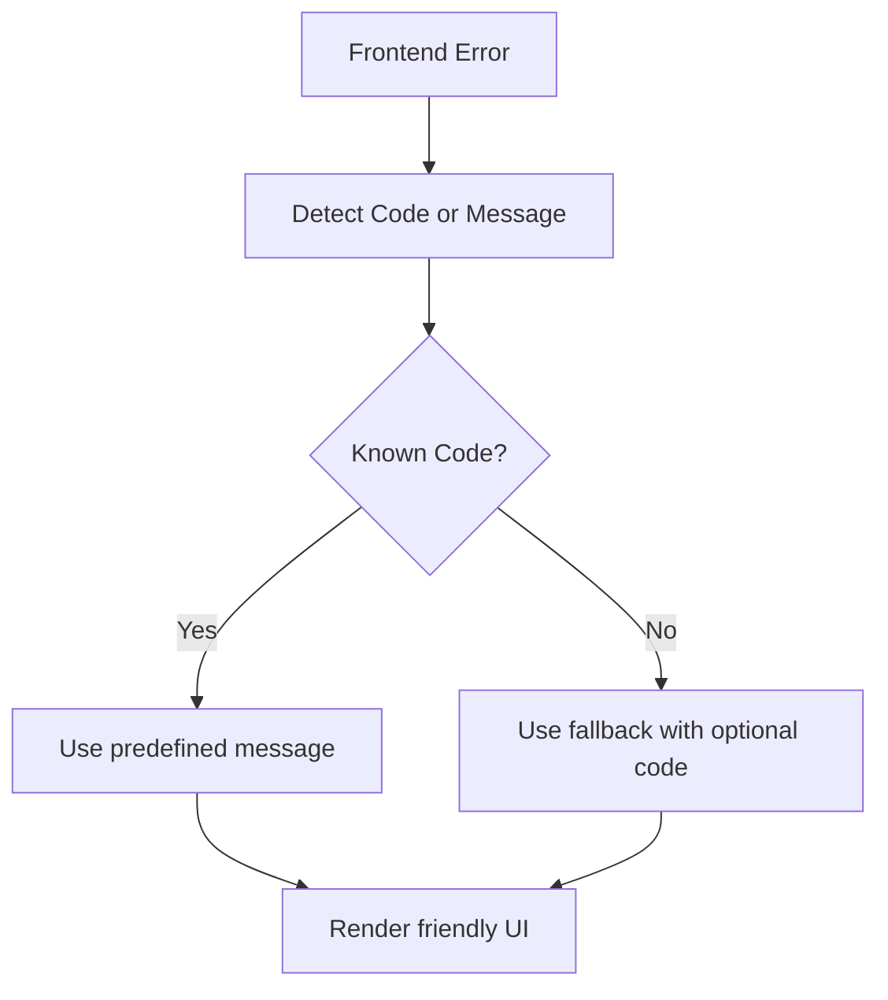
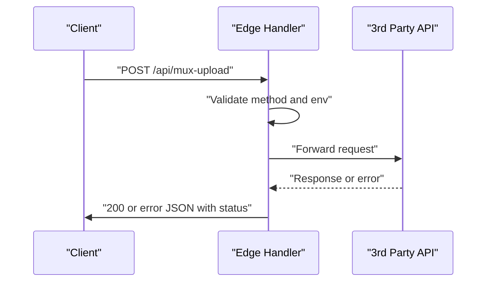
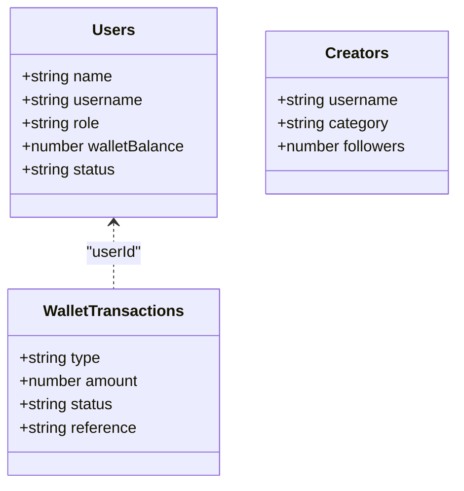
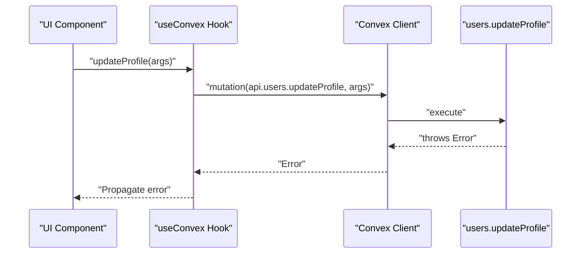
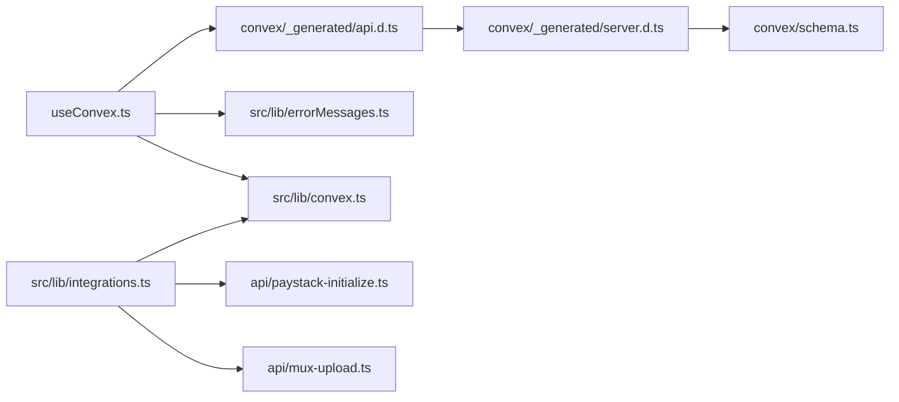

# Error Handling & Validation

<cite>
**Referenced Files in This Document**
- [errorMessages.ts](file://src/lib/errorMessages.ts)
- [convex.ts](file://src/lib/convex.ts)
- [useConvex.ts](file://src/hooks/useConvex.ts)
- [integrations.ts](file://src/lib/integrations.ts)
- [schema.ts](file://convex/schema.ts)
- [server.d.ts](file://convex/_generated/server.d.ts)
- [users.ts](file://convex/users.ts)
- [creators.ts](file://convex/creators.ts)
- [payments.ts](file://convex/payments.ts)
- [admin.ts](file://convex/admin.ts)
- [mux-upload.ts](file://api/mux-upload.ts)
- [paystack-initialize.ts](file://api/paystack-initialize.ts)
- [paystack-verify.ts](file://api/paystack-verify.ts)
</cite>

## Table of Contents
1. [Introduction](#introduction)
2. [Project Structure](#project-structure)
3. [Core Components](#core-components)
4. [Architecture Overview](#architecture-overview)
5. [Detailed Component Analysis](#detailed-component-analysis)
6. [Dependency Analysis](#dependency-analysis)
7. [Performance Considerations](#performance-considerations)
8. [Troubleshooting Guide](#troubleshooting-guide)
9. [Conclusion](#conclusion)
10. [Appendices](#appendices)

## Introduction
This document describes error handling and validation patterns across the Lemonade APIs. It covers:
- Standard error response formats and HTTP status codes used by backend endpoints
- Input validation rules and data sanitization applied in Convex functions
- Security validation patterns and misuse prevention
- Error propagation from backend to frontend, including user-friendly messaging
- Retry mechanisms, timeouts, and graceful degradation
- Comprehensive error code reference and recommended actions
- Examples of handling network errors, validation failures, and business logic errors
- Logging patterns, monitoring, and debugging techniques for API integration
- Rate limiting and abuse prevention mechanisms

## Project Structure
The project combines:
- Frontend React integration with Convex via a typed client
- Backend Convex functions (queries, mutations, actions)
- Edge API handlers for third-party integrations (Mux, Paystack)
- Utility libraries for error mapping and integration status

**Diagram sources**
- [useConvex.ts:1-213](file://src/hooks/useConvex.ts#L1-L213)
- [convex.ts:1-12](file://src/lib/convex.ts#L1-L12)
- [server.d.ts:32-83](file://convex/_generated/server.d.ts#L32-L83)
- [schema.ts:24-495](file://convex/schema.ts#L24-L495)
- [paystack-initialize.ts:1-47](file://api/paystack-initialize.ts#L1-L47)
- [paystack-verify.ts:1-36](file://api/paystack-verify.ts#L1-L36)
- [mux-upload.ts:1-45](file://api/mux-upload.ts#L1-L45)

**Section sources**
- [useConvex.ts:1-213](file://src/hooks/useConvex.ts#L1-L213)
- [convex.ts:1-12](file://src/lib/convex.ts#L1-L12)
- [server.d.ts:32-83](file://convex/_generated/server.d.ts#L32-L83)
- [schema.ts:24-495](file://convex/schema.ts#L24-L495)
- [paystack-initialize.ts:1-47](file://api/paystack-initialize.ts#L1-L47)
- [paystack-verify.ts:1-36](file://api/paystack-verify.ts#L1-L36)
- [mux-upload.ts:1-45](file://api/mux-upload.ts#L1-L45)

## Core Components
- Convex client initialization and guardrails
- Typed query/mutation/action builders
- Schema-driven validation
- Frontend hook orchestration
- Third-party API handlers with explicit HTTP status codes
- Firebase auth error mapping for user-facing messages

Key implementation patterns:
- Throw Error instances in Convex functions to signal validation or business errors
- Return structured JSON with an error field and appropriate HTTP status codes in edge handlers
- Map Firebase auth errors to user-friendly messages with optional codes

**Section sources**
- [convex.ts:1-12](file://src/lib/convex.ts#L1-L12)
- [server.d.ts:32-83](file://convex/_generated/server.d.ts#L32-L83)
- [schema.ts:24-495](file://convex/schema.ts#L24-L495)
- [useConvex.ts:1-213](file://src/hooks/useConvex.ts#L1-L213)
- [errorMessages.ts:1-94](file://src/lib/errorMessages.ts#L1-L94)

## Architecture Overview
The system routes requests through React hooks to Convex functions or edge APIs. Convex functions enforce schema-based validation and business rules, while edge APIs validate inputs and propagate provider errors with standardized HTTP responses.

**Diagram sources**
- [useConvex.ts:167-171](file://src/hooks/useConvex.ts#L167-L171)
- [server.d.ts:32-83](file://convex/_generated/server.d.ts#L32-L83)
- [users.ts:183-243](file://convex/users.ts#L183-L243)

## Detailed Component Analysis

### Convex Functions: Validation and Business Errors
Convex functions implement:
- Schema-based argument validation via typed builders
- Runtime checks and explicit Error throws for invalid states
- Atomic writes and deterministic behavior guarantees

Representative validations and error patterns:
- Username normalization and regex validation with explicit error messages
- Unique username enforcement with temporal lock windows
- Insufficient balance and user existence checks
- Transaction deduplication and provider payload validation

**Diagram sources**
- [users.ts:9-13](file://convex/users.ts#L9-L13)
- [users.ts:210-235](file://convex/users.ts#L210-L235)
- [payments.ts:123-130](file://convex/payments.ts#L123-L130)
- [payments.ts:194-206](file://convex/payments.ts#L194-L206)

**Section sources**
- [users.ts:9-13](file://convex/users.ts#L9-L13)
- [users.ts:210-235](file://convex/users.ts#L210-L235)
- [users.ts:276-282](file://convex/users.ts#L276-L282)
- [payments.ts:123-130](file://convex/payments.ts#L123-L130)
- [payments.ts:186-188](file://convex/payments.ts#L186-L188)
- [payments.ts:194-206](file://convex/payments.ts#L194-L206)

### Frontend Error Mapping and User-Friendly Messages
Firebase auth errors are mapped to user-friendly titles and messages, with optional error codes. Prefix-based matching supports vendor-specific codes.

**Diagram sources**
- [errorMessages.ts:78-93](file://src/lib/errorMessages.ts#L78-L93)

**Section sources**
- [errorMessages.ts:1-94](file://src/lib/errorMessages.ts#L1-L94)

### Edge API Handlers: HTTP Status Codes and Error Responses
Edge handlers implement explicit HTTP validation and standardized error payloads:
- Method not allowed: 405
- Missing credentials: 500
- Missing required fields: 400
- Provider errors: Propagate HTTP status with message

**Diagram sources**
- [mux-upload.ts:8-44](file://api/mux-upload.ts#L8-L44)
- [paystack-initialize.ts:5-46](file://api/paystack-initialize.ts#L5-L46)
- [paystack-verify.ts:5-35](file://api/paystack-verify.ts#L5-L35)

**Section sources**
- [mux-upload.ts:8-44](file://api/mux-upload.ts#L8-L44)
- [paystack-initialize.ts:5-46](file://api/paystack-initialize.ts#L5-L46)
- [paystack-verify.ts:5-35](file://api/paystack-verify.ts#L5-L35)

### Schema-Driven Validation
Convex schema defines strict shapes for documents and enforces union literals and optional fields. Queries/mutations leverage these definitions to ensure type-safe arguments and return values.

**Diagram sources**
- [schema.ts:25-67](file://convex/schema.ts#L25-L67)
- [schema.ts:69-93](file://convex/schema.ts#L69-L93)
- [schema.ts:198-223](file://convex/schema.ts#L198-L223)

**Section sources**
- [schema.ts:24-495](file://convex/schema.ts#L24-L495)

### Error Propagation and Frontend Integration
Frontend hooks encapsulate Convex invocations and surface errors to UI. The Convex client propagates thrown errors back to the caller, enabling consistent error handling across components.

**Diagram sources**
- [useConvex.ts:167-171](file://src/hooks/useConvex.ts#L167-L171)
- [users.ts:183-243](file://convex/users.ts#L183-L243)

**Section sources**
- [useConvex.ts:167-171](file://src/hooks/useConvex.ts#L167-L171)
- [convex.ts:1-12](file://src/lib/convex.ts#L1-L12)

## Dependency Analysis
- Frontend depends on typed Convex API bindings generated from schema
- Convex functions depend on schema indices and typed builders
- Edge APIs depend on environment variables and external providers
- Integration status utility centralizes initialization checks

**Diagram sources**
- [useConvex.ts:6](file://src/hooks/useConvex.ts#L6)
- [server.d.ts:22-23](file://convex/_generated/server.d.ts#L22-L23)
- [schema.ts:24-495](file://convex/schema.ts#L24-L495)
- [errorMessages.ts:1-94](file://src/lib/errorMessages.ts#L1-L94)
- [convex.ts:1-12](file://src/lib/convex.ts#L1-L12)
- [integrations.ts:23-81](file://src/lib/integrations.ts#L23-L81)
- [paystack-initialize.ts:1-47](file://api/paystack-initialize.ts#L1-L47)
- [mux-upload.ts:1-45](file://api/mux-upload.ts#L1-L45)

**Section sources**
- [useConvex.ts:6](file://src/hooks/useConvex.ts#L6)
- [server.d.ts:22-23](file://convex/_generated/server.d.ts#L22-L23)
- [schema.ts:24-495](file://convex/schema.ts#L24-L495)
- [errorMessages.ts:1-94](file://src/lib/errorMessages.ts#L1-L94)
- [convex.ts:1-12](file://src/lib/convex.ts#L1-L12)
- [integrations.ts:23-81](file://src/lib/integrations.ts#L23-L81)
- [paystack-initialize.ts:1-47](file://api/paystack-initialize.ts#L1-L47)
- [mux-upload.ts:1-45](file://api/mux-upload.ts#L1-L45)

## Performance Considerations
- Prefer indexed queries to minimize scan costs
- Batch reads/writes where possible to reduce round-trips
- Validate early in functions to avoid unnecessary DB work
- Use schema unions to prevent invalid states and reduce downstream branching
- Cache frequently accessed configuration values at startup

[No sources needed since this section provides general guidance]

## Troubleshooting Guide
Common scenarios and recommended actions:
- Network configuration missing
  - Symptom: Convex disabled warning or runtime errors
  - Action: Set VITE_CONVEX_URL and verify environment
- Authentication errors
  - Symptom: Firebase auth error codes
  - Action: Map via getAuthErrorMessage and present friendly UI
- Payment initialization/validation failures
  - Symptom: 400/405/500 from Paystack handler
  - Action: Validate required fields and secret keys; inspect provider payload
- Video upload failures
  - Symptom: 500 from Mux handler
  - Action: Verify MUX credentials; check CORS origin and asset settings
- Business logic errors
  - Symptom: Explicit Error thrown in Convex functions
  - Action: Surface user-friendly messages; log underlying cause for debugging

**Section sources**
- [convex.ts:5-7](file://src/lib/convex.ts#L5-L7)
- [errorMessages.ts:78-93](file://src/lib/errorMessages.ts#L78-L93)
- [paystack-initialize.ts:16-19](file://api/paystack-initialize.ts#L16-L19)
- [mux-upload.ts:14-17](file://api/mux-upload.ts#L14-L17)
- [users.ts:210-235](file://convex/users.ts#L210-L235)

## Conclusion
The system employs layered validation and error handling:
- Strong typing and schema enforcement at the database boundary
- Explicit runtime checks and meaningful error messages in Convex functions
- Standardized HTTP responses and status codes in edge handlers
- Frontend mapping of auth errors to user-friendly messages
- Centralized integration status for diagnostics

[No sources needed since this section summarizes without analyzing specific files]

## Appendices

### Error Response Formats and HTTP Status Codes
- Edge handlers return JSON with an error field and appropriate HTTP status:
  - 400 Bad Request: Missing required fields
  - 405 Method Not Allowed: Wrong HTTP method
  - 500 Internal Server Error: Missing credentials or provider failure
  - 200 OK: Successful operation
- Convex functions throw Error instances; clients receive structured errors

**Section sources**
- [mux-upload.ts:8-44](file://api/mux-upload.ts#L8-L44)
- [paystack-initialize.ts:5-46](file://api/paystack-initialize.ts#L5-L46)
- [paystack-verify.ts:5-35](file://api/paystack-verify.ts#L5-L35)
- [users.ts:183-243](file://convex/users.ts#L183-L243)

### Input Validation Rules and Data Sanitization
- Username normalization and regex validation enforced before writes
- Unique username checks with temporal lock windows
- Numeric and finite value checks for financial amounts
- Deduplication via reference-based lookups

**Section sources**
- [users.ts:7-13](file://convex/users.ts#L7-L13)
- [users.ts:210-235](file://convex/users.ts#L210-L235)
- [payments.ts:123-130](file://convex/payments.ts#L123-L130)
- [payments.ts:186-188](file://convex/payments.ts#L186-L188)

### Security Validation Patterns and Abuse Prevention
- Username change lock window prevents frequent changes
- Deduplication of transactions avoids double crediting
- Provider payload verification and reference checks for premium activation
- Fraud scanning heuristic for suspicious engagement patterns

**Section sources**
- [users.ts:210-235](file://convex/users.ts#L210-L235)
- [payments.ts:132-139](file://convex/payments.ts#L132-L139)
- [payments.ts:212-219](file://convex/payments.ts#L212-L219)
- [admin.ts:312-347](file://convex/admin.ts#L312-L347)

### Error Propagation and User-Friendly Messaging
- Frontend detects auth error codes and maps to localized messages
- Optional error codes included when safe to do so

**Section sources**
- [errorMessages.ts:65-93](file://src/lib/errorMessages.ts#L65-L93)

### Retry Mechanisms, Timeouts, and Graceful Degradation
- Frontend hooks should implement retry/backoff for transient failures
- Timeouts should be configured for external provider calls
- Graceful degradation: fallback to cached data or reduced functionality when services are unavailable

[No sources needed since this section provides general guidance]

### Logging Patterns, Monitoring, and Debugging
- Log integration initialization outcomes and warnings
- Capture thrown Error messages and stack traces for backend debugging
- Track edge API response codes and provider error messages
- Monitor user-visible auth error mappings for common failure modes

**Section sources**
- [integrations.ts:32-81](file://src/lib/integrations.ts#L32-L81)

### Rate Limiting and Abuse Prevention
- Username change lock window reduces abuse
- Deduplication of transactions prevents double counting
- Fraud detection scans for suspicious engagement patterns
- Consider adding provider-side rate limits and client-side backoff

**Section sources**
- [users.ts:210-235](file://convex/users.ts#L210-L235)
- [payments.ts:132-139](file://convex/payments.ts#L132-L139)
- [admin.ts:312-347](file://convex/admin.ts#L312-L347)