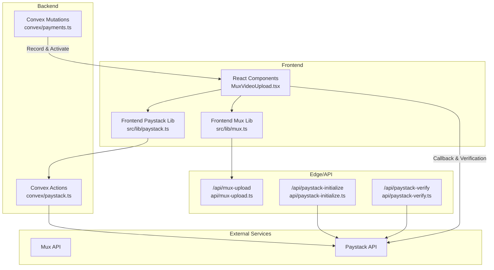
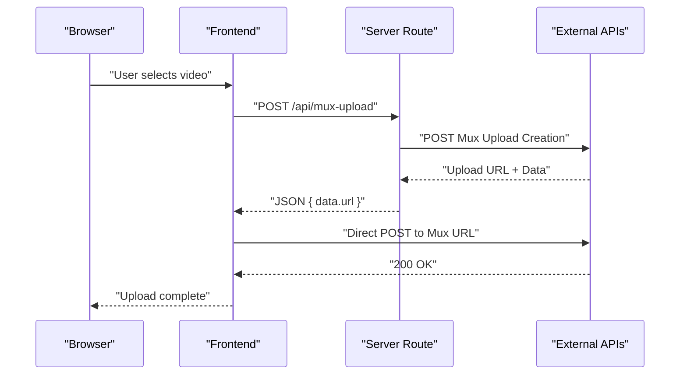
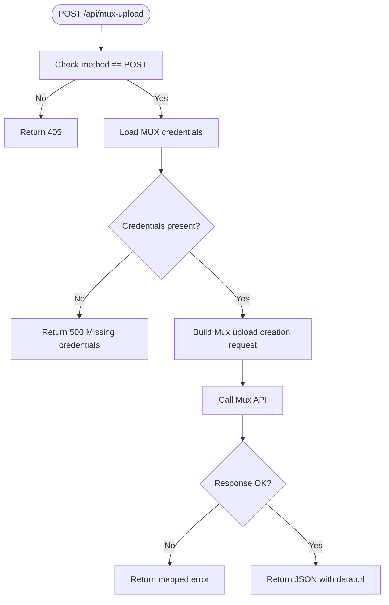
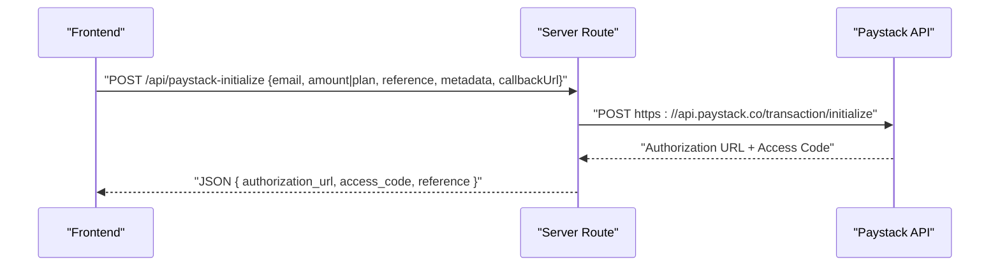
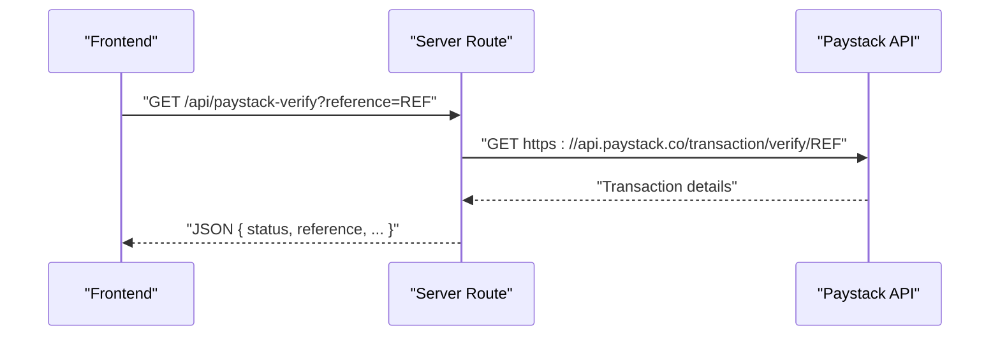
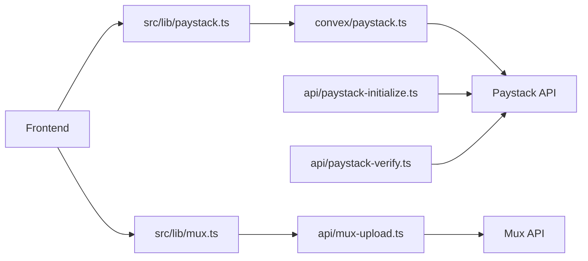

# REST Endpoints

<cite>
**Referenced Files in This Document**
- [mux-upload.ts](file://api/mux-upload.ts)
- [paystack-initialize.ts](file://api/paystack-initialize.ts)
- [paystack-verify.ts](file://api/paystack-verify.ts)
- [paystack.ts](file://convex/paystack.ts)
- [paystack.ts](file://src/lib/paystack.ts)
- [mux.ts](file://src/lib/mux.ts)
- [MuxVideoUpload.tsx](file://src/components/MuxVideoUpload.tsx)
- [Premium.tsx](file://src/screens/Premium.tsx)
- [useConvex.ts](file://src/hooks/useConvex.ts)
- [payments.ts](file://convex/payments.ts)
- [vercel.json](file://vercel.json)
- [api.d.ts](file://convex/_generated/api.d.ts)
</cite>

## Table of Contents
1. [Introduction](#introduction)
2. [Project Structure](#project-structure)
3. [Core Components](#core-components)
4. [Architecture Overview](#architecture-overview)
5. [Detailed Component Analysis](#detailed-component-analysis)
6. [Dependency Analysis](#dependency-analysis)
7. [Performance Considerations](#performance-considerations)
8. [Troubleshooting Guide](#troubleshooting-guide)
9. [Conclusion](#conclusion)
10. [Appendices](#appendices)

## Introduction
This document describes the RESTful API endpoints used by the Lemonade platform for media upload and payment processing. It covers:
- Mux upload endpoint for creating signed upload URLs and performing direct uploads
- Paystack payment initialization endpoint for starting transactions
- Paystack verification endpoint for confirming transaction outcomes
It also documents authentication, request/response schemas, error handling, rate limiting, CORS, and integration patterns for frontend applications, including webhook-friendly verification flows and media upload completion notifications.

## Project Structure
The API surface is implemented as:
- Edge/API routes under api/ for Mux and Paystack integrations
- Convex actions for payment orchestration and verification
- Frontend libraries and components for initiating uploads and payments
- Vercel configuration for routing and caching

**Diagram sources**
- [mux-upload.ts:1-45](file://api/mux-upload.ts#L1-L45)
- [paystack-initialize.ts:1-47](file://api/paystack-initialize.ts#L1-L47)
- [paystack-verify.ts:1-36](file://api/paystack-verify.ts#L1-L36)
- [paystack.ts:1-71](file://convex/paystack.ts#L1-L71)
- [paystack.ts:1-115](file://src/lib/paystack.ts#L1-L115)
- [mux.ts:1-66](file://src/lib/mux.ts#L1-L66)
- [MuxVideoUpload.tsx:1-127](file://src/components/MuxVideoUpload.tsx#L1-L127)
- [payments.ts:1-291](file://convex/payments.ts#L1-L291)

**Section sources**
- [mux-upload.ts:1-45](file://api/mux-upload.ts#L1-L45)
- [paystack-initialize.ts:1-47](file://api/paystack-initialize.ts#L1-L47)
- [paystack-verify.ts:1-36](file://api/paystack-verify.ts#L1-L36)
- [paystack.ts:1-71](file://convex/paystack.ts#L1-L71)
- [paystack.ts:1-115](file://src/lib/paystack.ts#L1-L115)
- [mux.ts:1-66](file://src/lib/mux.ts#L1-L66)
- [MuxVideoUpload.tsx:1-127](file://src/components/MuxVideoUpload.tsx#L1-L127)
- [payments.ts:1-291](file://convex/payments.ts#L1-L291)
- [vercel.json:1-27](file://vercel.json#L1-L27)

## Core Components
- Mux upload endpoint: Creates a signed upload URL via a server route and performs direct uploads to Mux.
- Paystack initialization endpoint: Starts a transaction with Paystack using a server route or Convex action.
- Paystack verification endpoint: Confirms transaction status via GET query parameter reference.

**Section sources**
- [mux-upload.ts:1-45](file://api/mux-upload.ts#L1-L45)
- [paystack-initialize.ts:1-47](file://api/paystack-initialize.ts#L1-L47)
- [paystack-verify.ts:1-36](file://api/paystack-verify.ts#L1-L36)

## Architecture Overview
The platform integrates with Mux and Paystack through:
- Server routes for Mux and Paystack operations
- Convex actions for payment initialization and verification
- Frontend libraries that call Convex actions or server routes
- Vercel rewrites ensuring API paths reach the intended handlers

**Diagram sources**
- [mux-upload.ts:1-45](file://api/mux-upload.ts#L1-L45)
- [mux.ts:35-59](file://src/lib/mux.ts#L35-L59)
- [MuxVideoUpload.tsx:23-69](file://src/components/MuxVideoUpload.tsx#L23-L69)

**Section sources**
- [mux-upload.ts:1-45](file://api/mux-upload.ts#L1-L45)
- [mux.ts:35-59](file://src/lib/mux.ts#L35-L59)
- [MuxVideoUpload.tsx:23-69](file://src/components/MuxVideoUpload.tsx#L23-L69)

## Detailed Component Analysis

### Mux Upload Endpoint
- Path: /api/mux-upload
- Method: POST
- Purpose: Create a signed upload URL for direct Mux uploads
- Authentication: Basic auth using MUX_TOKEN_ID and MUX_TOKEN_SECRET
- Request body (frontend client):
  - filename: string
- Response body:
  - data.url: string (direct upload URL)
  - data.id: string (upload ID)
  - Additional Mux upload creation response fields
- CORS: Origin is passed as cors_origin; defaults to a specific origin if not provided
- Error responses:
  - 405 Method Not Allowed
  - 500 Missing credentials
  - Forwarded error from Mux with message fallback

**Diagram sources**
- [mux-upload.ts:8-44](file://api/mux-upload.ts#L8-L44)

**Section sources**
- [mux-upload.ts:1-45](file://api/mux-upload.ts#L1-L45)
- [mux.ts:35-59](file://src/lib/mux.ts#L35-L59)
- [MuxVideoUpload.tsx:23-69](file://src/components/MuxVideoUpload.tsx#L23-L69)

### Paystack Payment Initialization Endpoint
- Path: /api/paystack-initialize
- Method: POST
- Purpose: Initialize a Paystack transaction
- Authentication: Bearer auth using PAYSTACK_SECRET_KEY
- Request body:
  - email: string (required)
  - amount: number (required if no plan)
  - plan: string (required if no amount)
  - reference: string (recommended)
  - metadata: object (optional)
  - callbackUrl: string (optional)
- Response body:
  - authorization_url: string
  - access_code: string
  - reference: string
- Error responses:
  - 405 Method Not Allowed
  - 500 Missing secret key
  - 400 Missing required fields
  - Forwarded error from Paystack

**Diagram sources**
- [paystack-initialize.ts:5-46](file://api/paystack-initialize.ts#L5-L46)

**Section sources**
- [paystack-initialize.ts:1-47](file://api/paystack-initialize.ts#L1-L47)
- [paystack.ts:56-72](file://src/lib/paystack.ts#L56-L72)
- [useConvex.ts:85-106](file://src/hooks/useConvex.ts#L85-L106)

### Paystack Verification Endpoint
- Path: /api/paystack-verify
- Method: GET
- Purpose: Verify a transaction by reference
- Authentication: Bearer auth using PAYSTACK_SECRET_KEY
- Query parameters:
  - reference: string (required)
- Response body:
  - status: string
  - reference: string
  - amount: number
  - metadata: object
  - And other fields returned by Paystack
- Error responses:
  - 405 Method Not Allowed
  - 500 Missing secret key
  - 400 Missing reference
  - Forwarded error from Paystack

**Diagram sources**
- [paystack-verify.ts:5-35](file://api/paystack-verify.ts#L5-L35)

**Section sources**
- [paystack-verify.ts:1-36](file://api/paystack-verify.ts#L1-L36)
- [Premium.tsx:39-90](file://src/screens/Premium.tsx#L39-L90)
- [payments.ts:174-263](file://convex/payments.ts#L174-L263)

## Dependency Analysis
- Frontend libraries depend on Convex actions for payment operations and on server routes for Mux uploads.
- Server routes depend on external service credentials stored in environment variables.
- Convex actions encapsulate Paystack operations and are referenced via generated API bindings.

**Diagram sources**
- [paystack.ts:34-84](file://src/lib/paystack.ts#L34-L84)
- [mux.ts:34-59](file://src/lib/mux.ts#L34-L59)
- [paystack.ts:1-71](file://convex/paystack.ts#L1-L71)
- [mux-upload.ts:1-45](file://api/mux-upload.ts#L1-L45)
- [paystack-initialize.ts:1-47](file://api/paystack-initialize.ts#L1-L47)
- [paystack-verify.ts:1-36](file://api/paystack-verify.ts#L1-L36)

**Section sources**
- [api.d.ts:1-78](file://convex/_generated/api.d.ts#L1-L78)
- [paystack.ts:1-71](file://convex/paystack.ts#L1-L71)
- [paystack.ts:1-115](file://src/lib/paystack.ts#L1-L115)
- [mux.ts:1-66](file://src/lib/mux.ts#L1-L66)

## Performance Considerations
- Mux direct uploads bypass the origin server, reducing latency and bandwidth usage on your servers.
- Paystack initialization and verification are lightweight proxy calls; cache authorization URLs client-side only if safe and short-lived.
- Keep request bodies minimal; only send required fields to reduce overhead.
- Use streaming uploads where possible and monitor upload progress to improve UX.

## Troubleshooting Guide
Common errors and resolutions:
- Missing credentials
  - Mux: Ensure MUX_TOKEN_ID and MUX_TOKEN_SECRET are set; otherwise server returns 500.
  - Paystack: Ensure PAYSTACK_SECRET_KEY is set; otherwise server returns 500.
- Method not allowed
  - Ensure requests use POST for initialization and verification endpoints and appropriate methods for each route.
- Validation failures
  - Paystack initialization requires either amount or plan; missing both yields 400.
  - Paystack verification requires reference query parameter; missing yields 400.
- Network errors
  - Direct Mux uploads rely on CORS and origin policies; ensure cors_origin matches your deployment origin.
- Frontend integration
  - For premium activation, verify payment after redirect and call backend mutations to activate premium and credit wallets.

**Section sources**
- [mux-upload.ts:9-18](file://api/mux-upload.ts#L9-L18)
- [paystack-initialize.ts:6-19](file://api/paystack-initialize.ts#L6-L19)
- [paystack-verify.ts:6-19](file://api/paystack-verify.ts#L6-L19)
- [Premium.tsx:39-90](file://src/screens/Premium.tsx#L39-L90)

## Conclusion
The Lemonade platform exposes straightforward REST endpoints for media and payments:
- Use /api/mux-upload to obtain a direct upload URL and upload videos directly to Mux.
- Use /api/paystack-initialize to start transactions and /api/paystack-verify to confirm outcomes.
- Frontend flows integrate with Convex actions and server routes, enabling secure and scalable operations.

## Appendices

### API Reference Tables

- Mux Upload Endpoint
  - Method: POST
  - Path: /api/mux-upload
  - Headers: Content-Type: application/json
  - Body:
    - filename: string
  - Response:
    - data.url: string
    - data.id: string
    - Other fields from Mux upload creation
  - Errors: 405, 500, forwarded Paystack-style error

- Paystack Initialize Endpoint
  - Method: POST
  - Path: /api/paystack-initialize
  - Headers: Authorization: Bearer <PAYSTACK_SECRET_KEY>, Content-Type: application/json
  - Body:
    - email: string
    - amount: number (if plan is not provided)
    - plan: string (if amount is not provided)
    - reference: string
    - metadata: object
    - callbackUrl: string
  - Response:
    - authorization_url: string
    - access_code: string
    - reference: string
  - Errors: 405, 500, 400, forwarded error

- Paystack Verify Endpoint
  - Method: GET
  - Path: /api/paystack-verify
  - Query: reference=<string>
  - Headers: Authorization: Bearer <PAYSTACK_SECRET_KEY>
  - Response:
    - status: string
    - reference: string
    - amount: number
    - metadata: object
    - Other fields returned by Paystack
  - Errors: 405, 500, 400, forwarded error

**Section sources**
- [mux-upload.ts:1-45](file://api/mux-upload.ts#L1-L45)
- [paystack-initialize.ts:1-47](file://api/paystack-initialize.ts#L1-L47)
- [paystack-verify.ts:1-36](file://api/paystack-verify.ts#L1-L36)

### Security and CORS Notes
- Authentication
  - Mux: Basic auth using MUX_TOKEN_ID and MUX_TOKEN_SECRET
  - Paystack: Bearer auth using PAYSTACK_SECRET_KEY
- CORS
  - Mux upload creation sets cors_origin from request origin header; ensure origins match your deployment
- Secrets
  - Store keys in environment variables; do not expose to clients
- Rate Limiting
  - No explicit rate limiting is implemented in the provided code; apply platform-specific limits at the edge or provider level

**Section sources**
- [mux-upload.ts:14-34](file://api/mux-upload.ts#L14-L34)
- [paystack-initialize.ts:11-36](file://api/paystack-initialize.ts#L11-L36)
- [paystack-verify.ts:11-25](file://api/paystack-verify.ts#L11-L25)

### Frontend Integration Examples

- Mux Upload Flow
  - Steps:
    1) Call frontend library to create Mux direct upload URL
    2) Upload file directly to returned URL
    3) Handle progress and completion
  - Example references:
    - [createMuxDirectUploadUrl:35-59](file://src/lib/mux.ts#L35-L59)
    - [MuxVideoUpload component:23-69](file://src/components/MuxVideoUpload.tsx#L23-L69)

- Paystack Payment Flow
  - Steps:
    1) Initialize payment via frontend library (generates reference and authorization URL)
    2) Redirect user to authorization URL
    3) After redirect, verify payment and activate premium or credit wallet
  - Example references:
    - [initializePayment:56-72](file://src/lib/paystack.ts#L56-L72)
    - [useConvex hook for premium checkout:85-106](file://src/hooks/useConvex.ts#L85-L106)
    - [Premium screen verification:39-90](file://src/screens/Premium.tsx#L39-L90)
    - [Activate premium after Paystack:174-263](file://convex/payments.ts#L174-L263)

**Section sources**
- [mux.ts:35-59](file://src/lib/mux.ts#L35-L59)
- [MuxVideoUpload.tsx:23-69](file://src/components/MuxVideoUpload.tsx#L23-L69)
- [paystack.ts:56-72](file://src/lib/paystack.ts#L56-L72)
- [useConvex.ts:85-106](file://src/hooks/useConvex.ts#L85-L106)
- [Premium.tsx:39-90](file://src/screens/Premium.tsx#L39-L90)
- [payments.ts:174-263](file://convex/payments.ts#L174-L263)

### Webhook Integration Patterns
- Asynchronous notifications
  - Use Paystack’s configured webhook endpoint to receive transaction events and update backend state accordingly.
  - After webhook confirmation, trigger backend mutations to credit wallets or activate premium memberships.
- Media upload completion
  - Mux emits completion events; configure Mux webhooks to notify your backend and update asset statuses.
- Backend actions
  - Payment verification and activation are handled by Convex mutations; ensure webhook handlers call these mutations idempotently.

[No sources needed since this section provides general guidance]