# Administrative System

<cite>
**Referenced Files in This Document**
- [AdminLayout.tsx](file://src/components/admin/AdminLayout.tsx)
- [AdminRouteGuard.tsx](file://src/components/admin/AdminRouteGuard.tsx)
- [AdminOverview.tsx](file://src/screens/admin/AdminOverview.tsx)
- [AdminAnalytics.tsx](file://src/screens/admin/AdminAnalytics.tsx)
- [AdminModerationPresets.tsx](file://src/screens/admin/AdminModerationPresets.tsx)
- [AdminUsers.tsx](file://src/screens/admin/AdminUsers.tsx)
- [AdminReports.tsx](file://src/screens/admin/AdminReports.tsx)
- [AdminAuditLog.tsx](file://src/screens/admin/AdminAuditLog.tsx)
- [AdminSettings.tsx](file://src/screens/admin/AdminSettings.tsx)
- [AdminFraud.tsx](file://src/screens/admin/AdminFraud.tsx)
- [AdminCreators.tsx](file://src/screens/admin/AdminCreators.tsx)
- [AdminApplications.tsx](file://src/screens/admin/AdminApplications.tsx)
- [AdminStories.tsx](file://src/screens/admin/AdminStories.tsx)
- [admin.ts](file://convex/admin.ts)
- [schema.ts](file://convex/schema.ts)
</cite>

## Table of Contents
1. [Introduction](#introduction)
2. [Project Structure](#project-structure)
3. [Core Components](#core-components)
4. [Architecture Overview](#architecture-overview)
5. [Detailed Component Analysis](#detailed-component-analysis)
6. [Dependency Analysis](#dependency-analysis)
7. [Performance Considerations](#performance-considerations)
8. [Troubleshooting Guide](#troubleshooting-guide)
9. [Conclusion](#conclusion)

## Introduction
This document describes the administrative system for comprehensive platform oversight. It covers the admin layout and navigation, content moderation workflows, user management, analytics dashboards, platform configuration, role permissions, audit logging, and integration with backend administrative functions. The goal is to provide a clear understanding of how administrators monitor, moderate, and configure the platform while maintaining transparency and compliance.

## Project Structure
The administrative system is organized around:
- Admin layout and routing guards for navigation and access control
- Dedicated admin screens for analytics, moderation, users, creators, applications, stories, audit logs, and settings
- Backend Convex queries and mutations supporting admin operations
- Data model defining admin-related entities and permissions

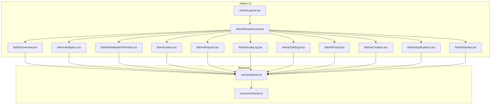

**Diagram sources**
- [AdminLayout.tsx:56-289](file://src/components/admin/AdminLayout.tsx#L56-L289)
- [AdminRouteGuard.tsx:10-24](file://src/components/admin/AdminRouteGuard.tsx#L10-L24)
- [AdminOverview.tsx:38-277](file://src/screens/admin/AdminOverview.tsx#L38-L277)
- [AdminAnalytics.tsx:35-228](file://src/screens/admin/AdminAnalytics.tsx#L35-L228)
- [AdminModerationPresets.tsx:66-200](file://src/screens/admin/AdminModerationPresets.tsx#L66-L200)
- [AdminUsers.tsx:23-266](file://src/screens/admin/AdminUsers.tsx#L23-L266)
- [AdminReports.tsx:25-211](file://src/screens/admin/AdminReports.tsx#L25-L211)
- [AdminAuditLog.tsx:26-197](file://src/screens/admin/AdminAuditLog.tsx#L26-L197)
- [AdminSettings.tsx:7-189](file://src/screens/admin/AdminSettings.tsx#L7-L189)
- [AdminFraud.tsx:6-74](file://src/screens/admin/AdminFraud.tsx#L6-L74)
- [AdminCreators.tsx:22-240](file://src/screens/admin/AdminCreators.tsx#L22-L240)
- [AdminApplications.tsx:30-420](file://src/screens/admin/AdminApplications.tsx#L30-L420)
- [AdminStories.tsx:24-250](file://src/screens/admin/AdminStories.tsx#L24-L250)
- [admin.ts:31-364](file://convex/admin.ts#L31-L364)
- [schema.ts:183-196](file://convex/schema.ts#L183-L196)

**Section sources**
- [AdminLayout.tsx:34-52](file://src/components/admin/AdminLayout.tsx#L34-L52)
- [AdminRouteGuard.tsx:10-24](file://src/components/admin/AdminRouteGuard.tsx#L10-L24)

## Core Components
- AdminLayout: Provides responsive navigation, role-aware menu items, and header stats. Integrates with Convex for overview metrics.
- AdminRouteGuard: Enforces admin authentication and role-based access (super admin only routes).
- AdminOverview: Aggregates platform metrics and recent activity; supports CSV export.
- AdminAnalytics: Displays user growth, reads, premium subscribers, revenue, monthly activity, top stories, and conversion rate.
- AdminModerationPresets: Manages global moderation modes with strict, adaptive, and permissive profiles.
- AdminUsers: Filters and manages users; suspends/un-suspends; role changes; views activity.
- AdminReports: Queues and resolves content reports; quick preview modal; history view.
- AdminAuditLog: Lists and searches audit events; export capability; security overview.
- AdminSettings: Moderation modes, toggles for global rules, platform settings, API endpoints, and infrastructure mirror status.
- AdminFraud: Scans engagement logs for suspicious activity and marks events resolved.
- AdminCreators: Filters and manages creators; suspension and access controls; feature creator actions.
- AdminApplications: Reviews creator applications; approves/rejects with feedback; quick-view modal.
- AdminStories: Filters and moderates stories; flags and removes content; feature controls.

**Section sources**
- [AdminLayout.tsx:56-94](file://src/components/admin/AdminLayout.tsx#L56-L94)
- [AdminOverview.tsx:38-110](file://src/screens/admin/AdminOverview.tsx#L38-L110)
- [AdminAnalytics.tsx:35-56](file://src/screens/admin/AdminAnalytics.tsx#L35-L56)
- [AdminModerationPresets.tsx:66-168](file://src/screens/admin/AdminModerationPresets.tsx#L66-L168)
- [AdminUsers.tsx:23-203](file://src/screens/admin/AdminUsers.tsx#L23-L203)
- [AdminReports.tsx:25-121](file://src/screens/admin/AdminReports.tsx#L25-L121)
- [AdminAuditLog.tsx:26-165](file://src/screens/admin/AdminAuditLog.tsx#L26-L165)
- [AdminSettings.tsx:7-189](file://src/screens/admin/AdminSettings.tsx#L7-L189)
- [AdminFraud.tsx:6-74](file://src/screens/admin/AdminFraud.tsx#L6-L74)
- [AdminCreators.tsx:22-180](file://src/screens/admin/AdminCreators.tsx#L22-L180)
- [AdminApplications.tsx:30-248](file://src/screens/admin/AdminApplications.tsx#L30-L248)
- [AdminStories.tsx:24-181](file://src/screens/admin/AdminStories.tsx#L24-L181)

## Architecture Overview
The admin UI communicates with backend Convex functions via generated API bindings. AdminRouteGuard ensures only authenticated admins can access protected routes. AdminLayout centralizes navigation and exposes role-aware sections. Backend admin.ts defines queries and mutations for analytics, moderation, user management, audit logging, and fraud detection. The schema.ts defines admin-related tables and indices.

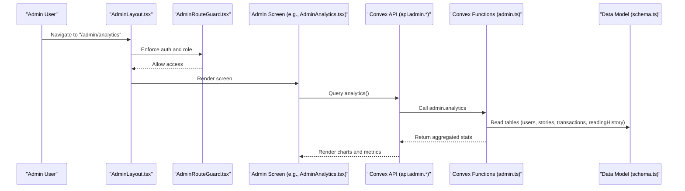

**Diagram sources**
- [AdminLayout.tsx:56-94](file://src/components/admin/AdminLayout.tsx#L56-L94)
- [AdminRouteGuard.tsx:10-24](file://src/components/admin/AdminRouteGuard.tsx#L10-L24)
- [AdminAnalytics.tsx:35-49](file://src/screens/admin/AdminAnalytics.tsx#L35-L49)
- [admin.ts:66-128](file://convex/admin.ts#L66-L128)
- [schema.ts:25-67](file://convex/schema.ts#L25-L67)

## Detailed Component Analysis

### Admin Layout and Navigation
- Responsive desktop sidebar and mobile drawer with role-aware items.
- Super admin-only items are hidden for non-super admins.
- Header displays registered user counts and admin identity.
- Logout navigates to admin login.

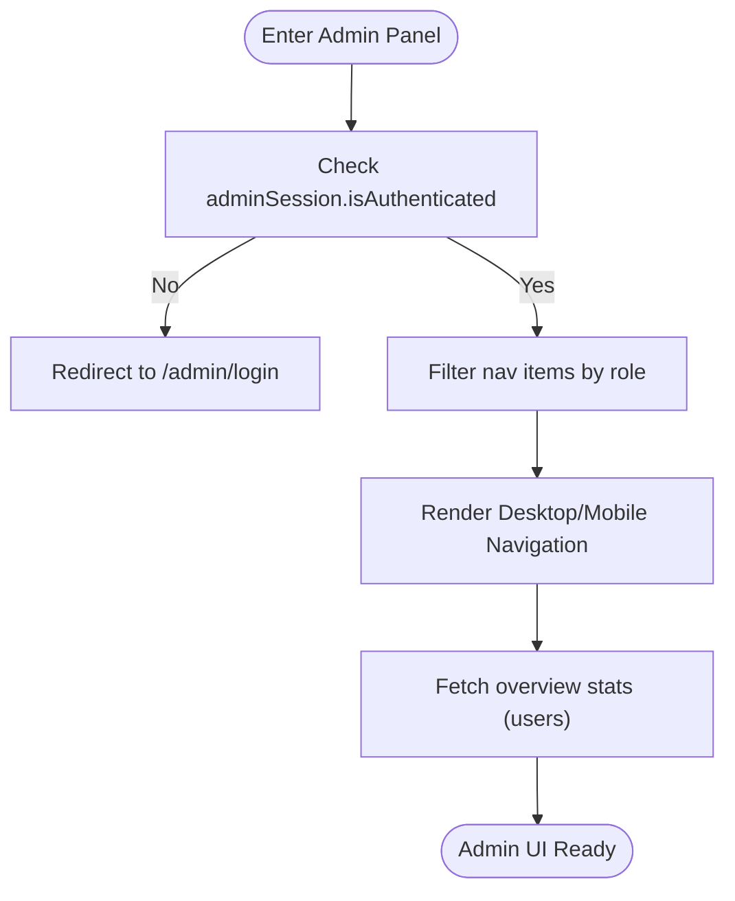

**Diagram sources**
- [AdminLayout.tsx:56-94](file://src/components/admin/AdminLayout.tsx#L56-L94)
- [AdminRouteGuard.tsx:10-24](file://src/components/admin/AdminRouteGuard.tsx#L10-L24)

**Section sources**
- [AdminLayout.tsx:34-52](file://src/components/admin/AdminLayout.tsx#L34-L52)
- [AdminLayout.tsx:70-72](file://src/components/admin/AdminLayout.tsx#L70-L72)
- [AdminLayout.tsx:74-94](file://src/components/admin/AdminLayout.tsx#L74-L94)

### Content Moderation System
- Moderation presets: Strict, Adaptive, Permissive with rule sets and instant propagation.
- Report handling: Open/reviewing/past queues; quick preview modal; resolve/dismiss actions.
- Automated detection: Fraud scanning of engagement events with heuristic rules; manual resolution.

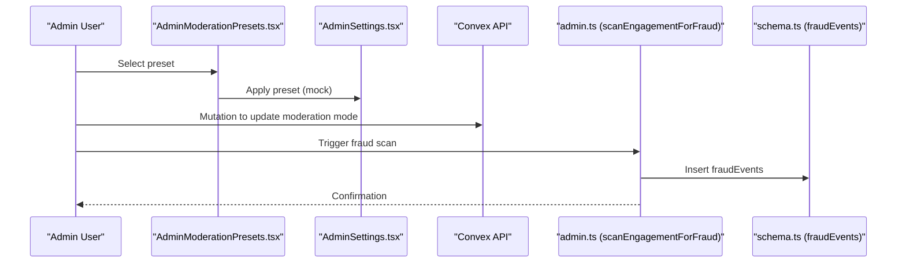

**Diagram sources**
- [AdminModerationPresets.tsx:66-80](file://src/screens/admin/AdminModerationPresets.tsx#L66-L80)
- [AdminSettings.tsx:85-110](file://src/screens/admin/AdminSettings.tsx#L85-L110)
- [admin.ts:312-348](file://convex/admin.ts#L312-L348)
- [schema.ts:481-491](file://convex/schema.ts#L481-L491)

**Section sources**
- [AdminModerationPresets.tsx:18-64](file://src/screens/admin/AdminModerationPresets.tsx#L18-L64)
- [AdminModerationPresets.tsx:71-80](file://src/screens/admin/AdminModerationPresets.tsx#L71-L80)
- [AdminReports.tsx:25-121](file://src/screens/admin/AdminReports.tsx#L25-L121)
- [AdminReports.tsx:191-203](file://src/screens/admin/AdminReports.tsx#L191-L203)
- [AdminFraud.tsx:6-74](file://src/screens/admin/AdminFraud.tsx#L6-L74)
- [admin.ts:312-348](file://convex/admin.ts#L312-L348)
- [schema.ts:481-491](file://convex/schema.ts#L481-L491)

### User Management Interface
- Searchable and filterable user list (all/readers/creators/premium/suspended).
- Inline actions: suspend/unsuspend, change role, view activity.
- Mobile-friendly grid with key metrics.

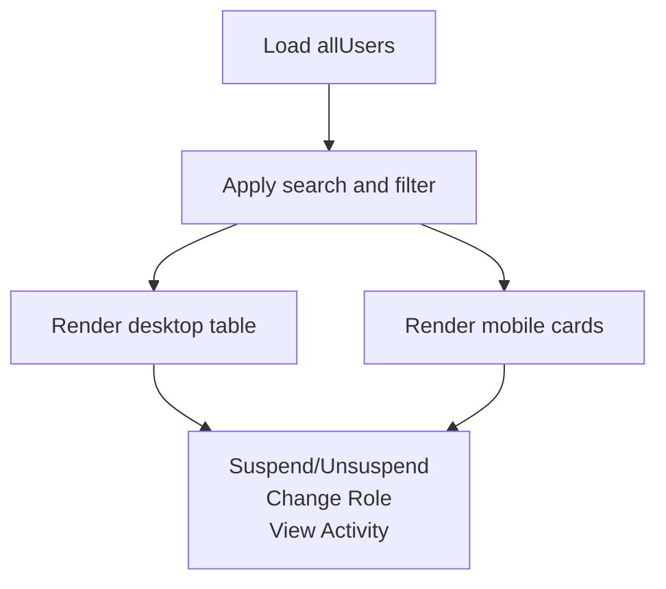

**Diagram sources**
- [AdminUsers.tsx:23-203](file://src/screens/admin/AdminUsers.tsx#L23-L203)

**Section sources**
- [AdminUsers.tsx:23-203](file://src/screens/admin/AdminUsers.tsx#L23-L203)
- [AdminUsers.tsx:147-171](file://src/screens/admin/AdminUsers.tsx#L147-L171)

### Analytics Dashboard
- Real-time metrics: user growth, story reads, premium subscribers, total revenue.
- Visualizations: monthly reading activity bars, revenue breakdown, top stories, conversion rate.
- Export capability for analytics data.

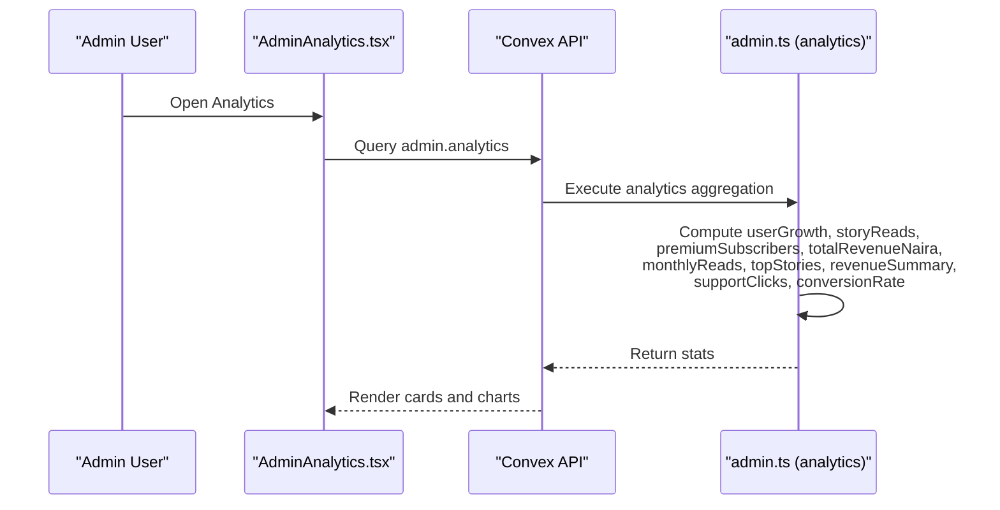

**Diagram sources**
- [AdminAnalytics.tsx:35-49](file://src/screens/admin/AdminAnalytics.tsx#L35-L49)
- [admin.ts:66-128](file://convex/admin.ts#L66-L128)

**Section sources**
- [AdminAnalytics.tsx:35-122](file://src/screens/admin/AdminAnalytics.tsx#L35-L122)
- [AdminAnalytics.tsx:124-224](file://src/screens/admin/AdminAnalytics.tsx#L124-L224)

### Platform Configuration Tools
- Moderation modes: Strict/Adaptive/Permissive with instant propagation.
- Global rules: toggles for duplicate rejection, keyword flagging, chat, PII filter.
- Platform settings: mock data visibility, API endpoint, socket port, mirror status.

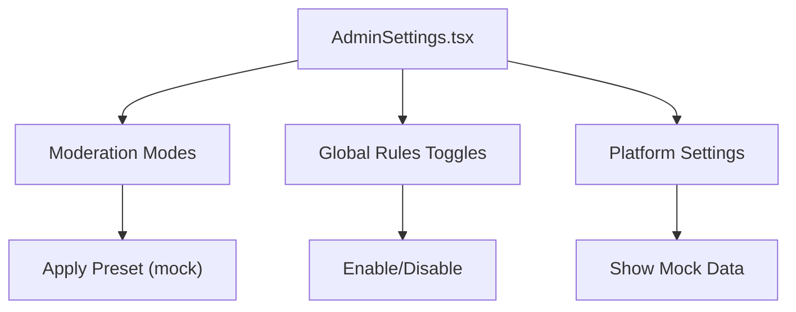

**Diagram sources**
- [AdminSettings.tsx:7-189](file://src/screens/admin/AdminSettings.tsx#L7-L189)
- [AdminModerationPresets.tsx:66-168](file://src/screens/admin/AdminModerationPresets.tsx#L66-L168)

**Section sources**
- [AdminSettings.tsx:7-189](file://src/screens/admin/AdminSettings.tsx#L7-L189)
- [AdminModerationPresets.tsx:66-168](file://src/screens/admin/AdminModerationPresets.tsx#L66-L168)

### Administrative Role Permissions and Access Control
- Route-level guard enforces authentication and role checks.
- Super admin-only menu items are hidden for non-super admins.
- Moderator role is indicated in the layout header.

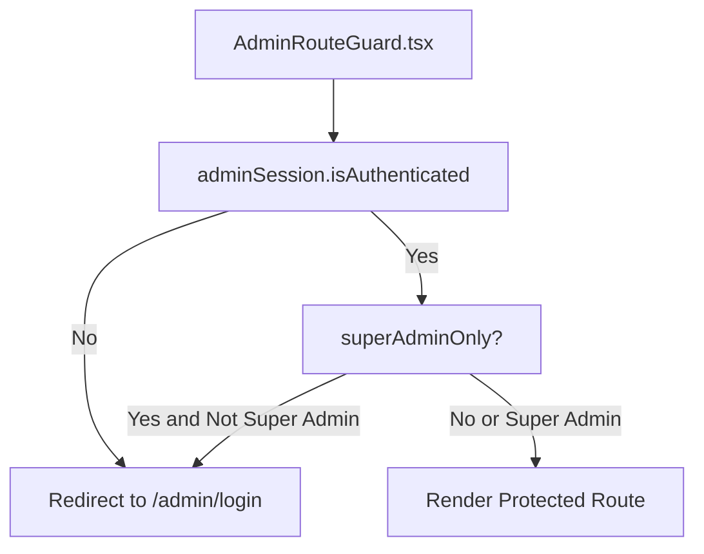

**Diagram sources**
- [AdminRouteGuard.tsx:10-24](file://src/components/admin/AdminRouteGuard.tsx#L10-L24)
- [AdminLayout.tsx:70-72](file://src/components/admin/AdminLayout.tsx#L70-L72)

**Section sources**
- [AdminRouteGuard.tsx:10-24](file://src/components/admin/AdminRouteGuard.tsx#L10-L24)
- [AdminLayout.tsx:119-125](file://src/components/admin/AdminLayout.tsx#L119-L125)

### Audit Logging and Compliance Reporting
- Live audit log with search, filters, severity levels, and export.
- Security overview: database sync status, failed auth attempts, active admin sessions.
- Backend stores admin activity logs with timestamps and metadata.

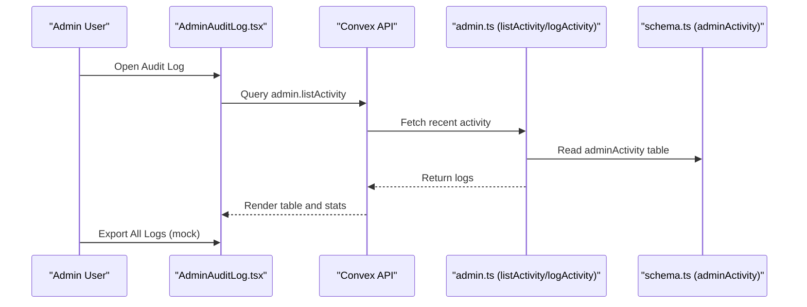

**Diagram sources**
- [AdminAuditLog.tsx:26-165](file://src/screens/admin/AdminAuditLog.tsx#L26-L165)
- [admin.ts:225-244](file://convex/admin.ts#L225-L244)
- [schema.ts:176-181](file://convex/schema.ts#L176-L181)

**Section sources**
- [AdminAuditLog.tsx:26-165](file://src/screens/admin/AdminAuditLog.tsx#L26-L165)
- [admin.ts:225-244](file://convex/admin.ts#L225-L244)
- [schema.ts:176-181](file://convex/schema.ts#L176-L181)

### Integration Between Admin Components and Backend
- Overview and analytics pull from Convex queries aggregating users, stories, transactions, and reading history.
- Reports, creators, applications, and stories leverage backend CRUD-like operations and filters.
- Audit logging persists and retrieves admin activity.

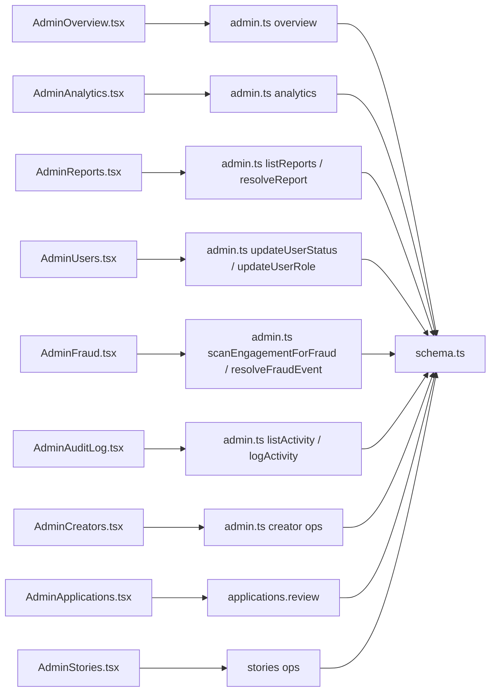

**Diagram sources**
- [AdminOverview.tsx:38-66](file://src/screens/admin/AdminOverview.tsx#L38-L66)
- [AdminAnalytics.tsx:35-49](file://src/screens/admin/AdminAnalytics.tsx#L35-L49)
- [AdminReports.tsx:25-121](file://src/screens/admin/AdminReports.tsx#L25-L121)
- [AdminUsers.tsx:23-203](file://src/screens/admin/AdminUsers.tsx#L23-L203)
- [AdminFraud.tsx:6-74](file://src/screens/admin/AdminFraud.tsx#L6-L74)
- [AdminAuditLog.tsx:26-165](file://src/screens/admin/AdminAuditLog.tsx#L26-L165)
- [AdminCreators.tsx:22-180](file://src/screens/admin/AdminCreators.tsx#L22-L180)
- [AdminApplications.tsx:30-248](file://src/screens/admin/AdminApplications.tsx#L30-L248)
- [AdminStories.tsx:24-181](file://src/screens/admin/AdminStories.tsx#L24-L181)
- [admin.ts:31-364](file://convex/admin.ts#L31-L364)
- [schema.ts:151-174](file://convex/schema.ts#L151-L174)

**Section sources**
- [admin.ts:31-364](file://convex/admin.ts#L31-L364)
- [schema.ts:151-174](file://convex/schema.ts#L151-L174)

## Dependency Analysis
- AdminLayout depends on AppContext for adminSession and allUsers; integrates Convex for overview stats.
- AdminRouteGuard depends on AppContext for adminSession and redirects based on authentication and role.
- Admin screens depend on Convex API bindings to query and mutate data.
- Backend admin.ts encapsulates all admin-facing queries and mutations; schema.ts defines admin-related tables and indices.

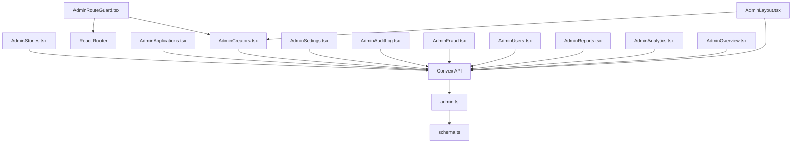

**Diagram sources**
- [AdminLayout.tsx:56-94](file://src/components/admin/AdminLayout.tsx#L56-L94)
- [AdminRouteGuard.tsx:10-24](file://src/components/admin/AdminRouteGuard.tsx#L10-L24)
- [AdminOverview.tsx:38-66](file://src/screens/admin/AdminOverview.tsx#L38-L66)
- [AdminAnalytics.tsx:35-49](file://src/screens/admin/AdminAnalytics.tsx#L35-L49)
- [AdminReports.tsx:25-121](file://src/screens/admin/AdminReports.tsx#L25-L121)
- [AdminUsers.tsx:23-203](file://src/screens/admin/AdminUsers.tsx#L23-L203)
- [AdminFraud.tsx:6-74](file://src/screens/admin/AdminFraud.tsx#L6-L74)
- [AdminAuditLog.tsx:26-165](file://src/screens/admin/AdminAuditLog.tsx#L26-L165)
- [AdminSettings.tsx:7-189](file://src/screens/admin/AdminSettings.tsx#L7-L189)
- [AdminCreators.tsx:22-180](file://src/screens/admin/AdminCreators.tsx#L22-L180)
- [AdminApplications.tsx:30-248](file://src/screens/admin/AdminApplications.tsx#L30-L248)
- [AdminStories.tsx:24-181](file://src/screens/admin/AdminStories.tsx#L24-L181)
- [admin.ts:31-364](file://convex/admin.ts#L31-L364)
- [schema.ts:151-174](file://convex/schema.ts#L151-L174)

**Section sources**
- [AdminLayout.tsx:56-94](file://src/components/admin/AdminLayout.tsx#L56-L94)
- [AdminRouteGuard.tsx:10-24](file://src/components/admin/AdminRouteGuard.tsx#L10-L24)
- [admin.ts:31-364](file://convex/admin.ts#L31-L364)
- [schema.ts:151-174](file://convex/schema.ts#L151-L174)

## Performance Considerations
- Overview and analytics screens poll data periodically; consider debouncing and caching to reduce network load.
- Large tables (users, creators, stories) benefit from client-side pagination and virtualization for smoother rendering.
- Fraud scans operate on engagement events; ensure efficient indexing and limit lookback windows for responsiveness.
- Use optimistic UI updates for quick feedback during approvals and suspensions, with reconciliation on failure.

## Troubleshooting Guide
- Authentication failures: Verify adminSession and redirect to login.
- Role restrictions: Super admin-only routes are hidden for non-super admins.
- Data loading errors: Check Convex query/mutation responses and console logs.
- Export/download: Confirm browser allows downloads and mock handlers are functioning.
- Fraud scan: Ensure engagement events exist and scanEngagementForFraud runs successfully.

**Section sources**
- [AdminRouteGuard.tsx:14-20](file://src/components/admin/AdminRouteGuard.tsx#L14-L20)
- [AdminOverview.tsx:48-56](file://src/screens/admin/AdminOverview.tsx#L48-L56)
- [AdminFraud.tsx:10-21](file://src/screens/admin/AdminFraud.tsx#L10-L21)
- [AdminAuditLog.tsx:29-31](file://src/screens/admin/AdminAuditLog.tsx#L29-L31)

## Conclusion
The administrative system provides a comprehensive toolkit for monitoring, moderating, and configuring the platform. With role-aware navigation, robust analytics, moderation presets, user and creator management, audit logging, and backend integrations, administrators can maintain platform health, enforce policies, and drive growth while ensuring compliance and transparency.