# Analytics Dashboard

<cite>
**Referenced Files in This Document**
- [AdminAnalytics.tsx](file://src/screens/admin/AdminAnalytics.tsx)
- [AdminOverview.tsx](file://src/screens/admin/AdminOverview.tsx)
- [AdminActivity.tsx](file://src/screens/admin/AdminActivity.tsx)
- [AdminPayments.tsx](file://src/screens/admin/AdminPayments.tsx)
- [AdminReports.tsx](file://src/screens/admin/AdminReports.tsx)
- [AdminCreators.tsx](file://src/screens/admin/AdminCreators.tsx)
- [admin.ts](file://convex/admin.ts)
- [schema.ts](file://convex/schema.ts)
- [interactions.ts](file://convex/interactions.ts)
- [stories.ts](file://convex/stories.ts)
- [payments.ts](file://convex/payments.ts)
- [gamification.ts](file://convex/gamification.ts)
- [useEngagement.ts](file://src/hooks/useEngagement.ts)
- [convex.ts](file://src/lib/convex.ts)
</cite>

## Table of Contents
1. [Introduction](#introduction)
2. [Project Structure](#project-structure)
3. [Core Components](#core-components)
4. [Architecture Overview](#architecture-overview)
5. [Detailed Component Analysis](#detailed-component-analysis)
6. [Dependency Analysis](#dependency-analysis)
7. [Performance Considerations](#performance-considerations)
8. [Troubleshooting Guide](#troubleshooting-guide)
9. [Conclusion](#conclusion)
10. [Appendices](#appendices)

## Introduction
This document describes the Analytics Dashboard for the Lemonade platform, focusing on how the frontend dashboards visualize platform metrics, user engagement statistics, and content performance indicators. It explains the overview dashboard, activity tracking, content analytics, financial analytics, export capabilities, and the integration between frontend components and backend data aggregation functions.

## Project Structure
The analytics dashboards are implemented as React screens under the admin area, consuming Convex backend queries and mutations. The backend aggregates data from multiple domain tables (users, stories, reading history, wallet transactions, admin activity, etc.) and exposes typed analytics endpoints.

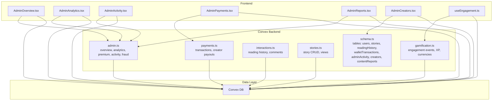

**Diagram sources**
- [AdminOverview.tsx:38-66](file://src/screens/admin/AdminOverview.tsx#L38-L66)
- [AdminAnalytics.tsx:35-49](file://src/screens/admin/AdminAnalytics.tsx#L35-L49)
- [AdminActivity.tsx:68-89](file://src/screens/admin/AdminActivity.tsx#L68-L89)
- [AdminPayments.tsx:25-51](file://src/screens/admin/AdminPayments.tsx#L25-L51)
- [AdminReports.tsx:25-46](file://src/screens/admin/AdminReports.tsx#L25-L46)
- [AdminCreators.tsx:22-50](file://src/screens/admin/AdminCreators.tsx#L22-L50)
- [useEngagement.ts:6-61](file://src/hooks/useEngagement.ts#L6-L61)
- [admin.ts:31-128](file://convex/admin.ts#L31-L128)
- [schema.ts:24-494](file://convex/schema.ts#L24-L494)
- [interactions.ts:74-109](file://convex/interactions.ts#L74-L109)
- [stories.ts:146-161](file://convex/stories.ts#L146-L161)
- [payments.ts:4-20](file://convex/payments.ts#L4-L20)
- [gamification.ts:14-117](file://convex/gamification.ts#L14-L117)

**Section sources**
- [AdminOverview.tsx:38-66](file://src/screens/admin/AdminOverview.tsx#L38-L66)
- [AdminAnalytics.tsx:35-49](file://src/screens/admin/AdminAnalytics.tsx#L35-L49)
- [admin.ts:31-128](file://convex/admin.ts#L31-L128)
- [schema.ts:24-494](file://convex/schema.ts#L24-L494)

## Core Components
- Overview dashboard: Live KPIs, recent activity, and system health.
- Analytics dashboard: Monthly reading activity, top stories, revenue summary, conversion rate.
- Activity log: Administrative actions and moderation events.
- Payments dashboard: Financial operations, filters, and export.
- Reports dashboard: Moderation queue and resolution.
- Creators dashboard: Creator management and status controls.
- Engagement hook: Tracks reading sessions and sends engagement events.

**Section sources**
- [AdminOverview.tsx:103-176](file://src/screens/admin/AdminOverview.tsx#L103-L176)
- [AdminAnalytics.tsx:51-224](file://src/screens/admin/AdminAnalytics.tsx#L51-L224)
- [AdminActivity.tsx:68-121](file://src/screens/admin/AdminActivity.tsx#L68-L121)
- [AdminPayments.tsx:25-196](file://src/screens/admin/AdminPayments.tsx#L25-L196)
- [AdminReports.tsx:25-121](file://src/screens/admin/AdminReports.tsx#L25-L121)
- [AdminCreators.tsx:22-77](file://src/screens/admin/AdminCreators.tsx#L22-L77)
- [useEngagement.ts:6-61](file://src/hooks/useEngagement.ts#L6-L61)

## Architecture Overview
The frontend dashboards call Convex queries/mutations via a typed client. The backend composes data from multiple tables and computes derived metrics such as monthly reads, top stories, revenue summaries, and conversion rates. The engagement hook periodically records user engagement events that feed into analytics.

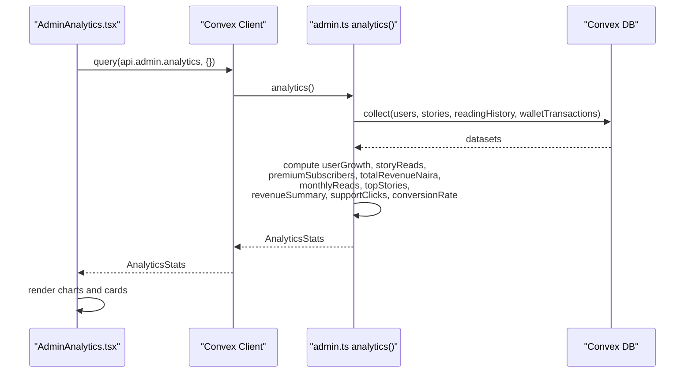

**Diagram sources**
- [AdminAnalytics.tsx:35-49](file://src/screens/admin/AdminAnalytics.tsx#L35-L49)
- [admin.ts:66-128](file://convex/admin.ts#L66-L128)

**Section sources**
- [AdminAnalytics.tsx:35-49](file://src/screens/admin/AdminAnalytics.tsx#L35-L49)
- [admin.ts:66-128](file://convex/admin.ts#L66-L128)

## Detailed Component Analysis

### Overview Dashboard
The overview dashboard aggregates platform-wide metrics and recent admin activity. It fetches a consolidated dataset from the backend and displays KPIs with quick navigation to related sections. It also includes a periodic refresh mechanism and export capability.

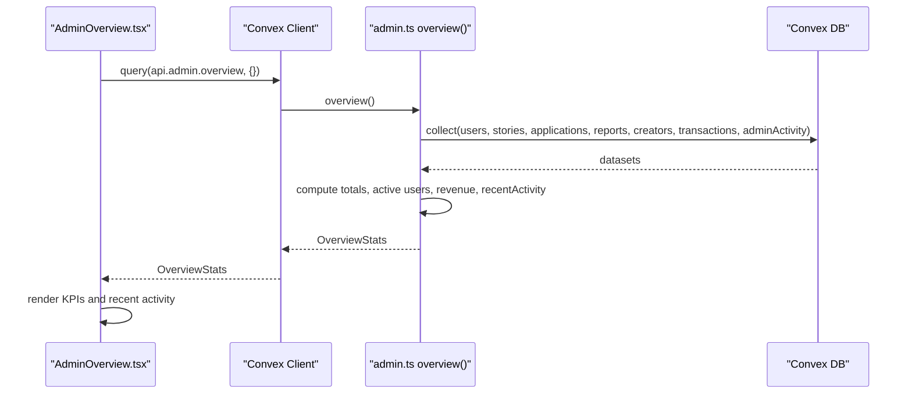

**Diagram sources**
- [AdminOverview.tsx:38-66](file://src/screens/admin/AdminOverview.tsx#L38-L66)
- [admin.ts:31-64](file://convex/admin.ts#L31-L64)

**Section sources**
- [AdminOverview.tsx:38-66](file://src/screens/admin/AdminOverview.tsx#L38-L66)
- [admin.ts:31-64](file://convex/admin.ts#L31-L64)

### Analytics Dashboard
The analytics dashboard presents key performance indicators, monthly reading trends, top stories, revenue breakdowns, and conversion rate. It also supports exporting a CSV snapshot.

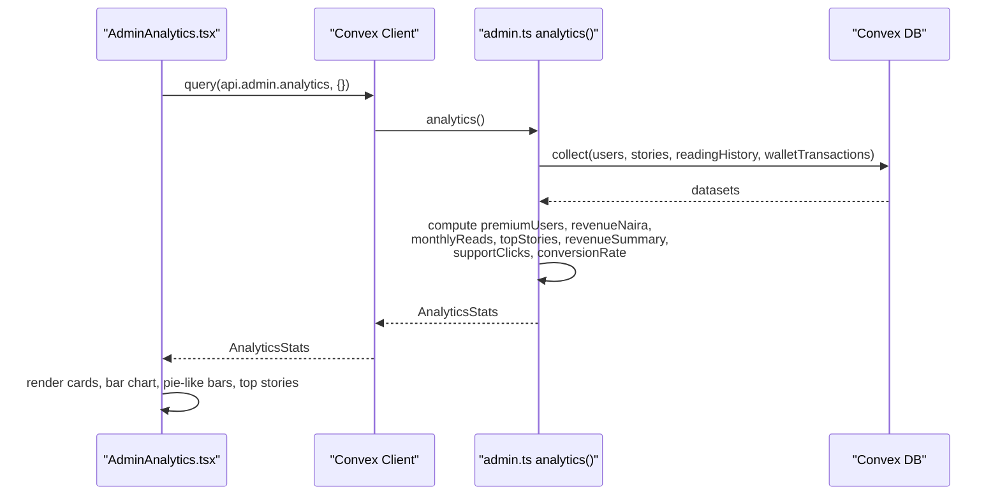

**Diagram sources**
- [AdminAnalytics.tsx:35-49](file://src/screens/admin/AdminAnalytics.tsx#L35-L49)
- [admin.ts:66-128](file://convex/admin.ts#L66-L128)

**Section sources**
- [AdminAnalytics.tsx:35-49](file://src/screens/admin/AdminAnalytics.tsx#L35-L49)
- [admin.ts:66-128](file://convex/admin.ts#L66-L128)

### Activity Tracking System
Administrative actions and moderation events are logged and surfaced in the activity log. The overview dashboard also renders recent activity entries.

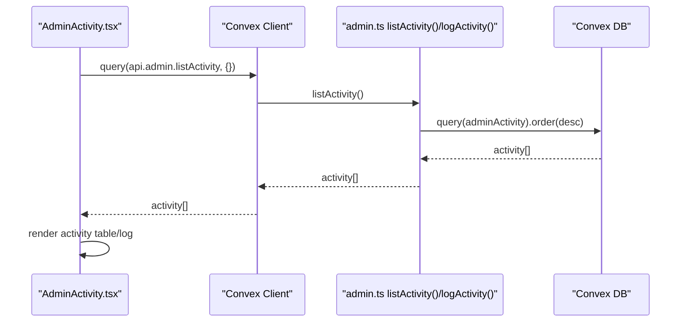

**Diagram sources**
- [AdminActivity.tsx:68-89](file://src/screens/admin/AdminActivity.tsx#L68-L89)
- [admin.ts:225-244](file://convex/admin.ts#L225-L244)

**Section sources**
- [AdminActivity.tsx:68-89](file://src/screens/admin/AdminActivity.tsx#L68-L89)
- [admin.ts:225-244](file://convex/admin.ts#L225-L244)

### Content Analytics
Content performance is driven by story views and saved counts, and reading history is used to compute monthly reading activity. The backend aggregates these signals to produce top stories and monthly trends.

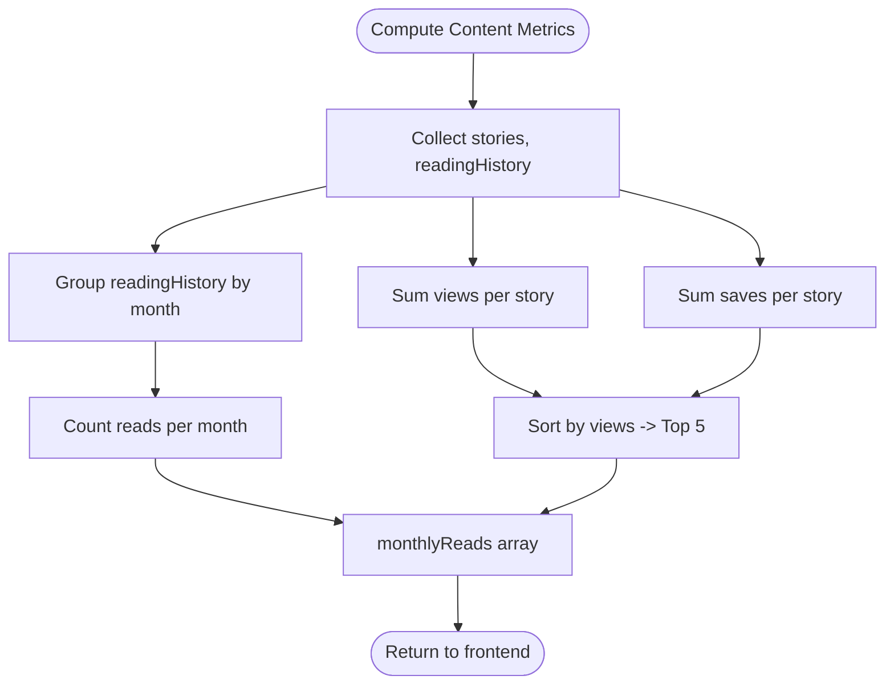

**Diagram sources**
- [admin.ts:69-128](file://convex/admin.ts#L69-L128)
- [schema.ts:95-125](file://convex/schema.ts#L95-L125)
- [schema.ts:225-232](file://convex/schema.ts#L225-L232)

**Section sources**
- [admin.ts:69-128](file://convex/admin.ts#L69-L128)
- [schema.ts:95-125](file://convex/schema.ts#L95-L125)
- [schema.ts:225-232](file://convex/schema.ts#L225-L232)

### Financial Analytics
Financial analytics centers on wallet transactions, premium subscriptions, and creator support. The backend computes revenue by type and provides subscriber analytics.

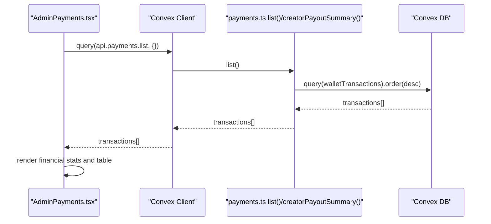

**Diagram sources**
- [AdminPayments.tsx:25-51](file://src/screens/admin/AdminPayments.tsx#L25-L51)
- [payments.ts:4-20](file://convex/payments.ts#L4-L20)

**Section sources**
- [AdminPayments.tsx:25-51](file://src/screens/admin/AdminPayments.tsx#L25-L51)
- [payments.ts:4-20](file://convex/payments.ts#L4-L20)

### Export Capabilities
Both overview and analytics dashboards support exporting CSV snapshots for reporting and compliance.

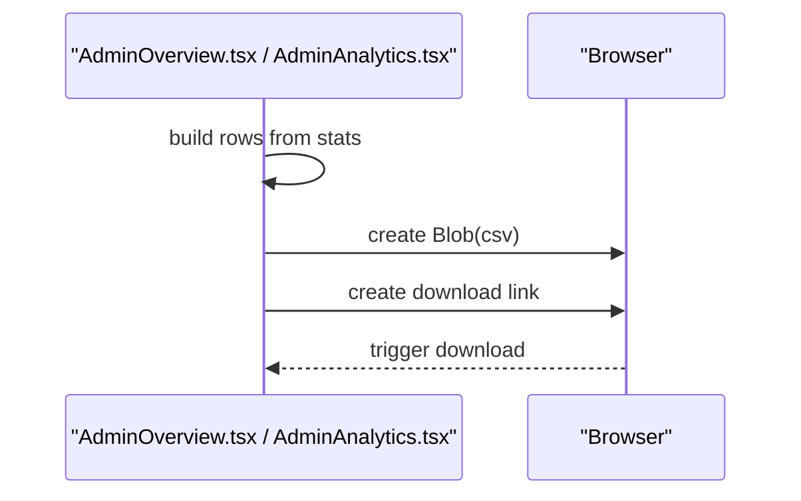

**Diagram sources**
- [AdminOverview.tsx:84-101](file://src/screens/admin/AdminOverview.tsx#L84-L101)
- [AdminAnalytics.tsx:64-80](file://src/screens/admin/AdminAnalytics.tsx#L64-L80)

**Section sources**
- [AdminOverview.tsx:84-101](file://src/screens/admin/AdminOverview.tsx#L84-L101)
- [AdminAnalytics.tsx:64-80](file://src/screens/admin/AdminAnalytics.tsx#L64-L80)

### Integration Between Analytics Components and Backend
The frontend dashboards depend on typed Convex APIs. The backend composes data from multiple tables and computes derived metrics. The engagement hook feeds behavioral signals into the gamification and analytics systems.

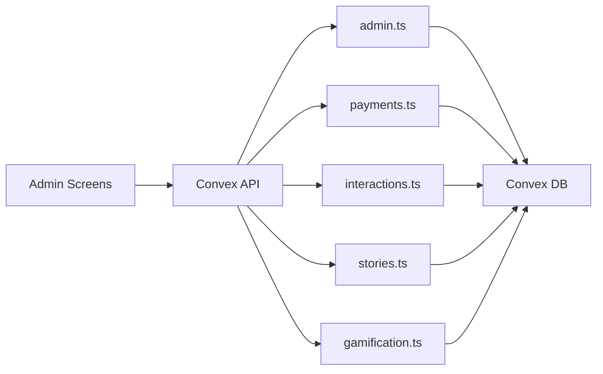

**Diagram sources**
- [convex.ts:1-12](file://src/lib/convex.ts#L1-L12)
- [admin.ts:1-364](file://convex/admin.ts#L1-L364)
- [payments.ts:1-291](file://convex/payments.ts#L1-L291)
- [interactions.ts:1-267](file://convex/interactions.ts#L1-L267)
- [stories.ts:1-180](file://convex/stories.ts#L1-L180)
- [gamification.ts:1-331](file://convex/gamification.ts#L1-L331)

**Section sources**
- [convex.ts:1-12](file://src/lib/convex.ts#L1-L12)
- [admin.ts:1-364](file://convex/admin.ts#L1-L364)
- [payments.ts:1-291](file://convex/payments.ts#L1-L291)
- [interactions.ts:1-267](file://convex/interactions.ts#L1-L267)
- [stories.ts:1-180](file://convex/stories.ts#L1-L180)
- [gamification.ts:1-331](file://convex/gamification.ts#L1-L331)

## Dependency Analysis
- Frontend dashboards depend on Convex client initialization and typed API bindings.
- Backend analytics rely on domain tables: users, stories, readingHistory, walletTransactions, adminActivity, contentReports, creators.
- Engagement hook depends on Firebase auth and Convex gamification recording.

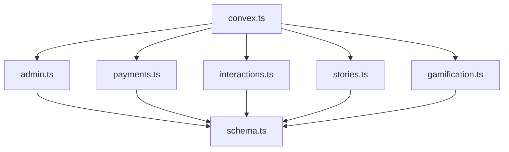

**Diagram sources**
- [convex.ts:1-12](file://src/lib/convex.ts#L1-L12)
- [admin.ts:1-364](file://convex/admin.ts#L1-L364)
- [payments.ts:1-291](file://convex/payments.ts#L1-L291)
- [interactions.ts:1-267](file://convex/interactions.ts#L1-L267)
- [stories.ts:1-180](file://convex/stories.ts#L1-L180)
- [gamification.ts:1-331](file://convex/gamification.ts#L1-L331)
- [schema.ts:24-494](file://convex/schema.ts#L24-L494)

**Section sources**
- [convex.ts:1-12](file://src/lib/convex.ts#L1-L12)
- [admin.ts:1-364](file://convex/admin.ts#L1-L364)
- [payments.ts:1-291](file://convex/payments.ts#L1-L291)
- [interactions.ts:1-267](file://convex/interactions.ts#L1-L267)
- [stories.ts:1-180](file://convex/stories.ts#L1-L180)
- [gamification.ts:1-331](file://convex/gamification.ts#L1-L331)
- [schema.ts:24-494](file://convex/schema.ts#L24-L494)

## Performance Considerations
- Batched queries: The backend uses Promise.all to fetch multiple collections concurrently for overview and analytics.
- Index usage: Tables are indexed on frequently queried fields (e.g., users by role, stories by status, transactions by status/reference).
- Lightweight engagement pings: The engagement hook sends periodic updates and flushes on visibility change to reduce overhead.
- Pagination and limits: Comments listing supports pagination and before cursors to manage large datasets.

[No sources needed since this section provides general guidance]

## Troubleshooting Guide
- Convex disabled: If the environment variable is missing, the Convex client is null and analytics will not load.
- Missing backend data: Ensure tables exist and indexes are present as defined in the schema.
- Engagement not recorded: Verify Firebase auth is initialized and the engagement hook is mounted during reading sessions.
- Payment reconciliation: Confirm transaction types and statuses align with expected values for revenue computation.

**Section sources**
- [convex.ts:5-9](file://src/lib/convex.ts#L5-L9)
- [schema.ts:24-494](file://convex/schema.ts#L24-L494)
- [useEngagement.ts:15-41](file://src/hooks/useEngagement.ts#L15-L41)

## Conclusion
The Lemonade Analytics Dashboard integrates frontend dashboards with backend data aggregation to deliver live platform insights. The overview and analytics dashboards provide KPIs, content performance, and financial metrics, while the activity, payments, reports, and creators dashboards support operational oversight. Export capabilities enable report generation for compliance. The engagement hook ensures behavioral signals are captured for deeper analytics.

## Appendices

### Backend Data Model Overview
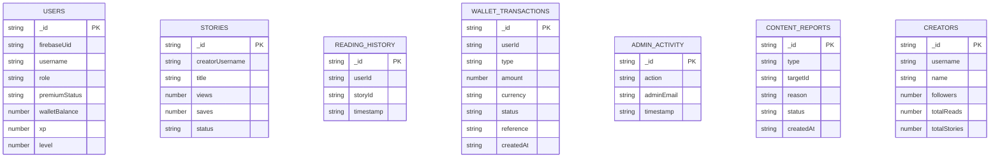

**Diagram sources**
- [schema.ts:24-494](file://convex/schema.ts#L24-L494)