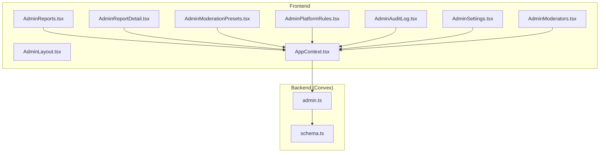
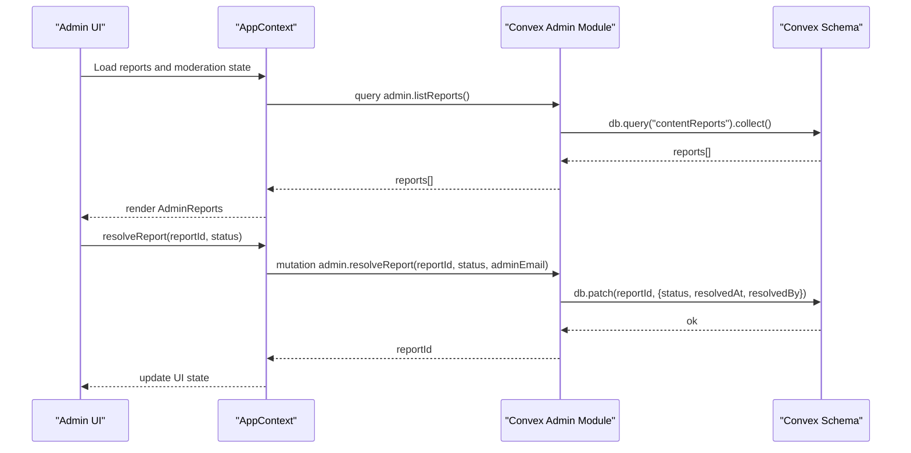
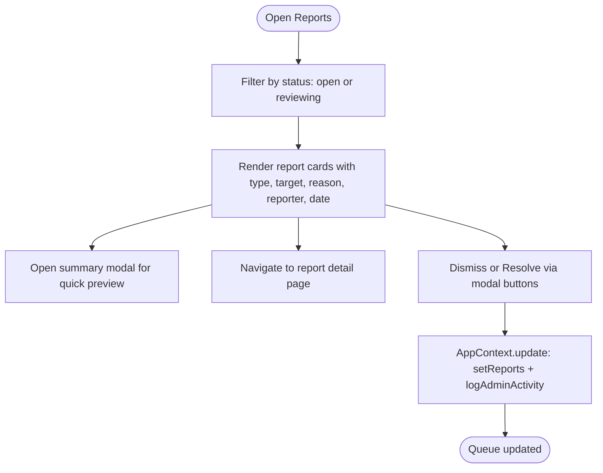
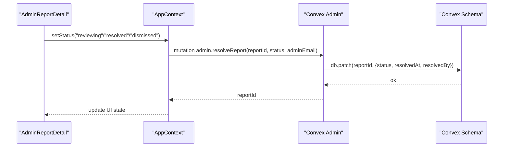
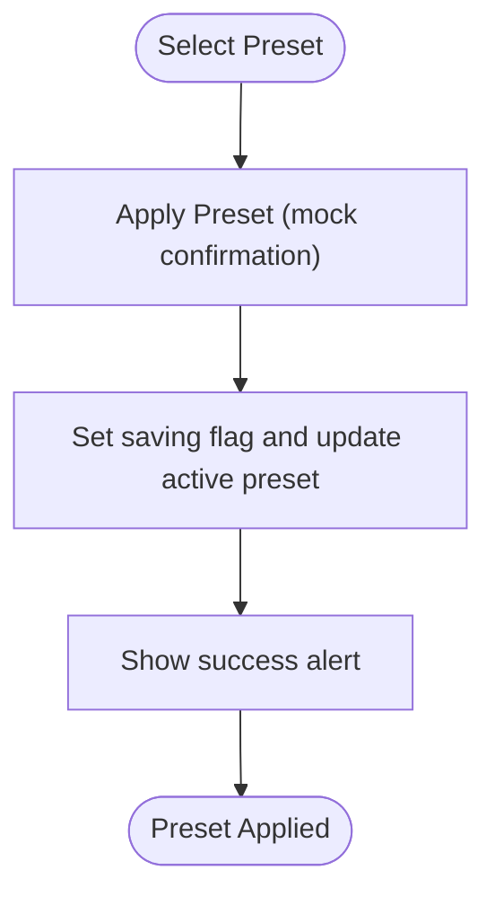
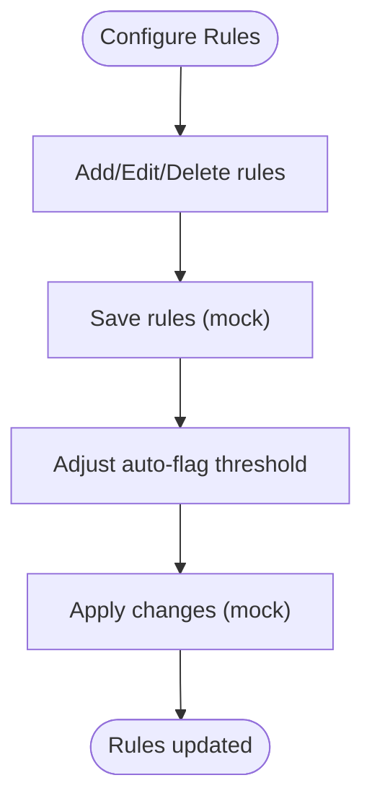
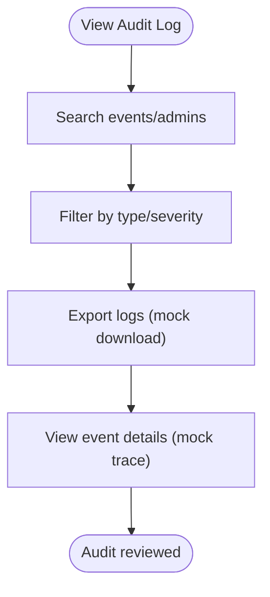
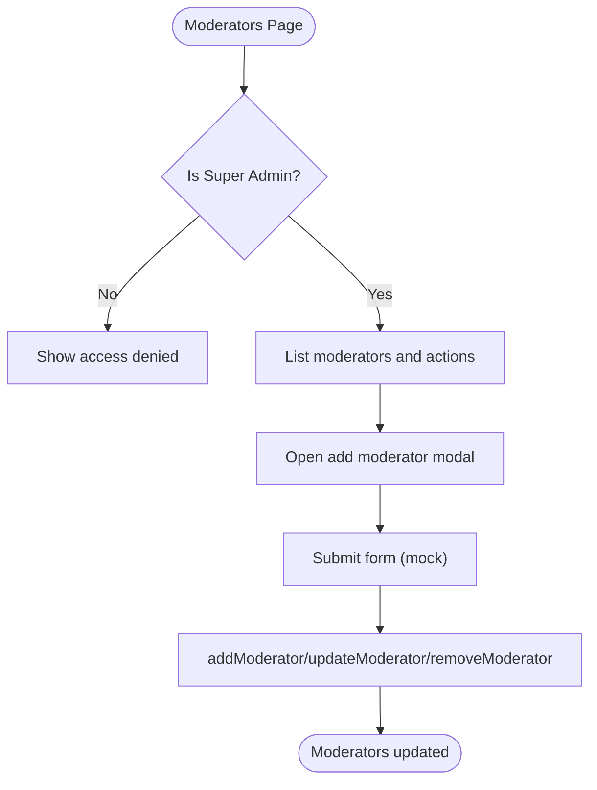
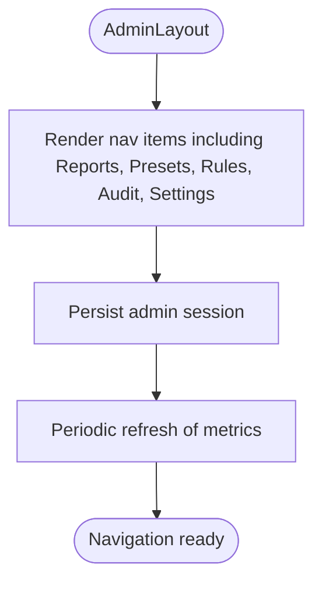
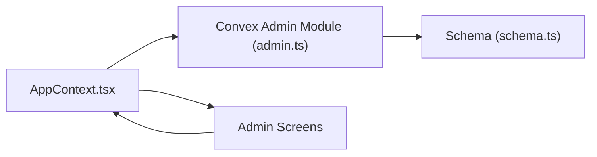

# Content Moderation

<cite>
**Referenced Files in This Document**
- [AdminReports.tsx](file://src/screens/admin/AdminReports.tsx)
- [AdminReportDetail.tsx](file://src/screens/admin/details/AdminReportDetail.tsx)
- [AdminModerationPresets.tsx](file://src/screens/admin/AdminModerationPresets.tsx)
- [AdminPlatformRules.tsx](file://src/screens/admin/AdminPlatformRules.tsx)
- [AdminAuditLog.tsx](file://src/screens/admin/AdminAuditLog.tsx)
- [AdminSettings.tsx](file://src/screens/admin/AdminSettings.tsx)
- [AdminModerators.tsx](file://src/screens/admin/AdminModerators.tsx)
- [AdminLayout.tsx](file://src/components/admin/AdminLayout.tsx)
- [AppContext.tsx](file://src/contexts/AppContext.tsx)
- [schema.ts](file://convex/schema.ts)
- [admin.ts](file://convex/admin.ts)
</cite>

## Table of Contents
1. [Introduction](#introduction)
2. [Project Structure](#project-structure)
3. [Core Components](#core-components)
4. [Architecture Overview](#architecture-overview)
5. [Detailed Component Analysis](#detailed-component-analysis)
6. [Dependency Analysis](#dependency-analysis)
7. [Performance Considerations](#performance-considerations)
8. [Troubleshooting Guide](#troubleshooting-guide)
9. [Conclusion](#conclusion)

## Introduction
This document describes the complete content moderation workflow system implemented in the Lemonade platform. It covers the moderation queue lifecycle (open, reviewing, resolved, dismissed), the report detail interface for viewing violation details and reporter/target context, the moderation presets system for standardized safety configurations, resolution actions (warning issuance, content removal, user sanctions), moderation history and audit trail, and the integration between frontend moderation components and backend administrative functions. It also outlines moderation team workflows, escalation procedures, and compliance reporting capabilities.

## Project Structure
The moderation system spans frontend React components under the admin screens and components, and backend Convex functions and schema definitions. The frontend integrates with a shared application context that manages moderation state and calls backend APIs. The backend defines the data model for moderation records and exposes queries and mutations for moderation operations.

**Diagram sources**
- [AdminReports.tsx:25-210](file://src/screens/admin/AdminReports.tsx#L25-L210)
- [AdminReportDetail.tsx:22-246](file://src/screens/admin/details/AdminReportDetail.tsx#L22-L246)
- [AdminModerationPresets.tsx:66-199](file://src/screens/admin/AdminModerationPresets.tsx#L66-L199)
- [AdminPlatformRules.tsx:25-188](file://src/screens/admin/AdminPlatformRules.tsx#L25-L188)
- [AdminAuditLog.tsx:26-196](file://src/screens/admin/AdminAuditLog.tsx#L26-L196)
- [AdminSettings.tsx:7-188](file://src/screens/admin/AdminSettings.tsx#L7-L188)
- [AdminModerators.tsx:20-192](file://src/screens/admin/AdminModerators.tsx#L20-L192)
- [AdminLayout.tsx:56-288](file://src/components/admin/AdminLayout.tsx#L56-L288)
- [AppContext.tsx:509-800](file://src/contexts/AppContext.tsx#L509-L800)
- [schema.ts:151-196](file://convex/schema.ts#L151-L196)
- [admin.ts:179-244](file://convex/admin.ts#L179-L244)

**Section sources**
- [AdminReports.tsx:25-210](file://src/screens/admin/AdminReports.tsx#L25-L210)
- [AppContext.tsx:509-800](file://src/contexts/AppContext.tsx#L509-L800)
- [schema.ts:151-196](file://convex/schema.ts#L151-L196)
- [admin.ts:179-244](file://convex/admin.ts#L179-L244)

## Core Components
- Moderation Queue: Displays open and reviewing reports and historical resolved/dismissed reports.
- Report Detail: Shows violation details, reporter identity, target content context, severity, and moderation actions.
- Moderation Presets: Provides strict, adaptive, and permissive safety modes with rule sets and instant application.
- Audit Log: Immutable record of admin events with search, filtering, and export capabilities.
- Moderators Management: Controls moderator access, roles, and statuses.
- Admin Settings: Central hub for moderation modes and global moderation rules toggles.

**Section sources**
- [AdminReports.tsx:25-210](file://src/screens/admin/AdminReports.tsx#L25-L210)
- [AdminReportDetail.tsx:22-246](file://src/screens/admin/details/AdminReportDetail.tsx#L22-L246)
- [AdminModerationPresets.tsx:66-199](file://src/screens/admin/AdminModerationPresets.tsx#L66-L199)
- [AdminAuditLog.tsx:26-196](file://src/screens/admin/AdminAuditLog.tsx#L26-L196)
- [AdminModerators.tsx:20-192](file://src/screens/admin/AdminModerators.tsx#L20-L192)
- [AdminSettings.tsx:7-188](file://src/screens/admin/AdminSettings.tsx#L7-L188)

## Architecture Overview
The moderation workflow integrates frontend UI components with a shared application context that fetches and updates moderation data via Convex backend functions. The backend schema defines the moderation data model, while the admin module exposes queries and mutations for listing reports, creating reports, resolving reports, logging admin activity, and managing moderators.

**Diagram sources**
- [AppContext.tsx:525-601](file://src/contexts/AppContext.tsx#L525-L601)
- [admin.ts:179-244](file://convex/admin.ts#L179-L244)
- [schema.ts:151-174](file://convex/schema.ts#L151-L174)

## Detailed Component Analysis

### Moderation Queue: AdminReports
The moderation queue presents open/reviewing reports and a history panel of resolved/dismissed reports. It supports quick preview modal, navigation to report detail, and bulk actions like dismissing or resolving a report.

**Diagram sources**
- [AdminReports.tsx:25-210](file://src/screens/admin/AdminReports.tsx#L25-L210)
- [AppContext.tsx:747-750](file://src/contexts/AppContext.tsx#L747-L750)

**Section sources**
- [AdminReports.tsx:25-210](file://src/screens/admin/AdminReports.tsx#L25-L210)
- [AppContext.tsx:747-750](file://src/contexts/AppContext.tsx#L747-L750)

### Report Detail: AdminReportDetail
The report detail page displays the violation reason, detailed message, submission date, severity, target type, reporter identity, and target content context. It provides moderation actions such as removing content and warning the user, along with an internal admin log for notes and status transitions.

**Diagram sources**
- [AdminReportDetail.tsx:22-83](file://src/screens/admin/details/AdminReportDetail.tsx#L22-L83)
- [admin.ts:209-223](file://convex/admin.ts#L209-L223)
- [schema.ts:151-174](file://convex/schema.ts#L151-L174)

**Section sources**
- [AdminReportDetail.tsx:22-246](file://src/screens/admin/details/AdminReportDetail.tsx#L22-L246)
- [admin.ts:209-223](file://convex/admin.ts#L209-L223)

### Moderation Presets: AdminModerationPresets
Moderation presets define global safety modes with rule sets. The component allows applying a preset, with visual indicators for active preset and saving state. Preset application is described as propagating system-wide within a short latency period.

**Diagram sources**
- [AdminModerationPresets.tsx:66-80](file://src/screens/admin/AdminModerationPresets.tsx#L66-L80)
- [AdminModerationPresets.tsx:108-168](file://src/screens/admin/AdminModerationPresets.tsx#L108-L168)

**Section sources**
- [AdminModerationPresets.tsx:66-199](file://src/screens/admin/AdminModerationPresets.tsx#L66-L199)

### Platform Rules and Auto-Flag Thresholds
Platform rules define content standards and categories. Auto-flag threshold controls automatic review triggers based on report volume within a time window. These are surfaced in the platform rules screen and settings.

**Diagram sources**
- [AdminPlatformRules.tsx:25-46](file://src/screens/admin/AdminPlatformRules.tsx#L25-L46)
- [AdminPlatformRules.tsx:146-185](file://src/screens/admin/AdminPlatformRules.tsx#L146-L185)

**Section sources**
- [AdminPlatformRules.tsx:25-188](file://src/screens/admin/AdminPlatformRules.tsx#L25-L188)
- [AdminSettings.tsx:97-111](file://src/screens/admin/AdminSettings.tsx#L97-L111)

### Audit Log: AdminAuditLog
The audit log provides an immutable record of admin events, including system-level and sensitive actions. Features include search, filtering by event type and severity, export, and a live logging indicator.

**Diagram sources**
- [AdminAuditLog.tsx:26-196](file://src/screens/admin/AdminAuditLog.tsx#L26-L196)

**Section sources**
- [AdminAuditLog.tsx:26-196](file://src/screens/admin/AdminAuditLog.tsx#L26-L196)

### Moderators Management: AdminModerators
Moderators management enables super admins to add, enable/disable, and remove moderators. It enforces role-based access and provides a modal for adding new moderators with selected roles.

**Diagram sources**
- [AdminModerators.tsx:20-51](file://src/screens/admin/AdminModerators.tsx#L20-L51)
- [AdminModerators.tsx:114-192](file://src/screens/admin/AdminModerators.tsx#L114-L192)

**Section sources**
- [AdminModerators.tsx:20-192](file://src/screens/admin/AdminModerators.tsx#L20-L192)

### Admin Layout and Navigation
The admin layout provides navigation to moderation-related pages, including reports, moderation presets, platform rules, audit log, and settings. It also handles admin session persistence and header refresh intervals.

**Diagram sources**
- [AdminLayout.tsx:56-94](file://src/components/admin/AdminLayout.tsx#L56-L94)
- [AdminLayout.tsx:130-150](file://src/components/admin/AdminLayout.tsx#L130-L150)

**Section sources**
- [AdminLayout.tsx:56-288](file://src/components/admin/AdminLayout.tsx#L56-L288)

## Dependency Analysis
The frontend depends on the application context for state management and calls Convex backend functions for moderation operations. The backend schema defines the moderation data model and the admin module exposes CRUD-like operations for moderation records and admin activity.

**Diagram sources**
- [AppContext.tsx:525-601](file://src/contexts/AppContext.tsx#L525-L601)
- [admin.ts:179-244](file://convex/admin.ts#L179-L244)
- [schema.ts:151-196](file://convex/schema.ts#L151-L196)

**Section sources**
- [AppContext.tsx:525-601](file://src/contexts/AppContext.tsx#L525-L601)
- [admin.ts:179-244](file://convex/admin.ts#L179-L244)
- [schema.ts:151-196](file://convex/schema.ts#L151-L196)

## Performance Considerations
- Live content refresh: The application context periodically refreshes moderation data to keep the UI synchronized. Consider throttling or debouncing refresh intervals for large datasets.
- Batch operations: Group moderation actions (e.g., mass dismiss/resolves) to minimize backend calls.
- Pagination: For large audit logs or report histories, implement pagination to reduce DOM rendering overhead.
- Debounced search: Apply debounced input for search and filter operations in audit logs and report lists.

## Troubleshooting Guide
- Reports not updating: Verify periodic refresh is running and network connectivity to Convex. Check the admin activity log for errors.
- Preset application appears stuck: Confirm the mock confirmation flow and verify that the active preset state updates in the UI.
- Audit log empty: Ensure search/filter terms are cleared and that the mock data is representative of real events.
- Moderator actions failing: Confirm the current admin role is super admin and that the add/update/remove flows are executed.

**Section sources**
- [AppContext.tsx:525-601](file://src/contexts/AppContext.tsx#L525-L601)
- [AdminAuditLog.tsx:26-196](file://src/screens/admin/AdminAuditLog.tsx#L26-L196)
- [AdminModerators.tsx:27-37](file://src/screens/admin/AdminModerators.tsx#L27-L37)

## Conclusion
The Lemonade moderation system combines a robust frontend UI with a backend-driven data model to manage the full lifecycle of content reports, from queue to resolution and audit. Moderation presets enable rapid policy changes, while the audit log ensures transparency and compliance. The architecture supports scalable moderation workflows, with room for enhancements such as batch operations, pagination, and stricter backend validations.