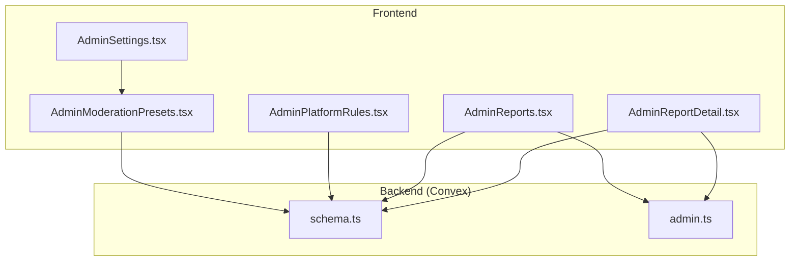
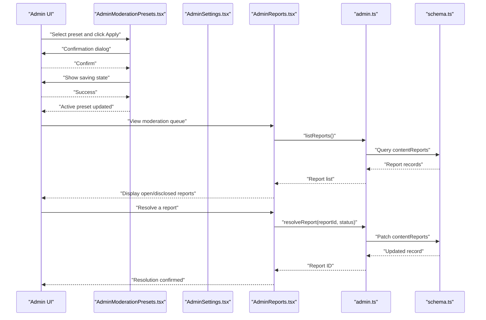
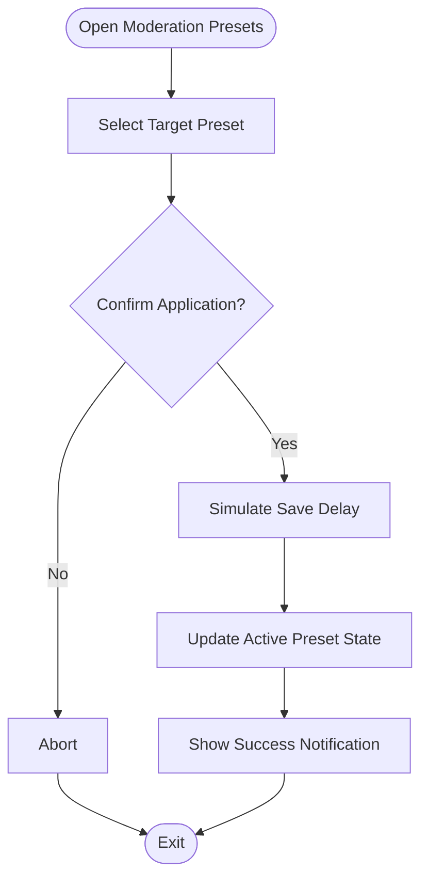
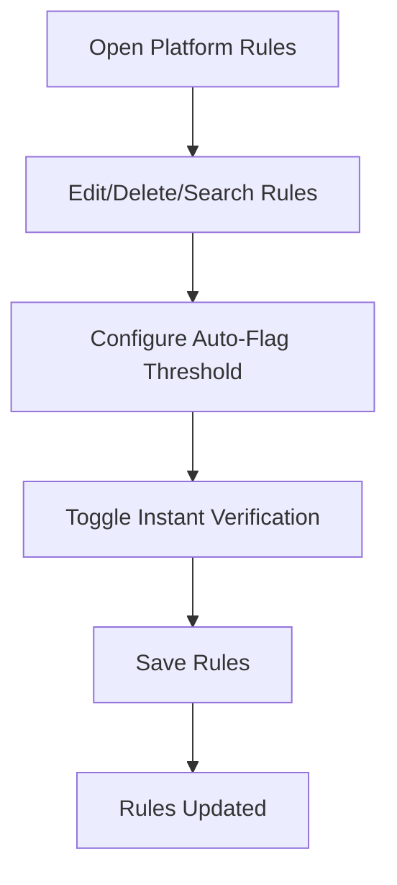
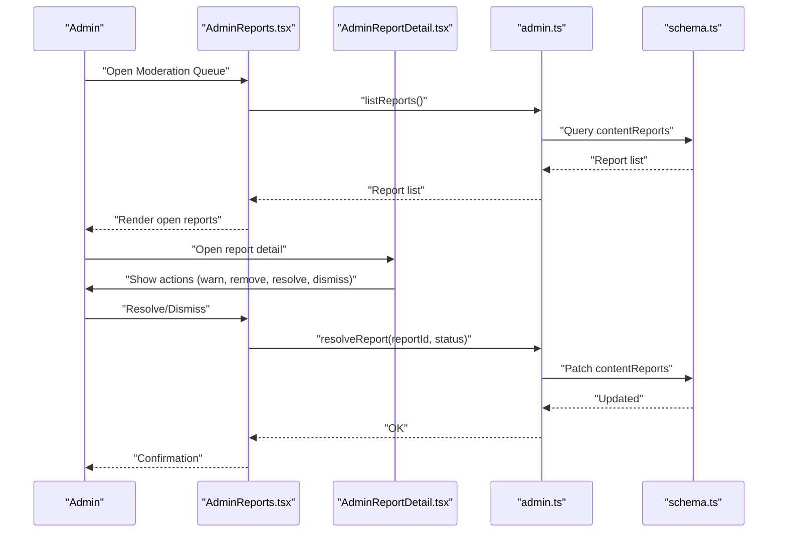
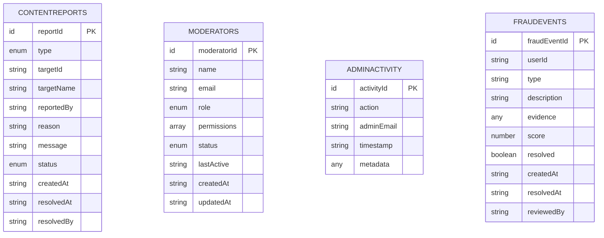
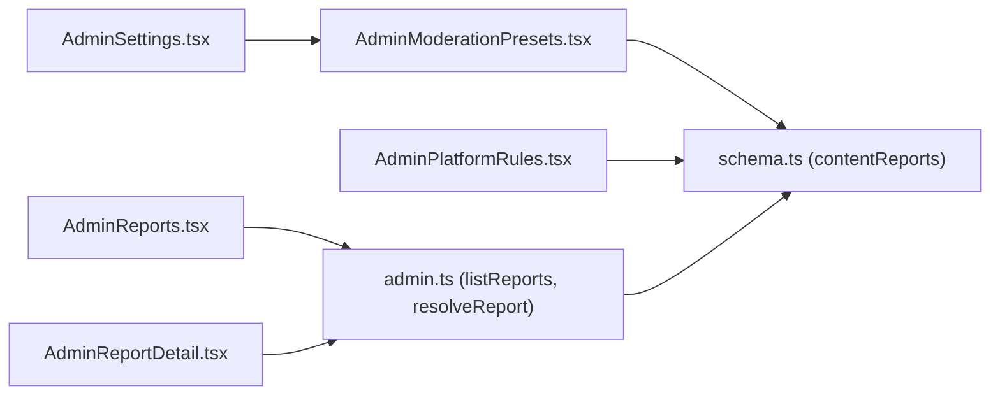

# Moderation Presets

<cite>
**Referenced Files in This Document**
- [AdminModerationPresets.tsx](file://src/screens/admin/AdminModerationPresets.tsx)
- [AdminPlatformRules.tsx](file://src/screens/admin/AdminPlatformRules.tsx)
- [AdminReports.tsx](file://src/screens/admin/AdminReports.tsx)
- [AdminReportDetail.tsx](file://src/screens/admin/details/AdminReportDetail.tsx)
- [schema.ts](file://convex/schema.ts)
- [admin.ts](file://convex/admin.ts)
- [AdminSettings.tsx](file://src/screens/admin/AdminSettings.tsx)
</cite>

## Table of Contents
1. [Introduction](#introduction)
2. [Project Structure](#project-structure)
3. [Core Components](#core-components)
4. [Architecture Overview](#architecture-overview)
5. [Detailed Component Analysis](#detailed-component-analysis)
6. [Dependency Analysis](#dependency-analysis)
7. [Performance Considerations](#performance-considerations)
8. [Troubleshooting Guide](#troubleshooting-guide)
9. [Conclusion](#conclusion)

## Introduction
This document describes the moderation presets system that defines standardized violation categories and automated detection rules for content safety and integrity. It covers:
- Preset creation and management interface for defining common violation types with predefined actions and penalties
- Automated detection algorithms for flagging potential violations based on content patterns and user behavior
- Preset configuration options including severity levels, automatic action triggers, and escalation thresholds
- Integration with the reporting system for applying presets to new reports
- Preset approval workflow and quality assurance processes for maintaining effective moderation standards

## Project Structure
The moderation presets feature spans frontend UI components and backend Convex modules:
- Frontend: preset selection UI, platform rules editor, and reporting integration
- Backend: schema definitions for moderation-related entities and admin APIs for report lifecycle and fraud scanning

**Diagram sources**
- [AdminModerationPresets.tsx:66-80](file://src/screens/admin/AdminModerationPresets.tsx#L66-L80)
- [AdminPlatformRules.tsx:146-185](file://src/screens/admin/AdminPlatformRules.tsx#L146-L185)
- [AdminReports.tsx:25-31](file://src/screens/admin/AdminReports.tsx#L25-L31)
- [AdminReportDetail.tsx:22-46](file://src/screens/admin/details/AdminReportDetail.tsx#L22-L46)
- [schema.ts:151-174](file://convex/schema.ts#L151-L174)
- [admin.ts:179-223](file://convex/admin.ts#L179-L223)
- [AdminSettings.tsx:81-111](file://src/screens/admin/AdminSettings.tsx#L81-L111)

**Section sources**
- [AdminModerationPresets.tsx:1-200](file://src/screens/admin/AdminModerationPresets.tsx#L1-L200)
- [AdminPlatformRules.tsx:1-189](file://src/screens/admin/AdminPlatformRules.tsx#L1-L189)
- [AdminReports.tsx:1-211](file://src/screens/admin/AdminReports.tsx#L1-L211)
- [AdminReportDetail.tsx:1-247](file://src/screens/admin/details/AdminReportDetail.tsx#L1-L247)
- [schema.ts:151-174](file://convex/schema.ts#L151-L174)
- [admin.ts:179-223](file://convex/admin.ts#L179-L223)
- [AdminSettings.tsx:81-111](file://src/screens/admin/AdminSettings.tsx#L81-L111)

## Core Components
- Moderation Presets UI: Provides three built-in presets (Strict Lockdown, Adaptive Balance, Safe Growth) with rule summaries and one-click application.
- Platform Rules Editor: Manages governance rules and includes preset-related configuration controls (auto-flag threshold and instant verification).
- Reporting Integration: Connects moderation decisions to the content report lifecycle and supports manual actions per report.
- Backend Schema: Defines content reports and related entities used by the moderation system.
- Admin APIs: Provide CRUD and resolution operations for reports and auxiliary moderation utilities.

**Section sources**
- [AdminModerationPresets.tsx:18-64](file://src/screens/admin/AdminModerationPresets.tsx#L18-L64)
- [AdminPlatformRules.tsx:146-185](file://src/screens/admin/AdminPlatformRules.tsx#L146-L185)
- [AdminReports.tsx:25-31](file://src/screens/admin/AdminReports.tsx#L25-L31)
- [schema.ts:151-174](file://convex/schema.ts#L151-L174)
- [admin.ts:179-223](file://convex/admin.ts#L179-L223)

## Architecture Overview
The moderation presets system integrates UI-driven preset application with backend report handling and schema-backed persistence.

**Diagram sources**
- [AdminModerationPresets.tsx:66-80](file://src/screens/admin/AdminModerationPresets.tsx#L66-L80)
- [AdminSettings.tsx:81-111](file://src/screens/admin/AdminSettings.tsx#L81-L111)
- [AdminReports.tsx:25-31](file://src/screens/admin/AdminReports.tsx#L25-L31)
- [admin.ts:179-223](file://convex/admin.ts#L179-L223)
- [schema.ts:151-174](file://convex/schema.ts#L151-L174)

## Detailed Component Analysis

### Moderation Presets UI
- Purpose: Allow administrators to quickly switch between predefined moderation modes and visualize enabled rules.
- Key behaviors:
  - Three presets with distinct icons, colors, and rule sets
  - One-click application with confirmation and simulated save delay
  - Current preset indicator and informational panel on latency and audit trail

**Diagram sources**
- [AdminModerationPresets.tsx:66-80](file://src/screens/admin/AdminModerationPresets.tsx#L66-L80)
- [AdminModerationPresets.tsx:170-196](file://src/screens/admin/AdminModerationPresets.tsx#L170-L196)

**Section sources**
- [AdminModerationPresets.tsx:18-64](file://src/screens/admin/AdminModerationPresets.tsx#L18-L64)
- [AdminModerationPresets.tsx:66-80](file://src/screens/admin/AdminModerationPresets.tsx#L66-L80)
- [AdminModerationPresets.tsx:170-196](file://src/screens/admin/AdminModerationPresets.tsx#L170-L196)

### Platform Rules Editor and Preset Controls
- Purpose: Manage platform governance rules and configure moderation-related thresholds and toggles.
- Key behaviors:
  - Searchable rule cards with category and status indicators
  - Auto-flag threshold configuration (editable numeric input)
  - Instant verification toggle
  - Save and add rule actions

**Diagram sources**
- [AdminPlatformRules.tsx:25-45](file://src/screens/admin/AdminPlatformRules.tsx#L25-L45)
- [AdminPlatformRules.tsx:146-185](file://src/screens/admin/AdminPlatformRules.tsx#L146-L185)

**Section sources**
- [AdminPlatformRules.tsx:18-23](file://src/screens/admin/AdminPlatformRules.tsx#L18-L23)
- [AdminPlatformRules.tsx:146-185](file://src/screens/admin/AdminPlatformRules.tsx#L146-L185)

### Reporting Integration
- Purpose: Surface moderation queue and enable resolution actions aligned with preset-driven policies.
- Key behaviors:
  - List open and past reports
  - Quick preview modal with actions (warn, remove content, issue warning)
  - Resolve/dismiss actions per report
  - Integration with preset configuration for thresholds and verification

**Diagram sources**
- [AdminReports.tsx:25-31](file://src/screens/admin/AdminReports.tsx#L25-L31)
- [AdminReportDetail.tsx:22-46](file://src/screens/admin/details/AdminReportDetail.tsx#L22-L46)
- [admin.ts:179-223](file://convex/admin.ts#L179-L223)
- [schema.ts:151-174](file://convex/schema.ts#L151-L174)

**Section sources**
- [AdminReports.tsx:25-31](file://src/screens/admin/AdminReports.tsx#L25-L31)
- [AdminReportDetail.tsx:22-46](file://src/screens/admin/details/AdminReportDetail.tsx#L22-L46)
- [admin.ts:179-223](file://convex/admin.ts#L179-L223)
- [schema.ts:151-174](file://convex/schema.ts#L151-L174)

### Backend Schema and Admin APIs
- Purpose: Persist moderation data and expose operations for report lifecycle and auxiliary moderation tasks.
- Key entities:
  - contentReports: Stores report metadata, status, and timestamps
- Key mutations/queries:
  - listReports, createReport, resolveReport
  - scanEngagementForFraud (auxiliary fraud detection)

**Diagram sources**
- [schema.ts:151-174](file://convex/schema.ts#L151-L174)
- [schema.ts:183-196](file://convex/schema.ts#L183-L196)
- [schema.ts:176-181](file://convex/schema.ts#L176-L181)
- [schema.ts:483-493](file://convex/schema.ts#L483-L493)

**Section sources**
- [schema.ts:151-174](file://convex/schema.ts#L151-L174)
- [admin.ts:179-223](file://convex/admin.ts#L179-L223)
- [admin.ts:312-348](file://convex/admin.ts#L312-L348)

## Dependency Analysis
- UI-to-backend dependencies:
  - AdminModerationPresets.tsx interacts with preset configuration and informs the current active preset
  - AdminReports.tsx and AdminReportDetail.tsx depend on admin.ts for listing and resolving reports
  - AdminPlatformRules.tsx configures moderation thresholds and toggles visible in the UI
- Data dependencies:
  - contentReports entity underpins the reporting workflow
  - adminActivity captures administrative actions for auditability

**Diagram sources**
- [AdminModerationPresets.tsx:66-80](file://src/screens/admin/AdminModerationPresets.tsx#L66-L80)
- [AdminPlatformRules.tsx:146-185](file://src/screens/admin/AdminPlatformRules.tsx#L146-L185)
- [AdminReports.tsx:25-31](file://src/screens/admin/AdminReports.tsx#L25-L31)
- [AdminReportDetail.tsx:22-46](file://src/screens/admin/details/AdminReportDetail.tsx#L22-L46)
- [admin.ts:179-223](file://convex/admin.ts#L179-L223)
- [schema.ts:151-174](file://convex/schema.ts#L151-L174)
- [AdminSettings.tsx:81-111](file://src/screens/admin/AdminSettings.tsx#L81-L111)

**Section sources**
- [AdminModerationPresets.tsx:66-80](file://src/screens/admin/AdminModerationPresets.tsx#L66-L80)
- [AdminPlatformRules.tsx:146-185](file://src/screens/admin/AdminPlatformRules.tsx#L146-L185)
- [AdminReports.tsx:25-31](file://src/screens/admin/AdminReports.tsx#L25-L31)
- [AdminReportDetail.tsx:22-46](file://src/screens/admin/details/AdminReportDetail.tsx#L22-L46)
- [admin.ts:179-223](file://convex/admin.ts#L179-L223)
- [schema.ts:151-174](file://convex/schema.ts#L151-L174)
- [AdminSettings.tsx:81-111](file://src/screens/admin/AdminSettings.tsx#L81-L111)

## Performance Considerations
- Preset application latency: The UI indicates a propagation delay of approximately 30 seconds across edge nodes when switching presets.
- Report listing and resolution: Queries and mutations operate on indexed collections; ensure appropriate indexing for large datasets.
- Fraud scanning: Engagement-based fraud detection scans recent events and inserts flagged entries; tune the lookback window and heuristics for performance.

[No sources needed since this section provides general guidance]

## Troubleshooting Guide
- Preset application appears stuck:
  - Verify the confirmation dialog and simulated save delay behavior in the UI.
  - Confirm that the active preset state updates after the save completes.
- Reports not appearing:
  - Ensure the report status filters align with open vs. resolved states.
  - Confirm that listReports returns data from the backend.
- Resolution actions failing:
  - Check resolveReport mutation arguments and backend patch operation.
  - Verify contentReports entity updates and timestamps.

**Section sources**
- [AdminModerationPresets.tsx:66-80](file://src/screens/admin/AdminModerationPresets.tsx#L66-L80)
- [AdminReports.tsx:25-31](file://src/screens/admin/AdminReports.tsx#L25-L31)
- [admin.ts:179-223](file://convex/admin.ts#L179-L223)

## Conclusion
The moderation presets system provides a fast, centralized way to enforce standardized safety and integrity policies across the platform. The UI enables quick preset application, while the backend ensures robust persistence and lifecycle management for reports. Together with platform rules and reporting integration, the system offers a practical foundation for scalable moderation workflows.