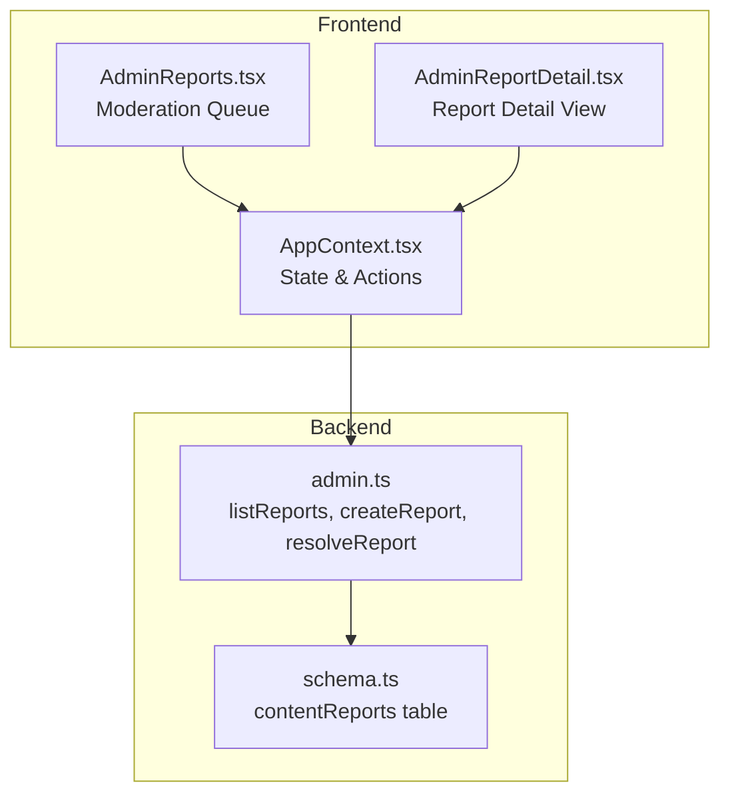
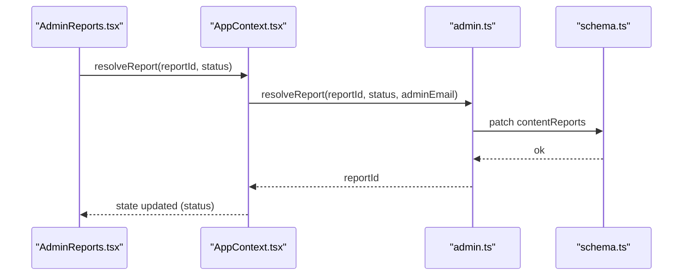
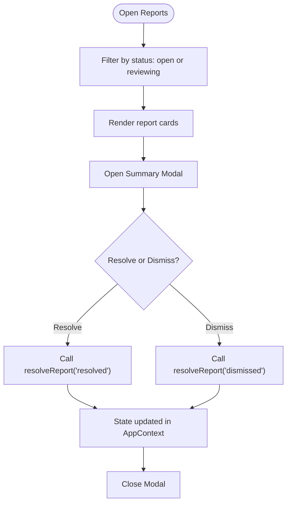
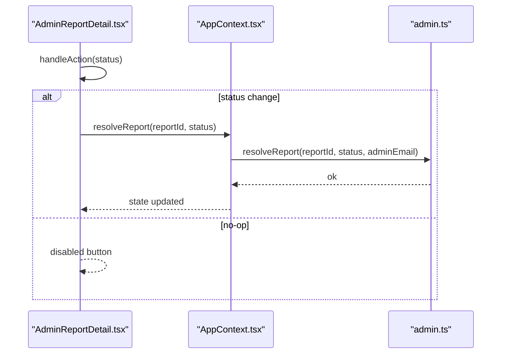
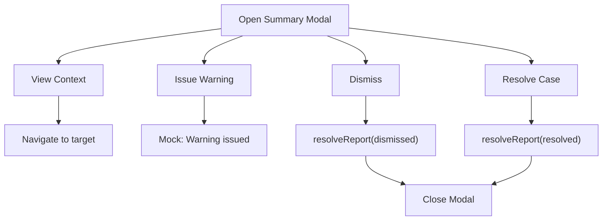
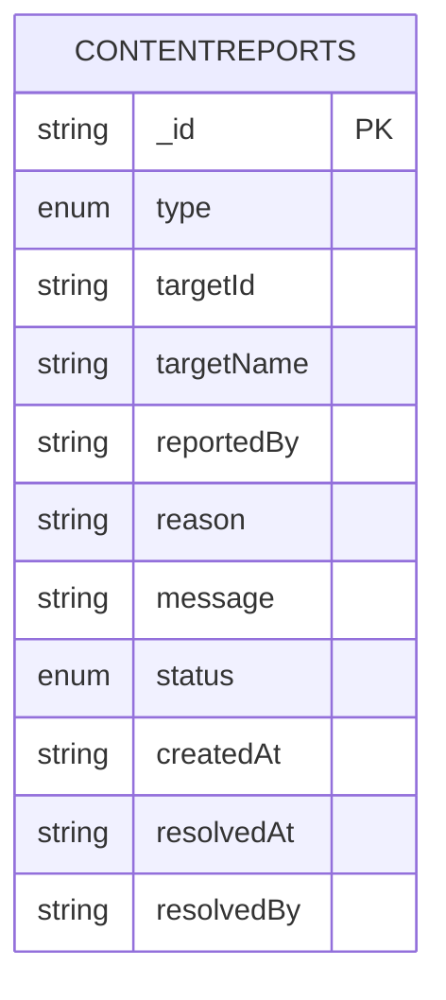
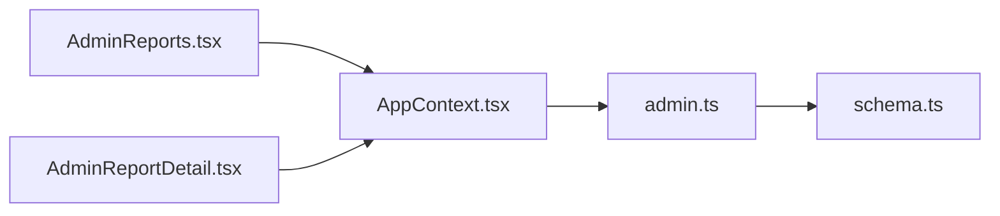

# Report Management

<cite>
**Referenced Files in This Document**
- [AdminReports.tsx](file://src/screens/admin/AdminReports.tsx)
- [AdminReportDetail.tsx](file://src/screens/admin/details/AdminReportDetail.tsx)
- [AppContext.tsx](file://src/contexts/AppContext.tsx)
- [admin.ts](file://convex/admin.ts)
- [schema.ts](file://convex/schema.ts)
</cite>

## Table of Contents
1. [Introduction](#introduction)
2. [Project Structure](#project-structure)
3. [Core Components](#core-components)
4. [Architecture Overview](#architecture-overview)
5. [Detailed Component Analysis](#detailed-component-analysis)
6. [Dependency Analysis](#dependency-analysis)
7. [Performance Considerations](#performance-considerations)
8. [Troubleshooting Guide](#troubleshooting-guide)
9. [Conclusion](#conclusion)

## Introduction
This document describes the report management system end-to-end, from report submission to resolution. It covers the moderation queue interface, filtering and sorting capabilities, the report detail view, status tracking, summary modal, and the integration between frontend components and backend administrative functions. It also outlines categorization, priority assignment, and escalation workflows for different violation types.

## Project Structure
The report management system spans frontend screens and backend Convex functions:
- Frontend screens:
  - Moderation queue listing open and reviewing reports
  - Report detail view with violation details, reporter info, target context, and actions
  - Report summary modal for quick preview and actions
- Backend:
  - Convex schema defines the contentReports table and statuses
  - Convex admin module exposes queries and mutations for listing, creating, and resolving reports

**Diagram sources**
- [AdminReports.tsx:25-210](file://src/screens/admin/AdminReports.tsx#L25-L210)
- [AdminReportDetail.tsx:22-246](file://src/screens/admin/details/AdminReportDetail.tsx#L22-L246)
- [AppContext.tsx:139-175](file://src/contexts/AppContext.tsx#L139-L175)
- [schema.ts:151-174](file://convex/schema.ts#L151-L174)
- [admin.ts:179-223](file://convex/admin.ts#L179-L223)

**Section sources**
- [AdminReports.tsx:25-210](file://src/screens/admin/AdminReports.tsx#L25-L210)
- [AdminReportDetail.tsx:22-246](file://src/screens/admin/details/AdminReportDetail.tsx#L22-L246)
- [AppContext.tsx:139-175](file://src/contexts/AppContext.tsx#L139-L175)
- [schema.ts:151-174](file://convex/schema.ts#L151-L174)
- [admin.ts:179-223](file://convex/admin.ts#L179-L223)

## Core Components
- Moderation Queue (AdminReports):
  - Displays open and reviewing reports
  - Provides quick preview modal and navigation to detail view
  - Shows moderation history panel
- Report Detail (AdminReportDetail):
  - Full report details, target context, reporter identity
  - Action buttons to mark reviewing, resolve, dismiss
  - Admin internal history and notes
- App Context:
  - Holds reports state and exposes resolveReport action
  - Loads reports from Convex via listReports
- Convex Admin Module:
  - Queries: listReports, listActivity, listModerators
  - Mutations: createReport, resolveReport, logActivity

**Section sources**
- [AdminReports.tsx:25-210](file://src/screens/admin/AdminReports.tsx#L25-L210)
- [AdminReportDetail.tsx:22-246](file://src/screens/admin/details/AdminReportDetail.tsx#L22-L246)
- [AppContext.tsx:139-175](file://src/contexts/AppContext.tsx#L139-L175)
- [admin.ts:179-223](file://convex/admin.ts#L179-L223)

## Architecture Overview
The system follows a clear separation of concerns:
- Frontend screens render UI and manage local state for quick actions
- AppContext aggregates data from Convex and exposes typed actions
- Convex schema enforces data shape and statuses
- Admin mutations persist state changes to the database

**Diagram sources**
- [AdminReports.tsx:190-203](file://src/screens/admin/AdminReports.tsx#L190-L203)
- [AppContext.tsx:747-750](file://src/contexts/AppContext.tsx#L747-L750)
- [admin.ts:209-223](file://convex/admin.ts#L209-L223)
- [schema.ts:151-174](file://convex/schema.ts#L151-L174)

## Detailed Component Analysis

### Moderation Queue (AdminReports)
- Purpose: Central hub for reviewing open and reviewing reports
- Features:
  - Filters reports by status: open and reviewing appear in the main list
  - Past reports panel shows resolved and dismissed
  - Quick preview modal for rapid triage
  - Navigation to detailed view per report
- UI highlights:
  - Live count of active issues
  - Compact cards with reporter identity and date
  - Quick preview button per report
  - Summary modal with target content, reporter identity, violation detail, and action buttons

**Diagram sources**
- [AdminReports.tsx:30-31](file://src/screens/admin/AdminReports.tsx#L30-L31)
- [AdminReports.tsx:74-82](file://src/screens/admin/AdminReports.tsx#L74-L82)
- [AdminReports.tsx:124-207](file://src/screens/admin/AdminReports.tsx#L124-L207)
- [AppContext.tsx:747-750](file://src/contexts/AppContext.tsx#L747-L750)

**Section sources**
- [AdminReports.tsx:25-210](file://src/screens/admin/AdminReports.tsx#L25-L210)

### Report Detail View (AdminReportDetail)
- Purpose: Deep-dive into a single report with all relevant context
- Sections:
  - Report header with type, ID, and current status badge
  - Reason and detailed message
  - Metadata: date submitted, severity, target type
  - Target content context with navigation to target
  - Reporter identity card with user detail link
  - Admin actions: remove content, warn user
  - Admin internal history and notes
- Actions:
  - Mark reviewing
  - Resolve
  - Dismiss

**Diagram sources**
- [AdminReportDetail.tsx:43-46](file://src/screens/admin/details/AdminReportDetail.tsx#L43-L46)
- [AdminReportDetail.tsx:61-82](file://src/screens/admin/details/AdminReportDetail.tsx#L61-L82)
- [AppContext.tsx:747-750](file://src/contexts/AppContext.tsx#L747-L750)
- [admin.ts:209-223](file://convex/admin.ts#L209-L223)

**Section sources**
- [AdminReportDetail.tsx:22-246](file://src/screens/admin/details/AdminReportDetail.tsx#L22-L246)

### Report Summary Modal
- Purpose: Provide a compact, contextual preview before opening the full detail page
- Content:
  - Target content and reporter identity
  - Violation detail excerpt
  - Action buttons: view context, issue warning, dismiss, resolve
- Behavior:
  - Clicking outside or the close button dismisses the modal
  - Buttons trigger resolveReport and navigate to target context

**Diagram sources**
- [AdminReports.tsx:124-207](file://src/screens/admin/AdminReports.tsx#L124-L207)
- [AdminReports.tsx:174-187](file://src/screens/admin/AdminReports.tsx#L174-L187)
- [AdminReports.tsx:190-203](file://src/screens/admin/AdminReports.tsx#L190-L203)

**Section sources**
- [AdminReports.tsx:123-207](file://src/screens/admin/AdminReports.tsx#L123-L207)

### Backend Integration (Convex)
- Schema:
  - contentReports table with fields: type, targetId, targetName, reportedBy, reason, message, status, timestamps
  - Indexes on status and targetId for efficient queries
- Queries:
  - listReports: fetch all reports for the moderation queue
- Mutations:
  - createReport: insert a new report with status open and createdAt timestamp
  - resolveReport: update status, resolvedAt, resolvedBy
- Status lifecycle:
  - open → reviewing → resolved/dismissed

**Diagram sources**
- [schema.ts:151-174](file://convex/schema.ts#L151-L174)

**Section sources**
- [schema.ts:151-174](file://convex/schema.ts#L151-L174)
- [admin.ts:179-223](file://convex/admin.ts#L179-L223)

### Status Tracking System
- States:
  - open: newly submitted
  - reviewing: in progress
  - resolved: handled and closed
  - dismissed: rejected or invalid
- Frontend state:
  - AppContext.resolveReport updates the report’s status locally
- Backend persistence:
  - admin.resolveReport patches the record with resolvedAt and resolvedBy

**Section sources**
- [AppContext.tsx:747-750](file://src/contexts/AppContext.tsx#L747-L750)
- [admin.ts:209-223](file://convex/admin.ts#L209-L223)

### Filtering and Sorting
- Filtering:
  - Moderation queue filters by status: open and reviewing are shown together
  - Past reports panel shows resolved and dismissed
- Sorting:
  - Current implementation sorts by creation date (via Convex collect)
  - Enhancement opportunity: add explicit sort controls (e.g., newest, oldest, severity)

**Section sources**
- [AdminReports.tsx:30-31](file://src/screens/admin/AdminReports.tsx#L30-L31)
- [admin.ts:179-184](file://convex/admin.ts#L179-L184)

### Report Categorization, Priority, and Escalation
- Categorization:
  - type field supports story, chapter, user, comment
  - targetId and targetName connect to the reported entity
- Priority and Severity:
  - Severity is present in the detail view UI (Medium)
  - Enhancement opportunity: add priority field to contentReports and derive from type/reason
- Escalation:
  - UI includes “Issue Warning” and “Remove Content” actions
  - Backend could enforce escalation rules (e.g., repeat offenders, severe violations)

**Section sources**
- [schema.ts:152-157](file://convex/schema.ts#L152-L157)
- [AdminReportDetail.tsx:135-137](file://src/screens/admin/details/AdminReportDetail.tsx#L135-L137)
- [AdminReportDetail.tsx:174-189](file://src/screens/admin/details/AdminReportDetail.tsx#L174-L189)

## Dependency Analysis
- Frontend depends on AppContext for state and actions
- AppContext depends on Convex admin module for data and mutations
- Convex admin module depends on schema for data model
- UI components depend on shared icons and animations

**Diagram sources**
- [AdminReports.tsx:25-27](file://src/screens/admin/AdminReports.tsx#L25-L27)
- [AdminReportDetail.tsx:22-25](file://src/screens/admin/details/AdminReportDetail.tsx#L22-L25)
- [AppContext.tsx:139-175](file://src/contexts/AppContext.tsx#L139-L175)
- [admin.ts:179-223](file://convex/admin.ts#L179-L223)
- [schema.ts:151-174](file://convex/schema.ts#L151-L174)

**Section sources**
- [AdminReports.tsx:25-27](file://src/screens/admin/AdminReports.tsx#L25-L27)
- [AdminReportDetail.tsx:22-25](file://src/screens/admin/details/AdminReportDetail.tsx#L22-L25)
- [AppContext.tsx:139-175](file://src/contexts/AppContext.tsx#L139-L175)
- [admin.ts:179-223](file://convex/admin.ts#L179-L223)
- [schema.ts:151-174](file://convex/schema.ts#L151-L174)

## Performance Considerations
- Data loading:
  - Reports are fetched via listReports and cached in AppContext
  - Consider pagination or virtualization for large queues
- Rendering:
  - Framer Motion animations are used for smooth transitions
  - Keep animation complexity minimal for mobile devices
- Network:
  - Batch updates where possible
  - Debounce filters/sorts to reduce re-renders

## Troubleshooting Guide
- Reports not updating after resolve:
  - Ensure resolveReport is called with correct reportId and status
  - Verify admin.resolveReport mutation completes successfully
- Missing reports in queue:
  - Confirm listReports query returns expected results
  - Check status indexing and filters
- Action buttons disabled:
  - Review status transitions and button enable conditions

**Section sources**
- [AppContext.tsx:747-750](file://src/contexts/AppContext.tsx#L747-L750)
- [admin.ts:209-223](file://convex/admin.ts#L209-L223)
- [admin.ts:179-184](file://convex/admin.ts#L179-L184)

## Conclusion
The report management system provides a clear, extensible workflow from submission to resolution. The frontend offers efficient moderation with quick previews and actionable detail views, while the backend enforces data integrity and supports future enhancements like priority and escalation rules.