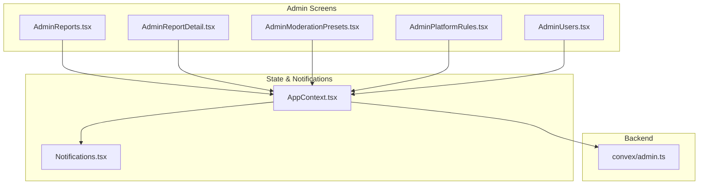
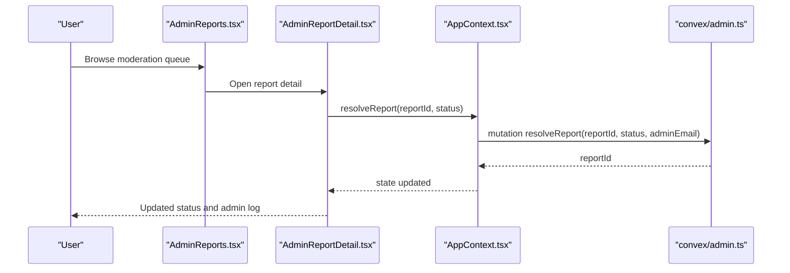
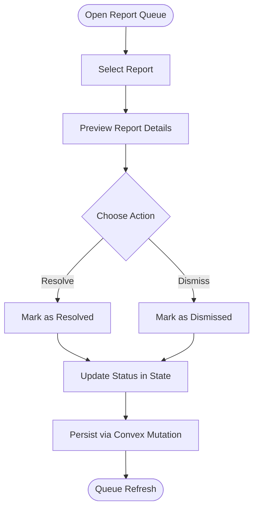
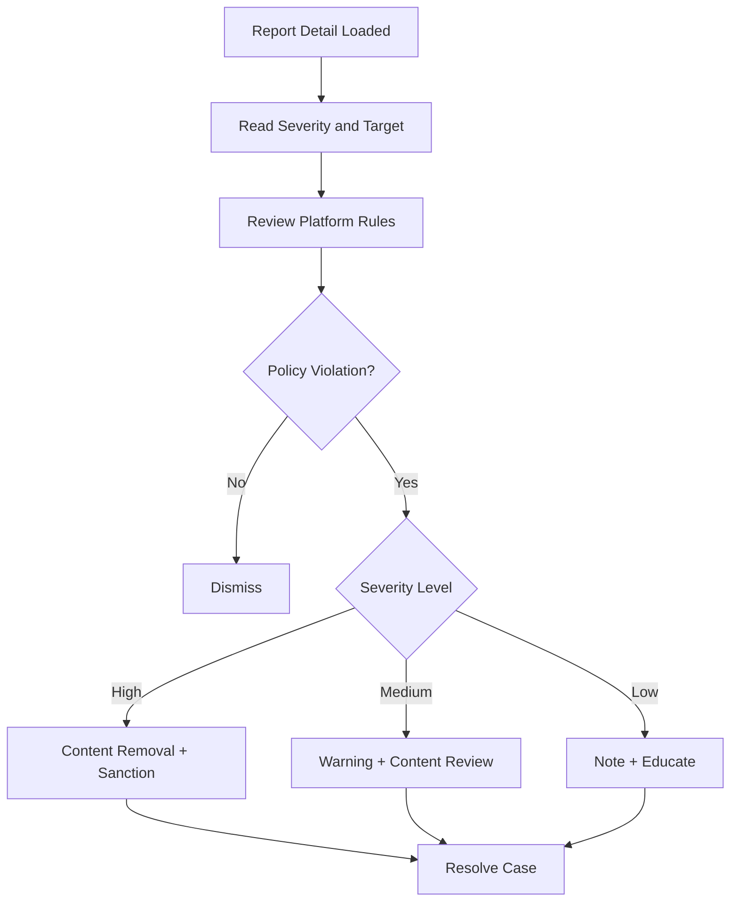
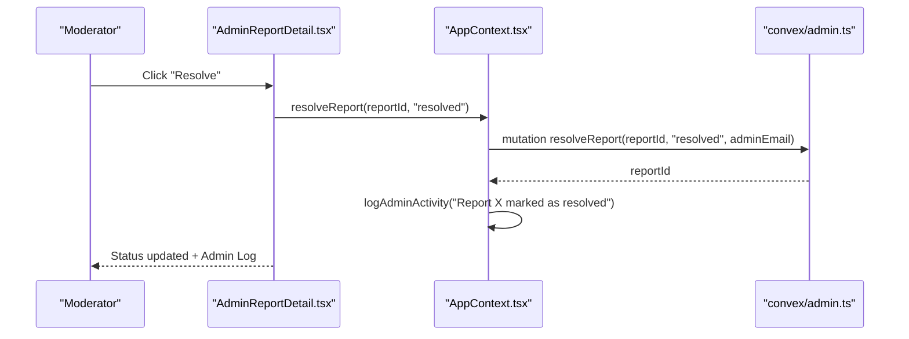
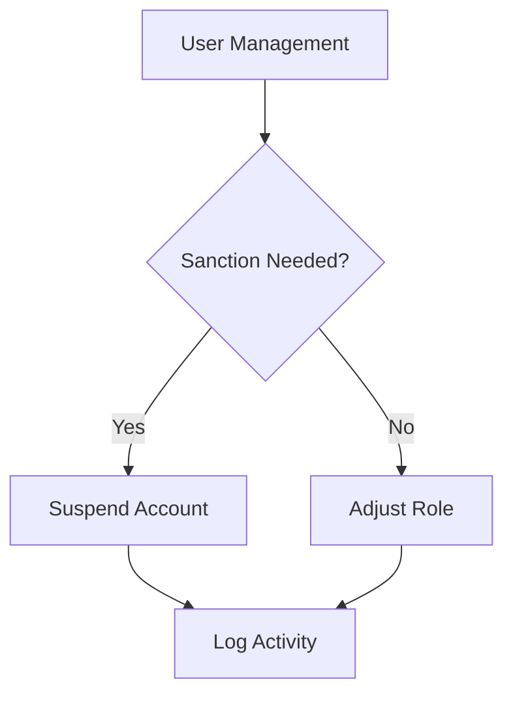
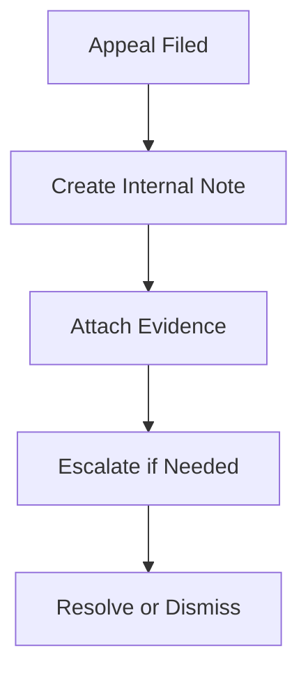
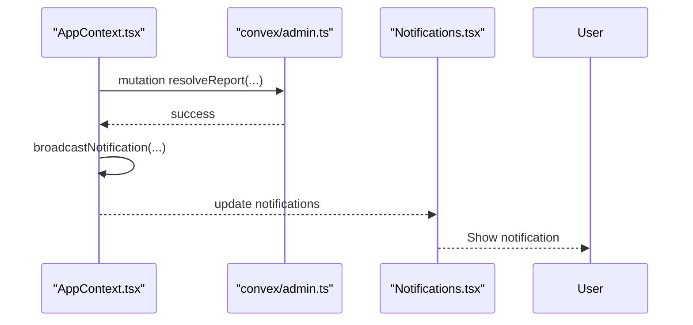
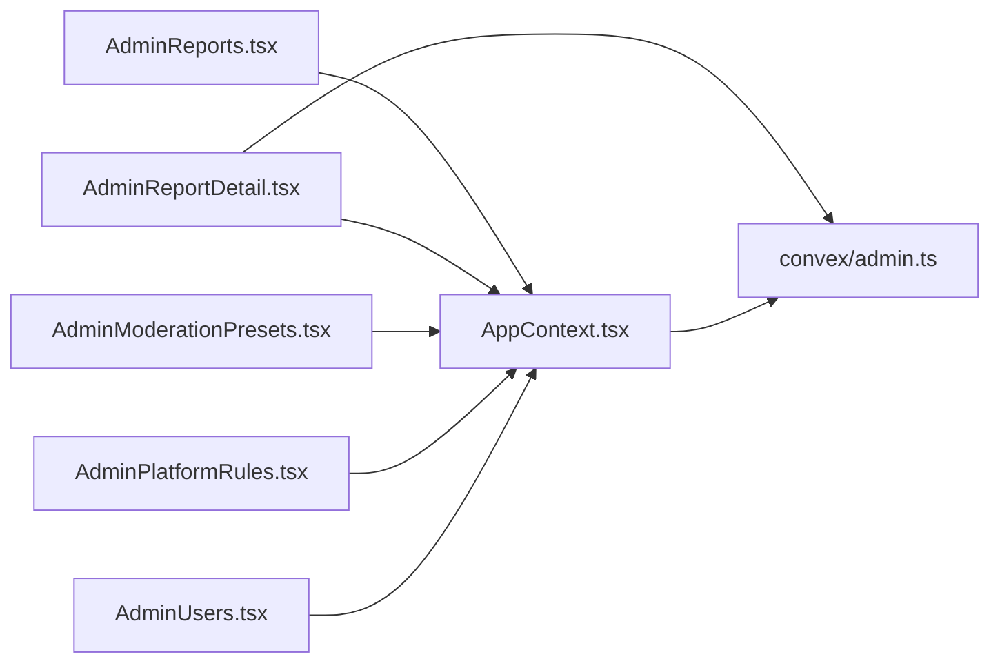

# Resolution Workflow

<cite>
**Referenced Files in This Document**
- [AdminReports.tsx](file://src/screens/admin/AdminReports.tsx)
- [AdminReportDetail.tsx](file://src/screens/admin/details/AdminReportDetail.tsx)
- [AppContext.tsx](file://src/contexts/AppContext.tsx)
- [admin.ts](file://convex/admin.ts)
- [AdminModerationPresets.tsx](file://src/screens/admin/AdminModerationPresets.tsx)
- [AdminPlatformRules.tsx](file://src/screens/admin/AdminPlatformRules.tsx)
- [AdminUsers.tsx](file://src/screens/admin/AdminUsers.tsx)
- [Notifications.tsx](file://src/screens/Notifications.tsx)
</cite>

## Table of Contents
1. [Introduction](#introduction)
2. [Project Structure](#project-structure)
3. [Core Components](#core-components)
4. [Architecture Overview](#architecture-overview)
5. [Detailed Component Analysis](#detailed-component-analysis)
6. [Dependency Analysis](#dependency-analysis)
7. [Performance Considerations](#performance-considerations)
8. [Troubleshooting Guide](#troubleshooting-guide)
9. [Conclusion](#conclusion)

## Introduction
This document describes the content moderation resolution workflow for the platform. It covers the end-to-end process from report submission and review to final actions, including warnings, content removal, user sanctions, and appeals. It also documents the decision matrix for penalties, resolution tracking, notifications, escalation pathways, and evidence gathering for contested decisions.

## Project Structure
The moderation workflow spans frontend screens and backend Convex functions:
- Frontend screens manage report queues, detail views, and administrative actions.
- AppContext coordinates state and admin actions.
- Convex admin module persists reports, resolves them, and logs admin activity.

**Diagram sources**
- [AdminReports.tsx:25-210](file://src/screens/admin/AdminReports.tsx#L25-L210)
- [AdminReportDetail.tsx:22-246](file://src/screens/admin/details/AdminReportDetail.tsx#L22-L246)
- [AppContext.tsx:1382-1452](file://src/contexts/AppContext.tsx#L1382-L1452)
- [admin.ts:179-223](file://convex/admin.ts#L179-L223)
- [AdminModerationPresets.tsx:66-200](file://src/screens/admin/AdminModerationPresets.tsx#L66-L200)
- [AdminPlatformRules.tsx:25-81](file://src/screens/admin/AdminPlatformRules.tsx#L25-L81)
- [AdminUsers.tsx:23-266](file://src/screens/admin/AdminUsers.tsx#L23-L266)
- [Notifications.tsx:6-22](file://src/screens/Notifications.tsx#L6-L22)

**Section sources**
- [AdminReports.tsx:25-210](file://src/screens/admin/AdminReports.tsx#L25-L210)
- [AdminReportDetail.tsx:22-246](file://src/screens/admin/details/AdminReportDetail.tsx#L22-L246)
- [AppContext.tsx:1382-1452](file://src/contexts/AppContext.tsx#L1382-L1452)
- [admin.ts:179-223](file://convex/admin.ts#L179-L223)
- [AdminModerationPresets.tsx:66-200](file://src/screens/admin/AdminModerationPresets.tsx#L66-L200)
- [AdminPlatformRules.tsx:25-81](file://src/screens/admin/AdminPlatformRules.tsx#L25-L81)
- [AdminUsers.tsx:23-266](file://src/screens/admin/AdminUsers.tsx#L23-L266)
- [Notifications.tsx:6-22](file://src/screens/Notifications.tsx#L6-L22)

## Core Components
- Report listing and queue: AdminReports displays open and reviewing reports and allows quick preview and resolution.
- Report detail and actions: AdminReportDetail shows report metadata, severity, target context, and moderation actions.
- Admin actions: AppContext exposes resolveReport and logAdminActivity; Convex admin module persists and updates reports.
- Moderation modes and rules: AdminModerationPresets and AdminPlatformRules define policy configuration.
- User management and sanctions: AdminUsers supports suspending users and changing roles.
- Notifications: Notifications screen surfaces moderation outcomes to users.

**Section sources**
- [AdminReports.tsx:25-210](file://src/screens/admin/AdminReports.tsx#L25-L210)
- [AdminReportDetail.tsx:22-246](file://src/screens/admin/details/AdminReportDetail.tsx#L22-L246)
- [AppContext.tsx:747-750](file://src/contexts/AppContext.tsx#L747-L750)
- [admin.ts:209-223](file://convex/admin.ts#L209-L223)
- [AdminModerationPresets.tsx:66-200](file://src/screens/admin/AdminModerationPresets.tsx#L66-L200)
- [AdminPlatformRules.tsx:25-81](file://src/screens/admin/AdminPlatformRules.tsx#L25-L81)
- [AdminUsers.tsx:23-266](file://src/screens/admin/AdminUsers.tsx#L23-L266)
- [Notifications.tsx:6-22](file://src/screens/Notifications.tsx#L6-L22)

## Architecture Overview
The resolution workflow integrates frontend UI, state management, and backend persistence.

**Diagram sources**
- [AdminReports.tsx:190-210](file://src/screens/admin/AdminReports.tsx#L190-L210)
- [AdminReportDetail.tsx:61-83](file://src/screens/admin/details/AdminReportDetail.tsx#L61-L83)
- [AppContext.tsx:747-750](file://src/contexts/AppContext.tsx#L747-L750)
- [admin.ts:209-223](file://convex/admin.ts#L209-L223)

## Detailed Component Analysis

### Report Queue and Resolution Actions
- The queue lists open and reviewing reports, with quick preview modal and bulk actions.
- From the queue, administrators can dismiss or resolve reports, updating status and logging activity.

**Diagram sources**
- [AdminReports.tsx:48-121](file://src/screens/admin/AdminReports.tsx#L48-L121)
- [AdminReports.tsx:190-210](file://src/screens/admin/AdminReports.tsx#L190-L210)
- [AppContext.tsx:747-750](file://src/contexts/AppContext.tsx#L747-L750)
- [admin.ts:209-223](file://convex/admin.ts#L209-L223)

**Section sources**
- [AdminReports.tsx:25-210](file://src/screens/admin/AdminReports.tsx#L25-L210)
- [AppContext.tsx:747-750](file://src/contexts/AppContext.tsx#L747-L750)
- [admin.ts:209-223](file://convex/admin.ts#L209-L223)

### Report Detail and Decision Matrix
- The detail page shows reason, message, severity, target type, and date.
- Moderation actions include removing content and warning users.
- Decision matrix considerations:
  - Severity: Medium (as shown in UI).
  - Target type: story/chapter/user/comment.
  - Platform rules: Explicit gore, AI content tagging, copyright, spam.
  - Moderation presets: Strict, Adaptive, Permissive thresholds.

**Diagram sources**
- [AdminReportDetail.tsx:127-144](file://src/screens/admin/details/AdminReportDetail.tsx#L127-L144)
- [AdminReportDetail.tsx:172-191](file://src/screens/admin/details/AdminReportDetail.tsx#L172-L191)
- [AdminPlatformRules.tsx:18-23](file://src/screens/admin/AdminPlatformRules.tsx#L18-L23)
- [AdminModerationPresets.tsx:18-64](file://src/screens/admin/AdminModerationPresets.tsx#L18-L64)

**Section sources**
- [AdminReportDetail.tsx:86-144](file://src/screens/admin/details/AdminReportDetail.tsx#L86-L144)
- [AdminReportDetail.tsx:172-191](file://src/screens/admin/details/AdminReportDetail.tsx#L172-L191)
- [AdminPlatformRules.tsx:18-23](file://src/screens/admin/AdminPlatformRules.tsx#L18-L23)
- [AdminModerationPresets.tsx:18-64](file://src/screens/admin/AdminModerationPresets.tsx#L18-L64)

### Resolution Tracking and Audit Trail
- Admin actions are logged with timestamps and admin identity.
- The detail page shows a timeline of admin actions (e.g., opened, status change).
- Convex mutations record resolvedAt and resolvedBy.

**Diagram sources**
- [AdminReportDetail.tsx:61-83](file://src/screens/admin/details/AdminReportDetail.tsx#L61-L83)
- [AppContext.tsx:747-750](file://src/contexts/AppContext.tsx#L747-L750)
- [admin.ts:209-223](file://convex/admin.ts#L209-L223)

**Section sources**
- [AdminReportDetail.tsx:212-241](file://src/screens/admin/details/AdminReportDetail.tsx#L212-L241)
- [AppContext.tsx:727-735](file://src/contexts/AppContext.tsx#L727-L735)
- [admin.ts:209-223](file://convex/admin.ts#L209-L223)

### User Sanctions and Escalation
- User management supports suspending accounts and role changes.
- Escalation can be modeled by promoting a report to higher severity or applying stricter moderation presets.

**Diagram sources**
- [AdminUsers.tsx:155-171](file://src/screens/admin/AdminUsers.tsx#L155-L171)
- [AdminUsers.tsx:177-196](file://src/screens/admin/AdminUsers.tsx#L177-L196)

**Section sources**
- [AdminUsers.tsx:23-266](file://src/screens/admin/AdminUsers.tsx#L23-L266)

### Appeals and Evidence Gathering
- The detail page includes an internal notes area for evidence and rationale.
- Appeals can be initiated by users and tracked in the admin log; evidence should be attached as internal notes.

**Diagram sources**
- [AdminReportDetail.tsx:234-241](file://src/screens/admin/details/AdminReportDetail.tsx#L234-L241)

**Section sources**
- [AdminReportDetail.tsx:234-241](file://src/screens/admin/details/AdminReportDetail.tsx#L234-L241)

### Notifications and Communication
- Moderation outcomes trigger user notifications.
- Notifications screen aggregates and allows marking as read.

**Diagram sources**
- [AppContext.tsx:803-852](file://src/contexts/AppContext.tsx#L803-L852)
- [admin.ts:209-223](file://convex/admin.ts#L209-L223)
- [Notifications.tsx:6-22](file://src/screens/Notifications.tsx#L6-L22)

**Section sources**
- [AppContext.tsx:803-852](file://src/contexts/AppContext.tsx#L803-L852)
- [Notifications.tsx:6-22](file://src/screens/Notifications.tsx#L6-L22)

## Dependency Analysis
- AdminReports depends on AppContext for reports and resolveReport.
- AdminReportDetail depends on AppContext for state updates and on Convex for persistence.
- AppContext delegates persistence to Convex admin module.
- Moderation presets and platform rules influence decision thresholds.

**Diagram sources**
- [AdminReports.tsx:25-210](file://src/screens/admin/AdminReports.tsx#L25-L210)
- [AdminReportDetail.tsx:22-246](file://src/screens/admin/details/AdminReportDetail.tsx#L22-L246)
- [AppContext.tsx:1382-1452](file://src/contexts/AppContext.tsx#L1382-L1452)
- [admin.ts:179-223](file://convex/admin.ts#L179-L223)
- [AdminModerationPresets.tsx:66-200](file://src/screens/admin/AdminModerationPresets.tsx#L66-L200)
- [AdminPlatformRules.tsx:25-81](file://src/screens/admin/AdminPlatformRules.tsx#L25-L81)
- [AdminUsers.tsx:23-266](file://src/screens/admin/AdminUsers.tsx#L23-L266)

**Section sources**
- [AdminReports.tsx:25-210](file://src/screens/admin/AdminReports.tsx#L25-L210)
- [AdminReportDetail.tsx:22-246](file://src/screens/admin/details/AdminReportDetail.tsx#L22-L246)
- [AppContext.tsx:1382-1452](file://src/contexts/AppContext.tsx#L1382-L1452)
- [admin.ts:179-223](file://convex/admin.ts#L179-L223)
- [AdminModerationPresets.tsx:66-200](file://src/screens/admin/AdminModerationPresets.tsx#L66-L200)
- [AdminPlatformRules.tsx:25-81](file://src/screens/admin/AdminPlatformRules.tsx#L25-L81)
- [AdminUsers.tsx:23-266](file://src/screens/admin/AdminUsers.tsx#L23-L266)

## Performance Considerations
- Batch operations: Use broadcastNotification for mass notifications to minimize round-trips.
- Debounce UI updates: Avoid frequent re-renders by updating state atomically after mutations.
- Lazy loading: Load reports and activity logs efficiently to keep the queue responsive.

## Troubleshooting Guide
- Reports not updating: Verify resolveReport is called and Convex mutation completes; check admin log entries.
- Notifications missing: Confirm broadcastNotification is invoked and user notifications are refreshed.
- Preset changes not taking effect: Ensure the preset application flow completes and audit logs confirm the change.

**Section sources**
- [AppContext.tsx:803-852](file://src/contexts/AppContext.tsx#L803-L852)
- [admin.ts:209-223](file://convex/admin.ts#L209-L223)

## Conclusion
The moderation resolution workflow combines a clear UI for reviewing reports, robust state management for actions, and persistent storage for auditability. Administrators can quickly assess violations, apply appropriate penalties, and communicate outcomes via notifications. The system supports escalation, evidence capture, and policy-driven moderation through presets and platform rules.