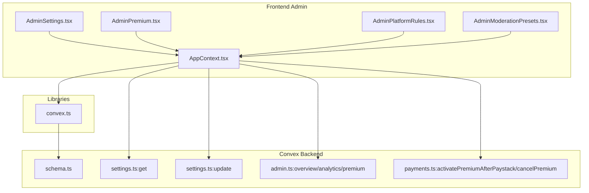
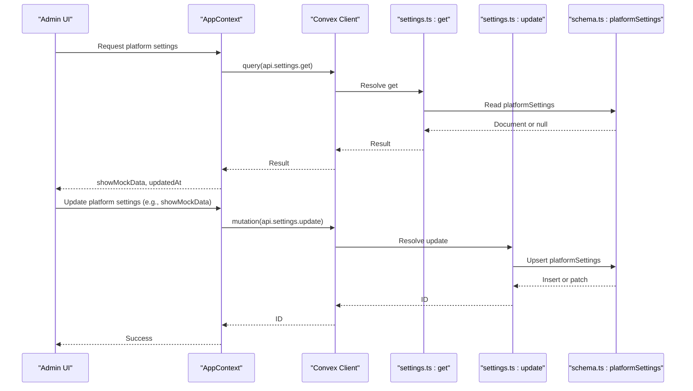
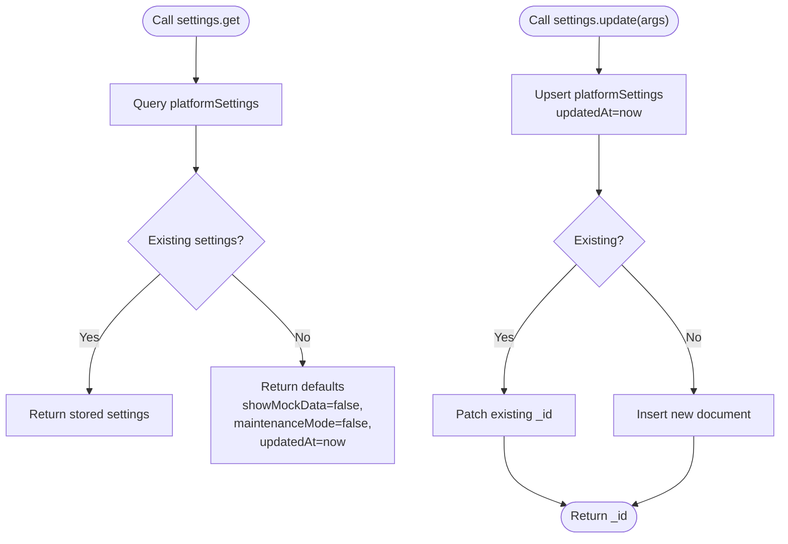
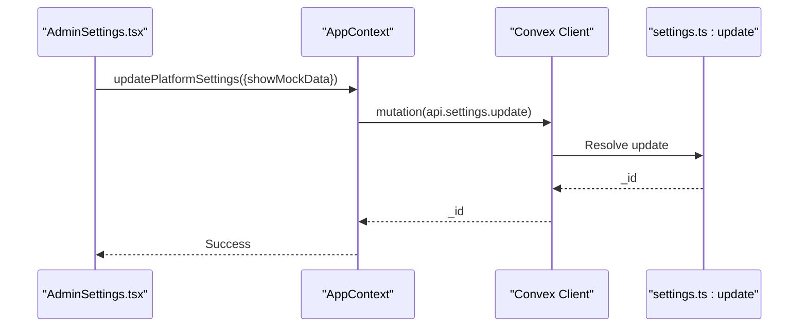
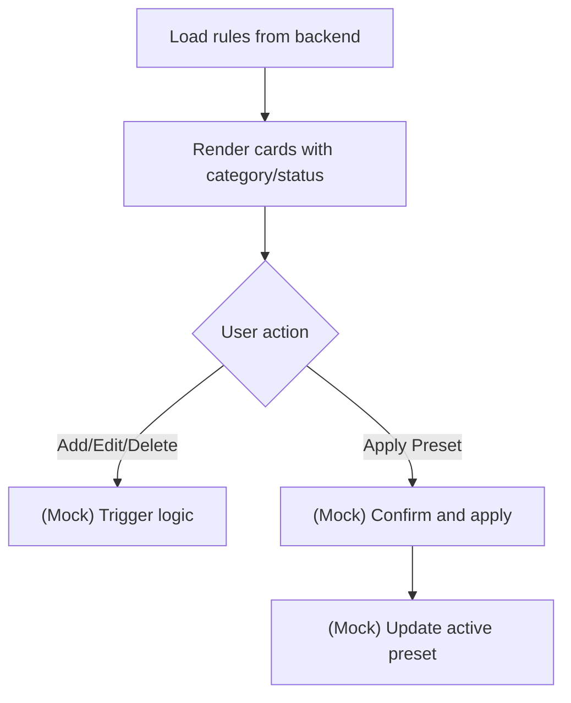
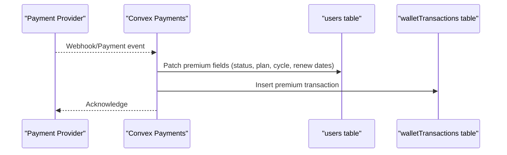
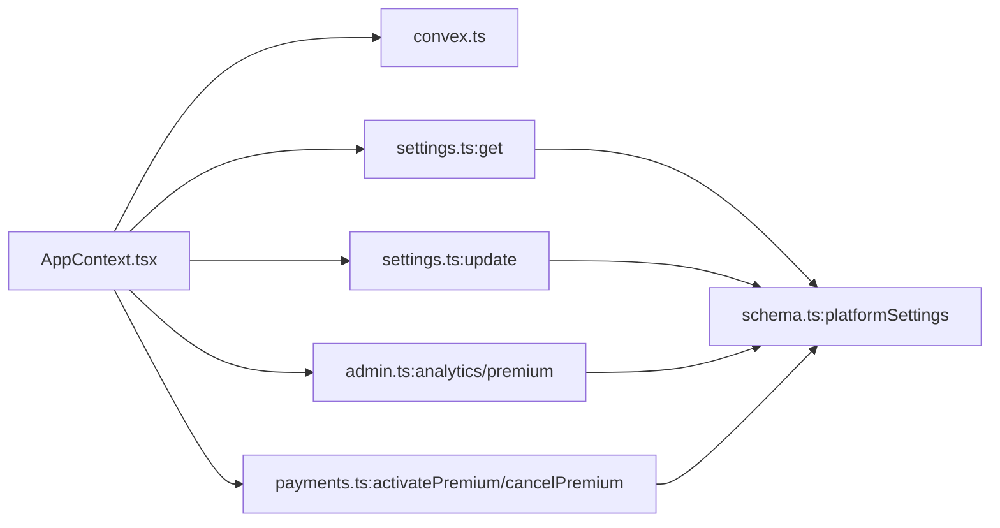

# Platform Configuration

<cite>
**Referenced Files in This Document**
- [settings.ts](file://convex/settings.ts)
- [schema.ts](file://convex/schema.ts)
- [admin.ts](file://convex/admin.ts)
- [payments.ts](file://convex/payments.ts)
- [AppContext.tsx](file://src/contexts/AppContext.tsx)
- [AdminSettings.tsx](file://src/screens/admin/AdminSettings.tsx)
- [AdminPremium.tsx](file://src/screens/admin/AdminPremium.tsx)
- [AdminPlatformRules.tsx](file://src/screens/admin/AdminPlatformRules.tsx)
- [AdminModerationPresets.tsx](file://src/screens/admin/AdminModerationPresets.tsx)
- [convex.ts](file://src/lib/convex.ts)
- [AdminStoryDetail.tsx](file://src/screens/admin/details/AdminStoryDetail.tsx)
</cite>

## Table of Contents
1. [Introduction](#introduction)
2. [Project Structure](#project-structure)
3. [Core Components](#core-components)
4. [Architecture Overview](#architecture-overview)
5. [Detailed Component Analysis](#detailed-component-analysis)
6. [Dependency Analysis](#dependency-analysis)
7. [Performance Considerations](#performance-considerations)
8. [Troubleshooting Guide](#troubleshooting-guide)
9. [Conclusion](#conclusion)

## Introduction
This document describes the platform configuration system for Lemonade, focusing on how administrators manage platform-wide settings, monetization rules, content policies, premium configuration, and moderation presets. It explains the backend Convex schema and queries/mutations that power configuration, the frontend admin interfaces that expose these controls, and the integration points that enable comprehensive platform control and customization.

## Project Structure
The configuration system spans:
- Backend Convex schema and functions for platform settings, admin analytics, premium stats, and payments
- Frontend admin screens for settings, premium analytics, platform rules, and moderation presets
- Application context that loads and applies platform settings (such as mock data visibility) and integrates with Convex

**Diagram sources**
- [AdminSettings.tsx:1-189](file://src/screens/admin/AdminSettings.tsx#L1-L189)
- [AdminPremium.tsx:1-187](file://src/screens/admin/AdminPremium.tsx#L1-L187)
- [AdminPlatformRules.tsx:1-189](file://src/screens/admin/AdminPlatformRules.tsx#L1-L189)
- [AdminModerationPresets.tsx:1-200](file://src/screens/admin/AdminModerationPresets.tsx#L1-L200)
- [AppContext.tsx:509-800](file://src/contexts/AppContext.tsx#L509-L800)
- [settings.ts:1-45](file://convex/settings.ts#L1-L45)
- [admin.ts:31-177](file://convex/admin.ts#L31-L177)
- [payments.ts:174-290](file://convex/payments.ts#L174-L290)
- [schema.ts:271-276](file://convex/schema.ts#L271-L276)
- [convex.ts:1-12](file://src/lib/convex.ts#L1-L12)

**Section sources**
- [AdminSettings.tsx:1-189](file://src/screens/admin/AdminSettings.tsx#L1-L189)
- [AdminPremium.tsx:1-187](file://src/screens/admin/AdminPremium.tsx#L1-L187)
- [AdminPlatformRules.tsx:1-189](file://src/screens/admin/AdminPlatformRules.tsx#L1-L189)
- [AdminModerationPresets.tsx:1-200](file://src/screens/admin/AdminModerationPresets.tsx#L1-L200)
- [AppContext.tsx:509-800](file://src/contexts/AppContext.tsx#L509-L800)
- [settings.ts:1-45](file://convex/settings.ts#L1-L45)
- [admin.ts:31-177](file://convex/admin.ts#L31-L177)
- [payments.ts:174-290](file://convex/payments.ts#L174-L290)
- [schema.ts:271-276](file://convex/schema.ts#L271-L276)
- [convex.ts:1-12](file://src/lib/convex.ts#L1-L12)

## Core Components
- Platform settings query and mutation: Provides centralized platform-wide toggles and metadata (e.g., mock data visibility, maintenance mode, last updated timestamp).
- Admin analytics and premium stats: Supplies aggregated metrics for platform health and premium ecosystem.
- Premium activation and cancellation: Manages subscription lifecycle and billing cycles.
- Admin UI screens: Expose configuration surfaces for platform rules, moderation presets, and premium analytics.

Key responsibilities:
- settings.ts: Centralized get/update for platformSettings
- schema.ts: Defines platformSettings table and related domain entities
- admin.ts: Analytics, premium stats, and admin activity logging
- payments.ts: Premium activation and cancellation mutations
- AppContext.tsx: Loads platform settings and exposes updatePlatformSettings to admin UI
- AdminSettings.tsx: Toggles global flags and moderation modes
- AdminPlatformRules.tsx: Manages platform rules and presets
- AdminPremium.tsx: Displays premium subscribers and revenue forecasts

**Section sources**
- [settings.ts:1-45](file://convex/settings.ts#L1-L45)
- [schema.ts:271-276](file://convex/schema.ts#L271-L276)
- [admin.ts:31-177](file://convex/admin.ts#L31-L177)
- [payments.ts:174-290](file://convex/payments.ts#L174-L290)
- [AppContext.tsx:509-800](file://src/contexts/AppContext.tsx#L509-L800)
- [AdminSettings.tsx:1-189](file://src/screens/admin/AdminSettings.tsx#L1-L189)
- [AdminPlatformRules.tsx:1-189](file://src/screens/admin/AdminPlatformRules.tsx#L1-L189)
- [AdminPremium.tsx:1-187](file://src/screens/admin/AdminPremium.tsx#L1-L187)

## Architecture Overview
The configuration architecture consists of:
- Convex schema defining platformSettings and related entities
- Queries and mutations for settings, admin analytics, and premium lifecycle
- Frontend admin screens that render configuration UI and call backend functions via Convex
- AppContext orchestrating initial load of platform settings and exposing update functions

**Diagram sources**
- [settings.ts:1-45](file://convex/settings.ts#L1-L45)
- [schema.ts:271-276](file://convex/schema.ts#L271-L276)
- [AppContext.tsx:509-800](file://src/contexts/AppContext.tsx#L509-L800)

## Detailed Component Analysis

### Platform Settings Management
- Purpose: Provide a single source of truth for platform-wide configuration flags and metadata.
- Schema: platformSettings table stores showMockData, maintenanceMode, optional announcement, and updatedAt.
- Functions:
  - get: Returns existing settings or defaults if none exist.
  - update: Patches existing document or inserts a new one with updatedAt timestamp.

**Diagram sources**
- [settings.ts:1-45](file://convex/settings.ts#L1-L45)
- [schema.ts:271-276](file://convex/schema.ts#L271-L276)

**Section sources**
- [settings.ts:1-45](file://convex/settings.ts#L1-L45)
- [schema.ts:271-276](file://convex/schema.ts#L271-L276)

### Admin Settings Interface
- Purpose: Allow administrators to configure moderation modes, global flags, and infrastructure details.
- Features:
  - Moderation modes: Strict, Adaptive, Permissive presets
  - Global flags: Toggle mock data visibility and other moderation rules
  - API & infrastructure: Display endpoint and mirror status
- Integration: Calls AppContext.updatePlatformSettings which maps to settings.update mutation.

**Diagram sources**
- [AdminSettings.tsx:1-189](file://src/screens/admin/AdminSettings.tsx#L1-L189)
- [AppContext.tsx:509-800](file://src/contexts/AppContext.tsx#L509-L800)
- [settings.ts:19-44](file://convex/settings.ts#L19-L44)

**Section sources**
- [AdminSettings.tsx:1-189](file://src/screens/admin/AdminSettings.tsx#L1-L189)
- [AppContext.tsx:509-800](file://src/contexts/AppContext.tsx#L509-L800)

### Platform Rules System
- Purpose: Define and manage community guidelines, content standards, and enforcement mechanisms.
- UI: AdminPlatformRules.tsx presents rules with categories, statuses, and actions (add/edit/delete).
- Presets: AdminModerationPresets.tsx defines three moderation presets (Strict, Adaptive, Permissive) with rule sets and instant application.

**Diagram sources**
- [AdminPlatformRules.tsx:1-189](file://src/screens/admin/AdminPlatformRules.tsx#L1-L189)
- [AdminModerationPresets.tsx:1-200](file://src/screens/admin/AdminModerationPresets.tsx#L1-L200)

**Section sources**
- [AdminPlatformRules.tsx:1-189](file://src/screens/admin/AdminPlatformRules.tsx#L1-L189)
- [AdminModerationPresets.tsx:1-200](file://src/screens/admin/AdminModerationPresets.tsx#L1-L200)

### Premium Configuration and Monetization
- Premium lifecycle:
  - Activation: activatePremiumAfterPaystack mutation updates user premium fields and records a premium transaction.
  - Cancellation: cancelPremium mutation toggles cancellation-at-period-end semantics.
- Premium analytics:
  - admin.ts premium query aggregates active/trial subscribers, conversion/churn rates, and revenue streams.
- UI: AdminPremium.tsx displays subscriber lists, search, and revenue forecasts.

**Diagram sources**
- [payments.ts:174-290](file://convex/payments.ts#L174-L290)
- [admin.ts:130-177](file://convex/admin.ts#L130-L177)
- [AdminPremium.tsx:1-187](file://src/screens/admin/AdminPremium.tsx#L1-L187)

**Section sources**
- [payments.ts:174-290](file://convex/payments.ts#L174-L290)
- [admin.ts:130-177](file://convex/admin.ts#L130-L177)
- [AdminPremium.tsx:1-187](file://src/screens/admin/AdminPremium.tsx#L1-L187)

### Monetization Controls for Stories
- AdminStoryDetail.tsx demonstrates per-story monetization settings including premium lock, ad revenue share, and exclusive content flags.
- These settings integrate with the broader monetization system (ads, premium) to control revenue distribution and access gating.

**Section sources**
- [AdminStoryDetail.tsx:263-285](file://src/screens/admin/details/AdminStoryDetail.tsx#L263-L285)

### Feature Flags and Experimental Configurations
- The platform does not expose a dedicated feature flag table or UI in the analyzed files.
- Moderation presets serve as a global configuration mechanism that can be leveraged to control behavior across the platform with minimal latency and auditability.

**Section sources**
- [AdminModerationPresets.tsx:1-200](file://src/screens/admin/AdminModerationPresets.tsx#L1-L200)

## Dependency Analysis
- AppContext depends on Convex client initialization and loads platform settings during startup.
- Admin screens depend on AppContext for state and on Convex for backend operations.
- Backend functions depend on schema-defined tables and indices.

**Diagram sources**
- [AppContext.tsx:509-800](file://src/contexts/AppContext.tsx#L509-L800)
- [convex.ts:1-12](file://src/lib/convex.ts#L1-L12)
- [settings.ts:1-45](file://convex/settings.ts#L1-L45)
- [admin.ts:31-177](file://convex/admin.ts#L31-L177)
- [payments.ts:174-290](file://convex/payments.ts#L174-L290)
- [schema.ts:271-276](file://convex/schema.ts#L271-L276)

**Section sources**
- [AppContext.tsx:509-800](file://src/contexts/AppContext.tsx#L509-L800)
- [convex.ts:1-12](file://src/lib/convex.ts#L1-L12)
- [settings.ts:1-45](file://convex/settings.ts#L1-L45)
- [admin.ts:31-177](file://convex/admin.ts#L31-L177)
- [payments.ts:174-290](file://convex/payments.ts#L174-L290)
- [schema.ts:271-276](file://convex/schema.ts#L271-L276)

## Performance Considerations
- Live content refresh: AppContext periodically reloads platform settings and content to keep the UI synchronized.
- Batched queries: Admin analytics and content loading use Promise.all to minimize round-trips.
- Index usage: Schema defines indices on platformSettings and related tables to optimize lookups.

**Section sources**
- [AppContext.tsx:509-800](file://src/contexts/AppContext.tsx#L509-L800)
- [schema.ts:271-276](file://convex/schema.ts#L271-L276)

## Troubleshooting Guide
- Convex URL missing: If VITE_CONVEX_URL is not set, Convex client is disabled and configuration features relying on backend will not function.
- Platform settings not updating: Verify settings.get returns current values and settings.update resolves without errors.
- Premium activation failures: Check payment webhook delivery and activatePremiumAfterPaystack arguments and user lookup logic.
- Admin analytics empty: Confirm admin.ts queries are reachable and database contains expected documents.

**Section sources**
- [convex.ts:1-12](file://src/lib/convex.ts#L1-L12)
- [settings.ts:1-45](file://convex/settings.ts#L1-L45)
- [payments.ts:174-290](file://convex/payments.ts#L174-L290)
- [admin.ts:31-177](file://convex/admin.ts#L31-L177)

## Conclusion
Lemonade’s platform configuration system centers on a small set of backend Convex functions and a schema-defined platformSettings table, complemented by admin UI screens that enable global control over moderation, monetization, and premium offerings. While explicit feature flags are not present, moderation presets provide a powerful mechanism for rapid, global behavioral changes with auditability and low propagation latency.