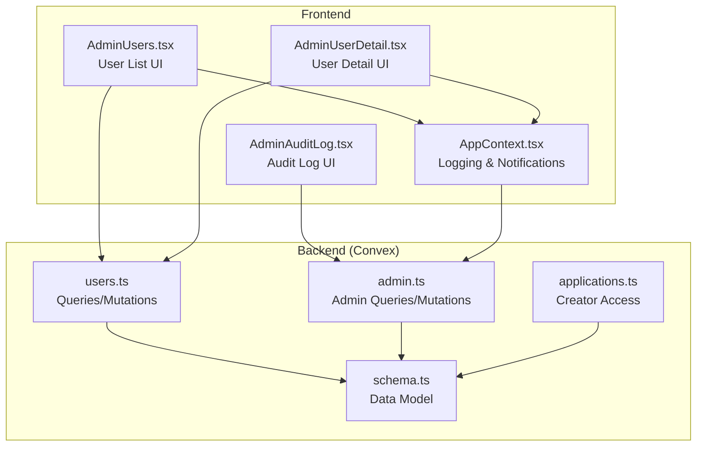
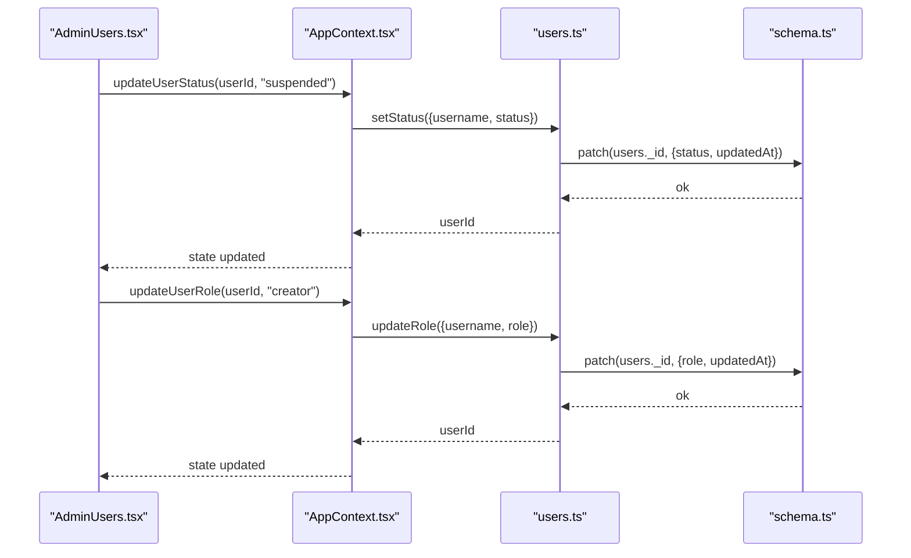
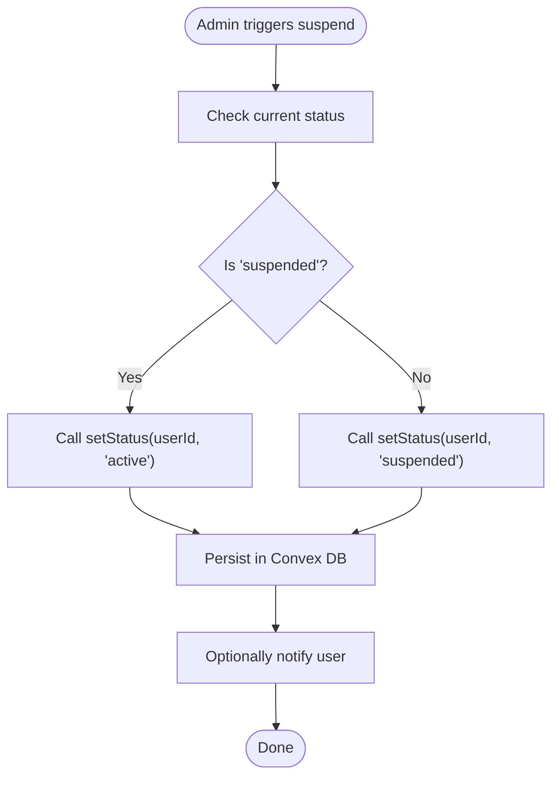
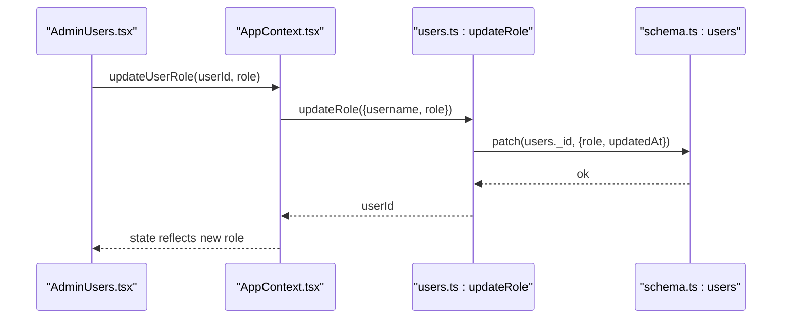
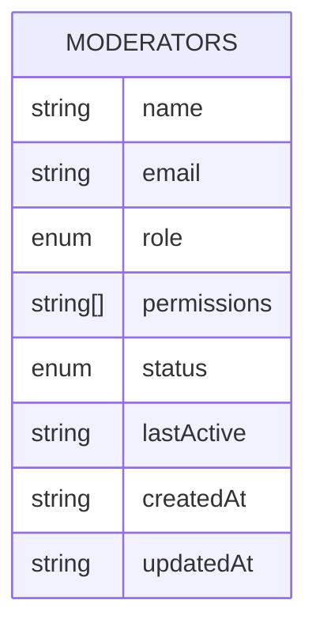
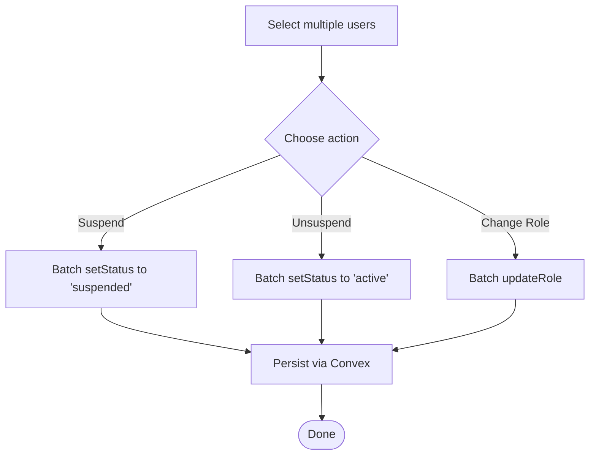
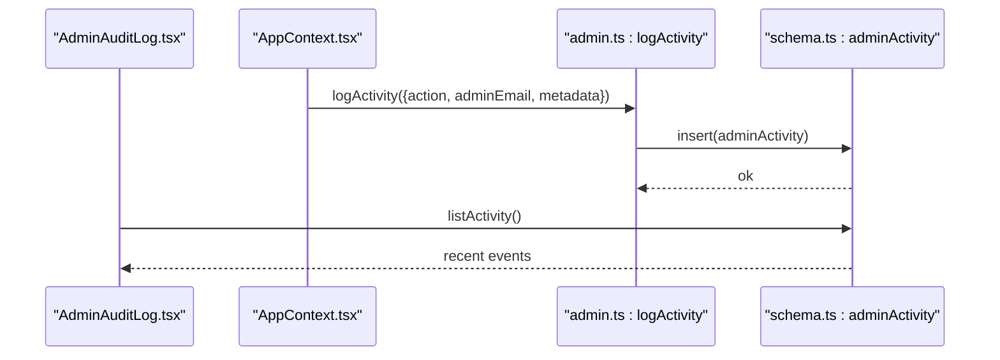
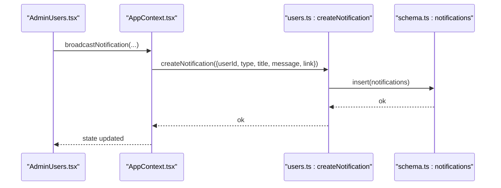
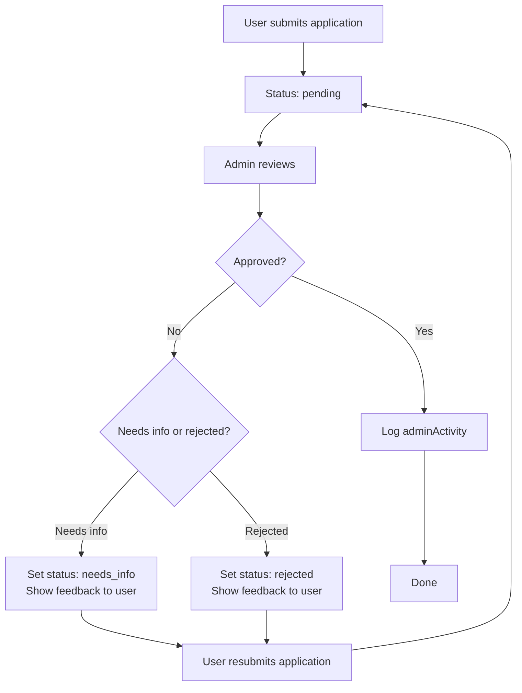
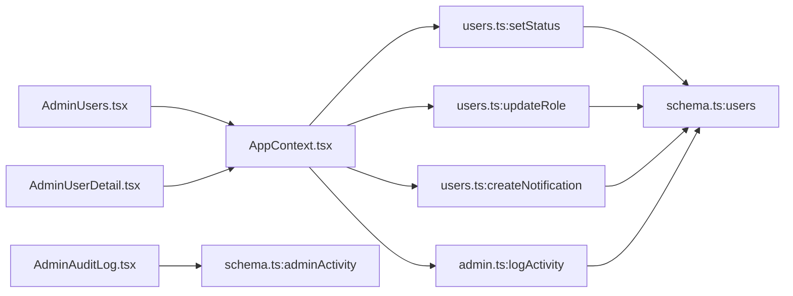

# Account Actions and Controls

<cite>
**Referenced Files in This Document**
- [admin.ts](file://convex/admin.ts)
- [users.ts](file://convex/users.ts)
- [schema.ts](file://convex/schema.ts)
- [AdminUsers.tsx](file://src/screens/admin/AdminUsers.tsx)
- [AdminUserDetail.tsx](file://src/screens/admin/details/AdminUserDetail.tsx)
- [AdminAuditLog.tsx](file://src/screens/admin/AdminAuditLog.tsx)
- [AppContext.tsx](file://src/contexts/AppContext.tsx)
- [AdminApplicationDetail.tsx](file://src/screens/admin/details/AdminApplicationDetail.tsx)
- [applications.ts](file://convex/applications.ts)
</cite>

## Table of Contents
1. [Introduction](#introduction)
2. [Project Structure](#project-structure)
3. [Core Components](#core-components)
4. [Architecture Overview](#architecture-overview)
5. [Detailed Component Analysis](#detailed-component-analysis)
6. [Dependency Analysis](#dependency-analysis)
7. [Performance Considerations](#performance-considerations)
8. [Troubleshooting Guide](#troubleshooting-guide)
9. [Conclusion](#conclusion)

## Introduction
This document describes the account action and control systems in the platform, focusing on:
- Suspension and banning with explicit “active” and “suspended” states
- Role modification among guest, reader, creator, and admin
- Privilege adjustments via moderation and access control records
- Bulk action capabilities for managing multiple users
- Audit logging for administrative actions
- User notifications for status changes
- Emergency suspension procedures, appeals processes, and restoration workflows

## Project Structure
The account control system spans backend Convex functions, frontend admin screens, and shared application context for logging and notifications.

**Diagram sources**
- [users.ts:113-127](file://convex/users.ts#L113-L127)
- [admin.ts:225-244](file://convex/admin.ts#L225-L244)
- [schema.ts:24-67](file://convex/schema.ts#L24-L67)
- [AdminUsers.tsx:24-42](file://src/screens/admin/AdminUsers.tsx#L24-L42)
- [AdminUserDetail.tsx:24-46](file://src/screens/admin/details/AdminUserDetail.tsx#L24-L46)
- [AdminAuditLog.tsx:26-45](file://src/screens/admin/AdminAuditLog.tsx#L26-L45)
- [AppContext.tsx:739-745](file://src/contexts/AppContext.tsx#L739-L745)
- [applications.ts:84-118](file://convex/applications.ts#L84-L118)

**Section sources**
- [users.ts:113-127](file://convex/users.ts#L113-L127)
- [admin.ts:225-244](file://convex/admin.ts#L225-L244)
- [schema.ts:24-67](file://convex/schema.ts#L24-L67)
- [AdminUsers.tsx:24-42](file://src/screens/admin/AdminUsers.tsx#L24-L42)
- [AdminUserDetail.tsx:24-46](file://src/screens/admin/details/AdminUserDetail.tsx#L24-L46)
- [AdminAuditLog.tsx:26-45](file://src/screens/admin/AdminAuditLog.tsx#L26-L45)
- [AppContext.tsx:739-745](file://src/contexts/AppContext.tsx#L739-L745)
- [applications.ts:84-118](file://convex/applications.ts#L84-L118)

## Core Components
- User status control: setStatus mutation toggles “active” and “suspended”
- Role control: updateRole mutation switches roles among guest, reader, creator, admin
- Audit logging: logActivity mutation persists admin actions
- Notifications: createNotification mutation and broadcastNotification for mass alerts
- Creator access: applications.ts manages creator application lifecycle and status
- Frontend admin panels: AdminUsers and AdminUserDetail provide controls and visibility

**Section sources**
- [users.ts:113-127](file://convex/users.ts#L113-L127)
- [users.ts:92-111](file://convex/users.ts#L92-L111)
- [admin.ts:232-244](file://convex/admin.ts#L232-L244)
- [users.ts:245-268](file://convex/users.ts#L245-L268)
- [AppContext.tsx:803-852](file://src/contexts/AppContext.tsx#L803-L852)
- [applications.ts:84-118](file://convex/applications.ts#L84-L118)
- [AdminUsers.tsx:145-196](file://src/screens/admin/AdminUsers.tsx#L145-L196)
- [AdminUserDetail.tsx:61-76](file://src/screens/admin/details/AdminUserDetail.tsx#L61-L76)

## Architecture Overview
Administrative actions flow from the UI to Convex mutations, which update the data model and optionally emit notifications or audit logs.

**Diagram sources**
- [AdminUsers.tsx:145-196](file://src/screens/admin/AdminUsers.tsx#L145-L196)
- [AppContext.tsx:739-745](file://src/contexts/AppContext.tsx#L739-L745)
- [users.ts:113-127](file://convex/users.ts#L113-L127)
- [users.ts:92-111](file://convex/users.ts#L92-L111)
- [schema.ts:24-67](file://convex/schema.ts#L24-L67)

## Detailed Component Analysis

### Suspension and Banning Controls
- State model: users table defines status as “active” or “suspended”
- Mutation: setStatus updates user status and timestamps
- UI: AdminUsers and AdminUserDetail expose suspend/unsuspend actions
- No built-in duration or severity tiers are present in the current codebase

**Diagram sources**
- [users.ts:113-127](file://convex/users.ts#L113-L127)
- [AdminUsers.tsx:155-171](file://src/screens/admin/AdminUsers.tsx#L155-L171)
- [AdminUserDetail.tsx:61-76](file://src/screens/admin/details/AdminUserDetail.tsx#L61-L76)

**Section sources**
- [schema.ts:60-61](file://convex/schema.ts#L60-L61)
- [users.ts:113-127](file://convex/users.ts#L113-L127)
- [AdminUsers.tsx:155-171](file://src/screens/admin/AdminUsers.tsx#L155-L171)
- [AdminUserDetail.tsx:61-76](file://src/screens/admin/details/AdminUserDetail.tsx#L61-L76)

### Role Modification System
- Roles supported: guest, reader, creator, admin
- Mutation: updateRole changes user role atomically
- UI: AdminUsers menu allows quick toggle between reader and creator for demo purposes

**Diagram sources**
- [users.ts:92-111](file://convex/users.ts#L92-L111)
- [AdminUsers.tsx:177-187](file://src/screens/admin/AdminUsers.tsx#L177-L187)
- [schema.ts:4-9](file://convex/schema.ts#L4-L9)

**Section sources**
- [users.ts:92-111](file://convex/users.ts#L92-L111)
- [AdminUsers.tsx:177-187](file://src/screens/admin/AdminUsers.tsx#L177-L187)
- [schema.ts:4-9](file://convex/schema.ts#L4-L9)

### Privilege Adjustment Mechanisms
- Moderators table includes role, permissions array, and status
- Admin queries/mutations exist for listing and managing moderators
- Privileges are represented by permission strings stored per moderator

**Diagram sources**
- [schema.ts:183-196](file://convex/schema.ts#L183-L196)
- [admin.ts:246-251](file://convex/admin.ts#L246-L251)

**Section sources**
- [schema.ts:183-196](file://convex/schema.ts#L183-L196)
- [admin.ts:246-251](file://convex/admin.ts#L246-L251)

### Bulk Action Capabilities
- AdminUsers provides filtering and selection across lists
- Current UI demonstrates per-user suspend/unsuspend and role toggle
- No dedicated bulk mutation exists in the referenced files; bulk operations would require adding batched Convex mutations

**Diagram sources**
- [AdminUsers.tsx:29-42](file://src/screens/admin/AdminUsers.tsx#L29-L42)
- [users.ts:113-127](file://convex/users.ts#L113-L127)
- [users.ts:92-111](file://convex/users.ts#L92-L111)

**Section sources**
- [AdminUsers.tsx:29-42](file://src/screens/admin/AdminUsers.tsx#L29-L42)
- [users.ts:113-127](file://convex/users.ts#L113-L127)
- [users.ts:92-111](file://convex/users.ts#L92-L111)

### Audit Logging System
- Admin activity log table stores action, admin email, timestamp, and optional metadata
- logActivity mutation inserts records for auditable events
- AdminAuditLog UI displays and filters audit entries

**Diagram sources**
- [admin.ts:232-244](file://convex/admin.ts#L232-L244)
- [admin.ts:225-230](file://convex/admin.ts#L225-L230)
- [AdminAuditLog.tsx:26-45](file://src/screens/admin/AdminAuditLog.tsx#L26-L45)
- [schema.ts:176-181](file://convex/schema.ts#L176-L181)

**Section sources**
- [admin.ts:232-244](file://convex/admin.ts#L232-L244)
- [admin.ts:225-230](file://convex/admin.ts#L225-L230)
- [AdminAuditLog.tsx:26-45](file://src/screens/admin/AdminAuditLog.tsx#L26-L45)
- [schema.ts:176-181](file://convex/schema.ts#L176-L181)

### Notification Systems for Status Changes
- createNotification persists a single user notification
- broadcastNotification sends a notification to all non-guest users
- AppContext integrates with Convex to persist and distribute notifications

**Diagram sources**
- [users.ts:245-268](file://convex/users.ts#L245-L268)
- [AppContext.tsx:803-852](file://src/contexts/AppContext.tsx#L803-L852)
- [schema.ts:234-250](file://convex/schema.ts#L234-L250)

**Section sources**
- [users.ts:245-268](file://convex/users.ts#L245-L268)
- [AppContext.tsx:803-852](file://src/contexts/AppContext.tsx#L803-L852)
- [schema.ts:234-250](file://convex/schema.ts#L234-L250)

### Creator Access and Appeals Workflow
- Applications are tracked in creatorApplications with status: none, pending, needs_info, approved, rejected
- Admins can review applications and add feedback; decisions are logged in adminActivity
- Appeals can be resubmitted by users when status is needs_info or rejected

**Diagram sources**
- [applications.ts:84-118](file://convex/applications.ts#L84-L118)
- [applications.ts:120-223](file://convex/applications.ts#L120-L223)
- [admin.ts:210-219](file://convex/admin.ts#L210-L219)

**Section sources**
- [applications.ts:84-118](file://convex/applications.ts#L84-L118)
- [applications.ts:120-223](file://convex/applications.ts#L120-L223)
- [admin.ts:210-219](file://convex/admin.ts#L210-L219)

## Dependency Analysis
- UI depends on AppContext for centralized state and logging
- AppContext invokes Convex mutations for persistence
- Convex mutations write to schema-defined tables
- AdminAuditLog reads from adminActivity

**Diagram sources**
- [AdminUsers.tsx:24-42](file://src/screens/admin/AdminUsers.tsx#L24-L42)
- [AdminUserDetail.tsx:24-46](file://src/screens/admin/details/AdminUserDetail.tsx#L24-L46)
- [AppContext.tsx:739-745](file://src/contexts/AppContext.tsx#L739-L745)
- [users.ts:113-127](file://convex/users.ts#L113-L127)
- [users.ts:92-111](file://convex/users.ts#L92-L111)
- [users.ts:245-268](file://convex/users.ts#L245-L268)
- [admin.ts:232-244](file://convex/admin.ts#L232-L244)
- [schema.ts:24-67](file://convex/schema.ts#L24-L67)
- [schema.ts:176-181](file://convex/schema.ts#L176-L181)
- [AdminAuditLog.tsx:26-45](file://src/screens/admin/AdminAuditLog.tsx#L26-L45)

**Section sources**
- [AdminUsers.tsx:24-42](file://src/screens/admin/AdminUsers.tsx#L24-L42)
- [AdminUserDetail.tsx:24-46](file://src/screens/admin/details/AdminUserDetail.tsx#L24-L46)
- [AppContext.tsx:739-745](file://src/contexts/AppContext.tsx#L739-L745)
- [users.ts:113-127](file://convex/users.ts#L113-L127)
- [users.ts:92-111](file://convex/users.ts#L92-L111)
- [users.ts:245-268](file://convex/users.ts#L245-L268)
- [admin.ts:232-244](file://convex/admin.ts#L232-L244)
- [schema.ts:24-67](file://convex/schema.ts#L24-L67)
- [schema.ts:176-181](file://convex/schema.ts#L176-L181)
- [AdminAuditLog.tsx:26-45](file://src/screens/admin/AdminAuditLog.tsx#L26-L45)

## Performance Considerations
- Batch operations: Prefer server-side batching for bulk user updates to reduce network overhead
- Index usage: Ensure queries leverage defined indexes (e.g., by_username, by_firebaseUid) to minimize scans
- Notification volume: Broadcast notifications should be rate-limited and scoped to avoid flooding users
- Audit log growth: Consider retention policies and partitioning for adminActivity

## Troubleshooting Guide
- Suspend/unsuspend not reflected:
  - Verify setStatus mutation resolves and database patch succeeds
  - Confirm UI re-fetches or updates state via AppContext
- Role change has no effect:
  - Ensure updateRole mutation executes and schema enforces role enum
- Notifications missing:
  - Check createNotification and broadcastNotification paths
  - Validate user role != guest for targeted notifications
- Audit log empty:
  - Confirm logActivity mutation is invoked and listActivity fetches latest entries

**Section sources**
- [users.ts:113-127](file://convex/users.ts#L113-L127)
- [users.ts:92-111](file://convex/users.ts#L92-L111)
- [users.ts:245-268](file://convex/users.ts#L245-L268)
- [admin.ts:232-244](file://convex/admin.ts#L232-L244)
- [admin.ts:225-230](file://convex/admin.ts#L225-L230)

## Conclusion
The platform provides robust primitives for account control:
- Explicit “active/suspended” state with clear UI controls
- Role transitions across guest, reader, creator, and admin
- Audit logging for all admin actions
- Notification infrastructure for user communication
- Creator application lifecycle with feedback and appeals

Missing in the current codebase:
- Duration-based suspensions or severity levels
- Dedicated bulk mutation endpoints
- Appeal workflows for suspended accounts

Recommended enhancements:
- Extend setStatus to accept duration and severity metadata
- Add batch mutations for suspend/unsuspend and role changes
- Introduce appeal submission and resolution flows for suspended users
- Enforce moderator permission checks before privileged actions