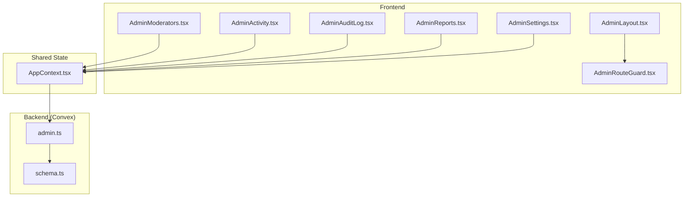
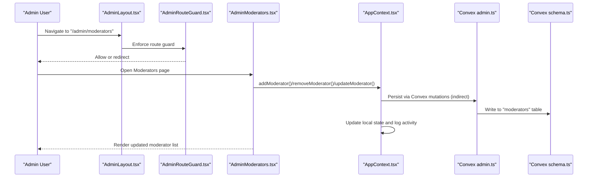
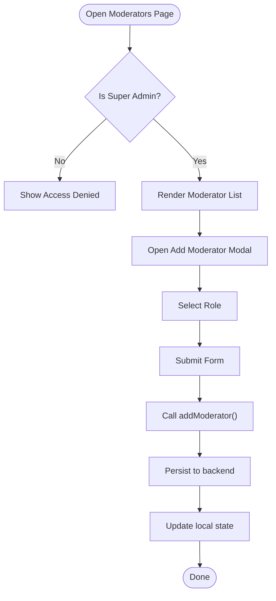
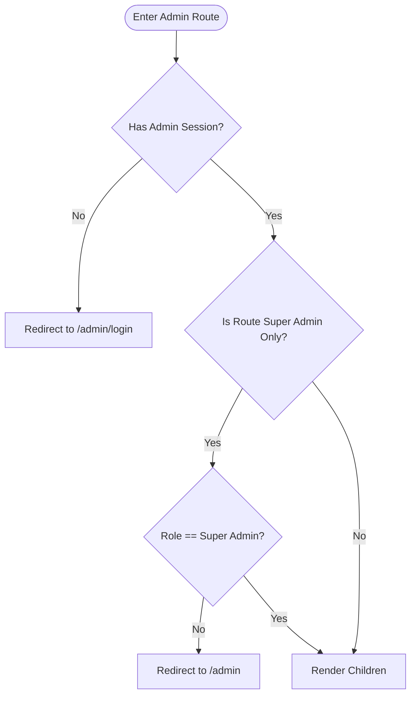
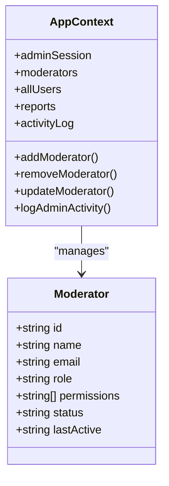
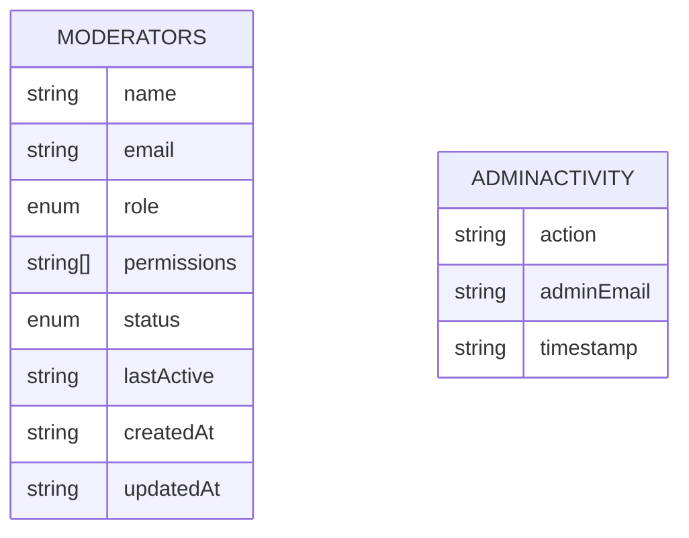
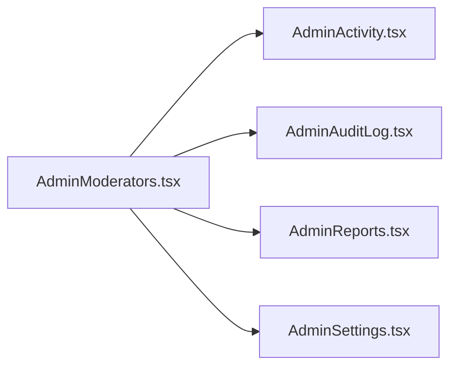
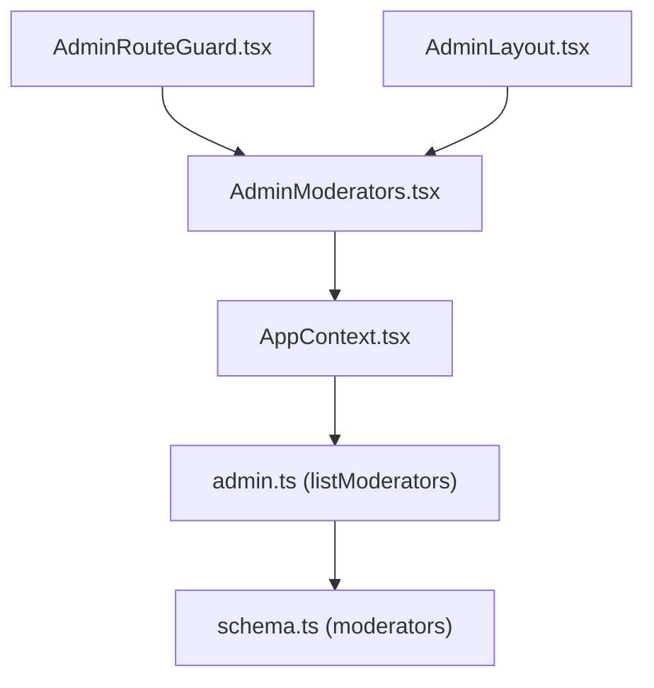

# Moderator Administration

<cite>
**Referenced Files in This Document**
- [AdminModerators.tsx](file://src/screens/admin/AdminModerators.tsx)
- [AdminRouteGuard.tsx](file://src/components/admin/AdminRouteGuard.tsx)
- [AdminLayout.tsx](file://src/components/admin/AdminLayout.tsx)
- [AppContext.tsx](file://src/contexts/AppContext.tsx)
- [schema.ts](file://convex/schema.ts)
- [admin.ts](file://convex/admin.ts)
- [AdminActivity.tsx](file://src/screens/admin/AdminActivity.tsx)
- [AdminAuditLog.tsx](file://src/screens/admin/AdminAuditLog.tsx)
- [AdminReports.tsx](file://src/screens/admin/AdminReports.tsx)
- [AdminSettings.tsx](file://src/screens/admin/AdminSettings.tsx)
</cite>

## Table of Contents
1. [Introduction](#introduction)
2. [Project Structure](#project-structure)
3. [Core Components](#core-components)
4. [Architecture Overview](#architecture-overview)
5. [Detailed Component Analysis](#detailed-component-analysis)
6. [Dependency Analysis](#dependency-analysis)
7. [Performance Considerations](#performance-considerations)
8. [Troubleshooting Guide](#troubleshooting-guide)
9. [Conclusion](#conclusion)

## Introduction
This document describes the moderator administration system, focusing on role assignment, privilege management, dashboards, workflows, and oversight. It synthesizes frontend UI components, backend Convex queries/mutations, and shared application state to explain how administrators manage moderators, monitor activities, and maintain platform integrity.

## Project Structure
The moderator administration feature spans:
- Frontend screens and guards under src/screens/admin and src/components/admin
- Shared application state in src/contexts/AppContext.tsx
- Backend data model and admin APIs in convex/schema.ts and convex/admin.ts

**Diagram sources**
- [AdminModerators.tsx:1-193](file://src/screens/admin/AdminModerators.tsx#L1-L193)
- [AdminLayout.tsx:1-289](file://src/components/admin/AdminLayout.tsx#L1-L289)
- [AdminRouteGuard.tsx:1-24](file://src/components/admin/AdminRouteGuard.tsx#L1-L24)
- [AppContext.tsx:1-800](file://src/contexts/AppContext.tsx#L1-L800)
- [schema.ts:183-196](file://convex/schema.ts#L183-L196)
- [admin.ts:246-251](file://convex/admin.ts#L246-L251)

**Section sources**
- [AdminModerators.tsx:1-193](file://src/screens/admin/AdminModerators.tsx#L1-L193)
- [AdminLayout.tsx:1-289](file://src/components/admin/AdminLayout.tsx#L1-L289)
- [AdminRouteGuard.tsx:1-24](file://src/components/admin/AdminRouteGuard.tsx#L1-L24)
- [AppContext.tsx:509-770](file://src/contexts/AppContext.tsx#L509-L770)
- [schema.ts:183-196](file://convex/schema.ts#L183-L196)
- [admin.ts:246-251](file://convex/admin.ts#L246-L251)

## Core Components
- Moderator management screen: allows adding/removing/updating moderators and toggling account status. Only accessible by super admins.
- Admin routing guard: restricts routes to authenticated admins and enforces super admin-only pages.
- Admin layout: navigation menu with “Moderators” entry gated behind super admin role.
- Shared application state: maintains admin session, moderator list, and provides actions to mutate moderator records and log admin activity.
- Backend schema: defines the moderators table with role, permissions, status, and timestamps.
- Backend admin module: exposes listModerators query and admin activity logging.

Key capabilities:
- Role assignment: assign roles such as moderator, content_reviewer, payment_reviewer.
- Status control: enable/disable moderator accounts.
- Activity logging: centralized admin activity log for all moderation actions.
- Oversight: activity and audit logs for transparency and compliance.

**Section sources**
- [AdminModerators.tsx:20-111](file://src/screens/admin/AdminModerators.tsx#L20-L111)
- [AdminRouteGuard.tsx:10-23](file://src/components/admin/AdminRouteGuard.tsx#L10-L23)
- [AdminLayout.tsx:49-72](file://src/components/admin/AdminLayout.tsx#L49-L72)
- [AppContext.tsx:149-173](file://src/contexts/AppContext.tsx#L149-L173)
- [schema.ts:183-196](file://convex/schema.ts#L183-L196)
- [admin.ts:246-251](file://convex/admin.ts#L246-L251)

## Architecture Overview
The moderator administration flow connects UI components to shared state and backend services.

**Diagram sources**
- [AdminLayout.tsx:49-72](file://src/components/admin/AdminLayout.tsx#L49-L72)
- [AdminRouteGuard.tsx:10-23](file://src/components/admin/AdminRouteGuard.tsx#L10-L23)
- [AdminModerators.tsx:20-111](file://src/screens/admin/AdminModerators.tsx#L20-L111)
- [AppContext.tsx:752-770](file://src/contexts/AppContext.tsx#L752-L770)
- [admin.ts:246-251](file://convex/admin.ts#L246-L251)
- [schema.ts:183-196](file://convex/schema.ts#L183-L196)

## Detailed Component Analysis

### Moderator Management Screen
Responsibilities:
- Restrict access to super admins only.
- Provide controls to add, disable/enable, and remove moderators.
- Assign roles among moderator, content_reviewer, payment_reviewer.
- Default permissions array and active status on creation.

UI highlights:
- Add moderator modal with role selection.
- Per-moderator action buttons for status toggle and removal.
- Visual indicators for role and status.

**Diagram sources**
- [AdminModerators.tsx:27-51](file://src/screens/admin/AdminModerators.tsx#L27-L51)
- [AdminModerators.tsx:114-189](file://src/screens/admin/AdminModerators.tsx#L114-L189)
- [AppContext.tsx:752-760](file://src/contexts/AppContext.tsx#L752-L760)

**Section sources**
- [AdminModerators.tsx:20-111](file://src/screens/admin/AdminModerators.tsx#L20-L111)
- [AdminModerators.tsx:114-189](file://src/screens/admin/AdminModerators.tsx#L114-L189)
- [AppContext.tsx:752-770](file://src/contexts/AppContext.tsx#L752-L770)

### Admin Routing Guard and Navigation
- Route guard enforces authentication and optionally super admin-only access.
- Admin layout filters navigation items based on current admin role.

**Diagram sources**
- [AdminRouteGuard.tsx:10-23](file://src/components/admin/AdminRouteGuard.tsx#L10-L23)
- [AdminLayout.tsx:70-72](file://src/components/admin/AdminLayout.tsx#L70-L72)

**Section sources**
- [AdminRouteGuard.tsx:10-23](file://src/components/admin/AdminRouteGuard.tsx#L10-L23)
- [AdminLayout.tsx:70-72](file://src/components/admin/AdminLayout.tsx#L70-L72)

### Shared Application State (Moderators and Activity)
- Maintains adminSession, moderators list, allUsers, reports, and activityLog.
- Provides actions: addModerator, removeModerator, updateModerator, logAdminActivity.
- Loads moderators from Convex via listModerators query.

**Diagram sources**
- [AppContext.tsx:149-173](file://src/contexts/AppContext.tsx#L149-L173)
- [AppContext.tsx:26-34](file://src/contexts/AppContext.tsx#L26-L34)

**Section sources**
- [AppContext.tsx:517-586](file://src/contexts/AppContext.tsx#L517-L586)
- [AppContext.tsx:752-770](file://src/contexts/AppContext.tsx#L752-L770)

### Backend Data Model and Admin APIs
- Moderators table with role, permissions, status, timestamps.
- Admin module exposes listModerators query and admin activity logging.

**Diagram sources**
- [schema.ts:183-196](file://convex/schema.ts#L183-L196)
- [schema.ts:176-181](file://convex/schema.ts#L176-L181)
- [admin.ts:246-251](file://convex/admin.ts#L246-L251)
- [admin.ts:225-244](file://convex/admin.ts#L225-L244)

**Section sources**
- [schema.ts:183-196](file://convex/schema.ts#L183-L196)
- [admin.ts:246-251](file://convex/admin.ts#L246-L251)
- [admin.ts:225-244](file://convex/admin.ts#L225-L244)

### Moderator Dashboard Elements
While a dedicated “dashboard” page is not present, the system provides complementary screens for oversight:
- Activity Log: view and filter admin actions.
- Audit Log: event categorization and severity levels.
- Reports: moderation queue and resolution actions.

**Diagram sources**
- [AdminActivity.tsx:68-175](file://src/screens/admin/AdminActivity.tsx#L68-L175)
- [AdminAuditLog.tsx:26-165](file://src/screens/admin/AdminAuditLog.tsx#L26-L165)
- [AdminReports.tsx:25-121](file://src/screens/admin/AdminReports.tsx#L25-L121)
- [AdminSettings.tsx:97-111](file://src/screens/admin/AdminSettings.tsx#L97-L111)

**Section sources**
- [AdminActivity.tsx:68-175](file://src/screens/admin/AdminActivity.tsx#L68-L175)
- [AdminAuditLog.tsx:26-165](file://src/screens/admin/AdminAuditLog.tsx#L26-L165)
- [AdminReports.tsx:25-121](file://src/screens/admin/AdminReports.tsx#L25-L121)
- [AdminSettings.tsx:97-111](file://src/screens/admin/AdminSettings.tsx#L97-L111)

## Dependency Analysis
- UI depends on AppContext for state and actions.
- AppContext loads moderators via Convex listModerators query.
- AdminRouteGuard and AdminLayout enforce role-based access.
- Backend schema defines the moderators table; admin.ts provides listModerators and activity logging.

**Diagram sources**
- [AdminModerators.tsx:20-111](file://src/screens/admin/AdminModerators.tsx#L20-L111)
- [AppContext.tsx:538-586](file://src/contexts/AppContext.tsx#L538-L586)
- [admin.ts:246-251](file://convex/admin.ts#L246-L251)
- [schema.ts:183-196](file://convex/schema.ts#L183-L196)
- [AdminRouteGuard.tsx:10-23](file://src/components/admin/AdminRouteGuard.tsx#L10-L23)
- [AdminLayout.tsx:70-72](file://src/components/admin/AdminLayout.tsx#L70-L72)

**Section sources**
- [AppContext.tsx:538-586](file://src/contexts/AppContext.tsx#L538-L586)
- [admin.ts:246-251](file://convex/admin.ts#L246-L251)
- [schema.ts:183-196](file://convex/schema.ts#L183-L196)

## Performance Considerations
- Centralized state loading: AppContext fetches moderators and other admin data on mount and periodically refreshes. This reduces per-page network overhead.
- Local updates: UI actions update state immediately, deferring persistence to backend, improving perceived responsiveness.
- Role gating: AdminRouteGuard prevents unnecessary rendering of restricted pages.

[No sources needed since this section provides general guidance]

## Troubleshooting Guide
Common scenarios and remedies:
- Access denied when visiting moderators page:
  - Ensure adminSession exists and role is super_admin.
  - Verify AdminRouteGuard and AdminLayout filtering logic.
- Modals not appearing:
  - Confirm state flags (e.g., showAddModal) are toggled correctly in AdminModerators.tsx.
- Moderator not visible after creation:
  - Check addModerator action and listModerators query integration.
  - Ensure AppContext sets moderators state and logs activity.

**Section sources**
- [AdminRouteGuard.tsx:10-23](file://src/components/admin/AdminRouteGuard.tsx#L10-L23)
- [AdminLayout.tsx:70-72](file://src/components/admin/AdminLayout.tsx#L70-L72)
- [AdminModerators.tsx:27-51](file://src/screens/admin/AdminModerators.tsx#L27-L51)
- [AppContext.tsx:752-770](file://src/contexts/AppContext.tsx#L752-L770)

## Conclusion
The moderator administration system integrates a role-gated UI, shared application state, and backend data persistence to support secure, auditable moderator management. Super admins can assign roles, control statuses, and rely on activity and audit logs for oversight. While a single “dashboard” page is not present, the combination of activity, audit, and reports screens provides comprehensive visibility into moderation operations.