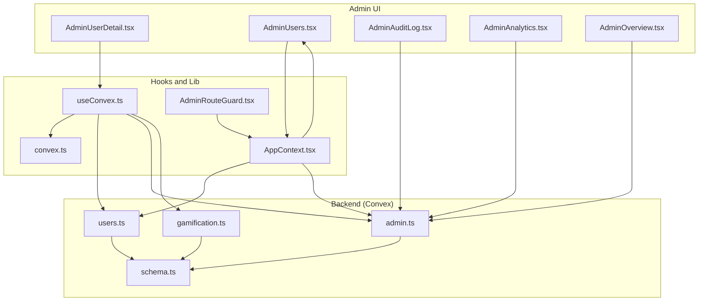
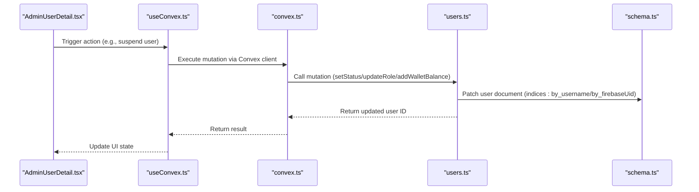
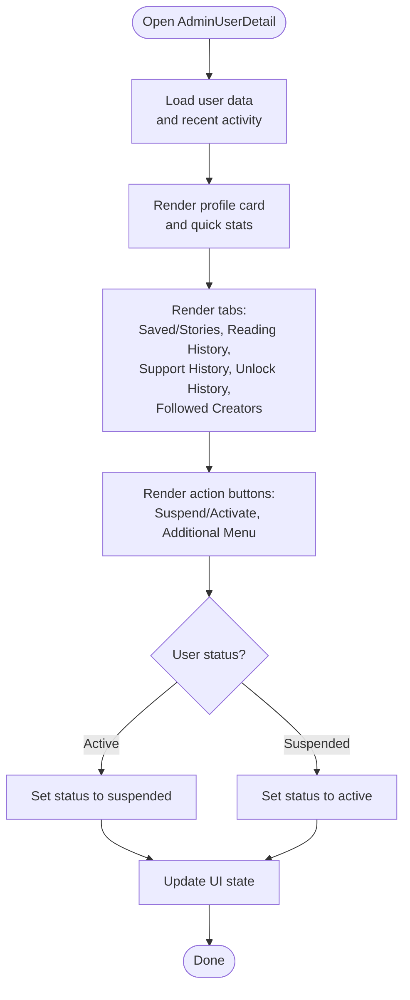
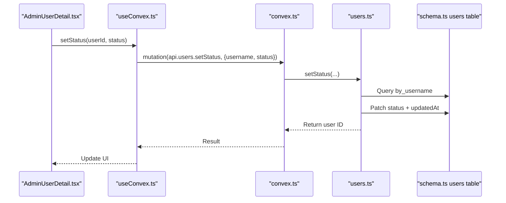
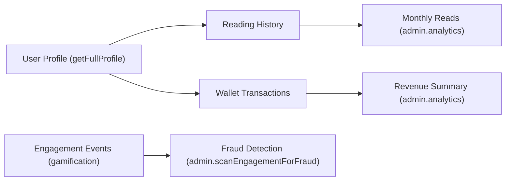
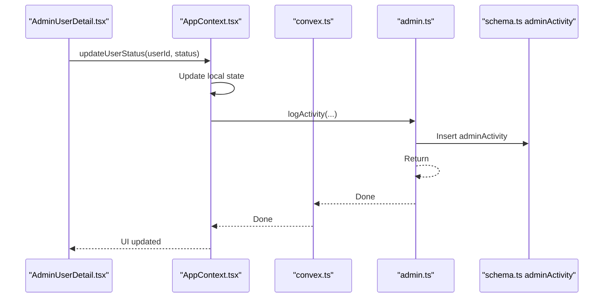
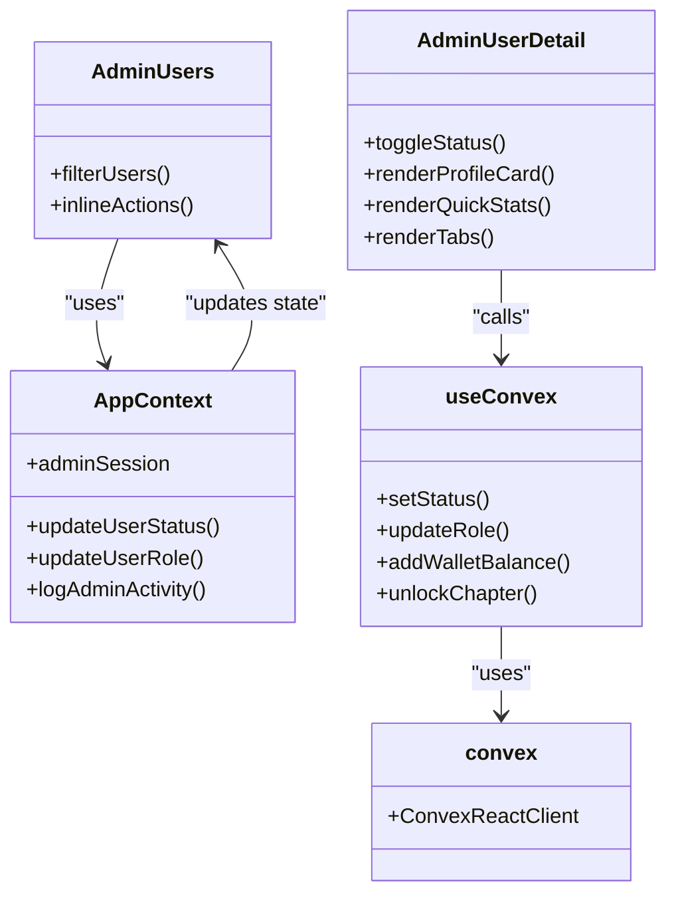
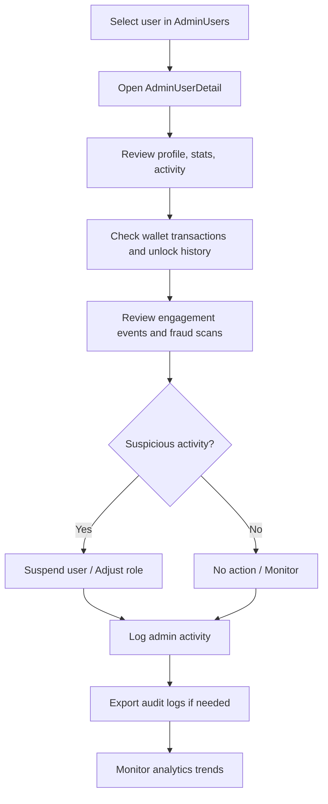
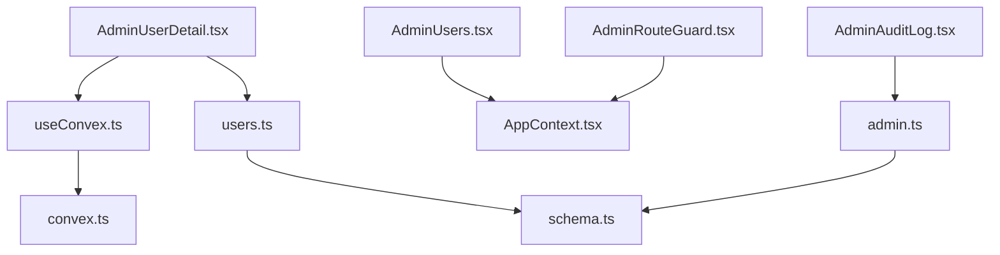

# User Detail Management

<cite>
**Referenced Files in This Document**
- [AdminUserDetail.tsx](file://src/screens/admin/details/AdminUserDetail.tsx)
- [users.ts](file://convex/users.ts)
- [schema.ts](file://convex/schema.ts)
- [AdminRouteGuard.tsx](file://src/components/admin/AdminRouteGuard.tsx)
- [AdminUsers.tsx](file://src/screens/admin/AdminUsers.tsx)
- [AdminAuditLog.tsx](file://src/screens/admin/AdminAuditLog.tsx)
- [admin.ts](file://convex/admin.ts)
- [useConvex.ts](file://src/hooks/useConvex.ts)
- [convex.ts](file://src/lib/convex.ts)
- [AppContext.tsx](file://src/contexts/AppContext.tsx)
- [AdminAnalytics.tsx](file://src/screens/admin/AdminAnalytics.tsx)
- [AdminOverview.tsx](file://src/screens/admin/AdminOverview.tsx)
- [useEngagement.ts](file://src/hooks/useEngagement.ts)
- [gamification.ts](file://convex/gamification.ts)
</cite>

## Table of Contents
1. [Introduction](#introduction)
2. [Project Structure](#project-structure)
3. [Core Components](#core-components)
4. [Architecture Overview](#architecture-overview)
5. [Detailed Component Analysis](#detailed-component-analysis)
6. [Dependency Analysis](#dependency-analysis)
7. [Performance Considerations](#performance-considerations)
8. [Troubleshooting Guide](#troubleshooting-guide)
9. [Conclusion](#conclusion)
10. [Appendices](#appendices)

## Introduction
This document describes the individual user detail management interface for administrators. It covers the comprehensive user profile view, account statistics, transaction history, interaction logs, administrative controls (role modification, account status changes, privilege adjustments), analytics dashboards for reading and purchase patterns, audit trail functionality, and integration with backend administrative functions for real-time updates. It also outlines user investigation workflows and decision-making processes.

## Project Structure
The user detail management feature spans frontend screens, Convex backend queries/mutations, and shared application context/state. Key areas include:
- Admin detail screen for viewing and acting on a single user
- Backend user profile aggregation and administrative mutations
- Audit logging and analytics for investigations
- Route guards and context for admin actions

**Diagram sources**
- [AdminUserDetail.tsx:1-234](file://src/screens/admin/details/AdminUserDetail.tsx#L1-L234)
- [AdminUsers.tsx:1-266](file://src/screens/admin/AdminUsers.tsx#L1-L266)
- [AdminAuditLog.tsx:1-197](file://src/screens/admin/AdminAuditLog.tsx#L1-L197)
- [AdminAnalytics.tsx:1-49](file://src/screens/admin/AdminAnalytics.tsx#L1-L49)
- [AdminOverview.tsx:1-110](file://src/screens/admin/AdminOverview.tsx#L1-L110)
- [useConvex.ts:1-213](file://src/hooks/useConvex.ts#L1-L213)
- [convex.ts:1-12](file://src/lib/convex.ts#L1-L12)
- [AppContext.tsx:1-800](file://src/contexts/AppContext.tsx#L1-L800)
- [AdminRouteGuard.tsx:1-24](file://src/components/admin/AdminRouteGuard.tsx#L1-L24)
- [users.ts:1-360](file://convex/users.ts#L1-L360)
- [admin.ts:1-364](file://convex/admin.ts#L1-L364)
- [schema.ts:1-495](file://convex/schema.ts#L1-L495)
- [gamification.ts:1-43](file://convex/gamification.ts#L1-L43)

**Section sources**
- [AdminUserDetail.tsx:1-234](file://src/screens/admin/details/AdminUserDetail.tsx#L1-L234)
- [users.ts:1-360](file://convex/users.ts#L1-L360)
- [schema.ts:1-495](file://convex/schema.ts#L1-L495)
- [AdminRouteGuard.tsx:1-24](file://src/components/admin/AdminRouteGuard.tsx#L1-L24)
- [AdminUsers.tsx:1-266](file://src/screens/admin/AdminUsers.tsx#L1-L266)
- [AdminAuditLog.tsx:1-197](file://src/screens/admin/AdminAuditLog.tsx#L1-L197)
- [admin.ts:1-364](file://convex/admin.ts#L1-L364)
- [useConvex.ts:1-213](file://src/hooks/useConvex.ts#L1-L213)
- [convex.ts:1-12](file://src/lib/convex.ts#L1-L12)
- [AppContext.tsx:1-800](file://src/contexts/AppContext.tsx#L1-L800)
- [AdminAnalytics.tsx:1-49](file://src/screens/admin/AdminAnalytics.tsx#L1-L49)
- [AdminOverview.tsx:1-110](file://src/screens/admin/AdminOverview.tsx#L1-L110)
- [useEngagement.ts:1-63](file://src/hooks/useEngagement.ts#L1-L63)
- [gamification.ts:1-43](file://convex/gamification.ts#L1-L43)

## Core Components
- AdminUserDetail: Renders the user’s profile card, quick stats, admin notes, recent activity preview, and tabs for saved stories, reading history, support history, unlock history, and followed creators. Includes action buttons for suspending/activating and additional menu actions.
- users.ts: Backend mutations and queries for updating roles/status, adding wallet funds, unlocking chapters, toggling saves/follows, and aggregating full user profiles with reading history, notifications, and wallet transactions.
- schema.ts: Defines the users table and related indices, including role, status, and timestamps.
- AdminRouteGuard: Protects admin routes and restricts access based on role.
- AdminUsers: Lists users, filters/searches, and exposes inline actions to change role/status and view activity.
- AdminAuditLog: Displays immutable audit records, supports filtering and export.
- admin.ts: Provides analytics, overview stats, and admin activity logging.
- useConvex.ts: Exposes typed hooks for Convex operations including user profile updates and unlocks.
- AppContext: Manages admin session state, user lists, and admin actions like updating user status/role and logging admin activity.
- Analytics screens: AdminAnalytics and AdminOverview consume backend analytics and overview stats.

**Section sources**
- [AdminUserDetail.tsx:1-234](file://src/screens/admin/details/AdminUserDetail.tsx#L1-L234)
- [users.ts:92-127](file://convex/users.ts#L92-L127)
- [schema.ts:24-67](file://convex/schema.ts#L24-L67)
- [AdminRouteGuard.tsx:1-24](file://src/components/admin/AdminRouteGuard.tsx#L1-L24)
- [AdminUsers.tsx:1-266](file://src/screens/admin/AdminUsers.tsx#L1-L266)
- [AdminAuditLog.tsx:1-197](file://src/screens/admin/AdminAuditLog.tsx#L1-L197)
- [admin.ts:31-64](file://convex/admin.ts#L31-L64)
- [useConvex.ts:167-171](file://src/hooks/useConvex.ts#L167-L171)
- [AppContext.tsx:713-750](file://src/contexts/AppContext.tsx#L713-L750)

## Architecture Overview
The user detail interface integrates frontend UI with Convex backend functions and maintains admin state in the application context. Administrators can view a user’s profile, modify roles/status, adjust privileges, and inspect analytics and audit trails.

**Diagram sources**
- [AdminUserDetail.tsx:44-72](file://src/screens/admin/details/AdminUserDetail.tsx#L44-L72)
- [useConvex.ts:167-171](file://src/hooks/useConvex.ts#L167-L171)
- [convex.ts:1-12](file://src/lib/convex.ts#L1-L12)
- [users.ts:113-127](file://convex/users.ts#L113-L127)
- [schema.ts:24-67](file://convex/schema.ts#L24-L67)

## Detailed Component Analysis

### AdminUserDetail Screen
- Purpose: Present a comprehensive view of a selected user’s profile, stats, recent activity, and tabs for deeper insights.
- Key UI elements:
  - Profile card with avatar, username, email, status, and role
  - Quick stats: wallet balance, premium status, join date
  - Admin notes section
  - Recent activity preview
  - Tabs: Saved Stories, Reading History, Support History, Unlock History, Followed Creators
  - Action buttons: suspend/activate user and additional menu
- Interactions:
  - Toggle user status between active/suspended
  - View public profile link
  - Add internal admin notes
  - Navigate to related sections via tabs

**Diagram sources**
- [AdminUserDetail.tsx:24-234](file://src/screens/admin/details/AdminUserDetail.tsx#L24-L234)

**Section sources**
- [AdminUserDetail.tsx:1-234](file://src/screens/admin/details/AdminUserDetail.tsx#L1-L234)

### Backend Administrative Functions
- Role and status updates:
  - Mutation: updateRole(username, role)
  - Mutation: setStatus(username, status)
  - Both fetch user by username index and patch status/role
- Wallet operations:
  - Mutation: addWalletBalance(firebaseUid, amount)
- Full profile aggregation:
  - Query: getFullProfile(firebaseUid) returns user plus readingHistory, notifications, and walletTransactions
- Chapter unlock and transaction recording:
  - Mutation: unlockChapter(firebaseUid, storyId, chapterId, price)
  - Records wallet transaction of type chapter_unlock upon success

**Diagram sources**
- [AdminUserDetail.tsx:44-72](file://src/screens/admin/details/AdminUserDetail.tsx#L44-L72)
- [useConvex.ts:167-171](file://src/hooks/useConvex.ts#L167-L171)
- [users.ts:113-127](file://convex/users.ts#L113-L127)
- [schema.ts:24-67](file://convex/schema.ts#L24-L67)

**Section sources**
- [users.ts:92-127](file://convex/users.ts#L92-L127)
- [users.ts:149-181](file://convex/users.ts#L149-L181)
- [users.ts:269-310](file://convex/users.ts#L269-L310)
- [schema.ts:24-67](file://convex/schema.ts#L24-L67)

### Analytics Dashboard Within User Details
- Reading patterns:
  - Reading history aggregated per user via getFullProfile
  - Monthly read volume and top stories available from admin analytics
- Purchase history:
  - Wallet transactions included in getFullProfile
  - Premium/top-up/support transactions available via admin analytics
- Engagement metrics:
  - Engagement events recorded via gamification.recordEngagement
  - Fraud detection scans suspicious engagement patterns

**Diagram sources**
- [users.ts:149-181](file://convex/users.ts#L149-L181)
- [admin.ts:66-128](file://convex/admin.ts#L66-L128)
- [gamification.ts:14-43](file://convex/gamification.ts#L14-L43)

**Section sources**
- [users.ts:149-181](file://convex/users.ts#L149-L181)
- [admin.ts:66-128](file://convex/admin.ts#L66-L128)
- [AdminAnalytics.tsx:1-49](file://src/screens/admin/AdminAnalytics.tsx#L1-L49)
- [AdminOverview.tsx:1-110](file://src/screens/admin/AdminOverview.tsx#L1-L110)
- [useEngagement.ts:1-63](file://src/hooks/useEngagement.ts#L1-L63)
- [gamification.ts:1-43](file://convex/gamification.ts#L1-L43)

### Audit Trail Functionality
- Admin activity logging:
  - logActivity(action, adminEmail, metadata) inserts into adminActivity table
  - listActivity() retrieves recent admin activity
- Audit log screen:
  - Displays events with severity, type, and timestamp
  - Supports search, filtering, and export
- Fraud events:
  - scanEngagementForFraud identifies suspicious engagement patterns
  - listFraudEvents and resolveFraudEvent manage fraud cases

**Diagram sources**
- [AppContext.tsx:737-745](file://src/contexts/AppContext.tsx#L737-L745)
- [admin.ts:232-244](file://convex/admin.ts#L232-L244)
- [schema.ts:176-181](file://convex/schema.ts#L176-L181)

**Section sources**
- [AdminAuditLog.tsx:1-197](file://src/screens/admin/AdminAuditLog.tsx#L1-L197)
- [admin.ts:225-244](file://convex/admin.ts#L225-L244)
- [admin.ts:312-348](file://convex/admin.ts#L312-L348)
- [AppContext.tsx:727-735](file://src/contexts/AppContext.tsx#L727-L735)

### Integration With Backend Administrative Functions
- Real-time updates:
  - AdminUsers maintains a list of all users and allows inline actions (suspend/unsuspend, change role)
  - AppContext tracks adminSession and logs admin activity
- Typed Convex hooks:
  - useConvex.ts centralizes Convex calls for user profile updates and unlocks
- Environment configuration:
  - convex.ts initializes Convex client from environment variable

**Diagram sources**
- [AdminUserDetail.tsx:1-234](file://src/screens/admin/details/AdminUserDetail.tsx#L1-L234)
- [AdminUsers.tsx:1-266](file://src/screens/admin/AdminUsers.tsx#L1-L266)
- [AppContext.tsx:713-750](file://src/contexts/AppContext.tsx#L713-L750)
- [useConvex.ts:167-171](file://src/hooks/useConvex.ts#L167-L171)
- [convex.ts:1-12](file://src/lib/convex.ts#L1-L12)

**Section sources**
- [AdminUsers.tsx:1-266](file://src/screens/admin/AdminUsers.tsx#L1-L266)
- [AppContext.tsx:713-750](file://src/contexts/AppContext.tsx#L713-L750)
- [useConvex.ts:167-171](file://src/hooks/useConvex.ts#L167-L171)
- [convex.ts:1-12](file://src/lib/convex.ts#L1-L12)

### User Investigation Workflows and Decision-Making
- Investigate user behavior:
  - Review recent activity and reading history from user detail tabs
  - Inspect wallet transactions and unlock history
- Analyze engagement:
  - Use engagement events and fraud detection to identify suspicious activity
- Make decisions:
  - Suspend/activate user via AdminUserDetail or AdminUsers
  - Change role via AdminUsers dropdown menu
  - Log actions in audit trail for transparency
- Track outcomes:
  - Monitor analytics trends post-intervention
  - Export audit logs for compliance

**Diagram sources**
- [AdminUsers.tsx:147-196](file://src/screens/admin/AdminUsers.tsx#L147-L196)
- [AdminUserDetail.tsx:168-194](file://src/screens/admin/details/AdminUserDetail.tsx#L168-L194)
- [users.ts:149-181](file://convex/users.ts#L149-L181)
- [admin.ts:312-348](file://convex/admin.ts#L312-L348)
- [AdminAuditLog.tsx:29-35](file://src/screens/admin/AdminAuditLog.tsx#L29-L35)

**Section sources**
- [AdminUsers.tsx:147-196](file://src/screens/admin/AdminUsers.tsx#L147-L196)
- [AdminUserDetail.tsx:168-194](file://src/screens/admin/details/AdminUserDetail.tsx#L168-L194)
- [users.ts:149-181](file://convex/users.ts#L149-L181)
- [admin.ts:312-348](file://convex/admin.ts#L312-L348)
- [AdminAuditLog.tsx:29-35](file://src/screens/admin/AdminAuditLog.tsx#L29-L35)

## Dependency Analysis
- Frontend-to-backend coupling:
  - AdminUserDetail depends on useConvex hooks for mutations
  - useConvex depends on convex.ts for client initialization
  - AppContext coordinates admin actions and maintains state
- Backend schema dependencies:
  - users.ts relies on schema indices for efficient lookups
  - admin.ts aggregates analytics across multiple tables
- Security and routing:
  - AdminRouteGuard enforces admin session and role checks

**Diagram sources**
- [AdminUserDetail.tsx:1-234](file://src/screens/admin/details/AdminUserDetail.tsx#L1-L234)
- [useConvex.ts:1-213](file://src/hooks/useConvex.ts#L1-L213)
- [convex.ts:1-12](file://src/lib/convex.ts#L1-L12)
- [users.ts:1-360](file://convex/users.ts#L1-L360)
- [schema.ts:1-495](file://convex/schema.ts#L1-L495)
- [AdminUsers.tsx:1-266](file://src/screens/admin/AdminUsers.tsx#L1-L266)
- [AppContext.tsx:1-800](file://src/contexts/AppContext.tsx#L1-L800)
- [AdminAuditLog.tsx:1-197](file://src/screens/admin/AdminAuditLog.tsx#L1-L197)
- [admin.ts:1-364](file://convex/admin.ts#L1-L364)
- [AdminRouteGuard.tsx:1-24](file://src/components/admin/AdminRouteGuard.tsx#L1-L24)

**Section sources**
- [AdminUserDetail.tsx:1-234](file://src/screens/admin/details/AdminUserDetail.tsx#L1-L234)
- [useConvex.ts:1-213](file://src/hooks/useConvex.ts#L1-L213)
- [convex.ts:1-12](file://src/lib/convex.ts#L1-L12)
- [users.ts:1-360](file://convex/users.ts#L1-L360)
- [schema.ts:1-495](file://convex/schema.ts#L1-L495)
- [AdminUsers.tsx:1-266](file://src/screens/admin/AdminUsers.tsx#L1-L266)
- [AppContext.tsx:1-800](file://src/contexts/AppContext.tsx#L1-L800)
- [AdminAuditLog.tsx:1-197](file://src/screens/admin/AdminAuditLog.tsx#L1-L197)
- [admin.ts:1-364](file://convex/admin.ts#L1-L364)
- [AdminRouteGuard.tsx:1-24](file://src/components/admin/AdminRouteGuard.tsx#L1-L24)

## Performance Considerations
- Efficient lookups:
  - Use indexed fields (by_username, by_firebaseUid) for user queries and mutations
- Batch operations:
  - Aggregate related data (readingHistory, notifications, walletTransactions) in a single getFullProfile call
- Debouncing and intervals:
  - Avoid excessive polling; rely on Convex subscriptions and periodic refresh patterns
- Minimize re-renders:
  - Memoize derived data in AppContext and screens

## Troubleshooting Guide
- Convex client not configured:
  - Ensure VITE_CONVEX_URL is set; otherwise, Convex is disabled until configured
- User not found errors:
  - Verify user exists by firebaseUid/username before attempting updates
- Insufficient balance:
  - unlockChapter requires sufficient wallet balance; handle errors gracefully in UI
- Audit log discrepancies:
  - Confirm adminActivity table indexing and recent activity retrieval order

**Section sources**
- [convex.ts:1-12](file://src/lib/convex.ts#L1-L12)
- [users.ts:269-310](file://convex/users.ts#L269-L310)
- [admin.ts:225-244](file://convex/admin.ts#L225-L244)

## Conclusion
The user detail management interface provides administrators with a comprehensive toolkit to investigate, monitor, and act on user accounts. It combines a rich UI with robust backend mutations, analytics, and audit trails to support informed decision-making and maintain platform integrity.

## Appendices
- Example actions available:
  - Suspend/activate user
  - Change user role
  - Add funds to wallet
  - Unlock chapter for user
  - Log admin activity
  - Export audit logs
  - Scan for fraud events