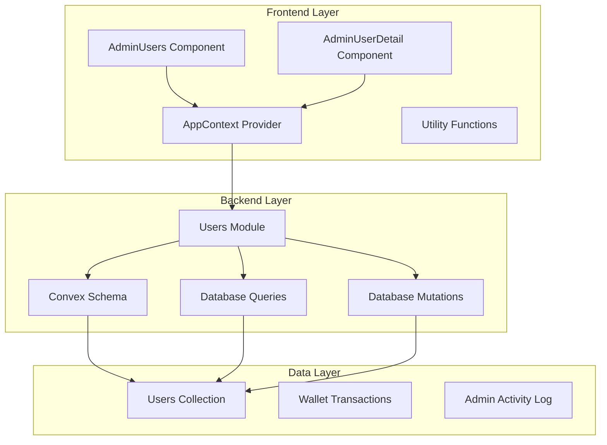
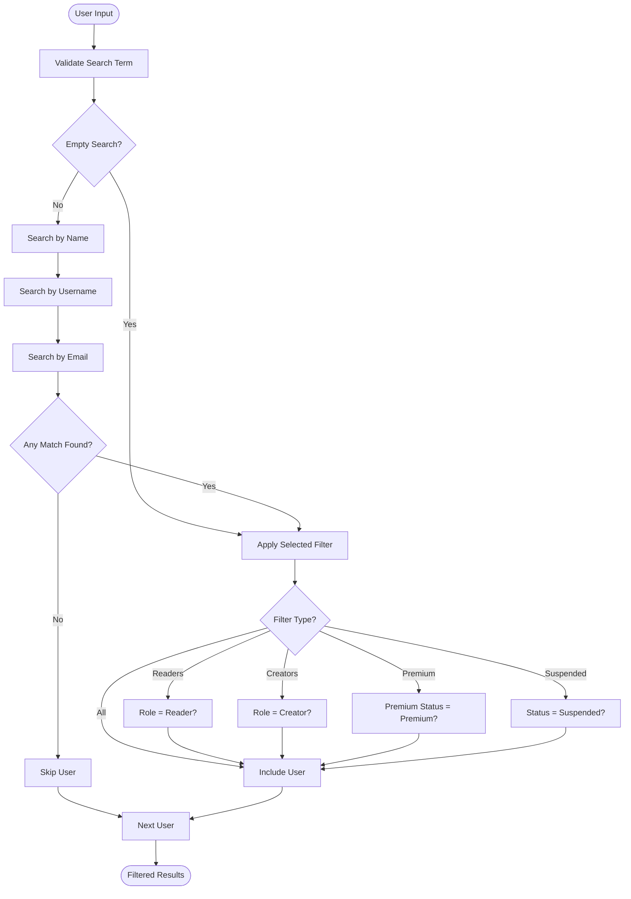
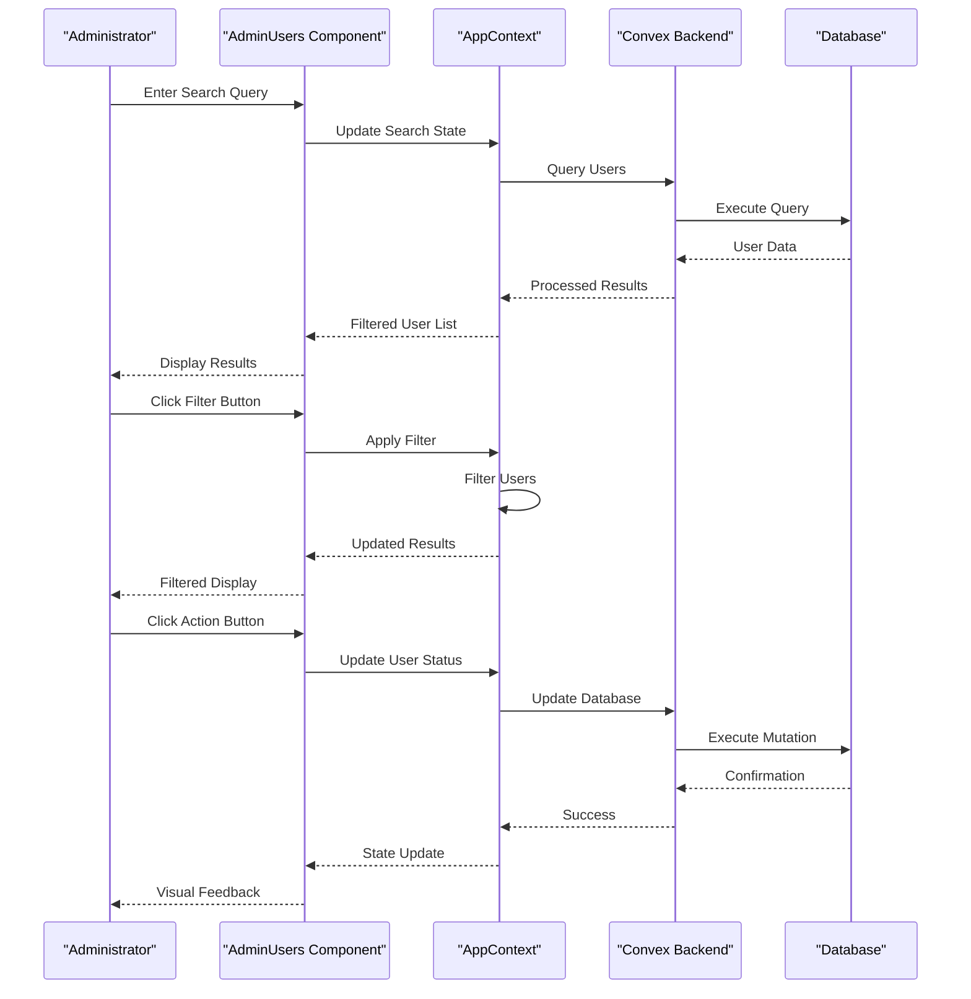
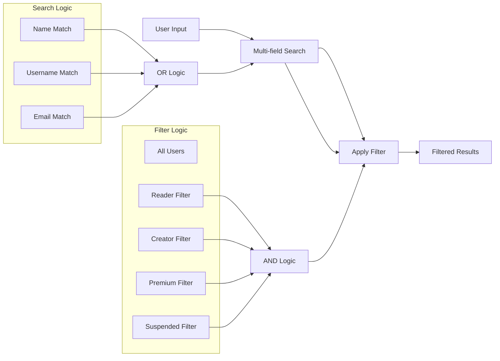
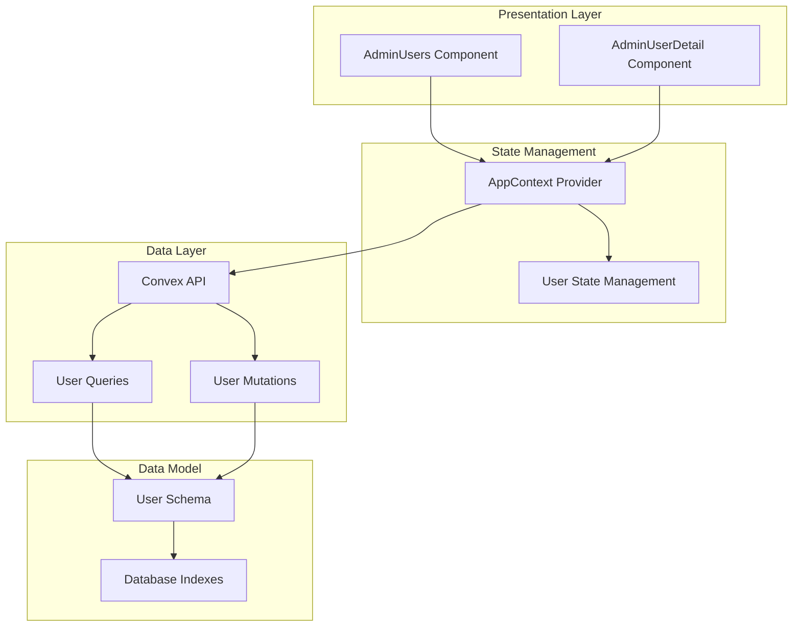

# User Listings and Search

<cite>
**Referenced Files in This Document**
- [AdminUsers.tsx](file://src/screens/admin/AdminUsers.tsx)
- [AppContext.tsx](file://src/contexts/AppContext.tsx)
- [users.ts](file://convex/users.ts)
- [schema.ts](file://convex/schema.ts)
- [AdminUserDetail.tsx](file://src/screens/admin/details/AdminUserDetail.tsx)
- [utils.ts](file://src/lib/utils.ts)
- [index.css](file://src/index.css)
</cite>

## Table of Contents
1. [Introduction](#introduction)
2. [Project Structure](#project-structure)
3. [Core Components](#core-components)
4. [Architecture Overview](#architecture-overview)
5. [Detailed Component Analysis](#detailed-component-analysis)
6. [Dependency Analysis](#dependency-analysis)
7. [Performance Considerations](#performance-considerations)
8. [Troubleshooting Guide](#troubleshooting-guide)
9. [Conclusion](#conclusion)

## Introduction

The User Listings and Search functionality provides administrators with a comprehensive interface for managing platform users. This system enables efficient monitoring and administration of user accounts through a sophisticated filtering and search mechanism, supporting both desktop and mobile experiences.

The implementation combines frontend React components with backend Convex database queries to deliver real-time user management capabilities. The system supports multi-criteria search across user profiles, role-based filtering, premium status management, and account suspension controls.

## Project Structure

The user management functionality is organized across several key architectural layers:

**Diagram sources**
- [AdminUsers.tsx:1-266](file://src/screens/admin/AdminUsers.tsx#L1-L266)
- [AppContext.tsx:509-745](file://src/contexts/AppContext.tsx#L509-L745)
- [users.ts:15-127](file://convex/users.ts#L15-L127)

**Section sources**
- [AdminUsers.tsx:1-266](file://src/screens/admin/AdminUsers.tsx#L1-L266)
- [AppContext.tsx:509-745](file://src/contexts/AppContext.tsx#L509-L745)
- [users.ts:15-127](file://convex/users.ts#L15-L127)

## Core Components

### AdminUsers Component

The primary user management interface implements a comprehensive search and filtering system with responsive design capabilities.

**Key Features:**
- Multi-criteria search across name, username, and email fields
- Role-based filtering (readers, creators)
- Premium status filtering
- Account suspension status filtering
- Interactive user management controls
- Responsive desktop/tablet and mobile layouts

**Search Implementation:**
The search functionality operates on three primary user attributes with case-insensitive matching:

**Diagram sources**
- [AdminUsers.tsx:29-42](file://src/screens/admin/AdminUsers.tsx#L29-L42)

**Section sources**
- [AdminUsers.tsx:23-266](file://src/screens/admin/AdminUsers.tsx#L23-L266)

### AppContext Provider

The application context manages global state for user data and administrative actions:

**State Management:**
- `allUsers`: Complete user collection from database
- `adminSession`: Administrator authentication state
- `moderators`: Moderator management data
- `reports`: Content reporting system
- `activityLog`: Administrative audit trail

**Administrative Actions:**
- `updateUserStatus`: Real-time user status updates
- `updateUserRole`: Role modification with immediate UI feedback
- `logAdminActivity`: Comprehensive audit logging

**Section sources**
- [AppContext.tsx:517-745](file://src/contexts/AppContext.tsx#L517-L745)

### Backend Data Model

The Convex schema defines the complete user data structure with comprehensive indexing for efficient querying:

**User Schema Properties:**
- Basic identification: `name`, `username`, `email`, `avatar`
- Authentication: `firebaseUid`, `externalId`
- Role and permissions: `role`, `creatorAccessStatus`
- Premium membership: `premiumStatus`, `premiumPlan`, billing cycles
- Financial: `walletBalance`, transaction history
- Social: `followedCreators`, `savedStories`, `unlockedChapters`
- Metadata: `status`, timestamps, settings

**Section sources**
- [schema.ts:25-62](file://convex/schema.ts#L25-L62)
- [users.ts:15-127](file://convex/users.ts#L15-L127)

## Architecture Overview

The user management system follows a client-server architecture with real-time synchronization:

**Diagram sources**
- [AdminUsers.tsx:24-42](file://src/screens/admin/AdminUsers.tsx#L24-L42)
- [AppContext.tsx:737-745](file://src/contexts/AppContext.tsx#L737-L745)
- [users.ts:15-127](file://convex/users.ts#L15-L127)

## Detailed Component Analysis

### Desktop Table Interface

The desktop interface provides a comprehensive table view optimized for administrator workflows:

**Table Structure:**
- **User Profile Column**: Avatar, name, and username with navigation capability
- **Role Column**: Color-coded role indicators (reader vs creator)
- **Premium Column**: Visual premium status indicator with active/free distinction
- **Wallet Column**: Formatted wallet balance display
- **Status Column**: Real-time status indicators with visual cues
- **Actions Column**: Comprehensive action buttons for user management

**Interactive Elements:**
- **View Details**: Direct navigation to user profile pages
- **Status Controls**: One-click suspension/activation toggles
- **Role Management**: Dropdown menus for role modifications
- **Activity Tracking**: Access to user activity logs

**Section sources**
- [AdminUsers.tsx:86-203](file://src/screens/admin/AdminUsers.tsx#L86-L203)

### Mobile Grid Layout

The mobile interface adapts the desktop functionality to smaller screens:

**Responsive Design Features:**
- **Card-based Layout**: Individual user cards replacing table rows
- **Touch-friendly Controls**: Larger tap targets for mobile interaction
- **Condensed Information**: Essential user data prioritized for small screens
- **Status Indicators**: Prominent visual status markers

**Mobile-Specific Elements:**
- **Avatar and Identity**: Large avatar with name and username
- **Quick Stats**: Role and wallet balance in prominent cards
- **Action Buttons**: Full-width action buttons for common operations
- **Status Circles**: Large circular indicators for account status

**Section sources**
- [AdminUsers.tsx:205-262](file://src/screens/admin/AdminUsers.tsx#L205-L262)

### Search and Filtering Mechanisms

The system implements sophisticated search and filtering capabilities:

**Search Criteria:**
- **Name Search**: Case-insensitive partial matching
- **Username Search**: Handles special characters and normalization
- **Email Search**: Supports email-based user discovery

**Filter Categories:**
- **All Users**: No filtering applied
- **Readers**: Users with reader role
- **Creators**: Users with creator role
- **Premium**: Active premium subscribers
- **Suspended**: Currently suspended accounts

**Filter Implementation:**

**Diagram sources**
- [AdminUsers.tsx:29-42](file://src/screens/admin/AdminUsers.tsx#L29-L42)

**Section sources**
- [AdminUsers.tsx:26-42](file://src/screens/admin/AdminUsers.tsx#L26-L42)

### User Detail Management

The user detail interface provides comprehensive administrative controls:

**Detail Page Features:**
- **Profile Overview**: Complete user information display
- **Status Management**: One-click status toggling
- **Role Modification**: Administrative role assignment
- **Activity History**: Comprehensive user action timeline
- **Financial Records**: Transaction and balance history

**Administrative Controls:**
- **Status Toggle**: Immediate account activation/suspension
- **Role Changes**: Real-time permission updates
- **Note System**: Private administrative notes
- **Activity Logging**: Complete audit trail

**Section sources**
- [AdminUserDetail.tsx:24-234](file://src/screens/admin/details/AdminUserDetail.tsx#L24-L234)

## Dependency Analysis

The user management system exhibits well-structured dependencies with clear separation of concerns:

**Diagram sources**
- [AdminUsers.tsx:24](file://src/screens/admin/AdminUsers.tsx#L24)
- [AppContext.tsx:517](file://src/contexts/AppContext.tsx#L517)
- [users.ts:15](file://convex/users.ts#L15)

**Section sources**
- [AdminUsers.tsx:24](file://src/screens/admin/AdminUsers.tsx#L24)
- [AppContext.tsx:517](file://src/contexts/AppContext.tsx#L517)
- [users.ts:15](file://convex/users.ts#L15)

## Performance Considerations

### Frontend Performance

**Optimization Strategies:**
- **Virtual Scrolling**: For large user datasets, implement virtualized rendering to limit DOM nodes
- **Debounced Search**: Throttle search input to prevent excessive re-renders
- **Memoization**: Use React.memo for user cards to prevent unnecessary re-rendering
- **Lazy Loading**: Load user avatars only when they come into viewport

**Memory Management:**
- **State Cleanup**: Proper cleanup of event listeners and subscriptions
- **Image Optimization**: Lazy loading and compression for user avatars
- **Component Unmounting**: Ensure proper cleanup when navigating away from user pages

### Backend Performance

**Database Optimization:**
- **Index Utilization**: Leverage existing indexes on username, role, and status fields
- **Query Efficiency**: Single query fetching all user data reduces round trips
- **Pagination Strategy**: For very large datasets, implement server-side pagination

**Real-time Updates:**
- **Efficient State Updates**: Batch updates to minimize re-renders
- **Selective Re-rendering**: Update only affected components when user data changes

## Troubleshooting Guide

### Common Issues and Solutions

**Search Not Working:**
- Verify search term length (minimum 1 character)
- Check for special characters that might interfere with matching
- Ensure database indexes are properly configured

**Filter Not Applying:**
- Confirm filter button state changes
- Check for JavaScript errors in browser console
- Verify user data structure matches expected format

**Status Update Failures:**
- Verify administrator authentication
- Check network connectivity to backend services
- Ensure user ID format is correct

**Mobile Layout Issues:**
- Test on various screen sizes and orientations
- Verify CSS media queries are functioning
- Check for touch event conflicts

**Performance Problems:**
- Monitor memory usage in browser dev tools
- Implement lazy loading for images
- Consider pagination for large datasets

**Section sources**
- [AdminUsers.tsx:29-42](file://src/screens/admin/AdminUsers.tsx#L29-L42)
- [AppContext.tsx:737-745](file://src/contexts/AppContext.tsx#L737-L745)

## Conclusion

The User Listings and Search functionality provides a robust, scalable solution for administrator user management. The implementation successfully balances comprehensive functionality with responsive design, supporting both desktop and mobile workflows.

Key strengths include:
- **Comprehensive Search**: Multi-criteria search across essential user attributes
- **Flexible Filtering**: Role-based and status-based filtering options
- **Real-time Updates**: Immediate visual feedback for administrative actions
- **Responsive Design**: Adaptive interface for various device sizes
- **Performance Optimization**: Efficient state management and rendering

The system demonstrates strong architectural patterns with clear separation of concerns, efficient data management, and comprehensive error handling. Future enhancements could include advanced analytics, export capabilities, and enhanced reporting features.