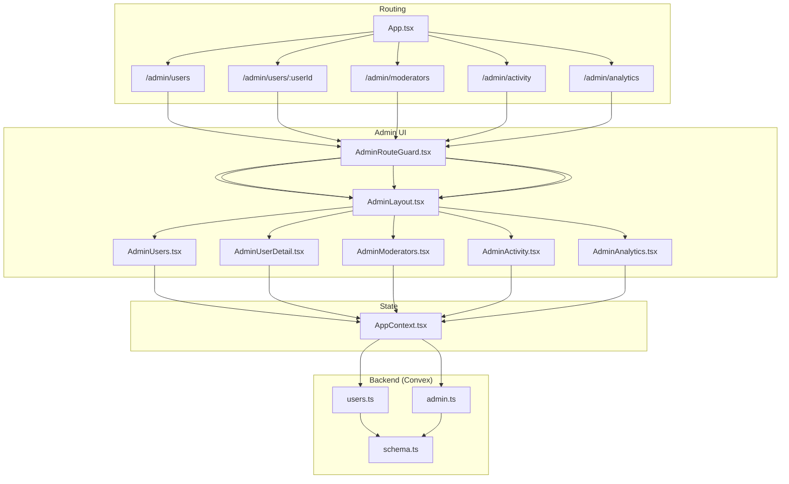
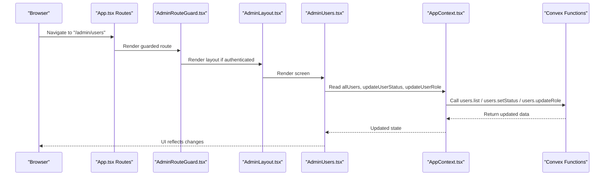
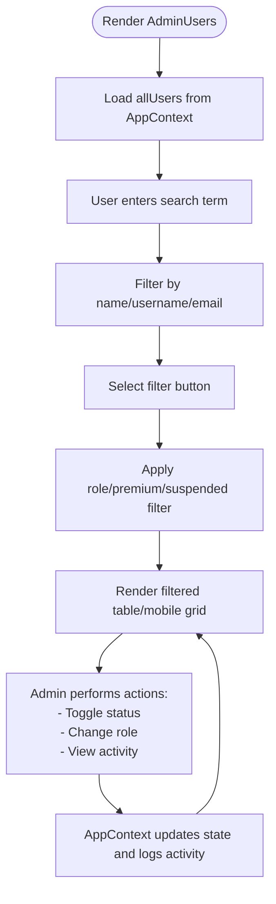
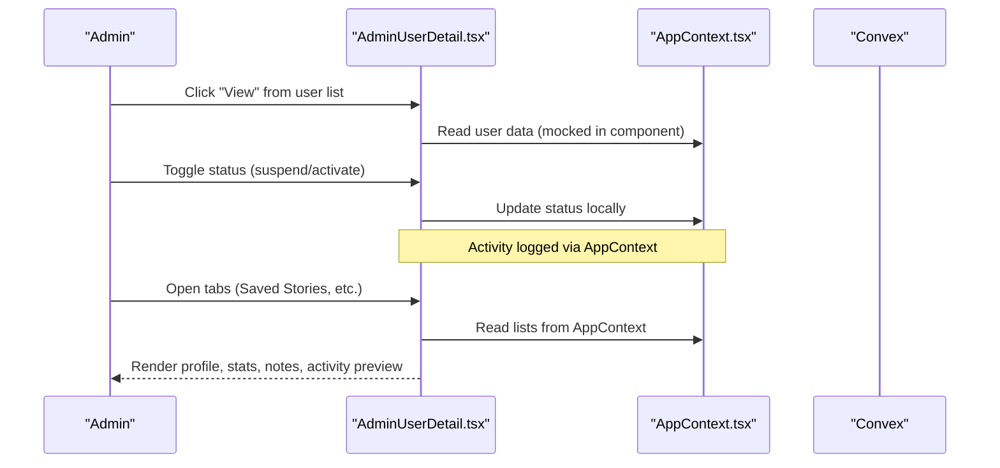
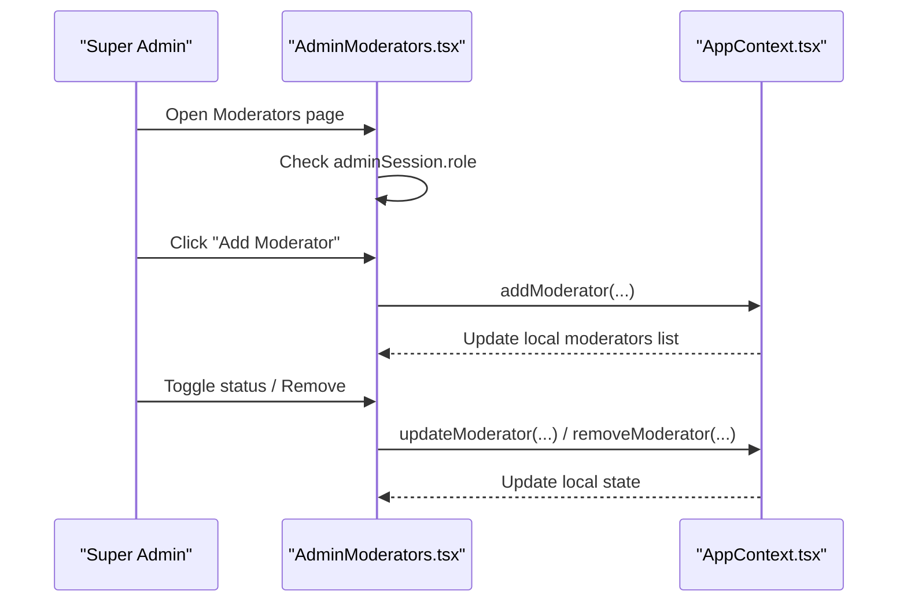
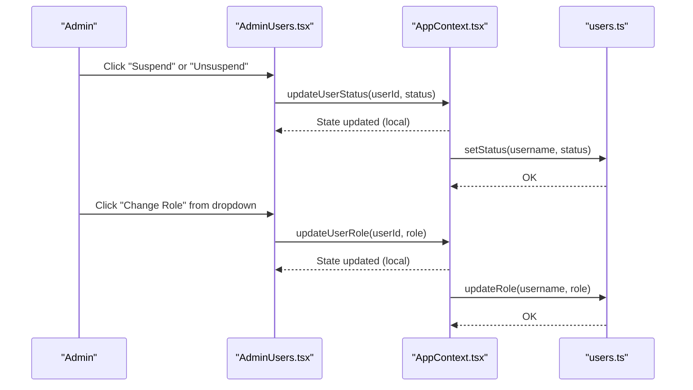
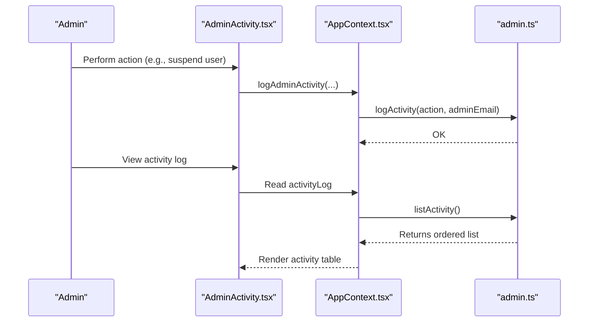
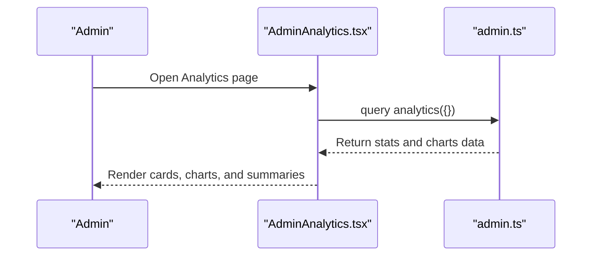
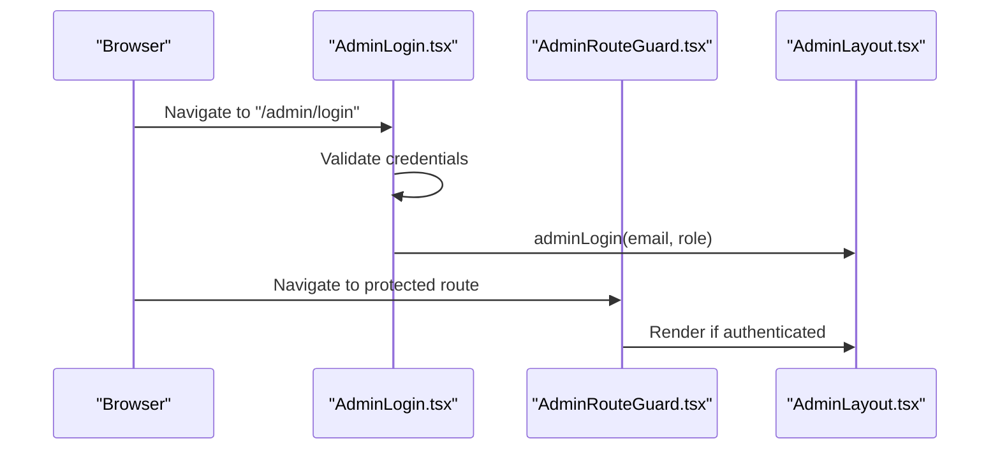
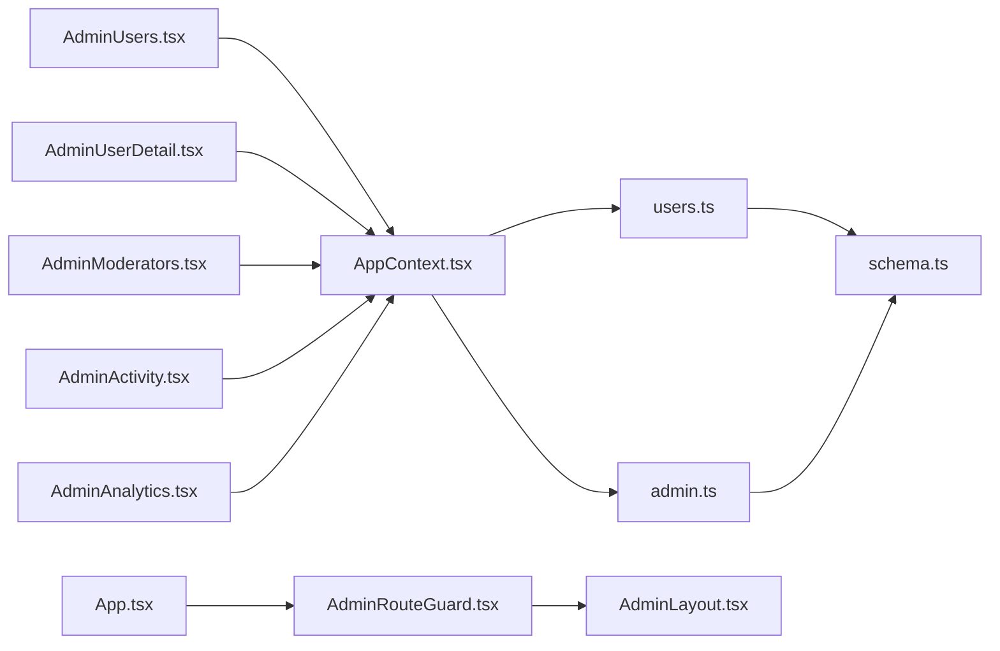

# User Management

<cite>
**Referenced Files in This Document**
- [AdminUsers.tsx](file://src/screens/admin/AdminUsers.tsx)
- [AdminUserDetail.tsx](file://src/screens/admin/details/AdminUserDetail.tsx)
- [AdminModerators.tsx](file://src/screens/admin/AdminModerators.tsx)
- [AdminActivity.tsx](file://src/screens/admin/AdminActivity.tsx)
- [AdminAnalytics.tsx](file://src/screens/admin/AdminAnalytics.tsx)
- [AdminLayout.tsx](file://src/components/admin/AdminLayout.tsx)
- [AdminRouteGuard.tsx](file://src/components/admin/AdminRouteGuard.tsx)
- [AdminLogin.tsx](file://src/screens/admin/AdminLogin.tsx)
- [AppContext.tsx](file://src/contexts/AppContext.tsx)
- [users.ts](file://convex/users.ts)
- [admin.ts](file://convex/admin.ts)
- [schema.ts](file://convex/schema.ts)
- [App.tsx](file://src/App.tsx)
</cite>

## Table of Contents
1. [Introduction](#introduction)
2. [Project Structure](#project-structure)
3. [Core Components](#core-components)
4. [Architecture Overview](#architecture-overview)
5. [Detailed Component Analysis](#detailed-component-analysis)
6. [Dependency Analysis](#dependency-analysis)
7. [Performance Considerations](#performance-considerations)
8. [Troubleshooting Guide](#troubleshooting-guide)
9. [Conclusion](#conclusion)

## Introduction
This document describes the administrative user management system for Lemonade, focusing on the admin UI for listing and searching users, filtering by account status and roles, viewing user details, managing moderators, performing account actions (suspend/unsuspend/role changes), and leveraging analytics and activity logging for platform oversight. It explains how frontend screens integrate with backend Convex functions to provide a complete administrative toolkit.

## Project Structure
The admin user management feature spans React screens, a shared admin layout, route guards, and backend Convex queries and mutations. Routes are defined in the main routing file and wrapped with an admin guard and layout.

**Diagram sources**
- [App.tsx:202-248](file://src/App.tsx#L202-L248)
- [AdminLayout.tsx:34-52](file://src/components/admin/AdminLayout.tsx#L34-L52)
- [AdminRouteGuard.tsx:10-23](file://src/components/admin/AdminRouteGuard.tsx#L10-L23)
- [AdminUsers.tsx:23-265](file://src/screens/admin/AdminUsers.tsx#L23-L265)
- [AdminUserDetail.tsx:24-233](file://src/screens/admin/details/AdminUserDetail.tsx#L24-L233)
- [AdminModerators.tsx:20-192](file://src/screens/admin/AdminModerators.tsx#L20-L192)
- [AdminActivity.tsx:68-206](file://src/screens/admin/AdminActivity.tsx#L68-L206)
- [AdminAnalytics.tsx:35-227](file://src/screens/admin/AdminAnalytics.tsx#L35-L227)
- [AppContext.tsx:509-601](file://src/contexts/AppContext.tsx#L509-L601)
- [users.ts:15-20](file://convex/users.ts#L15-L20)
- [admin.ts:31-64](file://convex/admin.ts#L31-L64)
- [schema.ts:24-67](file://convex/schema.ts#L24-L67)

**Section sources**
- [App.tsx:202-248](file://src/App.tsx#L202-L248)
- [AdminLayout.tsx:34-52](file://src/components/admin/AdminLayout.tsx#L34-L52)
- [AdminRouteGuard.tsx:10-23](file://src/components/admin/AdminRouteGuard.tsx#L10-L23)

## Core Components
- AdminUsers: Lists users with search and filters, and quick actions (suspend/unsuspend, change role, view activity).
- AdminUserDetail: Shows user profile, stats, admin notes, recent activity preview, and tabs for saved stories/history.
- AdminModerators: Manages moderators (add/remove/update) with role assignment and status toggles; restricted to super admins.
- AdminActivity: Displays administrative activity log with search and filters; supports export.
- AdminAnalytics: Renders platform analytics including user growth, reads, premium subscribers, revenue, and charts.
- AdminLayout: Provides the admin sidebar navigation, header, and mobile drawer; integrates with Convex for counts.
- AdminRouteGuard: Protects routes and restricts access to super admins when needed.
- AppContext: Centralizes admin state (session, moderators, users, reports, activity log), exposes actions, and loads live data from Convex.
- Backend (Convex): Implements user listing, status/role updates, analytics, activity logging, and schema for users and moderators.

**Section sources**
- [AdminUsers.tsx:23-265](file://src/screens/admin/AdminUsers.tsx#L23-L265)
- [AdminUserDetail.tsx:24-233](file://src/screens/admin/details/AdminUserDetail.tsx#L24-L233)
- [AdminModerators.tsx:20-192](file://src/screens/admin/AdminModerators.tsx#L20-L192)
- [AdminActivity.tsx:68-206](file://src/screens/admin/AdminActivity.tsx#L68-L206)
- [AdminAnalytics.tsx:35-227](file://src/screens/admin/AdminAnalytics.tsx#L35-L227)
- [AdminLayout.tsx:56-94](file://src/components/admin/AdminLayout.tsx#L56-L94)
- [AdminRouteGuard.tsx:10-23](file://src/components/admin/AdminRouteGuard.tsx#L10-L23)
- [AppContext.tsx:509-601](file://src/contexts/AppContext.tsx#L509-L601)
- [users.ts:15-20](file://convex/users.ts#L15-L20)
- [admin.ts:31-64](file://convex/admin.ts#L31-L64)
- [schema.ts:24-67](file://convex/schema.ts#L24-L67)

## Architecture Overview
The admin UI is routed through a guard and layout, then renders feature-specific screens. These screens rely on AppContext for state and actions, which call Convex functions for persistence and analytics. The Convex schema defines the data model for users and moderators.

**Diagram sources**
- [App.tsx:211-217](file://src/App.tsx#L211-L217)
- [AdminRouteGuard.tsx:10-23](file://src/components/admin/AdminRouteGuard.tsx#L10-L23)
- [AdminLayout.tsx:56-94](file://src/components/admin/AdminLayout.tsx#L56-L94)
- [AdminUsers.tsx:23-265](file://src/screens/admin/AdminUsers.tsx#L23-L265)
- [AppContext.tsx:509-601](file://src/contexts/AppContext.tsx#L509-L601)
- [users.ts:15-20](file://convex/users.ts#L15-L20)
- [users.ts:113-127](file://convex/users.ts#L113-L127)
- [users.ts:92-111](file://convex/users.ts#L92-L111)

## Detailed Component Analysis

### User Listing and Search
- Search: Text input filters by name, username, or email across all users.
- Filters: Buttons for “all”, “readers”, “creators”, “premium”, “suspended”.
- Table/Mobile grid: Displays user avatar/name/username, role badge, premium status, wallet balance, and status indicator.
- Actions per row: View details, suspend/unsuspend toggle, dropdown menu to change role and view activity.

**Diagram sources**
- [AdminUsers.tsx:23-84](file://src/screens/admin/AdminUsers.tsx#L23-L84)
- [AdminUsers.tsx:86-203](file://src/screens/admin/AdminUsers.tsx#L86-L203)
- [AdminUsers.tsx:205-265](file://src/screens/admin/AdminUsers.tsx#L205-L265)
- [AppContext.tsx:737-745](file://src/contexts/AppContext.tsx#L737-L745)

**Section sources**
- [AdminUsers.tsx:23-265](file://src/screens/admin/AdminUsers.tsx#L23-L265)
- [AppContext.tsx:737-745](file://src/contexts/AppContext.tsx#L737-L745)

### User Detail View
- Back navigation and suspend/activate controls.
- Profile card: avatar, username, email, status badge, role badge, and link to public profile.
- Quick stats: wallet balance, premium status, join date.
- Admin notes: editable textarea and add note button.
- Recent activity preview: list of recent actions with dates.
- Tabs: Saved Stories, Reading History, Support History, Unlock History, Followed Creators.

**Diagram sources**
- [AdminUserDetail.tsx:24-233](file://src/screens/admin/details/AdminUserDetail.tsx#L24-L233)
- [AppContext.tsx:727-735](file://src/contexts/AppContext.tsx#L727-L735)

**Section sources**
- [AdminUserDetail.tsx:24-233](file://src/screens/admin/details/AdminUserDetail.tsx#L24-L233)

### Moderator Management
- Access restriction: Only super admins can manage moderators.
- Add moderator: Modal form to enter name, email, and role (moderator, content reviewer, payment reviewer); defaults to active status.
- List: Cards showing moderator avatar, name, role badge, and email; inline controls to activate/deactivate and remove.
- Actions: Add, remove, update status; all logged via AppContext.

**Diagram sources**
- [AdminModerators.tsx:20-192](file://src/screens/admin/AdminModerators.tsx#L20-L192)
- [AppContext.tsx:752-770](file://src/contexts/AppContext.tsx#L752-L770)

**Section sources**
- [AdminModerators.tsx:20-192](file://src/screens/admin/AdminModerators.tsx#L20-L192)
- [AppContext.tsx:752-770](file://src/contexts/AppContext.tsx#L752-L770)

### Account Actions: Suspension, Role Changes, Privileges
- Suspension: Toggle between active and suspended directly from the user list; updates local state and logs activity.
- Role changes: Dropdown menu allows changing a user’s role; updates local state and logs activity.
- Privilege modifications: Role changes are persisted via Convex mutation; backend enforces role values.

**Diagram sources**
- [AdminUsers.tsx:155-171](file://src/screens/admin/AdminUsers.tsx#L155-L171)
- [AdminUsers.tsx:178-187](file://src/screens/admin/AdminUsers.tsx#L178-L187)
- [AppContext.tsx:737-745](file://src/contexts/AppContext.tsx#L737-L745)
- [users.ts:113-127](file://convex/users.ts#L113-L127)
- [users.ts:92-111](file://convex/users.ts#L92-L111)

**Section sources**
- [AdminUsers.tsx:155-194](file://src/screens/admin/AdminUsers.tsx#L155-L194)
- [AppContext.tsx:737-745](file://src/contexts/AppContext.tsx#L737-L745)
- [users.ts:92-127](file://convex/users.ts#L92-L127)

### Activity Logging and Oversight
- Activity log screen: Search by admin, target, or action; filter by time window; export log.
- Backend activity logging: AppContext logs administrative actions; Convex stores and retrieves admin activity.

**Diagram sources**
- [AdminActivity.tsx:68-206](file://src/screens/admin/AdminActivity.tsx#L68-L206)
- [AppContext.tsx:727-735](file://src/contexts/AppContext.tsx#L727-L735)
- [admin.ts:225-244](file://convex/admin.ts#L225-L244)

**Section sources**
- [AdminActivity.tsx:68-206](file://src/screens/admin/AdminActivity.tsx#L68-L206)
- [AppContext.tsx:727-735](file://src/contexts/AppContext.tsx#L727-L735)
- [admin.ts:225-244](file://convex/admin.ts#L225-L244)

### Analytics and Reporting
- Live analytics dashboard: User growth, story reads, premium subscribers, total revenue, monthly reading activity chart, revenue summary, top stories, and conversion rate.
- Data source: Convex analytics query aggregates users, stories, reading history, and wallet transactions.

**Diagram sources**
- [AdminAnalytics.tsx:35-227](file://src/screens/admin/AdminAnalytics.tsx#L35-L227)
- [admin.ts:66-128](file://convex/admin.ts#L66-L128)

**Section sources**
- [AdminAnalytics.tsx:35-227](file://src/screens/admin/AdminAnalytics.tsx#L35-L227)
- [admin.ts:66-128](file://convex/admin.ts#L66-L128)

### Admin Login and Route Protection
- Admin login: Simple form with hardcoded credentials; sets admin session and persists it.
- Route protection: Guards routes and restricts access to super admins when required.

**Diagram sources**
- [AdminLogin.tsx:7-129](file://src/screens/admin/AdminLogin.tsx#L7-L129)
- [AdminRouteGuard.tsx:10-23](file://src/components/admin/AdminRouteGuard.tsx#L10-L23)
- [AdminLayout.tsx:56-94](file://src/components/admin/AdminLayout.tsx#L56-L94)

**Section sources**
- [AdminLogin.tsx:7-129](file://src/screens/admin/AdminLogin.tsx#L7-L129)
- [AdminRouteGuard.tsx:10-23](file://src/components/admin/AdminRouteGuard.tsx#L10-L23)
- [AdminLayout.tsx:56-94](file://src/components/admin/AdminLayout.tsx#L56-L94)

## Dependency Analysis
- Frontend screens depend on AppContext for state and actions.
- AppContext depends on Convex for data loading and mutations.
- Convex schema defines the users and moderators collections and indexes used by queries and mutations.
- Routing enforces admin-only access and wraps screens in the admin layout.

**Diagram sources**
- [AdminUsers.tsx:23-265](file://src/screens/admin/AdminUsers.tsx#L23-L265)
- [AdminUserDetail.tsx:24-233](file://src/screens/admin/details/AdminUserDetail.tsx#L24-L233)
- [AdminModerators.tsx:20-192](file://src/screens/admin/AdminModerators.tsx#L20-L192)
- [AdminActivity.tsx:68-206](file://src/screens/admin/AdminActivity.tsx#L68-L206)
- [AdminAnalytics.tsx:35-227](file://src/screens/admin/AdminAnalytics.tsx#L35-L227)
- [AppContext.tsx:509-601](file://src/contexts/AppContext.tsx#L509-L601)
- [users.ts:15-20](file://convex/users.ts#L15-L20)
- [admin.ts:31-64](file://convex/admin.ts#L31-L64)
- [schema.ts:24-67](file://convex/schema.ts#L24-L67)
- [App.tsx:202-248](file://src/App.tsx#L202-L248)
- [AdminRouteGuard.tsx:10-23](file://src/components/admin/AdminRouteGuard.tsx#L10-L23)
- [AdminLayout.tsx:56-94](file://src/components/admin/AdminLayout.tsx#L56-L94)

**Section sources**
- [App.tsx:202-248](file://src/App.tsx#L202-L248)
- [AppContext.tsx:509-601](file://src/contexts/AppContext.tsx#L509-L601)
- [users.ts:15-20](file://convex/users.ts#L15-L20)
- [admin.ts:31-64](file://convex/admin.ts#L31-L64)
- [schema.ts:24-67](file://convex/schema.ts#L24-L67)

## Performance Considerations
- Data fetching: AppContext loads users, reports, activity, and moderators on mount and periodically; consider debouncing frequent updates and optimizing queries.
- Rendering: Large user lists benefit from virtualization; current implementation uses standard tables/grids suitable for moderate scales.
- Analytics: Chart rendering depends on computed arrays; precompute aggregates on the backend when possible.
- Network: Batch operations where feasible; avoid redundant Convex calls by caching results in AppContext.

## Troubleshooting Guide
- Authentication issues:
  - Verify admin login credentials and session persistence.
  - Check admin session state and localStorage persistence.
- Route protection:
  - Ensure AdminRouteGuard redirects unauthenticated users to login and restricts super-admin-only pages.
- Data not updating:
  - Confirm periodic refresh intervals and that AppContext is calling Convex queries.
  - Validate that mutations (setStatus, updateRole) are invoked and that state updates occur.
- Activity log missing:
  - Ensure logAdminActivity is called on relevant actions and that listActivity is queried.

**Section sources**
- [AdminLogin.tsx:7-129](file://src/screens/admin/AdminLogin.tsx#L7-L129)
- [AdminRouteGuard.tsx:10-23](file://src/components/admin/AdminRouteGuard.tsx#L10-L23)
- [AppContext.tsx:696-702](file://src/contexts/AppContext.tsx#L696-L702)
- [AppContext.tsx:727-735](file://src/contexts/AppContext.tsx#L727-L735)
- [admin.ts:225-244](file://convex/admin.ts#L225-L244)

## Conclusion
The Lemonade admin user management system combines a robust admin UI with backend Convex functions to provide comprehensive oversight and control. Administrators can search and filter users, inspect profiles, manage moderators, perform account actions, monitor activity, and analyze platform metrics. The modular architecture ensures clear separation of concerns, while AppContext centralizes state and integrates seamlessly with Convex for reliable persistence and analytics.