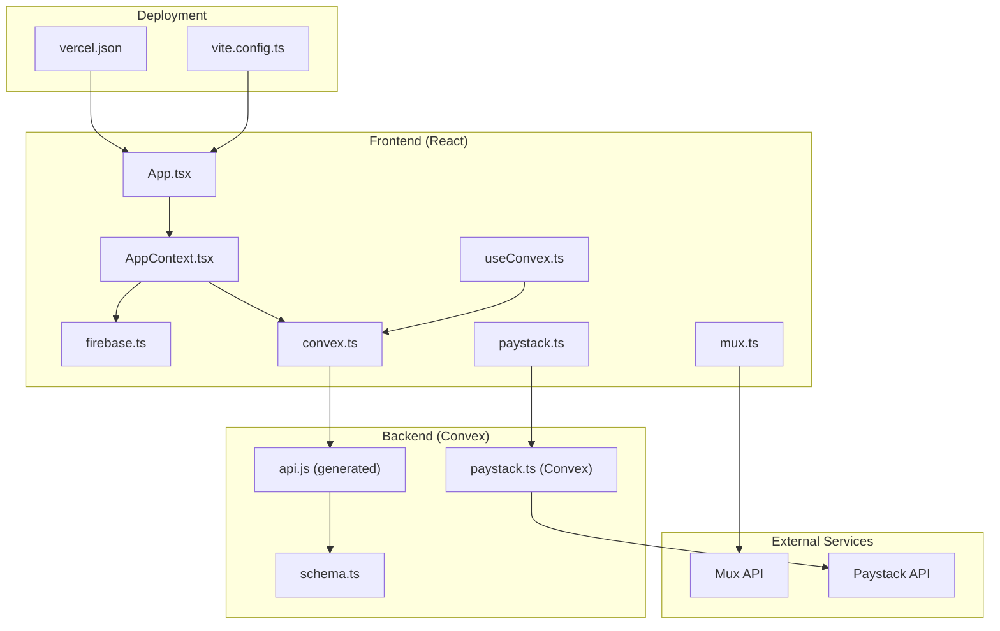
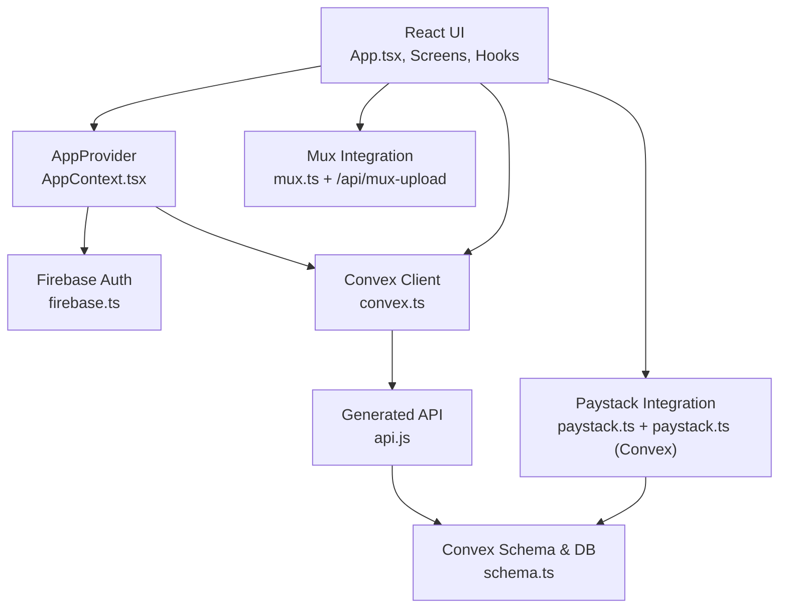
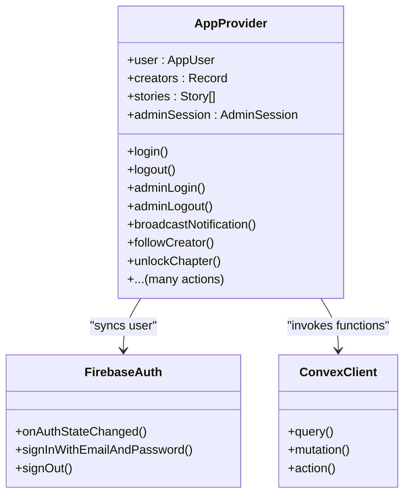
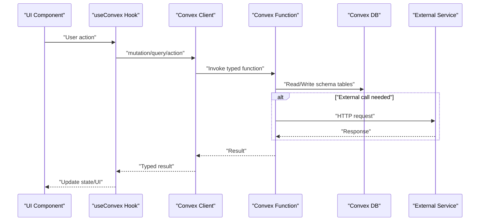
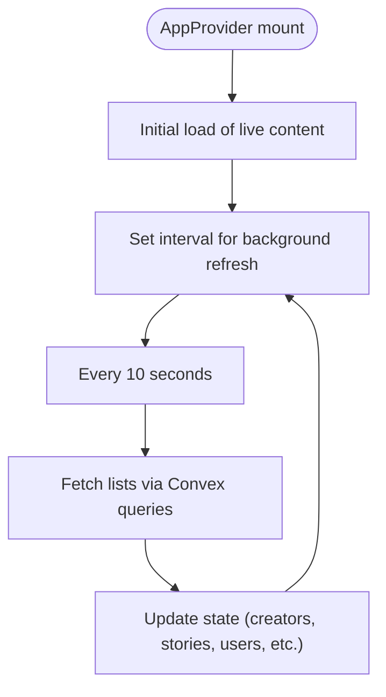
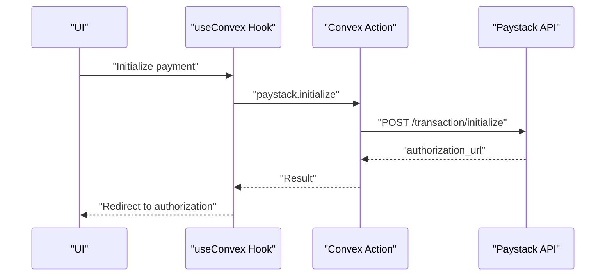
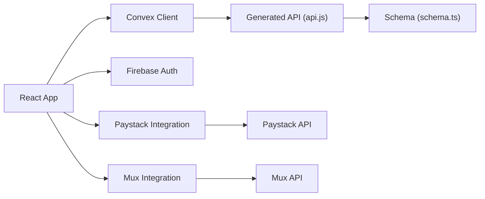

# Architecture Overview

<cite>
**Referenced Files in This Document**
- [App.tsx](file://src/App.tsx)
- [AppContext.tsx](file://src/contexts/AppContext.tsx)
- [firebase.ts](file://src/lib/firebase.ts)
- [convex.ts](file://src/lib/convex.ts)
- [schema.ts](file://convex/schema.ts)
- [api.js](file://convex/_generated/api.js)
- [mux.ts](file://src/lib/mux.ts)
- [paystack.ts](file://src/lib/paystack.ts)
- [useConvex.ts](file://src/hooks/useConvex.ts)
- [mux-upload.ts](file://api/mux-upload.ts)
- [CreatorDashboard.tsx](file://src/screens/CreatorDashboard.tsx)
- [vercel.json](file://vercel.json)
- [vite.config.ts](file://vite.config.ts)
- [package.json](file://package.json)
</cite>

## Table of Contents
1. [Introduction](#introduction)
2. [Project Structure](#project-structure)
3. [Core Components](#core-components)
4. [Architecture Overview](#architecture-overview)
5. [Detailed Component Analysis](#detailed-component-analysis)
6. [Dependency Analysis](#dependency-analysis)
7. [Performance Considerations](#performance-considerations)
8. [Troubleshooting Guide](#troubleshooting-guide)
9. [Conclusion](#conclusion)
10. [Appendices](#appendices)

## Introduction
This document describes the Lemonade platform’s system design. It covers the React frontend integrated with Convex backend, Firebase authentication, and external service integrations (Mux for video and Paystack for payments). It documents the Provider pattern used in AppContext.tsx for centralized state management, the data flow from user interactions through Convex functions to database operations and external services, and the real-time capabilities enabled by Convex subscriptions. It also outlines system boundaries, technology stack decisions, scalability considerations, and deployment topology for development and production.

## Project Structure
The project is organized into:
- Frontend (React + Vite): Routing, UI components, hooks, and integration libraries
- Backend (Convex): Schema, server-side functions, and generated API bindings
- Integrations: Mux and Paystack via Convex actions and a small API route
- Deployment: Vercel configuration and build pipeline

**Diagram sources**
- [App.tsx:1-375](file://src/App.tsx#L1-L375)
- [AppContext.tsx:1-800](file://src/contexts/AppContext.tsx#L1-L800)
- [firebase.ts:1-55](file://src/lib/firebase.ts#L1-L55)
- [convex.ts:1-12](file://src/lib/convex.ts#L1-L12)
- [mux.ts:1-66](file://src/lib/mux.ts#L1-L66)
- [paystack.ts:1-115](file://src/lib/paystack.ts#L1-L115)
- [useConvex.ts:1-213](file://src/hooks/useConvex.ts#L1-L213)
- [schema.ts:1-493](file://convex/schema.ts#L1-L493)
- [api.js:1-24](file://convex/_generated/api.js#L1-L24)
- [mux-upload.ts:1-45](file://api/mux-upload.ts#L1-L45)
- [vercel.json:1-27](file://vercel.json#L1-L27)
- [vite.config.ts:1-37](file://vite.config.ts#L1-L37)

**Section sources**
- [App.tsx:1-375](file://src/App.tsx#L1-L375)
- [vite.config.ts:1-37](file://vite.config.ts#L1-L37)
- [vercel.json:1-27](file://vercel.json#L1-L27)

## Core Components
- React Router and routing: Centralized routes and nested layouts in App.tsx
- AppProvider (Provider pattern): Manages global state, authentication, and live content synchronization
- Firebase integration: Authentication and persistence with optional emulators
- Convex client: Typed API access to server functions and database
- External integrations: Mux for video uploads/playback and Paystack for payments via Convex actions

Key responsibilities:
- AppContext orchestrates authentication, user profile sync, persisted sessions, and live content refresh
- useConvex exposes typed hooks for queries, mutations, and actions
- Integrations encapsulate environment-specific configuration and error normalization

**Section sources**
- [App.tsx:83-374](file://src/App.tsx#L83-L374)
- [AppContext.tsx:509-800](file://src/contexts/AppContext.tsx#L509-L800)
- [firebase.ts:12-55](file://src/lib/firebase.ts#L12-L55)
- [convex.ts:1-12](file://src/lib/convex.ts#L1-L12)
- [useConvex.ts:1-213](file://src/hooks/useConvex.ts#L1-L213)
- [mux.ts:15-66](file://src/lib/mux.ts#L15-L66)
- [paystack.ts:24-115](file://src/lib/paystack.ts#L24-L115)

## Architecture Overview
The system follows a client-driven architecture:
- Frontend (React) renders UI and manages user state
- AppProvider coordinates Firebase auth and Convex data
- Convex enforces data modeling, runs server functions, and persists to the database
- External services are accessed via Convex actions or lightweight API routes

System boundaries:
- Frontend boundary: React components and hooks
- Backend boundary: Convex server functions and schema
- External boundary: Mux and Paystack APIs

**Diagram sources**
- [App.tsx:1-375](file://src/App.tsx#L1-L375)
- [AppContext.tsx:1-800](file://src/contexts/AppContext.tsx#L1-L800)
- [firebase.ts:1-55](file://src/lib/firebase.ts#L1-L55)
- [convex.ts:1-12](file://src/lib/convex.ts#L1-L12)
- [api.js:1-24](file://convex/_generated/api.js#L1-L24)
- [schema.ts:1-493](file://convex/schema.ts#L1-L493)
- [mux.ts:1-66](file://src/lib/mux.ts#L1-L66)
- [mux-upload.ts:1-45](file://api/mux-upload.ts#L1-L45)
- [paystack.ts:1-115](file://src/lib/paystack.ts#L1-L115)

## Detailed Component Analysis

### Provider Pattern and Centralized State Management
AppProvider implements a central state container:
- Authentication: Firebase onAuthStateChanged listener, guest fallback, persisted sessions
- Live content: Periodic refresh of creators, stories, applications, users, reports, activity, and moderators
- Admin session: Local persistence for admin login state
- User actions: CRUD-like operations delegated to Convex functions via typed hooks

**Diagram sources**
- [AppContext.tsx:509-800](file://src/contexts/AppContext.tsx#L509-L800)
- [firebase.ts:25-29](file://src/lib/firebase.ts#L25-L29)
- [convex.ts:1-12](file://src/lib/convex.ts#L1-L12)

**Section sources**
- [AppContext.tsx:509-800](file://src/contexts/AppContext.tsx#L509-L800)

### Data Flow: From User Interactions to Database and External Services
Typical flow for a user-initiated action:
1. UI triggers a hook (e.g., useConvex.ts) or context action (AppContext.tsx)
2. Hook/Action calls Convex mutation/action (typed via api.js)
3. Convex function executes server logic, reads/writes schema-defined tables
4. External service calls (e.g., Paystack or Mux) are invoked from Convex actions or API routes
5. UI receives updated data via Convex queries or periodic refresh

**Diagram sources**
- [useConvex.ts:163-213](file://src/hooks/useConvex.ts#L163-L213)
- [api.js:11-24](file://convex/_generated/api.js#L11-L24)
- [schema.ts:24-493](file://convex/schema.ts#L24-L493)
- [paystack.ts:5-71](file://src/lib/paystack.ts#L5-L71)
- [mux-upload.ts:8-44](file://api/mux-upload.ts#L8-L44)

**Section sources**
- [useConvex.ts:1-213](file://src/hooks/useConvex.ts#L1-L213)
- [paystack.ts:56-84](file://src/lib/paystack.ts#L56-L84)
- [mux-upload.ts:1-45](file://api/mux-upload.ts#L1-L45)

### Real-Time Capabilities and Lifecycle Integration
- Live content refresh: AppProvider periodically queries lists of creators, stories, applications, users, reports, activity, and moderators
- Background refresh interval ensures near-real-time updates without subscriptions
- UI components can opt-in to subscribe to specific data sets via Convex hooks (when implemented)

**Diagram sources**
- [AppContext.tsx:525-601](file://src/contexts/AppContext.tsx#L525-L601)

**Section sources**
- [AppContext.tsx:525-601](file://src/contexts/AppContext.tsx#L525-L601)

### External Service Integrations
- Mux: Public token validation and upload URL creation via a Vercel-compatible API route; playback URLs constructed client-side
- Paystack: Payment initialization and verification executed via Convex actions using environment secrets

**Diagram sources**
- [useConvex.ts:65-109](file://src/hooks/useConvex.ts#L65-L109)
- [paystack.ts:5-71](file://src/lib/paystack.ts#L5-L71)

**Section sources**
- [mux.ts:15-66](file://src/lib/mux.ts#L15-L66)
- [mux-upload.ts:1-45](file://api/mux-upload.ts#L1-L45)
- [paystack.ts:24-115](file://src/lib/paystack.ts#L24-L115)

### Technology Stack Decisions
- React + Vite: Modern, fast build toolchain with strong DX
- Convex: Full-stack framework with typed server functions, schema enforcement, and built-in auth integration
- Firebase: Authentication and optional local persistence/emulators
- Mux: Direct upload and playback infrastructure for video
- Paystack: Payment processing with server-side secret management via Convex

These choices enable:
- Strong typing across client and server
- Rapid iteration with Convex’s dev model
- Secure handling of sensitive keys (Paystack secret in Convex environment)
- Scalable, serverless backend

**Section sources**
- [package.json:14-31](file://package.json#L14-L31)
- [schema.ts:1-493](file://convex/schema.ts#L1-L493)
- [firebase.ts:12-55](file://src/lib/firebase.ts#L12-L55)
- [paystack.ts:15-18](file://src/lib/paystack.ts#L15-L18)

## Dependency Analysis
High-level dependencies:
- Frontend depends on Convex client and generated API
- Convex functions depend on schema-defined tables
- Integrations depend on environment variables and external APIs
- Build/deployment depends on Vite and Vercel configurations

**Diagram sources**
- [api.js:11-24](file://convex/_generated/api.js#L11-L24)
- [schema.ts:1-493](file://convex/schema.ts#L1-L493)
- [firebase.ts:12-55](file://src/lib/firebase.ts#L12-L55)
- [mux.ts:15-66](file://src/lib/mux.ts#L15-L66)
- [paystack.ts:5-71](file://src/lib/paystack.ts#L5-L71)

**Section sources**
- [api.js:11-24](file://convex/_generated/api.js#L11-L24)
- [schema.ts:1-493](file://convex/schema.ts#L1-L493)
- [firebase.ts:12-55](file://src/lib/firebase.ts#L12-L55)
- [mux.ts:15-66](file://src/lib/mux.ts#L15-L66)
- [paystack.ts:5-71](file://src/lib/paystack.ts#L5-L71)

## Performance Considerations
- Client-side caching: AppProvider caches live content and refreshes periodically to reduce network load
- Batched queries: Initial load uses Promise.all to minimize round-trips
- Lazy loading: UI components can defer heavy computations with useMemo
- Build optimization: Vite config splits vendor bundles and disables source maps in production
- Environment isolation: Secrets remain server-side (Paystack), reducing client overhead and risk

[No sources needed since this section provides general guidance]

## Troubleshooting Guide
Common issues and remedies:
- Convex URL not configured: The client logs a warning and disables Convex until VITE_CONVEX_URL is set
- Firebase emulator connectivity: Ensure emulator flags are enabled in development and ports match
- Mux credentials: Missing tokens cause runtime errors; verify environment variables and API route availability
- Paystack configuration: Missing secret key prevents payment actions; configure Convex environment variables

**Section sources**
- [convex.ts:5-7](file://src/lib/convex.ts#L5-L7)
- [firebase.ts:34-52](file://src/lib/firebase.ts#L34-L52)
- [mux.ts:18-23](file://src/lib/mux.ts#L18-L23)
- [paystack.ts:37-51](file://src/lib/paystack.ts#L37-L51)

## Conclusion
Lemonade’s architecture leverages a modern React frontend integrated with Convex for backend logic and data, Firebase for authentication, and external services for video and payments. The Provider pattern centralizes state and auth, while typed Convex functions enforce correctness and simplify integration. Periodic live content refresh provides near-real-time updates, and environment-based secrets protect sensitive integrations. The deployment topology integrates Vercel and Vite for efficient builds and hosting.

[No sources needed since this section summarizes without analyzing specific files]

## Appendices

### System Boundaries
- Frontend boundary: React components and hooks
- Backend boundary: Convex server functions and schema
- External boundary: Mux and Paystack APIs

**Section sources**
- [App.tsx:1-375](file://src/App.tsx#L1-L375)
- [schema.ts:1-493](file://convex/schema.ts#L1-L493)
- [mux.ts:15-66](file://src/lib/mux.ts#L15-L66)
- [paystack.ts:5-71](file://src/lib/paystack.ts#L5-L71)

### Deployment Topology
- Development: Vite dev server with optional Firebase emulators
- Production: Vercel static site with API rewrites and cache headers

**Section sources**
- [vite.config.ts:1-37](file://vite.config.ts#L1-L37)
- [vercel.json:1-27](file://vercel.json#L1-L27)