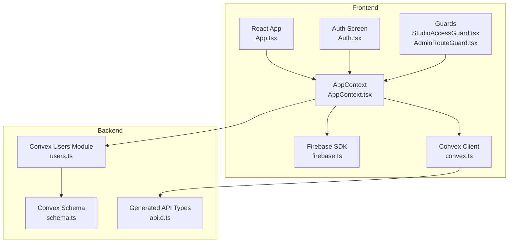
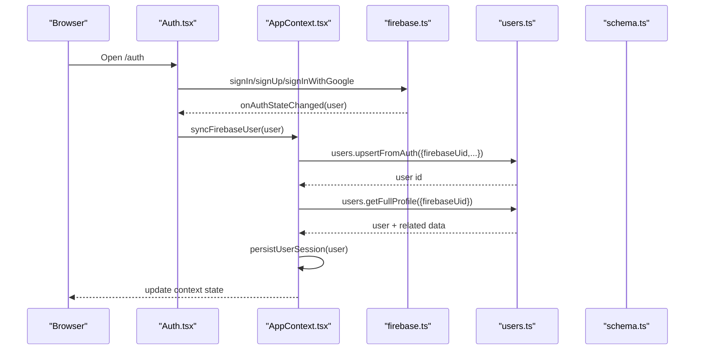
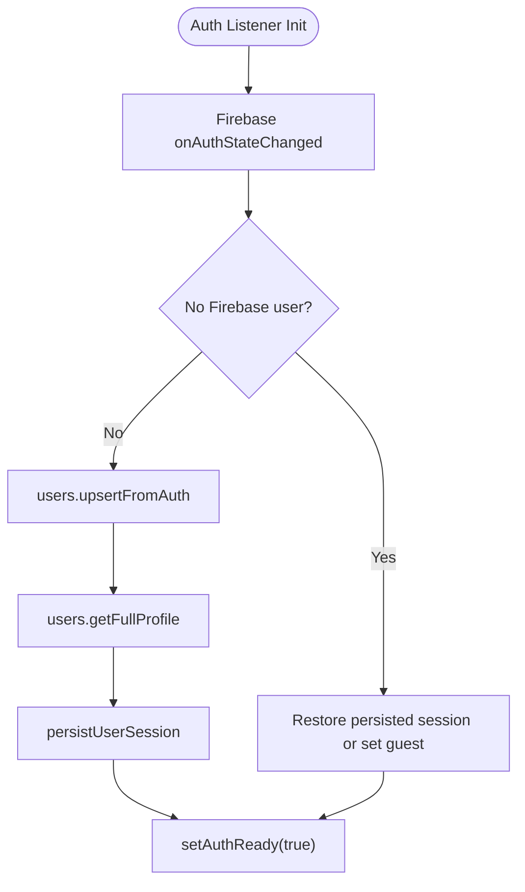
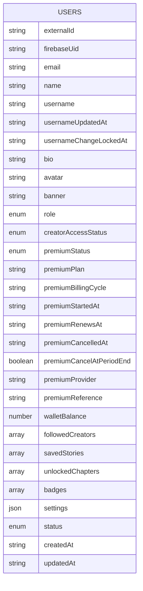
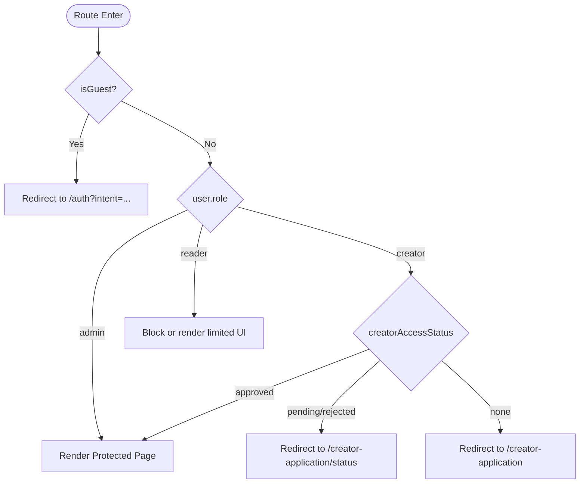
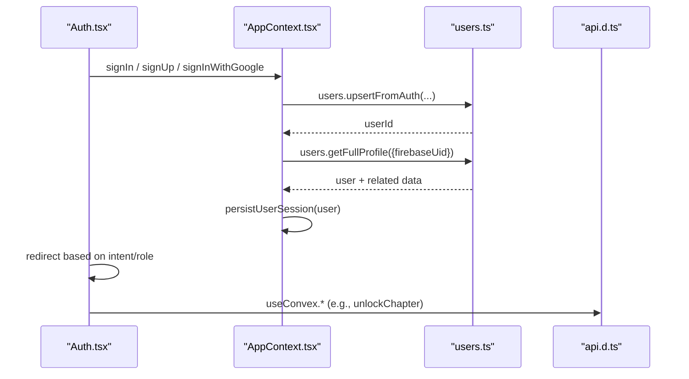
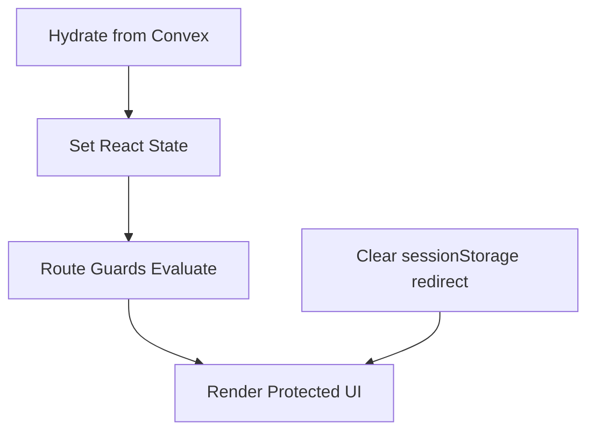
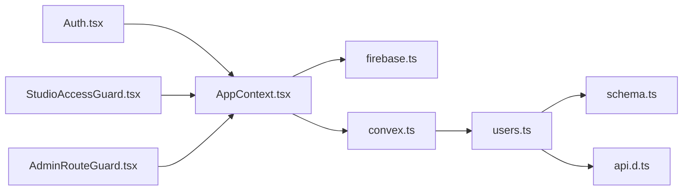

# Authentication Integration

<cite>
**Referenced Files in This Document**
- [AppContext.tsx](file://src/contexts/AppContext.tsx)
- [firebase.ts](file://src/lib/firebase.ts)
- [convex.ts](file://src/lib/convex.ts)
- [users.ts](file://convex/users.ts)
- [schema.ts](file://convex/schema.ts)
- [Auth.tsx](file://src/screens/Auth.tsx)
- [StudioAccessGuard.tsx](file://src/components/StudioAccessGuard.tsx)
- [AdminRouteGuard.tsx](file://src/components/admin/AdminRouteGuard.tsx)
- [useConvex.ts](file://src/hooks/useConvex.ts)
- [App.tsx](file://src/App.tsx)
- [main.tsx](file://src/main.tsx)
- [api.d.ts](file://convex/_generated/api.d.ts)
</cite>

## Table of Contents
1. [Introduction](#introduction)
2. [Project Structure](#project-structure)
3. [Core Components](#core-components)
4. [Architecture Overview](#architecture-overview)
5. [Detailed Component Analysis](#detailed-component-analysis)
6. [Dependency Analysis](#dependency-analysis)
7. [Performance Considerations](#performance-considerations)
8. [Troubleshooting Guide](#troubleshooting-guide)
9. [Conclusion](#conclusion)

## Introduction
This document explains the authentication integration between Firebase and Convex in the Lemonade application. It covers how Firebase authentication maps to Convex user records using externalId and firebaseUid fields, how user roles govern access, and how session persistence and real-time updates are handled. It also documents the end-to-end authentication flow from the React frontend through AppContext to backend Convex functions, and how role-based permissions influence UI and API access.

## Project Structure
Authentication spans three layers:
- Frontend React (Firebase SDK, Convex client, AppContext)
- Backend Convex (users module, schema, generated API)
- Routing and guards (navigation, route protection)

**Diagram sources**
- [App.tsx:1-375](file://src/App.tsx#L1-L375)
- [AppContext.tsx:1-800](file://src/contexts/AppContext.tsx#L1-L800)
- [Auth.tsx:1-334](file://src/screens/Auth.tsx#L1-L334)
- [StudioAccessGuard.tsx:1-36](file://src/components/StudioAccessGuard.tsx#L1-L36)
- [AdminRouteGuard.tsx:1-24](file://src/components/admin/AdminRouteGuard.tsx#L1-L24)
- [firebase.ts:1-55](file://src/lib/firebase.ts#L1-L55)
- [convex.ts:1-12](file://src/lib/convex.ts#L1-L12)
- [users.ts:1-360](file://convex/users.ts#L1-L360)
- [schema.ts:1-495](file://convex/schema.ts#L1-L495)
- [api.d.ts:1-78](file://convex/_generated/api.d.ts#L1-L78)

**Section sources**
- [App.tsx:1-375](file://src/App.tsx#L1-L375)
- [AppContext.tsx:1-800](file://src/contexts/AppContext.tsx#L1-L800)
- [firebase.ts:1-55](file://src/lib/firebase.ts#L1-L55)
- [convex.ts:1-12](file://src/lib/convex.ts#L1-L12)
- [users.ts:1-360](file://convex/users.ts#L1-L360)
- [schema.ts:1-495](file://convex/schema.ts#L1-L495)
- [api.d.ts:1-78](file://convex/_generated/api.d.ts#L1-L78)

## Core Components
- Firebase configuration and persistence: Initializes Firebase Auth, Firestore, Storage, and sets browser local persistence. Emulators are optionally connected in development.
- AppContext: Centralizes authentication state, user profile hydration, session persistence, and integration with Convex user creation/upsert.
- Convex users module: Upserts users from Firebase, normalizes usernames, enforces constraints, and exposes profile and role management functions.
- Guards: Protect routes based on authentication state, guest restrictions, and creator access status.
- Auth screen: Handles sign-in/sign-up, Google OAuth, password reset, and role selection.

Key integration points:
- Firebase onAuthStateChanged drives user synchronization with Convex.
- Convex users.upsertFromAuth creates or updates a user record with firebaseUid and role defaults.
- AppContext persists authenticated sessions to localStorage and restores them on startup.

**Section sources**
- [firebase.ts:1-55](file://src/lib/firebase.ts#L1-L55)
- [AppContext.tsx:509-712](file://src/contexts/AppContext.tsx#L509-L712)
- [users.ts:42-90](file://convex/users.ts#L42-L90)
- [schema.ts:24-67](file://convex/schema.ts#L24-L67)
- [Auth.tsx:12-134](file://src/screens/Auth.tsx#L12-L134)
- [StudioAccessGuard.tsx:9-36](file://src/components/StudioAccessGuard.tsx#L9-L36)
- [AdminRouteGuard.tsx:10-24](file://src/components/admin/AdminRouteGuard.tsx#L10-L24)

## Architecture Overview
The authentication flow connects Firebase Auth with Convex user records and React routing.

**Diagram sources**
- [Auth.tsx:12-134](file://src/screens/Auth.tsx#L12-L134)
- [AppContext.tsx:612-634](file://src/contexts/AppContext.tsx#L612-L634)
- [users.ts:42-90](file://convex/users.ts#L42-L90)
- [users.ts:149-181](file://convex/users.ts#L149-L181)
- [schema.ts:24-67](file://convex/schema.ts#L24-L67)

## Detailed Component Analysis

### Firebase Integration and Session Persistence
- Initializes Firebase app and services, sets browser local persistence, and optionally connects to emulators in development.
- AppContext listens to onAuthStateChanged, synchronizes the Firebase user with Convex, persists the session to localStorage, and restores it on reload.

**Diagram sources**
- [firebase.ts:25-29](file://src/lib/firebase.ts#L25-L29)
- [AppContext.tsx:650-694](file://src/contexts/AppContext.tsx#L650-L694)
- [AppContext.tsx:612-634](file://src/contexts/AppContext.tsx#L612-L634)
- [users.ts:42-90](file://convex/users.ts#L42-L90)
- [users.ts:149-181](file://convex/users.ts#L149-L181)

**Section sources**
- [firebase.ts:1-55](file://src/lib/firebase.ts#L1-L55)
- [AppContext.tsx:279-317](file://src/contexts/AppContext.tsx#L279-L317)
- [AppContext.tsx:650-694](file://src/contexts/AppContext.tsx#L650-L694)

### Convex User Model and Identity Mapping
- The users table stores both externalId and firebaseUid to support identity mapping from Firebase to Convex.
- Upsert logic creates a new user with role "reader" and default fields if none exists for the given firebaseUid; otherwise it patches existing fields.
- Username normalization and validation occur during profile updates.

**Diagram sources**
- [schema.ts:24-67](file://convex/schema.ts#L24-L67)

**Section sources**
- [schema.ts:24-67](file://convex/schema.ts#L24-L67)
- [users.ts:42-90](file://convex/users.ts#L42-L90)
- [users.ts:183-243](file://convex/users.ts#L183-L243)

### Role-Based Access Control (Permissions)
- Roles: guest, reader, creator, admin.
- Creator access gating: StudioAccessGuard enforces approved status for studio routes.
- Admin access: AdminRouteGuard protects admin routes and optionally restricts to super_admin.

**Diagram sources**
- [StudioAccessGuard.tsx:9-36](file://src/components/StudioAccessGuard.tsx#L9-L36)
- [AdminRouteGuard.tsx:10-24](file://src/components/admin/AdminRouteGuard.tsx#L10-L24)
- [AppContext.tsx:101-137](file://src/contexts/AppContext.tsx#L101-L137)

**Section sources**
- [StudioAccessGuard.tsx:9-36](file://src/components/StudioAccessGuard.tsx#L9-L36)
- [AdminRouteGuard.tsx:10-24](file://src/components/admin/AdminRouteGuard.tsx#L10-L24)
- [AppContext.tsx:101-137](file://src/contexts/AppContext.tsx#L101-L137)

### Authentication Flow: Frontend to Backend
- Auth.tsx handles sign-in/sign-up and Google OAuth, sets persistence, and redirects based on intent and role.
- AppContext.syncFirebaseUser invokes Convex mutations to upsert the user and fetch a full profile.
- useConvex hooks encapsulate Convex calls and pass firebaseUid where needed.

**Diagram sources**
- [Auth.tsx:60-134](file://src/screens/Auth.tsx#L60-L134)
- [AppContext.tsx:612-634](file://src/contexts/AppContext.tsx#L612-L634)
- [users.ts:42-90](file://convex/users.ts#L42-L90)
- [users.ts:149-181](file://convex/users.ts#L149-L181)
- [api.d.ts:59-62](file://convex/_generated/api.d.ts#L59-L62)

**Section sources**
- [Auth.tsx:12-134](file://src/screens/Auth.tsx#L12-L134)
- [AppContext.tsx:612-634](file://src/contexts/AppContext.tsx#L612-L634)
- [useConvex.ts:205-213](file://src/hooks/useConvex.ts#L205-L213)

### Real-Time Authentication Updates and UI Rendering
- AppContext hydrates user data from Convex and maintains it in React state.
- Routes and guards react to user state changes, enabling dynamic UI rendering and navigation decisions.
- The main.tsx clears a temporary redirect stored in sessionStorage to avoid stale redirects.

**Diagram sources**
- [AppContext.tsx:509-611](file://src/contexts/AppContext.tsx#L509-L611)
- [App.tsx:85-375](file://src/App.tsx#L85-L375)
- [main.tsx:7-11](file://src/main.tsx#L7-L11)

**Section sources**
- [AppContext.tsx:509-611](file://src/contexts/AppContext.tsx#L509-L611)
- [App.tsx:85-375](file://src/App.tsx#L85-L375)
- [main.tsx:7-11](file://src/main.tsx#L7-L11)

### Security Considerations
- Never trust client-provided identifiers; always derive identity server-side using the auth provider’s identity APIs.
- Prefer tokenIdentifier over subject for cross-provider identity stability.
- Avoid accepting userId arguments for authorization; always rederive identity inside backend functions.
- Use ConvexProviderWithAuth on the client when integrating external auth providers.

Note: The referenced guidelines emphasize server-side identity verification and provider-specific patterns. Apply similar principles when extending the current Firebase-based integration.

**Section sources**
- [api.d.ts:59-62](file://convex/_generated/api.d.ts#L59-L62)

## Dependency Analysis
- AppContext depends on Firebase SDK for auth state and on Convex client for user synchronization.
- Auth.tsx depends on AppContext actions and Firebase SDK for authentication methods.
- Guards depend on AppContext user state and creator access status.
- useConvex hooks depend on Convex client and expose typed references to Convex functions.

**Diagram sources**
- [Auth.tsx:12-134](file://src/screens/Auth.tsx#L12-L134)
- [StudioAccessGuard.tsx:9-36](file://src/components/StudioAccessGuard.tsx#L9-L36)
- [AdminRouteGuard.tsx:10-24](file://src/components/admin/AdminRouteGuard.tsx#L10-L24)
- [AppContext.tsx:1-800](file://src/contexts/AppContext.tsx#L1-L800)
- [firebase.ts:1-55](file://src/lib/firebase.ts#L1-L55)
- [convex.ts:1-12](file://src/lib/convex.ts#L1-L12)
- [users.ts:1-360](file://convex/users.ts#L1-L360)
- [schema.ts:1-495](file://convex/schema.ts#L1-L495)
- [api.d.ts:1-78](file://convex/_generated/api.d.ts#L1-L78)

**Section sources**
- [AppContext.tsx:1-800](file://src/contexts/AppContext.tsx#L1-L800)
- [users.ts:1-360](file://convex/users.ts#L1-L360)
- [schema.ts:1-495](file://convex/schema.ts#L1-L495)
- [api.d.ts:1-78](file://convex/_generated/api.d.ts#L1-L78)

## Performance Considerations
- Minimize repeated Convex calls by batching reads and caching hydrated user data in AppContext.
- Use indexes on firebaseUid and username to speed up lookups during sync.
- Debounce or coalesce frequent UI updates that trigger Convex mutations.

## Troubleshooting Guide
- Firebase persistence errors: Ensure browserLocalPersistence is set and emulators are disconnected in production.
- Auth state not restored: Check localStorage keys for explicit logout markers and persisted session validity.
- Convex URL missing: Confirm VITE_CONVEX_URL is set; otherwise Convex features are disabled.
- Role or access denied: Verify user role and creatorAccessStatus in the users table; ensure guards are applied to protected routes.

**Section sources**
- [firebase.ts:25-29](file://src/lib/firebase.ts#L25-L29)
- [AppContext.tsx:279-317](file://src/contexts/AppContext.tsx#L279-L317)
- [convex.ts:5-9](file://src/lib/convex.ts#L5-L9)
- [schema.ts:24-67](file://convex/schema.ts#L24-L67)

## Conclusion
The Lemonade app integrates Firebase authentication with Convex user records using externalId and firebaseUid fields. AppContext orchestrates session persistence, user synchronization, and real-time state updates. Guards enforce role-based access for studio and admin areas. Following the documented patterns ensures secure, maintainable authentication across the stack.