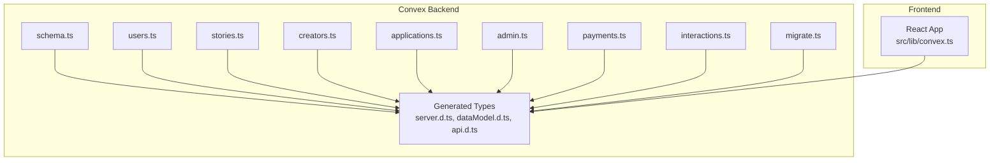
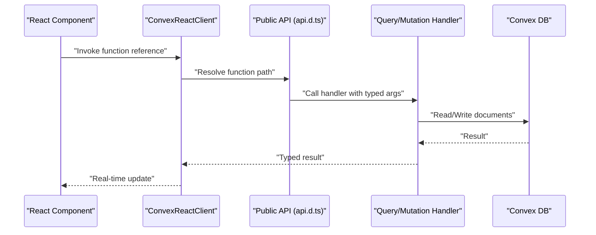
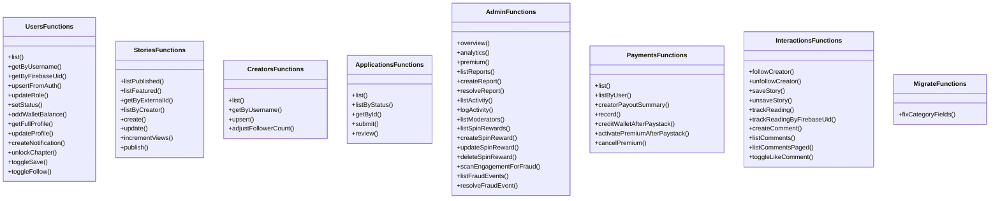
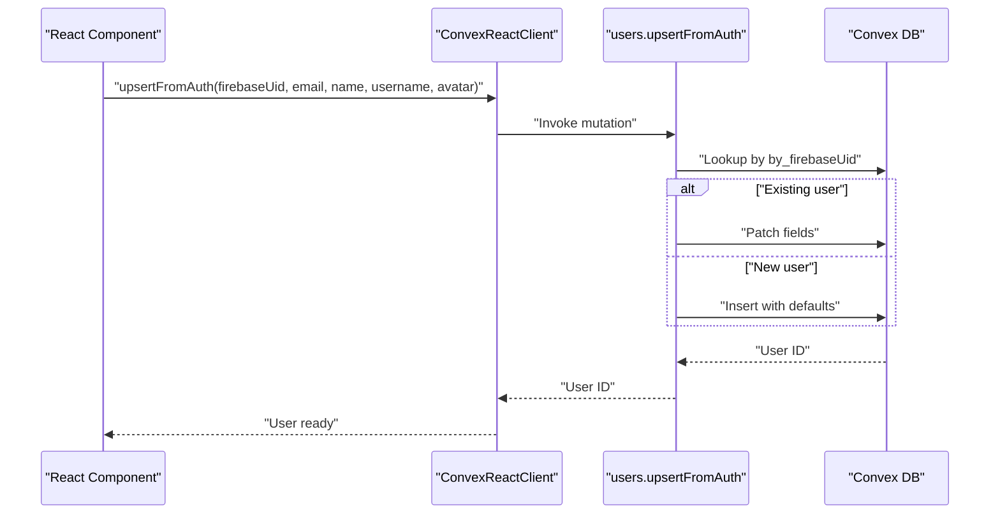
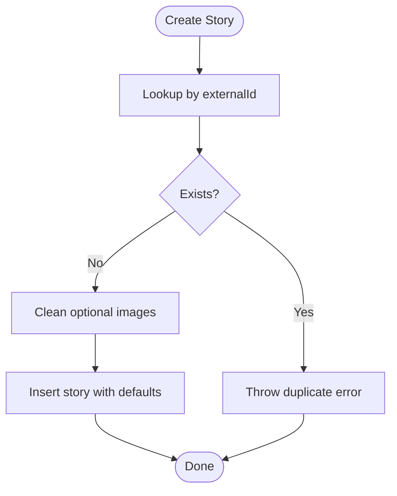
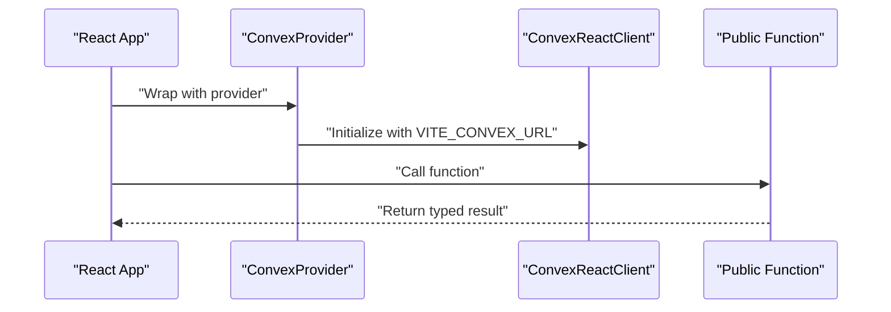
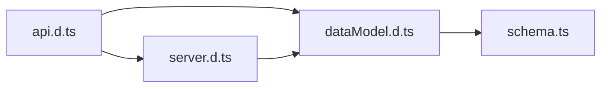

# Backend Architecture (Convex)

<cite>
**Referenced Files in This Document**
- [schema.ts](file://convex/schema.ts)
- [server.d.ts](file://convex/_generated/server.d.ts)
- [dataModel.d.ts](file://convex/_generated/dataModel.d.ts)
- [api.d.ts](file://convex/_generated/api.d.ts)
- [users.ts](file://convex/users.ts)
- [stories.ts](file://convex/stories.ts)
- [creators.ts](file://convex/creators.ts)
- [applications.ts](file://convex/applications.ts)
- [admin.ts](file://convex/admin.ts)
- [payments.ts](file://convex/payments.ts)
- [interactions.ts](file://convex/interactions.ts)
- [migrate.ts](file://convex/migrate.ts)
- [convex.ts](file://src/lib/convex.ts)
- [BACKEND_API_GUIDE.md](file://BACKEND_API_GUIDE.md)
</cite>

## Table of Contents
1. [Introduction](#introduction)
2. [Project Structure](#project-structure)
3. [Core Components](#core-components)
4. [Architecture Overview](#architecture-overview)
5. [Detailed Component Analysis](#detailed-component-analysis)
6. [Dependency Analysis](#dependency-analysis)
7. [Performance Considerations](#performance-considerations)
8. [Troubleshooting Guide](#troubleshooting-guide)
9. [Conclusion](#conclusion)
10. [Appendices](#appendices)

## Introduction
This document describes the backend architecture built with Convex for a serverless application. It covers the database schema design, the function ecosystem (queries, mutations, actions), authentication integration, CRUD operations, real-time capabilities, and how the frontend React components interact with backend functions. It also outlines error handling, validation, security measures, and scalability considerations.

## Project Structure
The backend is organized around Convex schema definitions and function modules grouped by domain. The auto-generated types and API references provide a strongly typed interface for client-side consumption.

**Diagram sources**
- [schema.ts:1-493](file://convex/schema.ts#L1-L493)
- [users.ts:1-360](file://convex/users.ts#L1-L360)
- [stories.ts:1-180](file://convex/stories.ts#L1-L180)
- [creators.ts:1-87](file://convex/creators.ts#L1-L87)
- [applications.ts:1-224](file://convex/applications.ts#L1-L224)
- [admin.ts:1-364](file://convex/admin.ts#L1-L364)
- [payments.ts:1-291](file://convex/payments.ts#L1-L291)
- [interactions.ts:1-207](file://convex/interactions.ts#L1-L207)
- [migrate.ts:1-36](file://convex/migrate.ts#L1-L36)
- [server.d.ts:1-144](file://convex/_generated/server.d.ts#L1-L144)
- [dataModel.d.ts:1-61](file://convex/_generated/dataModel.d.ts#L1-L61)
- [api.d.ts:1-78](file://convex/_generated/api.d.ts#L1-L78)
- [convex.ts:1-12](file://src/lib/convex.ts#L1-L12)

**Section sources**
- [schema.ts:1-493](file://convex/schema.ts#L1-L493)
- [server.d.ts:1-144](file://convex/_generated/server.d.ts#L1-L144)
- [dataModel.d.ts:1-61](file://convex/_generated/dataModel.d.ts#L1-L61)
- [api.d.ts:1-78](file://convex/_generated/api.d.ts#L1-L78)
- [convex.ts:1-12](file://src/lib/convex.ts#L1-L12)

## Core Components
- Database schema: Defines tables, fields, and indexes for users, creators, stories, applications, reports, admin activity, wallet transactions, reading history, notifications, comments, platform settings, advertising, gamification, engagement, XP, achievements, leaderboards, creator quests, and fraud events.
- Function ecosystem: Public queries and mutations for user management, story CRUD, creator profiles, applications, admin analytics, payments, interactions, and migrations.
- Generated types: Strongly typed builders and context types for safe function development.
- Frontend integration: Convex React client initialization and usage in React components.

**Section sources**
- [schema.ts:1-493](file://convex/schema.ts#L1-L493)
- [users.ts:1-360](file://convex/users.ts#L1-L360)
- [stories.ts:1-180](file://convex/stories.ts#L1-L180)
- [creators.ts:1-87](file://convex/creators.ts#L1-L87)
- [applications.ts:1-224](file://convex/applications.ts#L1-L224)
- [admin.ts:1-364](file://convex/admin.ts#L1-L364)
- [payments.ts:1-291](file://convex/payments.ts#L1-L291)
- [interactions.ts:1-207](file://convex/interactions.ts#L1-L207)
- [migrate.ts:1-36](file://convex/migrate.ts#L1-L36)
- [server.d.ts:1-144](file://convex/_generated/server.d.ts#L1-L144)
- [dataModel.d.ts:1-61](file://convex/_generated/dataModel.d.ts#L1-L61)
- [api.d.ts:1-78](file://convex/_generated/api.d.ts#L1-L78)
- [convex.ts:1-12](file://src/lib/convex.ts#L1-L12)

## Architecture Overview
The backend follows a serverless, function-as-a-service model with a strongly typed schema and generated function builders. The frontend integrates via a Convex React client, enabling real-time subscriptions and optimistic updates.

**Diagram sources**
- [api.d.ts:33-78](file://convex/_generated/api.d.ts#L33-L78)
- [server.d.ts:24-83](file://convex/_generated/server.d.ts#L24-L83)
- [dataModel.d.ts:20-61](file://convex/_generated/dataModel.d.ts#L20-L61)
- [convex.ts:1-12](file://src/lib/convex.ts#L1-L12)

## Detailed Component Analysis

### Database Schema Design
The schema defines core entities and their relationships, with explicit indexes for common lookups. Key tables include users, creators, stories, creator applications, content reports, admin activity, wallet transactions, reading history, notifications, comments, platform settings, advertisers, ad campaigns, ad events, creator ad revenue, gamification tables, engagement and XP, achievements, leaderboards, creator quests, and fraud events.

```mermaid
erDiagram
USERS {
string _id PK
string externalId
string firebaseUid
string email
string name
string username
string usernameUpdatedAt
string usernameChangeLockedAt
string bio
string avatar
string banner
enum role
enum creatorAccessStatus
enum premiumStatus
string premiumPlan
string premiumBillingCycle
string premiumStartedAt
string premiumRenewsAt
string premiumCancelledAt
boolean premiumCancelAtPeriodEnd
string premiumProvider
string premiumReference
number walletBalance
number xp
number level
array followedCreators
array savedStories
array unlockedChapters
array badges
any settings
enum status
string createdAt
string updatedAt
}
CREATORS {
string _id PK
string externalId
string userId
string name
string username
string avatar
number followers
string bio
any category
string location
number totalReads
number totalStories
string dropsomethingUrl
boolean supportEnabled
any profile
string createdAt
string updatedAt
}
STORIES {
string _id PK
string externalId
string creatorId
string creatorUsername
string title
string genre
string format
number rating
number views
number saves
number episodes
string synopsis
string coverImage
string bannerImage
array tags
boolean isOriginal
boolean isFeatured
enum status
any media
string createdAt
string updatedAt
}
WALLET_TRANSACTIONS {
string _id PK
string userId
enum type
number amount
string currency
enum status
string reference
string provider
any providerPayload
any metadata
string createdAt
}
READING_HISTORY {
string _id PK
string userId
string storyId
string chapterId
string timestamp
}
COMMENTS {
string _id PK
string storyId
string chapterId
string parentCommentId
string authorId
string authorName
string authorAvatar
string message
number likesCount
array likedBy
string createdAt
string updatedAt
}
NOTIFICATIONS {
string _id PK
string userId
enum type
string title
string message
string timestamp
boolean read
string link
}
CONTENT_REPORTS {
string _id PK
enum type
string targetId
string targetName
string reportedBy
string reason
string message
enum status
string createdAt
string resolvedAt
string resolvedBy
}
ADMIN_ACTIVITY {
string _id PK
string action
string adminEmail
string timestamp
any metadata
}
PLATFORM_SETTINGS {
string _id PK
boolean showMockData
boolean maintenanceMode
string announcement
string updatedAt
}
ADVERTISERS {
string _id PK
string name
string contactEmail
enum status
number budgetNaira
number spentNaira
string createdAt
string updatedAt
}
AD_CAMPAIGNS {
string _id PK
string advertiserId
string title
enum type
enum placement
enum status
string mediaUrl
string clickUrl
string brandName
string headline
string description
number cpmNaira
array targetGenres
number frequencyCapHours
number priority
string startsAt
string endsAt
string createdAt
string updatedAt
}
AD_EVENTS {
string _id PK
string adId
string advertiserId
string userId
string storyId
string creatorUsername
enum contentType
number watchTimeMs
number revenueNaira
number creatorShareNaira
number platformShareNaira
string createdAt
}
CREATOR_AD_REVENUE {
string _id PK
string creatorUsername
string storyId
string period
number impressions
number completedViews
number skips
number clicks
number watchTimeMs
number grossRevenueNaira
number creatorRevenueNaira
number platformRevenueNaira
string updatedAt
}
USER_CURRENCIES {
string _id PK
string userId
number lemonCoins
number goldenInk
string updatedAt
}
USER_STREAKS {
string _id PK
string userId
number currentStreak
string lastActiveAt
number longestStreak
string protectedUntil
number insuranceUses
string updatedAt
}
WEEKLY_SPIN_INVENTORY {
string _id PK
string rewardId
enum type
number amount
any metadata
number weight
boolean active
string createdAt
string updatedAt
}
SPIN_RESULTS {
string _id PK
string userId
string weekStart
string rewardId
string rewardType
any rewardValue
string awardedAt
string claimedAt
enum status
any metadata
}
ENGAGEMENT_EVENTS {
string _id PK
string userId
string sessionId
string storyId
string chapterId
enum contentType
number durationMs
number completionPct
number scrollCompletionPct
number sessionQuality
boolean returningVisit
boolean counted
string timestamp
any metadata
}
XP_EVENTS {
string _id PK
string userId
number amount
string reason
string source
string timestamp
any metadata
}
ACHIEVEMENTS_CATALOG {
string _id PK
string achievementId
string name
string description
any criteria
number xpReward
number coinReward
string badgeId
string icon
boolean active
string createdAt
string updatedAt
}
USER_ACHIEVEMENTS {
string _id PK
string userId
string achievementId
string awardedAt
any metadata
}
LEADERBOARDS_SNAPSHOTS {
string _id PK
string period
enum type
array entries
string createdAt
}
CREATOR_QUESTS {
string _id PK
string questId
string creatorId
string title
string description
any requirements
any rewards
string startsAt
string endsAt
boolean active
string createdAt
string updatedAt
}
FRAUD_EVENTS {
string _id PK
string userId
string type
string description
any evidence
number score
boolean resolved
string createdAt
string resolvedAt
string reviewedBy
}
```

**Diagram sources**
- [schema.ts:24-492](file://convex/schema.ts#L24-L492)

#### Indexing Strategy
- Users: by_externalId, by_firebaseUid, by_email, by_username, by_role
- Creators: by_externalId, by_userId, by_username
- Stories: by_externalId, by_creatorId, by_creatorUsername, by_status, by_featured
- Applications: by_userId, by_status
- Reports: by_status, by_targetId
- Admin activity: by_adminEmail
- Wallet transactions: by_userId, by_reference, by_status
- Reading history: by_userId, by_user_story
- Notifications: by_userId
- Comments: by_story, by_story_chapter, by_parentCommentId
- Advertisers: by_status
- Ad campaigns: by_status, by_placement, by_status_and_placement
- Ad events: by_adId, by_creatorUsername, by_storyId, by_eventType
- Creator ad revenue: by_creatorUsername, by_creator_and_period
- Gamification: by_userId for currencies and streaks; active flag for spin inventory
- Engagement/XP/Achievements: by_user for events and leaderboards
- Creator quests: by_creator, by_active
- Fraud events: by_user

These indexes optimize frequent queries and reduce latency for lookups.

**Section sources**
- [schema.ts:63-67](file://convex/schema.ts#L63-L67)
- [schema.ts:91-93](file://convex/schema.ts#L91-L93)
- [schema.ts:121-125](file://convex/schema.ts#L121-L125)
- [schema.ts:148-149](file://convex/schema.ts#L148-L149)
- [schema.ts:173-174](file://convex/schema.ts#L173-L174)
- [schema.ts:221-223](file://convex/schema.ts#L221-L223)
- [schema.ts:231-232](file://convex/schema.ts#L231-L232)
- [schema.ts:250](file://convex/schema.ts#L250)
- [schema.ts:265-267](file://convex/schema.ts#L265-L267)
- [schema.ts:284](file://convex/schema.ts#L284)
- [schema.ts:311-313](file://convex/schema.ts#L311-L313)
- [schema.ts:330-333](file://convex/schema.ts#L330-L333)
- [schema.ts:349-350](file://convex/schema.ts#L349-L350)
- [schema.ts:389](file://convex/schema.ts#L389)
- [schema.ts:402](file://convex/schema.ts#L402)
- [schema.ts:418](file://convex/schema.ts#L418)
- [schema.ts:427](file://convex/schema.ts#L427)
- [schema.ts:441](file://convex/schema.ts#L441)
- [schema.ts:448](file://convex/schema.ts#L448)
- [schema.ts:455](file://convex/schema.ts#L455)
- [schema.ts:469](file://convex/schema.ts#L469)
- [schema.ts:479](file://convex/schema.ts#L479)
- [schema.ts:491](file://convex/schema.ts#L491)

### Function Ecosystem and Authentication Integration
- Authentication: Upsert user from Firebase UID, update profile, manage roles/status, and derive profile data with related entities.
- CRUD: Stories create/update/publish/increment views; creators upsert and adjust follower counts; applications submit/review with user role updates.
- Payments: Record transactions, credit wallet after Paystack verification, activate premium, and cancel premium.
- Interactions: Follow/unfollow creators, save/unsave stories, track reading, create/list comments, and toggle like.
- Admin: Analytics, reporting, moderator management, spin rewards, fraud scanning, and activity logging.
- Migrations: Data fixes for schema evolution.

**Diagram sources**
- [users.ts:15-360](file://convex/users.ts#L15-L360)
- [stories.ts:6-180](file://convex/stories.ts#L6-L180)
- [creators.ts:7-87](file://convex/creators.ts#L7-L87)
- [applications.ts:32-224](file://convex/applications.ts#L32-L224)
- [admin.ts:31-364](file://convex/admin.ts#L31-L364)
- [payments.ts:4-291](file://convex/payments.ts#L4-L291)
- [interactions.ts:6-207](file://convex/interactions.ts#L6-L207)
- [migrate.ts:7-36](file://convex/migrate.ts#L7-L36)

#### Authentication Flow
- On sign-in, the backend upserts the user using the Firebase UID and normalizes username constraints.
- Subsequent operations use either Firebase UID or username-based indexes depending on context.

**Diagram sources**
- [users.ts:42-90](file://convex/users.ts#L42-L90)
- [schema.ts:63-67](file://convex/schema.ts#L63-L67)

**Section sources**
- [users.ts:42-90](file://convex/users.ts#L42-L90)
- [schema.ts:25-67](file://convex/schema.ts#L25-L67)

### CRUD Operations
- Stories: Create with external ID deduplication, update with selective fields, increment views, publish transitions.
- Creators: Upsert with category normalization and follower adjustments.
- Users: Full profile aggregation with related entities.

**Diagram sources**
- [stories.ts:46-104](file://convex/stories.ts#L46-L104)
- [schema.ts:95-125](file://convex/schema.ts#L95-L125)

**Section sources**
- [stories.ts:46-180](file://convex/stories.ts#L46-L180)
- [creators.ts:24-87](file://convex/creators.ts#L24-L87)
- [users.ts:149-181](file://convex/users.ts#L149-L181)

### Real-Time Capabilities
- The generated API exposes public functions that clients can subscribe to. Real-time updates occur when underlying documents change, and the Convex React client propagates updates to subscribed components.
- Typical real-time subscriptions include story lists, notifications, and user-specific collections.

**Section sources**
- [api.d.ts:59-78](file://convex/_generated/api.d.ts#L59-L78)
- [BACKEND_API_GUIDE.md:230-237](file://BACKEND_API_GUIDE.md#L230-L237)

### Frontend Integration
- The React app initializes a Convex client using the environment-provided URL and wraps the app with a provider.
- Components consume typed function references and react to real-time updates.

**Diagram sources**
- [convex.ts:1-12](file://src/lib/convex.ts#L1-L12)
- [api.d.ts:59-78](file://convex/_generated/api.d.ts#L59-L78)

**Section sources**
- [convex.ts:1-12](file://src/lib/convex.ts#L1-L12)
- [BACKEND_API_GUIDE.md:94-136](file://BACKEND_API_GUIDE.md#L94-L136)

### Error Handling and Validation
- Validation: Username normalization and constraints, amount checks for payments, existence checks for users/stories.
- Error propagation: Functions throw descriptive errors for invalid states (e.g., insufficient balance, duplicate story, user not found).
- Frontend guidance: The API guide recommends try/catch blocks and loading states.

**Section sources**
- [users.ts:9-13](file://convex/users.ts#L9-L13)
- [users.ts:210-235](file://convex/users.ts#L210-L235)
- [payments.ts:125-130](file://convex/payments.ts#L125-L130)
- [stories.ts:69-84](file://convex/stories.ts#L69-L84)
- [BACKEND_API_GUIDE.md:206-228](file://BACKEND_API_GUIDE.md#L206-L228)

### Security Measures
- Role-based access: Users have roles (guest, reader, creator, admin). Admin functions are part of the public API surface and should enforce authorization at the function level.
- Index-driven lookups: Proper indexes prevent N+1 and brute-force enumeration risks.
- Immutable metadata: Provider payloads and metadata are stored for auditability.
- Fraud detection: Engagement anomalies are scanned and recorded as fraud events.

**Section sources**
- [schema.ts:4-9](file://convex/schema.ts#L4-L9)
- [admin.ts:312-364](file://convex/admin.ts#L312-L364)

### Scalability Considerations
- Atomic mutations: Writes within a single mutation are atomic, ensuring consistency under concurrent loads.
- Optimistic concurrency control: Convex’s model reduces contention and improves throughput.
- Index coverage: Strategic indexes minimize query cost and improve responsiveness.
- Batch reads/writes: Aggregation queries (e.g., user profile) use Promise.all to reduce round-trips.
- Serverless execution: No persistent state on the function tier; scaling is handled by the platform.

**Section sources**
- [server.d.ts:134-143](file://convex/_generated/server.d.ts#L134-L143)
- [users.ts:159-172](file://convex/users.ts#L159-L172)

## Dependency Analysis
The generated types and API module act as the central contract between functions and the client. Modules depend on the schema for type safety and on each other for cross-table operations (e.g., applications updating user roles and creators).

**Diagram sources**
- [api.d.ts:27-78](file://convex/_generated/api.d.ts#L27-L78)
- [server.d.ts:11-22](file://convex/_generated/server.d.ts#L11-L22)
- [dataModel.d.ts:11-18](file://convex/_generated/dataModel.d.ts#L11-L18)
- [schema.ts:1-2](file://convex/schema.ts#L1-L2)

**Section sources**
- [api.d.ts:27-78](file://convex/_generated/api.d.ts#L27-L78)
- [server.d.ts:11-22](file://convex/_generated/server.d.ts#L11-L22)
- [dataModel.d.ts:11-18](file://convex/_generated/dataModel.d.ts#L11-L18)
- [schema.ts:1-2](file://convex/schema.ts#L1-L2)

## Performance Considerations
- Prefer indexed lookups for high-frequency queries (e.g., by_firebaseUid, by_username).
- Use targeted updates to avoid full-document writes.
- Batch related reads/writes to reduce latency.
- Monitor function budgets and hot paths; avoid heavy CPU work inside functions.

## Troubleshooting Guide
Common issues and resolutions:
- “Function not found”: Ensure functions are deployed.
- “User not found”: Verify Firebase UID alignment and indexes.
- “Payment verification failed”: Confirm webhook configuration and reference uniqueness.
- “Query returns undefined”: Check index coverage and argument types.

**Section sources**
- [BACKEND_API_GUIDE.md:279-287](file://BACKEND_API_GUIDE.md#L279-L287)

## Conclusion
The Convex backend provides a robust, scalable foundation for the application with strong typing, atomic mutations, and real-time subscriptions. The schema and function modules cleanly separate concerns across users, creators, stories, payments, interactions, and administration, while the frontend integrates seamlessly via the Convex React client.

## Appendices
- Generated API reference: [api.d.ts](file://convex/_generated/api.d.ts)
- Function builders and context types: [server.d.ts](file://convex/_generated/server.d.ts)
- Data model types: [dataModel.d.ts](file://convex/_generated/dataModel.d.ts)
- Frontend client setup: [convex.ts](file://src/lib/convex.ts)
- API usage guide: [BACKEND_API_GUIDE.md](file://BACKEND_API_GUIDE.md)