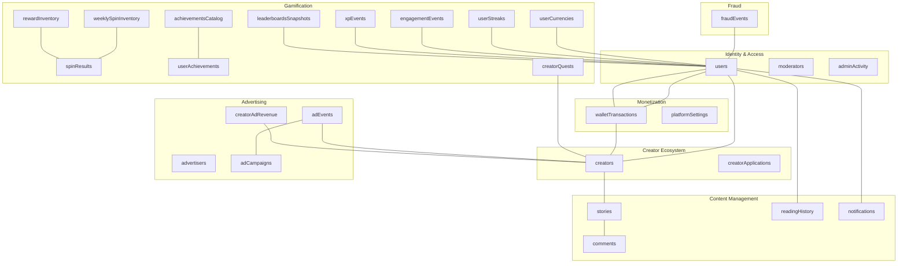
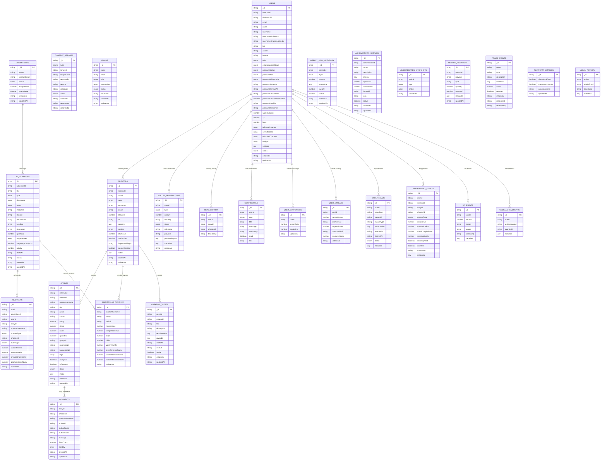
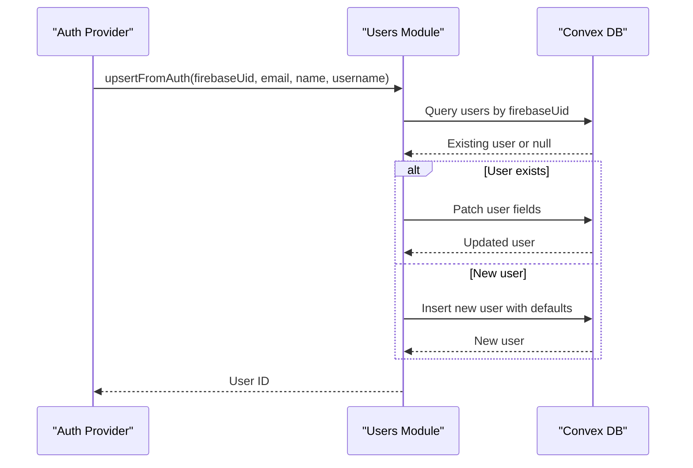
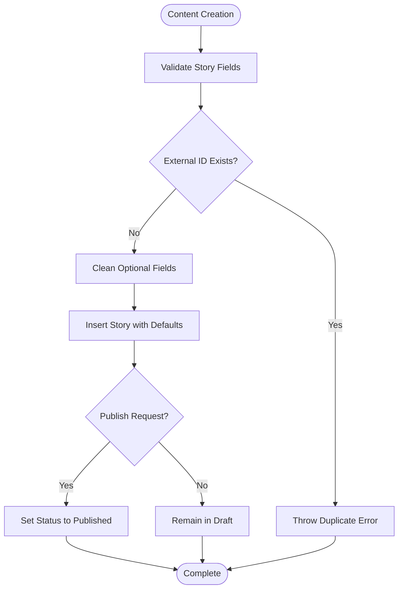
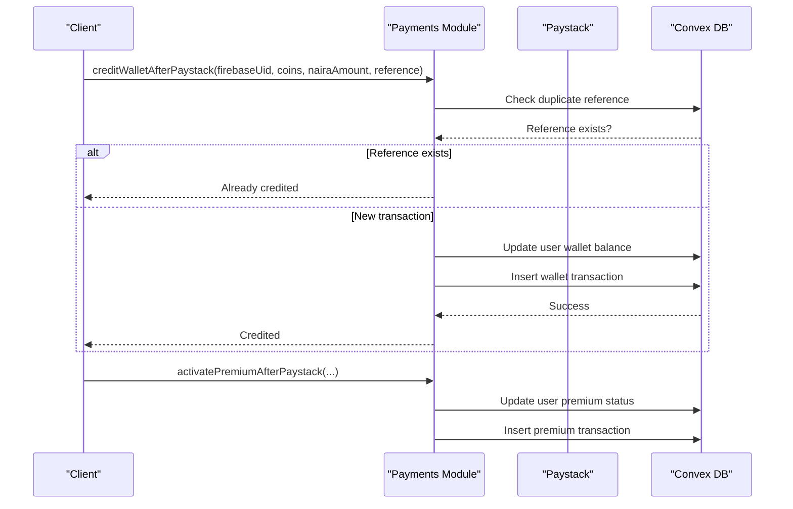
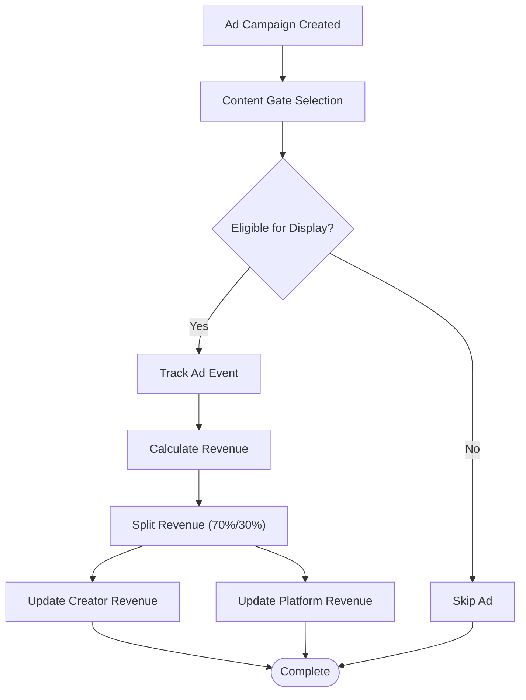
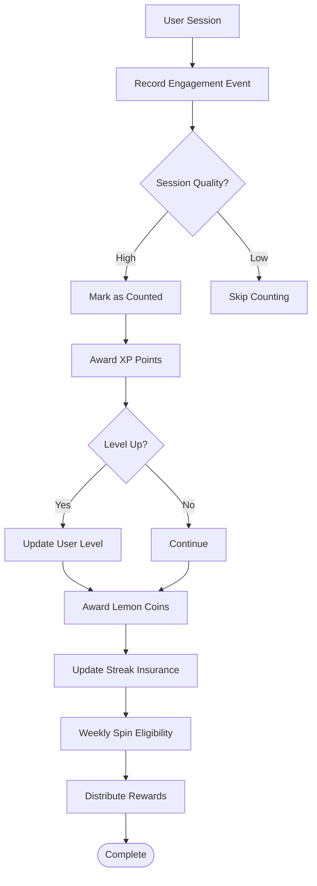
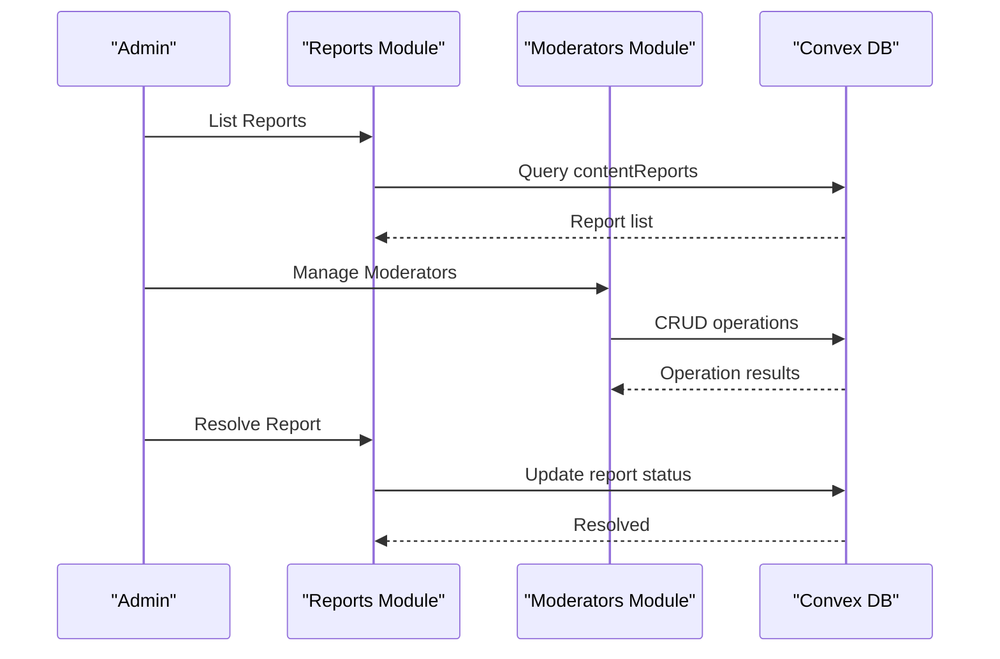
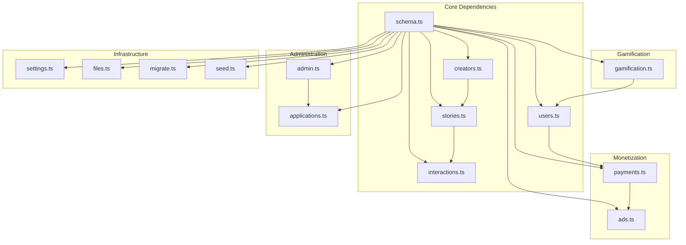

# Database Schema Design

<cite>
**Referenced Files in This Document**
- [schema.ts](file://convex/schema.ts)
- [users.ts](file://convex/users.ts)
- [creators.ts](file://convex/creators.ts)
- [stories.ts](file://convex/stories.ts)
- [interactions.ts](file://convex/interactions.ts)
- [payments.ts](file://convex/payments.ts)
- [ads.ts](file://convex/ads.ts)
- [gamification.ts](file://convex/gamification.ts)
- [admin.ts](file://convex/admin.ts)
- [applications.ts](file://convex/applications.ts)
- [settings.ts](file://convex/settings.ts)
- [files.ts](file://convex/files.ts)
- [migrate.ts](file://convex/migrate.ts)
- [seed.ts](file://convex/seed.ts)
</cite>

## Table of Contents
1. [Introduction](#introduction)
2. [Project Structure](#project-structure)
3. [Core Components](#core-components)
4. [Architecture Overview](#architecture-overview)
5. [Detailed Component Analysis](#detailed-component-analysis)
6. [Dependency Analysis](#dependency-analysis)
7. [Performance Considerations](#performance-considerations)
8. [Troubleshooting Guide](#troubleshooting-guide)
9. [Conclusion](#conclusion)

## Introduction
This document provides comprehensive database schema documentation for the Lemonade platform built on Convex. The schema defines 493 lines of table definitions, relationships, and indexing strategies that support user roles, content management, monetization, gamification, advertising, and administrative workflows. It covers entity relationships, table structures, validation rules, indexing strategies for performance, and real-time capabilities.

## Project Structure
The Convex schema organizes data into cohesive tables grouped by functional domains:
- Identity and Access Control: users, moderators, adminActivity
- Creator Ecosystem: creators, creatorApplications
- Content Management: stories, comments, readingHistory, notifications
- Monetization: walletTransactions, platformSettings
- Advertising: advertisers, adCampaigns, adEvents, creatorAdRevenue
- Gamification: userCurrencies, userStreaks, weeklySpinInventory, spinResults, engagementEvents, xpEvents, achievementsCatalog, userAchievements, leaderboardsSnapshots, creatorQuests, rewardInventory
- Fraud Detection: fraudEvents

**Diagram sources**
- [schema.ts:24-492](file://convex/schema.ts#L24-L492)

**Section sources**
- [schema.ts:1-493](file://convex/schema.ts#L1-L493)

## Core Components

### User Roles System
The schema defines four user roles with strict validation:
- guest: Basic access without privileges
- reader: Default authenticated user role
- creator: Content creator with elevated permissions
- admin: Platform administrator

Role transitions occur through administrative workflows and creator application approvals. The system enforces role-based access control across mutations and queries.

**Section sources**
- [schema.ts:4-9](file://convex/schema.ts#L4-L9)
- [users.ts:92-111](file://convex/users.ts#L92-L111)
- [applications.ts:120-223](file://convex/applications.ts#L120-L223)

### Premium Status Tracking
Premium subscriptions support three tiers with lifecycle management:
- free: Basic tier with limited features
- trial: Temporary premium access
- premium: Full premium subscription
- expired: Past-due premium status

Subscription plans include monthly and yearly billing cycles with provider integration (Paystack). The system tracks renewal dates, cancellation requests, and provider references.

**Section sources**
- [schema.ts:38-51](file://convex/schema.ts#L38-L51)
- [payments.ts:174-262](file://convex/payments.ts#L174-L262)

### Creator Application Workflows
The creator application process follows a structured approval pipeline:
- Pending submissions trigger user status updates
- Administrative review updates user roles and creates creator profiles
- Multi-field application form captures portfolio, categories, and content intent
- Enhanced application data includes social links, studio mode, and story readiness

**Section sources**
- [schema.ts:127-149](file://convex/schema.ts#L127-L149)
- [applications.ts:70-118](file://convex/applications.ts#L70-L118)
- [applications.ts:120-223](file://convex/applications.ts#L120-L223)

### Content Management Schema
Content management encompasses stories, chapters, media handling, and publishing workflows:
- Stories support multiple formats (Manga, Manhwa, Novel, Movie)
- Chapter-based unlocking with wallet transactions
- Rich media support through cover images, banners, and embedded content
- Publishing workflow with draft/published/hidden/archived states
- Tagging system for discoverability and filtering

**Section sources**
- [schema.ts:95-125](file://convex/schema.ts#L95-L125)
- [stories.ts:46-104](file://convex/stories.ts#L46-L104)
- [stories.ts:106-144](file://convex/stories.ts#L106-L144)

### Monetization System
The monetization system handles multiple revenue streams:
- Wallet transactions for top-ups, chapter unlocks, creator support, and premium purchases
- Payment processing with Paystack integration
- Revenue tracking for creator support payments
- Transaction lifecycle management (pending, success, failed, refunded)

**Section sources**
- [schema.ts:198-223](file://convex/schema.ts#L198-L223)
- [payments.ts:82-111](file://convex/payments.ts#L82-L111)
- [payments.ts:113-172](file://convex/payments.ts#L113-L172)

### Gamification System
Gamification encompasses XP events, streak tracking, achievement catalogs, and reward systems:
- Engagement-based XP awards with completion thresholds
- Streak protection system using Lemon Coins
- Weekly spin rewards with weighted probability
- Achievement catalog with XP and coin rewards
- Leaderboard snapshots for periodic rankings

**Section sources**
- [schema.ts:354-455](file://convex/schema.ts#L354-L455)
- [gamification.ts:14-117](file://convex/gamification.ts#L14-L117)
- [gamification.ts:147-232](file://convex/gamification.ts#L147-L232)

### Administrative Features
Administrative capabilities include content reporting, moderation tools, and platform settings:
- Content reporting system with automated resolution workflows
- Moderator management with role-based permissions
- Platform settings for maintenance and announcements
- Fraud detection and monitoring
- Analytics dashboards for revenue and user metrics

**Section sources**
- [schema.ts:151-181](file://convex/schema.ts#L151-L181)
- [admin.ts:179-223](file://convex/admin.ts#L179-L223)
- [admin.ts:246-250](file://convex/admin.ts#L246-L250)
- [settings.ts:4-44](file://convex/settings.ts#L4-L44)

## Architecture Overview

**Diagram sources**
- [schema.ts:24-492](file://convex/schema.ts#L24-L492)

## Detailed Component Analysis

### User Management System
The user management system provides comprehensive identity and access control:

**Diagram sources**
- [users.ts:42-90](file://convex/users.ts#L42-L90)

Key validation rules include:
- Username normalization (trim, lowercase, remove @ prefix)
- Username format validation (3-24 characters, alphanumeric, underscore only)
- Username change intervals (90-day lockout)
- Email uniqueness enforcement
- Role-based access control

**Section sources**
- [users.ts:7-13](file://convex/users.ts#L7-L13)
- [users.ts:183-243](file://convex/users.ts#L183-L243)

### Content Creation and Publishing Workflow
Content creation follows a structured workflow with validation and publishing controls:

**Diagram sources**
- [stories.ts:46-104](file://convex/stories.ts#L46-L104)
- [stories.ts:163-179](file://convex/stories.ts#L163-L179)

**Section sources**
- [stories.ts:106-144](file://convex/stories.ts#L106-L144)

### Monetization and Payment Processing
Payment processing integrates with external providers and manages wallet transactions:

**Diagram sources**
- [payments.ts:113-172](file://convex/payments.ts#L113-L172)
- [payments.ts:174-262](file://convex/payments.ts#L174-L262)

**Section sources**
- [payments.ts:21-80](file://convex/payments.ts#L21-L80)

### Advertising and Revenue Distribution
Advertising system handles campaign management and revenue sharing:

**Diagram sources**
- [ads.ts:105-165](file://convex/ads.ts#L105-L165)
- [ads.ts:167-237](file://convex/ads.ts#L167-L237)

**Section sources**
- [ads.ts:239-273](file://convex/ads.ts#L239-L273)

### Gamification and Engagement System
Engagement tracking and gamification rewards user participation:

**Diagram sources**
- [gamification.ts:14-117](file://convex/gamification.ts#L14-L117)
- [gamification.ts:147-232](file://convex/gamification.ts#L147-L232)

**Section sources**
- [gamification.ts:234-287](file://convex/gamification.ts#L234-L287)

### Administrative Monitoring and Moderation
Administrative tools provide oversight and content management:

**Diagram sources**
- [admin.ts:179-223](file://convex/admin.ts#L179-L223)
- [admin.ts:246-250](file://convex/admin.ts#L246-L250)

**Section sources**
- [admin.ts:312-348](file://convex/admin.ts#L312-L348)

## Dependency Analysis

**Diagram sources**
- [schema.ts:1-493](file://convex/schema.ts#L1-L493)

**Section sources**
- [schema.ts:24-492](file://convex/schema.ts#L24-L492)

## Performance Considerations

### Indexing Strategies
The schema implements strategic indexing for optimal query performance:

**Primary Indexes:**
- `by_firebaseUid`: Fast user lookups by authentication provider
- `by_username`: Efficient username-based operations
- `by_externalId`: Cross-system identifier resolution
- `by_userId`: Creator profile association
- `by_status`: Content filtering by publication state
- `by_creatorUsername`: Creator-centric queries

**Composite Indexes:**
- `by_user_story`: Reading history aggregation
- `by_creator_and_period`: Revenue period analysis
- `by_status_and_placement`: Ad campaign filtering

**Performance Optimizations:**
- Denormalized fields (creatorUsername) reduce join complexity
- Array fields for collections enable efficient bulk operations
- Timestamp-based queries support analytics and reporting

### Concurrency and Real-time Capabilities
Convex provides inherent concurrency safety through:
- Optimistic concurrency control with automatic conflict resolution
- Atomic mutations that maintain data consistency
- Real-time subscriptions for live data updates
- Conflict-free replicated data types for collaborative features

**Section sources**
- [schema.ts:63-67](file://convex/schema.ts#L63-L67)
- [schema.ts:91-93](file://convex/schema.ts#L91-L93)
- [schema.ts:121-125](file://convex/schema.ts#L121-L125)

## Troubleshooting Guide

### Common Issues and Solutions

**User Registration Problems:**
- Username conflicts: Implement proper validation before insertion
- Authentication failures: Verify firebaseUid uniqueness
- Role assignment errors: Check administrative permissions

**Content Publishing Issues:**
- Duplicate external IDs: Use create vs update logic appropriately
- Media upload failures: Validate storage URLs before saving
- Category field corruption: Run migration script

**Payment Processing Errors:**
- Duplicate reference handling: Check transaction existence before processing
- Premium activation failures: Validate user existence and reference uniqueness
- Wallet balance discrepancies: Reconcile transaction records

**Gamification System Issues:**
- XP calculation inconsistencies: Verify engagement event quality thresholds
- Streak protection failures: Check Lemon Coins balance and insurance usage
- Spin reward distribution: Validate weighted probability calculations

**Section sources**
- [migrate.ts:7-35](file://convex/migrate.ts#L7-L35)
- [seed.ts:209-252](file://convex/seed.ts#L209-L252)

### Data Validation Approaches
The schema employs multiple validation layers:
- Runtime validation through Convex values library
- Business logic validation in mutation handlers
- Index-based uniqueness enforcement
- Enum-based state validation
- Foreign key constraint simulation through ID references

**Section sources**
- [users.ts:9-13](file://convex/users.ts#L9-L13)
- [stories.ts:69-71](file://convex/stories.ts#L69-L71)

## Conclusion
The Lemonade database schema demonstrates comprehensive design for a modern digital content platform. With 493 lines of carefully crafted table definitions, the schema supports complex workflows including user management, content creation, monetization, advertising, gamification, and administration. The strategic indexing, validation rules, and real-time capabilities provide a solid foundation for scalable growth while maintaining data integrity and user experience.

The modular architecture enables feature development without schema disruption, while the comprehensive indexing strategy ensures optimal query performance across all functional domains. The gamification and monetization systems are particularly sophisticated, supporting engagement-driven revenue models with robust analytics and reporting capabilities.