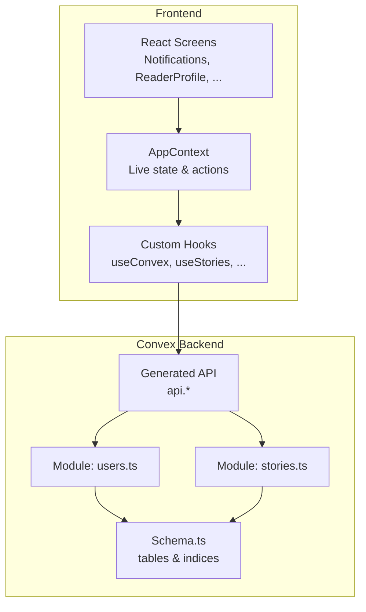
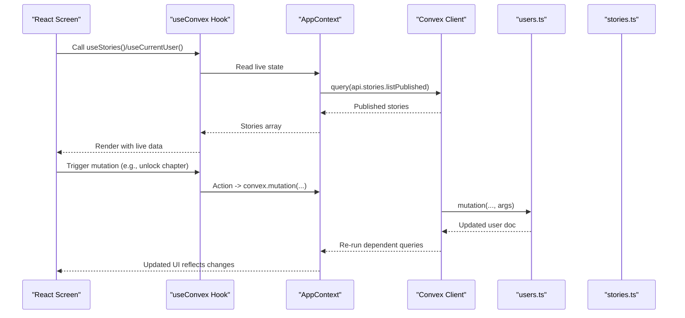
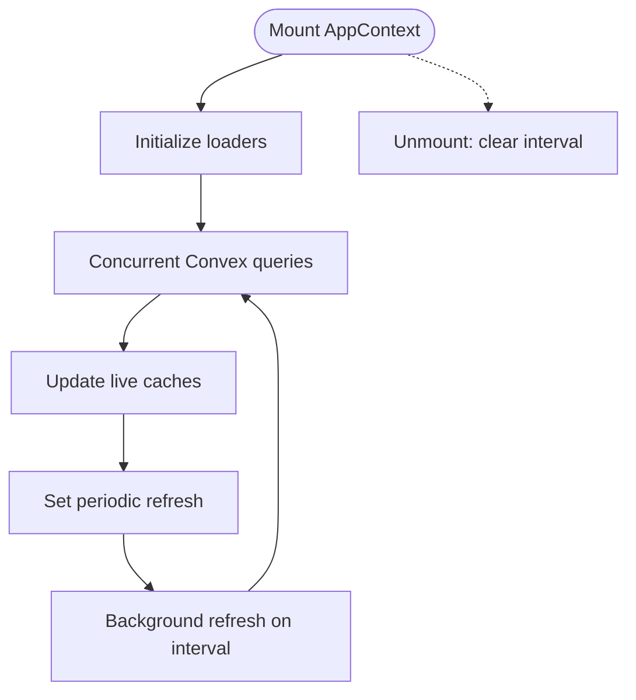
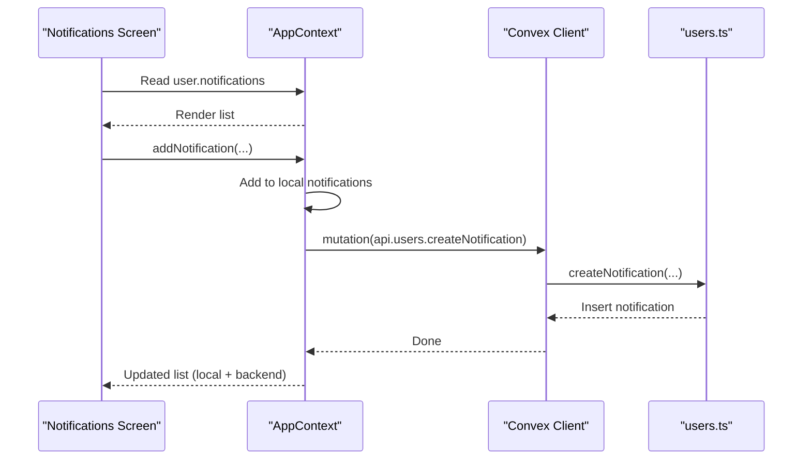
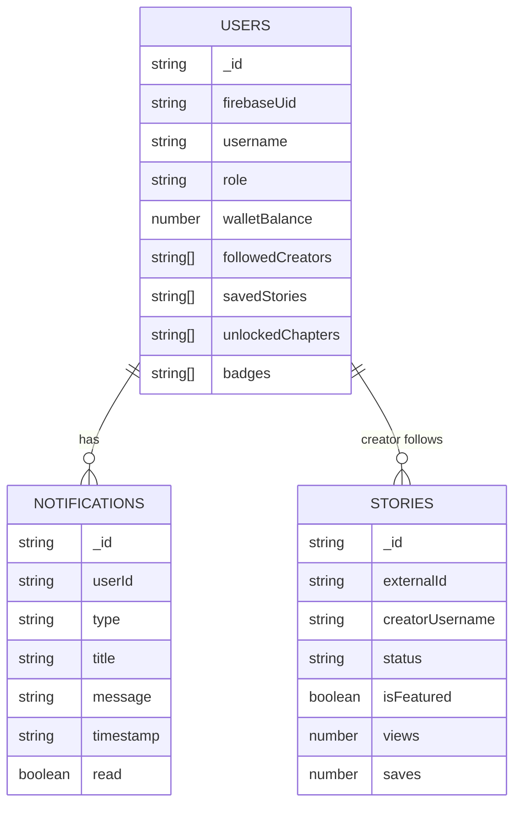
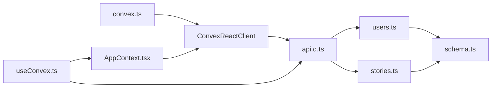

# Real-time Capabilities

<cite>
**Referenced Files in This Document**
- [AppContext.tsx](file://src/contexts/AppContext.tsx)
- [useConvex.ts](file://src/hooks/useConvex.ts)
- [Notifications.tsx](file://src/screens/Notifications.tsx)
- [convex.ts](file://src/lib/convex.ts)
- [api.d.ts](file://convex/_generated/api.d.ts)
- [schema.ts](file://convex/schema.ts)
- [users.ts](file://convex/users.ts)
- [stories.ts](file://convex/stories.ts)
- [subscription-cost.md](file://.agents/skills/convex-performance-audit/references/subscription-cost.md)
</cite>

## Table of Contents
1. [Introduction](#introduction)
2. [Project Structure](#project-structure)
3. [Core Components](#core-components)
4. [Architecture Overview](#architecture-overview)
5. [Detailed Component Analysis](#detailed-component-analysis)
6. [Dependency Analysis](#dependency-analysis)
7. [Performance Considerations](#performance-considerations)
8. [Troubleshooting Guide](#troubleshooting-guide)
9. [Conclusion](#conclusion)

## Introduction
This document explains how the Lemonade application integrates Convex’s real-time capabilities with the frontend to power live UI updates. It covers how React components subscribe to database changes via the AppContext and custom hooks, how the subscription lifecycle works, and how data synchronization occurs. It also documents the generated API surface, real-time notification behavior, live content feeds, and practical guidance for performance, error handling, offline fallbacks, and debugging.

## Project Structure
The real-time integration spans three layers:
- Frontend context and hooks: AppContext orchestrates live data and user actions; custom hooks expose typed Convex APIs to components.
- Convex backend: Modules define queries and mutations that drive live subscriptions and data updates.
- Generated API: The Convex SDK generates strongly-typed references to backend functions.

**Diagram sources**
- [AppContext.tsx:509-601](file://src/contexts/AppContext.tsx#L509-L601)
- [useConvex.ts:15-22](file://src/hooks/useConvex.ts#L15-L22)
- [api.d.ts:33-62](file://convex/_generated/api.d.ts#L33-L62)
- [users.ts:149-181](file://convex/users.ts#L149-L181)
- [stories.ts:6-14](file://convex/stories.ts#L6-L14)
- [schema.ts:24-126](file://convex/schema.ts#L24-L126)

**Section sources**
- [AppContext.tsx:509-601](file://src/contexts/AppContext.tsx#L509-L601)
- [useConvex.ts:15-22](file://src/hooks/useConvex.ts#L15-L22)
- [api.d.ts:33-62](file://convex/_generated/api.d.ts#L33-L62)
- [schema.ts:24-126](file://convex/schema.ts#L24-L126)

## Core Components
- AppContext manages live content and user state. It periodically loads published stories and creators from Convex, maintains a local cache, and exposes actions to mutate state and trigger backend updates. It also persists user sessions and handles admin state.
- Custom hooks wrap AppContext and Convex APIs to provide typed, reusable data accessors for components.
- The generated API module provides strongly-typed references to backend functions, enabling safe client-side calls.

Key responsibilities:
- Live content refresh: Periodic polling of published stories and creators.
- User synchronization: Upsert users from Firebase, hydrate full profiles, and persist sessions.
- Admin operations: Manage admin state and platform settings.
- Notification creation: Add local notifications and persist them via backend.

**Section sources**
- [AppContext.tsx:509-601](file://src/contexts/AppContext.tsx#L509-L601)
- [AppContext.tsx:612-634](file://src/contexts/AppContext.tsx#L612-L634)
- [AppContext.tsx:772-800](file://src/contexts/AppContext.tsx#L772-L800)
- [useConvex.ts:15-22](file://src/hooks/useConvex.ts#L15-L22)
- [api.d.ts:33-62](file://convex/_generated/api.d.ts#L33-L62)

## Architecture Overview
The real-time pipeline combines periodic refresh with targeted mutations:
- AppContext initializes a periodic loader that queries published stories and creators and updates local state.
- Components consume data from AppContext and trigger mutations via hooks.
- Mutations update Convex documents, which cause dependent queries to re-run reactively in connected clients.

**Diagram sources**
- [AppContext.tsx:529-592](file://src/contexts/AppContext.tsx#L529-L592)
- [useConvex.ts:205-212](file://src/hooks/useConvex.ts#L205-L212)
- [users.ts:269-310](file://convex/users.ts#L269-L310)
- [stories.ts:6-14](file://convex/stories.ts#L6-L14)

## Detailed Component Analysis

### AppContext: Live Content and Subscription Lifecycle
- Initialization: On mount, AppContext starts a periodic loader that queries multiple Convex endpoints concurrently and updates live caches for creators, stories, users, reports, activity logs, and moderators.
- Background refresh: A timer triggers background refreshes to keep content fresh without blocking initial load.
- Cleanup: The loader cleans up the timer on unmount to prevent memory leaks.
- User synchronization: On auth state changes, AppContext upserts users from Firebase, hydrates full profiles, and persists sessions locally.

**Diagram sources**
- [AppContext.tsx:529-601](file://src/contexts/AppContext.tsx#L529-L601)

**Section sources**
- [AppContext.tsx:529-601](file://src/contexts/AppContext.tsx#L529-L601)
- [AppContext.tsx:612-634](file://src/contexts/AppContext.tsx#L612-L634)

### Custom Hooks: Typed Access to Convex
- useCurrentUser: Returns current user data and Firebase UID for downstream operations.
- useStories/useTrendingStories/useSearchStories/useStoryById: Provide filtered and sorted story lists from AppContext.
- useUnlockChapter/useUpdateStory/useIncrementStoryView: Typed wrappers around Convex mutations for common actions.

These hooks centralize API usage and enforce type safety.

**Section sources**
- [useConvex.ts:15-22](file://src/hooks/useConvex.ts#L15-L22)
- [useConvex.ts:24-60](file://src/hooks/useConvex.ts#L24-L60)
- [useConvex.ts:205-212](file://src/hooks/useConvex.ts#L205-L212)

### Notifications: Real-time Feed and Local Updates
- Notifications screen renders the user’s notification list from AppContext.
- New notifications are added locally first and persisted asynchronously via a backend mutation.
- The UI reacts to local updates immediately, while the backend ensures durability.

**Diagram sources**
- [Notifications.tsx:6-68](file://src/screens/Notifications.tsx#L6-L68)
- [AppContext.tsx:772-800](file://src/contexts/AppContext.tsx#L772-L800)
- [users.ts:245-268](file://convex/users.ts#L245-L268)

**Section sources**
- [Notifications.tsx:6-68](file://src/screens/Notifications.tsx#L6-L68)
- [AppContext.tsx:772-800](file://src/contexts/AppContext.tsx#L772-L800)
- [users.ts:245-268](file://convex/users.ts#L245-L268)

### Generated API Surface and Backend Modules
- The generated API module exposes references to all public Convex functions grouped by module (users, stories, etc.).
- Backend modules define queries and mutations used by the frontend. Examples:
  - users.getFullProfile hydrates user data with related collections.
  - stories.listPublished returns only published stories.
  - users.createNotification inserts a new notification record.

These modules are the foundation for live subscriptions and data updates.

**Section sources**
- [api.d.ts:33-62](file://convex/_generated/api.d.ts#L33-L62)
- [users.ts:149-181](file://convex/users.ts#L149-L181)
- [stories.ts:6-14](file://convex/stories.ts#L6-L14)
- [users.ts:245-268](file://convex/users.ts#L245-L268)

### Data Model: Real-time Feeds and Indices
- Schema defines tables and indices that enable efficient queries for live feeds (e.g., published stories, user notifications).
- Indices like by_status, by_featured, by_userId, and by_username optimize reactive queries and reduce invalidation costs.

**Diagram sources**
- [schema.ts:24-126](file://convex/schema.ts#L24-L126)
- [schema.ts:234-250](file://convex/schema.ts#L234-L250)

**Section sources**
- [schema.ts:24-126](file://convex/schema.ts#L24-L126)
- [schema.ts:234-250](file://convex/schema.ts#L234-L250)

## Dependency Analysis
- Frontend depends on Convex client initialization and the generated API.
- AppContext orchestrates multiple concurrent queries to populate live state.
- Hooks depend on AppContext for data and on Convex client for mutations.
- Backend modules depend on schema indices to keep queries efficient.

**Diagram sources**
- [convex.ts:1-12](file://src/lib/convex.ts#L1-L12)
- [api.d.ts:33-62](file://convex/_generated/api.d.ts#L33-L62)
- [users.ts:149-181](file://convex/users.ts#L149-L181)
- [stories.ts:6-14](file://convex/stories.ts#L6-L14)
- [AppContext.tsx:529-592](file://src/contexts/AppContext.tsx#L529-L592)
- [useConvex.ts:15-22](file://src/hooks/useConvex.ts#L15-L22)
- [schema.ts:24-126](file://convex/schema.ts#L24-L126)

**Section sources**
- [convex.ts:1-12](file://src/lib/convex.ts#L1-L12)
- [api.d.ts:33-62](file://convex/_generated/api.d.ts#L33-L62)
- [users.ts:149-181](file://convex/users.ts#L149-L181)
- [stories.ts:6-14](file://convex/stories.ts#L6-L14)
- [AppContext.tsx:529-592](file://src/contexts/AppContext.tsx#L529-L592)
- [useConvex.ts:15-22](file://src/hooks/useConvex.ts#L15-L22)
- [schema.ts:24-126](file://convex/schema.ts#L24-L126)

## Performance Considerations
- Subscription cost: Every reactive query creates a live subscription. Total cost scales with subscriptions × invalidation frequency × query cost.
- Reduce unnecessary invalidations:
  - Prefer point-in-time reads for high-read, low-churn flows.
  - Batch related data into fewer queries.
  - Use skip to avoid subscribing until arguments are ready.
  - Isolate frequently-updated fields into separate documents.
  - Limit paginated lists to a reasonable number of live pages.
- Keep live updates where users expect fresh changes (collaborative editing, dashboards, presence-heavy views).

**Section sources**
- [subscription-cost.md:1-102](file://.agents/skills/convex-performance-audit/references/subscription-cost.md#L1-L102)
- [subscription-cost.md:104-301](file://.agents/skills/convex-performance-audit/references/subscription-cost.md#L104-L301)

## Troubleshooting Guide
- Real-time connection disabled: If the Convex URL is missing, the client is null and queries/mutations will fail. Ensure the environment variable is set.
- Auth persistence: AppContext waits for auth persistence readiness and gracefully handles guest sessions.
- Offline fallback: AppContext’s loader catches errors and logs them; UI should handle loading states and empty lists.
- Debugging:
  - Verify generated API references are present.
  - Confirm backend indices match query patterns.
  - Monitor subscription counts and UI responsiveness.

Common checks:
- Environment variable for Convex URL.
- Auth state transitions and persisted sessions.
- Network errors during periodic refresh or mutations.

**Section sources**
- [convex.ts:1-12](file://src/lib/convex.ts#L1-L12)
- [AppContext.tsx:587-591](file://src/contexts/AppContext.tsx#L587-L591)
- [AppContext.tsx:650-694](file://src/contexts/AppContext.tsx#L650-L694)

## Conclusion
Lemonade’s real-time system centers on AppContext’s periodic loaders and targeted mutations, backed by a strongly-typed generated API and optimized schema indices. Components subscribe implicitly through AppContext and custom hooks, receiving automatic UI updates when backend documents change. By following performance best practices—such as batching queries, isolating frequently updated fields, and using point-in-time reads where appropriate—the system balances freshness with efficiency. Robust error handling and offline-friendly patterns ensure reliable user experiences.