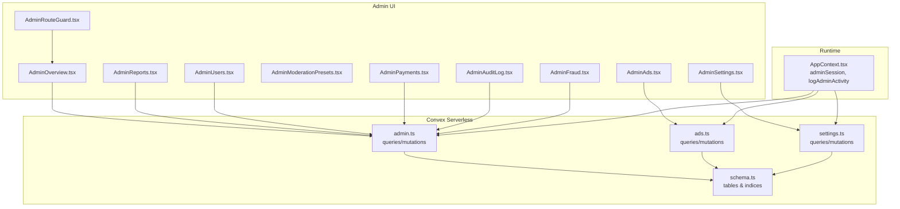
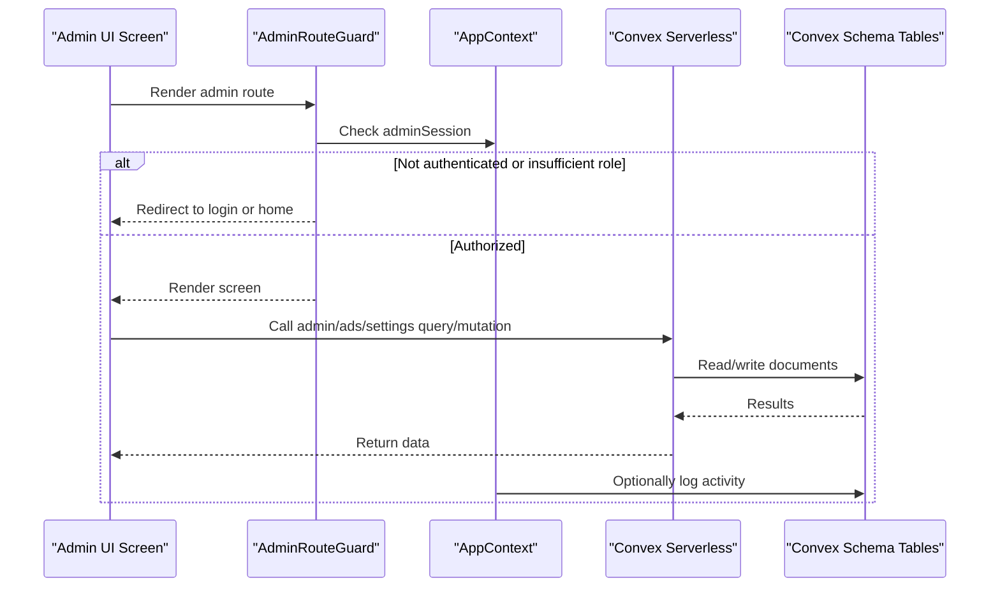
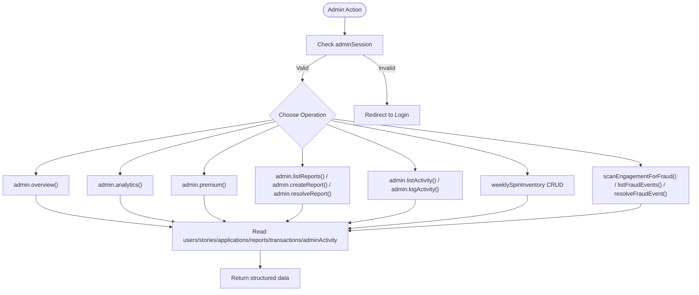
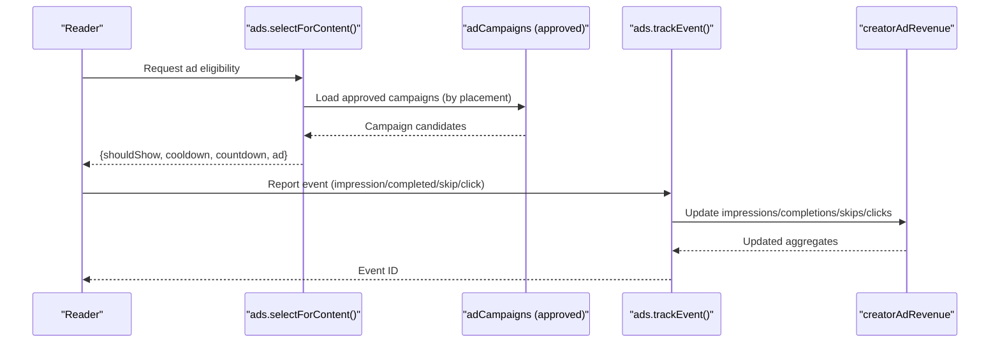
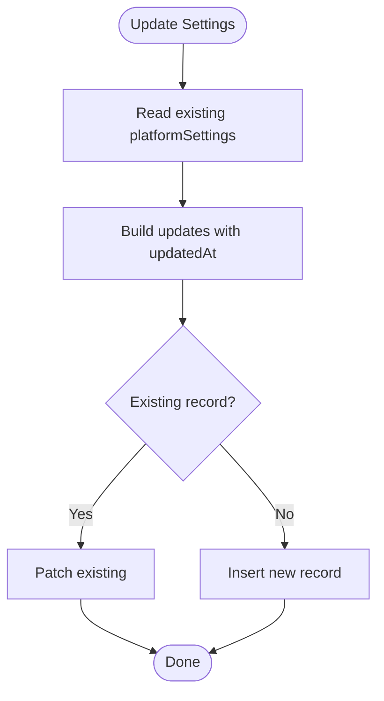
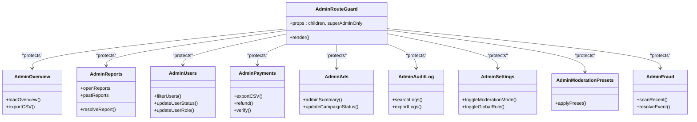
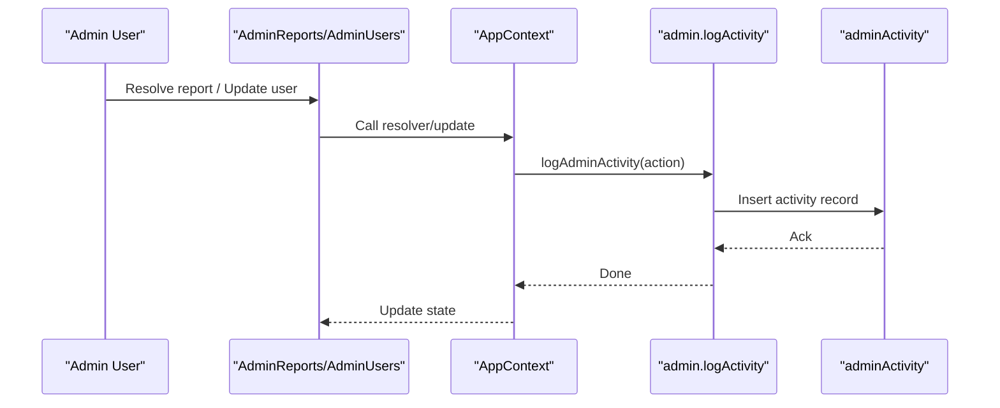
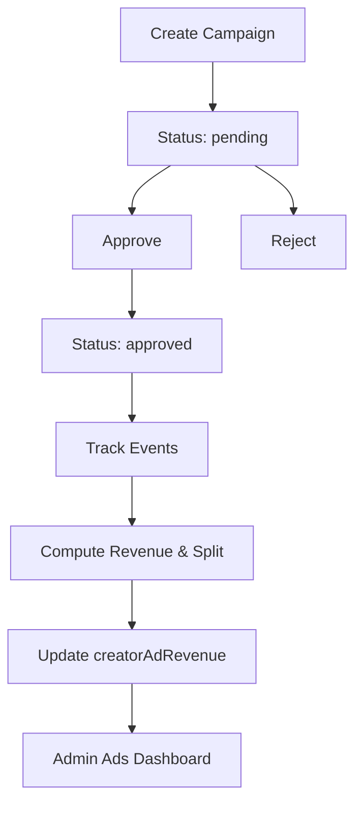
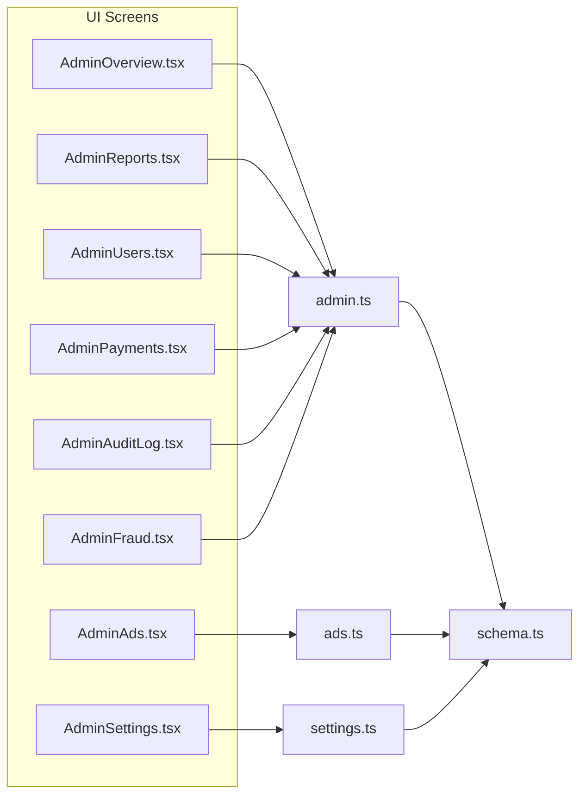

# Administrative Functions

<cite>
**Referenced Files in This Document**
- [admin.ts](file://convex/admin.ts)
- [ads.ts](file://convex/ads.ts)
- [settings.ts](file://convex/settings.ts)
- [schema.ts](file://convex/schema.ts)
- [AdminRouteGuard.tsx](file://src/components/admin/AdminRouteGuard.tsx)
- [AdminOverview.tsx](file://src/screens/admin/AdminOverview.tsx)
- [AdminSettings.tsx](file://src/screens/admin/AdminSettings.tsx)
- [AdminAuditLog.tsx](file://src/screens/admin/AdminAuditLog.tsx)
- [AdminModerationPresets.tsx](file://src/screens/admin/AdminModerationPresets.tsx)
- [AdminReports.tsx](file://src/screens/admin/AdminReports.tsx)
- [AdminUsers.tsx](file://src/screens/admin/AdminUsers.tsx)
- [AdminPayments.tsx](file://src/screens/admin/AdminPayments.tsx)
- [AdminAds.tsx](file://src/screens/admin/AdminAds.tsx)
- [AdminFraud.tsx](file://src/screens/admin/AdminFraud.tsx)
- [AppContext.tsx](file://src/contexts/AppContext.tsx)
</cite>

## Table of Contents
1. [Introduction](#introduction)
2. [Project Structure](#project-structure)
3. [Core Components](#core-components)
4. [Architecture Overview](#architecture-overview)
5. [Detailed Component Analysis](#detailed-component-analysis)
6. [Dependency Analysis](#dependency-analysis)
7. [Performance Considerations](#performance-considerations)
8. [Troubleshooting Guide](#troubleshooting-guide)
9. [Conclusion](#conclusion)
10. [Appendices](#appendices)

## Introduction
This document explains the administrative serverless functions and the admin interface for Lemonade. It covers:
- Platform administration queries and mutations (admin.ts)
- System settings management (settings.ts)
- Advertising system (ads.ts) including campaign management, event tracking, and revenue analytics
- Content moderation workflows, user management tools, analytics reporting, and platform configuration
- Administrative interface functions, audit logging, and content review processes
- Ad campaign management, revenue tracking, and platform policy enforcement
- Examples of administrative actions, permission checking, and bulk operations
- Security considerations for admin functions and data protection measures

## Project Structure
The administrative domain spans serverless Convex functions and a React admin UI:
- Convex serverless functions: admin.ts, ads.ts, settings.ts
- Admin UI screens: AdminOverview, AdminSettings, AdminAuditLog, AdminModerationPresets, AdminReports, AdminUsers, AdminPayments, AdminAds, AdminFraud
- Route guard for admin pages
- AppContext manages admin sessions, permissions, and audit logging
- Convex schema defines data models used by admin functions

**Diagram sources**
- [admin.ts:31-364](file://convex/admin.ts#L31-L364)
- [ads.ts:105-360](file://convex/ads.ts#L105-L360)
- [settings.ts:4-45](file://convex/settings.ts#L4-L45)
- [schema.ts:176-393](file://convex/schema.ts#L176-L393)
- [AdminRouteGuard.tsx:10-24](file://src/components/admin/AdminRouteGuard.tsx#L10-L24)
- [AdminOverview.tsx:38-101](file://src/screens/admin/AdminOverview.tsx#L38-L101)
- [AdminSettings.tsx:7-189](file://src/screens/admin/AdminSettings.tsx#L7-L189)
- [AdminAuditLog.tsx:26-197](file://src/screens/admin/AdminAuditLog.tsx#L26-L197)
- [AdminModerationPresets.tsx:66-200](file://src/screens/admin/AdminModerationPresets.tsx#L66-L200)
- [AdminReports.tsx:25-211](file://src/screens/admin/AdminReports.tsx#L25-L211)
- [AdminUsers.tsx:23-266](file://src/screens/admin/AdminUsers.tsx#L23-L266)
- [AdminPayments.tsx:25-197](file://src/screens/admin/AdminPayments.tsx#L25-L197)
- [AdminAds.tsx:50-171](file://src/screens/admin/AdminAds.tsx#L50-L171)
- [AdminFraud.tsx:6-74](file://src/screens/admin/AdminFraud.tsx#L6-L74)
- [AppContext.tsx:713-770](file://src/contexts/AppContext.tsx#L713-L770)

**Section sources**
- [admin.ts:31-364](file://convex/admin.ts#L31-L364)
- [ads.ts:105-360](file://convex/ads.ts#L105-L360)
- [settings.ts:4-45](file://convex/settings.ts#L4-L45)
- [schema.ts:176-393](file://convex/schema.ts#L176-L393)
- [AdminRouteGuard.tsx:10-24](file://src/components/admin/AdminRouteGuard.tsx#L10-L24)
- [AdminOverview.tsx:38-101](file://src/screens/admin/AdminOverview.tsx#L38-L101)
- [AdminSettings.tsx:7-189](file://src/screens/admin/AdminSettings.tsx#L7-L189)
- [AdminAuditLog.tsx:26-197](file://src/screens/admin/AdminAuditLog.tsx#L26-L197)
- [AdminModerationPresets.tsx:66-200](file://src/screens/admin/AdminModerationPresets.tsx#L66-L200)
- [AdminReports.tsx:25-211](file://src/screens/admin/AdminReports.tsx#L25-L211)
- [AdminUsers.tsx:23-266](file://src/screens/admin/AdminUsers.tsx#L23-L266)
- [AdminPayments.tsx:25-197](file://src/screens/admin/AdminPayments.tsx#L25-L197)
- [AdminAds.tsx:50-171](file://src/screens/admin/AdminAds.tsx#L50-L171)
- [AdminFraud.tsx:6-74](file://src/screens/admin/AdminFraud.tsx#L6-L74)
- [AppContext.tsx:713-770](file://src/contexts/AppContext.tsx#L713-L770)

## Core Components
- Admin overview and analytics: compute platform KPIs, revenue, and recent activity
- Reporting and moderation: create and resolve reports, list and manage moderation inventory
- Activity logging: centralized admin activity log with timestamps and metadata
- Fraud detection: scan engagement events and flag suspicious activity
- Settings: read/update platform settings (mock data toggle, maintenance mode)
- Ads: select ads for content, track ad events, compute revenue, and manage campaigns
- Admin UI: route guards, dashboards, and screens for users, reports, payments, ads, and audits

**Section sources**
- [admin.ts:31-128](file://convex/admin.ts#L31-L128)
- [admin.ts:179-244](file://convex/admin.ts#L179-L244)
- [admin.ts:312-364](file://convex/admin.ts#L312-L364)
- [settings.ts:4-45](file://convex/settings.ts#L4-L45)
- [ads.ts:105-237](file://convex/ads.ts#L105-L237)
- [ads.ts:314-360](file://convex/ads.ts#L314-L360)
- [AdminRouteGuard.tsx:10-24](file://src/components/admin/AdminRouteGuard.tsx#L10-L24)
- [AdminOverview.tsx:38-101](file://src/screens/admin/AdminOverview.tsx#L38-L101)
- [AdminAuditLog.tsx:26-197](file://src/screens/admin/AdminAuditLog.tsx#L26-L197)

## Architecture Overview
The admin functions are serverless Convex queries and mutations backed by a typed schema. The admin UI interacts with these functions to present dashboards, forms, and lists. Audit logging is maintained in-memory and persisted via Convex.

**Diagram sources**
- [AdminRouteGuard.tsx:10-24](file://src/components/admin/AdminRouteGuard.tsx#L10-L24)
- [AppContext.tsx:713-770](file://src/contexts/AppContext.tsx#L713-L770)
- [admin.ts:31-128](file://convex/admin.ts#L31-L128)
- [ads.ts:105-237](file://convex/ads.ts#L105-L237)
- [settings.ts:4-45](file://convex/settings.ts#L4-L45)
- [schema.ts:176-393](file://convex/schema.ts#L176-L393)

## Detailed Component Analysis

### Admin Serverless Functions (admin.ts)
- Overview and analytics
  - Computes counts for users, stories, applications, reports, creators, and revenue
  - Aggregates successful transactions and recent admin activity
- Reporting
  - Create content reports with type, target, reporter, reason, and message
  - Resolve reports with status and admin attribution
- Activity logging
  - Log admin actions with metadata and timestamps
- Moderation inventory
  - List and manage weekly spin rewards (create, update, delete)
- Fraud detection
  - Scan engagement events for suspicious patterns and create fraud events
  - List and resolve fraud events

**Diagram sources**
- [admin.ts:31-364](file://convex/admin.ts#L31-L364)
- [schema.ts:176-393](file://convex/schema.ts#L176-L393)

**Section sources**
- [admin.ts:31-128](file://convex/admin.ts#L31-L128)
- [admin.ts:179-244](file://convex/admin.ts#L179-L244)
- [admin.ts:253-310](file://convex/admin.ts#L253-L310)
- [admin.ts:312-364](file://convex/admin.ts#L312-L364)

### Advertising System (ads.ts)
- Ad selection for content
  - Determines whether to show an ad based on user, story, chapter, format, and cooldown
  - Normalizes content type and applies gating rules per format/chapter
- Event tracking and revenue
  - Tracks impression/completion/skip/click events
  - Calculates revenue and splits between creator and platform
  - Updates creator ad revenue aggregates per story and per month
- Admin dashboard
  - Summarizes impressions, CTR, completion rate, and platform share
  - Lists campaigns and allows status updates (approve/pause/reject)
- Seed campaigns
  - Ensures baseline approved campaigns exist when needed

**Diagram sources**
- [ads.ts:105-237](file://convex/ads.ts#L105-L237)
- [ads.ts:275-312](file://convex/ads.ts#L275-L312)
- [schema.ts:288-352](file://convex/schema.ts#L288-L352)

**Section sources**
- [ads.ts:105-165](file://convex/ads.ts#L105-L165)
- [ads.ts:167-237](file://convex/ads.ts#L167-L237)
- [ads.ts:275-312](file://convex/ads.ts#L275-L312)
- [ads.ts:314-360](file://convex/ads.ts#L314-L360)

### System Settings (settings.ts)
- Get platform settings with defaults
- Update settings (toggle mock data, maintenance mode, announcement)
- Persists updates to platformSettings table

**Diagram sources**
- [settings.ts:4-45](file://convex/settings.ts#L4-L45)
- [schema.ts:271-276](file://convex/schema.ts#L271-L276)

**Section sources**
- [settings.ts:4-45](file://convex/settings.ts#L4-L45)
- [schema.ts:271-276](file://convex/schema.ts#L271-L276)

### Administrative Interface Functions
- Route protection
  - AdminRouteGuard enforces admin authentication and optional super admin role
- Dashboards and lists
  - AdminOverview displays KPIs and recent activity
  - AdminReports lists open/dismissed reports and supports quick preview and resolution
  - AdminUsers filters and manages user roles and statuses
  - AdminPayments shows financial summaries and transaction actions
  - AdminAds summarizes ad performance and campaign approvals
  - AdminAuditLog presents immutable audit records
  - AdminSettings toggles moderation modes and global rules
  - AdminModerationPresets applies moderation presets
  - AdminFraud scans engagement and resolves fraud events

**Diagram sources**
- [AdminRouteGuard.tsx:10-24](file://src/components/admin/AdminRouteGuard.tsx#L10-L24)
- [AdminOverview.tsx:38-101](file://src/screens/admin/AdminOverview.tsx#L38-L101)
- [AdminReports.tsx:25-211](file://src/screens/admin/AdminReports.tsx#L25-L211)
- [AdminUsers.tsx:23-266](file://src/screens/admin/AdminUsers.tsx#L23-L266)
- [AdminPayments.tsx:25-197](file://src/screens/admin/AdminPayments.tsx#L25-L197)
- [AdminAds.tsx:50-171](file://src/screens/admin/AdminAds.tsx#L50-L171)
- [AdminAuditLog.tsx:26-197](file://src/screens/admin/AdminAuditLog.tsx#L26-L197)
- [AdminSettings.tsx:7-189](file://src/screens/admin/AdminSettings.tsx#L7-L189)
- [AdminModerationPresets.tsx:66-200](file://src/screens/admin/AdminModerationPresets.tsx#L66-L200)
- [AdminFraud.tsx:6-74](file://src/screens/admin/AdminFraud.tsx#L6-L74)

**Section sources**
- [AdminRouteGuard.tsx:10-24](file://src/components/admin/AdminRouteGuard.tsx#L10-L24)
- [AdminOverview.tsx:38-101](file://src/screens/admin/AdminOverview.tsx#L38-L101)
- [AdminReports.tsx:25-211](file://src/screens/admin/AdminReports.tsx#L25-L211)
- [AdminUsers.tsx:23-266](file://src/screens/admin/AdminUsers.tsx#L23-L266)
- [AdminPayments.tsx:25-197](file://src/screens/admin/AdminPayments.tsx#L25-L197)
- [AdminAds.tsx:50-171](file://src/screens/admin/AdminAds.tsx#L50-L171)
- [AdminAuditLog.tsx:26-197](file://src/screens/admin/AdminAuditLog.tsx#L26-L197)
- [AdminSettings.tsx:7-189](file://src/screens/admin/AdminSettings.tsx#L7-L189)
- [AdminModerationPresets.tsx:66-200](file://src/screens/admin/AdminModerationPresets.tsx#L66-L200)
- [AdminFraud.tsx:6-74](file://src/screens/admin/AdminFraud.tsx#L6-L74)

### Audit Logging and Content Review Processes
- Audit logging
  - AppContext maintains an in-memory activity log and persists via admin.logActivity
  - AdminAuditLog renders and exports audit entries
- Content review
  - AdminReports lists open reports and supports quick preview and resolution
  - AdminUsers supports role and status changes with audit trail
  - AdminFraud scans engagement and marks events resolved

**Diagram sources**
- [AppContext.tsx:713-770](file://src/contexts/AppContext.tsx#L713-L770)
- [admin.ts:225-244](file://convex/admin.ts#L225-L244)
- [schema.ts:176-181](file://convex/schema.ts#L176-L181)
- [AdminAuditLog.tsx:26-197](file://src/screens/admin/AdminAuditLog.tsx#L26-L197)
- [AdminReports.tsx:25-211](file://src/screens/admin/AdminReports.tsx#L25-L211)
- [AdminUsers.tsx:23-266](file://src/screens/admin/AdminUsers.tsx#L23-L266)

**Section sources**
- [AppContext.tsx:713-770](file://src/contexts/AppContext.tsx#L713-L770)
- [admin.ts:225-244](file://convex/admin.ts#L225-L244)
- [AdminAuditLog.tsx:26-197](file://src/screens/admin/AdminAuditLog.tsx#L26-L197)
- [AdminReports.tsx:25-211](file://src/screens/admin/AdminReports.tsx#L25-L211)
- [AdminUsers.tsx:23-266](file://src/screens/admin/AdminUsers.tsx#L23-L266)

### Ad Campaign Management and Revenue Tracking
- Campaign lifecycle
  - Create campaigns with type, placement, targeting, and pricing
  - Approve/pause/reject campaigns via admin UI
- Event tracking and revenue
  - Track impressions, completions, skips, clicks
  - Compute revenue per event and split between creator and platform
  - Aggregate per creator and per month
- Admin dashboard
  - Metrics: impressions, CTR, completion rate, platform share
  - Pending approvals and advertiser counts

**Diagram sources**
- [ads.ts:321-360](file://convex/ads.ts#L321-L360)
- [ads.ts:167-237](file://convex/ads.ts#L167-L237)
- [ads.ts:275-312](file://convex/ads.ts#L275-L312)
- [schema.ts:288-352](file://convex/schema.ts#L288-L352)

**Section sources**
- [ads.ts:321-360](file://convex/ads.ts#L321-L360)
- [ads.ts:167-237](file://convex/ads.ts#L167-L237)
- [ads.ts:275-312](file://convex/ads.ts#L275-L312)
- [schema.ts:288-352](file://convex/schema.ts#L288-L352)

### Platform Policy Enforcement and Bulk Operations
- Moderation presets
  - Apply strict, adaptive, or permissive moderation modes globally
- Bulk operations
  - AdminUsers supports role/status updates for multiple users
  - AdminPayments supports batch actions (verify/refund)
  - AdminAds supports bulk status updates for campaigns
- Permission checking
  - AdminRouteGuard supports super admin-only routes

**Section sources**
- [AdminModerationPresets.tsx:66-200](file://src/screens/admin/AdminModerationPresets.tsx#L66-L200)
- [AdminUsers.tsx:23-266](file://src/screens/admin/AdminUsers.tsx#L23-L266)
- [AdminPayments.tsx:25-197](file://src/screens/admin/AdminPayments.tsx#L25-L197)
- [AdminAds.tsx:50-171](file://src/screens/admin/AdminAds.tsx#L50-L171)
- [AdminRouteGuard.tsx:10-24](file://src/components/admin/AdminRouteGuard.tsx#L10-L24)

## Dependency Analysis
- Data model dependencies
  - admin.ts depends on users, stories, creatorApplications, contentReports, creators, walletTransactions, adminActivity, moderators, weeklySpinInventory, fraudEvents
  - ads.ts depends on adCampaigns, advertisers, adEvents, creatorAdRevenue
  - settings.ts depends on platformSettings
- UI-to-function mapping
  - AdminOverview -> admin.overview, admin.analytics, admin.premium
  - AdminReports -> admin.listReports, admin.createReport, admin.resolveReport
  - AdminUsers -> admin.listActivity, admin.logActivity
  - AdminPayments -> admin.overview (revenue)
  - AdminAds -> ads.adminSummary, ads.listCampaigns, ads.updateCampaignStatus
  - AdminAuditLog -> admin.listActivity
  - AdminSettings -> settings.get, settings.update
  - AdminFraud -> admin.scanEngagementForFraud, admin.listFraudEvents, admin.resolveFraudEvent

**Diagram sources**
- [AdminOverview.tsx:38-101](file://src/screens/admin/AdminOverview.tsx#L38-L101)
- [AdminReports.tsx:25-211](file://src/screens/admin/AdminReports.tsx#L25-L211)
- [AdminUsers.tsx:23-266](file://src/screens/admin/AdminUsers.tsx#L23-L266)
- [AdminPayments.tsx:25-197](file://src/screens/admin/AdminPayments.tsx#L25-L197)
- [AdminAds.tsx:50-171](file://src/screens/admin/AdminAds.tsx#L50-L171)
- [AdminAuditLog.tsx:26-197](file://src/screens/admin/AdminAuditLog.tsx#L26-L197)
- [AdminSettings.tsx:7-189](file://src/screens/admin/AdminSettings.tsx#L7-L189)
- [AdminFraud.tsx:6-74](file://src/screens/admin/AdminFraud.tsx#L6-L74)
- [admin.ts:31-364](file://convex/admin.ts#L31-L364)
- [ads.ts:105-360](file://convex/ads.ts#L105-L360)
- [settings.ts:4-45](file://convex/settings.ts#L4-L45)
- [schema.ts:176-393](file://convex/schema.ts#L176-L393)

**Section sources**
- [schema.ts:176-393](file://convex/schema.ts#L176-L393)
- [admin.ts:31-364](file://convex/admin.ts#L31-L364)
- [ads.ts:105-360](file://convex/ads.ts#L105-L360)
- [settings.ts:4-45](file://convex/settings.ts#L4-L45)

## Performance Considerations
- Batch reads: admin.overview performs concurrent reads across multiple collections
- Index usage: schema defines indices on frequently queried fields (e.g., by_status, by_adminEmail)
- Event aggregation: ads.trackEvent updates aggregates efficiently per story and per period
- UI refresh intervals: AdminOverview refreshes periodically to keep metrics fresh

[No sources needed since this section provides general guidance]

## Troubleshooting Guide
- Authentication failures
  - AdminRouteGuard redirects unauthenticated users to login
- Activity logging issues
  - Ensure adminSession is set; verify AppContext.logAdminActivity writes to adminActivity
- Report resolution
  - Confirm admin.resolveReport updates status and adds resolvedAt/resolvedBy
- Fraud scanning
  - Verify scanEngagementForFraud creates fraudEvents and resolveFraudEvent updates resolved fields
- Settings persistence
  - Confirm settings.update inserts or patches platformSettings with updatedAt

**Section sources**
- [AdminRouteGuard.tsx:10-24](file://src/components/admin/AdminRouteGuard.tsx#L10-L24)
- [AppContext.tsx:713-770](file://src/contexts/AppContext.tsx#L713-L770)
- [admin.ts:209-223](file://convex/admin.ts#L209-L223)
- [admin.ts:357-363](file://convex/admin.ts#L357-L363)
- [settings.ts:19-44](file://convex/settings.ts#L19-L44)

## Conclusion
The administrative system combines serverless Convex functions with a React admin UI to provide comprehensive oversight of platform operations. Admin functions cover analytics, reporting, moderation, fraud detection, settings, and ad monetization. The UI enforces permissions, exposes audit trails, and enables efficient bulk operations. Robust indexing and concurrent reads optimize performance, while clear separation of concerns ensures maintainability.

[No sources needed since this section summarizes without analyzing specific files]

## Appendices

### Administrative Actions and Examples
- Overview and analytics
  - Load platform KPIs and recent activity
- Reporting
  - Create a report for a story/user/comment
  - Resolve a report as resolved or dismissed
- Activity logging
  - Log admin actions with metadata
- Moderation inventory
  - Create/update/delete weekly spin rewards
- Fraud detection
  - Scan recent engagement and resolve events
- Settings
  - Toggle mock data and maintenance mode
- Ads
  - Select ads for content, track events, update campaign status
- Users
  - Update user roles and statuses
- Payments
  - Export reports and process refunds/verification

**Section sources**
- [admin.ts:31-128](file://convex/admin.ts#L31-L128)
- [admin.ts:179-244](file://convex/admin.ts#L179-L244)
- [admin.ts:253-310](file://convex/admin.ts#L253-L310)
- [admin.ts:312-364](file://convex/admin.ts#L312-L364)
- [settings.ts:4-45](file://convex/settings.ts#L4-L45)
- [ads.ts:105-237](file://convex/ads.ts#L105-L237)
- [ads.ts:314-360](file://convex/ads.ts#L314-L360)
- [AdminUsers.tsx:23-266](file://src/screens/admin/AdminUsers.tsx#L23-L266)
- [AdminPayments.tsx:25-197](file://src/screens/admin/AdminPayments.tsx#L25-L197)

### Security Considerations
- Route protection
  - AdminRouteGuard restricts access to authenticated admins and optionally super admins
- Audit logging
  - Centralized admin activity logging with timestamps and admin attribution
- Data protection
  - Sensitive fields are stored in Convex tables with appropriate indices
  - Admin actions are auditable and reversible where applicable

**Section sources**
- [AdminRouteGuard.tsx:10-24](file://src/components/admin/AdminRouteGuard.tsx#L10-L24)
- [AppContext.tsx:713-770](file://src/contexts/AppContext.tsx#L713-L770)
- [schema.ts:176-393](file://convex/schema.ts#L176-L393)