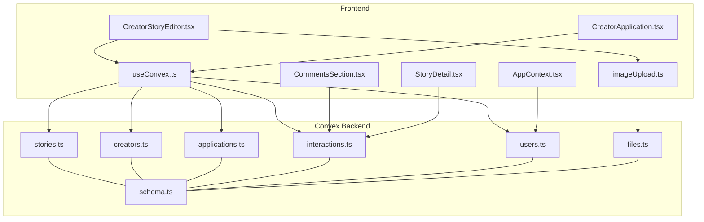
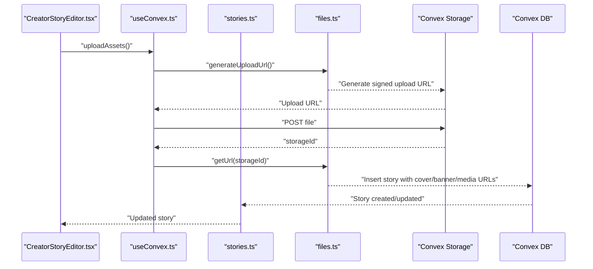
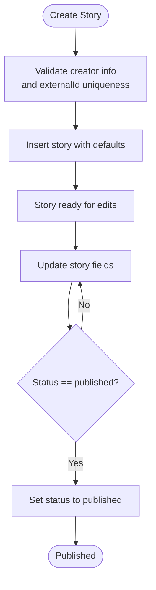
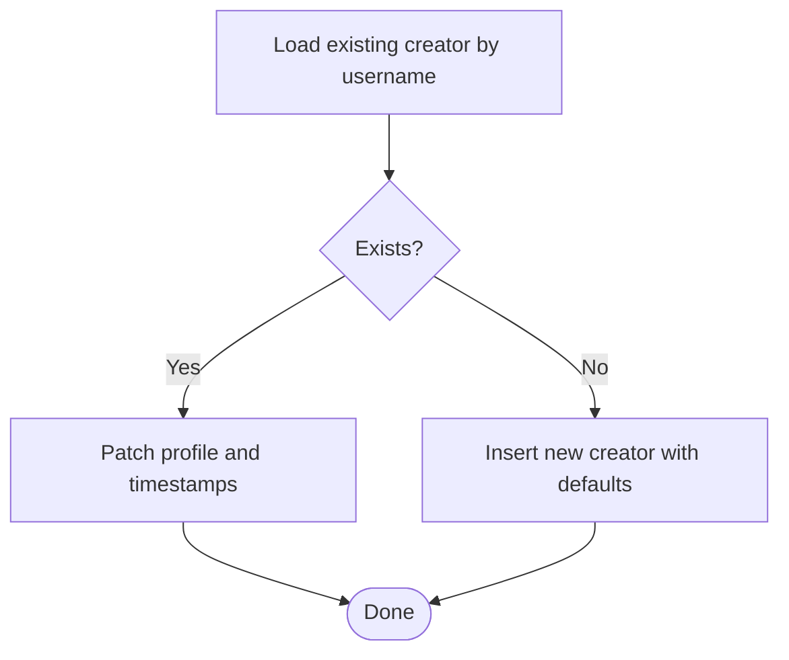
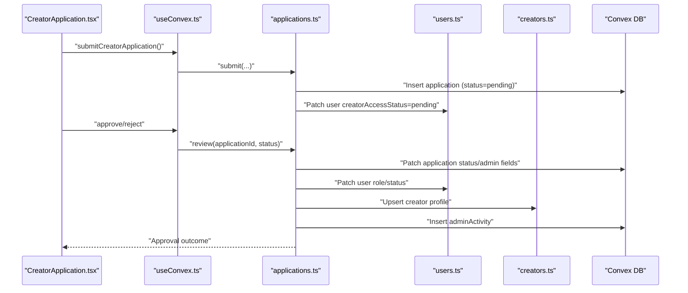
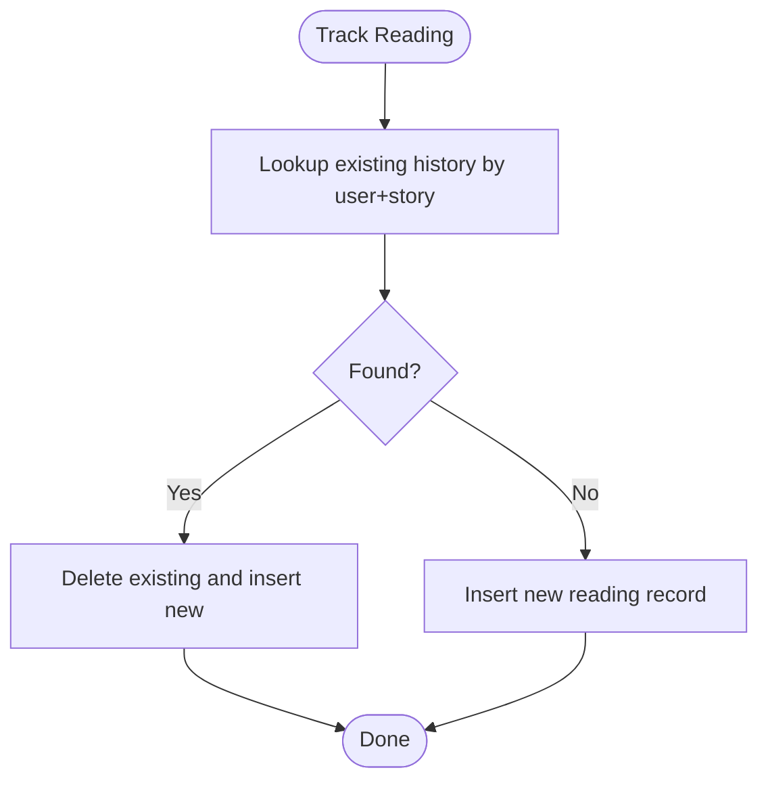
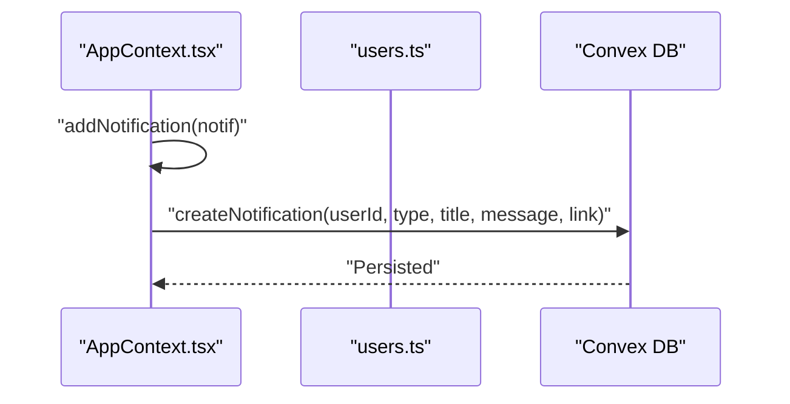
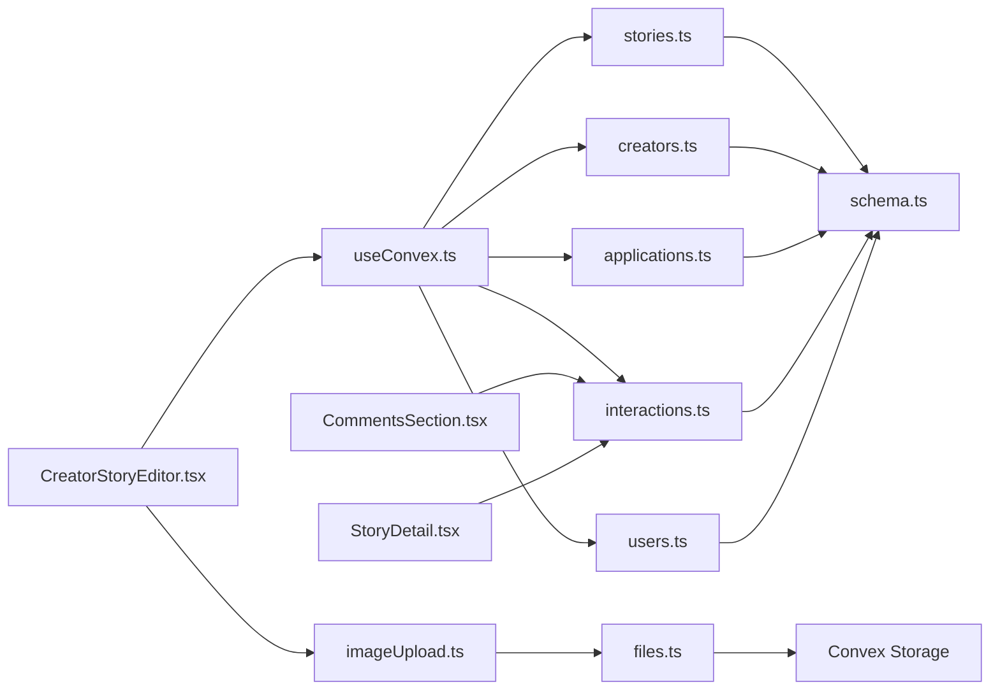

# Content Management Functions

<cite>
**Referenced Files in This Document**
- [stories.ts](file://convex/stories.ts)
- [creators.ts](file://convex/creators.ts)
- [applications.ts](file://convex/applications.ts)
- [interactions.ts](file://convex/interactions.ts)
- [schema.ts](file://convex/schema.ts)
- [users.ts](file://convex/users.ts)
- [files.ts](file://convex/files.ts)
- [CreatorStoryEditor.tsx](file://src/screens/CreatorStoryEditor.tsx)
- [CreatorApplication.tsx](file://src/screens/CreatorApplication.tsx)
- [useConvex.ts](file://src/hooks/useConvex.ts)
- [imageUpload.ts](file://src/lib/imageUpload.ts)
- [AppContext.tsx](file://src/contexts/AppContext.tsx)
- [CommentsSection.tsx](file://src/components/ui/CommentsSection.tsx)
- [StoryDetail.tsx](file://src/screens/StoryDetail.tsx)
</cite>

## Update Summary
**Changes Made**
- Updated Interactions section to document new comprehensive comment system functionality
- Added documentation for toggleDislikeComment mutation and enhanced moderation capabilities
- Updated comment interactions to include bidirectional like/dislike support
- Enhanced comment CRUD operations with full delete functionality
- Updated comment counting mechanisms to support bidirectional interactions

## Table of Contents
1. [Introduction](#introduction)
2. [Project Structure](#project-structure)
3. [Core Components](#core-components)
4. [Architecture Overview](#architecture-overview)
5. [Detailed Component Analysis](#detailed-component-analysis)
6. [Dependency Analysis](#dependency-analysis)
7. [Performance Considerations](#performance-considerations)
8. [Troubleshooting Guide](#troubleshooting-guide)
9. [Conclusion](#conclusion)

## Introduction
This document explains the content management serverless functions that power story creation and editing, creator profile management, creator application processing, and content interactions. It covers story CRUD operations, media handling, publishing workflows, creator application approval processes, and the notification system. It also documents the relationships between stories, chapters, and media assets, and provides examples of content creation workflows, approval processes, and interaction tracking.

**Updated** Enhanced with comprehensive comment system functionality including bidirectional like/dislike interactions, advanced moderation capabilities, and full CRUD operations for community engagement.

## Project Structure
The content management logic is implemented as Convex serverless functions in the convex/ directory, with supporting frontend components and hooks in the src/ directory. The data model is defined in schema.ts, and storage utilities are provided by files.ts and imageUpload.ts.

**Diagram sources**
- [CreatorStoryEditor.tsx:1-635](file://src/screens/CreatorStoryEditor.tsx#L1-L635)
- [CreatorApplication.tsx:1-412](file://src/screens/CreatorApplication.tsx#L1-L412)
- [useConvex.ts:1-213](file://src/hooks/useConvex.ts#L1-L213)
- [imageUpload.ts:1-235](file://src/lib/imageUpload.ts#L1-L235)
- [AppContext.tsx:1-200](file://src/contexts/AppContext.tsx#L1-L200)
- [CommentsSection.tsx:1-564](file://src/components/ui/CommentsSection.tsx#L1-L564)
- [StoryDetail.tsx:1-613](file://src/screens/StoryDetail.tsx#L1-L613)
- [stories.ts:1-180](file://convex/stories.ts#L1-L180)
- [creators.ts:1-87](file://convex/creators.ts#L1-L87)
- [applications.ts:1-224](file://convex/applications.ts#L1-L224)
- [interactions.ts:1-267](file://convex/interactions.ts#L1-L267)
- [users.ts:1-360](file://convex/users.ts#L1-L360)
- [files.ts:1-21](file://convex/files.ts#L1-L21)
- [schema.ts:1-495](file://convex/schema.ts#L1-L495)

**Section sources**
- [stories.ts:1-180](file://convex/stories.ts#L1-L180)
- [creators.ts:1-87](file://convex/creators.ts#L1-L87)
- [applications.ts:1-224](file://convex/applications.ts#L1-L224)
- [interactions.ts:1-267](file://convex/interactions.ts#L1-L267)
- [schema.ts:1-495](file://convex/schema.ts#L1-L495)

## Core Components
- Stories: Serverless functions for listing, querying, creating, updating, incrementing views, and publishing stories. Media assets are stored via Convex storage and referenced by URLs.
- Creators: Upsert creator profiles and adjust follower counts.
- Applications: Submit and review creator applications, update user roles, and maintain admin activity logs.
- Interactions: Follow/unfollow creators, save/unsave stories, track reading, create/list/delete comments, and manage comment likes/dislikes with bidirectional interactions.
- Users: Manage user profiles, notifications, and chapter unlocking.
- Files: Generate upload URLs and retrieve signed URLs for uploaded assets.
- Schema: Defines tables, indexes, and relationships for stories, creators, applications, comments, notifications, and more.

**Updated** Interactions now includes comprehensive comment system with bidirectional like/dislike support and advanced moderation capabilities.

**Section sources**
- [stories.ts:46-180](file://convex/stories.ts#L46-L180)
- [creators.ts:24-87](file://convex/creators.ts#L24-L87)
- [applications.ts:70-224](file://convex/applications.ts#L70-L224)
- [interactions.ts:6-267](file://convex/interactions.ts#L6-L267)
- [users.ts:245-360](file://convex/users.ts#L245-L360)
- [files.ts:4-21](file://convex/files.ts#L4-L21)
- [schema.ts:95-149](file://convex/schema.ts#L95-L149)

## Architecture Overview
The system uses Convex serverless functions to enforce data consistency and indexing. Frontend components call hooks that invoke these functions. Media assets are uploaded to Convex storage and returned as signed URLs. Notifications are persisted in the database and surfaced in the UI.

**Diagram sources**
- [CreatorStoryEditor.tsx:164-178](file://src/screens/CreatorStoryEditor.tsx#L164-L178)
- [useConvex.ts:179-192](file://src/hooks/useConvex.ts#L179-L192)
- [stories.ts:46-104](file://convex/stories.ts#L46-L104)
- [files.ts:4-21](file://convex/files.ts#L4-L21)
- [imageUpload.ts:68-105](file://src/lib/imageUpload.ts#L68-L105)

**Section sources**
- [CreatorStoryEditor.tsx:164-259](file://src/screens/CreatorStoryEditor.tsx#L164-L259)
- [useConvex.ts:179-192](file://src/hooks/useConvex.ts#L179-L192)
- [stories.ts:46-104](file://convex/stories.ts#L46-L104)
- [files.ts:4-21](file://convex/files.ts#L4-L21)
- [imageUpload.ts:68-105](file://src/lib/imageUpload.ts#L68-L105)

## Detailed Component Analysis

### Stories: CRUD, Publishing, and Media
- Queries
  - List published and featured stories.
  - Get story by external ID.
  - List stories by creator username.
- Mutations
  - Create story with defaults for counters and status.
  - Update story fields and timestamps.
  - Increment view count atomically.
  - Publish story with safety checks.
- Media Handling
  - Cover and banner images are stored via Convex storage; URLs are saved in story documents.
  - Chapter attachments and chapter text are stored in the story's media field.
- Publishing Workflow
  - Draft → Published transitions are enforced by checks in the publish mutation.

**Diagram sources**
- [stories.ts:46-104](file://convex/stories.ts#L46-L104)
- [stories.ts:106-144](file://convex/stories.ts#L106-L144)
- [stories.ts:146-180](file://convex/stories.ts#L146-L180)

**Section sources**
- [stories.ts:6-180](file://convex/stories.ts#L6-L180)
- [schema.ts:95-125](file://convex/schema.ts#L95-L125)
- [CreatorStoryEditor.tsx:213-259](file://src/screens/CreatorStoryEditor.tsx#L213-L259)

### Creators: Profile Upsert and Follower Count
- Upsert creator profile by username, normalizing categories and setting defaults.
- Adjust follower counts with delta and bounds checking.
- Indexes enable fast lookups by username and external identifiers.

**Diagram sources**
- [creators.ts:24-67](file://convex/creators.ts#L24-L67)

**Section sources**
- [creators.ts:14-87](file://convex/creators.ts#L14-L87)
- [schema.ts:69-93](file://convex/schema.ts#L69-L93)

### Applications: Creator Access Approval
- Submission
  - Create application with status pending and enrich with user details.
  - Update user's creator access status to pending.
- Review
  - Approve/reject with admin feedback and reviewer metadata.
  - Update user role to creator on approval.
  - Create or update creator profile with application data.
  - Log admin activity.
- Listing
  - List all applications or filter by status.
  - Enrich with user email/name/username.

**Diagram sources**
- [CreatorApplication.tsx:81-102](file://src/screens/CreatorApplication.tsx#L81-L102)
- [useConvex.ts:173-177](file://src/hooks/useConvex.ts#L173-L177)
- [applications.ts:70-118](file://convex/applications.ts#L70-L118)
- [applications.ts:120-224](file://convex/applications.ts#L120-L224)
- [users.ts:92-111](file://convex/users.ts#L92-L111)
- [creators.ts:24-67](file://convex/creators.ts#L24-L67)

**Section sources**
- [applications.ts:32-68](file://convex/applications.ts#L32-L68)
- [applications.ts:70-118](file://convex/applications.ts#L70-L118)
- [applications.ts:120-224](file://convex/applications.ts#L120-L224)
- [schema.ts:127-149](file://convex/schema.ts#L127-L149)

### Interactions: Reading, Comments, and Engagement
- Following/Unfollowing creators.
- Saving/Unsaving stories.
- Tracking reading progress per user/story/chapter.
- Creating, listing, paging, liking/disliking, and deleting comments.
- Comment threads supported via parentCommentId.
- Bidirectional comment interactions with comprehensive moderation capabilities.

**Updated** Enhanced comment system now supports:
- Toggle-like and toggle-dislike operations with automatic mutual exclusivity
- Full CRUD operations including comment deletion with authorization checks
- Enhanced comment counting with bidirectional interaction support
- Advanced moderation capabilities allowing admin deletion of any comment

**Diagram sources**
- [interactions.ts:74-109](file://convex/interactions.ts#L74-L109)

**Section sources**
- [interactions.ts:6-267](file://convex/interactions.ts#L6-L267)
- [schema.ts:225-269](file://convex/schema.ts#L225-L269)

### Notifications: Types and Persistence
- Notification types include follow, save, unlock, premium, support, update, and wallet.
- Local UI notifications are added immediately and persisted to the database asynchronously.
- Broadcast notifications can target all non-guest users.

**Diagram sources**
- [AppContext.tsx:772-801](file://src/contexts/AppContext.tsx#L772-L801)
- [users.ts:245-268](file://convex/users.ts#L245-L268)

**Section sources**
- [AppContext.tsx:772-852](file://src/contexts/AppContext.tsx#L772-L852)
- [users.ts:245-268](file://convex/users.ts#L245-L268)
- [schema.ts:234-250](file://convex/schema.ts#L234-L250)

## Dependency Analysis
- Stories depend on schema indexes for status, featured, creatorUsername, and externalId.
- Applications depend on users and creators tables; they also write adminActivity.
- Interactions depend on comments, readingHistory, and users tables.
- Media uploads depend on files.ts and Convex storage.
- Frontend hooks depend on Convex API bindings generated from schema.

**Updated** Interactions now depends on enhanced comment schema with bidirectional like/dislike support and moderation capabilities.

**Diagram sources**
- [schema.ts:95-149](file://convex/schema.ts#L95-L149)
- [stories.ts:6-180](file://convex/stories.ts#L6-L180)
- [creators.ts:24-87](file://convex/creators.ts#L24-L87)
- [applications.ts:70-224](file://convex/applications.ts#L70-L224)
- [interactions.ts:6-267](file://convex/interactions.ts#L6-L267)
- [users.ts:245-360](file://convex/users.ts#L245-L360)
- [files.ts:4-21](file://convex/files.ts#L4-L21)
- [CreatorStoryEditor.tsx:164-259](file://src/screens/CreatorStoryEditor.tsx#L164-L259)
- [useConvex.ts:179-204](file://src/hooks/useConvex.ts#L179-L204)
- [imageUpload.ts:68-105](file://src/lib/imageUpload.ts#L68-L105)
- [CommentsSection.tsx:1-564](file://src/components/ui/CommentsSection.tsx#L1-L564)
- [StoryDetail.tsx:1-613](file://src/screens/StoryDetail.tsx#L1-L613)

**Section sources**
- [schema.ts:95-149](file://convex/schema.ts#L95-L149)
- [stories.ts:6-180](file://convex/stories.ts#L6-L180)
- [creators.ts:24-87](file://convex/creators.ts#L24-L87)
- [applications.ts:70-224](file://convex/applications.ts#L70-L224)
- [interactions.ts:6-267](file://convex/interactions.ts#L6-L267)
- [users.ts:245-360](file://convex/users.ts#L245-L360)
- [files.ts:4-21](file://convex/files.ts#L4-L21)
- [CreatorStoryEditor.tsx:164-259](file://src/screens/CreatorStoryEditor.tsx#L164-L259)
- [useConvex.ts:179-204](file://src/hooks/useConvex.ts#L179-L204)
- [imageUpload.ts:68-105](file://src/lib/imageUpload.ts#L68-L105)
- [CommentsSection.tsx:1-564](file://src/components/ui/CommentsSection.tsx#L1-L564)
- [StoryDetail.tsx:1-613](file://src/screens/StoryDetail.tsx#L1-L613)

## Performance Considerations
- Indexes
  - Stories: by_status, by_featured, by_creatorUsername, by_externalId.
  - Users: by_username, by_firebaseUid, by_externalId.
  - Comments: by_story, by_story_chapter, by_parentCommentId.
  - Reading history: by_userId, by_user_story.
- Query Patterns
  - Prefer indexed fields for filtering and sorting (e.g., status, username).
  - Use pagination helpers for comments (limit/before) to avoid large payloads.
  - Bidirectional comment interactions are optimized with efficient array filtering.
- Media
  - Store only URLs in documents; keep media off the main database rows.
  - Compress images before upload to reduce bandwidth and latency.
- Transactions
  - Batch related writes (e.g., user patch + transaction insert) when possible.
- Frontend
  - Debounce frequent UI actions (e.g., toggles) to minimize redundant calls.
  - Cache small, static data (e.g., genres, categories) in memory.
  - Optimistic UI updates for comment interactions with rollback on failure.

**Updated** Performance considerations now include bidirectional comment interactions with optimized array operations and efficient moderation checks.

## Troubleshooting Guide
- Story Creation Errors
  - Missing creator info or duplicate externalId triggers explicit errors in create.
  - Use getByExternalId to detect duplicates before insert.
- Publishing Issues
  - Already published stories cannot be republished; check status before calling publish.
- Media Upload Failures
  - Validate file types and sizes; handle storage permission and network errors gracefully.
  - Use signed URLs returned by files.ts to access uploaded assets.
- Comment Deletion
  - Authors can delete their own comments; admins can delete any comment with role verification.
  - Comment deletion cascades to child replies for thread integrity.
- Comment Moderation
  - Dislike toggling automatically removes previous likes to maintain mutual exclusivity.
  - Like/dislike operations are atomic with immediate UI feedback.
- Notifications
  - Local notifications appear immediately; persistence failures are logged but do not block UI.

**Updated** Added troubleshooting guidance for new comment system features including bidirectional interactions and moderation capabilities.

**Section sources**
- [stories.ts:68-104](file://convex/stories.ts#L68-L104)
- [stories.ts:163-179](file://convex/stories.ts#L163-L179)
- [imageUpload.ts:14-23](file://src/lib/imageUpload.ts#L14-L23)
- [interactions.ts:230-252](file://convex/interactions.ts#L230-L252)
- [interactions.ts:213-228](file://convex/interactions.ts#L213-L228)
- [AppContext.tsx:772-801](file://src/contexts/AppContext.tsx#L772-L801)

## Conclusion
The content management functions provide a robust foundation for story lifecycle management, creator onboarding, and reader interactions. By leveraging Convex's schema-defined indexes, serverless mutations, and storage integration, the system supports scalable content workflows and responsive user experiences. The enhanced comment system with bidirectional like/dislike interactions and comprehensive moderation capabilities ensures healthy community engagement while maintaining performance and reliability.

**Updated** The addition of comprehensive comment system functionality including dislike support, enhanced moderation capabilities, and full CRUD operations significantly strengthens the community engagement features, providing users with richer interaction options and administrators with better content moderation tools.