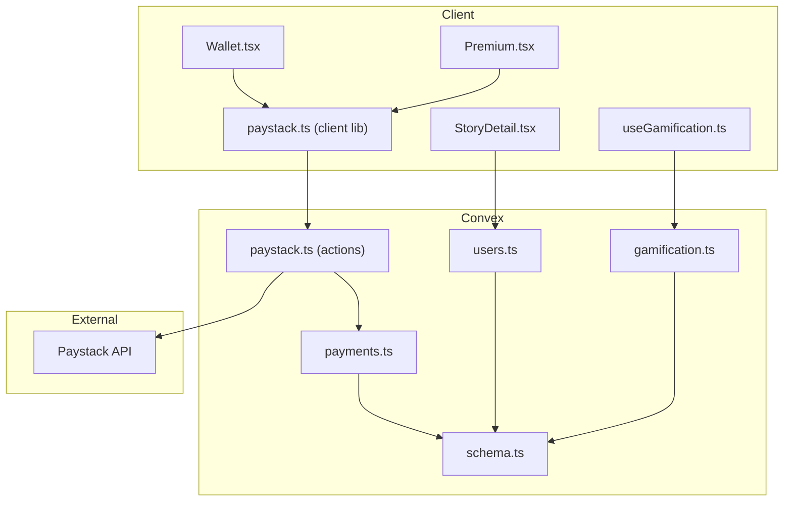
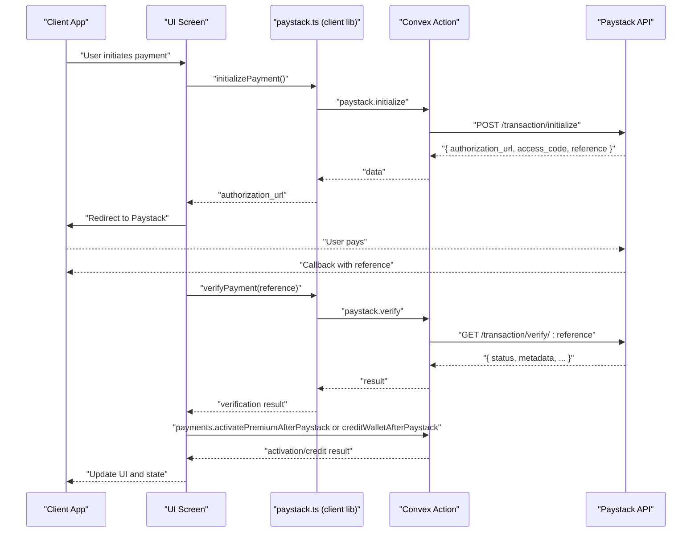
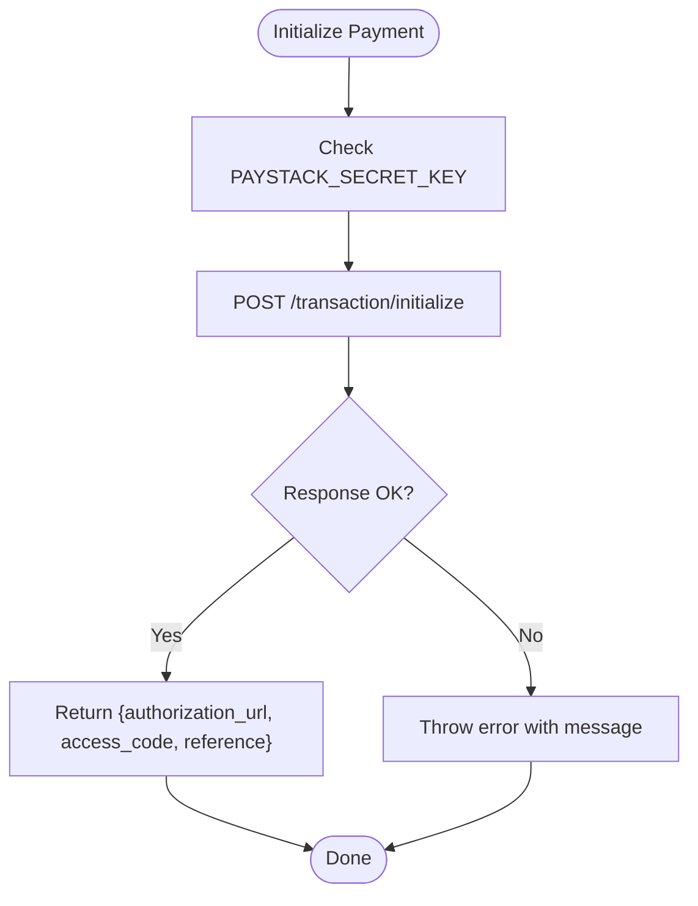
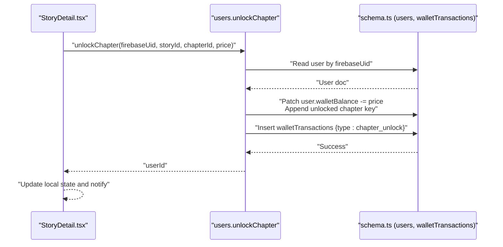
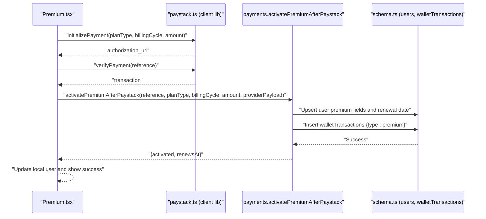
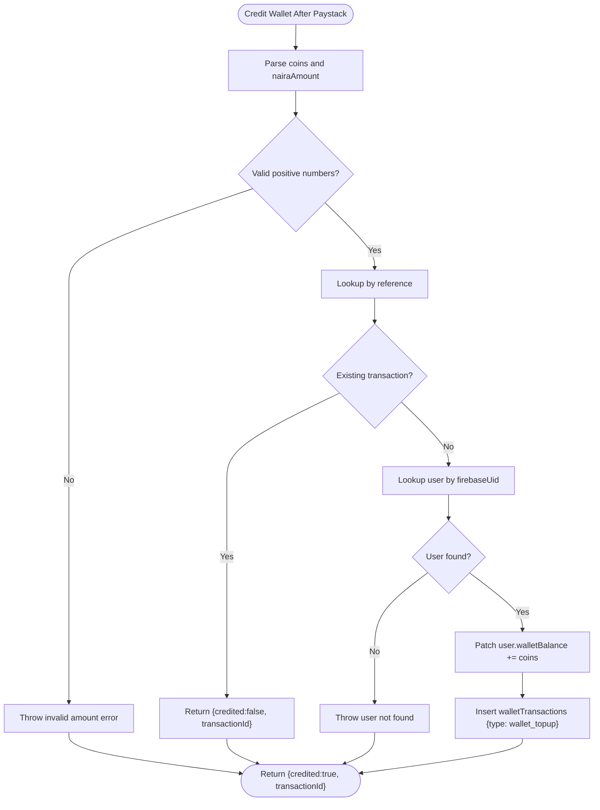
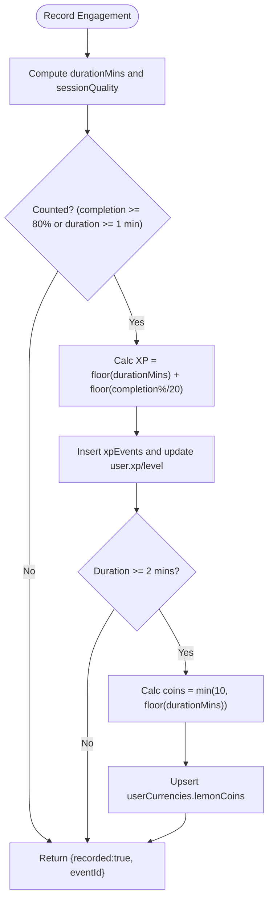
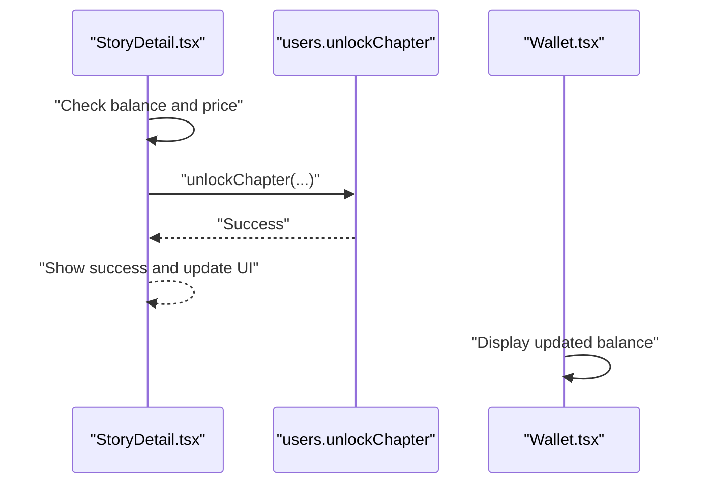
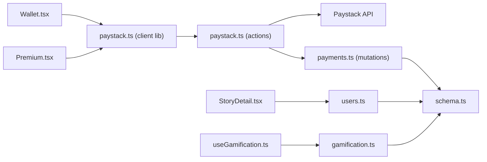

# Payment and Monetization Functions

<cite>
**Referenced Files in This Document**
- [payments.ts](file://convex/payments.ts)
- [paystack.ts](file://convex/paystack.ts)
- [users.ts](file://convex/users.ts)
- [schema.ts](file://convex/schema.ts)
- [paystack-initialize.ts](file://api/paystack-initialize.ts)
- [paystack-verify.ts](file://api/paystack-verify.ts)
- [paystack.ts (client lib)](file://src/lib/paystack.ts)
- [Wallet.tsx](file://src/screens/Wallet.tsx)
- [Premium.tsx](file://src/screens/Premium.tsx)
- [StoryDetail.tsx](file://src/screens/StoryDetail.tsx)
- [useGamification.ts](file://src/hooks/useGamification.ts)
- [gamification.ts](file://convex/gamification.ts)
- [badges.ts](file://src/data/badges.ts)
</cite>

## Table of Contents
1. [Introduction](#introduction)
2. [Project Structure](#project-structure)
3. [Core Components](#core-components)
4. [Architecture Overview](#architecture-overview)
5. [Detailed Component Analysis](#detailed-component-analysis)
6. [Dependency Analysis](#dependency-analysis)
7. [Performance Considerations](#performance-considerations)
8. [Troubleshooting Guide](#troubleshooting-guide)
9. [Conclusion](#conclusion)
10. [Appendices](#appendices)

## Introduction
This document explains the payment processing and monetization serverless functions powering Lemonade’s wallet, chapter unlocking, Paystack integration, and premium subscriptions. It also documents the gamification system for XP, streaks, weekly spins, and reward distribution, along with transaction recording, balance updates, and real-time synchronization. Practical examples illustrate payment initialization, verification workflows, and monetization strategies, and we address security considerations, error handling, and integration patterns with external payment processors.

## Project Structure
The monetization stack spans Convex serverless functions, client-side libraries, and UI screens:
- Convex functions implement wallet operations, premium lifecycle, and transaction recording.
- Paystack actions integrate with Paystack’s APIs for initialization and verification.
- Client library abstracts Paystack interactions and exposes helpers for amounts and references.
- UI screens orchestrate user flows for wallet top-ups and premium purchases.
- Gamification functions manage XP, streaks, and weekly spin rewards.

**Diagram sources**
- [paystack.ts:1-71](file://convex/paystack.ts#L1-L71)
- [payments.ts:1-291](file://convex/payments.ts#L1-L291)
- [users.ts:1-360](file://convex/users.ts#L1-L360)
- [gamification.ts:1-331](file://convex/gamification.ts#L1-L331)
- [schema.ts:1-495](file://convex/schema.ts#L1-L495)
- [paystack.ts (client lib):1-115](file://src/lib/paystack.ts#L1-L115)
- [Wallet.tsx:1-470](file://src/screens/Wallet.tsx#L1-L470)
- [Premium.tsx:1-360](file://src/screens/Premium.tsx#L1-L360)
- [StoryDetail.tsx:250-520](file://src/screens/StoryDetail.tsx#L250-L520)
- [useGamification.ts:1-48](file://src/hooks/useGamification.ts#L1-L48)

**Section sources**
- [paystack.ts:1-71](file://convex/paystack.ts#L1-L71)
- [payments.ts:1-291](file://convex/payments.ts#L1-L291)
- [users.ts:1-360](file://convex/users.ts#L1-L360)
- [gamification.ts:1-331](file://convex/gamification.ts#L1-L331)
- [schema.ts:1-495](file://convex/schema.ts#L1-L495)
- [paystack.ts (client lib):1-115](file://src/lib/paystack.ts#L1-L115)
- [Wallet.tsx:1-470](file://src/screens/Wallet.tsx#L1-L470)
- [Premium.tsx:1-360](file://src/screens/Premium.tsx#L1-L360)
- [StoryDetail.tsx:250-520](file://src/screens/StoryDetail.tsx#L250-L520)
- [useGamification.ts:1-48](file://src/hooks/useGamification.ts#L1-L48)

## Core Components
- Paystack Actions: Initialize and verify transactions via Paystack APIs.
- Payments Module: Records transactions, credits wallets, activates premium, cancels premium.
- Users Module: Manages user balances and unlocks chapters.
- Gamification Module: Tracks engagement, XP, streaks, and weekly spins.
- Client Paystack Library: Wraps Paystack initialization/verification and amount conversions.
- UI Screens: Drive user-initiated payment flows and premium upgrades.

**Section sources**
- [paystack.ts:1-71](file://convex/paystack.ts#L1-L71)
- [payments.ts:1-291](file://convex/payments.ts#L1-L291)
- [users.ts:1-360](file://convex/users.ts#L1-L360)
- [gamification.ts:1-331](file://convex/gamification.ts#L1-L331)
- [paystack.ts (client lib):1-115](file://src/lib/paystack.ts#L1-L115)
- [Wallet.tsx:1-470](file://src/screens/Wallet.tsx#L1-L470)
- [Premium.tsx:1-360](file://src/screens/Premium.tsx#L1-L360)
- [StoryDetail.tsx:250-520](file://src/screens/StoryDetail.tsx#L250-L520)

## Architecture Overview
The payment architecture integrates client-side Paystack calls with Convex actions and mutations. Initialization and verification are handled server-side for security, while UI screens trigger flows and update local state.

**Diagram sources**
- [paystack.ts (client lib):56-84](file://src/lib/paystack.ts#L56-L84)
- [paystack.ts:5-71](file://convex/paystack.ts#L5-L71)
- [Premium.tsx:39-101](file://src/screens/Premium.tsx#L39-L101)
- [Wallet.tsx:49-131](file://src/screens/Wallet.tsx#L49-L131)
- [payments.ts:113-172](file://convex/payments.ts#L113-L172)
- [payments.ts:174-263](file://convex/payments.ts#L174-L263)

## Detailed Component Analysis

### Paystack Integration (Actions)
- Purpose: Initialize and verify Paystack transactions securely via Convex actions.
- Security: Uses server-side secret keys and avoids exposing secrets in the client.
- Initialization: Supports amount-based or plan-based transactions with metadata and callback URLs.
- Verification: Confirms transaction status and returns structured data for downstream activation.

**Diagram sources**
- [paystack.ts:5-44](file://convex/paystack.ts#L5-L44)

**Section sources**
- [paystack.ts:1-71](file://convex/paystack.ts#L1-L71)
- [paystack-initialize.ts:1-47](file://api/paystack-initialize.ts#L1-L47)
- [paystack-verify.ts:1-36](file://api/paystack-verify.ts#L1-L36)

### Wallet Management
- addWalletBalance: Adds coins to a user’s wallet balance.
- unlockChapter: Deducts price from wallet and records a chapter unlock transaction.
- Real-time synchronization: UI reads user wallet balance and updates after mutations.

**Diagram sources**
- [users.ts:269-310](file://convex/users.ts#L269-L310)
- [schema.ts:198-223](file://convex/schema.ts#L198-L223)
- [StoryDetail.tsx:269-297](file://src/screens/StoryDetail.tsx#L269-L297)

**Section sources**
- [users.ts:129-147](file://convex/users.ts#L129-L147)
- [users.ts:269-310](file://convex/users.ts#L269-L310)
- [schema.ts:198-223](file://convex/schema.ts#L198-L223)
- [StoryDetail.tsx:269-297](file://src/screens/StoryDetail.tsx#L269-L297)

### Premium Subscription Handling
- Activation: After successful verification, activate premium with plan type, billing cycle, and renewal date.
- Cancellation: Allow cancellation at period end with appropriate state updates.
- Metadata routing: Accepts provider payload metadata to resolve user identity and amounts.

**Diagram sources**
- [Premium.tsx:39-101](file://src/screens/Premium.tsx#L39-L101)
- [payments.ts:174-263](file://convex/payments.ts#L174-L263)
- [schema.ts:24-62](file://convex/schema.ts#L24-L62)

**Section sources**
- [payments.ts:174-263](file://convex/payments.ts#L174-L263)
- [Premium.tsx:39-101](file://src/screens/Premium.tsx#L39-L101)
- [schema.ts:24-62](file://convex/schema.ts#L24-L62)

### Transaction Recording and Balance Updates
- record: Generic transaction recorder for wallet_topup, chapter_unlock, creator_support, premium, refund.
- creditWalletAfterPaystack: Idempotent credit after Paystack verification, inserts transaction and updates balance.
- Wallet listing: Queries by user and lists all transactions.

**Diagram sources**
- [payments.ts:113-172](file://convex/payments.ts#L113-L172)
- [schema.ts:198-223](file://convex/schema.ts#L198-L223)

**Section sources**
- [payments.ts:82-111](file://convex/payments.ts#L82-L111)
- [payments.ts:113-172](file://convex/payments.ts#L113-L172)
- [schema.ts:198-223](file://convex/schema.ts#L198-L223)

### Gamification System
- Engagement recording: Computes XP and optional Lemon Coins based on duration and completion.
- Level progression: Threshold-based leveling using cumulative XP.
- Weekly spin: Eligibility check and weighted random reward selection with immediate coin crediting.
- Streak management: Insurance purchase to extend protection, streak tracking, and milestone badges.

**Diagram sources**
- [gamification.ts:14-117](file://convex/gamification.ts#L14-L117)
- [schema.ts:356-429](file://convex/schema.ts#L356-L429)

**Section sources**
- [gamification.ts:14-117](file://convex/gamification.ts#L14-L117)
- [useGamification.ts:1-48](file://src/hooks/useGamification.ts#L1-L48)
- [badges.ts:1-9](file://src/data/badges.ts#L1-L9)

### UI Integration Examples
- Wallet top-up flow: Generates reference, initializes payment, redirects to Paystack, verifies, credits wallet, and updates UI.
- Premium upgrade flow: Initializes plan-based payment, verifies, activates premium, and updates local user state.
- Chapter unlock: Validates balance, locks chapter, debits wallet, records transaction, and notifies user.

**Diagram sources**
- [StoryDetail.tsx:269-297](file://src/screens/StoryDetail.tsx#L269-L297)
- [users.ts:269-310](file://convex/users.ts#L269-L310)
- [Wallet.tsx:1-470](file://src/screens/Wallet.tsx#L1-L470)

**Section sources**
- [Wallet.tsx:49-131](file://src/screens/Wallet.tsx#L49-L131)
- [Premium.tsx:39-101](file://src/screens/Premium.tsx#L39-L101)
- [StoryDetail.tsx:269-297](file://src/screens/StoryDetail.tsx#L269-L297)

## Dependency Analysis
- Convex actions depend on environment variables for Paystack secret keys.
- UI screens depend on the client Paystack library for initialization and verification.
- Payments module depends on schema-defined tables for users and walletTransactions.
- Gamification module depends on schema-defined tables for currencies, streaks, spins, and XP.

**Diagram sources**
- [paystack.ts (client lib):1-115](file://src/lib/paystack.ts#L1-L115)
- [paystack.ts:1-71](file://convex/paystack.ts#L1-L71)
- [payments.ts:1-291](file://convex/payments.ts#L1-L291)
- [users.ts:1-360](file://convex/users.ts#L1-L360)
- [gamification.ts:1-331](file://convex/gamification.ts#L1-L331)
- [schema.ts:1-495](file://convex/schema.ts#L1-L495)
- [Wallet.tsx:1-470](file://src/screens/Wallet.tsx#L1-L470)
- [Premium.tsx:1-360](file://src/screens/Premium.tsx#L1-L360)
- [StoryDetail.tsx:250-520](file://src/screens/StoryDetail.tsx#L250-L520)
- [useGamification.ts:1-48](file://src/hooks/useGamification.ts#L1-L48)

**Section sources**
- [paystack.ts:1-71](file://convex/paystack.ts#L1-L71)
- [payments.ts:1-291](file://convex/payments.ts#L1-L291)
- [users.ts:1-360](file://convex/users.ts#L1-L360)
- [gamification.ts:1-331](file://convex/gamification.ts#L1-L331)
- [schema.ts:1-495](file://convex/schema.ts#L1-L495)
- [paystack.ts (client lib):1-115](file://src/lib/paystack.ts#L1-L115)
- [Wallet.tsx:1-470](file://src/screens/Wallet.tsx#L1-L470)
- [Premium.tsx:1-360](file://src/screens/Premium.tsx#L1-L360)
- [StoryDetail.tsx:250-520](file://src/screens/StoryDetail.tsx#L250-L520)
- [useGamification.ts:1-48](file://src/hooks/useGamification.ts#L1-L48)

## Performance Considerations
- Index usage: Queries leverage indexes (e.g., by_firebaseUid, by_reference, by_userId) to minimize scan costs.
- Idempotency: Credit and premium activation checks prevent duplicate writes for the same reference.
- Batch reads/writes: UI screens batch related queries (e.g., profile, history, transactions) to reduce round-trips.
- Minimal client-side logic: Paystack operations are delegated to server actions to avoid heavy client computations.

[No sources needed since this section provides general guidance]

## Troubleshooting Guide
- Paystack secret key missing: Both Convex actions and client library check for environment variables and surface a normalized error message.
- Payment verification failure: UI screens display errors and prevent premium activation if status is not success.
- Insufficient balance: Chapter unlock throws an error if user lacks sufficient coins.
- Duplicate transactions: Premium and wallet credit functions check references to avoid double-credits.
- Environment configuration: Ensure Paystack secret keys are set in Convex environment and public keys in client environment variables.

**Section sources**
- [paystack.ts:15-18](file://convex/paystack.ts#L15-L18)
- [paystack.ts (client lib):37-51](file://src/lib/paystack.ts#L37-L51)
- [Premium.tsx:47-51](file://src/screens/Premium.tsx#L47-L51)
- [users.ts:282-282](file://convex/users.ts#L282-L282)
- [payments.ts:132-139](file://convex/payments.ts#L132-L139)
- [payments.ts:212-219](file://convex/payments.ts#L212-L219)

## Conclusion
The payment and monetization system combines secure Paystack actions, robust transaction recording, and real-time wallet updates. Premium subscriptions and chapter unlocking are tightly integrated with user state and transaction logs. The gamification system reinforces engagement through XP, streaks, and weekly spins. Together, these components provide a scalable, auditable, and user-friendly monetization pipeline.

[No sources needed since this section summarizes without analyzing specific files]

## Appendices

### API Definitions and Workflows

- Paystack Initialize
  - Method: POST
  - Path: Convex action or legacy API endpoint
  - Required fields: email, amount or plan, reference, metadata, callbackUrl
  - Returns: authorization_url, access_code, reference

- Paystack Verify
  - Method: GET
  - Path: Convex action or legacy API endpoint
  - Required fields: reference
  - Returns: transaction payload including status and metadata

- Wallet Top-up
  - Client: initializePayment -> verifyPayment -> creditWalletAfterPaystack
  - Server: creditWalletAfterPaystack updates user wallet and inserts transaction

- Premium Activation
  - Client: initializePayment (plan-based) -> verifyPayment -> activatePremiumAfterPaystack
  - Server: activatePremiumAfterPaystack sets premium fields and inserts transaction

- Chapter Unlock
  - Client: unlockChapter mutation
  - Server: debit wallet, append unlocked chapter key, insert transaction

**Section sources**
- [paystack.ts:5-71](file://convex/paystack.ts#L5-L71)
- [paystack-initialize.ts:1-47](file://api/paystack-initialize.ts#L1-L47)
- [paystack-verify.ts:1-36](file://api/paystack-verify.ts#L1-L36)
- [paystack.ts (client lib):56-84](file://src/lib/paystack.ts#L56-L84)
- [payments.ts:113-172](file://convex/payments.ts#L113-L172)
- [payments.ts:174-263](file://convex/payments.ts#L174-L263)
- [users.ts:269-310](file://convex/users.ts#L269-L310)