# Serverless Functions

<cite>
**Referenced Files in This Document**
- [users.ts](file://convex/users.ts)
- [stories.ts](file://convex/stories.ts)
- [payments.ts](file://convex/payments.ts)
- [paystack.ts](file://convex/paystack.ts)
- [applications.ts](file://convex/applications.ts)
- [interactions.ts](file://convex/interactions.ts)
- [gamification.ts](file://convex/gamification.ts)
- [admin.ts](file://convex/admin.ts)
- [settings.ts](file://convex/settings.ts)
- [files.ts](file://convex/files.ts)
- [ads.ts](file://convex/ads.ts)
- [migrate.ts](file://convex/migrate.ts)
- [schema.ts](file://convex/schema.ts)
- [mux-upload.ts](file://api/mux-upload.ts)
- [paystack-initialize.ts](file://api/paystack-initialize.ts)
- [paystack-verify.ts](file://api/paystack-verify.ts)
</cite>

## Update Summary
**Changes Made**
- Updated Content Interactions section to document new comment interaction functions
- Enhanced comment-related functions documentation to reflect bidirectional like/dislike interactions
- Added documentation for toggleDislikeComment, deleteComment with authorization checks, and enhanced getCommentCount
- Updated schema documentation to reflect comment table enhancements

## Table of Contents
1. [Introduction](#introduction)
2. [Project Structure](#project-structure)
3. [Core Components](#core-components)
4. [Architecture Overview](#architecture-overview)
5. [Detailed Component Analysis](#detailed-component-analysis)
6. [Dependency Analysis](#dependency-analysis)
7. [Performance Considerations](#performance-considerations)
8. [Troubleshooting Guide](#troubleshooting-guide)
9. [Conclusion](#conclusion)
10. [Appendices](#appendices)

## Introduction
This document describes the complete serverless function ecosystem powering the Convex backend. It covers user management, story lifecycle, payments and creator payouts, creator applications, content interactions, gamification and rewards, administration, platform settings, file handling, advertising, and database migrations. For each function group, we explain signatures, parameter validation, return types, error handling, authentication and authorization patterns, real-time update mechanisms, and integration with external services such as Firebase, Mux, and Paystack. We also provide performance and scalability guidance tailored for serverless execution.

## Project Structure
The backend is organized into Convex server functions under the convex/ directory and complementary Next.js API routes under api/ for external service integrations. The Convex schema defines the database model and indexes used by functions.

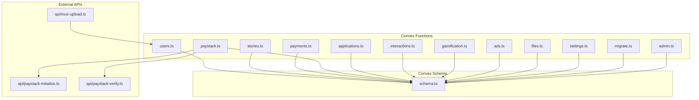

**Diagram sources**
- [users.ts](file://convex/users.ts)
- [stories.ts](file://convex/stories.ts)
- [payments.ts](file://convex/payments.ts)
- [paystack.ts](file://convex/paystack.ts)
- [applications.ts](file://convex/applications.ts)
- [interactions.ts](file://convex/interactions.ts)
- [gamification.ts](file://convex/gamification.ts)
- [ads.ts](file://convex/ads.ts)
- [files.ts](file://convex/files.ts)
- [settings.ts](file://convex/settings.ts)
- [migrate.ts](file://convex/migrate.ts)
- [admin.ts](file://convex/admin.ts)
- [schema.ts](file://convex/schema.ts)
- [mux-upload.ts](file://api/mux-upload.ts)
- [paystack-initialize.ts](file://api/paystack-initialize.ts)
- [paystack-verify.ts](file://api/paystack-verify.ts)

**Section sources**
- [schema.ts](file://convex/schema.ts)
- [users.ts](file://convex/users.ts)
- [stories.ts](file://convex/stories.ts)
- [payments.ts](file://convex/payments.ts)
- [paystack.ts](file://convex/paystack.ts)
- [applications.ts](file://convex/applications.ts)
- [interactions.ts](file://convex/interactions.ts)
- [gamification.ts](file://convex/gamification.ts)
- [ads.ts](file://convex/ads.ts)
- [files.ts](file://convex/files.ts)
- [settings.ts](file://convex/settings.ts)
- [migrate.ts](file://convex/migrate.ts)
- [admin.ts](file://convex/admin.ts)
- [mux-upload.ts](file://api/mux-upload.ts)
- [paystack-initialize.ts](file://api/paystack-initialize.ts)
- [paystack-verify.ts](file://api/paystack-verify.ts)

## Core Components
- Users: Authentication-linked profiles, roles, creator access, wallet, badges, and preferences.
- Stories: CRUD and lifecycle management with status and indexing.
- Payments: Wallet transactions, premium activation, payouts, and provider callbacks.
- Paystack: Actions to initialize and verify transactions via Paystack.
- Applications: Creator application lifecycle with status transitions and user role updates.
- Interactions: Following, saving, reading history, comments, and likes/dislikes.
- Gamification: Engagement scoring, XP, streaks, weekly spins, and currencies.
- Admin: Analytics, reporting, moderation, fraud detection, and spin reward management.
- Settings: Platform-wide configuration with defaults.
- Files: Storage upload URL generation and retrieval.
- Ads: Ad selection, event tracking, creator revenue, and campaign management.
- Migrations: Data fixes for schema evolution.
- External Integrations: Mux video upload and Paystack initialization/verification.

**Section sources**
- [users.ts](file://convex/users.ts)
- [stories.ts](file://convex/stories.ts)
- [payments.ts](file://convex/payments.ts)
- [paystack.ts](file://convex/paystack.ts)
- [applications.ts](file://convex/applications.ts)
- [interactions.ts](file://convex/interactions.ts)
- [gamification.ts](file://convex/gamification.ts)
- [admin.ts](file://convex/admin.ts)
- [settings.ts](file://convex/settings.ts)
- [files.ts](file://convex/files.ts)
- [ads.ts](file://convex/ads.ts)
- [migrate.ts](file://convex/migrate.ts)

## Architecture Overview
The serverless runtime orchestrates Convex mutations and queries against a strongly indexed schema. Functions enforce validation, transform data, and persist changes atomically. External services are integrated via Convex actions (paystack.ts) and Next.js API routes (mux-upload.ts, paystack-initialize.ts, paystack-verify.ts). Real-time updates occur through Convex subscriptions and client-side cache invalidation.

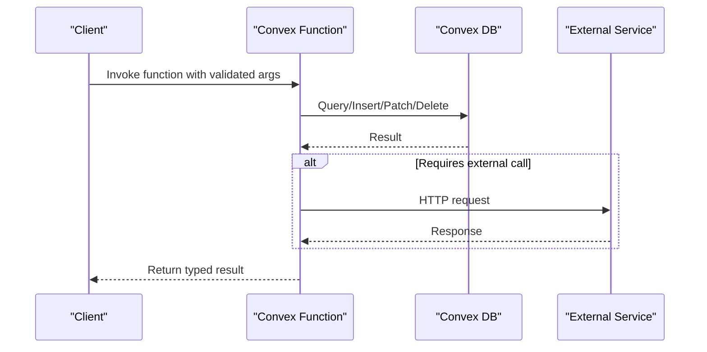

[No sources needed since this diagram shows conceptual workflow, not actual code structure]

## Detailed Component Analysis

### Users
- Purpose: Manage user profiles, roles, statuses, wallet, badges, and preferences.
- Key functions:
  - Queries: list, getByUsername, getByFirebaseUid, getFullProfile.
  - Mutations: upsertFromAuth, updateRole, setStatus, addWalletBalance, updateProfile, createNotification, unlockChapter, toggleSave, toggleFollow.
- Validation and errors:
  - Username normalization and regex validation.
  - Unique constraints enforced via indexes (by_username, by_firebaseUid).
  - Errors thrown for missing users and insufficient balance.
- Authentication/authorization:
  - Many functions accept a Firebase UID to bind operations to authenticated users.
  - Role-based access is enforced by downstream UI and admin controls.
- Real-time updates:
  - Subscriptions to notifications and reading history enable live UI updates.
- Examples:
  - Upsert user from auth provider.
  - Unlock chapter and record transaction.
  - Toggle save/unsave story.

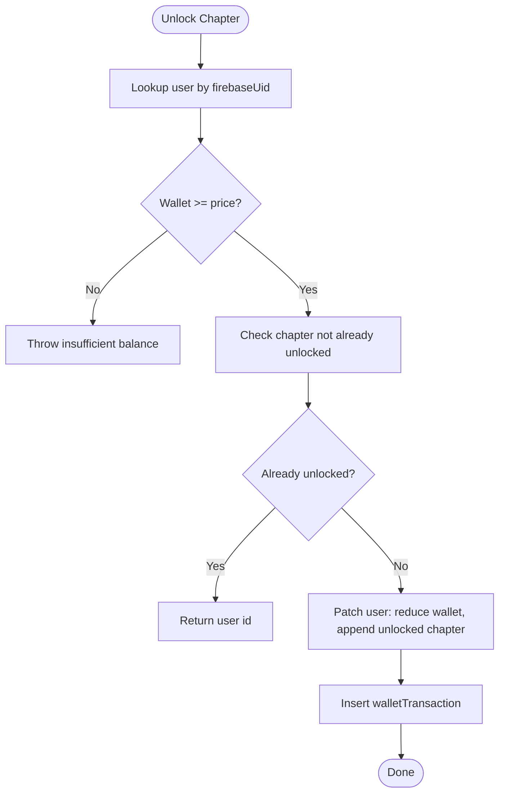

**Diagram sources**
- [users.ts](file://convex/users.ts)

**Section sources**
- [users.ts](file://convex/users.ts)
- [schema.ts](file://convex/schema.ts)

### Stories
- Purpose: Create, update, list, and manage story lifecycle.
- Key functions:
  - Queries: listPublished, listFeatured, getByExternalId, listByCreator.
  - Mutations: create, update, incrementViews, publish.
- Validation and errors:
  - Prevents duplicate external IDs; enforces status transitions.
- Indexes:
  - by_status, by_featured, by_externalId, by_creatorUsername.
- Real-time updates:
  - Frontend subscribes to story views and status changes.

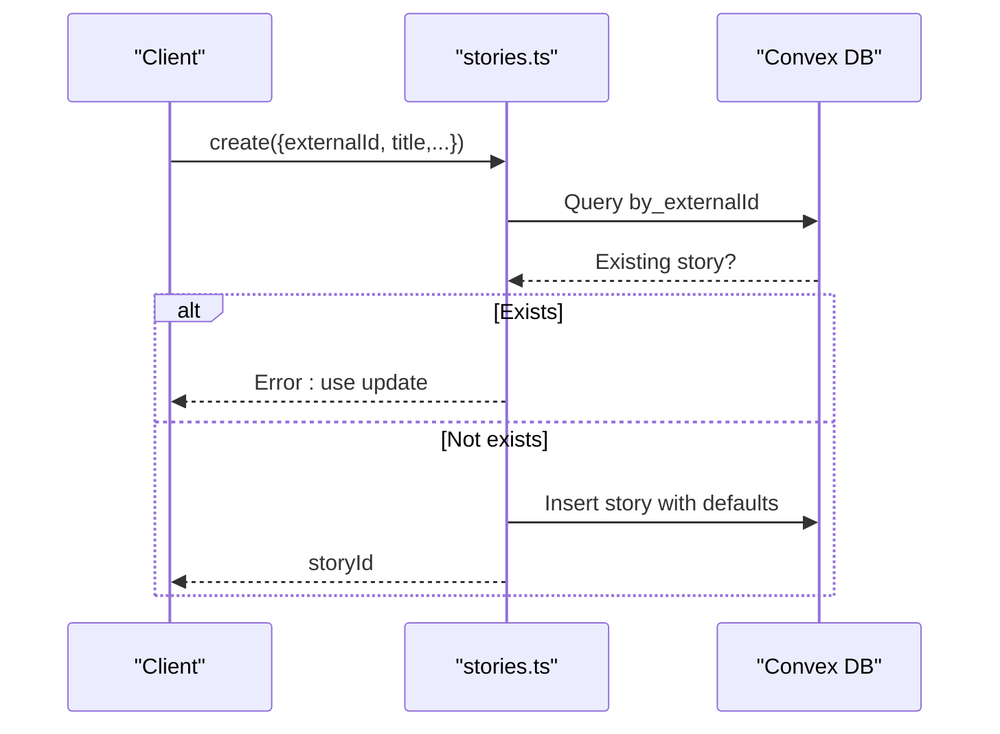

**Diagram sources**
- [stories.ts](file://convex/stories.ts)

**Section sources**
- [stories.ts](file://convex/stories.ts)
- [schema.ts](file://convex/schema.ts)

### Payments and Creator Payouts
- Purpose: Record wallet transactions, credit wallets, activate premium, cancel premium, and compute creator payout summaries.
- Key functions:
  - Queries: list, listByUser, creatorPayoutSummary.
  - Mutations: record, creditWalletAfterPaystack, activatePremiumAfterPaystack, cancelPremium.
- Validation and errors:
  - Amounts validated as finite positive numbers.
  - Reference deduplication prevents double crediting.
- Real-time updates:
  - Wallet balance and premium status changes propagate to clients.

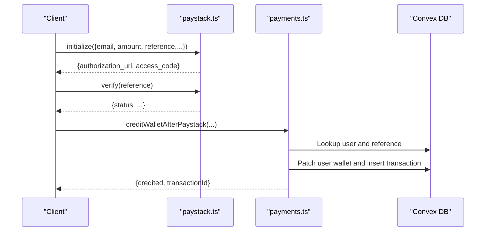

**Diagram sources**
- [paystack.ts](file://convex/paystack.ts)
- [payments.ts](file://convex/payments.ts)

**Section sources**
- [payments.ts](file://convex/payments.ts)
- [paystack.ts](file://convex/paystack.ts)
- [schema.ts](file://convex/schema.ts)

### Creator Applications
- Purpose: Manage creator application lifecycle and promote approved applicants to creators.
- Key functions:
  - Queries: list, listByStatus, getById.
  - Mutations: submit, review.
- Validation and errors:
  - Enriches application with user info; updates user role upon approval.
- Real-time updates:
  - Admin activity logs and notifications reflect state changes.

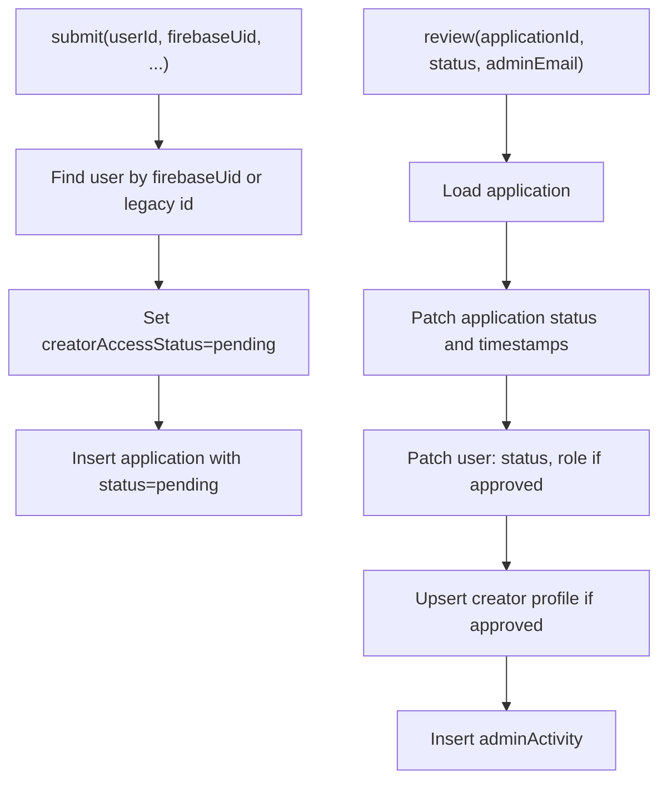

**Diagram sources**
- [applications.ts](file://convex/applications.ts)

**Section sources**
- [applications.ts](file://convex/applications.ts)
- [schema.ts](file://convex/schema.ts)

### Content Interactions
- Purpose: Follow/unfollow creators, save/unsave stories, track reading, and manage comments with bidirectional like/dislike interactions.
- Key functions:
  - followCreator, unfollowCreator, saveStory, unsaveStory, trackReading, trackReadingByFirebaseUid, createComment, listComments, listCommentsPaged, toggleLikeComment, **toggleDislikeComment**, **deleteComment**, **getCommentCount**.
- Validation and errors:
  - Ensures user exists for UID-based tracking.
  - **Enhanced comment authorization**: deleteComment now requires either author ownership or admin role.
- Real-time updates:
  - Live comment lists, like/dislike counts, and comment deletion notifications.
- **Updated** Bidirectional like/dislike interactions:
  - toggleLikeComment and toggleDislikeComment now support mutual exclusivity (removing opposite vote when switching).
  - Both functions return updated likesCount and dislikesCount for real-time UI updates.

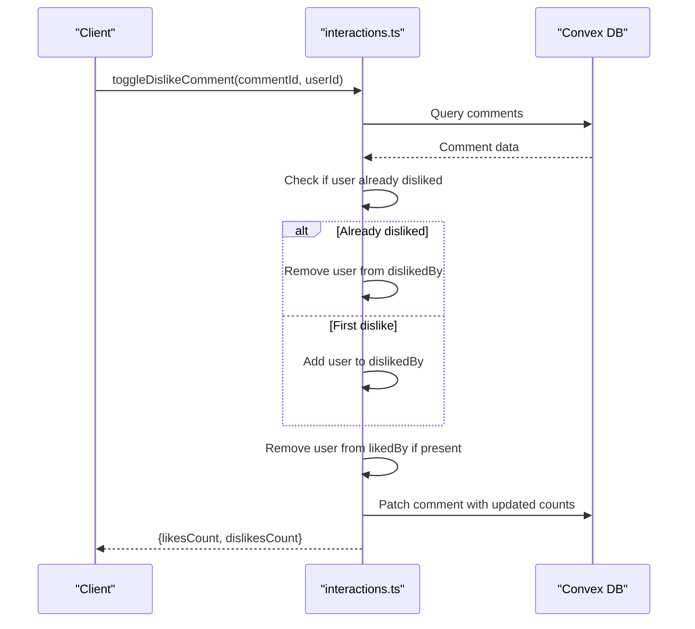

**Diagram sources**
- [interactions.ts](file://convex/interactions.ts)

**Section sources**
- [interactions.ts](file://convex/interactions.ts)
- [schema.ts](file://convex/schema.ts)

### Gamification and Rewards
- Purpose: Record engagement, award XP/coins, manage streaks, and run weekly spins.
- Key functions:
  - recordEngagement, eligibleForWeeklySpin, performWeeklySpin, useStreakInsurance, getUserStreak, getUserCurrencies.
- Scoring:
  - Duration, completion percentage, and scroll completion drive XP and coin rewards.
- Real-time updates:
  - Level-ups and currency changes update client dashboards.

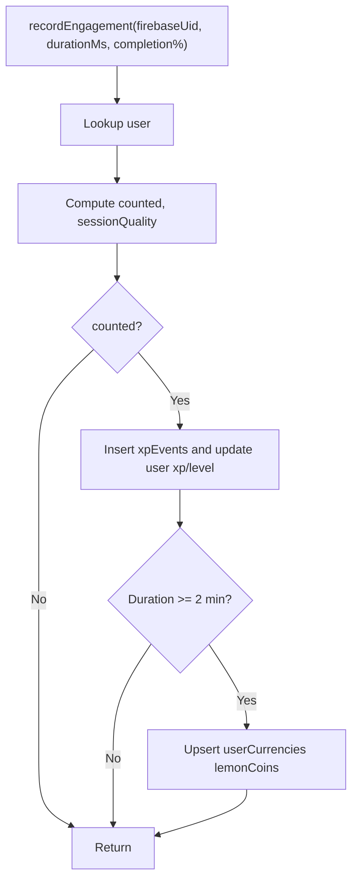

**Diagram sources**
- [gamification.ts](file://convex/gamification.ts)

**Section sources**
- [gamification.ts](file://convex/gamification.ts)
- [schema.ts](file://convex/schema.ts)

### Administration
- Purpose: Analytics, reporting, moderation, fraud detection, and spin reward management.
- Key functions:
  - overview, analytics, premium, listReports, createReport, resolveReport, listActivity, logActivity, listModerators, listSpinRewards, createSpinReward, updateSpinReward, deleteSpinReward, scanEngagementForFraud, listFraudEvents, resolveFraudEvent.
- Real-time updates:
  - Admin dashboards react to new reports, activities, and fraud events.

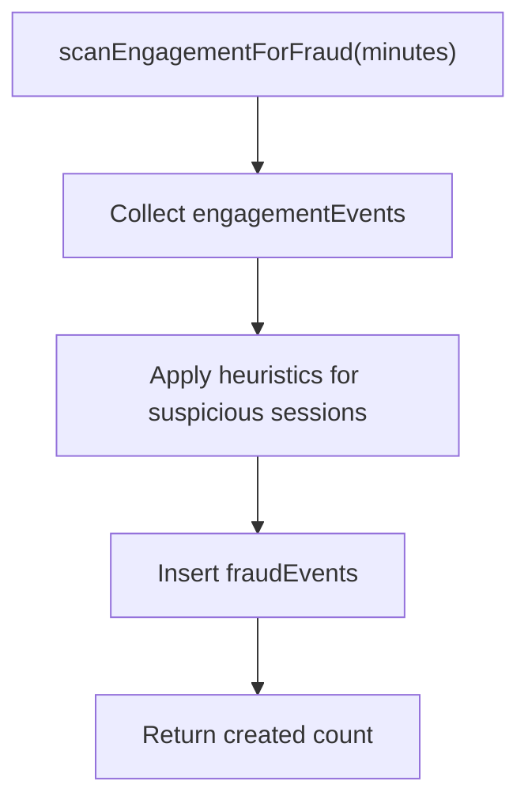

**Diagram sources**
- [admin.ts](file://convex/admin.ts)

**Section sources**
- [admin.ts](file://convex/admin.ts)
- [schema.ts](file://convex/schema.ts)

### Platform Settings
- Purpose: Retrieve and update platform-wide settings with defaults.
- Key functions:
  - get, update.

**Section sources**
- [settings.ts](file://convex/settings.ts)
- [schema.ts](file://convex/schema.ts)

### File Handling
- Purpose: Generate upload URLs and retrieve stored files.
- Key functions:
  - generateUploadUrl, getUrl.

**Section sources**
- [files.ts](file://convex/files.ts)
- [schema.ts](file://convex/schema.ts)

### Advertising System
- Purpose: Select ads for content, track events, and compute creator revenue.
- Key functions:
  - selectForContent, trackEvent, creatorSummary, adminSummary, listCampaigns, createCampaign, updateCampaignStatus.
- Revenue split:
  - Creator share and platform share computed per event.
- Real-time updates:
  - Creator revenue summaries and admin KPIs.

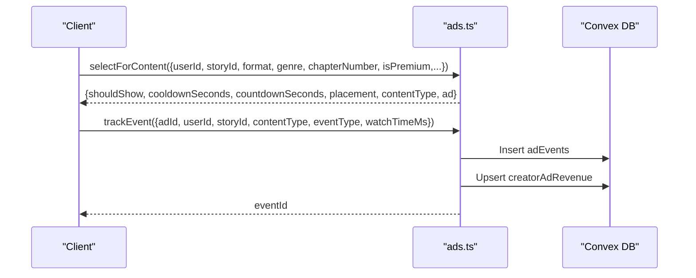

**Diagram sources**
- [ads.ts](file://convex/ads.ts)

**Section sources**
- [ads.ts](file://convex/ads.ts)
- [schema.ts](file://convex/schema.ts)

### Database Migrations
- Purpose: Fix schema inconsistencies post-deploy.
- Key function:
  - fixCategoryFields: Normalize creators.category to single string.

**Section sources**
- [migrate.ts](file://convex/migrate.ts)
- [schema.ts](file://convex/schema.ts)

### External Service Integrations
- Mux Video Upload:
  - Generates signed upload URLs using Mux credentials.
- Paystack Initialization and Verification:
  - Initialize transactions and verify payment status via Paystack API.

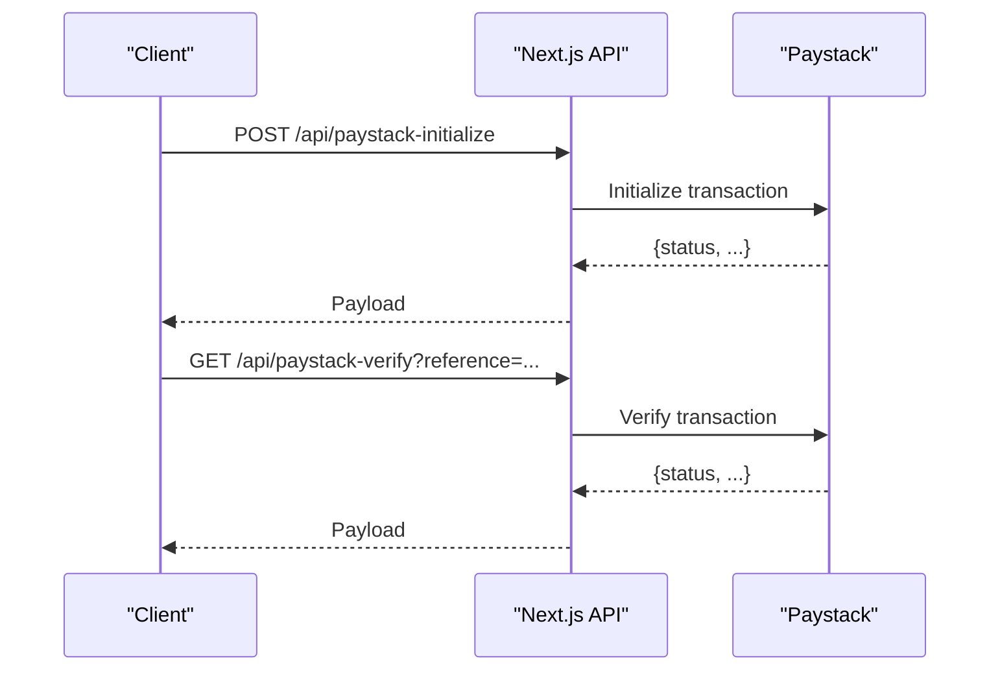

**Diagram sources**
- [mux-upload.ts](file://api/mux-upload.ts)
- [paystack-initialize.ts](file://api/paystack-initialize.ts)
- [paystack-verify.ts](file://api/paystack-verify.ts)

**Section sources**
- [mux-upload.ts](file://api/mux-upload.ts)
- [paystack-initialize.ts](file://api/paystack-initialize.ts)
- [paystack-verify.ts](file://api/paystack-verify.ts)

## Dependency Analysis
- Internal dependencies:
  - Functions depend on the schema's tables and indexes.
  - Cross-module dependencies: users.ts interacts with creators and notifications; payments.ts integrates with users and walletTransactions; ads.ts integrates with creators and adEvents.
- External dependencies:
  - Paystack SDK via Convex actions.
  - Mux SDK via Next.js API route.
- Coupling and cohesion:
  - Cohesion is strong within functional domains; coupling is minimized by explicit argument contracts and typed Convex values.

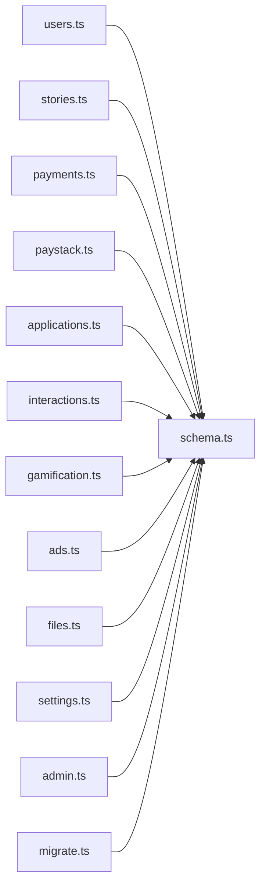

**Diagram sources**
- [schema.ts](file://convex/schema.ts)
- [users.ts](file://convex/users.ts)
- [stories.ts](file://convex/stories.ts)
- [payments.ts](file://convex/payments.ts)
- [paystack.ts](file://convex/paystack.ts)
- [applications.ts](file://convex/applications.ts)
- [interactions.ts](file://convex/interactions.ts)
- [gamification.ts](file://convex/gamification.ts)
- [ads.ts](file://convex/ads.ts)
- [files.ts](file://convex/files.ts)
- [settings.ts](file://convex/settings.ts)
- [admin.ts](file://convex/admin.ts)
- [migrate.ts](file://convex/migrate.ts)

**Section sources**
- [schema.ts](file://convex/schema.ts)

## Performance Considerations
- Query efficiency:
  - Use schema indexes (e.g., by_username, by_firebaseUid, by_status) to avoid full scans.
- Batch reads/writes:
  - Use Promise.all for concurrent reads (e.g., user profile aggregation).
- Idempotency:
  - Deduplicate references for payments and prevent duplicate unlocks.
- Caching:
  - Cache frequently accessed settings and ad campaigns at the edge or client.
- Concurrency:
  - Prefer atomic patches and inserts; avoid read-modify-write races.
- Serverless budgets:
  - Keep function bodies small; offload heavy processing to background jobs if needed.

## Troubleshooting Guide
- Common errors:
  - "User not found" when operating on non-existent users.
  - "Insufficient balance" during chapter unlock.
  - "Story not found" or "already published" during publish.
  - "Invalid coin amount" or "invalid naira amount" in payment functions.
  - "No active spin inventory configured" when spinning weekly rewards.
  - **"Not authorized to delete this comment"** when attempting to delete unauthorized comments.
- Diagnostics:
  - Inspect walletTransactions and engagementEvents for discrepancies.
  - Review adminActivity and fraudEvents for moderation insights.
  - Verify Paystack secret keys and Mux credentials in environment variables.
  - **Check comment authorId and user role for authorization failures**.
- Recovery:
  - Use migrations to fix schema inconsistencies.
  - Re-run verification flows for failed payments.

**Section sources**
- [users.ts](file://convex/users.ts)
- [stories.ts](file://convex/stories.ts)
- [payments.ts](file://convex/payments.ts)
- [paystack.ts](file://convex/paystack.ts)
- [gamification.ts](file://convex/gamification.ts)
- [admin.ts](file://convex/admin.ts)
- [migrate.ts](file://convex/migrate.ts)
- [interactions.ts](file://convex/interactions.ts)

## Conclusion
The Convex backend organizes functionality into cohesive, strongly-typed serverless functions backed by a well-indexed schema. Robust validation, clear authorization patterns, and explicit integrations with Firebase, Mux, and Paystack deliver a scalable and maintainable system. Admin and gamification modules provide powerful operational and engagement capabilities, while migrations ensure schema health over time. **Recent enhancements to comment interactions** provide a richer social experience with bidirectional voting and improved moderation capabilities.

## Appendices

### Function Invocation Patterns
- Authentication:
  - Many functions require a Firebase UID to bind to the authenticated user.
- Parameter validation:
  - Use Convex v.union, v.literal, and v.optional to enforce strict shapes.
- Return types:
  - Functions return either inserted ids, patched ids, or computed aggregates.
- **Comment Interaction Authorization**:
  - **deleteComment**: Requires either author ownership (authorId matches userId) or admin role (user.role === "admin").
  - **toggleLikeComment/toggleDislikeComment**: No authorization required beyond existence checks.
  - **Enhanced getCommentCount**: Returns root comment count for story/chapter context.

**Section sources**
- [interactions.ts](file://convex/interactions.ts)
- [schema.ts](file://convex/schema.ts)