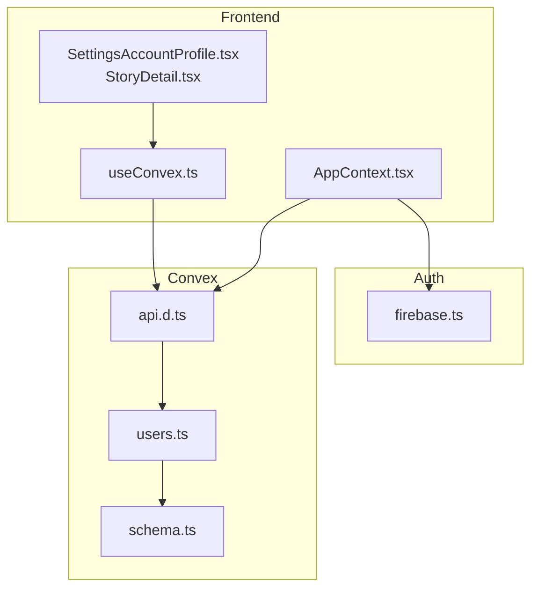
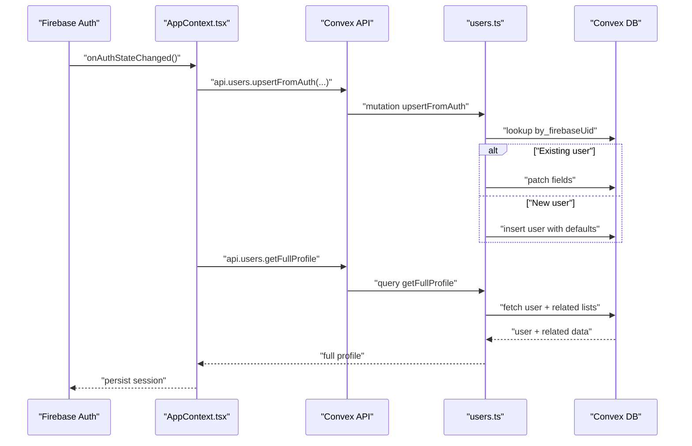
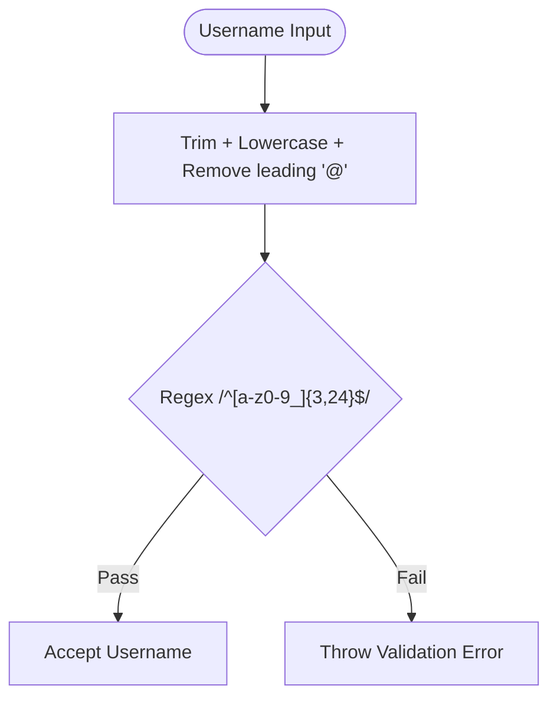
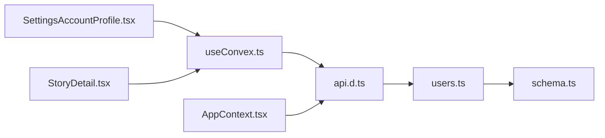

# User Management Functions

<cite>
**Referenced Files in This Document**
- [users.ts](file://convex/users.ts)
- [schema.ts](file://convex/schema.ts)
- [AppContext.tsx](file://src/contexts/AppContext.tsx)
- [useConvex.ts](file://src/hooks/useConvex.ts)
- [SettingsAccountProfile.tsx](file://src/screens/settings/SettingsAccountProfile.tsx)
- [StoryDetail.tsx](file://src/screens/StoryDetail.tsx)
- [firebase.ts](file://src/lib/firebase.ts)
- [convex.ts](file://src/lib/convex.ts)
- [types.ts](file://src/data/types.ts)
- [api.d.ts](file://convex/_generated/api.d.ts)
</cite>

## Table of Contents
1. [Introduction](#introduction)
2. [Project Structure](#project-structure)
3. [Core Components](#core-components)
4. [Architecture Overview](#architecture-overview)
5. [Detailed Component Analysis](#detailed-component-analysis)
6. [Dependency Analysis](#dependency-analysis)
7. [Performance Considerations](#performance-considerations)
8. [Troubleshooting Guide](#troubleshooting-guide)
9. [Conclusion](#conclusion)

## Introduction
This document describes the user management serverless functions powering the Lemonade platform. It covers the complete user lifecycle, including authentication integration with Firebase via upsertFromAuth, profile management (updateProfile, getFullProfile), role management (updateRole, setStatus), wallet operations (addWalletBalance, unlockChapter), and social features (toggleSave, toggleFollow). It explains function signatures, parameter validation, return types, error handling, username normalization and validation, role-based access control patterns, and real-time update mechanisms. Examples of invocation patterns, data transformation logic, and integration with the users table schema are included, along with performance considerations for queries and mutations.

## Project Structure
The user management logic is implemented as Convex serverless functions in the convex module and consumed by the frontend through React hooks and context. Authentication is handled by Firebase, with seamless synchronization to the Convex users table.

**Diagram sources**
- [AppContext.tsx:611-634](file://src/contexts/AppContext.tsx#L611-L634)
- [useConvex.ts:167-171](file://src/hooks/useConvex.ts#L167-L171)
- [SettingsAccountProfile.tsx:1-150](file://src/screens/settings/SettingsAccountProfile.tsx#L1-L150)
- [StoryDetail.tsx:257-302](file://src/screens/StoryDetail.tsx#L257-L302)
- [firebase.ts:1-55](file://src/lib/firebase.ts#L1-L55)
- [api.d.ts:59-62](file://convex/_generated/api.d.ts#L59-L62)
- [users.ts:42-90](file://convex/users.ts#L42-L90)
- [schema.ts:24-67](file://convex/schema.ts#L24-L67)

**Section sources**
- [users.ts:1-360](file://convex/users.ts#L1-L360)
- [schema.ts:24-67](file://convex/schema.ts#L24-L67)
- [AppContext.tsx:611-634](file://src/contexts/AppContext.tsx#L611-L634)
- [useConvex.ts:167-171](file://src/hooks/useConvex.ts#L167-L171)
- [SettingsAccountProfile.tsx:1-150](file://src/screens/settings/SettingsAccountProfile.tsx#L1-L150)
- [StoryDetail.tsx:257-302](file://src/screens/StoryDetail.tsx#L257-L302)
- [firebase.ts:1-55](file://src/lib/firebase.ts#L1-L55)
- [api.d.ts:59-62](file://convex/_generated/api.d.ts#L59-L62)

## Core Components
- Authentication integration: upsertFromAuth synchronizes Firebase users into the Convex users table, normalizing usernames and setting defaults for new users.
- Profile management: updateProfile updates user attributes with validation and username change constraints; getFullProfile aggregates user data with related collections.
- Role management: updateRole and setStatus modify user role and status respectively.
- Wallet operations: addWalletBalance increments wallet balance; unlockChapter deducts balance and records a transaction.
- Social features: toggleSave toggles saved stories; toggleFollow toggles followed creators.

**Section sources**
- [users.ts:42-90](file://convex/users.ts#L42-L90)
- [users.ts:183-243](file://convex/users.ts#L183-L243)
- [users.ts:149-181](file://convex/users.ts#L149-L181)
- [users.ts:92-127](file://convex/users.ts#L92-L127)
- [users.ts:129-147](file://convex/users.ts#L129-L147)
- [users.ts:269-310](file://convex/users.ts#L269-L310)
- [users.ts:311-334](file://convex/users.ts#L311-L334)
- [users.ts:336-359](file://convex/users.ts#L336-L359)

## Architecture Overview
The system integrates Firebase authentication with Convex serverless functions. On sign-in/sign-up, the app invokes upsertFromAuth to create or update a user record. Subsequent operations use typed function references from the generated API to call mutations and queries.

**Diagram sources**
- [AppContext.tsx:611-634](file://src/contexts/AppContext.tsx#L611-L634)
- [users.ts:42-90](file://convex/users.ts#L42-L90)
- [users.ts:149-181](file://convex/users.ts#L149-L181)
- [api.d.ts:59-62](file://convex/_generated/api.d.ts#L59-L62)

## Detailed Component Analysis

### Authentication Integration: upsertFromAuth
- Purpose: Upsert user from Firebase credentials into Convex users table.
- Inputs:
  - firebaseUid: string
  - email: optional string
  - name: string
  - username: string
  - avatar: optional string
- Behavior:
  - Lookup by firebaseUid index.
  - If existing, patch fields (only populating missing fields).
  - If new, normalize and validate username, then insert with defaults (role, status, wallet, arrays, timestamps).
- Outputs: Returns the user document ID.
- Errors: None thrown on lookup miss; throws if username normalization fails validation.
- Real-time: Called during auth state sync; subsequent getFullProfile provides enriched data.

**Section sources**
- [users.ts:42-90](file://convex/users.ts#L42-L90)
- [AppContext.tsx:611-634](file://src/contexts/AppContext.tsx#L611-L634)

### Username Normalization and Validation
- Normalization: Trim, lowercase, strip leading @.
- Validation: 3–24 chars, only lowercase letters, digits, underscore.
- Enforcement: Applied in upsertFromAuth for new users and in updateProfile for edits.

**Diagram sources**
- [users.ts:7-13](file://convex/users.ts#L7-L13)

**Section sources**
- [users.ts:7-13](file://convex/users.ts#L7-L13)

### Profile Management: updateProfile
- Purpose: Update user profile fields with validation and constraints.
- Inputs:
  - firebaseUid: string
  - name: optional string
  - username: optional string
  - bio: optional string
  - avatar: optional string
  - banner: optional string
  - settings: optional JSON
- Constraints:
  - Username change interval: once every 90 days.
  - Username uniqueness check per username index.
  - Username normalization and validation applied before change.
- Outputs: Returns the user document ID.
- Errors: Throws if user not found, username taken, or within cooldown.

**Section sources**
- [users.ts:183-243](file://convex/users.ts#L183-L243)
- [SettingsAccountProfile.tsx:219-238](file://src/screens/settings/SettingsAccountProfile.tsx#L219-L238)

### Profile Retrieval: getFullProfile
- Purpose: Fetch user with related reading history, notifications, and wallet transactions.
- Inputs: firebaseUid: string
- Behavior: Queries user by index, then concurrently fetches related collections.
- Outputs: User object augmented with arrays of related entities.
- Errors: Returns null if user not found.

**Section sources**
- [users.ts:149-181](file://convex/users.ts#L149-L181)

### Role Management: updateRole and setStatus
- Purpose: Modify user role and status.
- Inputs:
  - updateRole: username (string), role (enum: guest, reader, creator, admin)
  - setStatus: username (string), status (enum: active, suspended)
- Behavior: Lookup by username index, patch field, update timestamps.
- Outputs: Returns user document ID or null if not found.

**Section sources**
- [users.ts:92-127](file://convex/users.ts#L92-L127)

### Wallet Operations: addWalletBalance and unlockChapter
- addWalletBalance
  - Inputs: firebaseUid (string), amount (number)
  - Behavior: Lookup by firebaseUid, increment walletBalance, update timestamps.
  - Outputs: Returns user document ID or null if not found.
- unlockChapter
  - Inputs: firebaseUid (string), storyId (string), chapterId (string), price (number)
  - Behavior: Validate user exists and sufficient balance, deduplicate chapter key, update balance and unlocked chapters, insert wallet transaction.
  - Outputs: Returns user document ID.
  - Errors: Throws if user not found or insufficient balance.

**Section sources**
- [users.ts:129-147](file://convex/users.ts#L129-L147)
- [users.ts:269-310](file://convex/users.ts#L269-L310)

### Social Features: toggleSave and toggleFollow
- toggleSave
  - Inputs: firebaseUid (string), storyId (string)
  - Behavior: Toggle story in savedStories array; update timestamps.
  - Outputs: Object indicating new isSaved state.
- toggleFollow
  - Inputs: firebaseUid (string), creatorUsername (string)
  - Behavior: Toggle creator in followedCreators array; update timestamps.
  - Outputs: Object indicating new isFollowed state.

**Section sources**
- [users.ts:311-334](file://convex/users.ts#L311-L334)
- [users.ts:336-359](file://convex/users.ts#L336-L359)

### Frontend Invocation Patterns
- Auth sync and profile retrieval:
  - AppContext invokes upsertFromAuth and then getFullProfile on auth state changes.
- Profile updates:
  - SettingsAccountProfile uses useUpdateUserProfile hook to call updateProfile.
- Social actions:
  - StoryDetail and AppContext call toggleSave and toggleFollow mutations.
- Wallet unlock:
  - StoryDetail invokes unlockChapter mutation after balance checks.

**Section sources**
- [AppContext.tsx:611-634](file://src/contexts/AppContext.tsx#L611-L634)
- [useConvex.ts:167-171](file://src/hooks/useConvex.ts#L167-L171)
- [StoryDetail.tsx:257-302](file://src/screens/StoryDetail.tsx#L257-L302)
- [SettingsAccountProfile.tsx:100-130](file://src/screens/settings/SettingsAccountProfile.tsx#L100-L130)

## Dependency Analysis
- Generated API binding: api.d.ts exposes public function references used by hooks and context.
- Users table schema: defines indexes and fields used by queries and mutations.
- Frontend-to-backend contracts: hooks encapsulate Convex client usage and pass validated arguments.

**Diagram sources**
- [useConvex.ts:167-171](file://src/hooks/useConvex.ts#L167-L171)
- [api.d.ts:59-62](file://convex/_generated/api.d.ts#L59-L62)
- [users.ts:42-90](file://convex/users.ts#L42-L90)
- [schema.ts:24-67](file://convex/schema.ts#L24-L67)
- [AppContext.tsx:611-634](file://src/contexts/AppContext.tsx#L611-L634)
- [SettingsAccountProfile.tsx:1-150](file://src/screens/settings/SettingsAccountProfile.tsx#L1-L150)
- [StoryDetail.tsx:257-302](file://src/screens/StoryDetail.tsx#L257-L302)

**Section sources**
- [api.d.ts:59-62](file://convex/_generated/api.d.ts#L59-L62)
- [schema.ts:24-67](file://convex/schema.ts#L24-L67)
- [users.ts:42-90](file://convex/users.ts#L42-L90)
- [useConvex.ts:167-171](file://src/hooks/useConvex.ts#L167-L171)
- [AppContext.tsx:611-634](file://src/contexts/AppContext.tsx#L611-L634)

## Performance Considerations
- Index usage: All primary lookups use indexed fields (by_firebaseUid, by_username, by_userId) to avoid full scans.
- Concurrency: getFullProfile performs concurrent reads for related collections; ensure related tables are indexed for efficient joins.
- Write patterns: Mutations update single fields or small arrays; avoid unnecessary writes by validating inputs first.
- Real-time freshness: Some UIs update locally before calling mutations; ensure optimistic updates are reconciled on server results.
- Cost controls: Follow hot-path rules—prefer pushing filters to storage via indexes, minimize row sizes, and skip no-op writes.

[No sources needed since this section provides general guidance]

## Troubleshooting Guide
- User not found errors:
  - updateProfile, unlockChapter, toggleSave, toggleFollow throw if the user cannot be found by the provided identifier.
- Username conflicts:
  - updateProfile validates uniqueness and cooldown; adjust UI messaging to reflect 90-day lock and taken usernames.
- Insufficient balance:
  - unlockChapter throws if walletBalance is less than price; surface a friendly message and guide users to top up.
- Auth sync failures:
  - AppContext falls back to a minimal user session if Convex is unavailable; ensure environment variable VITE_CONVEX_URL is set.

**Section sources**
- [users.ts:183-243](file://convex/users.ts#L183-L243)
- [users.ts:269-310](file://convex/users.ts#L269-L310)
- [users.ts:311-359](file://convex/users.ts#L311-L359)
- [AppContext.tsx:611-634](file://src/contexts/AppContext.tsx#L611-L634)
- [convex.ts:1-12](file://src/lib/convex.ts#L1-L12)

## Conclusion
The user management functions provide a robust foundation for authentication, profile management, role control, wallet operations, and social interactions. By leveraging indexed queries, strict validation, and typed function references, the system ensures correctness and scalability. The frontend integrates seamlessly through hooks and context, enabling smooth user experiences with proper error handling and real-time updates.