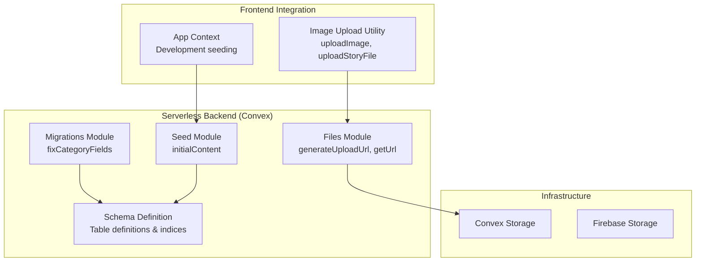
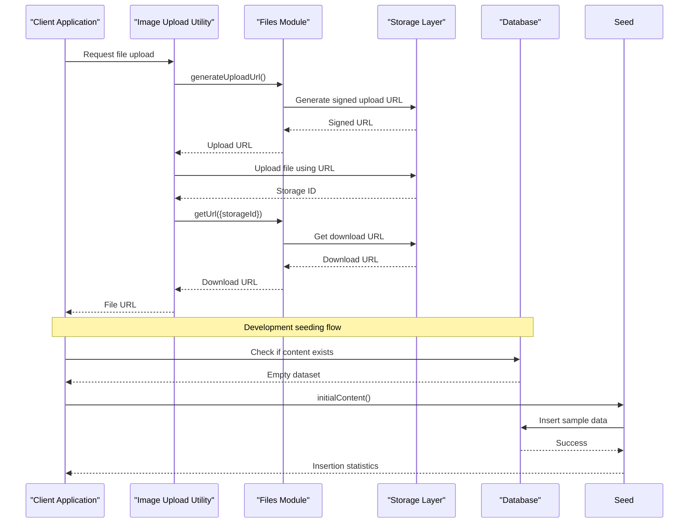
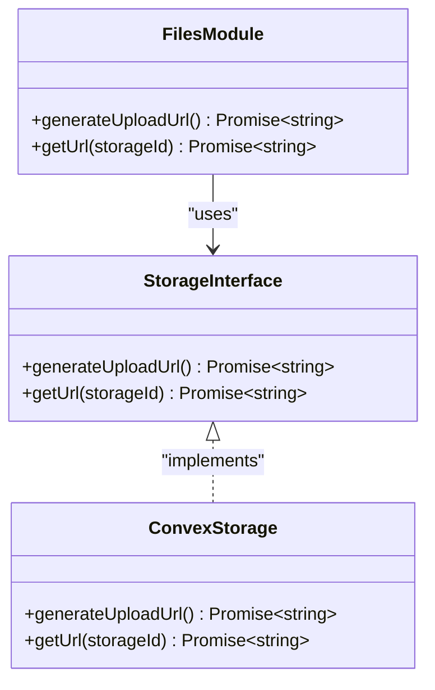
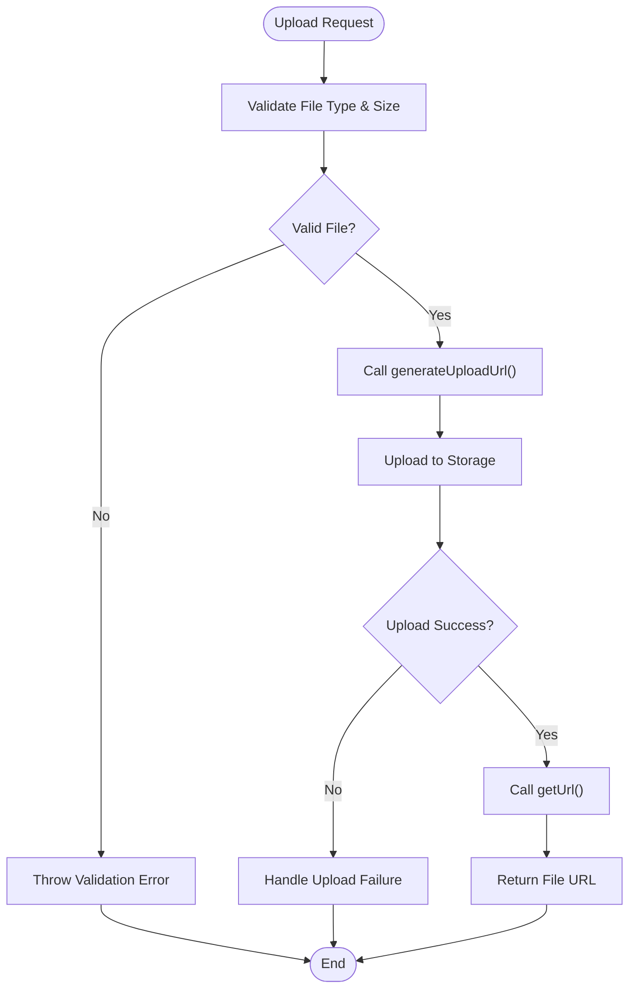
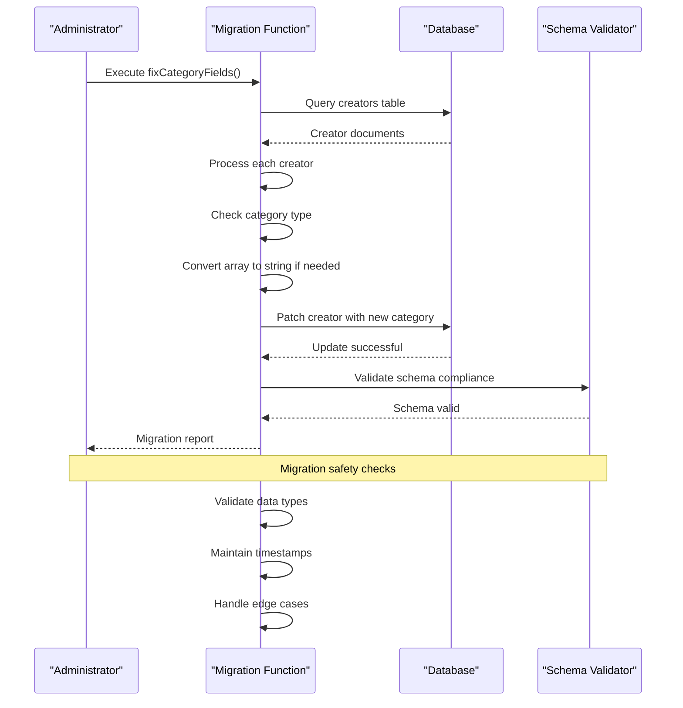
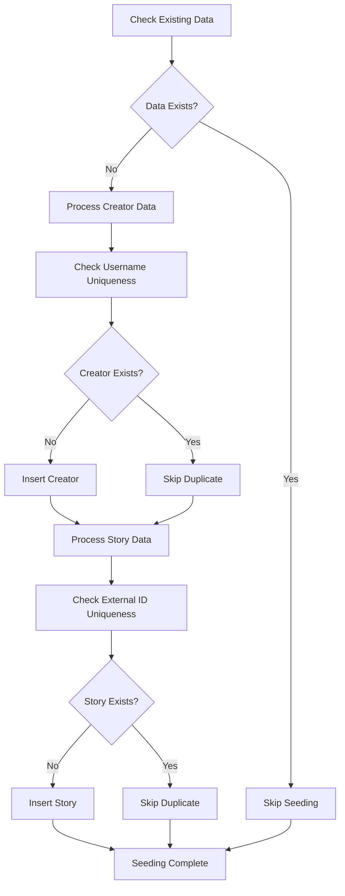
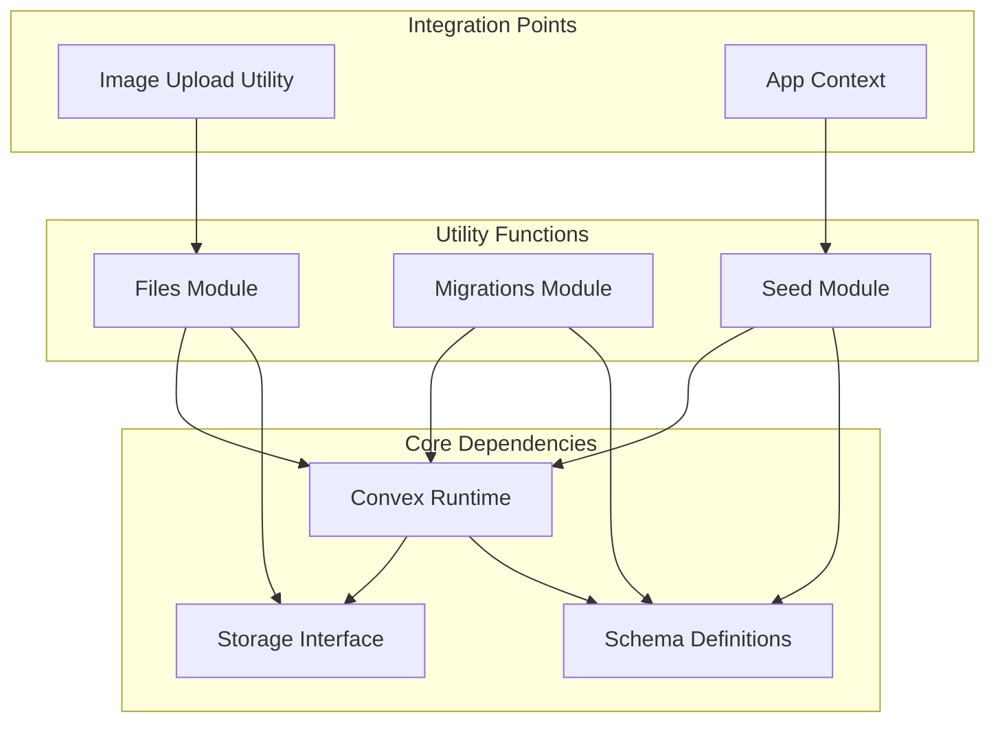

# Utility and Support Functions

<cite>
**Referenced Files in This Document**
- [files.ts](file://convex/files.ts)
- [migrate.ts](file://convex/migrate.ts)
- [seed.ts](file://convex/seed.ts)
- [schema.ts](file://convex/schema.ts)
- [imageUpload.ts](file://src/lib/imageUpload.ts)
- [AppContext.tsx](file://src/contexts/AppContext.tsx)
- [server.js](file://convex/_generated/server.js)
- [migration-patterns.md](file://.agents/skills/convex-migration-helper/references/migration-patterns.md)
- [migrations-component.md](file://.agents/skills/convex-migration-helper/references/migrations-component.md)
- [README.md](file://README.md)
- [DEVELOPMENT_SETUP.md](file://DEVELOPMENT_SETUP.md)
</cite>

## Table of Contents
1. [Introduction](#introduction)
2. [Project Structure](#project-structure)
3. [Core Components](#core-components)
4. [Architecture Overview](#architecture-overview)
5. [Detailed Component Analysis](#detailed-component-analysis)
6. [Dependency Analysis](#dependency-analysis)
7. [Performance Considerations](#performance-considerations)
8. [Troubleshooting Guide](#troubleshooting-guide)
9. [Conclusion](#conclusion)

## Introduction
This document provides comprehensive documentation for the utility and support serverless functions that power file handling, database migrations, and initial data seeding in the Lemonade platform. The focus areas include:
- File upload processing and media asset management
- Database migration system for schema updates and data transformations
- Seed data system for development environments and testing
- Cleanup operations and performance considerations for large file operations

The platform uses Convex as its serverless backend, integrating with Firebase Storage for file management and implementing robust migration and seeding strategies to ensure data integrity and developer productivity.

## Project Structure
The utility and support functions are organized across several key areas:

**Diagram sources**
- [files.ts:1-21](file://convex/files.ts#L1-L21)
- [migrate.ts:1-36](file://convex/migrate.ts#L1-L36)
- [seed.ts:1-253](file://convex/seed.ts#L1-L253)
- [schema.ts:1-495](file://convex/schema.ts#L1-L495)

**Section sources**
- [README.md:1-21](file://README.md#L1-L21)
- [DEVELOPMENT_SETUP.md:1-386](file://DEVELOPMENT_SETUP.md#L1-L386)

## Core Components
The utility and support system consists of three primary components:

### File Management Functions
The files module provides serverless functions for secure file upload and retrieval:
- `generateUploadUrl`: Creates temporary signed URLs for client-side uploads
- `getUrl`: Retrieves download URLs for stored files with validation

### Migration System
The migration module handles database schema updates and data transformations:
- `fixCategoryFields`: Corrects inconsistent data types in the creators table

### Seed Data System
The seed module initializes development environments with realistic content:
- `initialContent`: Inserts sample creators and stories for testing

**Section sources**
- [files.ts:1-21](file://convex/files.ts#L1-L21)
- [migrate.ts:1-36](file://convex/migrate.ts#L1-L36)
- [seed.ts:1-253](file://convex/seed.ts#L1-L253)

## Architecture Overview
The utility and support functions follow a layered architecture pattern:

**Diagram sources**
- [imageUpload.ts:31-105](file://src/lib/imageUpload.ts#L31-L105)
- [files.ts:4-20](file://convex/files.ts#L4-L20)
- [seed.ts:209-252](file://convex/seed.ts#L209-L252)

The architecture ensures separation of concerns with clear boundaries between frontend utilities, serverless functions, and storage infrastructure.

## Detailed Component Analysis

### File Upload Processing System

#### Serverless File Functions
The files module implements two core serverless mutations:

**Diagram sources**
- [files.ts:1-21](file://convex/files.ts#L1-L21)
- [server.js:11-19](file://convex/_generated/server.js#L11-L19)

#### Frontend Integration Pattern
The image upload utility provides a comprehensive interface for file operations:

**Diagram sources**
- [imageUpload.ts:31-105](file://src/lib/imageUpload.ts#L31-L105)
- [files.ts:4-20](file://convex/files.ts#L4-L20)

Key features include:
- File type validation (image/* only)
- Size limits (5MB for images, 25MB for story files)
- Automatic compression for bandwidth optimization
- Error normalization for consistent user feedback
- Support for multiple file categories (profile pictures, story covers, banners)

**Section sources**
- [files.ts:1-21](file://convex/files.ts#L1-L21)
- [imageUpload.ts:1-235](file://src/lib/imageUpload.ts#L1-L235)

### Database Migration System

#### Migration Execution Flow
The migration module implements a targeted fix for data consistency:

**Diagram sources**
- [migrate.ts:7-35](file://convex/migrate.ts#L7-L35)

The migration follows Convex's recommended pattern:
- **Widen-first approach**: Handles both old and new data formats
- **Batch processing**: Processes documents in a controlled manner
- **Safety validation**: Ensures data integrity throughout the process
- **Rollback capability**: Can be repeated safely without data loss

**Section sources**
- [migrate.ts:1-36](file://convex/migrate.ts#L1-L36)
- [migration-patterns.md:128-188](file://.agents/skills/convex-migration-helper/references/migration-patterns.md#L128-L188)

### Seed Data System

#### Development Environment Initialization
The seed module provides comprehensive initial data for development:

**Diagram sources**
- [seed.ts:209-252](file://convex/seed.ts#L209-L252)

The seed system includes:
- **Realistic sample data**: Creators with diverse categories and locations
- **Story content**: Representative story collections with ratings and metrics
- **Unique identifiers**: External IDs for cross-system compatibility
- **Consistent formatting**: Proper data types and relationships

**Section sources**
- [seed.ts:1-253](file://convex/seed.ts#L1-L253)
- [schema.ts:69-93](file://convex/schema.ts#L69-L93)

## Dependency Analysis

### Component Relationships
The utility and support functions have well-defined dependencies:

**Diagram sources**
- [files.ts:1-21](file://convex/files.ts#L1-L21)
- [migrate.ts:1-36](file://convex/migrate.ts#L1-L36)
- [seed.ts:1-253](file://convex/seed.ts#L1-L253)

### Data Model Dependencies
The seed data relies on the schema definitions for proper insertion:

| Component | Schema Dependencies | Purpose |
|-----------|-------------------|---------|
| Creators | `category` field validation | Ensures proper data types |
| Stories | `status` field validation | Maintains content lifecycle |
| Timestamps | `createdAt`/`updatedAt` | Tracks data changes |
| Indexes | Multi-field indexes | Optimizes query performance |

**Section sources**
- [schema.ts:69-125](file://convex/schema.ts#L69-L125)
- [seed.ts:216-248](file://convex/seed.ts#L216-L248)

## Performance Considerations

### Large File Operations
For handling large media assets efficiently:

#### Upload Optimization
- **Compression**: Automatic image compression reduces bandwidth usage
- **Size limits**: Configured thresholds prevent oversized uploads
- **Progressive enhancement**: Supports both compressed and original files

#### Storage Management
- **Signed URLs**: Temporary access tokens minimize server load
- **Immutable URLs**: Signed URLs prevent unauthorized access
- **Cleanup strategy**: Old uploads remain harmless and can be managed by retention jobs

### Migration Safety Measures
The migration system implements several safety mechanisms:

#### Batch Processing
- **Pagination**: Handles large datasets without timeouts
- **Transaction limits**: Respects Convex's operational constraints
- **Resume capability**: Can restart from failure points

#### Data Validation
- **Type checking**: Ensures data integrity during transformations
- **Backup verification**: Maintains referential integrity
- **Rollback support**: Can revert changes if needed

### Development Environment Optimization
The seed system optimizes development workflows:

#### Conditional Loading
- **Environment detection**: Only seeds in development environments
- **Existence checks**: Prevents duplicate data insertion
- **Asynchronous loading**: Non-blocking initialization

**Section sources**
- [imageUpload.ts:171-235](file://src/lib/imageUpload.ts#L171-L235)
- [migrate.ts:14-27](file://convex/migrate.ts#L14-L27)
- [AppContext.tsx:548-554](file://src/contexts/AppContext.tsx#L548-L554)

## Troubleshooting Guide

### File Upload Issues
Common problems and solutions:

#### Upload Failures
- **Validation errors**: Check file type and size limits
- **Network issues**: Verify connectivity and retry upload
- **Permission errors**: Ensure proper authentication

#### URL Retrieval Problems
- **Missing storage IDs**: Verify upload completion
- **Expired URLs**: Regenerate signed URLs as needed
- **Invalid storage IDs**: Check storage ID format and validity

### Migration Problems
Troubleshooting migration failures:

#### Data Type Issues
- **Array vs string conversion**: Verify category field types
- **Timestamp validation**: Ensure proper date formatting
- **Index conflicts**: Check for existing data conflicts

#### Performance Issues
- **Large dataset handling**: Use batch processing for large tables
- **Timeout prevention**: Implement proper error handling
- **Resource limits**: Monitor transaction size limits

### Seed Data Problems
Resolving seed data issues:

#### Duplicate Insertions
- **Username uniqueness**: Check for existing usernames
- **External ID conflicts**: Verify unique identifiers
- **Index conflicts**: Ensure proper indexing exists

#### Development Environment Issues
- **Environment detection**: Verify development mode
- **Conditional loading**: Check for proper environment checks
- **Async operations**: Ensure proper promise handling

**Section sources**
- [imageUpload.ts:14-23](file://src/lib/imageUpload.ts#L14-L23)
- [migrate.ts:15-26](file://convex/migrate.ts#L15-L26)
- [seed.ts:216-248](file://convex/seed.ts#L216-L248)

## Conclusion
The utility and support functions provide a robust foundation for file handling, database migrations, and development environment initialization in the Lemonade platform. The system emphasizes:

- **Security**: Signed URLs and proper validation
- **Reliability**: Comprehensive error handling and validation
- **Performance**: Efficient batch processing and optimization
- **Maintainability**: Clear separation of concerns and modular design

The implementation demonstrates best practices for serverless development, including proper error handling, data validation, and performance optimization. The migration system follows Convex's recommended patterns for safe schema evolution, while the seed system provides excellent developer experience through automated content initialization.

Future enhancements could include:
- Enhanced logging and monitoring
- More sophisticated cleanup policies
- Advanced compression options
- Additional migration patterns for complex schema changes