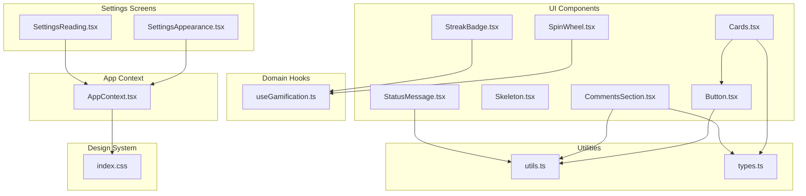
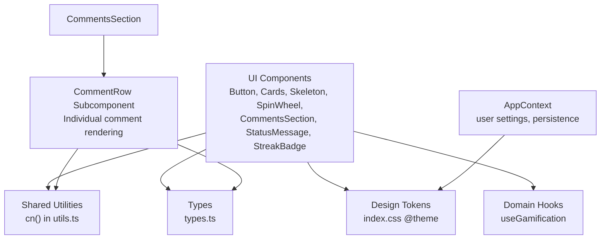
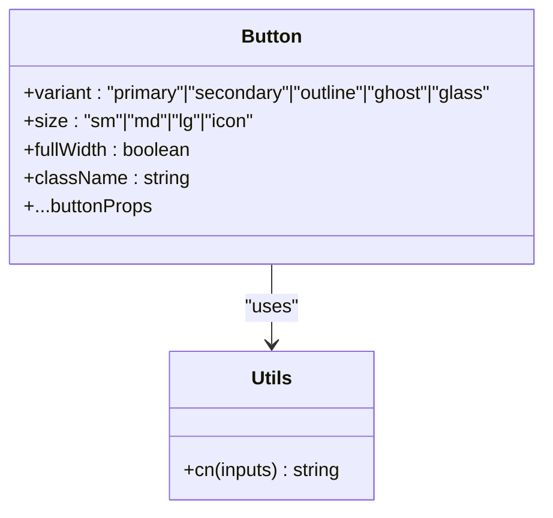
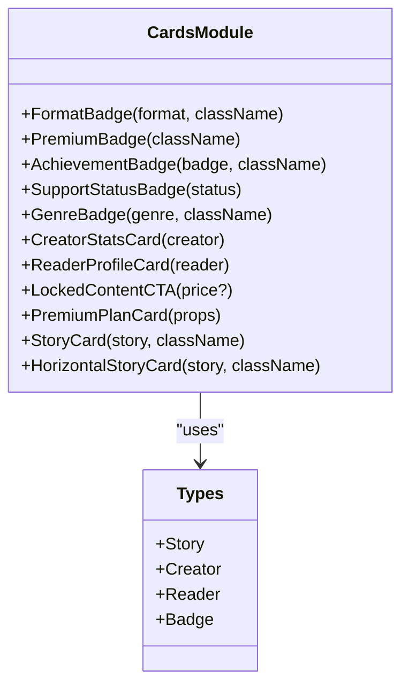
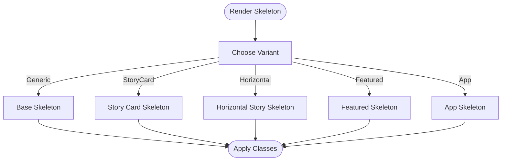
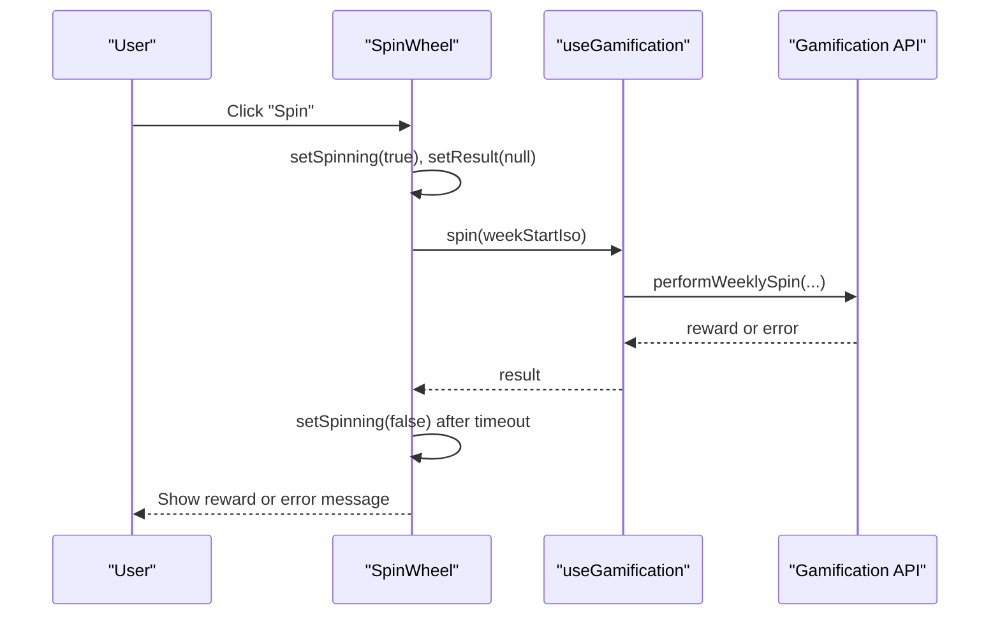
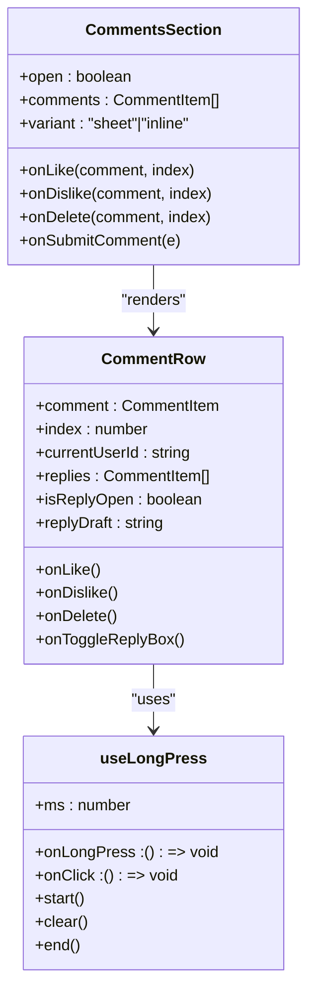
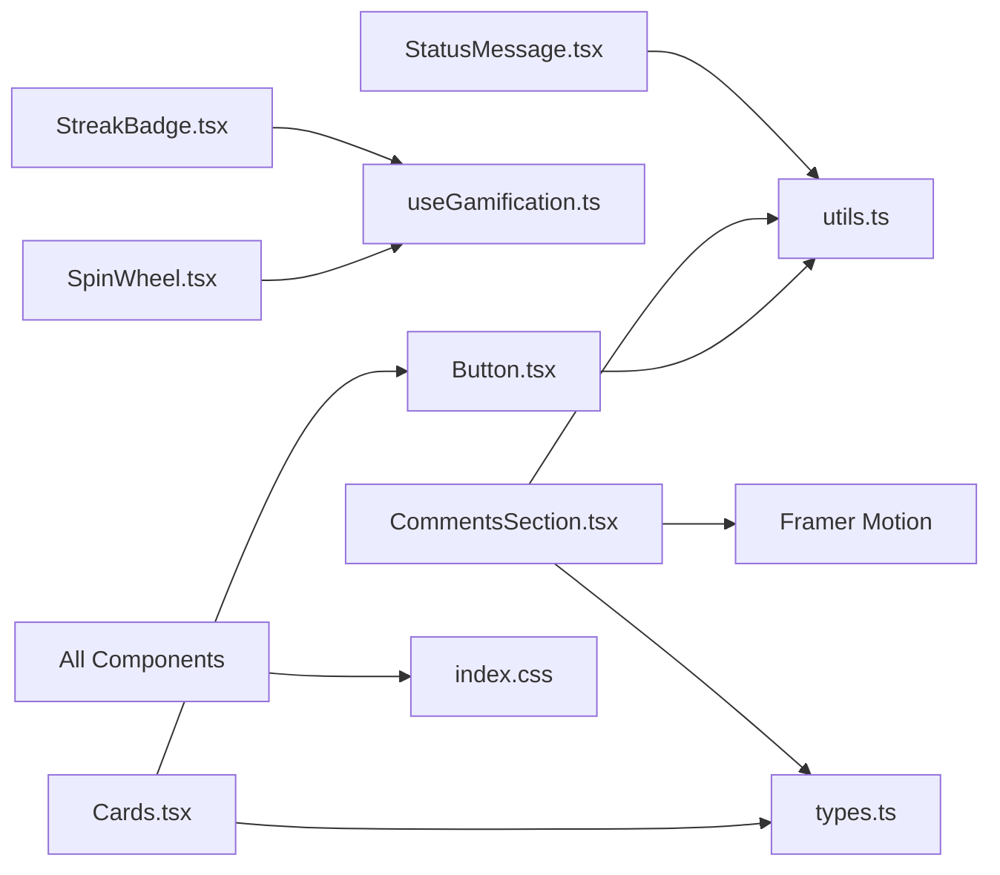

# Component Library

<cite>
**Referenced Files in This Document**
- [Button.tsx](file://src/components/ui/Button.tsx)
- [Cards.tsx](file://src/components/ui/Cards.tsx)
- [Skeleton.tsx](file://src/components/ui/Skeleton.tsx)
- [SpinWheel.tsx](file://src/components/ui/SpinWheel.tsx)
- [StatusMessage.tsx](file://src/components/ui/StatusMessage.tsx)
- [StreakBadge.tsx](file://src/components/ui/StreakBadge.tsx)
- [CommentsSection.tsx](file://src/components/ui/CommentsSection.tsx)
- [InteractionButtons.tsx](file://src/components/InteractionButtons.tsx)
- [StoryDetail.tsx](file://src/screens/StoryDetail.tsx)
- [index.css](file://src/index.css)
- [utils.ts](file://src/lib/utils.ts)
- [types.ts](file://src/data/types.ts)
- [AppContext.tsx](file://src/contexts/AppContext.tsx)
- [useGamification.ts](file://src/hooks/useGamification.ts)
- [SettingsAppearance.tsx](file://src/screens/settings/SettingsAppearance.tsx)
- [SettingsReading.tsx](file://src/screens/settings/SettingsReading.tsx)
</cite>

## Update Summary
**Changes Made**
- Added comprehensive documentation for CommentsSection component with new CommentRow subcomponent
- Documented TikTok-style animated comment cards and dislike functionality
- Added long-press gesture system documentation for comment deletion
- Updated mobile interaction patterns and improved accessibility features
- Enhanced component composition patterns and integration examples

## Table of Contents
1. [Introduction](#introduction)
2. [Project Structure](#project-structure)
3. [Core Components](#core-components)
4. [Architecture Overview](#architecture-overview)
5. [Detailed Component Analysis](#detailed-component-analysis)
6. [Dependency Analysis](#dependency-analysis)
7. [Performance Considerations](#performance-considerations)
8. [Accessibility and Compatibility](#accessibility-and-compatibility)
9. [Design System Guidelines](#design-system-guidelines)
10. [Animation and Transitions](#animation-and-transitions)
11. [Theming and Customization](#theming-and-customization)
12. [Extensibility and Best Practices](#extensibility-and-best-practices)
13. [Troubleshooting Guide](#troubleshooting-guide)
14. [Conclusion](#conclusion)

## Introduction
This document describes the reusable UI component library and the design system that powers the application. It covers seven primary UI components—Button, Cards, Skeleton, SpinWheel, and CommentsSection—along with supporting components and hooks. It also explains the design system's color palette, typography, spacing, responsive patterns, accessibility, cross-browser compatibility, animations, theming, performance, and extension guidelines.

## Project Structure
The component library resides under src/components/ui and integrates with shared design tokens, utilities, and application context. Supporting hooks encapsulate domain logic (e.g., gamification), and settings screens demonstrate runtime customization. The CommentsSection component now includes a dedicated CommentRow subcomponent for enhanced modularity and performance.

**Diagram sources**
- [Button.tsx:1-43](file://src/components/ui/Button.tsx#L1-L43)
- [Cards.tsx:1-276](file://src/components/ui/Cards.tsx#L1-L276)
- [Skeleton.tsx:1-83](file://src/components/ui/Skeleton.tsx#L1-L83)
- [SpinWheel.tsx:1-94](file://src/components/ui/SpinWheel.tsx#L1-L94)
- [CommentsSection.tsx:1-564](file://src/components/ui/CommentsSection.tsx#L1-L564)
- [StatusMessage.tsx:1-83](file://src/components/ui/StatusMessage.tsx#L1-L83)
- [StreakBadge.tsx:1-21](file://src/components/ui/StreakBadge.tsx#L1-L21)
- [utils.ts:1-7](file://src/lib/utils.ts#L1-L7)
- [types.ts:1-155](file://src/data/types.ts#L1-L155)
- [index.css:1-224](file://src/index.css#L1-L224)
- [useGamification.ts:1-48](file://src/hooks/useGamification.ts#L1-L48)
- [AppContext.tsx:1-800](file://src/contexts/AppContext.tsx#L1-L800)
- [SettingsAppearance.tsx:1-123](file://src/screens/settings/SettingsAppearance.tsx#L1-L123)
- [SettingsReading.tsx:62-157](file://src/screens/settings/SettingsReading.tsx#L62-L157)

**Section sources**
- [Button.tsx:1-43](file://src/components/ui/Button.tsx#L1-L43)
- [Cards.tsx:1-276](file://src/components/ui/Cards.tsx#L1-L276)
- [Skeleton.tsx:1-83](file://src/components/ui/Skeleton.tsx#L1-L83)
- [SpinWheel.tsx:1-94](file://src/components/ui/SpinWheel.tsx#L1-L94)
- [CommentsSection.tsx:1-564](file://src/components/ui/CommentsSection.tsx#L1-L564)
- [StatusMessage.tsx:1-83](file://src/components/ui/StatusMessage.tsx#L1-L83)
- [StreakBadge.tsx:1-21](file://src/components/ui/StreakBadge.tsx#L1-L21)
- [index.css:1-224](file://src/index.css#L1-L224)
- [utils.ts:1-7](file://src/lib/utils.ts#L1-L7)
- [types.ts:1-155](file://src/data/types.ts#L1-L155)
- [useGamification.ts:1-48](file://src/hooks/useGamification.ts#L1-L48)
- [AppContext.tsx:1-800](file://src/contexts/AppContext.tsx#L1-L800)
- [SettingsAppearance.tsx:1-123](file://src/screens/settings/SettingsAppearance.tsx#L1-L123)
- [SettingsReading.tsx:62-157](file://src/screens/settings/SettingsReading.tsx#L62-L157)

## Core Components
This section documents the primary UI components and their props, customization options, and usage patterns.

- Button
  - Purpose: Interactive button with variants, sizes, and full-width option.
  - Props:
    - variant: primary | secondary | outline | ghost | glass
    - size: sm | md | lg | icon
    - fullWidth: boolean
    - Additional button attributes supported via spread.
  - Customization:
    - Uses design tokens for colors and spacing.
    - Supports motion animations via Framer Motion.
  - Usage examples:
    - Primary CTA with medium size.
    - Ghost icon button for compact controls.
    - Full-width outline button for forms.

- Cards
  - Purpose: Reusable card components for badges, stats, profiles, plans, and story listings.
  - Key components:
    - FormatBadge, PremiumBadge, AchievementBadge
    - SupportStatusBadge, GenreBadge
    - CreatorStatsCard, ReaderProfileCard
    - LockedContentCTA, PremiumPlanCard
    - StoryCard, HorizontalStoryCard
  - Props:
    - Type-specific props derived from types.ts (e.g., Story, Creator, Reader, Badge).
  - Customization:
    - Tailwind classes for layout and theming.
    - Lucide icons integrated for visual cues.

- Skeleton
  - Purpose: Lightweight skeleton loaders for content areas.
  - Variants:
    - Generic Skeleton
    - StoryCardSkeleton, HorizontalStoryCardSkeleton
    - FeaturedSkeleton, AppSkeleton
  - Usage:
    - Wrap content during async loads.
    - Combine with layout variants for consistent UX.

- SpinWheel
  - Purpose: Animated wheel for gamified rewards.
  - Props: None (self-contained).
  - Behavior:
    - Integrates with useGamification hook for inventory and spin logic.
    - Uses Framer Motion for rotation and easing.
  - Accessibility:
    - Disabled states during loading/spin.
    - Clear result messaging.

- CommentsSection
  - Purpose: Comprehensive comment system with inline and sheet variants.
  - Key features:
    - New CommentRow subcomponent for individual comment rendering
    - TikTok-style animated comment cards with smooth transitions
    - Dislike functionality with ThumbsDown component
    - Long-press gesture system for comment deletion
    - Improved mobile interaction patterns
    - Inline and sheet variants for different contexts
  - Props:
    - open, onClose, comments, totalCount, loading, hasMore
    - currentUserId, currentUserAvatar, currentUserName
    - commentDraft, onCommentDraftChange, onSubmitComment
    - onLoadMore, onLike, onDislike, onDelete
    - repliesByComment, onToggleReplyBox, openReplyBox
    - replyDrafts, onReplyDraftChange, onSubmitReply
    - disabled, variant
  - Customization:
    - Dark theme with lemon accents (#0A0A0A background)
    - Smooth animations for comment interactions
    - Touch-friendly gesture handling
    - Responsive design for mobile devices

- StatusMessage
  - Purpose: Consistent status indicators for errors, warnings, info, and success.
  - Props:
    - tone: error | success | info | warning
    - title: string
    - message?: string
    - code?: string
    - onDismiss?: () => void
  - Accessibility:
    - Proper roles and aria-live for screen readers.

- StreakBadge
  - Purpose: Displays user streak metrics.
  - Props: None (reads from useGamification).
  - Behavior:
    - Shows loading state and formatted streak data.

**Section sources**
- [Button.tsx:5-42](file://src/components/ui/Button.tsx#L5-L42)
- [Cards.tsx:8-276](file://src/components/ui/Cards.tsx#L8-L276)
- [Skeleton.tsx:4-83](file://src/components/ui/Skeleton.tsx#L4-L83)
- [SpinWheel.tsx:16-94](file://src/components/ui/SpinWheel.tsx#L16-L94)
- [CommentsSection.tsx:15-54](file://src/components/ui/CommentsSection.tsx#L15-L54)
- [CommentsSection.tsx:108-122](file://src/components/ui/CommentsSection.tsx#L108-L122)
- [CommentsSection.tsx:357-382](file://src/components/ui/CommentsSection.tsx#L357-L382)
- [StatusMessage.tsx:7-83](file://src/components/ui/StatusMessage.tsx#L7-L83)
- [StreakBadge.tsx:4-21](file://src/components/ui/StreakBadge.tsx#L4-L21)
- [types.ts:125-155](file://src/data/types.ts#L125-L155)

## Architecture Overview
The component library leverages a shared design system and utilities, integrates with application context for user settings, and uses hooks for domain logic. Settings screens demonstrate runtime customization of theme, accent color, and density. The CommentsSection component now follows a modular architecture with a dedicated CommentRow subcomponent for better separation of concerns.

**Diagram sources**
- [Button.tsx:1-43](file://src/components/ui/Button.tsx#L1-L43)
- [Cards.tsx:1-276](file://src/components/ui/Cards.tsx#L1-L276)
- [Skeleton.tsx:1-83](file://src/components/ui/Skeleton.tsx#L1-L83)
- [SpinWheel.tsx:1-94](file://src/components/ui/SpinWheel.tsx#L1-L94)
- [CommentsSection.tsx:1-564](file://src/components/ui/CommentsSection.tsx#L1-L564)
- [StatusMessage.tsx:1-83](file://src/components/ui/StatusMessage.tsx#L1-L83)
- [StreakBadge.tsx:1-21](file://src/components/ui/StreakBadge.tsx#L1-L21)
- [utils.ts:4-6](file://src/lib/utils.ts#L4-L6)
- [index.css:6-23](file://src/index.css#L6-L23)
- [AppContext.tsx:74-92](file://src/contexts/AppContext.tsx#L74-L92)
- [useGamification.ts:6-47](file://src/hooks/useGamification.ts#L6-L47)
- [types.ts:1-155](file://src/data/types.ts#L1-L155)

## Detailed Component Analysis

### Button.tsx
- Implementation highlights:
  - ForwardRef to expose button ref.
  - Variant and size classes computed via cn().
  - Framer Motion tap-scale for interactive feedback.
  - Focus-visible ring and disabled state handling.
- Props and customization:
  - variant: maps to semantic backgrounds and borders.
  - size: controls height, padding, and text sizing.
  - fullWidth: stretches to container width.
- Accessibility:
  - Focus-visible ring for keyboard navigation.
  - Disabled state prevents interaction and reduces opacity.

**Diagram sources**
- [Button.tsx:5-42](file://src/components/ui/Button.tsx#L5-L42)
- [utils.ts:4-6](file://src/lib/utils.ts#L4-L6)

**Section sources**
- [Button.tsx:11-42](file://src/components/ui/Button.tsx#L11-L42)

### Cards.tsx
- Composition patterns:
  - Badge helpers (FormatBadge, PremiumBadge, GenreBadge).
  - Stat cards (CreatorStatsCard, ReaderProfileCard).
  - Plan card (PremiumPlanCard) with popular/current indicators.
  - Story cards (StoryCard, HorizontalStoryCard) with hover effects and gradients.
- Props and data:
  - Derived from types.ts interfaces (Story, Creator, Reader, Badge).
  - GenreBadge uses a color map keyed by genre.
- Customization:
  - Theming via design tokens and Tailwind utilities.
  - Hover transitions and scaling for interactive states.

**Diagram sources**
- [Cards.tsx:8-276](file://src/components/ui/Cards.tsx#L8-L276)
- [types.ts:39-155](file://src/data/types.ts#L39-L155)

**Section sources**
- [Cards.tsx:1-276](file://src/components/ui/Cards.tsx#L1-L276)
- [types.ts:1-155](file://src/data/types.ts#L1-L155)

### Skeleton.tsx
- Purpose:
  - Provide lightweight skeleton loaders for async content.
- Variants:
  - Generic Skeleton for arbitrary containers.
  - StoryCardSkeleton and HorizontalStoryCardSkeleton for list-like layouts.
  - FeaturedSkeleton and AppSkeleton for hero and app-wide loading.
- Implementation:
  - Uses animate-pulse for subtle shimmer.
  - Composed shapes for realistic loading placeholders.

**Diagram sources**
- [Skeleton.tsx:4-83](file://src/components/ui/Skeleton.tsx#L4-L83)

**Section sources**
- [Skeleton.tsx:1-83](file://src/components/ui/Skeleton.tsx#L1-L83)

### SpinWheel.tsx
- Integration:
  - Uses useGamification for inventory, eligibility, and spin actions.
- Animation:
  - Framer Motion rotation with easing for satisfying spin.
  - Randomized stopping to simulate fairness.
- State management:
  - spinning, result, and controlled rendering of outcomes.
- Accessibility:
  - Disabled button during spin/loading.
  - Clear messaging for success/error.

**Diagram sources**
- [SpinWheel.tsx:24-45](file://src/components/ui/SpinWheel.tsx#L24-L45)
- [useGamification.ts:36-39](file://src/hooks/useGamification.ts#L36-L39)

**Section sources**
- [SpinWheel.tsx:1-94](file://src/components/ui/SpinWheel.tsx#L1-L94)
- [useGamification.ts:1-48](file://src/hooks/useGamification.ts#L1-L48)

### CommentsSection.tsx
**Updated** Major enhancement with new CommentRow subcomponent, TikTok-style animations, dislike functionality, and long-press gestures

- **New CommentRow Subcomponent**:
  - Dedicated component for individual comment rendering
  - Handles like/dislike, reply, and delete operations
  - Implements long-press gesture system for comment deletion
  - Provides smooth animations for comment interactions

- **TikTok-Style Animated Comment Cards**:
  - Uses Framer Motion for smooth entrance/exit animations
  - Animated reply boxes with height transitions
  - Loading states with spinner animations
  - Interactive feedback for user actions

- **Dislike Functionality**:
  - Integrated ThumbsDown component for negative reactions
  - Visual indication of disliked state with red coloring
  - Bidirectional like/dislike handling to prevent conflicts
  - Real-time updates with optimistic UI patterns

- **Long-Press Gesture System**:
  - Custom useLongPress hook for gesture detection
  - 700ms delay for long-press detection
  - Touch and mouse event support
  - Visual feedback during long-press
  - Author-only deletion capability

- **Mobile Interaction Patterns**:
  - Touch-friendly button sizing and spacing
  - Optimized reply box animations for mobile devices
  - Responsive design for different screen sizes
  - Safe area insets for mobile devices

- **Props and Data Management**:
  - Comprehensive prop interface for all comment operations
  - Reply management with draft state handling
  - Loading states and pagination support
  - Variant support for inline and sheet presentations

- **Customization Options**:
  - Dark theme with #0A0A0A background
  - Lemon-colored accents for interactive elements
  - Smooth animations for all user interactions
  - Accessible color contrast ratios

**Diagram sources**
- [CommentsSection.tsx:29-54](file://src/components/ui/CommentsSection.tsx#L29-L54)
- [CommentsSection.tsx:108-122](file://src/components/ui/CommentsSection.tsx#L108-L122)
- [CommentsSection.tsx:69-106](file://src/components/ui/CommentsSection.tsx#L69-L106)

**Section sources**
- [CommentsSection.tsx:15-54](file://src/components/ui/CommentsSection.tsx#L15-L54)
- [CommentsSection.tsx:69-106](file://src/components/ui/CommentsSection.tsx#L69-L106)
- [CommentsSection.tsx:108-122](file://src/components/ui/CommentsSection.tsx#L108-L122)
- [CommentsSection.tsx:124-355](file://src/components/ui/CommentsSection.tsx#L124-L355)
- [CommentsSection.tsx:357-564](file://src/components/ui/CommentsSection.tsx#L357-L564)

### StatusMessage.tsx
- Tone-based theming:
  - error, success, info, warning with distinct colors and icons.
- Accessibility:
  - Role and aria-live set based on tone.
  - Optional dismiss button with aria-label.
- Usage:
  - Display transient messages with optional code block.

**Section sources**
- [StatusMessage.tsx:1-83](file://src/components/ui/StatusMessage.tsx#L1-L83)

### StreakBadge.tsx
- Reads streak data via useGamification.
- Renders current and longest streak with a compact layout.
- Gracefully handles loading states.

**Section sources**
- [StreakBadge.tsx:1-21](file://src/components/ui/StreakBadge.tsx#L1-L21)
- [useGamification.ts:7-10](file://src/hooks/useGamification.ts#L7-L10)

## Dependency Analysis
- Internal dependencies:
  - Button depends on cn() for class merging.
  - Cards composes Button and types.
  - SpinWheel depends on useGamification and types.
  - CommentsSection depends on utils, types, and Framer Motion.
  - StatusMessage and StreakBadge depend on utilities and hooks respectively.
- External dependencies:
  - Framer Motion for animations.
  - Tailwind and CSS variables for design tokens.
  - Lucide icons for visual elements.

**Diagram sources**
- [Button.tsx:1-43](file://src/components/ui/Button.tsx#L1-L43)
- [Cards.tsx:1-276](file://src/components/ui/Cards.tsx#L1-L276)
- [Skeleton.tsx:1-83](file://src/components/ui/Skeleton.tsx#L1-L83)
- [SpinWheel.tsx:1-94](file://src/components/ui/SpinWheel.tsx#L1-L94)
- [CommentsSection.tsx:1-564](file://src/components/ui/CommentsSection.tsx#L1-L564)
- [StatusMessage.tsx:1-83](file://src/components/ui/StatusMessage.tsx#L1-L83)
- [StreakBadge.tsx:1-21](file://src/components/ui/StreakBadge.tsx#L1-L21)
- [utils.ts:1-7](file://src/lib/utils.ts#L1-L7)
- [types.ts:1-155](file://src/data/types.ts#L1-L155)
- [useGamification.ts:1-48](file://src/hooks/useGamification.ts#L1-L48)
- [index.css:1-224](file://src/index.css#L1-L224)

**Section sources**
- [Button.tsx:1-43](file://src/components/ui/Button.tsx#L1-L43)
- [Cards.tsx:1-276](file://src/components/ui/Cards.tsx#L1-L276)
- [Skeleton.tsx:1-83](file://src/components/ui/Skeleton.tsx#L1-L83)
- [SpinWheel.tsx:1-94](file://src/components/ui/SpinWheel.tsx#L1-L94)
- [CommentsSection.tsx:1-564](file://src/components/ui/CommentsSection.tsx#L1-L564)
- [StatusMessage.tsx:1-83](file://src/components/ui/StatusMessage.tsx#L1-L83)
- [StreakBadge.tsx:1-21](file://src/components/ui/StreakBadge.tsx#L1-L21)
- [utils.ts:1-7](file://src/lib/utils.ts#L1-L7)
- [types.ts:1-155](file://src/data/types.ts#L1-L155)
- [useGamification.ts:1-48](file://src/hooks/useGamification.ts#L1-L48)
- [index.css:1-224](file://src/index.css#L1-L224)

## Performance Considerations
- Memoization and stability:
  - Prefer useMemo for derived values (e.g., inventory in SpinWheel).
  - Keep component props minimal and stable to avoid unnecessary re-renders.
  - Use React.memo for CommentRow to prevent unnecessary re-renders.
- Animations:
  - Use hardware-accelerated properties (transform/opacity) for smooth motion.
  - Limit concurrent animations and cap their durations.
  - Implement proper cleanup for gesture timers.
- Rendering:
  - Use Skeleton variants to prevent layout shifts during async loads.
  - Defer heavy computations off the main thread when possible.
  - Optimize comment list rendering with virtualization for large datasets.
- CSS:
  - Leverage design tokens and Tailwind utilities to minimize custom CSS and repaints.
- Hooks:
  - Cache and reuse callbacks with useCallback where appropriate.
  - Implement proper cleanup for gesture handlers.

[No sources needed since this section provides general guidance]

## Accessibility and Compatibility
- Accessibility:
  - Focus-visible rings for keyboard navigation (Button).
  - Proper roles and aria-live for StatusMessage.
  - Disabled states for interactive elements during loading/spin.
  - Semantic HTML and alt attributes for images.
  - Touch-friendly target sizes for mobile gestures.
  - Screen reader announcements for like/dislike actions.
- Cross-browser compatibility:
  - CSS variables and modern Tailwind features are supported across current browsers.
  - Fallbacks for light theme via CSS layers and overrides.
  - Reduced motion support via prefers-reduced-motion media query.
  - Touch event support for mobile devices.

**Section sources**
- [Button.tsx:14-38](file://src/components/ui/Button.tsx#L14-L38)
- [StatusMessage.tsx:54-79](file://src/components/ui/StatusMessage.tsx#L54-L79)
- [CommentsSection.tsx:144-150](file://src/components/ui/CommentsSection.tsx#L144-L150)
- [index.css:216-223](file://src/index.css#L216-L223)

## Design System Guidelines
- Color scheme:
  - Core palette: black-core, ink-deep, cream-soft, lemon-muted.
  - Genre-specific colors for badges.
  - Dark theme (#0A0A0A background) with white/cream text.
- Typography:
  - Font families: Inter (sans), Satoshi (display).
  - Headings use font-display with tight tracking.
- Spacing and layout:
  - Consistent roundedness and border tokens.
  - Grid and flex utilities for responsive layouts.
- Responsive patterns:
  - Breakpoints and density adjustments via data attributes on html element.
  - Adaptive sizing for buttons and cards.
  - Safe area insets for mobile devices.

**Section sources**
- [index.css:6-23](file://src/index.css#L6-L23)
- [index.css:25-75](file://src/index.css#L25-L75)
- [index.css:57-63](file://src/index.css#L57-L63)

## Animation and Transitions
- Component-level animations:
  - Button: whileTap scale for press feedback.
  - Cards: hover-scale and gradient overlays.
  - SpinWheel: rotation with easing and randomized stopping.
  - CommentsSection: Framer Motion animations for comment interactions.
- Page-level and ambient effects:
  - story-cover-float, story-cover-shine, story-cta-glow.
  - Prefers reduced motion: disables animations automatically.
- Settings-driven effects:
  - Settings screens demonstrate interactive previews for animation styles.
- Comment-specific animations:
  - Smooth entrance/exit for comment rows.
  - Height transitions for reply boxes.
  - Loading spinners with pulse animations.

**Section sources**
- [Button.tsx:14-16](file://src/components/ui/Button.tsx#L14-L16)
- [Cards.tsx:220-244](file://src/components/ui/Cards.tsx#L220-L244)
- [SpinWheel.tsx:47-56](file://src/components/ui/SpinWheel.tsx#L47-L56)
- [CommentsSection.tsx:286-293](file://src/components/ui/CommentsSection.tsx#L286-L293)
- [index.css:144-214](file://src/index.css#L144-L214)
- [index.css:216-223](file://src/index.css#L216-L223)

## Theming and Customization
- Runtime theming:
  - Theme mode (dark/light/system) and accent color (lemon/purple/blue/orange/white) via AppContext settings.
  - Display density (compact/default/relaxed) affects font size.
- CSS variables:
  - index.css defines @theme tokens and data-* attributes to switch modes.
- Settings screens:
  - SettingsAppearance demonstrates saving theme/accent/density.
  - SettingsReading demonstrates text settings and reading mode.
- CommentsSection theming:
  - Dark theme with #0A0A0A background.
  - Lemon-colored interactive elements.
  - White/cream text with appropriate contrast ratios.

**Section sources**
- [AppContext.tsx:74-92](file://src/contexts/AppContext.tsx#L74-L92)
- [index.css:30-55](file://src/index.css#L30-L55)
- [SettingsAppearance.tsx:13-34](file://src/screens/settings/SettingsAppearance.tsx#L13-L34)
- [SettingsReading.tsx:62-157](file://src/screens/settings/SettingsReading.tsx#L62-L157)
- [CommentsSection.tsx:518-526](file://src/components/ui/CommentsSection.tsx#L518-L526)

## Extensibility and Best Practices
- Creating new components:
  - Use cn() for composing Tailwind classes.
  - Adopt variant and size props for consistency.
  - Integrate with design tokens from index.css.
- Composition patterns:
  - Prefer small, single-purpose components (e.g., badge helpers).
  - Compose higher-level components from smaller ones (e.g., Cards).
  - Use subcomponents for complex UI elements (e.g., CommentRow).
- Domain integration:
  - Encapsulate domain logic in hooks (e.g., useGamification).
  - Expose minimal props and derive strongly-typed inputs from types.ts.
- Accessibility:
  - Provide keyboard focus affordances and ARIA roles where needed.
  - Implement touch-friendly gestures for mobile devices.
- Performance:
  - Memoize derived values and avoid unnecessary re-renders.
  - Use Skeleton loaders for async content.
  - Implement proper cleanup for gesture handlers.

[No sources needed since this section provides general guidance]

## Troubleshooting Guide
- Button not responding:
  - Verify disabled state and ensure props are not overriding className incorrectly.
- SpinWheel not spinning:
  - Check useGamification availability and loading state.
  - Confirm eligibility and that the spin action resolves.
- CommentsSection issues:
  - Verify CommentRow props are properly passed down.
  - Check long-press gesture timing and user permissions.
  - Ensure proper cleanup of gesture timers.
- Animations feel sluggish:
  - Prefer transform and opacity; avoid layout-affecting properties.
  - Reduce animation duration or disable for reduced-motion users.
- Theming inconsistencies:
  - Ensure data-* attributes are applied to html and settings are persisted in AppContext.

**Section sources**
- [Button.tsx:14-38](file://src/components/ui/Button.tsx#L14-L38)
- [SpinWheel.tsx:16-45](file://src/components/ui/SpinWheel.tsx#L16-L45)
- [CommentsSection.tsx:69-106](file://src/components/ui/CommentsSection.tsx#L69-L106)
- [index.css:216-223](file://src/index.css#L216-L223)
- [AppContext.tsx:704-708](file://src/contexts/AppContext.tsx#L704-L708)

## Conclusion
The component library provides a cohesive, accessible, and performant foundation for building UI surfaces. The recent enhancements to CommentsSection with the new CommentRow subcomponent, TikTok-style animations, dislike functionality, and long-press gestures significantly improve the user experience and demonstrate best practices for component architecture. By adhering to the design system, leveraging shared utilities and hooks, and following the composition patterns outlined here, teams can extend the library confidently while maintaining consistency and quality across the application.