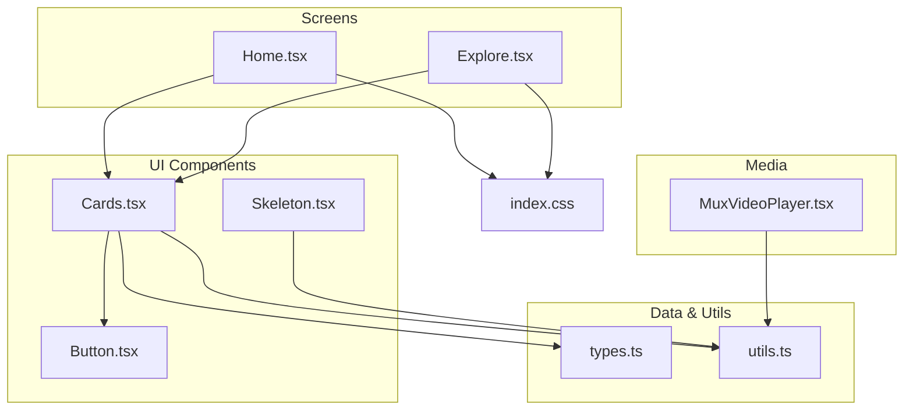
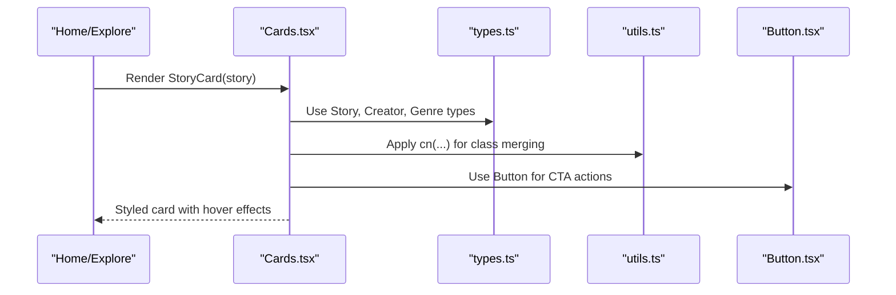
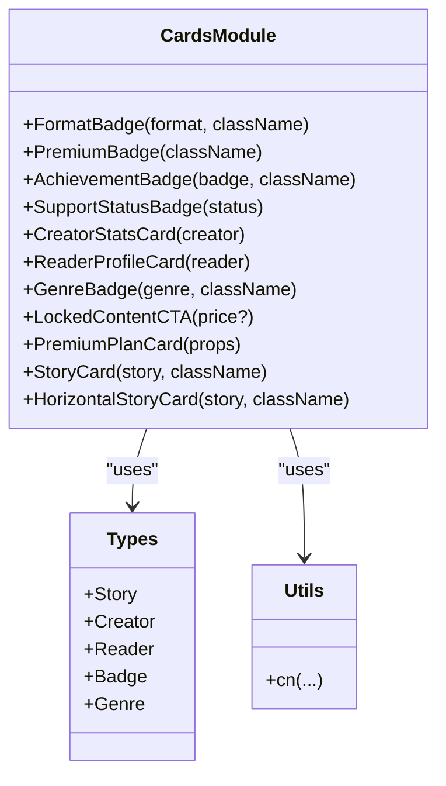
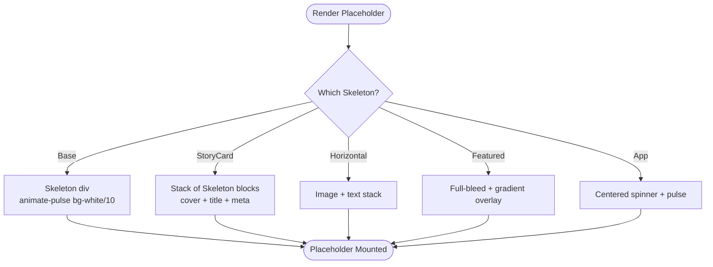
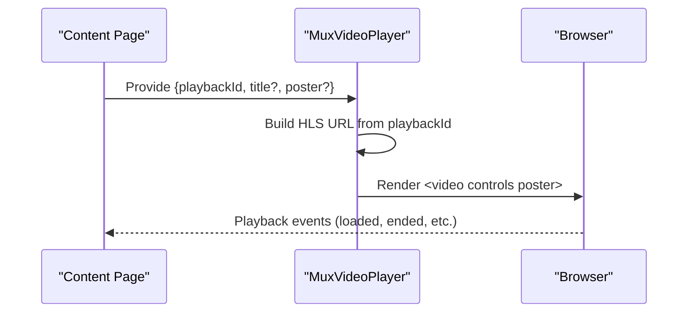
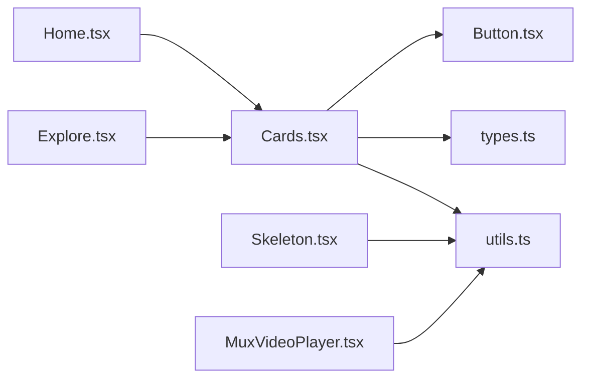

# Content Display Components

<cite>
**Referenced Files in This Document**
- [Cards.tsx](file://src/components/ui/Cards.tsx)
- [Skeleton.tsx](file://src/components/ui/Skeleton.tsx)
- [MuxVideoPlayer.tsx](file://src/components/MuxVideoPlayer.tsx)
- [Button.tsx](file://src/components/ui/Button.tsx)
- [types.ts](file://src/data/types.ts)
- [utils.ts](file://src/lib/utils.ts)
- [Home.tsx](file://src/screens/Home.tsx)
- [Explore.tsx](file://src/screens/Explore.tsx)
- [index.css](file://src/index.css)
</cite>

## Table of Contents
1. [Introduction](#introduction)
2. [Project Structure](#project-structure)
3. [Core Components](#core-components)
4. [Architecture Overview](#architecture-overview)
5. [Detailed Component Analysis](#detailed-component-analysis)
6. [Dependency Analysis](#dependency-analysis)
7. [Performance Considerations](#performance-considerations)
8. [Troubleshooting Guide](#troubleshooting-guide)
9. [Conclusion](#conclusion)

## Introduction
This document explains the content display components used to render stories, user profiles, badges, skeletons, and video playback. It covers Cards component variants with layout, hover effects, and responsiveness; Skeleton placeholders for loading states; and MuxVideoPlayer for video playback. It also documents props, styling, integration patterns with the content management system, loading/error handling, and performance optimization strategies.

## Project Structure
The content display components live under src/components/ui and src/components, with supporting types and styling utilities.

**Diagram sources**
- [Cards.tsx:1-276](file://src/components/ui/Cards.tsx#L1-L276)
- [Skeleton.tsx:1-83](file://src/components/ui/Skeleton.tsx#L1-L83)
- [MuxVideoPlayer.tsx:1-39](file://src/components/MuxVideoPlayer.tsx#L1-L39)
- [Button.tsx:1-43](file://src/components/ui/Button.tsx#L1-L43)
- [Home.tsx:1-154](file://src/screens/Home.tsx#L1-L154)
- [Explore.tsx:1-97](file://src/screens/Explore.tsx#L1-L97)
- [types.ts:1-155](file://src/data/types.ts#L1-L155)
- [utils.ts:1-7](file://src/lib/utils.ts#L1-L7)
- [index.css:1-224](file://src/index.css#L1-L224)

**Section sources**
- [Cards.tsx:1-276](file://src/components/ui/Cards.tsx#L1-L276)
- [Skeleton.tsx:1-83](file://src/components/ui/Skeleton.tsx#L1-L83)
- [MuxVideoPlayer.tsx:1-39](file://src/components/MuxVideoPlayer.tsx#L1-L39)
- [Button.tsx:1-43](file://src/components/ui/Button.tsx#L1-L43)
- [Home.tsx:1-154](file://src/screens/Home.tsx#L1-L154)
- [Explore.tsx:1-97](file://src/screens/Explore.tsx#L1-L97)
- [types.ts:1-155](file://src/data/types.ts#L1-L155)
- [utils.ts:1-7](file://src/lib/utils.ts#L1-L7)
- [index.css:1-224](file://src/index.css#L1-L224)

## Core Components
- Cards: A collection of reusable cards for stories, readers, creators, badges, and plans. Includes hover effects, responsive layouts, and badges for format, genre, premium status, and supporter tiers.
- Skeleton: Lightweight loading placeholders using animated pulse backgrounds and shape templates for cards and full app shell.
- MuxVideoPlayer: Minimal HTML5 video player wrapper using Mux HLS streams with configurable title and poster.

Key integration points:
- Screens use Cards to render story grids and featured content.
- Skeleton is used during initial app load and content transitions.
- MuxVideoPlayer is used for video playback in appropriate contexts.

**Section sources**
- [Cards.tsx:1-276](file://src/components/ui/Cards.tsx#L1-L276)
- [Skeleton.tsx:1-83](file://src/components/ui/Skeleton.tsx#L1-L83)
- [MuxVideoPlayer.tsx:1-39](file://src/components/MuxVideoPlayer.tsx#L1-L39)
- [Home.tsx:1-154](file://src/screens/Home.tsx#L1-L154)
- [Explore.tsx:1-97](file://src/screens/Explore.tsx#L1-L97)

## Architecture Overview
The content display pipeline integrates data types, UI components, and styling utilities to present a cohesive, responsive experience.

**Diagram sources**
- [Home.tsx:1-154](file://src/screens/Home.tsx#L1-L154)
- [Explore.tsx:1-97](file://src/screens/Explore.tsx#L1-L97)
- [Cards.tsx:1-276](file://src/components/ui/Cards.tsx#L1-L276)
- [types.ts:1-155](file://src/data/types.ts#L1-L155)
- [utils.ts:1-7](file://src/lib/utils.ts#L1-L7)
- [Button.tsx:1-43](file://src/components/ui/Button.tsx#L1-L43)

## Detailed Component Analysis

### Cards Component Family
Cards.tsx provides multiple specialized cards:
- FormatBadge, GenreBadge: Tag-like indicators with genre-specific colors.
- PremiumBadge, SupportStatusBadge: Premium and supporter badges with icons and styles.
- AchievementBadge: Interactive badge card with hover scaling.
- CreatorStatsCard: Stats grid for creator metrics.
- ReaderProfileCard: Reader profile with optional premium crown overlay.
- LockedContentCTA: Call-to-action for premium locks with optional pricing.
- PremiumPlanCard: Pricing card with popular/current indicators and feature list.
- StoryCard: Vertical card with cover image, gradient overlay, hover stats, and badges.
- HorizontalStoryCard: Compact horizontal card optimized for scrollable lists.

Responsive behavior and hover effects:
- StoryCard applies hover scaling to images and reveals action chips with opacity transforms.
- HorizontalStoryCard uses aspect ratios and truncation for small screens.
- Premium overlays and badges adapt sizing across breakpoints.

Integration with content management:
- Cards consume Story, Creator, Reader, and Badge types from types.ts.
- Uses cn from utils.ts for safe class merging and Tailwind composition.

Customization options:
- Pass className to wrap containers for spacing and alignment.
- Adjust sizes via Button variant/size props where applicable.
- Swap images and badges to reflect content metadata.

**Section sources**
- [Cards.tsx:1-276](file://src/components/ui/Cards.tsx#L1-L276)
- [types.ts:1-155](file://src/data/types.ts#L1-L155)
- [utils.ts:1-7](file://src/lib/utils.ts#L1-L7)
- [Button.tsx:1-43](file://src/components/ui/Button.tsx#L1-L43)

#### Cards Class Diagram

**Diagram sources**
- [Cards.tsx:1-276](file://src/components/ui/Cards.tsx#L1-L276)
- [types.ts:1-155](file://src/data/types.ts#L1-L155)
- [utils.ts:1-7](file://src/lib/utils.ts#L1-L7)

### Skeleton Component Family
Skeleton.tsx provides lightweight loading placeholders:
- Skeleton: Base animated pulse container.
- StoryCardSkeleton: Vertical skeleton mimicking StoryCard layout.
- HorizontalStoryCardSkeleton: Compact horizontal skeleton.
- FeaturedSkeleton: Full-bleed skeleton for featured hero sections.
- AppSkeleton: Centered app loader with spinning and pulsing elements.

Implementation details:
- Uses animate-pulse for shimmer effect and rounded-xl for soft edges.
- FeaturedSkeleton composes gradient overlays to match hero styling.
- AppSkeleton includes a rotating ring and pulsing dot for engaging loading.

Integration patterns:
- Use StoryCardSkeleton/HoriztonalStoryCardSkeleton inside grids/lists while fetching data.
- Use FeaturedSkeleton for hero placeholders.
- Use AppSkeleton during initial app bootstrapping.

**Section sources**
- [Skeleton.tsx:1-83](file://src/components/ui/Skeleton.tsx#L1-L83)
- [utils.ts:1-7](file://src/lib/utils.ts#L1-L7)

#### Skeleton Flowchart

**Diagram sources**
- [Skeleton.tsx:1-83](file://src/components/ui/Skeleton.tsx#L1-L83)

### MuxVideoPlayer Component
MuxVideoPlayer renders a video element backed by Mux HLS streams:
- Props:
  - playbackId: Required identifier for the Mux stream.
  - title: Optional accessible title for the video.
  - poster: Optional thumbnail to show before playback.
- Behavior:
  - Builds the HLS URL from the playbackId.
  - Renders a video element with controls and poster.
  - Falls back to a static message when the browser lacks HTML5 video support.

Responsive design:
- The wrapper sets width to 100% and clips overflow for consistent aspect behavior.

Quality switching:
- The current implementation uses a single HLS stream URL. Quality adaptation is handled by Mux’s adaptive bitrate streaming; no client-side quality selector is exposed.

Integration patterns:
- Use in content pages where video assets are managed via Mux.
- Pair with content metadata to pass title and poster from story/media records.

**Section sources**
- [MuxVideoPlayer.tsx:1-39](file://src/components/MuxVideoPlayer.tsx#L1-L39)

#### MuxVideoPlayer Sequence

**Diagram sources**
- [MuxVideoPlayer.tsx:14-36](file://src/components/MuxVideoPlayer.tsx#L14-L36)

### Component Composition Examples
- Home screen composes StoryCard in horizontal scrollers and vertical grids, using badges and buttons for navigation and actions.
- Explore screen filters stories by format and genre, rendering StoryCard in a responsive grid.

**Section sources**
- [Home.tsx:1-154](file://src/screens/Home.tsx#L1-L154)
- [Explore.tsx:1-97](file://src/screens/Explore.tsx#L1-L97)
- [Cards.tsx:1-276](file://src/components/ui/Cards.tsx#L1-L276)
- [Button.tsx:1-43](file://src/components/ui/Button.tsx#L1-L43)

## Dependency Analysis
- Cards depends on:
  - types.ts for Story, Creator, Reader, Badge, Genre.
  - utils.ts for cn class merging.
  - Button.tsx for interactive CTAs.
- Skeleton depends on utils.ts for class merging.
- MuxVideoPlayer depends on utils.ts for class merging and uses DOM APIs for video rendering.
- Screens (Home, Explore) depend on Cards and expose filtered story lists.

**Diagram sources**
- [Home.tsx:1-154](file://src/screens/Home.tsx#L1-L154)
- [Explore.tsx:1-97](file://src/screens/Explore.tsx#L1-L97)
- [Cards.tsx:1-276](file://src/components/ui/Cards.tsx#L1-L276)
- [Skeleton.tsx:1-83](file://src/components/ui/Skeleton.tsx#L1-L83)
- [MuxVideoPlayer.tsx:1-39](file://src/components/MuxVideoPlayer.tsx#L1-L39)
- [types.ts:1-155](file://src/data/types.ts#L1-L155)
- [utils.ts:1-7](file://src/lib/utils.ts#L1-L7)
- [Button.tsx:1-43](file://src/components/ui/Button.tsx#L1-L43)

**Section sources**
- [Home.tsx:1-154](file://src/screens/Home.tsx#L1-L154)
- [Explore.tsx:1-97](file://src/screens/Explore.tsx#L1-L97)
- [Cards.tsx:1-276](file://src/components/ui/Cards.tsx#L1-L276)
- [Skeleton.tsx:1-83](file://src/components/ui/Skeleton.tsx#L1-L83)
- [MuxVideoPlayer.tsx:1-39](file://src/components/MuxVideoPlayer.tsx#L1-L39)
- [types.ts:1-155](file://src/data/types.ts#L1-L155)
- [utils.ts:1-7](file://src/lib/utils.ts#L1-L7)
- [Button.tsx:1-43](file://src/components/ui/Button.tsx#L1-L43)

## Performance Considerations
- Lazy loading and virtualization:
  - Use horizontal scrolling lists with snap behavior to limit DOM nodes rendered at once.
  - Consider virtualized lists for very long story feeds.
- Media optimization:
  - Prefer poster images for video thumbnails to reduce initial payload.
  - Defer non-critical video rendering until user intent is detected.
- Skeleton usage:
  - Replace heavy content with Skeleton variants during fetches to maintain perceived performance.
- CSS and animations:
  - Keep hover transforms minimal to avoid layout thrash.
  - Respect reduced-motion preferences via media queries.
- Bundle size:
  - Keep component imports scoped to screens that use them.

[No sources needed since this section provides general guidance]

## Troubleshooting Guide
- Video playback not starting:
  - Verify playbackId is valid and accessible.
  - Confirm browser supports HTML5 video and HLS playback.
- Missing shimmer effect:
  - Ensure animate-pulse is available in the build and not overridden by global resets.
- Class conflicts:
  - Use cn from utils.ts to merge classes safely and avoid Tailwind collisions.
- Responsive layout shifts:
  - Use aspect-ratio utilities and fixed-height containers around Skeleton placeholders.
- Accessibility:
  - Provide meaningful title attributes for media components.
  - Ensure interactive elements have visible focus states.

**Section sources**
- [MuxVideoPlayer.tsx:14-36](file://src/components/MuxVideoPlayer.tsx#L14-L36)
- [Skeleton.tsx:1-14](file://src/components/ui/Skeleton.tsx#L1-L14)
- [utils.ts:1-7](file://src/lib/utils.ts#L1-L7)
- [index.css:216-224](file://src/index.css#L216-L224)

## Conclusion
The content display system combines modular, responsive Cards, efficient Skeleton placeholders, and a minimal MuxVideoPlayer to deliver a polished reading and discovery experience. By leveraging typed data models, utility-driven class composition, and thoughtful loading patterns, the components integrate cleanly with the content management flow and remain performant across devices.