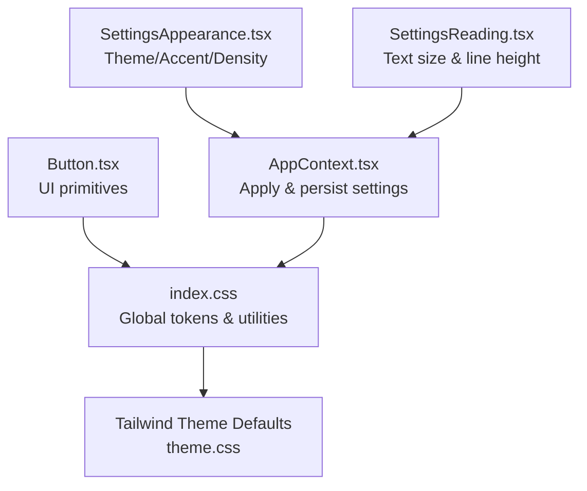
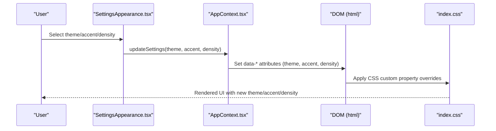
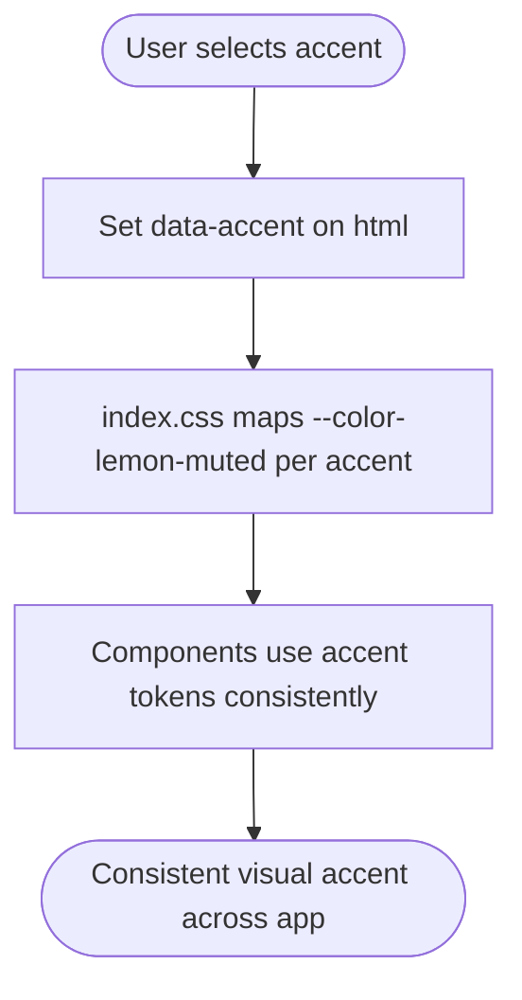
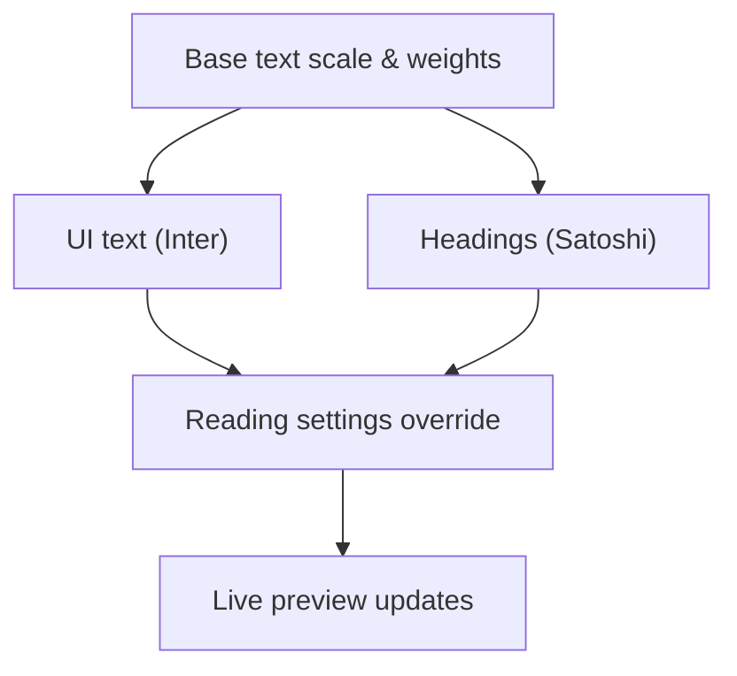
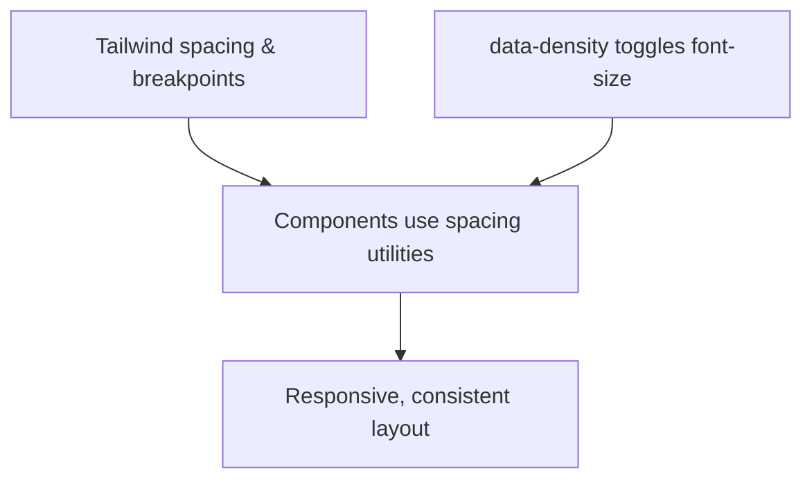
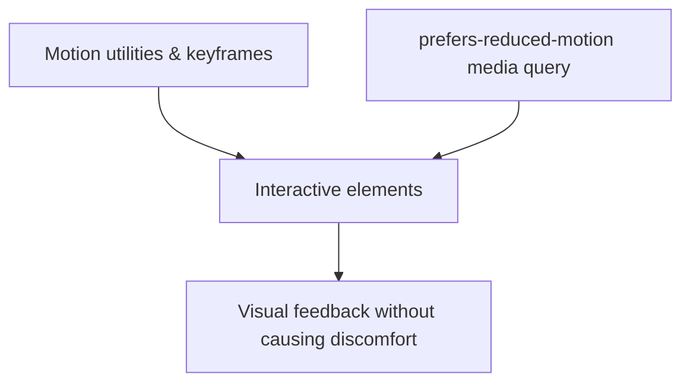
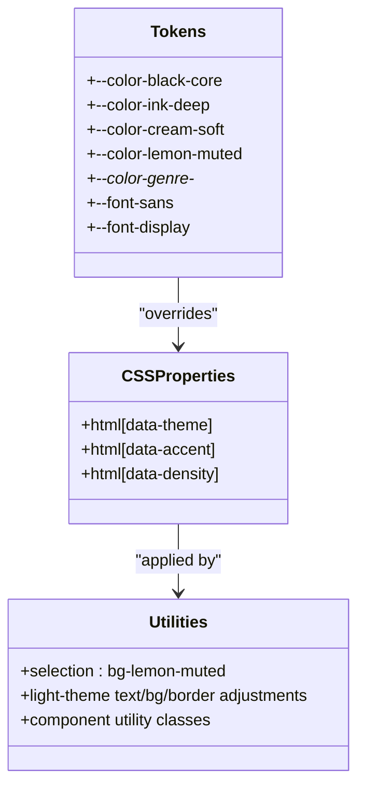
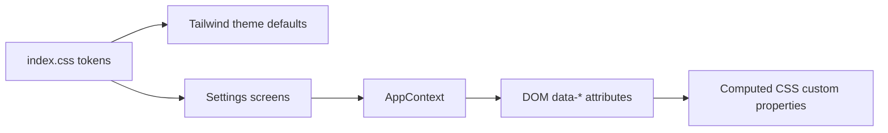

# Design System Principles

<cite>
**Referenced Files in This Document**
- [index.css](file://src/index.css)
- [theme.css](file://node_modules/tailwindcss/theme.css)
- [SettingsAppearance.tsx](file://src/screens/settings/SettingsAppearance.tsx)
- [SettingsReading.tsx](file://src/screens/settings/SettingsReading.tsx)
- [AppContext.tsx](file://src/contexts/AppContext.tsx)
- [Button.tsx](file://src/components/ui/Button.tsx)
</cite>

## Table of Contents
1. [Introduction](#introduction)
2. [Project Structure](#project-structure)
3. [Core Components](#core-components)
4. [Architecture Overview](#architecture-overview)
5. [Detailed Component Analysis](#detailed-component-analysis)
6. [Dependency Analysis](#dependency-analysis)
7. [Performance Considerations](#performance-considerations)
8. [Troubleshooting Guide](#troubleshooting-guide)
9. [Conclusion](#conclusion)

## Introduction
This document defines the Lemonade design system: foundational principles, color palette, typography hierarchy, spacing and layout guidelines, motion and animation patterns, and theme-awareness mechanisms. It consolidates tokens, CSS custom properties, and utility patterns used across the platform to ensure consistency, accessibility, and extensibility. The design system emphasizes a cohesive visual identity centered around a lemon-inspired accent, flexible theme modes, and readable, comfortable reading experiences.

## Project Structure
The design system is implemented primarily through:
- Global CSS and design tokens in the stylesheet
- Tailwind theme defaults for spacing, typography, and motion
- Settings-driven customization surfaces for theme, accent color, and density
- Context-driven persistence and application of user preferences

**Diagram sources**
- [index.css:1-224](file://src/index.css#L1-L224)
- [theme.css:1-511](file://node_modules/tailwindcss/theme.css#L1-L511)
- [SettingsAppearance.tsx:1-142](file://src/screens/settings/SettingsAppearance.tsx#L1-L142)
- [SettingsReading.tsx:1-158](file://src/screens/settings/SettingsReading.tsx#L1-L158)
- [AppContext.tsx:1201-1234](file://src/contexts/AppContext.tsx#L1201-L1234)
- [Button.tsx](file://src/components/ui/Button.tsx)

**Section sources**
- [index.css:1-224](file://src/index.css#L1-L224)
- [theme.css:1-511](file://node_modules/tailwindcss/theme.css#L1-L511)
- [SettingsAppearance.tsx:1-142](file://src/screens/settings/SettingsAppearance.tsx#L1-L142)
- [SettingsReading.tsx:1-158](file://src/screens/settings/SettingsReading.tsx#L1-L158)
- [AppContext.tsx:1201-1234](file://src/contexts/AppContext.tsx#L1201-L1234)
- [Button.tsx](file://src/components/ui/Button.tsx)

## Core Components
- Design tokens and CSS custom properties define core colors, fonts, and motion.
- Tailwind theme provides spacing, breakpoints, text sizes, and radii.
- Settings screens enable user customization of theme, accent color, density, and reading experience.
- Context applies and persists user preferences to the DOM.

Key design tokens and patterns:
- Lemon accent: primary accent color used for highlights, selections, and interactive states.
- Semantic genre colors: brand-aligned accent hues for content categorization.
- Dark-first baseline with optional light theme.
- Density controls for compact, default, and relaxed spacing.
- Typography families for UI and display text.
- Motion utilities and keyframes for ambient and interactive effects.

**Section sources**
- [index.css:6-23](file://src/index.css#L6-L23)
- [index.css:30-63](file://src/index.css#L30-L63)
- [index.css:77-118](file://src/index.css#L77-L118)
- [theme.css:325-396](file://node_modules/tailwindcss/theme.css#L325-L396)
- [SettingsAppearance.tsx:9-11](file://src/screens/settings/SettingsAppearance.tsx#L9-L11)
- [SettingsReading.tsx:9-12](file://src/screens/settings/SettingsReading.tsx#L9-L12)

## Architecture Overview
The design system architecture connects user preferences to runtime styles and components.

**Diagram sources**
- [SettingsAppearance.tsx:20-34](file://src/screens/settings/SettingsAppearance.tsx#L20-L34)
- [AppContext.tsx:1206-1233](file://src/contexts/AppContext.tsx#L1206-L1233)
- [index.css:25-75](file://src/index.css#L25-L75)

## Detailed Component Analysis

### Color System
- Core palette:
  - Black core, ink deep, cream soft for backgrounds and text.
  - Lemon muted as the primary accent.
  - Genre-specific accent colors for content tagging.
- Theme variants:
  - Dark is default; light variant flips core color roles and adjusts utility color mappings.
- Accent switching:
  - Lemon, purple, blue, orange, white accents mapped via data attributes.

Accessibility and contrast:
- Light theme utilities adjust text, background, and border utilities to preserve readability.
- Contrast checks should validate WCAG AA/AAA thresholds for foreground/background pairs in both themes.

**Diagram sources**
- [index.css:37-55](file://src/index.css#L37-L55)
- [SettingsAppearance.tsx:77-96](file://src/screens/settings/SettingsAppearance.tsx#L77-L96)

**Section sources**
- [index.css:6-23](file://src/index.css#L6-L23)
- [index.css:30-63](file://src/index.css#L30-L63)
- [index.css:77-118](file://src/index.css#L77-L118)
- [SettingsAppearance.tsx:72-97](file://src/screens/settings/SettingsAppearance.tsx#L72-L97)

### Typography System
- Fonts:
  - Inter for UI text.
  - Satoshi for display headings.
- Text scale and weights:
  - Tailwind text scale covers extra-small to extra-extra-extra-large.
  - Weights from thin to black.
- Headings:
  - Display font applied to headings with tight tracking.
- Reading experience:
  - Adjustable font size and line height in reading settings.
  - Reader themes (day, sepia, night) alter background and text colors.

**Diagram sources**
- [index.css:19-20](file://src/index.css#L19-L20)
- [theme.css:347-382](file://node_modules/tailwindcss/theme.css#L347-L382)
- [SettingsReading.tsx:46-60](file://src/screens/settings/SettingsReading.tsx#L46-L60)
- [SettingsReading.tsx:67-101](file://src/screens/settings/SettingsReading.tsx#L67-L101)

**Section sources**
- [index.css:19-23](file://src/index.css#L19-L23)
- [theme.css:347-382](file://node_modules/tailwindcss/theme.css#L347-L382)
- [SettingsReading.tsx:62-102](file://src/screens/settings/SettingsReading.tsx#L62-L102)

### Spacing and Layout
- Spacing scale:
  - Tailwind spacing unit drives padding, margin, and gaps.
- Breakpoints:
  - Responsive breakpoints for mobile-first layouts.
- Containers:
  - Predefined container widths for consistent content areas.
- Density:
  - Compact, default, relaxed density toggles font-size and perceived density.

**Diagram sources**
- [theme.css:325-346](file://node_modules/tailwindcss/theme.css#L325-L346)
- [index.css:57-63](file://src/index.css#L57-L63)
- [SettingsAppearance.tsx:100-137](file://src/screens/settings/SettingsAppearance.tsx#L100-L137)

**Section sources**
- [theme.css:325-346](file://node_modules/tailwindcss/theme.css#L325-L346)
- [index.css:57-63](file://src/index.css#L57-L63)
- [SettingsAppearance.tsx:99-137](file://src/screens/settings/SettingsAppearance.tsx#L99-L137)

### Motion and Animation Patterns
- Ambient animations:
  - Story ambient glow, cover float, and CTA breathe effects.
- Reduced motion support:
  - Respects user preference to disable motion.
- Utility animations:
  - Tailwind-provided spin/ping/pulse/bounce utilities.

**Diagram sources**
- [index.css:140-223](file://src/index.css#L140-L223)
- [theme.css:438-474](file://node_modules/tailwindcss/theme.css#L438-L474)

**Section sources**
- [index.css:140-223](file://src/index.css#L140-L223)
- [theme.css:438-474](file://node_modules/tailwindcss/theme.css#L438-L474)

### Glass Morphism and Backdrop Effects
- Current evidence indicates the use of semi-transparent backgrounds, subtle borders, and rounded corners to achieve a translucent, layered look.
- No explicit backdrop blur tokens are defined in the provided files; however, the visual effect aligns with glass-like presentation through layered backgrounds and borders.

Recommendations:
- Define dedicated backdrop blur tokens for consistency.
- Standardize glass containers with consistent border and background values.

**Section sources**
- [index.css:120-124](file://src/index.css#L120-L124)
- [SettingsAppearance.tsx:100](file://src/screens/settings/SettingsAppearance.tsx#L100)

### Design Tokens, CSS Custom Properties, and Utilities
- Tokens:
  - Core colors, accent, genre colors, fonts, and motion tokens.
- CSS custom properties:
  - Overridable values for theme and density.
- Utilities:
  - Tailwind utilities plus custom utilities for light theme adjustments.
  - Component utility class (e.g., field input) demonstrates consistent spacing and accent usage.

**Diagram sources**
- [index.css:6-23](file://src/index.css#L6-L23)
- [index.css:25-75](file://src/index.css#L25-L75)
- [index.css:77-124](file://src/index.css#L77-L124)

**Section sources**
- [index.css:6-23](file://src/index.css#L6-L23)
- [index.css:25-75](file://src/index.css#L25-L75)
- [index.css:77-124](file://src/index.css#L77-L124)

### Maintaining Design Consistency Across Components
- Centralized tokens and utilities in the stylesheet ensure uniformity.
- Settings-driven application via data attributes guarantees consistent rendering across the app.
- Component primitives (e.g., button) should consume shared tokens and utilities.

Guidelines:
- Prefer tokens over hardcoded values.
- Use component utility classes for consistent spacing and accents.
- Keep theme and density logic centralized in the context.

**Section sources**
- [Button.tsx](file://src/components/ui/Button.tsx)
- [AppContext.tsx:1206-1233](file://src/contexts/AppContext.tsx#L1206-L1233)

### Rationale Behind Design Choices
- Lemon accent: evokes freshness and energy while remaining accessible and versatile.
- Dark-first approach: optimal readability and reduced eye strain; light mode as user choice.
- Density controls: accommodate diverse user needs for spacing and readability.
- Reading customization: font size, line height, and themes improve accessibility and comfort.

**Section sources**
- [SettingsAppearance.tsx:9-11](file://src/screens/settings/SettingsAppearance.tsx#L9-L11)
- [SettingsReading.tsx:9-12](file://src/screens/settings/SettingsReading.tsx#L9-L12)

### Dark/Light Theme Considerations and Accessibility
- Theme application:
  - data-theme toggles between dark and light.
  - System mode follows OS preference.
- Light theme adjustments:
  - Utility classes adapt text, background, and border colors for readability.
- Contrast requirements:
  - Validate foreground/background combinations against WCAG guidelines for both themes.
  - Use semantic tokens to maintain contrast ratios.

**Section sources**
- [index.css:25-35](file://src/index.css#L25-L35)
- [index.css:77-118](file://src/index.css#L77-L118)
- [AppContext.tsx:1206-1233](file://src/contexts/AppContext.tsx#L1206-L1233)

## Dependency Analysis
The design system depends on:
- Global tokens and utilities for consistent theming.
- Tailwind theme defaults for spacing, typography, and motion.
- Settings screens to capture user preferences.
- Context to apply and persist preferences.

**Diagram sources**
- [index.css:6-23](file://src/index.css#L6-L23)
- [theme.css:325-396](file://node_modules/tailwindcss/theme.css#L325-L396)
- [SettingsAppearance.tsx:20-34](file://src/screens/settings/SettingsAppearance.tsx#L20-L34)
- [AppContext.tsx:1206-1233](file://src/contexts/AppContext.tsx#L1206-L1233)

**Section sources**
- [index.css:6-23](file://src/index.css#L6-L23)
- [theme.css:325-396](file://node_modules/tailwindcss/theme.css#L325-L396)
- [SettingsAppearance.tsx:20-34](file://src/screens/settings/SettingsAppearance.tsx#L20-L34)
- [AppContext.tsx:1206-1233](file://src/contexts/AppContext.tsx#L1206-L1233)

## Performance Considerations
- Prefer CSS custom properties for theming to minimize reflows.
- Limit heavy animations; leverage reduced-motion support.
- Use Tailwind utilities for efficient styling without custom CSS bloat.
- Persist user preferences locally to avoid repeated computation on load.

## Troubleshooting Guide
- Theme not applying:
  - Verify data-theme attribute is set on the root element.
  - Confirm AppContext is updating DOM attributes after settings change.
- Accent not changing:
  - Ensure data-accent attribute is present and mapped in CSS.
  - Check that components consume the accent token consistently.
- Light theme readability issues:
  - Review utility overrides for text, background, and border classes.
  - Validate contrast ratios with accessibility tools.

**Section sources**
- [AppContext.tsx:1206-1233](file://src/contexts/AppContext.tsx#L1206-L1233)
- [index.css:37-55](file://src/index.css#L37-L55)
- [index.css:77-118](file://src/index.css#L77-L118)

## Conclusion
Lemonade’s design system centers on a coherent token set, flexible theming, and user-controlled customization. By leveraging CSS custom properties, Tailwind defaults, and settings-driven context application, the platform ensures consistent, accessible, and adaptable visuals across devices and reading preferences.