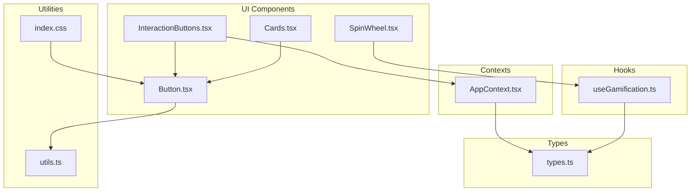
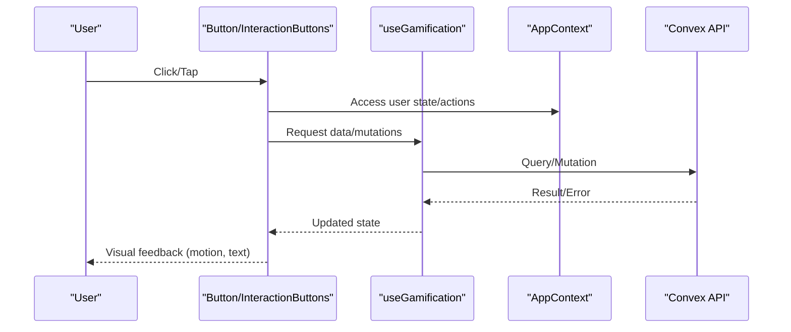
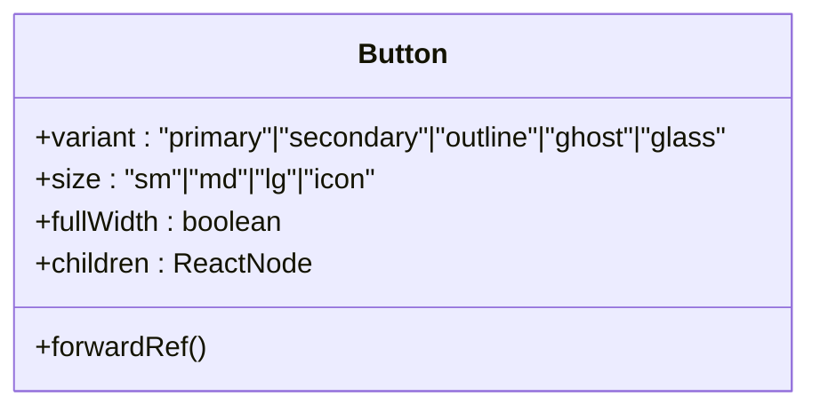
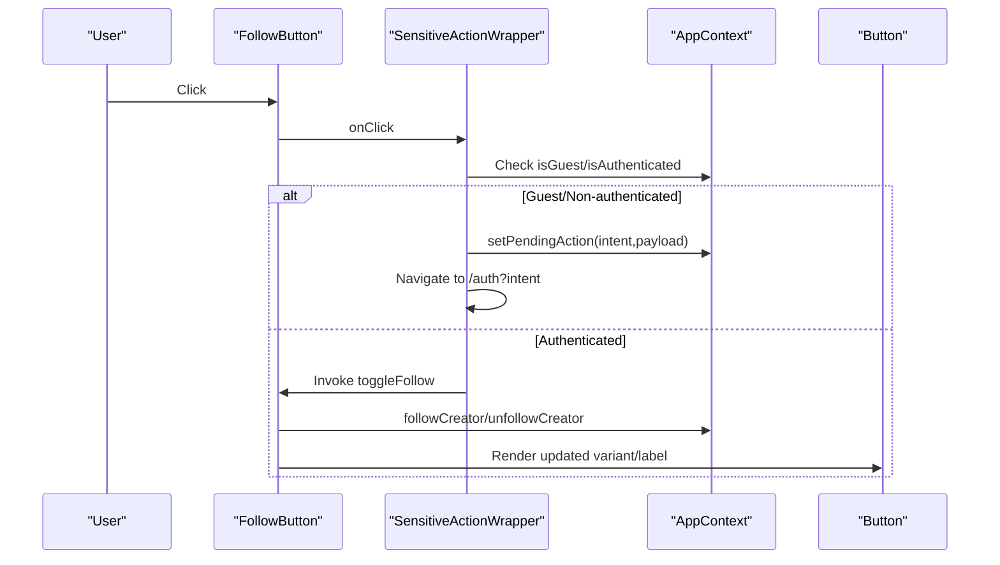
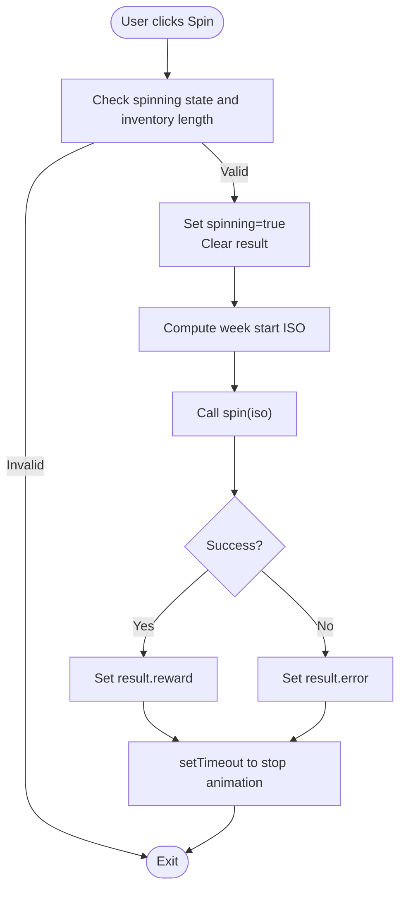
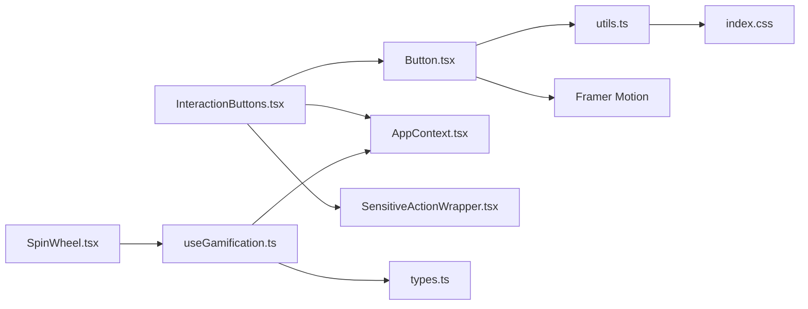

# Interactive Components

<cite>
**Referenced Files in This Document**
- [Button.tsx](file://src/components/ui/Button.tsx)
- [InteractionButtons.tsx](file://src/components/InteractionButtons.tsx)
- [SpinWheel.tsx](file://src/components/ui/SpinWheel.tsx)
- [Cards.tsx](file://src/components/ui/Cards.tsx)
- [SensitiveActionWrapper.tsx](file://src/components/SensitiveActionWrapper.tsx)
- [useGamification.ts](file://src/hooks/useGamification.ts)
- [types.ts](file://src/data/types.ts)
- [utils.ts](file://src/lib/utils.ts)
- [index.css](file://src/index.css)
- [AppContext.tsx](file://src/contexts/AppContext.tsx)
</cite>

## Table of Contents
1. [Introduction](#introduction)
2. [Project Structure](#project-structure)
3. [Core Components](#core-components)
4. [Architecture Overview](#architecture-overview)
5. [Detailed Component Analysis](#detailed-component-analysis)
6. [Dependency Analysis](#dependency-analysis)
7. [Performance Considerations](#performance-considerations)
8. [Troubleshooting Guide](#troubleshooting-guide)
9. [Conclusion](#conclusion)

## Introduction
This document provides comprehensive documentation for interactive UI components focused on user engagement and motion-driven feedback. It covers:
- The Button component with all variants, sizes, and motion states
- The InteractionButtons suite for story interactions (follow, support)
- The SpinWheel component with animation states, reward mechanics, and user feedback
- Prop interfaces, event handling, accessibility, and performance considerations
- Usage patterns and integration approaches across the application

## Project Structure
The interactive components are primarily located under src/components/ui and src/components, with supporting utilities, hooks, and types under src/lib, src/hooks, and src/data respectively. Styles leverage a Tailwind-based design system with custom CSS variables.

**Diagram sources**
- [Button.tsx:1-43](file://src/components/ui/Button.tsx#L1-L43)
- [InteractionButtons.tsx:1-109](file://src/components/InteractionButtons.tsx#L1-L109)
- [SpinWheel.tsx:1-94](file://src/components/ui/SpinWheel.tsx#L1-L94)
- [Cards.tsx:1-276](file://src/components/ui/Cards.tsx#L1-L276)
- [utils.ts:1-7](file://src/lib/utils.ts#L1-L7)
- [index.css:1-224](file://src/index.css#L1-L224)
- [useGamification.ts:1-48](file://src/hooks/useGamification.ts#L1-L48)
- [AppContext.tsx:1-800](file://src/contexts/AppContext.tsx#L1-L800)
- [types.ts:1-155](file://src/data/types.ts#L1-L155)

**Section sources**
- [Button.tsx:1-43](file://src/components/ui/Button.tsx#L1-L43)
- [InteractionButtons.tsx:1-109](file://src/components/InteractionButtons.tsx#L1-L109)
- [SpinWheel.tsx:1-94](file://src/components/ui/SpinWheel.tsx#L1-L94)
- [Cards.tsx:1-276](file://src/components/ui/Cards.tsx#L1-L276)
- [utils.ts:1-7](file://src/lib/utils.ts#L1-L7)
- [index.css:1-224](file://src/index.css#L1-L224)
- [useGamification.ts:1-48](file://src/hooks/useGamification.ts#L1-L48)
- [AppContext.tsx:1-800](file://src/contexts/AppContext.tsx#L1-L800)
- [types.ts:1-155](file://src/data/types.ts#L1-L155)

## Core Components
This section documents the primary interactive components and their capabilities.

- Button
  - Variants: primary, secondary, outline, ghost, glass
  - Sizes: sm, md, lg, icon
  - States: hover, active (via tap scale), focus-visible ring, disabled
  - Motion: Framer Motion tap scale for tactile feedback
  - Accessibility: inherits native button semantics and focus-visible ring
  - Integration: used widely across UI surfaces and cards

- InteractionButtons
  - FollowButton: toggles creator follow/unfollow with contextual styling and icons
  - SupportButton: supports creators via external service with eligibility checks and optional labels

- SpinWheel
  - Animated wheel with configurable slices and weighted rewards
  - Weekly spin eligibility and reward distribution via gamification hook
  - User feedback for errors and wins

**Section sources**
- [Button.tsx:5-42](file://src/components/ui/Button.tsx#L5-L42)
- [InteractionButtons.tsx:9-109](file://src/components/InteractionButtons.tsx#L9-L109)
- [SpinWheel.tsx:16-94](file://src/components/ui/SpinWheel.tsx#L16-L94)

## Architecture Overview
The interactive components integrate with the application’s state and backend systems through a layered architecture:
- UI components consume props and render motion-enhanced states
- Hooks encapsulate backend interactions and state management
- Contexts provide global user and application state
- Utilities and styles ensure consistent design and class composition

**Diagram sources**
- [InteractionButtons.tsx:15-54](file://src/components/InteractionButtons.tsx#L15-L54)
- [SpinWheel.tsx:17-45](file://src/components/ui/SpinWheel.tsx#L17-L45)
- [useGamification.ts:6-47](file://src/hooks/useGamification.ts#L6-L47)
- [AppContext.tsx:181-189](file://src/contexts/AppContext.tsx#L181-L189)

## Detailed Component Analysis

### Button Component
The Button component is a forwardRef’d, motion-enabled button with extensive variant and size combinations. It composes Tailwind classes via a utility function and integrates Framer Motion for subtle press feedback.

- Props
  - variant: primary | secondary | outline | ghost | glass
  - size: sm | md | lg | icon
  - fullWidth: boolean
  - Inherits all native button attributes

- Behavior
  - whileTap applies a slight scale reduction for tactile feedback
  - Focus ring uses a brand color variable for accessibility
  - Disabled state enforces opacity and pointer events
  - Full-width option expands to container width

- Accessibility
  - Uses native button element
  - Focus-visible ring ensures keyboard navigation visibility
  - Disabled state communicates non-interactive state

- Usage Examples
  - Primary call-to-action with icon: [Button.tsx:31-38](file://src/components/ui/Button.tsx#L31-L38)
  - Secondary outlined button: [Button.tsx:21](file://src/components/ui/Button.tsx#L21)
  - Glass variant for backdrop effects: [Button.tsx:24](file://src/components/ui/Button.tsx#L24)

**Diagram sources**
- [Button.tsx:5-42](file://src/components/ui/Button.tsx#L5-L42)

**Section sources**
- [Button.tsx:5-42](file://src/components/ui/Button.tsx#L5-L42)
- [utils.ts:4-6](file://src/lib/utils.ts#L4-L6)
- [index.css:10](file://src/index.css#L10)

### InteractionButtons Component
The InteractionButtons suite provides story and creator engagement controls with sensitive action gating and user feedback.

- FollowButton
  - Determines follow state from user context
  - Conditional variant and styling based on follow state
  - Icons differentiate follow vs following states
  - Wraps actions with SensitiveActionWrapper to enforce auth

- SupportButton
  - Checks creator support eligibility and external link presence
  - Opens external support link after invoking backend support action
  - Disables button and shows explanatory label when support is disabled

- SensitiveActionWrapper
  - Intercepts clicks for guest/non-authenticated users
  - Stores intent and payload, navigates to auth with intent parameter
  - Executes provided click handler or child’s click handler when authenticated

**Diagram sources**
- [InteractionButtons.tsx:15-54](file://src/components/InteractionButtons.tsx#L15-L54)
- [SensitiveActionWrapper.tsx:13-37](file://src/components/SensitiveActionWrapper.tsx#L13-L37)
- [AppContext.tsx:181-182](file://src/contexts/AppContext.tsx#L181-L182)

**Section sources**
- [InteractionButtons.tsx:9-109](file://src/components/InteractionButtons.tsx#L9-L109)
- [SensitiveActionWrapper.tsx:1-38](file://src/components/SensitiveActionWrapper.tsx#L1-L38)
- [AppContext.tsx:181-189](file://src/contexts/AppContext.tsx#L181-L189)
- [types.ts:97-123](file://src/data/types.ts#L97-L123)

### SpinWheel Component
The SpinWheel component renders an animated wheel with weighted rewards, integrates with gamification hooks, and provides user feedback.

- State Management
  - spinning: boolean to drive animation
  - result: object containing reward or error
  - inventory: derived from gamification hook

- Animation and Mechanics
  - Wheel rotates with easing for realistic deceleration
  - Slice angles computed dynamically based on item count
  - Randomized rotation ensures varied outcomes
  - Weekly eligibility determined by start-of-week calculation

- Reward Mechanics
  - Weights sum to compute total probability
  - Backend mutation performs spin and returns reward
  - Error handling displays user-friendly messages

**Diagram sources**
- [SpinWheel.tsx:24-45](file://src/components/ui/SpinWheel.tsx#L24-L45)
- [useGamification.ts:36-39](file://src/hooks/useGamification.ts#L36-L39)

**Section sources**
- [SpinWheel.tsx:16-94](file://src/components/ui/SpinWheel.tsx#L16-L94)
- [useGamification.ts:6-47](file://src/hooks/useGamification.ts#L6-L47)
- [types.ts:97-123](file://src/data/types.ts#L97-L123)

### Supporting UI Elements
- Cards.tsx
  - Provides related UI elements that compose Button (e.g., LockedContentCTA, PremiumPlanCard)
  - Demonstrates variant usage and responsive sizing

**Section sources**
- [Cards.tsx:139-159](file://src/components/ui/Cards.tsx#L139-L159)
- [Cards.tsx:207-216](file://src/components/ui/Cards.tsx#L207-L216)

## Dependency Analysis
The interactive components rely on a cohesive stack of utilities, hooks, and contexts to deliver consistent behavior and motion.

**Diagram sources**
- [Button.tsx:1-43](file://src/components/ui/Button.tsx#L1-L43)
- [InteractionButtons.tsx:1-109](file://src/components/InteractionButtons.tsx#L1-L109)
- [SpinWheel.tsx:1-94](file://src/components/ui/SpinWheel.tsx#L1-L94)
- [SensitiveActionWrapper.tsx:1-38](file://src/components/SensitiveActionWrapper.tsx#L1-L38)
- [useGamification.ts:1-48](file://src/hooks/useGamification.ts#L1-L48)
- [utils.ts:1-7](file://src/lib/utils.ts#L1-L7)
- [index.css:1-224](file://src/index.css#L1-L224)
- [AppContext.tsx:1-800](file://src/contexts/AppContext.tsx#L1-L800)
- [types.ts:1-155](file://src/data/types.ts#L1-L155)

**Section sources**
- [Button.tsx:1-43](file://src/components/ui/Button.tsx#L1-L43)
- [InteractionButtons.tsx:1-109](file://src/components/InteractionButtons.tsx#L1-L109)
- [SpinWheel.tsx:1-94](file://src/components/ui/SpinWheel.tsx#L1-L94)
- [SensitiveActionWrapper.tsx:1-38](file://src/components/SensitiveActionWrapper.tsx#L1-L38)
- [useGamification.ts:1-48](file://src/hooks/useGamification.ts#L1-L48)
- [utils.ts:1-7](file://src/lib/utils.ts#L1-L7)
- [index.css:1-224](file://src/index.css#L1-L224)
- [AppContext.tsx:1-800](file://src/contexts/AppContext.tsx#L1-L800)
- [types.ts:1-155](file://src/data/types.ts#L1-L155)

## Performance Considerations
- Motion and Animations
  - Button’s whileTap scale is lightweight and improves perceived responsiveness
  - SpinWheel uses a single animated element with easing; keep slice count reasonable to avoid layout thrashing
  - Memoize derived values (e.g., inventory) to prevent unnecessary re-renders

- State Management
  - useGamification centralizes backend calls and caching; avoid redundant queries
  - AppContext manages user state; ensure actions are memoized to prevent re-renders

- Accessibility
  - Focus rings and disabled states improve usability for keyboard and assistive tech users
  - Motion preferences: respect reduced motion settings via CSS media query

- Rendering
  - Use minimal DOM nodes for animations; prefer transforms over layout-affecting properties
  - Defer heavy computations off the main thread when possible

[No sources needed since this section provides general guidance]

## Troubleshooting Guide
- Button appears unresponsive
  - Verify disabled prop is not unintentionally set
  - Confirm focus-visible ring is visible for keyboard users

- InteractionButtons not triggering actions
  - Ensure user is authenticated; SensitiveActionWrapper redirects guests to auth
  - Check AppContext actions (followCreator/unfollowCreator/supportCreator) are wired correctly

- SpinWheel does not animate or spin
  - Confirm spinning state is toggled and animation duration is sufficient
  - Validate gamification hook inventory and eligibility checks

- Styling inconsistencies
  - Ensure Tailwind CSS variables (brand colors) are applied consistently
  - Verify utility class composition via cn helper

**Section sources**
- [SensitiveActionWrapper.tsx:17-32](file://src/components/SensitiveActionWrapper.tsx#L17-L32)
- [SpinWheel.tsx:47-44](file://src/components/ui/SpinWheel.tsx#L47-L44)
- [index.css:6-23](file://src/index.css#L6-L23)
- [utils.ts:4-6](file://src/lib/utils.ts#L4-L6)

## Conclusion
The interactive components implement a cohesive design system with motion-driven feedback, robust state management, and strong accessibility. By leveraging Framer Motion, centralized hooks, and a consistent utility layer, the UI remains performant, maintainable, and engaging across user interactions.

[No sources needed since this section summarizes without analyzing specific files]