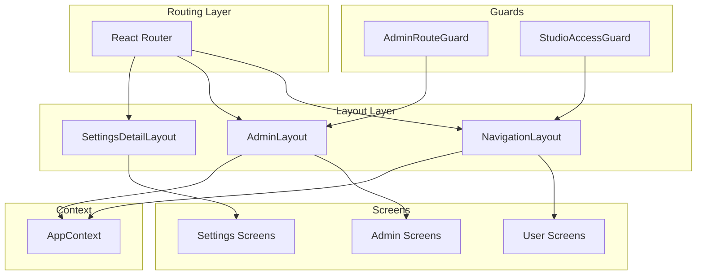
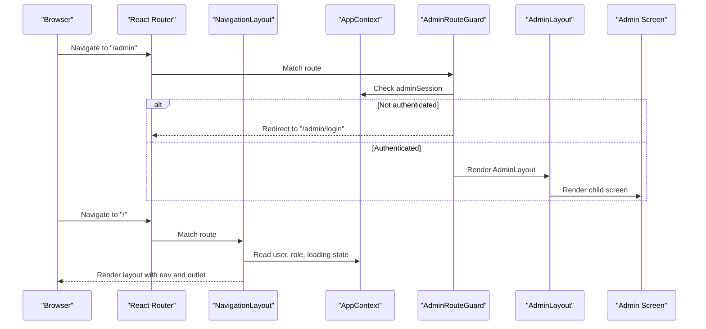
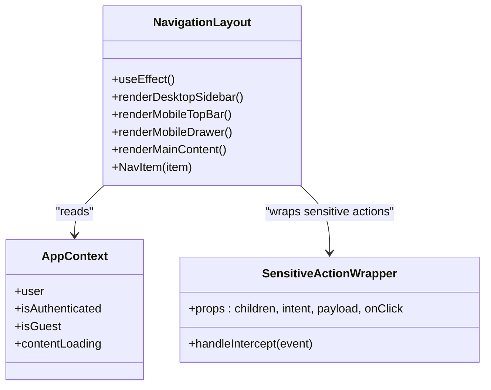
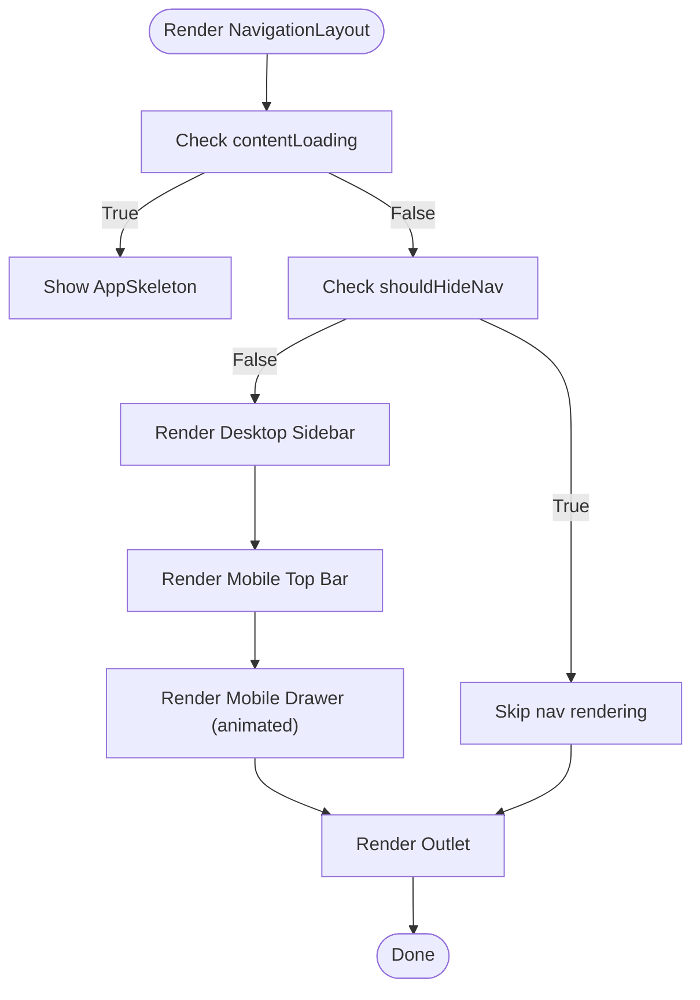
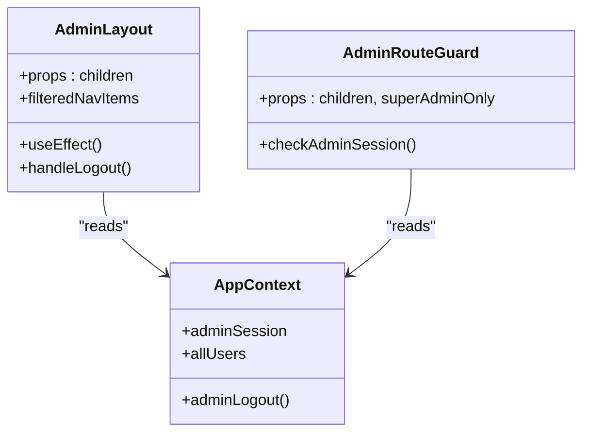
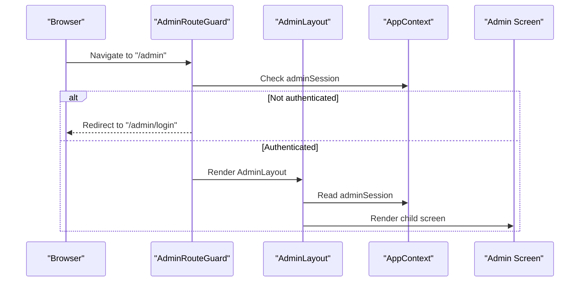
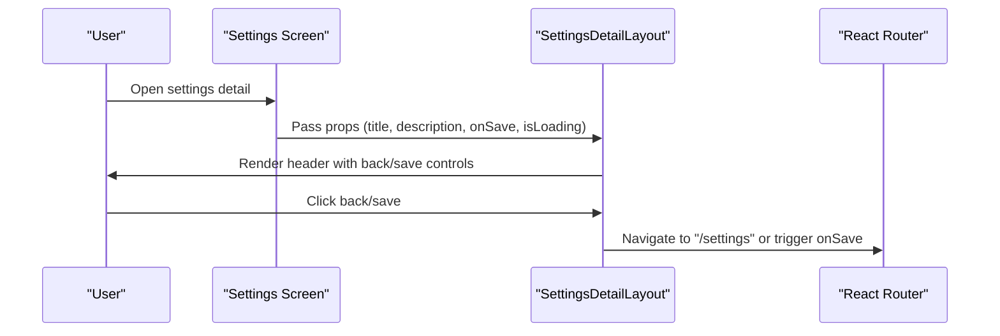
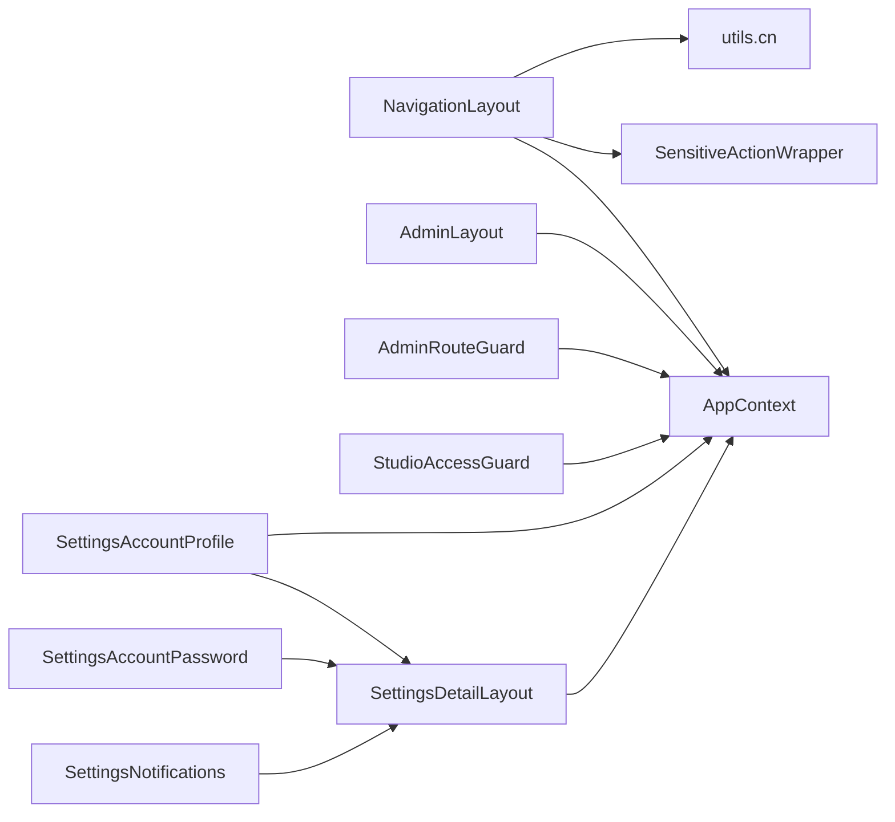

# Layout and Navigation Components

<cite>
**Referenced Files in This Document**
- [NavigationLayout.tsx](file://src/components/NavigationLayout.tsx)
- [AdminLayout.tsx](file://src/components/admin/AdminLayout.tsx)
- [SettingsDetailLayout.tsx](file://src/components/SettingsDetailLayout.tsx)
- [AdminRouteGuard.tsx](file://src/components/admin/AdminRouteGuard.tsx)
- [StudioAccessGuard.tsx](file://src/components/StudioAccessGuard.tsx)
- [AppContext.tsx](file://src/contexts/AppContext.tsx)
- [SensitiveActionWrapper.tsx](file://src/components/SensitiveActionWrapper.tsx)
- [utils.ts](file://src/lib/utils.ts)
- [App.tsx](file://src/App.tsx)
- [SettingsAccountProfile.tsx](file://src/screens/settings/SettingsAccountProfile.tsx)
- [SettingsAccountPassword.tsx](file://src/screens/settings/SettingsAccountPassword.tsx)
- [SettingsNotifications.tsx](file://src/screens/settings/SettingsNotifications.tsx)
- [index.css](file://src/index.css)
</cite>

## Table of Contents
1. [Introduction](#introduction)
2. [Project Structure](#project-structure)
3. [Core Components](#core-components)
4. [Architecture Overview](#architecture-overview)
5. [Detailed Component Analysis](#detailed-component-analysis)
6. [Dependency Analysis](#dependency-analysis)
7. [Performance Considerations](#performance-considerations)
8. [Troubleshooting Guide](#troubleshooting-guide)
9. [Conclusion](#conclusion)
10. [Appendices](#appendices)

## Introduction
This document provides comprehensive documentation for the layout and navigation components that power the application’s user interface. It covers:
- NavigationLayout: responsive main navigation with route-based highlighting, user menu integration, and mobile drawer patterns
- AdminLayout: administrative dashboard with permission-based sidebar navigation and admin-specific UI patterns
- SettingsDetailLayout: settings page scaffolding with form organization, section navigation, and validation feedback
- Routing integration, responsive design, accessibility, and performance considerations
- Composition patterns for different user roles and customization approaches

## Project Structure
The layout system is composed of:
- A global navigation shell that wraps most user-facing routes
- An admin shell that guards and renders administrative pages
- A settings detail layout that standardizes form pages
- Guards for role-based access (admin and studio)
- Shared utilities for styling and authentication state

**Diagram sources**
- [App.tsx:96-155](file://src/App.tsx#L96-L155)
- [App.tsx:160-357](file://src/App.tsx#L160-L357)
- [NavigationLayout.tsx:25-324](file://src/components/NavigationLayout.tsx#L25-L324)
- [AdminLayout.tsx:56-289](file://src/components/admin/AdminLayout.tsx#L56-L289)
- [SettingsDetailLayout.tsx:14-67](file://src/components/SettingsDetailLayout.tsx#L14-L67)
- [AdminRouteGuard.tsx:10-24](file://src/components/admin/AdminRouteGuard.tsx#L10-L24)
- [StudioAccessGuard.tsx:9-36](file://src/components/StudioAccessGuard.tsx#L9-L36)
- [AppContext.tsx:139-203](file://src/contexts/AppContext.tsx#L139-L203)

**Section sources**
- [App.tsx:85-363](file://src/App.tsx#L85-L363)

## Core Components
- NavigationLayout: Provides desktop and mobile navigation, route-aware highlighting, user menu, and conditional rendering based on content loading and view context.
- AdminLayout: Provides a responsive admin shell with permission-aware sidebar, mobile drawer, header, and logout flow.
- SettingsDetailLayout: Provides a standardized settings detail page with back button, save action, and animated content area.

**Section sources**
- [NavigationLayout.tsx:25-324](file://src/components/NavigationLayout.tsx#L25-L324)
- [AdminLayout.tsx:56-289](file://src/components/admin/AdminLayout.tsx#L56-L289)
- [SettingsDetailLayout.tsx:14-67](file://src/components/SettingsDetailLayout.tsx#L14-L67)

## Architecture Overview
The layout architecture integrates routing, context, and guards to deliver role-aware navigation experiences.

**Diagram sources**
- [App.tsx:160-357](file://src/App.tsx#L160-L357)
- [AdminRouteGuard.tsx:10-24](file://src/components/admin/AdminRouteGuard.tsx#L10-L24)
- [NavigationLayout.tsx:25-324](file://src/components/NavigationLayout.tsx#L25-L324)
- [AdminLayout.tsx:56-289](file://src/components/admin/AdminLayout.tsx#L56-L289)
- [AppContext.tsx:139-203](file://src/contexts/AppContext.tsx#L139-L203)

## Detailed Component Analysis

### NavigationLayout
Responsibilities:
- Provide desktop sidebar and mobile drawer navigation
- Route-based highlighting for active links
- User menu integration with premium badge and profile link
- Conditional rendering for splash/onboarding/auth and reader view
- Responsive behavior using Tailwind breakpoints and framer-motion animations

Key behaviors:
- Desktop navigation groups “Menu” and “Account” items
- Mobile drawer slides in with backdrop blur and scroll containment
- Active link detection considers exact and prefix-based matches
- Sensitive actions are wrapped to prompt guest users to authenticate
- Body overflow is controlled while drawer is open

Props and integration:
- Consumes user role and authentication state from AppContext
- Uses react-router-dom for navigation and outlet rendering
- Uses SensitiveActionWrapper for sensitive routes

Responsive design:
- Desktop sidebar visible from lg breakpoint
- Mobile top bar and drawer for smaller screens
- Safe area insets considered for mobile bottom padding

Accessibility:
- Proper aria labels and roles for drawer and buttons
- Focus-friendly interactive elements

Performance:
- Uses memoized active state computation
- Animations powered by framer-motion with spring damping
- Minimal re-renders via conditional rendering

**Section sources**
- [NavigationLayout.tsx:25-324](file://src/components/NavigationLayout.tsx#L25-L324)
- [SensitiveActionWrapper.tsx:13-38](file://src/components/SensitiveActionWrapper.tsx#L13-L38)
- [utils.ts:4-7](file://src/lib/utils.ts#L4-L7)

#### NavigationLayout Class Diagram

**Diagram sources**
- [NavigationLayout.tsx:25-324](file://src/components/NavigationLayout.tsx#L25-L324)
- [SensitiveActionWrapper.tsx:13-38](file://src/components/SensitiveActionWrapper.tsx#L13-L38)
- [AppContext.tsx:139-203](file://src/contexts/AppContext.tsx#L139-L203)

#### NavigationLayout Flowchart

**Diagram sources**
- [NavigationLayout.tsx:85-92](file://src/components/NavigationLayout.tsx#L85-L92)
- [NavigationLayout.tsx:94-302](file://src/components/NavigationLayout.tsx#L94-L302)

### AdminLayout
Responsibilities:
- Provide admin dashboard shell with desktop and mobile navigation
- Permission-aware sidebar items (super admin only items hidden otherwise)
- Mobile drawer with user profile and logout
- Header with breadcrumb-like path and user stats
- Child route rendering via Outlet

Key behaviors:
- Filters nav items based on admin role
- Loads registered user count periodically
- Mobile drawer slides in from the right with backdrop
- Logout triggers admin session reset and navigates to login

Props and integration:
- Accepts children for route content
- Uses AppContext for adminSession and logout
- Uses react-router-dom for navigation

Responsive design:
- Desktop sidebar visible from lg breakpoint
- Mobile header and drawer for smaller screens
- Sticky positioning for desktop sidebar and header

Accessibility:
- Proper focus order and keyboard navigation
- ARIA attributes for drawer and buttons

Performance:
- Periodic refresh for user stats with cleanup
- Minimal re-renders via filtered nav items

**Section sources**
- [AdminLayout.tsx:56-289](file://src/components/admin/AdminLayout.tsx#L56-L289)
- [AdminRouteGuard.tsx:10-24](file://src/components/admin/AdminRouteGuard.tsx#L10-L24)

#### AdminLayout Class Diagram

**Diagram sources**
- [AdminLayout.tsx:56-289](file://src/components/admin/AdminLayout.tsx#L56-L289)
- [AdminRouteGuard.tsx:10-24](file://src/components/admin/AdminRouteGuard.tsx#L10-L24)
- [AppContext.tsx:139-203](file://src/contexts/AppContext.tsx#L139-L203)

#### AdminLayout Sequence

**Diagram sources**
- [App.tsx:160-357](file://src/App.tsx#L160-L357)
- [AdminRouteGuard.tsx:10-24](file://src/components/admin/AdminRouteGuard.tsx#L10-L24)
- [AdminLayout.tsx:56-289](file://src/components/admin/AdminLayout.tsx#L56-L289)
- [AppContext.tsx:139-203](file://src/contexts/AppContext.tsx#L139-L203)

### SettingsDetailLayout
Responsibilities:
- Provide a standardized container for settings detail pages
- Back navigation to settings list
- Optional save action with loading state and spinner
- Animated entrance for content

Props:
- title, description, children, onSave, isLoading

Integration:
- Used by settings screens to maintain consistent UX and layout

**Section sources**
- [SettingsDetailLayout.tsx:14-67](file://src/components/SettingsDetailLayout.tsx#L14-L67)

#### SettingsDetailLayout Sequence

**Diagram sources**
- [SettingsDetailLayout.tsx:14-67](file://src/components/SettingsDetailLayout.tsx#L14-L67)
- [SettingsAccountProfile.tsx:132-137](file://src/screens/settings/SettingsAccountProfile.tsx#L132-L137)
- [SettingsAccountPassword.tsx:26-31](file://src/screens/settings/SettingsAccountPassword.tsx#L26-L31)
- [SettingsNotifications.tsx:40-45](file://src/screens/settings/SettingsNotifications.tsx#L40-L45)

### Role-Based Access Guards
- AdminRouteGuard: Protects admin routes and optionally restricts to super_admin
- StudioAccessGuard: Controls access to creator studio based on user role and creator access status

**Section sources**
- [AdminRouteGuard.tsx:10-24](file://src/components/admin/AdminRouteGuard.tsx#L10-L24)
- [StudioAccessGuard.tsx:9-36](file://src/components/StudioAccessGuard.tsx#L9-L36)

## Dependency Analysis
- NavigationLayout depends on AppContext for user state, SensitiveActionWrapper for sensitive actions, and utils for class merging
- AdminLayout depends on AppContext for adminSession and periodic stats refresh
- SettingsDetailLayout is used by settings screens to standardize layout
- Guards depend on AppContext and react-router-dom for navigation

**Diagram sources**
- [NavigationLayout.tsx:21-23](file://src/components/NavigationLayout.tsx#L21-L23)
- [SensitiveActionWrapper.tsx:14-15](file://src/components/SensitiveActionWrapper.tsx#L14-L15)
- [utils.ts:4-7](file://src/lib/utils.ts#L4-L7)
- [AdminLayout.tsx:25-28](file://src/components/admin/AdminLayout.tsx#L25-L28)
- [AdminRouteGuard.tsx:11-12](file://src/components/admin/AdminRouteGuard.tsx#L11-L12)
- [StudioAccessGuard.tsx:10-11](file://src/components/StudioAccessGuard.tsx#L10-L11)
- [SettingsDetailLayout.tsx:14-20](file://src/components/SettingsDetailLayout.tsx#L14-L20)
- [SettingsAccountProfile.tsx:8-11](file://src/screens/settings/SettingsAccountProfile.tsx#L8-L11)
- [SettingsAccountPassword.tsx:2-3](file://src/screens/settings/SettingsAccountPassword.tsx#L2-L3)
- [SettingsNotifications.tsx:2-4](file://src/screens/settings/SettingsNotifications.tsx#L2-L4)

**Section sources**
- [AppContext.tsx:139-203](file://src/contexts/AppContext.tsx#L139-L203)

## Performance Considerations
- NavigationLayout
  - Uses minimal state and effects; drawer open state toggles body overflow to prevent scrolling behind the drawer
  - Active link detection uses computed isActive to avoid unnecessary re-renders
  - Framer-motion animations configured with tuned spring parameters for smoothness
- AdminLayout
  - Periodic refresh for user stats with interval cleanup to prevent memory leaks
  - Filtered nav items computed once per render to minimize DOM nodes
- SettingsDetailLayout
  - Stateless component with optional save handler; leverages motion for entrance animation
- General
  - Tailwind utilities and CSS variables minimize runtime style computations
  - Responsive breakpoints leverage Tailwind’s compiled classes

[No sources needed since this section provides general guidance]

## Troubleshooting Guide
Common issues and resolutions:
- Drawer not closing on mobile
  - Ensure click handlers call setDrawerOpen(false) and backdrop click propagates correctly
- Active link highlighting incorrect
  - Verify isActive logic matches exact or prefix-based paths
- Guest users unable to access sensitive routes
  - SensitiveActionWrapper intercepts clicks and redirects to auth with intent
- Admin navigation missing items
  - Super admin-only items are hidden unless role is super_admin
- Mobile drawer scroll issues
  - Body overflow is controlled during drawer open; ensure no other overlays conflict

**Section sources**
- [NavigationLayout.tsx:214-276](file://src/components/NavigationLayout.tsx#L214-L276)
- [SensitiveActionWrapper.tsx:17-32](file://src/components/SensitiveActionWrapper.tsx#L17-L32)
- [AdminLayout.tsx:70-72](file://src/components/admin/AdminLayout.tsx#L70-L72)

## Conclusion
The layout and navigation system provides a robust, responsive, and accessible foundation for both reader and admin experiences. NavigationLayout delivers role-aware navigation with sensitive action gating, AdminLayout enforces permission-based access with a clean UI, and SettingsDetailLayout standardizes settings page composition. Guards ensure appropriate access control, while responsive design and performance optimizations maintain a smooth user experience across devices.

[No sources needed since this section summarizes without analyzing specific files]

## Appendices

### Responsive Design and Breakpoints
- Desktop sidebar visible from lg breakpoint
- Mobile drawer width constrained to 80% max width
- Safe area insets considered for mobile bottom padding
- Reduced motion preference respected globally

**Section sources**
- [NavigationLayout.tsx:96-151](file://src/components/NavigationLayout.tsx#L96-L151)
- [NavigationLayout.tsx:197](file://src/components/NavigationLayout.tsx#L197)
- [index.css:216-224](file://src/index.css#L216-L224)

### Accessibility Features
- Drawer and menu dialogs include aria-modal and aria-label
- Buttons include aria-labels where icons are used
- Focus management maintained through proper tab order
- Reduced motion support enabled globally

**Section sources**
- [NavigationLayout.tsx:160-167](file://src/components/NavigationLayout.tsx#L160-L167)
- [NavigationLayout.tsx:190-193](file://src/components/NavigationLayout.tsx#L190-L193)
- [AdminLayout.tsx:165-178](file://src/components/admin/AdminLayout.tsx#L165-L178)
- [index.css:216-224](file://src/index.css#L216-L224)

### Example Layout Composition and Customization
- Reader navigation: Desktop “Menu” and “Account” sections; mobile drawer with sensitive actions
- Creator navigation: Studio-aware navigation items; StudioAccessGuard ensures access control
- Admin navigation: Role-filtered items; AdminRouteGuard protects routes
- Settings pages: Use SettingsDetailLayout to standardize save/back behavior

**Section sources**
- [NavigationLayout.tsx:34-83](file://src/components/NavigationLayout.tsx#L34-L83)
- [StudioAccessGuard.tsx:25-34](file://src/components/StudioAccessGuard.tsx#L25-L34)
- [AdminLayout.tsx:34-52](file://src/components/admin/AdminLayout.tsx#L34-L52)
- [SettingsDetailLayout.tsx:14-20](file://src/components/SettingsDetailLayout.tsx#L14-L20)