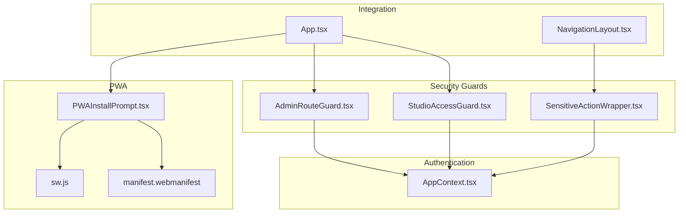
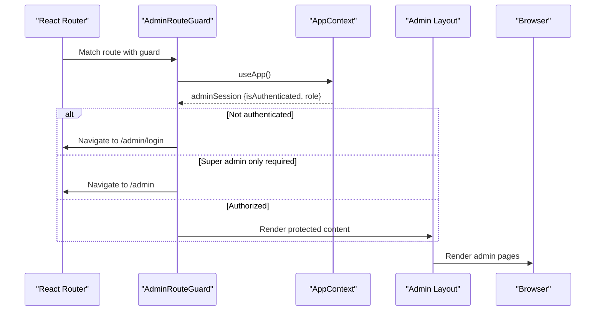
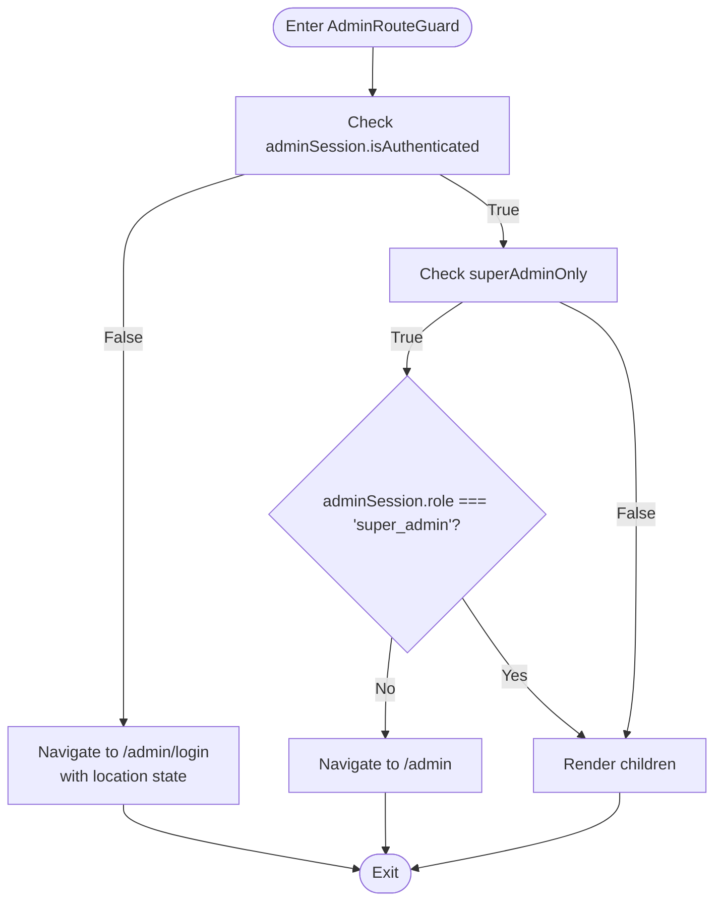
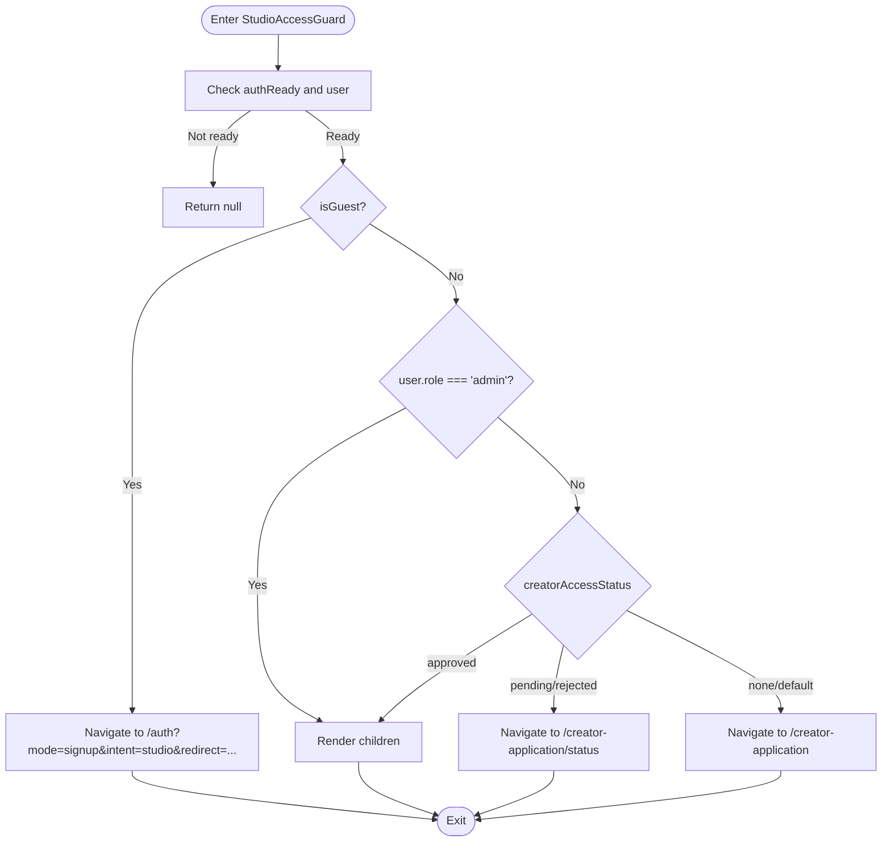
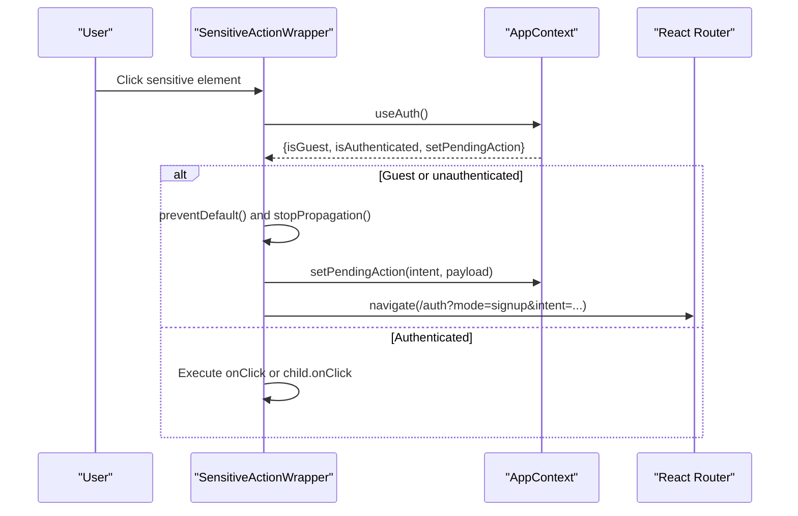
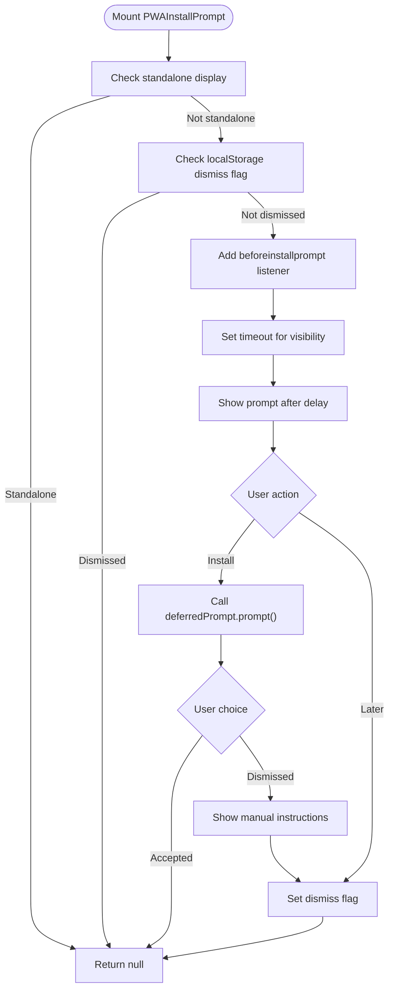
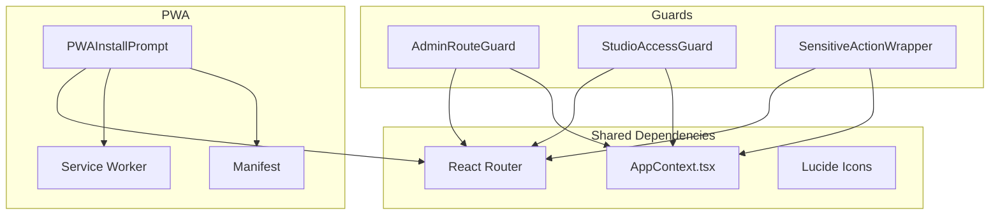

# Specialized Components

<cite>
**Referenced Files in This Document**
- [AdminRouteGuard.tsx](file://src/components/admin/AdminRouteGuard.tsx)
- [StudioAccessGuard.tsx](file://src/components/StudioAccessGuard.tsx)
- [SensitiveActionWrapper.tsx](file://src/components/SensitiveActionWrapper.tsx)
- [PWAInstallPrompt.tsx](file://src/components/PWAInstallPrompt.tsx)
- [AppContext.tsx](file://src/contexts/AppContext.tsx)
- [App.tsx](file://src/App.tsx)
- [NavigationLayout.tsx](file://src/components/NavigationLayout.tsx)
- [sw.js](file://public/sw.js)
- [manifest.webmanifest](file://public/manifest.webmanifest)
</cite>

## Table of Contents
1. [Introduction](#introduction)
2. [Project Structure](#project-structure)
3. [Core Components](#core-components)
4. [Architecture Overview](#architecture-overview)
5. [Detailed Component Analysis](#detailed-component-analysis)
6. [Dependency Analysis](#dependency-analysis)
7. [Performance Considerations](#performance-considerations)
8. [Troubleshooting Guide](#troubleshooting-guide)
9. [Conclusion](#conclusion)

## Introduction
This document provides comprehensive technical documentation for specialized components focused on security, access control, and progressive web app (PWA) capabilities. It covers:
- AdminRouteGuard: Role-based access control for administrative routes
- StudioAccessGuard: Creator studio access control with workspace permissions
- SensitiveActionWrapper: Confirmation dialogs and security prompts for critical actions
- PWAInstallPrompt: Progressive web app installation flow with browser compatibility

The documentation explains component props, security considerations, integration with authentication systems, usage examples, error handling patterns, and accessibility compliance.

## Project Structure
The specialized components are organized within the frontend application structure:
- Security guards and access controls are located under src/components/admin and src/components
- Authentication and session management are centralized in src/contexts/AppContext.tsx
- PWA assets are under public (service worker and manifest)
- Integration points are defined in src/App.tsx and src/components/NavigationLayout.tsx

**Diagram sources**
- [AdminRouteGuard.tsx:1-24](file://src/components/admin/AdminRouteGuard.tsx#L1-L24)
- [StudioAccessGuard.tsx:1-36](file://src/components/StudioAccessGuard.tsx#L1-L36)
- [SensitiveActionWrapper.tsx:1-38](file://src/components/SensitiveActionWrapper.tsx#L1-L38)
- [PWAInstallPrompt.tsx:1-129](file://src/components/PWAInstallPrompt.tsx#L1-L129)
- [AppContext.tsx:1-1452](file://src/contexts/AppContext.tsx#L1-L1452)
- [App.tsx:1-375](file://src/App.tsx#L1-L375)
- [NavigationLayout.tsx:1-324](file://src/components/NavigationLayout.tsx#L1-L324)
- [sw.js:1-29](file://public/sw.js#L1-L29)
- [manifest.webmanifest:1-20](file://public/manifest.webmanifest#L1-L20)

**Section sources**
- [App.tsx:1-375](file://src/App.tsx#L1-L375)
- [AppContext.tsx:1-1452](file://src/contexts/AppContext.tsx#L1-L1452)

## Core Components
This section summarizes the primary specialized components and their responsibilities.

- AdminRouteGuard: Enforces admin-only access with optional super-admin restriction
- StudioAccessGuard: Controls access to creator studio routes based on user roles and application status
- SensitiveActionWrapper: Intercepts clicks on sensitive actions, prompting authentication or confirmation
- PWAInstallPrompt: Presents installation prompts and handles cross-platform installation flows

Key integration points:
- All guards consume authentication state from AppContext
- PWA components rely on browser APIs and service worker lifecycle events
- NavigationLayout integrates SensitiveActionWrapper into navigation items

**Section sources**
- [AdminRouteGuard.tsx:1-24](file://src/components/admin/AdminRouteGuard.tsx#L1-L24)
- [StudioAccessGuard.tsx:1-36](file://src/components/StudioAccessGuard.tsx#L1-L36)
- [SensitiveActionWrapper.tsx:1-38](file://src/components/SensitiveActionWrapper.tsx#L1-L38)
- [PWAInstallPrompt.tsx:1-129](file://src/components/PWAInstallPrompt.tsx#L1-L129)
- [AppContext.tsx:1-1452](file://src/contexts/AppContext.tsx#L1-L1452)
- [NavigationLayout.tsx:1-324](file://src/components/NavigationLayout.tsx#L1-L324)

## Architecture Overview
The specialized components integrate with the authentication and routing infrastructure to provide layered security and user experience enhancements.

**Diagram sources**
- [AdminRouteGuard.tsx:10-23](file://src/components/admin/AdminRouteGuard.tsx#L10-L23)
- [AppContext.tsx:139-203](file://src/contexts/AppContext.tsx#L139-L203)
- [App.tsx:160-196](file://src/App.tsx#L160-L196)

## Detailed Component Analysis

### AdminRouteGuard Component
AdminRouteGuard enforces role-based access control for administrative routes. It checks admin session state and optionally restricts access to super admins.

Props:
- children: ReactNode (protected content)
- superAdminOnly: boolean (optional, defaults to false)

Behavior:
- Redirects unauthenticated users to /admin/login with location state
- Redirects non-super-admin users to /admin when superAdminOnly is true
- Renders children when authorized

Security considerations:
- Uses adminSession from AppContext for authentication and role verification
- Prevents unauthorized access to admin-only content
- Supports granular permissions via superAdminOnly flag

Integration:
- Mounted around admin routes in App.tsx
- Consumes useApp() hook for session state

**Diagram sources**
- [AdminRouteGuard.tsx:10-23](file://src/components/admin/AdminRouteGuard.tsx#L10-L23)

**Section sources**
- [AdminRouteGuard.tsx:1-24](file://src/components/admin/AdminRouteGuard.tsx#L1-L24)
- [AppContext.tsx:139-203](file://src/contexts/AppContext.tsx#L139-L203)
- [App.tsx:160-196](file://src/App.tsx#L160-L196)

### StudioAccessGuard Component
StudioAccessGuard controls access to creator studio routes based on user authentication, guest status, and creator application status.

Props:
- children: ReactNode (protected content)

Behavior:
- Returns null while auth is initializing
- Redirects guests to authentication with intent=studio and redirect parameters
- Allows admins and approved creators to access studio
- Redirects pending/rejected applications to status page
- Redirects users without application to application form

Security considerations:
- Prevents unauthorized access to creator workspace
- Guides users through application process
- Maintains separation between reader and creator experiences

Integration:
- Wrapped around studio routes in App.tsx
- Uses AppContext for user state and authReady flag

**Diagram sources**
- [StudioAccessGuard.tsx:9-35](file://src/components/StudioAccessGuard.tsx#L9-L35)
- [AppContext.tsx:139-203](file://src/contexts/AppContext.tsx#L139-L203)

**Section sources**
- [StudioAccessGuard.tsx:1-36](file://src/components/StudioAccessGuard.tsx#L1-L36)
- [AppContext.tsx:139-203](file://src/contexts/AppContext.tsx#L139-L203)
- [App.tsx:134-155](file://src/App.tsx#L134-L155)

### SensitiveActionWrapper Component
SensitiveActionWrapper intercepts clicks on sensitive actions, prompting authentication or executing pending actions after sign-up.

Props:
- children: React.ReactElement (wrapped element)
- intent?: string (action intent identifier)
- payload?: any (action payload)
- onClick?: (e: React.MouseEvent) => void (optional handler)
- key?: React.Key (element key)

Behavior:
- For guests or unauthenticated users: prevents default, sets pending action, navigates to authentication
- For authenticated users: executes provided onClick or child's onClick
- Clones child element with intercepted onClick handler

Security considerations:
- Prevents unauthorized sensitive operations
- Preserves user intent through pending action storage
- Integrates with AppContext pending action mechanism

Integration:
- Used in NavigationLayout for sensitive navigation items
- Consumes useAuth hook for authentication state
- Works with AppContext.setPendingAction and executePendingAction

**Diagram sources**
- [SensitiveActionWrapper.tsx:13-37](file://src/components/SensitiveActionWrapper.tsx#L13-L37)
- [AppContext.tsx:910-936](file://src/contexts/AppContext.tsx#L910-L936)
- [NavigationLayout.tsx:216-228](file://src/components/NavigationLayout.tsx#L216-L228)

**Section sources**
- [SensitiveActionWrapper.tsx:1-38](file://src/components/SensitiveActionWrapper.tsx#L1-L38)
- [AppContext.tsx:910-936](file://src/contexts/AppContext.tsx#L910-L936)
- [NavigationLayout.tsx:216-228](file://src/components/NavigationLayout.tsx#L216-L228)

### PWAInstallPrompt Component
PWAInstallPrompt manages progressive web app installation with cross-browser compatibility and user gesture requirements.

Key features:
- Detects standalone display mode and suppresses prompts accordingly
- Handles beforeinstallprompt event and stores deferred prompt
- Implements manual installation instructions for iOS
- Respects user dismissal preference via localStorage
- Provides delayed visibility with configurable timing

Props: None (uses internal state and effects)

Behavior:
- Listens for beforeinstallprompt and appinstalled events
- Shows installation prompt after delay (default 12 seconds)
- Handles installation flow and user choice outcomes
- Dismisses prompt and suppresses future prompts

Browser compatibility:
- Standalone detection via matchMedia and navigator.standalone
- iOS detection via userAgent
- Manual installation instructions for iOS and Android

**Diagram sources**
- [PWAInstallPrompt.tsx:20-73](file://src/components/PWAInstallPrompt.tsx#L20-L73)
- [sw.js:1-29](file://public/sw.js#L1-L29)
- [manifest.webmanifest:1-20](file://public/manifest.webmanifest#L1-L20)

**Section sources**
- [PWAInstallPrompt.tsx:1-129](file://src/components/PWAInstallPrompt.tsx#L1-L129)
- [sw.js:1-29](file://public/sw.js#L1-L29)
- [manifest.webmanifest:1-20](file://public/manifest.webmanifest#L1-L20)

## Dependency Analysis
The specialized components share common dependencies and integration patterns:

**Diagram sources**
- [AppContext.tsx:1-1452](file://src/contexts/AppContext.tsx#L1-L1452)
- [AdminRouteGuard.tsx:1-24](file://src/components/admin/AdminRouteGuard.tsx#L1-L24)
- [StudioAccessGuard.tsx:1-36](file://src/components/StudioAccessGuard.tsx#L1-L36)
- [SensitiveActionWrapper.tsx:1-38](file://src/components/SensitiveActionWrapper.tsx#L1-L38)
- [PWAInstallPrompt.tsx:1-129](file://src/components/PWAInstallPrompt.tsx#L1-L129)
- [sw.js:1-29](file://public/sw.js#L1-L29)
- [manifest.webmanifest:1-20](file://public/manifest.webmanifest#L1-L20)

**Section sources**
- [AppContext.tsx:1-1452](file://src/contexts/AppContext.tsx#L1-L1452)
- [App.tsx:1-375](file://src/App.tsx#L1-L375)

## Performance Considerations
- AdminRouteGuard and StudioAccessGuard perform lightweight checks using AppContext state, minimizing re-renders
- PWAInstallPrompt uses memoization for platform detection and cleanup effects to prevent memory leaks
- SensitiveActionWrapper clones elements efficiently and avoids unnecessary re-renders
- Authentication state is centralized in AppContext, enabling efficient prop drilling and context consumption

## Troubleshooting Guide
Common issues and resolutions:

Authentication state synchronization:
- Ensure AppContext.authReady is properly managed during initialization
- Verify Firebase authentication listeners are established before route guards evaluate state

Admin access control:
- Confirm adminSession persistence in localStorage
- Check super_admin role assignment in AppContext.adminLogin

Studio access:
- Validate creatorAccessStatus transitions through application approval workflow
- Ensure pendingAction state is cleared after execution

PWA installation:
- Verify service worker registration and caching strategy
- Check beforeinstallprompt event firing and deferredPrompt availability
- Confirm manifest configuration and icons

Sensitive actions:
- Ensure pendingAction is set before navigation to authentication
- Verify executePendingAction clears pending state appropriately

**Section sources**
- [AppContext.tsx:636-709](file://src/contexts/AppContext.tsx#L636-L709)
- [AppContext.tsx:910-936](file://src/contexts/AppContext.tsx#L910-L936)
- [sw.js:1-29](file://public/sw.js#L1-L29)
- [manifest.webmanifest:1-20](file://public/manifest.webmanifest#L1-L20)

## Conclusion
The specialized components provide robust security and user experience enhancements:
- AdminRouteGuard ensures proper administrative access control
- StudioAccessGuard manages creator workspace permissions and application gating
- SensitiveActionWrapper protects critical user actions through authentication prompts
- PWAInstallPrompt delivers seamless progressive web app installation across platforms

These components integrate seamlessly with the authentication system and routing infrastructure, providing a cohesive security model while maintaining excellent user experience and accessibility compliance.