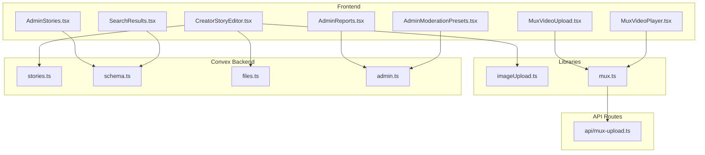
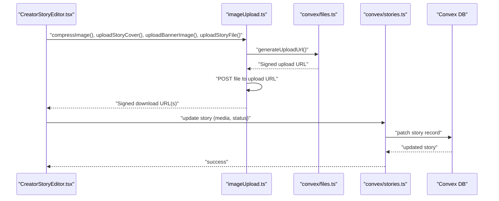
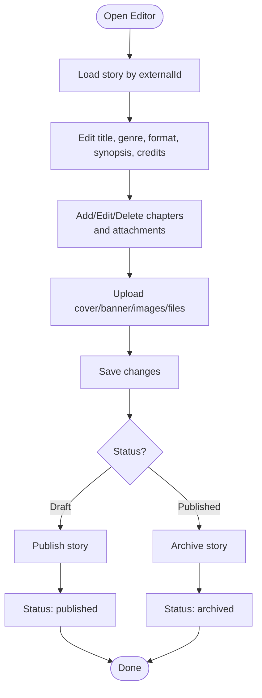
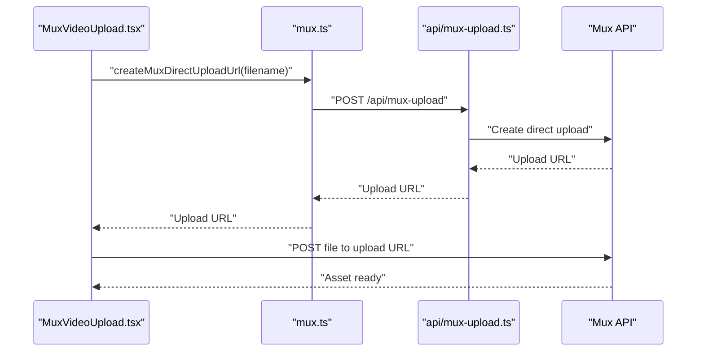
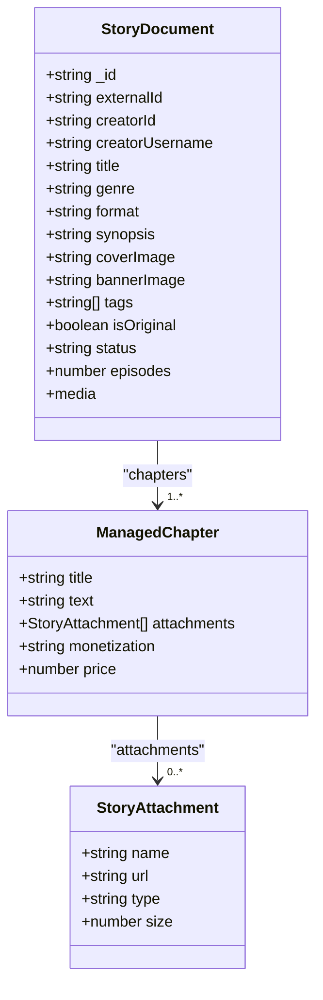
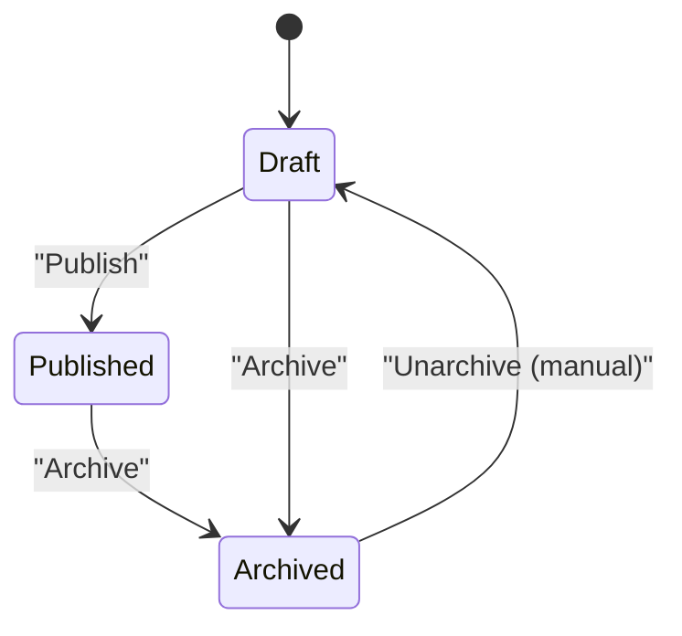
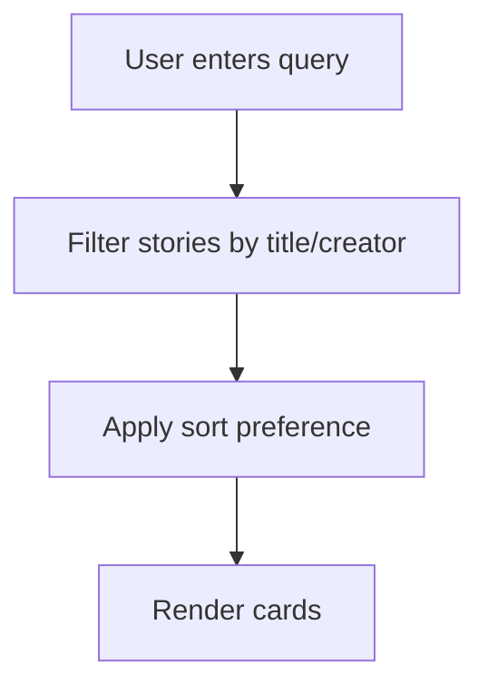
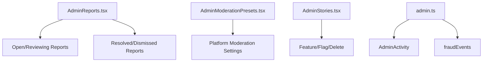
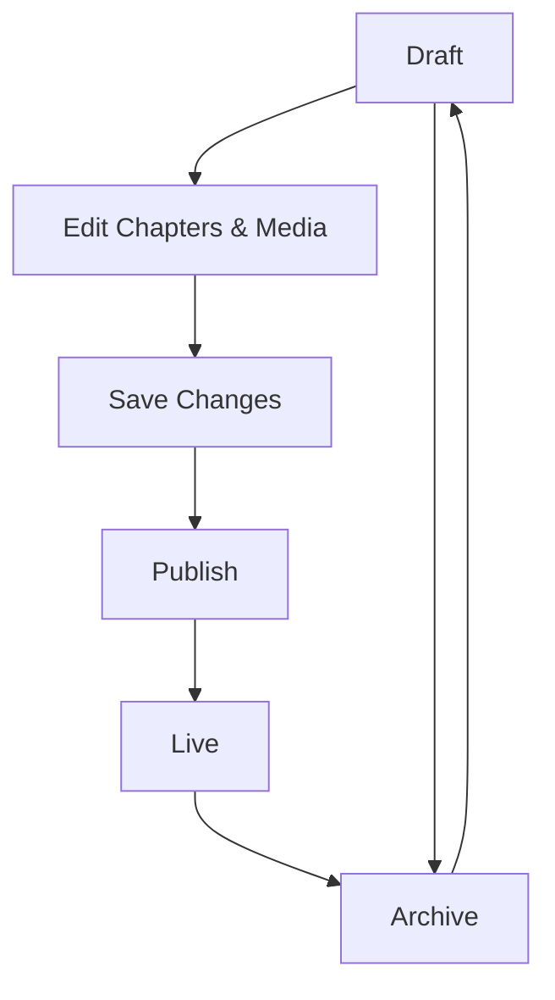
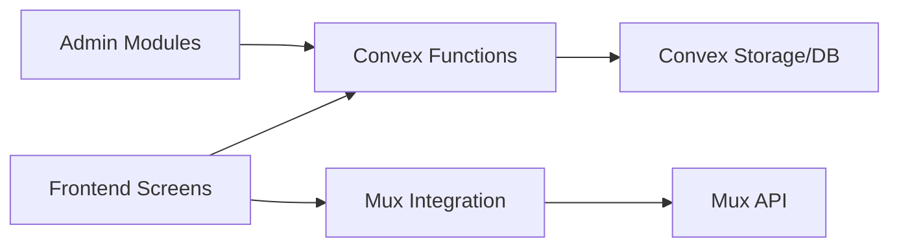

# Content Management System

<cite>
**Referenced Files in This Document**
- [CreatorStoryEditor.tsx](file://src/screens/CreatorStoryEditor.tsx)
- [stories.ts](file://convex/stories.ts)
- [schema.ts](file://convex/schema.ts)
- [imageUpload.ts](file://src/lib/imageUpload.ts)
- [mux.ts](file://src/lib/mux.ts)
- [AdminStories.tsx](file://src/screens/admin/AdminStories.tsx)
- [AdminModerationPresets.tsx](file://src/screens/admin/AdminModerationPresets.tsx)
- [SearchResults.tsx](file://src/screens/SearchResults.tsx)
- [types.ts](file://src/data/types.ts)
- [MuxVideoUpload.tsx](file://src/components/MuxVideoUpload.tsx)
- [MuxVideoPlayer.tsx](file://src/components/MuxVideoPlayer.tsx)
- [files.ts](file://convex/files.ts)
- [mux-upload.ts](file://api/mux-upload.ts)
- [admin.ts](file://convex/admin.ts)
- [AdminReports.tsx](file://src/screens/admin/AdminReports.tsx)
</cite>

## Table of Contents
1. [Introduction](#introduction)
2. [Project Structure](#project-structure)
3. [Core Components](#core-components)
4. [Architecture Overview](#architecture-overview)
5. [Detailed Component Analysis](#detailed-component-analysis)
6. [Dependency Analysis](#dependency-analysis)
7. [Performance Considerations](#performance-considerations)
8. [Troubleshooting Guide](#troubleshooting-guide)
9. [Conclusion](#conclusion)
10. [Appendices](#appendices)

## Introduction
This document describes the content management system for story creation, editing, and publishing across multiple formats (manga, manhwa, webcomic, novel). It explains the media upload pipeline for images and files, the video upload and playback via Mux, the story editing interface, publishing workflows, content organization (categories, tags, search), moderation features, lifecycle management (drafts, revisions, archiving), and the integration between frontend upload components and backend processing functions.

## Project Structure
The system is organized around:
- Frontend screens and components for creators and admins
- Convex backend functions for data queries and mutations
- API routes for third-party integrations (e.g., Mux)
- Utility libraries for uploads and integrations

**Diagram sources**
- [CreatorStoryEditor.tsx:1-635](file://src/screens/CreatorStoryEditor.tsx#L1-L635)
- [stories.ts:1-180](file://convex/stories.ts#L1-L180)
- [schema.ts:95-126](file://convex/schema.ts#L95-L126)
- [imageUpload.ts:1-235](file://src/lib/imageUpload.ts#L1-L235)
- [mux.ts:1-66](file://src/lib/mux.ts#L1-L66)
- [files.ts:1-21](file://convex/files.ts#L1-L21)
- [mux-upload.ts:1-45](file://api/mux-upload.ts#L1-L45)
- [AdminStories.tsx:1-250](file://src/screens/admin/AdminStories.tsx#L1-L250)
- [AdminReports.tsx:1-211](file://src/screens/admin/AdminReports.tsx#L1-L211)
- [AdminModerationPresets.tsx:1-200](file://src/screens/admin/AdminModerationPresets.tsx#L1-L200)
- [SearchResults.tsx:1-64](file://src/screens/SearchResults.tsx#L1-L64)
- [MuxVideoUpload.tsx:1-127](file://src/components/MuxVideoUpload.tsx#L1-L127)
- [MuxVideoPlayer.tsx:1-39](file://src/components/MuxVideoPlayer.tsx#L1-L39)

**Section sources**
- [CreatorStoryEditor.tsx:1-635](file://src/screens/CreatorStoryEditor.tsx#L1-L635)
- [stories.ts:1-180](file://convex/stories.ts#L1-L180)
- [schema.ts:95-126](file://convex/schema.ts#L95-L126)
- [imageUpload.ts:1-235](file://src/lib/imageUpload.ts#L1-L235)
- [mux.ts:1-66](file://src/lib/mux.ts#L1-L66)
- [files.ts:1-21](file://convex/files.ts#L1-L21)
- [mux-upload.ts:1-45](file://api/mux-upload.ts#L1-L45)
- [AdminStories.tsx:1-250](file://src/screens/admin/AdminStories.tsx#L1-L250)
- [AdminReports.tsx:1-211](file://src/screens/admin/AdminReports.tsx#L1-L211)
- [AdminModerationPresets.tsx:1-200](file://src/screens/admin/AdminModerationPresets.tsx#L1-L200)
- [SearchResults.tsx:1-64](file://src/screens/SearchResults.tsx#L1-L64)
- [MuxVideoUpload.tsx:1-127](file://src/components/MuxVideoUpload.tsx#L1-L127)
- [MuxVideoPlayer.tsx:1-39](file://src/components/MuxVideoPlayer.tsx#L1-L39)

## Core Components
- Story editing screen for creators with chapter management, media attachments, and publishing actions
- Convex story CRUD and status management
- Media upload utilities for images and generic story files
- Mux integration for video uploads and playback
- Admin dashboards for moderation, reporting, and content oversight
- Search and discovery with filtering and sorting

**Section sources**
- [CreatorStoryEditor.tsx:49-318](file://src/screens/CreatorStoryEditor.tsx#L49-L318)
- [stories.ts:46-144](file://convex/stories.ts#L46-L144)
- [imageUpload.ts:31-105](file://src/lib/imageUpload.ts#L31-L105)
- [mux.ts:15-65](file://src/lib/mux.ts#L15-L65)
- [AdminStories.tsx:24-250](file://src/screens/admin/AdminStories.tsx#L24-L250)
- [AdminReports.tsx:25-211](file://src/screens/admin/AdminReports.tsx#L25-L211)
- [SearchResults.tsx:9-64](file://src/screens/SearchResults.tsx#L9-L64)

## Architecture Overview
The system separates concerns across frontend, Convex backend, and third-party APIs:
- Frontend screens orchestrate user actions (edit, upload, publish)
- Convex queries and mutations manage story data and status
- Convex storage handles signed URLs for images and files
- Mux API route generates direct upload URLs; Mux SDK handles playback
- Admin modules provide oversight and moderation controls

**Diagram sources**
- [CreatorStoryEditor.tsx:164-259](file://src/screens/CreatorStoryEditor.tsx#L164-L259)
- [imageUpload.ts:31-105](file://src/lib/imageUpload.ts#L31-L105)
- [files.ts:4-20](file://convex/files.ts#L4-L20)
- [stories.ts:106-144](file://convex/stories.ts#L106-L144)

## Detailed Component Analysis

### Story Creation and Editing Workflow
- Multi-format support: Manga, Manhwa, Webcomic, Novel
- Chapter management: add, edit, delete, reorder episodes
- Media attachments: images, PDFs, documents, EPUB, text files
- Publishing actions: save draft, publish, archive
- Lifecycle: draft → published → archived

**Diagram sources**
- [CreatorStoryEditor.tsx:81-318](file://src/screens/CreatorStoryEditor.tsx#L81-L318)
- [stories.ts:106-144](file://convex/stories.ts#L106-L144)

**Section sources**
- [CreatorStoryEditor.tsx:49-318](file://src/screens/CreatorStoryEditor.tsx#L49-L318)
- [stories.ts:46-144](file://convex/stories.ts#L46-L144)
- [types.ts:125-155](file://src/data/types.ts#L125-L155)

### Media Upload Pipeline
- Images and story files:
  - Validation: MIME type and size limits
  - Optional compression for images
  - Signed upload URL generation via Convex storage
  - Signed download URL returned for later embedding
- Video uploads via Mux:
  - Frontend requests a direct upload URL from the backend
  - Uploads file directly to Mux
  - Playback via Mux stream URL

**Diagram sources**
- [MuxVideoUpload.tsx:23-69](file://src/components/MuxVideoUpload.tsx#L23-L69)
- [mux.ts:35-59](file://src/lib/mux.ts#L35-L59)
- [mux-upload.ts:8-44](file://api/mux-upload.ts#L8-L44)

**Section sources**
- [imageUpload.ts:31-105](file://src/lib/imageUpload.ts#L31-L105)
- [files.ts:4-20](file://convex/files.ts#L4-L20)
- [mux.ts:15-65](file://src/lib/mux.ts#L15-L65)
- [mux-upload.ts:1-45](file://api/mux-upload.ts#L1-L45)
- [MuxVideoUpload.tsx:1-127](file://src/components/MuxVideoUpload.tsx#L1-L127)
- [MuxVideoPlayer.tsx:1-39](file://src/components/MuxVideoPlayer.tsx#L1-L39)

### Story Editing Interface
- Form fields: title, genre, format, synopsis, credits
- Cover and banner previews with image selection
- Chapter list with per-chapter title, text, and attachments
- Episode starter text for quick chapter creation
- File attachment management with size and type constraints

**Diagram sources**
- [CreatorStoryEditor.tsx:10-47](file://src/screens/CreatorStoryEditor.tsx#L10-L47)
- [types.ts:125-155](file://src/data/types.ts#L125-L155)

**Section sources**
- [CreatorStoryEditor.tsx:59-318](file://src/screens/CreatorStoryEditor.tsx#L59-L318)
- [types.ts:125-155](file://src/data/types.ts#L125-L155)

### Publishing Workflow
- Draft to published transitions are explicit actions
- Status field supports draft, published, hidden, archived
- Automated triggers are not present in the reviewed code; publishing is manual

**Diagram sources**
- [stories.ts:106-144](file://convex/stories.ts#L106-L144)
- [CreatorStoryEditor.tsx:296-318](file://src/screens/CreatorStoryEditor.tsx#L296-L318)

**Section sources**
- [stories.ts:106-144](file://convex/stories.ts#L106-L144)
- [CreatorStoryEditor.tsx:296-318](file://src/screens/CreatorStoryEditor.tsx#L296-L318)

### Content Organization and Search
- Categories and tags are part of the story model
- Search screen filters by title and creator name
- Sorting options include trending, newest, most read, highest rated

**Diagram sources**
- [SearchResults.tsx:18-61](file://src/screens/SearchResults.tsx#L18-L61)
- [schema.ts:95-126](file://convex/schema.ts#L95-L126)

**Section sources**
- [SearchResults.tsx:9-64](file://src/screens/SearchResults.tsx#L9-L64)
- [schema.ts:95-126](file://convex/schema.ts#L95-L126)
- [types.ts:125-155](file://src/data/types.ts#L125-L155)

### Content Moderation Features
- Admin dashboard for reviewing stories and creators
- Moderation presets to adjust platform-wide safety settings
- Reporting queue for user-generated reports with resolution actions
- Activity logging and fraud scanning capabilities

**Diagram sources**
- [AdminReports.tsx:25-211](file://src/screens/admin/AdminReports.tsx#L25-L211)
- [AdminModerationPresets.tsx:66-200](file://src/screens/admin/AdminModerationPresets.tsx#L66-L200)
- [AdminStories.tsx:24-250](file://src/screens/admin/AdminStories.tsx#L24-L250)
- [admin.ts:179-244](file://convex/admin.ts#L179-L244)

**Section sources**
- [AdminStories.tsx:24-250](file://src/screens/admin/AdminStories.tsx#L24-L250)
- [AdminReports.tsx:25-211](file://src/screens/admin/AdminReports.tsx#L25-L211)
- [AdminModerationPresets.tsx:66-200](file://src/screens/admin/AdminModerationPresets.tsx#L66-L200)
- [admin.ts:179-244](file://convex/admin.ts#L179-L244)

### Content Lifecycle Management
- Drafts: editable until publish
- Revisions: save changes updates chapters and media
- Archiving: remove from active listings; unarchive manually if needed

**Diagram sources**
- [CreatorStoryEditor.tsx:213-318](file://src/screens/CreatorStoryEditor.tsx#L213-L318)
- [stories.ts:106-144](file://convex/stories.ts#L106-L144)

**Section sources**
- [CreatorStoryEditor.tsx:213-318](file://src/screens/CreatorStoryEditor.tsx#L213-L318)
- [stories.ts:106-144](file://convex/stories.ts#L106-L144)

## Dependency Analysis
- Frontend depends on Convex for data and storage
- Mux integration requires backend route for secure upload URL generation
- Admin features depend on dedicated Convex modules for reporting and activity logs

**Diagram sources**
- [CreatorStoryEditor.tsx:1-635](file://src/screens/CreatorStoryEditor.tsx#L1-L635)
- [stories.ts:1-180](file://convex/stories.ts#L1-L180)
- [files.ts:1-21](file://convex/files.ts#L1-L21)
- [mux.ts:1-66](file://src/lib/mux.ts#L1-L66)
- [mux-upload.ts:1-45](file://api/mux-upload.ts#L1-L45)
- [admin.ts:1-364](file://convex/admin.ts#L1-L364)

**Section sources**
- [CreatorStoryEditor.tsx:1-635](file://src/screens/CreatorStoryEditor.tsx#L1-L635)
- [stories.ts:1-180](file://convex/stories.ts#L1-L180)
- [files.ts:1-21](file://convex/files.ts#L1-L21)
- [mux.ts:1-66](file://src/lib/mux.ts#L1-L66)
- [mux-upload.ts:1-45](file://api/mux-upload.ts#L1-L45)
- [admin.ts:1-364](file://convex/admin.ts#L1-L364)

## Performance Considerations
- Image compression reduces upload size and improves throughput
- Batch operations for file uploads and chapter saves minimize round trips
- Indexes on status and creator fields optimize listing queries
- Mux direct uploads bypass application servers for large video files

## Troubleshooting Guide
- Image upload errors:
  - Verify storage permissions and network connectivity
  - Respect size limits and supported MIME types
- Mux upload failures:
  - Confirm Mux credentials are configured
  - Check CORS origins and upload URL validity
- Story save/publish errors:
  - Ensure the story exists and the user has permission
  - Validate chapter content and attachments

**Section sources**
- [imageUpload.ts:14-23](file://src/lib/imageUpload.ts#L14-L23)
- [mux-upload.ts:14-44](file://api/mux-upload.ts#L14-L44)
- [stories.ts:106-144](file://convex/stories.ts#L106-L144)

## Conclusion
The system provides a robust foundation for creators to build stories across multiple formats, manage chapters and media, and publish content with clear lifecycle controls. The integration with Convex and Mux ensures scalable storage and video delivery, while admin tools enable effective moderation and oversight.

## Appendices
- Supported formats: Manga, Manhwa, Webcomic, Novel
- Media constraints: images under 5MB, files under 25MB
- Moderation presets: strict, adaptive, permissive