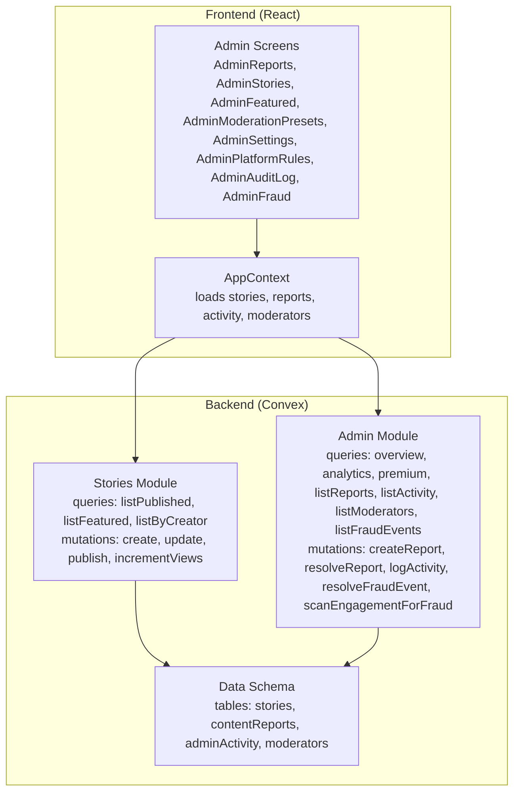
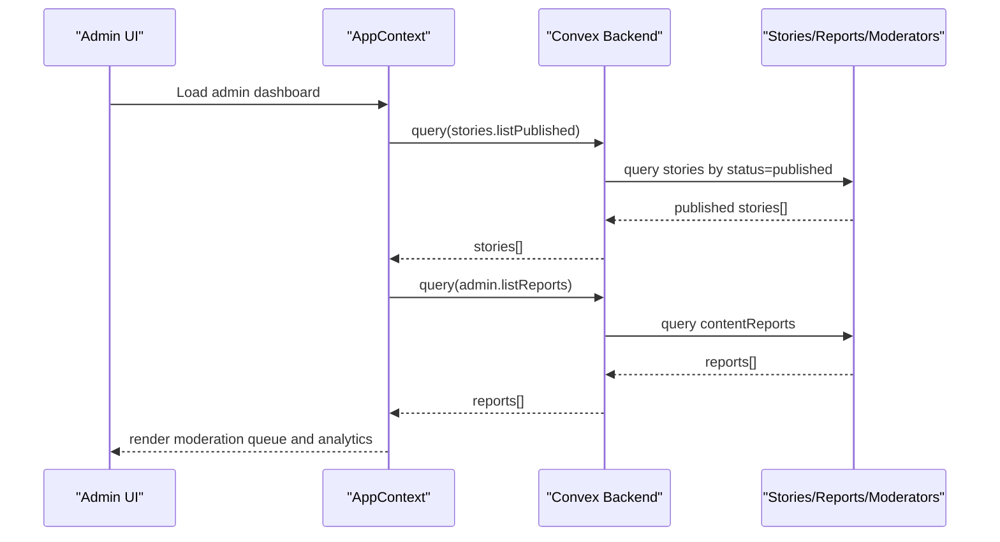
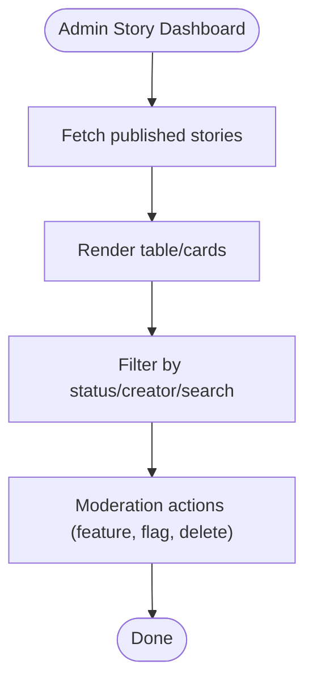
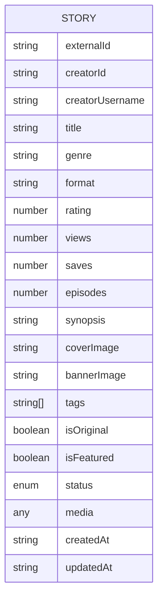
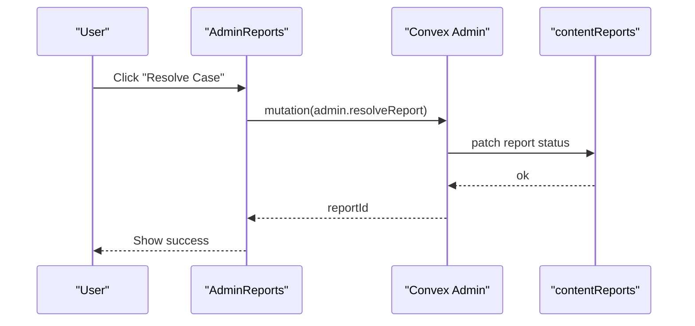
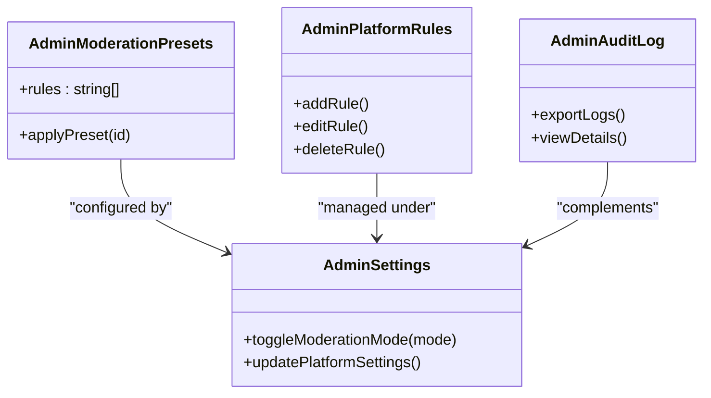
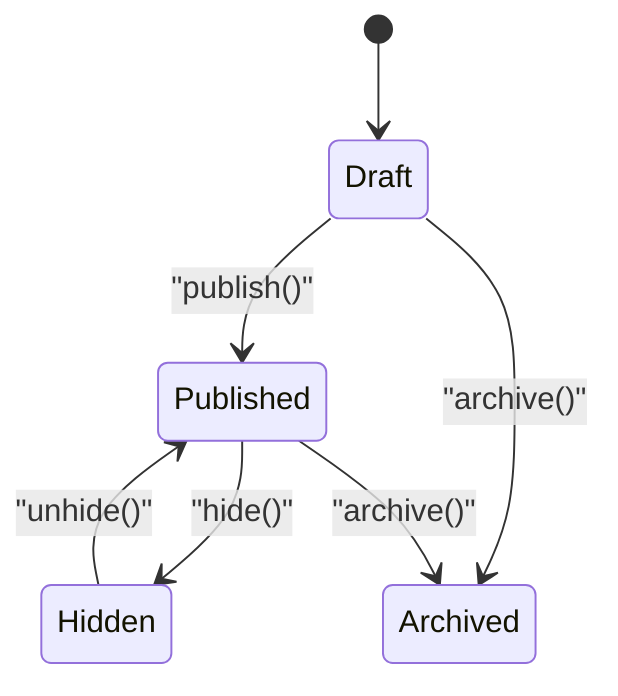
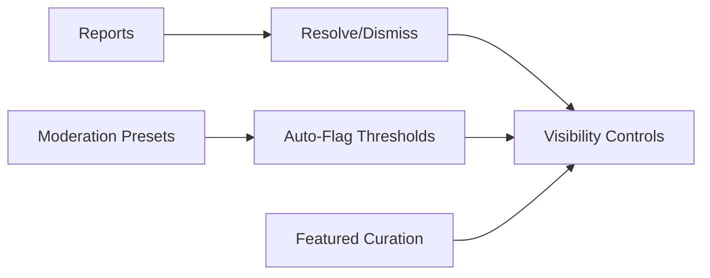
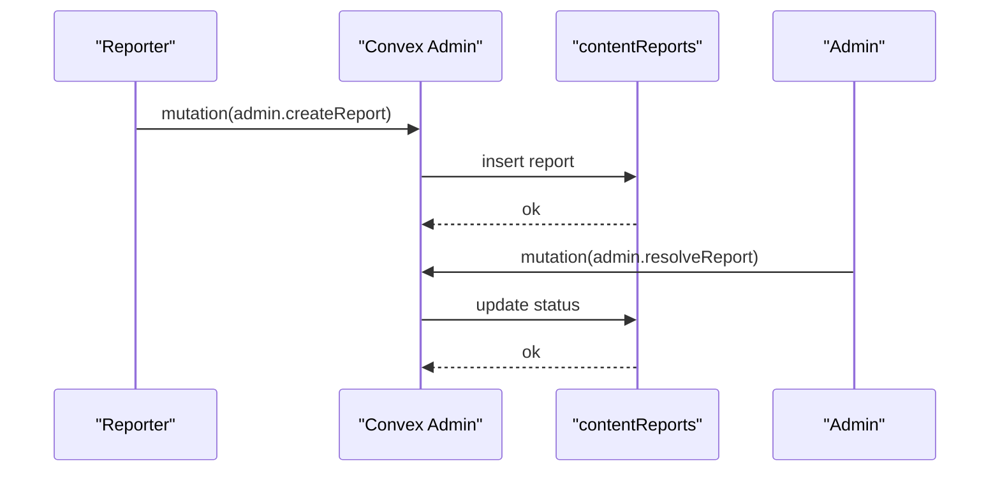
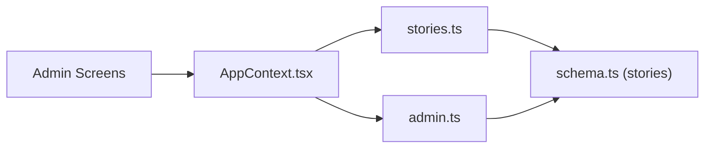

# Content Organization and Moderation

<cite>
**Referenced Files in This Document**
- [stories.ts](file://convex/stories.ts)
- [schema.ts](file://convex/schema.ts)
- [admin.ts](file://convex/admin.ts)
- [types.ts](file://src/data/types.ts)
- [AppContext.tsx](file://src/contexts/AppContext.tsx)
- [AdminReports.tsx](file://src/screens/admin/AdminReports.tsx)
- [AdminStories.tsx](file://src/screens/admin/AdminStories.tsx)
- [AdminFeatured.tsx](file://src/screens/admin/AdminFeatured.tsx)
- [AdminModerationPresets.tsx](file://src/screens/admin/AdminModerationPresets.tsx)
- [AdminSettings.tsx](file://src/screens/admin/AdminSettings.tsx)
- [AdminPlatformRules.tsx](file://src/screens/admin/AdminPlatformRules.tsx)
- [AdminAuditLog.tsx](file://src/screens/admin/AdminAuditLog.tsx)
- [AdminFraud.tsx](file://src/screens/admin/AdminFraud.tsx)
</cite>

## Table of Contents
1. [Introduction](#introduction)
2. [Project Structure](#project-structure)
3. [Core Components](#core-components)
4. [Architecture Overview](#architecture-overview)
5. [Detailed Component Analysis](#detailed-component-analysis)
6. [Dependency Analysis](#dependency-analysis)
7. [Performance Considerations](#performance-considerations)
8. [Troubleshooting Guide](#troubleshooting-guide)
9. [Conclusion](#conclusion)

## Introduction
This document describes the content organization and moderation system for the platform. It covers how stories are listed and queried (published, featured, creator-specific), how content is categorized (genre, tags), how discovery and filtering work (featured, trending, personalized), and how moderation operates (reports, flags, moderation presets, audit logging). It also documents the administrative tools for content quality assurance and policy enforcement, and outlines the integration between moderation workflows and visibility controls.

## Project Structure
The system spans backend Convex functions and tables, plus frontend admin screens and shared types. The backend defines the data model and exposes queries/mutations for content and moderation. The frontend admin screens consume these APIs and present curated dashboards for moderation and curation.

**Diagram sources**
- [stories.ts:6-180](file://convex/stories.ts#L6-L180)
- [schema.ts:95-196](file://convex/schema.ts#L95-L196)
- [admin.ts:31-364](file://convex/admin.ts#L31-L364)
- [AppContext.tsx:525-601](file://src/contexts/AppContext.tsx#L525-L601)

**Section sources**
- [stories.ts:1-180](file://convex/stories.ts#L1-L180)
- [schema.ts:1-495](file://convex/schema.ts#L1-L495)
- [admin.ts:1-364](file://convex/admin.ts#L1-L364)
- [AppContext.tsx:509-601](file://src/contexts/AppContext.tsx#L509-L601)

## Core Components
- Stories module: Defines listing queries for published and featured content, creator-specific lists, and mutations for creation, updates, publishing, and metrics.
- Data schema: Declares the stories table with fields for genre, tags, status, and indices for efficient querying.
- Admin module: Provides analytics, reporting, moderation actions, and fraud detection utilities.
- Frontend admin screens: Present curated dashboards for moderation queues, story management, featured content curation, moderation presets, platform rules, audit logs, and fraud monitoring.

**Section sources**
- [stories.ts:6-180](file://convex/stories.ts#L6-L180)
- [schema.ts:95-126](file://convex/schema.ts#L95-L126)
- [admin.ts:31-364](file://convex/admin.ts#L31-L364)
- [AdminReports.tsx:25-211](file://src/screens/admin/AdminReports.tsx#L25-L211)
- [AdminStories.tsx:24-250](file://src/screens/admin/AdminStories.tsx#L24-L250)
- [AdminFeatured.tsx:19-137](file://src/screens/admin/AdminFeatured.tsx#L19-L137)
- [AdminModerationPresets.tsx:66-200](file://src/screens/admin/AdminModerationPresets.tsx#L66-L200)
- [AdminSettings.tsx:7-189](file://src/screens/admin/AdminSettings.tsx#L7-L189)
- [AdminPlatformRules.tsx:25-189](file://src/screens/admin/AdminPlatformRules.tsx#L25-L189)
- [AdminAuditLog.tsx:26-197](file://src/screens/admin/AdminAuditLog.tsx#L26-L197)
- [AdminFraud.tsx:6-74](file://src/screens/admin/AdminFraud.tsx#L6-L74)

## Architecture Overview
The moderation and content organization architecture integrates frontend admin dashboards with backend Convex queries and mutations. The AppContext orchestrates live content loading and admin state, while the backend enforces data integrity via schema-defined tables and indices.

**Diagram sources**
- [AppContext.tsx:525-540](file://src/contexts/AppContext.tsx#L525-L540)
- [stories.ts:6-14](file://convex/stories.ts#L6-L14)
- [admin.ts:179-184](file://convex/admin.ts#L179-L184)

## Detailed Component Analysis

### Story Listing Queries
- Published stories: A query retrieves all stories where status equals published using an index on status.
- Featured stories: A query retrieves all stories where isFeatured is true using an index on isFeatured.
- Creator-specific collections: A query retrieves stories by creator username using an index on creatorUsername.
- Additional helpers: getByExternalId, listByCreator, listPublished, listFeatured.

**Diagram sources**
- [stories.ts:6-44](file://convex/stories.ts#L6-L44)
- [AdminStories.tsx:30-40](file://src/screens/admin/AdminStories.tsx#L30-L40)

**Section sources**
- [stories.ts:6-44](file://convex/stories.ts#L6-L44)
- [AdminStories.tsx:24-76](file://src/screens/admin/AdminStories.tsx#L24-L76)

### Content Categorization and Discovery
- Categorization fields: genre, format, tags, and status are defined in the stories table schema.
- Discovery mechanisms:
  - Featured content: curated and surfaced via AdminFeatured.
  - Trending stories: computed in analytics; top stories sorted by views.
  - Personalized recommendations: not implemented in the provided code; the frontend types include favoriteGenres for readers.

**Diagram sources**
- [schema.ts:95-120](file://convex/schema.ts#L95-L120)
- [types.ts:125-155](file://src/data/types.ts#L125-L155)

**Section sources**
- [schema.ts:95-120](file://convex/schema.ts#L95-L120)
- [types.ts:1-155](file://src/data/types.ts#L1-L155)
- [admin.ts:99-108](file://convex/admin.ts#L99-L108)

### Moderation Tools
- Reporting system:
  - Create a report: mutation to insert a contentReport with type, targetId, reason, message, and status open.
  - List reports: query to fetch all reports.
  - Resolve reports: mutation to update status to resolved or dismissed.
- Moderation queue: AdminReports displays open and past reports with quick actions.
- Audit logging: AdminAuditLog shows admin activity events and supports export/search.
- Fraud detection: AdminFraud scans engagement events and flags suspicious activity.

**Diagram sources**
- [admin.ts:186-223](file://convex/admin.ts#L186-L223)
- [AdminReports.tsx:190-204](file://src/screens/admin/AdminReports.tsx#L190-L204)

**Section sources**
- [admin.ts:179-223](file://convex/admin.ts#L179-L223)
- [AdminReports.tsx:25-211](file://src/screens/admin/AdminReports.tsx#L25-L211)
- [AdminAuditLog.tsx:26-197](file://src/screens/admin/AdminAuditLog.tsx#L26-L197)
- [AdminFraud.tsx:6-74](file://src/screens/admin/AdminFraud.tsx#L6-L74)

### Administrative Oversight and Policy Enforcement
- Moderation presets: AdminModerationPresets presents strict, adaptive, and permissive modes with rule sets.
- Platform rules: AdminPlatformRules manages rule categories and thresholds.
- Admin settings: AdminSettings toggles moderation modes and global flags.
- Activity logging: AdminAuditLog centralizes admin actions for compliance.

**Diagram sources**
- [AdminModerationPresets.tsx:66-200](file://src/screens/admin/AdminModerationPresets.tsx#L66-L200)
- [AdminPlatformRules.tsx:25-189](file://src/screens/admin/AdminPlatformRules.tsx#L25-L189)
- [AdminSettings.tsx:7-189](file://src/screens/admin/AdminSettings.tsx#L7-L189)
- [AdminAuditLog.tsx:26-197](file://src/screens/admin/AdminAuditLog.tsx#L26-L197)

**Section sources**
- [AdminModerationPresets.tsx:18-64](file://src/screens/admin/AdminModerationPresets.tsx#L18-L64)
- [AdminPlatformRules.tsx:18-46](file://src/screens/admin/AdminPlatformRules.tsx#L18-L46)
- [AdminSettings.tsx:51-111](file://src/screens/admin/AdminSettings.tsx#L51-L111)
- [AdminAuditLog.tsx:26-95](file://src/screens/admin/AdminAuditLog.tsx#L26-L95)

### Content Lifecycle Management
- Creation: create mutation initializes a story draft with defaults and timestamps.
- Publication: publish mutation transitions status to published.
- Visibility controls: status field supports draft, published, hidden, archived; isFeatured toggles prominence.
- Metrics: incrementViews mutation increases view counts.

**Diagram sources**
- [stories.ts:46-104](file://convex/stories.ts#L46-L104)
- [stories.ts:163-180](file://convex/stories.ts#L163-L180)

**Section sources**
- [stories.ts:46-104](file://convex/stories.ts#L46-L104)
- [stories.ts:163-180](file://convex/stories.ts#L163-L180)

### Integration Between Moderation Workflows and Visibility Controls
- Reports drive visibility decisions: AdminReports allows resolving reports and taking actions on content.
- Moderation presets influence auto-flagging and visibility thresholds globally.
- Featured curation: AdminFeatured controls homepage prominence via isFeatured and ordering.

**Diagram sources**
- [admin.ts:179-223](file://convex/admin.ts#L179-L223)
- [AdminReports.tsx:190-204](file://src/screens/admin/AdminReports.tsx#L190-L204)
- [AdminModerationPresets.tsx:18-64](file://src/screens/admin/AdminModerationPresets.tsx#L18-L64)
- [AdminFeatured.tsx:23-41](file://src/screens/admin/AdminFeatured.tsx#L23-L41)

**Section sources**
- [admin.ts:179-223](file://convex/admin.ts#L179-L223)
- [AdminReports.tsx:25-121](file://src/screens/admin/AdminReports.tsx#L25-L121)
- [AdminModerationPresets.tsx:66-168](file://src/screens/admin/AdminModerationPresets.tsx#L66-L168)
- [AdminFeatured.tsx:19-53](file://src/screens/admin/AdminFeatured.tsx#L19-L53)

### Reporting System and Appeals Process
- Reporting: Users can create reports; admin screens surface them for review.
- Resolution: Admins can dismiss or resolve reports; audit logs record actions.
- Appeals: Not implemented in the provided code; would require extending the report schema and admin workflows.

**Diagram sources**
- [admin.ts:186-223](file://convex/admin.ts#L186-L223)

**Section sources**
- [admin.ts:179-223](file://convex/admin.ts#L179-L223)

## Dependency Analysis
- Stories module depends on the stories table schema and indices for efficient queries.
- Admin module depends on contentReports, adminActivity, and moderators tables.
- Frontend AppContext depends on Convex APIs to populate stories, reports, and activity.

**Diagram sources**
- [stories.ts:1-180](file://convex/stories.ts#L1-L180)
- [schema.ts:95-196](file://convex/schema.ts#L95-L196)
- [admin.ts:1-364](file://convex/admin.ts#L1-L364)
- [AppContext.tsx:525-601](file://src/contexts/AppContext.tsx#L525-L601)

**Section sources**
- [stories.ts:1-180](file://convex/stories.ts#L1-L180)
- [schema.ts:95-196](file://convex/schema.ts#L95-L196)
- [admin.ts:1-364](file://convex/admin.ts#L1-L364)
- [AppContext.tsx:525-601](file://src/contexts/AppContext.tsx#L525-L601)

## Performance Considerations
- Index usage: Queries leverage indices on status and isFeatured to minimize scan costs.
- Batch loading: AppContext loads multiple datasets concurrently to reduce latency.
- Live refresh: Background polling refreshes content periodically to keep dashboards up to date.

[No sources needed since this section provides general guidance]

## Troubleshooting Guide
- Reports not appearing: Verify admin.listReports query and ensure reports exist with open or reviewing status.
- Publishing errors: Check publish mutation preconditions (existence and current status).
- Fraud scan failures: Confirm engagement events exist and scanEngagementForFraud runs without errors.
- Audit log discrepancies: Use AdminAuditLog to verify admin actions and export records when needed.

**Section sources**
- [admin.ts:179-223](file://convex/admin.ts#L179-L223)
- [stories.ts:163-180](file://convex/stories.ts#L163-L180)
- [AdminFraud.tsx:10-40](file://src/screens/admin/AdminFraud.tsx#L10-L40)
- [AdminAuditLog.tsx:26-95](file://src/screens/admin/AdminAuditLog.tsx#L26-L95)

## Conclusion
The content organization and moderation system combines a robust backend schema and queries with intuitive admin dashboards. It supports listing, categorization, discovery, and moderation workflows, while providing administrative oversight through presets, platform rules, audit logs, and fraud detection. Extending the system to include appeals and personalized recommendations would build upon the existing foundation.