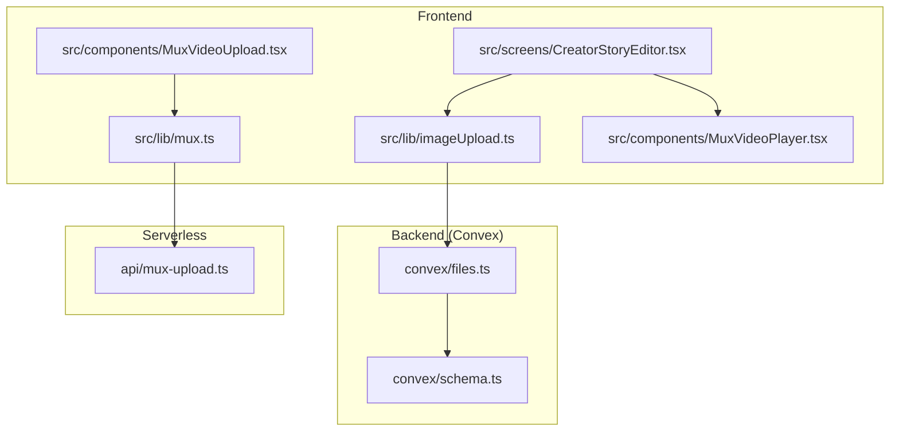
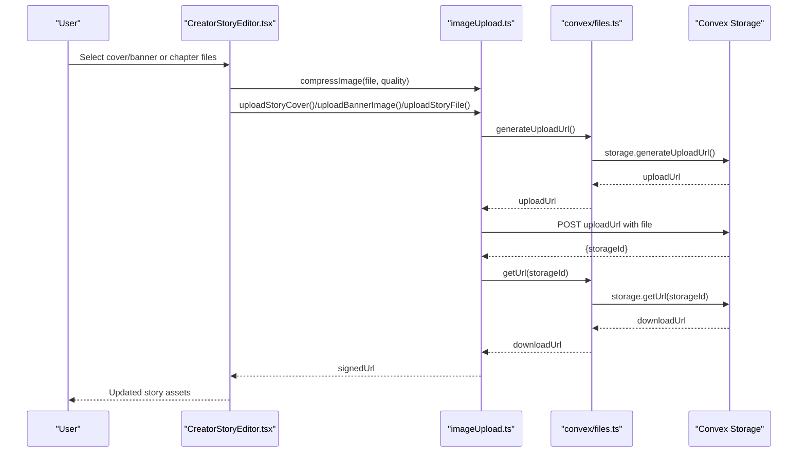
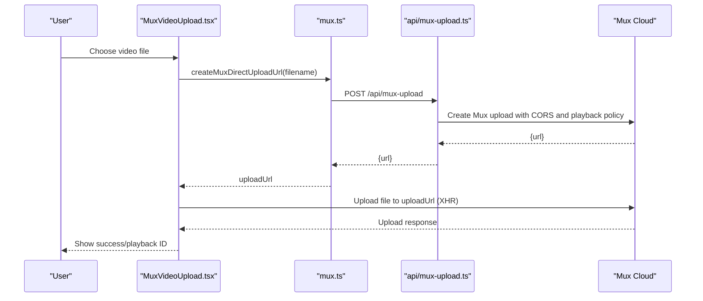
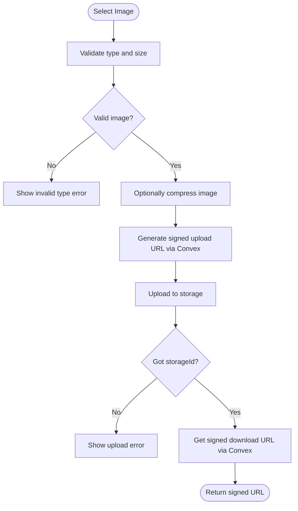
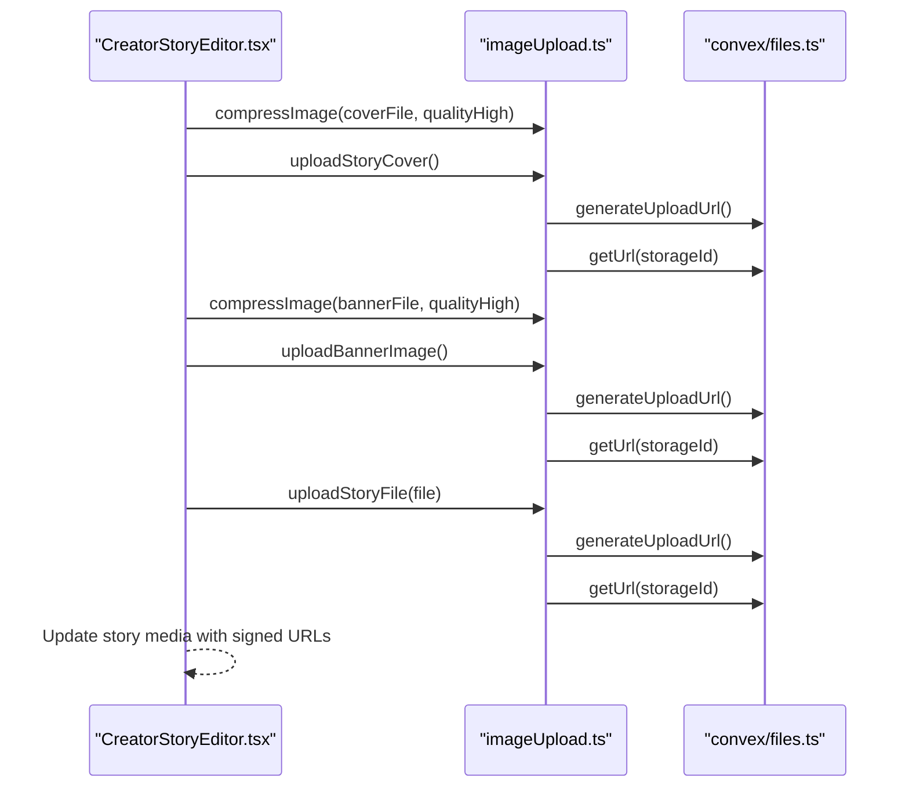
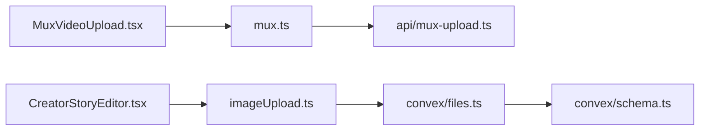

# Media Upload and Processing

<cite>
**Referenced Files in This Document**
- [mux.ts](file://src/lib/mux.ts)
- [mux-upload.ts](file://api/mux-upload.ts)
- [MuxVideoUpload.tsx](file://src/components/MuxVideoUpload.tsx)
- [MuxVideoPlayer.tsx](file://src/components/MuxVideoPlayer.tsx)
- [imageUpload.ts](file://src/lib/imageUpload.ts)
- [files.ts](file://convex/files.ts)
- [CreatorStoryEditor.tsx](file://src/screens/CreatorStoryEditor.tsx)
- [schema.ts](file://convex/schema.ts)
</cite>

## Table of Contents
1. [Introduction](#introduction)
2. [Project Structure](#project-structure)
3. [Core Components](#core-components)
4. [Architecture Overview](#architecture-overview)
5. [Detailed Component Analysis](#detailed-component-analysis)
6. [Dependency Analysis](#dependency-analysis)
7. [Performance Considerations](#performance-considerations)
8. [Troubleshooting Guide](#troubleshooting-guide)
9. [Conclusion](#conclusion)

## Introduction
This document explains the media upload and processing system used by the application. It covers:
- Multi-format media handling for images, videos, and PDFs
- Mux video upload integration with direct-to-cloud uploads, progress tracking, and error handling
- Image upload pipeline with validation, resizing, and optimization
- File validation rules, supported formats, size limits, and quality requirements
- Media processing workflow including thumbnails, previews, and asset management
- Frontend-backend integration for upload components and serverless functions
- API endpoints and serverless function handling
- Error handling strategies, retry mechanisms, and fallback options

## Project Structure
The media system spans frontend libraries, React components, serverless API handlers, and Convex backend functions:
- Frontend libraries: Mux integration helpers and image upload utilities
- React components: Mux video upload and player, story editor with image/PDF handling
- Serverless API: Mux upload URL provisioning
- Convex backend: Signed URL generation and retrieval for storage

**Diagram sources**
- [mux.ts:1-66](file://src/lib/mux.ts#L1-L66)
- [mux-upload.ts:1-45](file://api/mux-upload.ts#L1-L45)
- [imageUpload.ts:1-235](file://src/lib/imageUpload.ts#L1-L235)
- [MuxVideoUpload.tsx:1-127](file://src/components/MuxVideoUpload.tsx#L1-L127)
- [MuxVideoPlayer.tsx:1-39](file://src/components/MuxVideoPlayer.tsx#L1-L39)
- [CreatorStoryEditor.tsx:1-635](file://src/screens/CreatorStoryEditor.tsx#L1-L635)
- [files.ts:1-21](file://convex/files.ts#L1-L21)
- [schema.ts:1-495](file://convex/schema.ts#L1-L495)

**Section sources**
- [mux.ts:1-66](file://src/lib/mux.ts#L1-L66)
- [mux-upload.ts:1-45](file://api/mux-upload.ts#L1-L45)
- [imageUpload.ts:1-235](file://src/lib/imageUpload.ts#L1-L235)
- [MuxVideoUpload.tsx:1-127](file://src/components/MuxVideoUpload.tsx#L1-L127)
- [MuxVideoPlayer.tsx:1-39](file://src/components/MuxVideoPlayer.tsx#L1-L39)
- [CreatorStoryEditor.tsx:1-635](file://src/screens/CreatorStoryEditor.tsx#L1-L635)
- [files.ts:1-21](file://convex/files.ts#L1-L21)
- [schema.ts:1-495](file://convex/schema.ts#L1-L495)

## Core Components
- Mux video upload library: Provides configuration, direct upload URL creation, and stream URL construction
- Mux video upload component: Manages file selection, progress tracking, and error reporting
- Mux video player component: Renders playback via Mux stream
- Image upload library: Validates images, compresses for optimization, uploads to Convex storage, and returns signed URLs
- Serverless Mux upload handler: Provisions Mux upload tokens with CORS origins and playback policy
- Convex file functions: Generates signed upload URLs and retrieves stored file URLs
- Story editor screen: Orchestrates image and PDF uploads for story assets, including compression and validation

**Section sources**
- [mux.ts:1-66](file://src/lib/mux.ts#L1-L66)
- [mux-upload.ts:1-45](file://api/mux-upload.ts#L1-L45)
- [imageUpload.ts:1-235](file://src/lib/imageUpload.ts#L1-L235)
- [files.ts:1-21](file://convex/files.ts#L1-L21)
- [CreatorStoryEditor.tsx:1-635](file://src/screens/CreatorStoryEditor.tsx#L1-L635)

## Architecture Overview
The system integrates three primary flows:
- Mux video uploads: Frontend requests a pre-signed upload URL from the serverless handler, then uploads directly to Mux. Playback uses Mux’s HLS stream URL.
- Image uploads: Frontend requests a signed upload URL from Convex, uploads directly to storage, then retrieves a signed download URL.
- Story assets: The editor validates and compresses images, uploads PDFs and other files, and stores references in the story document.

**Diagram sources**
- [CreatorStoryEditor.tsx:164-178](file://src/screens/CreatorStoryEditor.tsx#L164-L178)
- [imageUpload.ts:31-105](file://src/lib/imageUpload.ts#L31-L105)
- [files.ts:4-21](file://convex/files.ts#L4-L21)

**Section sources**
- [CreatorStoryEditor.tsx:164-178](file://src/screens/CreatorStoryEditor.tsx#L164-L178)
- [imageUpload.ts:31-105](file://src/lib/imageUpload.ts#L31-L105)
- [files.ts:4-21](file://convex/files.ts#L4-L21)

## Detailed Component Analysis

### Mux Video Upload Pipeline
- Frontend obtains a pre-signed upload URL from the serverless handler and uploads directly to Mux
- Progress events are captured via XMLHttpRequest to update UI
- Errors are surfaced to the user with actionable messages
- Playback uses Mux’s HLS stream URL constructed from the playback ID

**Diagram sources**
- [MuxVideoUpload.tsx:23-69](file://src/components/MuxVideoUpload.tsx#L23-L69)
- [mux.ts:35-59](file://src/lib/mux.ts#L35-L59)
- [mux-upload.ts:8-44](file://api/mux-upload.ts#L8-L44)

**Section sources**
- [MuxVideoUpload.tsx:1-127](file://src/components/MuxVideoUpload.tsx#L1-L127)
- [mux.ts:1-66](file://src/lib/mux.ts#L1-L66)
- [mux-upload.ts:1-45](file://api/mux-upload.ts#L1-L45)

### Image Upload Pipeline
- Validates file type and size
- Optionally compresses images to reduce bandwidth
- Requests a signed upload URL from Convex
- Uploads to storage and retrieves a signed download URL
- Normalizes errors for user-friendly messaging

**Diagram sources**
- [imageUpload.ts:31-105](file://src/lib/imageUpload.ts#L31-L105)
- [files.ts:4-21](file://convex/files.ts#L4-L21)

**Section sources**
- [imageUpload.ts:1-235](file://src/lib/imageUpload.ts#L1-L235)
- [files.ts:1-21](file://convex/files.ts#L1-L21)

### Story Editor Asset Management
- Validates image selections and enforces size limits for chapter files
- Compresses cover and banner images before upload
- Uploads story cover, banner, and chapter attachments
- Stores references in the story document’s media field

**Diagram sources**
- [CreatorStoryEditor.tsx:164-178](file://src/screens/CreatorStoryEditor.tsx#L164-L178)
- [imageUpload.ts:167-234](file://src/lib/imageUpload.ts#L167-L234)
- [files.ts:4-21](file://convex/files.ts#L4-L21)

**Section sources**
- [CreatorStoryEditor.tsx:135-178](file://src/screens/CreatorStoryEditor.tsx#L135-L178)
- [imageUpload.ts:167-234](file://src/lib/imageUpload.ts#L167-L234)
- [files.ts:1-21](file://convex/files.ts#L1-L21)

## Dependency Analysis
- Frontend components depend on libraries for Mux and image handling
- Libraries depend on serverless endpoints and Convex functions
- Convex functions rely on storage capabilities and schema-defined tables

**Diagram sources**
- [MuxVideoUpload.tsx:1-127](file://src/components/MuxVideoUpload.tsx#L1-L127)
- [mux.ts:1-66](file://src/lib/mux.ts#L1-L66)
- [mux-upload.ts:1-45](file://api/mux-upload.ts#L1-L45)
- [CreatorStoryEditor.tsx:1-635](file://src/screens/CreatorStoryEditor.tsx#L1-L635)
- [imageUpload.ts:1-235](file://src/lib/imageUpload.ts#L1-L235)
- [files.ts:1-21](file://convex/files.ts#L1-L21)
- [schema.ts:1-495](file://convex/schema.ts#L1-L495)

**Section sources**
- [mux.ts:1-66](file://src/lib/mux.ts#L1-L66)
- [mux-upload.ts:1-45](file://api/mux-upload.ts#L1-L45)
- [imageUpload.ts:1-235](file://src/lib/imageUpload.ts#L1-L235)
- [files.ts:1-21](file://convex/files.ts#L1-L21)
- [schema.ts:1-495](file://convex/schema.ts#L1-L495)

## Performance Considerations
- Image compression reduces upload size and improves throughput; adjust quality parameters per product needs
- Direct-to-cloud uploads minimize server bandwidth and latency
- Signed URLs enable efficient CDN delivery and reduce origin load
- Batch uploads (e.g., chapter attachments) can leverage concurrent promises to improve responsiveness

## Troubleshooting Guide
Common issues and remedies:
- Missing Mux credentials: Ensure environment variables are configured; the serverless handler validates token presence
- Network failures during uploads: Normalize errors to user-friendly messages and prompt retries
- Unauthorized storage access: Re-authenticate the user and retry the upload
- Oversized files: Enforce client-side size checks and inform users of limits
- CORS mismatches: Confirm the configured origin matches the deployment domain

**Section sources**
- [mux-upload.ts:14-17](file://api/mux-upload.ts#L14-L17)
- [imageUpload.ts:14-23](file://src/lib/imageUpload.ts#L14-L23)
- [CreatorStoryEditor.tsx:152-158](file://src/screens/CreatorStoryEditor.tsx#L152-L158)

## Conclusion
The media upload and processing system combines Mux for video and Convex-backed storage for images and documents. It emphasizes robust validation, compression, and signed URLs for secure, scalable delivery. The frontend components provide intuitive upload experiences with progress feedback, while serverless and backend functions ensure reliable, production-grade handling of media assets.