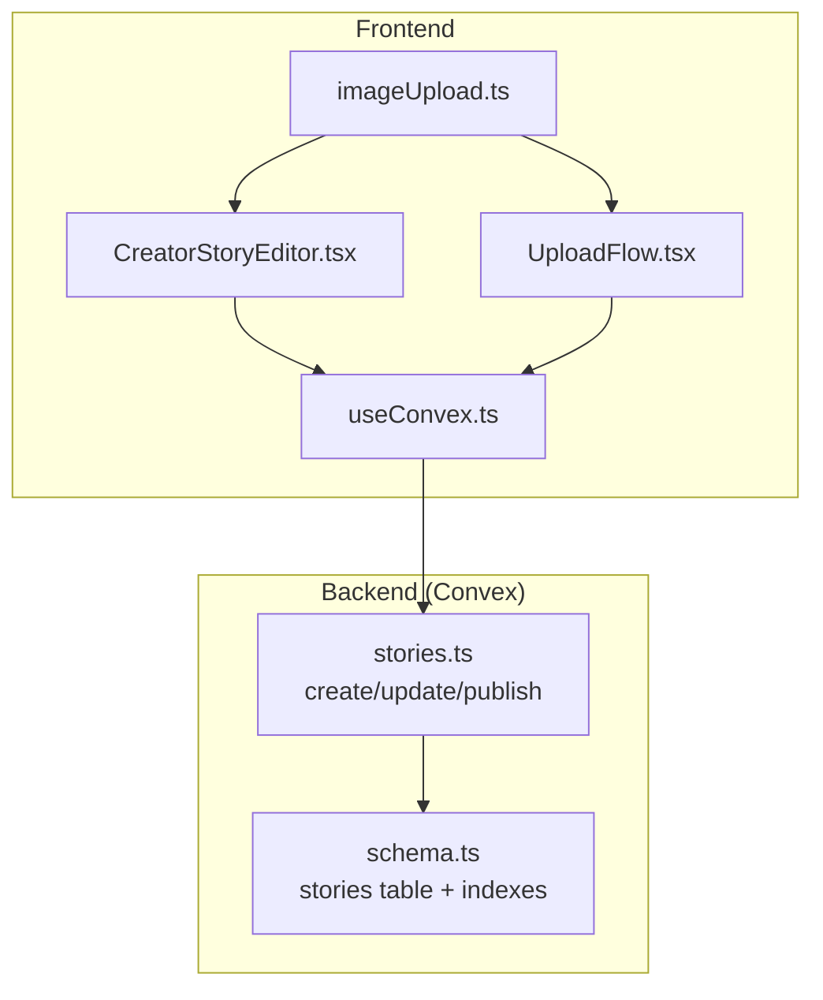
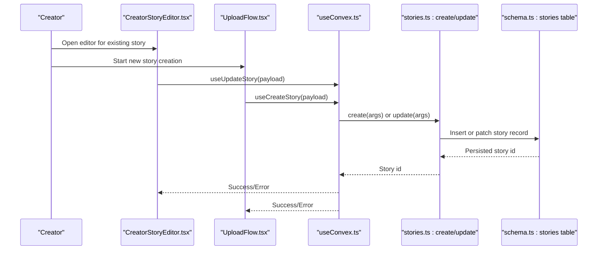
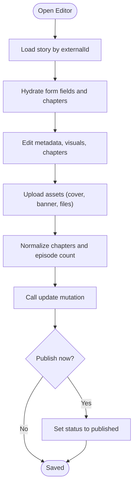
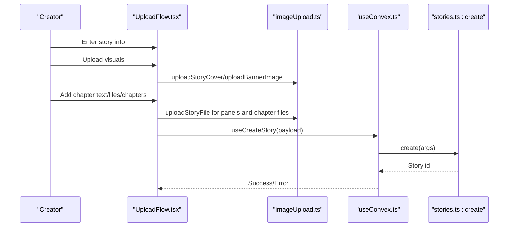
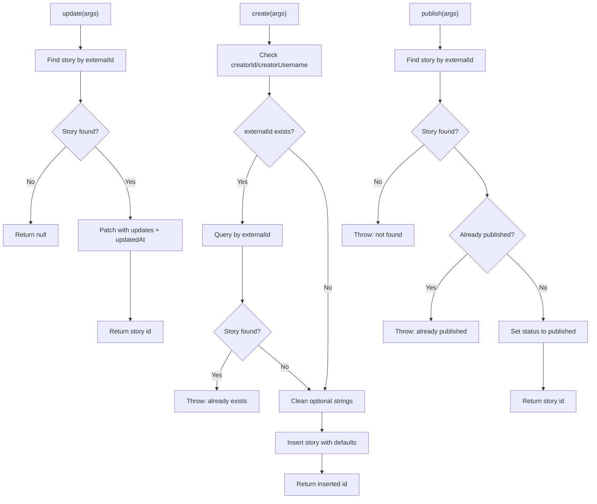
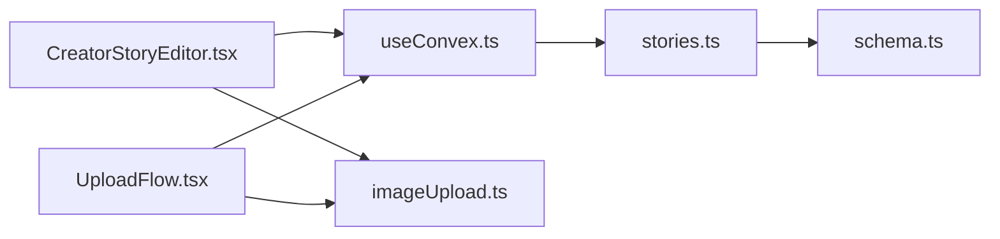

# Story Creation Workflow

<cite>
**Referenced Files in This Document**
- [CreatorStoryEditor.tsx](file://src/screens/CreatorStoryEditor.tsx)
- [UploadFlow.tsx](file://src/screens/UploadFlow.tsx)
- [stories.ts](file://convex/stories.ts)
- [schema.ts](file://convex/schema.ts)
- [imageUpload.ts](file://src/lib/imageUpload.ts)
- [useConvex.ts](file://src/hooks/useConvex.ts)
</cite>

## Table of Contents
1. [Introduction](#introduction)
2. [Project Structure](#project-structure)
3. [Core Components](#core-components)
4. [Architecture Overview](#architecture-overview)
5. [Detailed Component Analysis](#detailed-component-analysis)
6. [Dependency Analysis](#dependency-analysis)
7. [Performance Considerations](#performance-considerations)
8. [Troubleshooting Guide](#troubleshooting-guide)
9. [Conclusion](#conclusion)

## Introduction
This document explains the complete story creation workflow in the platform, from initial creation to publication. It covers the CreatorStoryEditor interface, form validation, multi-format support for manga, manhwa, webcomics, novels, and the underlying Convex mutations that persist data. It also details the external ID system for cross-platform integration, how stories are initially created as drafts, metadata collection, and the integration between frontend components and backend mutations.

## Project Structure
The story creation workflow spans frontend screens and Convex backend functions:
- Frontend screens collect user input and orchestrate uploads and submissions.
- Convex mutations validate arguments, enforce uniqueness, and insert/update story records.
- The schema defines the data model and indexes used for lookups.

**Diagram sources**
- [CreatorStoryEditor.tsx:1-635](file://src/screens/CreatorStoryEditor.tsx#L1-L635)
- [UploadFlow.tsx:1-511](file://src/screens/UploadFlow.tsx#L1-L511)
- [imageUpload.ts:1-235](file://src/lib/imageUpload.ts#L1-L235)
- [useConvex.ts:179-204](file://src/hooks/useConvex.ts#L179-L204)
- [stories.ts:46-179](file://convex/stories.ts#L46-L179)
- [schema.ts:95-126](file://convex/schema.ts#L95-L126)

**Section sources**
- [CreatorStoryEditor.tsx:1-635](file://src/screens/CreatorStoryEditor.tsx#L1-L635)
- [UploadFlow.tsx:1-511](file://src/screens/UploadFlow.tsx#L1-L511)
- [stories.ts:46-179](file://convex/stories.ts#L46-L179)
- [schema.ts:95-126](file://convex/schema.ts#L95-L126)

## Core Components
- CreatorStoryEditor: An editor for existing stories, allowing edits to metadata, visuals, chapters, and publishing/archive actions.
- UploadFlow: A guided wizard for creating new stories from scratch, including metadata, visuals, content, and publishing decisions.
- Convex stories mutations: Backend functions that validate inputs, manage uniqueness, and persist story records.
- Image upload utilities: Frontend helpers for compressing and uploading images and story files.
- Convex hooks: Frontend wrappers around Convex mutations for stories.

Key responsibilities:
- Metadata collection: title, genre, format, synopsis, tags, credits.
- Multi-format support: Manga, Manhwa, Webcomic, Novel.
- External ID system: Cross-platform identity via externalId.
- Initial state: Stories created as drafts with default counters and flags.
- Integration: Frontend forms call Convex mutations with typed arguments.

**Section sources**
- [CreatorStoryEditor.tsx:49-318](file://src/screens/CreatorStoryEditor.tsx#L49-L318)
- [UploadFlow.tsx:33-278](file://src/screens/UploadFlow.tsx#L33-L278)
- [stories.ts:46-104](file://convex/stories.ts#L46-L104)
- [imageUpload.ts:31-105](file://src/lib/imageUpload.ts#L31-L105)
- [useConvex.ts:179-204](file://src/hooks/useConvex.ts#L179-L204)

## Architecture Overview
The workflow integrates frontend components with Convex mutations and schema-defined indexes. The frontend validates inputs locally and delegates persistence to backend functions, which enforce additional constraints.

**Diagram sources**
- [CreatorStoryEditor.tsx:213-259](file://src/screens/CreatorStoryEditor.tsx#L213-L259)
- [UploadFlow.tsx:180-278](file://src/screens/UploadFlow.tsx#L180-L278)
- [useConvex.ts:179-204](file://src/hooks/useConvex.ts#L179-L204)
- [stories.ts:46-144](file://convex/stories.ts#L46-L144)
- [schema.ts:95-126](file://convex/schema.ts#L95-L126)

## Detailed Component Analysis

### CreatorStoryEditor: Editing Existing Stories
The editor loads an existing story by externalId, hydrates form fields, manages chapter lists, and persists updates via Convex mutations. It supports:
- Metadata editing: title, genre, format, synopsis, credits.
- Visuals: cover and banner uploads with compression and previews.
- Chapters: add/edit/delete episodes, manage attachments.
- Actions: save changes, publish (if draft), archive.

Validation highlights:
- Image selection enforces image/* type and size limits.
- Panel file selection enforces 25MB limit per file.
- Save operation uploads assets, normalizes chapters, and calls update mutation.
- Publish checks current status and throws if already published.

**Diagram sources**
- [CreatorStoryEditor.tsx:81-133](file://src/screens/CreatorStoryEditor.tsx#L81-L133)
- [CreatorStoryEditor.tsx:164-178](file://src/screens/CreatorStoryEditor.tsx#L164-L178)
- [CreatorStoryEditor.tsx:203-211](file://src/screens/CreatorStoryEditor.tsx#L203-L211)
- [CreatorStoryEditor.tsx:213-259](file://src/screens/CreatorStoryEditor.tsx#L213-L259)
- [CreatorStoryEditor.tsx:296-318](file://src/screens/CreatorStoryEditor.tsx#L296-L318)

**Section sources**
- [CreatorStoryEditor.tsx:49-318](file://src/screens/CreatorStoryEditor.tsx#L49-L318)
- [imageUpload.ts:124-141](file://src/lib/imageUpload.ts#L124-L141)

### UploadFlow: Creating New Stories
The UploadFlow wizard guides creators through four steps:
1. Story Info: title, format, genre, synopsis.
2. Visuals: cover and banner uploads.
3. Story Panels: chapter text, file attachments, optional chapters.
4. Publish: confirm free-to-read publish.

Key behaviors:
- Draft loading: Loads existing drafts by creator username.
- Asset upload: Compresses images and uploads files with size checks.
- Validation: Prevents publishing without required assets or content.
- Payload construction: Builds story payload with media, episodes, and status.
- Mutation: Calls create for new stories or update for existing externalId.

**Diagram sources**
- [UploadFlow.tsx:33-278](file://src/screens/UploadFlow.tsx#L33-L278)
- [imageUpload.ts:68-105](file://src/lib/imageUpload.ts#L68-L105)
- [useConvex.ts:179-183](file://src/hooks/useConvex.ts#L179-L183)
- [stories.ts:46-104](file://convex/stories.ts#L46-L104)

**Section sources**
- [UploadFlow.tsx:33-278](file://src/screens/UploadFlow.tsx#L33-L278)
- [imageUpload.ts:31-105](file://src/lib/imageUpload.ts#L31-L105)

### Convex Stories Mutations: Validation and Persistence
The backend mutations enforce:
- Required creator identity for create.
- Uniqueness of externalId for create.
- Optional vs required fields for update.
- Status transitions and existence checks for publish.

**Diagram sources**
- [stories.ts:46-179](file://convex/stories.ts#L46-L179)

**Section sources**
- [stories.ts:46-179](file://convex/stories.ts#L46-L179)

### External ID System and Cross-Platform Integration
- externalId is optional in create and required in update.
- The editor loads by externalId and uses it for subsequent updates.
- UploadFlow generates a deterministic externalId if none exists.
- Index by_externalId enables fast lookups and prevents duplicates.

Implications:
- Cross-platform identity: externalId allows linking stories across systems.
- Idempotent updates: Using externalId avoids accidental duplication.
- Draft continuity: externalId persists across edits until publish.

**Section sources**
- [CreatorStoryEditor.tsx:88](file://src/screens/CreatorStoryEditor.tsx#L88)
- [UploadFlow.tsx:197](file://src/screens/UploadFlow.tsx#L197)
- [stories.ts:75-84](file://convex/stories.ts#L75-L84)
- [schema.ts:121](file://convex/schema.ts#L121)

### Multi-Format Support: Manga, Manhwa, Webcomic, Novel
- Formats are selectable in both editors.
- The schema stores format as a string literal validated by Convex.
- Content handling differs:
  - Manga/Manhwa/Webcomic: primarily image/text panels and chapters.
  - Novel: text-centric with optional attachments.

Frontend behavior:
- CreatorStoryEditor: Chapters and episode management.
- UploadFlow: Chapter text, file attachments, and optional chapters.

**Section sources**
- [CreatorStoryEditor.tsx:394-404](file://src/screens/CreatorStoryEditor.tsx#L394-L404)
- [UploadFlow.tsx:354-359](file://src/screens/UploadFlow.tsx#L354-L359)
- [schema.ts:101](file://convex/schema.ts#L101)

### Story Metadata Collection and Defaults
Metadata collected:
- Title, genre, format, synopsis, tags, credits.
- Visuals: coverImage, bannerImage.
- Media: chapterText, attachments, chapters, monetization, credits.
- Episodes: computed from chapters or content presence.

Defaults and statuses:
- Initial status: draft if not provided.
- Default counters: rating, views, saves initialized to 0.
- isFeatured: false by default.
- episodes: 0 or computed from chapters/content.

**Section sources**
- [CreatorStoryEditor.tsx:59-68](file://src/screens/CreatorStoryEditor.tsx#L59-L68)
- [UploadFlow.tsx:221-243](file://src/screens/UploadFlow.tsx#L221-L243)
- [stories.ts:94-102](file://convex/stories.ts#L94-L102)

### Integration Between Frontend and Backend
- useConvex.ts exposes typed wrappers for stories mutations.
- Frontend components call these wrappers with normalized payloads.
- ImageUpload utilities centralize compression and upload logic.
- Errors are surfaced to users via state and UI messages.

**Section sources**
- [useConvex.ts:179-204](file://src/hooks/useConvex.ts#L179-L204)
- [imageUpload.ts:31-105](file://src/lib/imageUpload.ts#L31-L105)
- [CreatorStoryEditor.tsx:213-259](file://src/screens/CreatorStoryEditor.tsx#L213-L259)
- [UploadFlow.tsx:253-262](file://src/screens/UploadFlow.tsx#L253-L262)

## Dependency Analysis
- CreatorStoryEditor depends on Convex hooks and image utilities.
- UploadFlow depends on image utilities and Convex hooks.
- Convex mutations depend on schema indexes for efficient lookups.
- ImageUpload utilities depend on Convex file APIs.

**Diagram sources**
- [CreatorStoryEditor.tsx:1-8](file://src/screens/CreatorStoryEditor.tsx#L1-L8)
- [UploadFlow.tsx:1-9](file://src/screens/UploadFlow.tsx#L1-L9)
- [useConvex.ts:179-204](file://src/hooks/useConvex.ts#L179-L204)
- [stories.ts:46-179](file://convex/stories.ts#L46-L179)
- [schema.ts:95-126](file://convex/schema.ts#L95-L126)

**Section sources**
- [CreatorStoryEditor.tsx:1-8](file://src/screens/CreatorStoryEditor.tsx#L1-L8)
- [UploadFlow.tsx:1-9](file://src/screens/UploadFlow.tsx#L1-L9)
- [useConvex.ts:179-204](file://src/hooks/useConvex.ts#L179-L204)
- [stories.ts:46-179](file://convex/stories.ts#L46-L179)
- [schema.ts:95-126](file://convex/schema.ts#L95-L126)

## Performance Considerations
- Image compression reduces upload sizes and improves UX.
- Batched uploads for multiple files minimize round trips.
- Indexes on externalId, creator, and status enable fast queries.
- Avoid unnecessary re-renders by normalizing chapter lists and managing previews efficiently.

## Troubleshooting Guide
Common issues and resolutions:
- Missing creator information on create: Ensure creatorId and creatorUsername are present.
- Duplicate externalId: Use update instead of create if externalId already exists.
- Publishing without required assets: Provide cover and banner images before publishing.
- Publishing without content: Add chapter text, chapters, or attachments before publishing.
- Image/file size exceeded: Respect 5MB for images and 25MB for story files.
- Network errors during upload: Retry after checking connectivity and permissions.

**Section sources**
- [stories.ts:69-84](file://convex/stories.ts#L69-L84)
- [UploadFlow.tsx:189-209](file://src/screens/UploadFlow.tsx#L189-L209)
- [imageUpload.ts:41-43](file://src/lib/imageUpload.ts#L41-L43)
- [imageUpload.ts:74-76](file://src/lib/imageUpload.ts#L74-L76)

## Conclusion
The story creation workflow combines robust frontend validation and user-friendly editing experiences with strict backend validation and indexing. The external ID system enables cross-platform integration, while multi-format support accommodates diverse content types. Stories are created as drafts with sensible defaults and can be published after meeting content and asset requirements. The integration between frontend components and Convex mutations ensures reliable persistence and scalability.