# Story Editing and Publishing

<cite>
**Referenced Files in This Document**
- [schema.ts](file://convex/schema.ts)
- [stories.ts](file://convex/stories.ts)
- [UploadFlow.tsx](file://src/screens/UploadFlow.tsx)
- [CreatorStoryEditor.tsx](file://src/screens/CreatorStoryEditor.tsx)
- [CreatorDashboard.tsx](file://src/screens/CreatorDashboard.tsx)
- [AdminStories.tsx](file://src/screens/admin/AdminStories.tsx)
- [AdminStoryDetail.tsx](file://src/screens/admin/details/AdminStoryDetail.tsx)
- [admin.ts](file://convex/admin.ts)
- [api.d.ts](file://convex/_generated/api.d.ts)
</cite>

## Table of Contents
1. [Introduction](#introduction)
2. [Project Structure](#project-structure)
3. [Core Components](#core-components)
4. [Architecture Overview](#architecture-overview)
5. [Detailed Component Analysis](#detailed-component-analysis)
6. [Dependency Analysis](#dependency-analysis)
7. [Performance Considerations](#performance-considerations)
8. [Troubleshooting Guide](#troubleshooting-guide)
9. [Conclusion](#conclusion)
10. [Appendices](#appendices)

## Introduction
This document explains the end-to-end story editing and publishing workflow in the Lemonade platform. It covers how creators draft, edit, and publish stories; how status transitions occur; validation and constraints; the modification interface; status management (draft, published, hidden, archived); automatic timestamps and audit logging; revision history and version control; dashboard integration for status and analytics; and publishing triggers and moderation workflows.

## Project Structure
The story lifecycle spans frontend screens and backend Convex modules:
- Frontend screens for creators and admins
- Backend Convex schema defining story data model and indexes
- Backend Convex mutations and queries for CRUD, publishing, and analytics

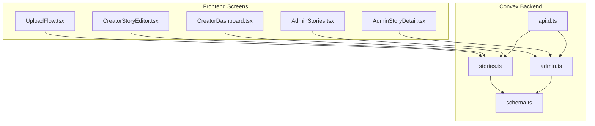

**Diagram sources**
- [UploadFlow.tsx:1-511](file://src/screens/UploadFlow.tsx#L1-L511)
- [CreatorStoryEditor.tsx:1-635](file://src/screens/CreatorStoryEditor.tsx#L1-L635)
- [CreatorDashboard.tsx:1-322](file://src/screens/CreatorDashboard.tsx#L1-L322)
- [AdminStories.tsx:1-250](file://src/screens/admin/AdminStories.tsx#L1-L250)
- [AdminStoryDetail.tsx:1-304](file://src/screens/admin/details/AdminStoryDetail.tsx#L1-L304)
- [schema.ts:95-126](file://convex/schema.ts#L95-L126)
- [stories.ts:1-180](file://convex/stories.ts#L1-L180)
- [admin.ts:31-64](file://convex/admin.ts#L31-L64)
- [api.d.ts:33-62](file://convex/_generated/api.d.ts#L33-L62)

**Section sources**
- [schema.ts:95-126](file://convex/schema.ts#L95-L126)
- [stories.ts:1-180](file://convex/stories.ts#L1-L180)
- [UploadFlow.tsx:1-511](file://src/screens/UploadFlow.tsx#L1-L511)
- [CreatorStoryEditor.tsx:1-635](file://src/screens/CreatorStoryEditor.tsx#L1-L635)
- [CreatorDashboard.tsx:1-322](file://src/screens/CreatorDashboard.tsx#L1-L322)
- [AdminStories.tsx:1-250](file://src/screens/admin/AdminStories.tsx#L1-L250)
- [AdminStoryDetail.tsx:1-304](file://src/screens/admin/details/AdminStoryDetail.tsx#L1-L304)
- [admin.ts:31-64](file://convex/admin.ts#L31-L64)
- [api.d.ts:33-62](file://convex/_generated/api.d.ts#L33-L62)

## Core Components
- Story data model and indexes define status, metadata, and media fields.
- Convex mutations provide create, update, publish, and view increment operations.
- Frontend screens orchestrate the editing and publishing UX, enforce validation, and trigger backend mutations.
- Admin screens expose moderation controls and analytics.

Key backend functions:
- Create story with defaults and initial status.
- Selective update supporting metadata, content, media, and status.
- Publish mutation enforcing non-published state.
- Increment views mutation.
- Queries for listing published, featured, and creator-owned stories.

**Section sources**
- [schema.ts:95-126](file://convex/schema.ts#L95-L126)
- [stories.ts:46-180](file://convex/stories.ts#L46-L180)

## Architecture Overview
The workflow integrates frontend UI actions with backend Convex functions and schema-defined constraints.

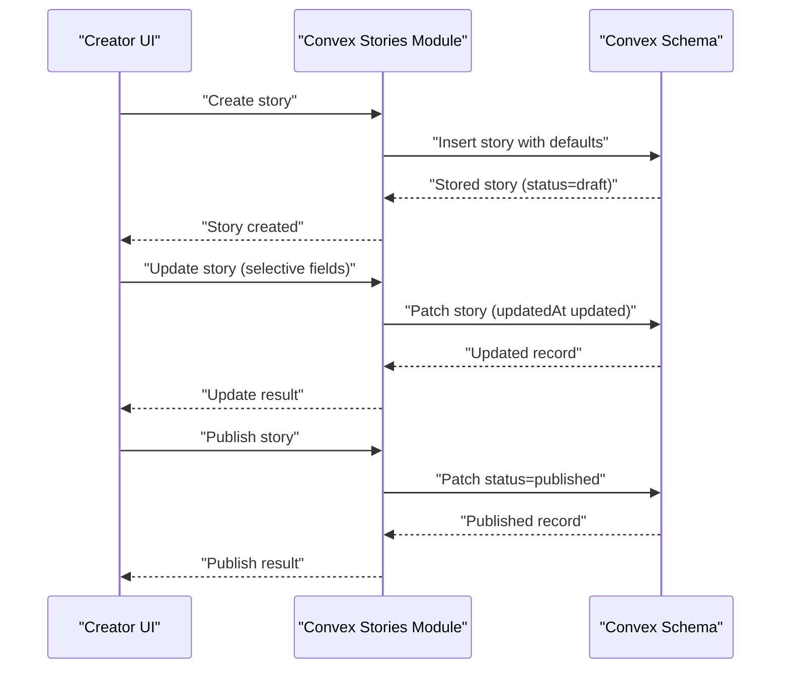

**Diagram sources**
- [stories.ts:46-180](file://convex/stories.ts#L46-L180)
- [schema.ts:95-126](file://convex/schema.ts#L95-L126)

## Detailed Component Analysis

### Story Data Model and Status Management
- Fields include title, genre, format, synopsis, images, tags, originality flag, featured flag, episodes, views, saves, rating, media, and timestamps.
- Status supports draft, published, hidden, archived.
- Indexes enable efficient queries by status, creator, and external identifiers.

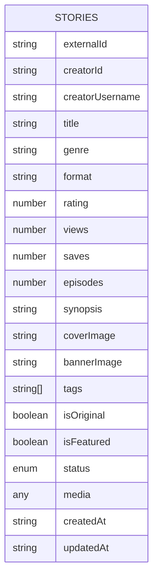

**Diagram sources**
- [schema.ts:95-126](file://convex/schema.ts#L95-L126)

**Section sources**
- [schema.ts:95-126](file://convex/schema.ts#L95-L126)

### Story Creation and Validation
- Create mutation initializes defaults, filters empty images, and sets timestamps.
- Validation ensures creator identity and prevents duplicate external IDs.
- Upload flow enforces publishing prerequisites: title, visuals, and content presence.

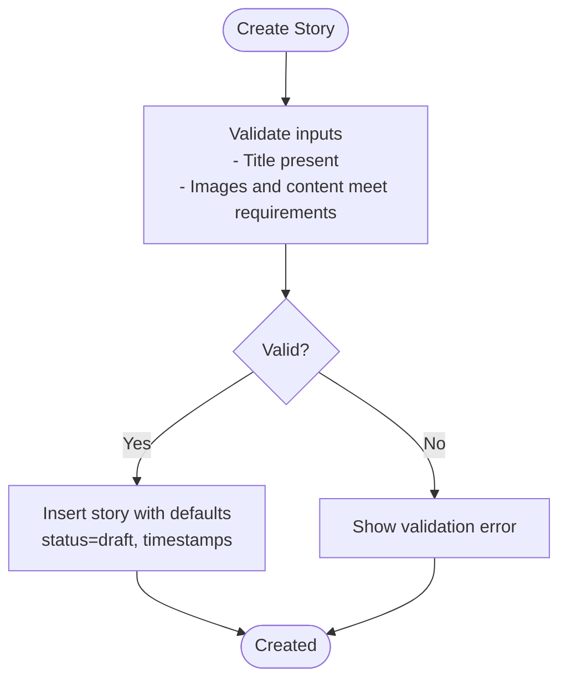

**Diagram sources**
- [stories.ts:46-104](file://convex/stories.ts#L46-L104)
- [UploadFlow.tsx:180-278](file://src/screens/UploadFlow.tsx#L180-L278)

**Section sources**
- [stories.ts:46-104](file://convex/stories.ts#L46-L104)
- [UploadFlow.tsx:180-278](file://src/screens/UploadFlow.tsx#L180-L278)

### Story Update Mutation and Selective Field Updates
- Update mutation accepts optional fields and patches only provided keys.
- Always updates updatedAt to track revisions.
- Supports metadata, content, media, and status transitions.

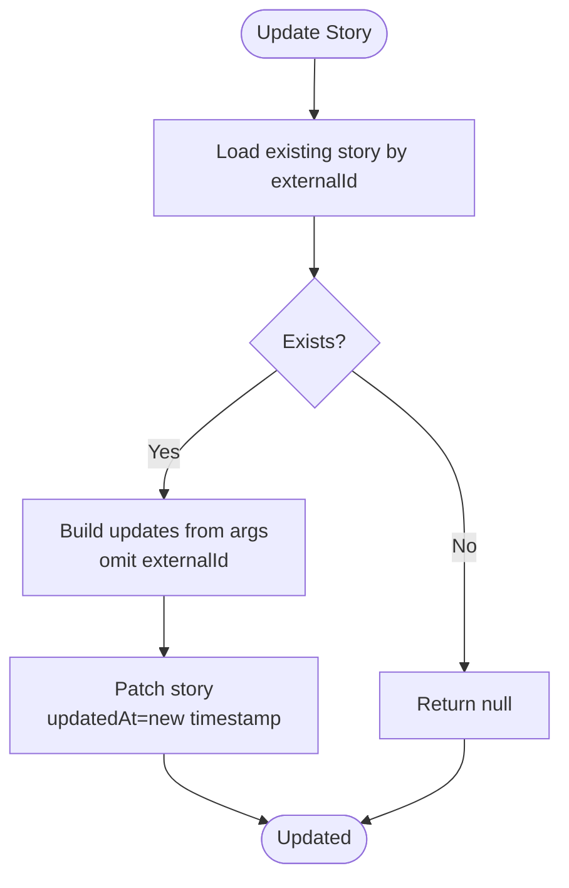

**Diagram sources**
- [stories.ts:106-144](file://convex/stories.ts#L106-L144)

**Section sources**
- [stories.ts:106-144](file://convex/stories.ts#L106-L144)

### Publishing Workflow and Triggers
- Publish mutation checks existence and non-published state, then sets status to published and updates timestamps.
- Upload flow can publish directly with review status and instant publish flags stored in media metadata.
- Admin moderation toggles status visibility post-publication.

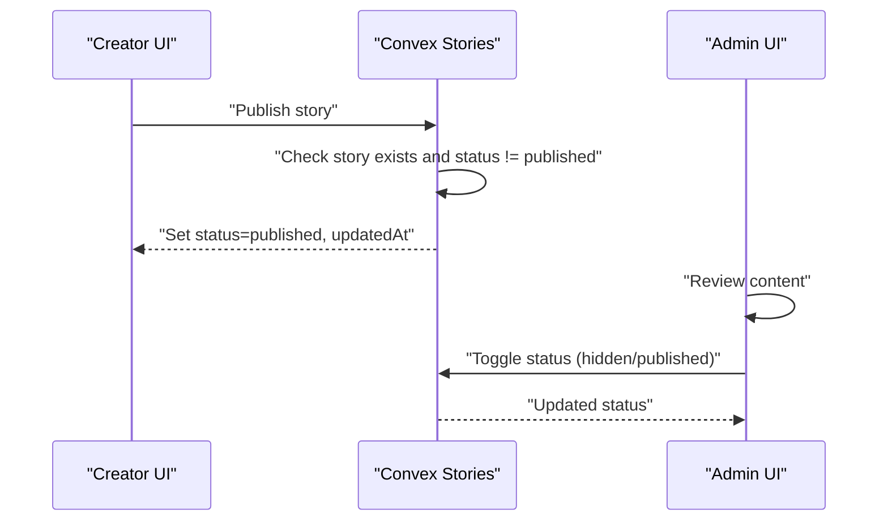

**Diagram sources**
- [stories.ts:163-179](file://convex/stories.ts#L163-L179)
- [UploadFlow.tsx:240-242](file://src/screens/UploadFlow.tsx#L240-L242)
- [AdminStoryDetail.tsx:51-57](file://src/screens/admin/details/AdminStoryDetail.tsx#L51-L57)

**Section sources**
- [stories.ts:163-179](file://convex/stories.ts#L163-L179)
- [UploadFlow.tsx:240-242](file://src/screens/UploadFlow.tsx#L240-L242)
- [AdminStoryDetail.tsx:51-57](file://src/screens/admin/details/AdminStoryDetail.tsx#L51-L57)

### Creator Story Editor Interface
- Loads story by externalId, hydrates form state, and manages images, chapters, and attachments.
- Supports adding/removing chapters, attaching files, and saving selective updates.
- Provides archive and publish actions constrained by current status.

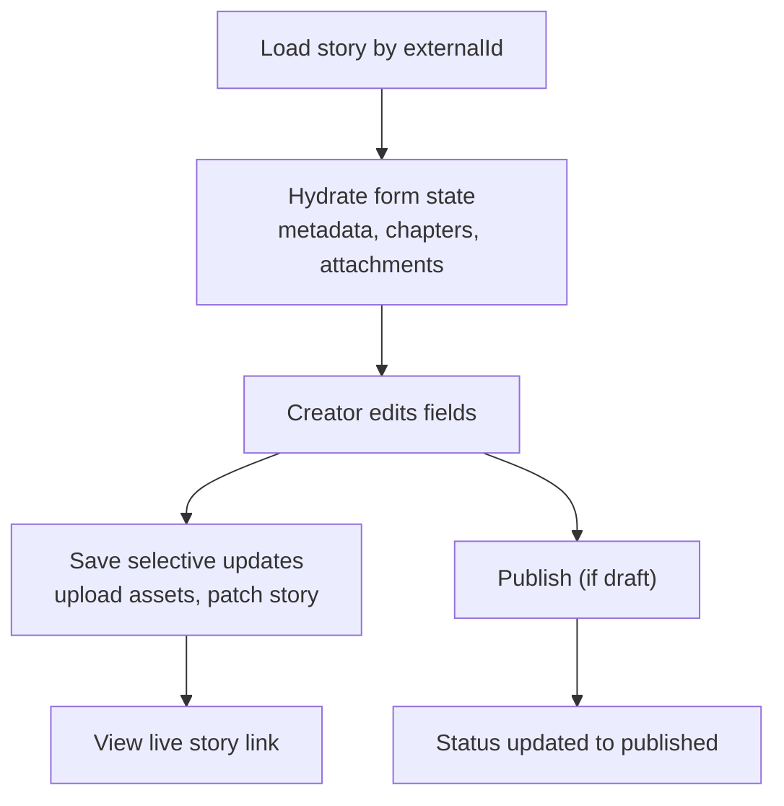

**Diagram sources**
- [CreatorStoryEditor.tsx:84-133](file://src/screens/CreatorStoryEditor.tsx#L84-L133)
- [CreatorStoryEditor.tsx:213-259](file://src/screens/CreatorStoryEditor.tsx#L213-L259)
- [CreatorStoryEditor.tsx:296-318](file://src/screens/CreatorStoryEditor.tsx#L296-L318)

**Section sources**
- [CreatorStoryEditor.tsx:84-133](file://src/screens/CreatorStoryEditor.tsx#L84-L133)
- [CreatorStoryEditor.tsx:213-259](file://src/screens/CreatorStoryEditor.tsx#L213-L259)
- [CreatorStoryEditor.tsx:296-318](file://src/screens/CreatorStoryEditor.tsx#L296-L318)

### Dashboard Integration and Analytics
- Creator dashboard aggregates stats (reads, followers, active stories, ad earnings) and lists stories with quick links.
- Admin stories page displays stories, filters, and moderation actions; detail page shows metrics and logs.

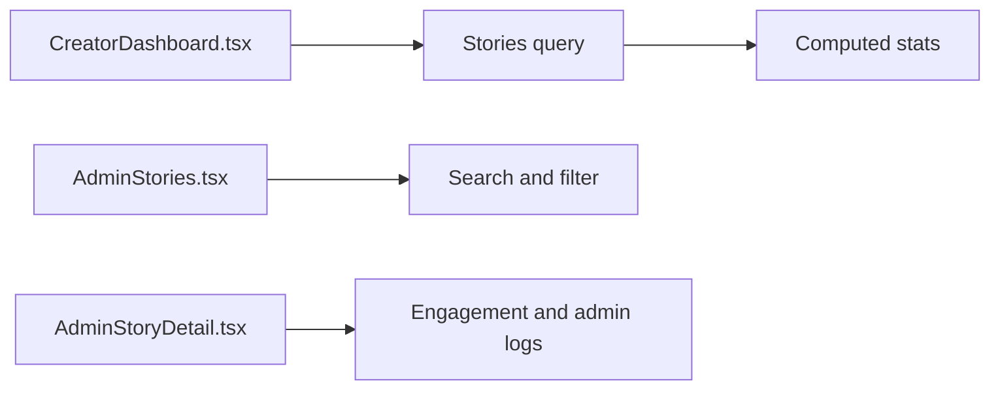

**Diagram sources**
- [CreatorDashboard.tsx:92-106](file://src/screens/CreatorDashboard.tsx#L92-L106)
- [AdminStories.tsx:30-40](file://src/screens/admin/AdminStories.tsx#L30-L40)
- [AdminStoryDetail.tsx:146-177](file://src/screens/admin/details/AdminStoryDetail.tsx#L146-L177)

**Section sources**
- [CreatorDashboard.tsx:92-106](file://src/screens/CreatorDashboard.tsx#L92-L106)
- [AdminStories.tsx:30-40](file://src/screens/admin/AdminStories.tsx#L30-L40)
- [AdminStoryDetail.tsx:146-177](file://src/screens/admin/details/AdminStoryDetail.tsx#L146-L177)

### Status Management Matrix
- draft: editable by creator; not publicly visible; can be published or archived.
- published: visible to readers; can be hidden by admin; increments views.
- hidden: not visible to readers; can be restored to published.
- archived: removed from active listings; can be restored.

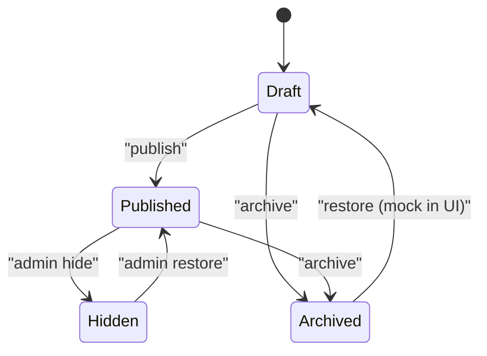

**Diagram sources**
- [schema.ts:112-117](file://convex/schema.ts#L112-L117)
- [CreatorStoryEditor.tsx:276-294](file://src/screens/CreatorStoryEditor.tsx#L276-L294)
- [AdminStoryDetail.tsx:51-57](file://src/screens/admin/details/AdminStoryDetail.tsx#L51-L57)

**Section sources**
- [schema.ts:112-117](file://convex/schema.ts#L112-L117)
- [CreatorStoryEditor.tsx:276-294](file://src/screens/CreatorStoryEditor.tsx#L276-L294)
- [AdminStoryDetail.tsx:51-57](file://src/screens/admin/details/AdminStoryDetail.tsx#L51-L57)

### Automatic Timestamps and Audit Trail
- Backend mutations set createdAt and updatedAt consistently.
- Admin module provides activity logging and analytics queries for monitoring.

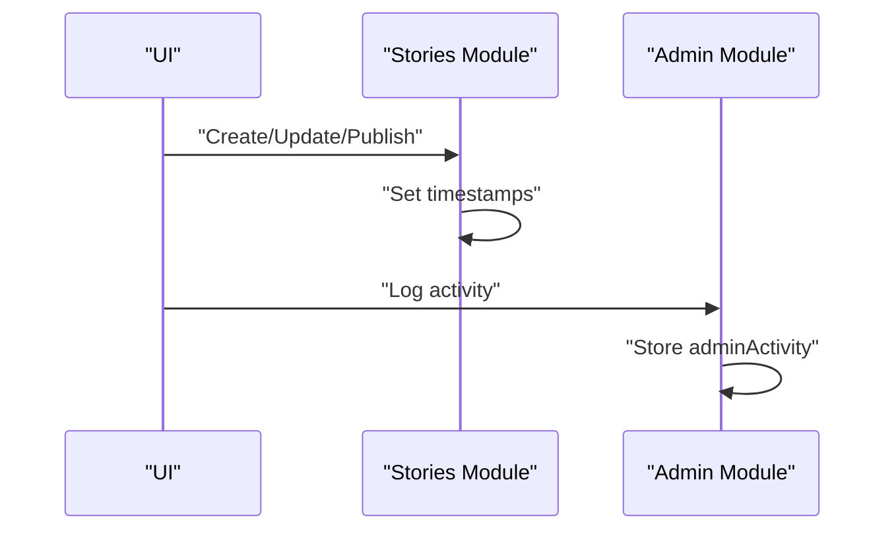

**Diagram sources**
- [stories.ts:73-101](file://convex/stories.ts#L73-L101)
- [stories.ts:138-141](file://convex/stories.ts#L138-L141)
- [stories.ts:155-158](file://convex/stories.ts#L155-L158)
- [admin.ts:232-244](file://convex/admin.ts#L232-L244)

**Section sources**
- [stories.ts:73-101](file://convex/stories.ts#L73-L101)
- [stories.ts:138-141](file://convex/stories.ts#L138-L141)
- [stories.ts:155-158](file://convex/stories.ts#L155-L158)
- [admin.ts:232-244](file://convex/admin.ts#L232-L244)

### Revision History and Version Control
- updatedAt is updated on every selective update, enabling chronological ordering of edits.
- Media metadata can capture review status and publish flags for workflow tracking.

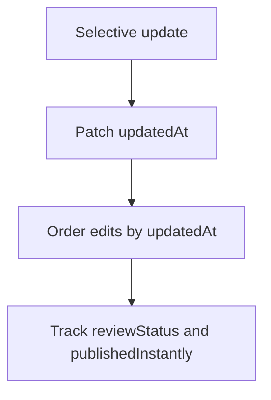

**Diagram sources**
- [stories.ts:138-141](file://convex/stories.ts#L138-L141)
- [UploadFlow.tsx:240-242](file://src/screens/UploadFlow.tsx#L240-L242)

**Section sources**
- [stories.ts:138-141](file://convex/stories.ts#L138-L141)
- [UploadFlow.tsx:240-242](file://src/screens/UploadFlow.tsx#L240-L242)

### Publishing Triggers and Approval Processes
- Instant publish: UploadFlow sets media.reviewStatus and publishedInstantly flags during create/update.
- Post-publication moderation: Admin toggles status and records activity.

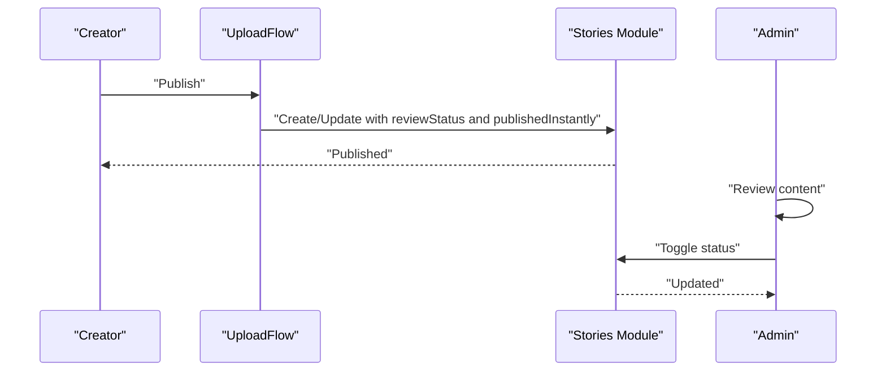

**Diagram sources**
- [UploadFlow.tsx:240-242](file://src/screens/UploadFlow.tsx#L240-L242)
- [stories.ts:163-179](file://convex/stories.ts#L163-L179)
- [AdminStoryDetail.tsx:51-57](file://src/screens/admin/details/AdminStoryDetail.tsx#L51-L57)

**Section sources**
- [UploadFlow.tsx:240-242](file://src/screens/UploadFlow.tsx#L240-L242)
- [stories.ts:163-179](file://convex/stories.ts#L163-L179)
- [AdminStoryDetail.tsx:51-57](file://src/screens/admin/details/AdminStoryDetail.tsx#L51-L57)

### Common Editing Scenarios and Workflows
- Draft to published:
  - Ensure title, cover, banner, and content are present.
  - Save as draft, then publish from editor.
- Update metadata and content:
  - Use selective update to change title, genre, synopsis, tags, and media.
- Archive or unpublish:
  - Archive removes from active listings; restore via admin toggle.

**Section sources**
- [UploadFlow.tsx:189-209](file://src/screens/UploadFlow.tsx#L189-L209)
- [CreatorStoryEditor.tsx:296-318](file://src/screens/CreatorStoryEditor.tsx#L296-L318)
- [CreatorStoryEditor.tsx:276-294](file://src/screens/CreatorStoryEditor.tsx#L276-L294)

## Dependency Analysis
- Frontend screens depend on Convex-generated API references.
- Stories module depends on schema indexes for efficient queries.
- Admin screens rely on analytics and moderation utilities.

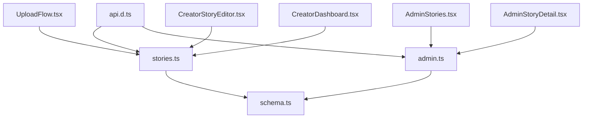

**Diagram sources**
- [api.d.ts:33-62](file://convex/_generated/api.d.ts#L33-L62)
- [stories.ts:1-180](file://convex/stories.ts#L1-L180)
- [admin.ts:31-64](file://convex/admin.ts#L31-L64)
- [schema.ts:95-126](file://convex/schema.ts#L95-L126)
- [UploadFlow.tsx:1-511](file://src/screens/UploadFlow.tsx#L1-L511)
- [CreatorStoryEditor.tsx:1-635](file://src/screens/CreatorStoryEditor.tsx#L1-L635)
- [CreatorDashboard.tsx:1-322](file://src/screens/CreatorDashboard.tsx#L1-L322)
- [AdminStories.tsx:1-250](file://src/screens/admin/AdminStories.tsx#L1-L250)
- [AdminStoryDetail.tsx:1-304](file://src/screens/admin/details/AdminStoryDetail.tsx#L1-L304)

**Section sources**
- [api.d.ts:33-62](file://convex/_generated/api.d.ts#L33-L62)
- [stories.ts:1-180](file://convex/stories.ts#L1-L180)
- [admin.ts:31-64](file://convex/admin.ts#L31-L64)
- [schema.ts:95-126](file://convex/schema.ts#L95-L126)
- [UploadFlow.tsx:1-511](file://src/screens/UploadFlow.tsx#L1-L511)
- [CreatorStoryEditor.tsx:1-635](file://src/screens/CreatorStoryEditor.tsx#L1-L635)
- [CreatorDashboard.tsx:1-322](file://src/screens/CreatorDashboard.tsx#L1-L322)
- [AdminStories.tsx:1-250](file://src/screens/admin/AdminStories.tsx#L1-L250)
- [AdminStoryDetail.tsx:1-304](file://src/screens/admin/details/AdminStoryDetail.tsx#L1-L304)

## Performance Considerations
- Use indexes for frequent queries (by status, creator, externalId).
- Batch asset uploads and avoid unnecessary re-uploads.
- Keep media sizes within limits to reduce storage and bandwidth costs.

## Troubleshooting Guide
- Story not found on publish: verify externalId and existence before invoking publish.
- Already published error: prevent duplicate publish attempts.
- Validation errors on publish: ensure title, images, and content are present.
- Update not applying: confirm selective fields are provided and story exists.

**Section sources**
- [stories.ts:163-179](file://convex/stories.ts#L163-L179)
- [UploadFlow.tsx:189-209](file://src/screens/UploadFlow.tsx#L189-L209)
- [CreatorStoryEditor.tsx:296-318](file://src/screens/CreatorStoryEditor.tsx#L296-L318)

## Conclusion
The Lemonade story editing and publishing system combines a robust schema, selective update mutations, and intuitive creator/admin frontends. It enforces validation, tracks revisions via timestamps, and supports flexible status management with moderation hooks. The dashboard and admin tools provide visibility and control over content health and performance.

## Appendices
- API reference generation: Convex auto-generates typed references for frontend consumption.
- Admin analytics: Overview and analytics queries provide insights into platform health and content performance.

**Section sources**
- [api.d.ts:33-62](file://convex/_generated/api.d.ts#L33-L62)
- [admin.ts:31-64](file://convex/admin.ts#L31-L64)