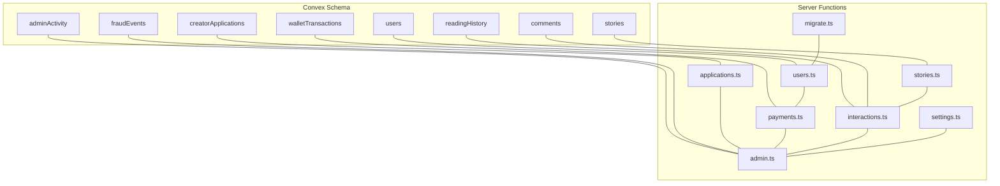
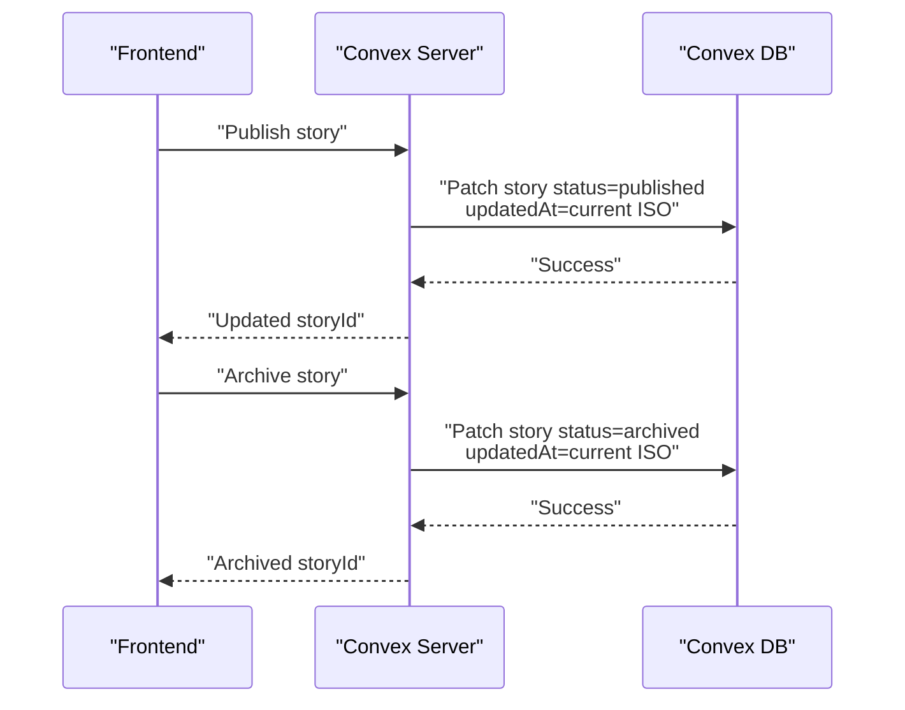
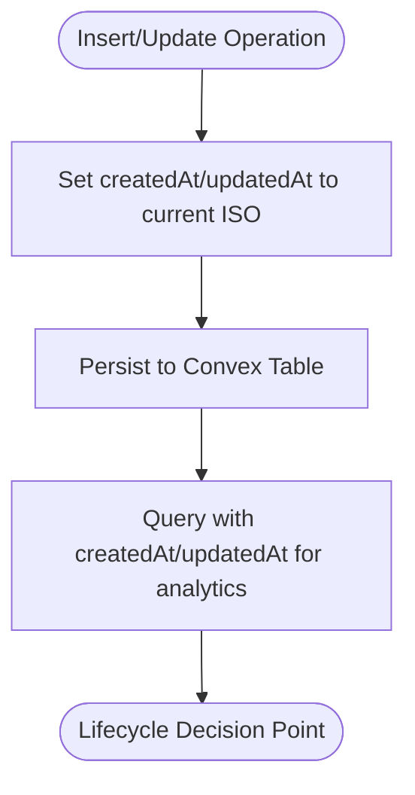
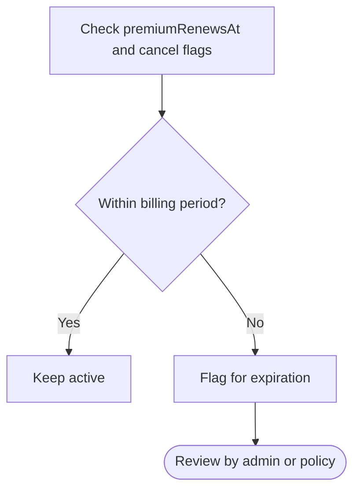
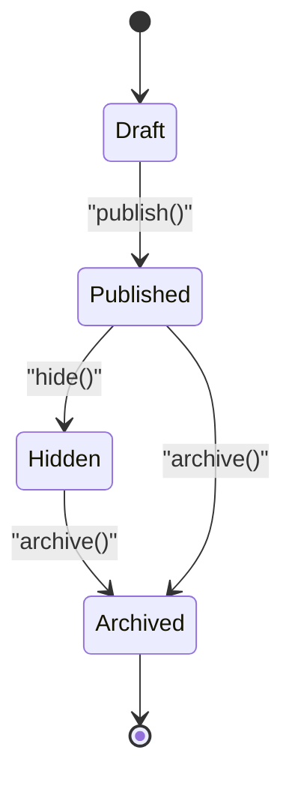
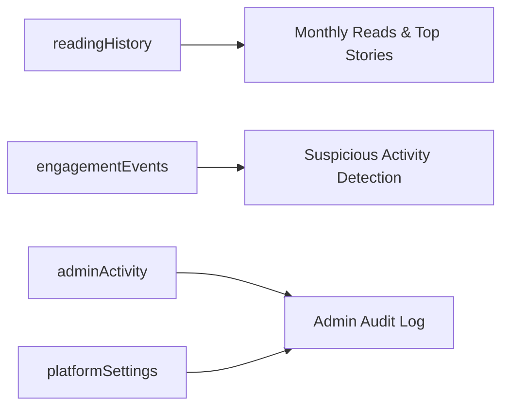
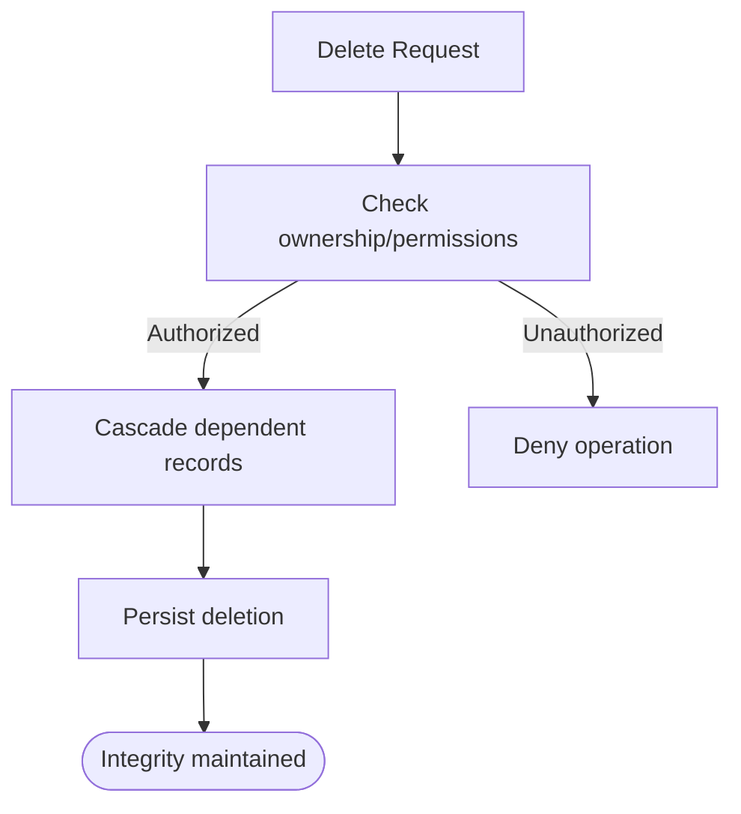
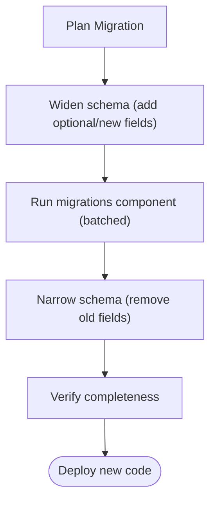
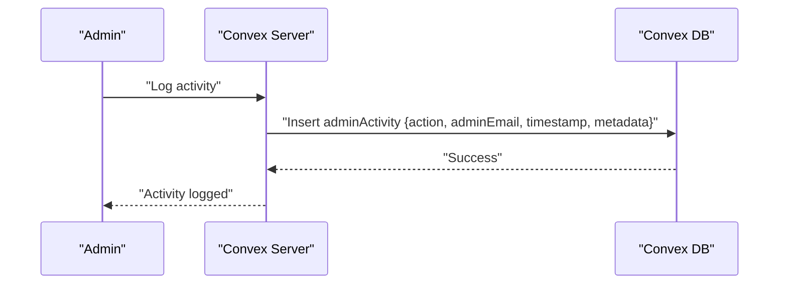
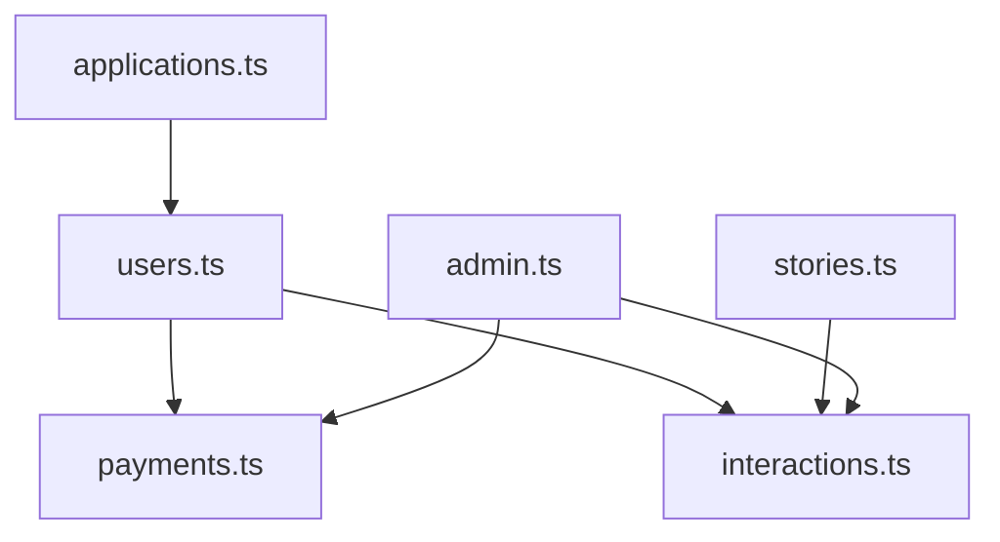

# Data Lifecycle Management

<cite>
**Referenced Files in This Document**
- [schema.ts](file://convex/schema.ts)
- [users.ts](file://convex/users.ts)
- [stories.ts](file://convex/stories.ts)
- [applications.ts](file://convex/applications.ts)
- [payments.ts](file://convex/payments.ts)
- [interactions.ts](file://convex/interactions.ts)
- [admin.ts](file://convex/admin.ts)
- [migrate.ts](file://convex/migrate.ts)
- [settings.ts](file://convex/settings.ts)
- [AdminAuditLog.tsx](file://src/screens/admin/AdminAuditLog.tsx)
- [CreatorStoryEditor.tsx](file://src/screens/CreatorStoryEditor.tsx)
- [migration-patterns.md](file://.agents/skills/convex-migration-helper/references/migration-patterns.md)
- [migrations-component.md](file://.agents/skills/convex-migration-helper/references/migrations-component.md)
</cite>

## Table of Contents
1. [Introduction](#introduction)
2. [Project Structure](#project-structure)
3. [Core Components](#core-components)
4. [Architecture Overview](#architecture-overview)
5. [Detailed Component Analysis](#detailed-component-analysis)
6. [Dependency Analysis](#dependency-analysis)
7. [Performance Considerations](#performance-considerations)
8. [Troubleshooting Guide](#troubleshooting-guide)
9. [Conclusion](#conclusion)
10. [Appendices](#appendices)

## Introduction
This document defines the data lifecycle management strategy for the Lemonade platform. It covers timestamp-based data management across all tables, retention and archival policies for different entity types, automated cleanup for premium memberships, abandoned applications, and inactive accounts, as well as preservation of historical data for analytics. It also documents deletion policies, the distinction between soft and hard deletes, backup and disaster recovery considerations, data migration approaches for schema evolution, and audit trail mechanisms.

## Project Structure
The data lifecycle spans the Convex schema and server-side functions that manage entities such as users, stories, creator applications, payments, interactions, and administrative logs. The frontend surfaces actions like publishing and archiving stories, and exposes admin audit capabilities.

**Diagram sources**
- [schema.ts](file://convex/schema.ts)
- [users.ts](file://convex/users.ts)
- [stories.ts](file://convex/stories.ts)
- [applications.ts](file://convex/applications.ts)
- [payments.ts](file://convex/payments.ts)
- [interactions.ts](file://convex/interactions.ts)
- [admin.ts](file://convex/admin.ts)
- [migrate.ts](file://convex/migrate.ts)
- [settings.ts](file://convex/settings.ts)

**Section sources**
- [schema.ts](file://convex/schema.ts)
- [users.ts](file://convex/users.ts)
- [stories.ts](file://convex/stories.ts)
- [applications.ts](file://convex/applications.ts)
- [payments.ts](file://convex/payments.ts)
- [interactions.ts](file://convex/interactions.ts)
- [admin.ts](file://convex/admin.ts)
- [migrate.ts](file://convex/migrate.ts)
- [settings.ts](file://convex/settings.ts)

## Core Components
- Timestamp-based data model: Many tables include createdAt and updatedAt fields to track creation and modification times.
- Entities with lifecycle states:
  - Users: roles, premium status, activity timestamps, and profile fields.
  - Stories: status lifecycle (draft → published → hidden → archived).
  - Creator applications: status lifecycle tracked for approvals and reviews.
  - Payments and transactions: wallet top-ups, chapter unlocks, premium purchases, refunds.
  - Interactions: reading history, comments, likes/dislikes, saving/un-saving.
  - Admin activity and fraud events: audit and anomaly detection records.
- Audit and moderation: adminActivity captures administrative actions; fraudEvents capture suspicious engagement.

**Section sources**
- [schema.ts](file://convex/schema.ts)
- [users.ts](file://convex/users.ts)
- [stories.ts](file://convex/stories.ts)
- [applications.ts](file://convex/applications.ts)
- [payments.ts](file://convex/payments.ts)
- [interactions.ts](file://convex/interactions.ts)
- [admin.ts](file://convex/admin.ts)

## Architecture Overview
The platform uses Convex schema-defined tables and server functions to enforce lifecycle behaviors. Timestamps are consistently recorded on insert/update. Administrative actions and analytics queries rely on adminActivity and readingHistory. Premium membership lifecycle is managed via payment functions and user premium fields.

**Diagram sources**
- [stories.ts](file://convex/stories.ts)

**Section sources**
- [stories.ts](file://convex/stories.ts)

## Detailed Component Analysis

### Timestamp-Based Data Management
- Schema-wide pattern: timestampFields include createdAt and updatedAt on numerous tables.
- Insertion: functions set createdAt and updatedAt to the current ISO timestamp.
- Updates: patch operations update updatedAt on edits and state transitions.
- Analytics: readingHistory and engagementEvents store timestamps for temporal analysis.

**Diagram sources**
- [schema.ts](file://convex/schema.ts)
- [users.ts](file://convex/users.ts)
- [stories.ts](file://convex/stories.ts)
- [interactions.ts](file://convex/interactions.ts)

**Section sources**
- [schema.ts](file://convex/schema.ts)
- [users.ts](file://convex/users.ts)
- [stories.ts](file://convex/stories.ts)
- [interactions.ts](file://convex/interactions.ts)

### Data Retention Policies by Entity Type
- User data
  - Active/inactive status: users.status toggles between active and suspended.
  - Premium membership: premiumStatus, premiumStartedAt, premiumRenewsAt, premiumCancelledAt, premiumCancelAtPeriodEnd.
  - Profile changes: username change lock enforced by usernameChangeLockedAt and usernameUpdatedAt.
  - Wallet and transactions: walletTransactions retained with createdAt for financial history.
- Story content
  - Status lifecycle: draft → published → hidden → archived.
  - Archival preserves content for historical analytics and creator access.
- Transaction history
  - Wallet transactions: type, amount, currency, status, reference, provider, createdAt.
  - Premium purchases: metadata includes planType and billingCycle.
- Engagement metrics
  - readingHistory: userId, storyId, chapterId, timestamp.
  - engagementEvents: session-level metrics with timestamp for fraud scanning.

Retention rationale:
- Financial and compliance: walletTransactions and premium records kept per policy.
- Analytics: readingHistory and engagementEvents preserved for trend analysis.
- Content governance: stories archived rather than deleted to maintain auditability.

**Section sources**
- [users.ts](file://convex/users.ts)
- [stories.ts](file://convex/stories.ts)
- [payments.ts](file://convex/payments.ts)
- [interactions.ts](file://convex/interactions.ts)
- [schema.ts](file://convex/schema.ts)

### Automated Cleanup Processes
- Expired premium memberships
  - Premium renewal logic sets premiumRenewsAt based on billing cycle; cancellation schedules end-of-period access via premiumCancelAtPeriodEnd and premiumCancelledAt.
- Abandoned applications
  - Creator applications tracked via status lifecycle; admins can approve/reject/needs_info; no automated deletion is implemented in the reviewed code.
- Inactive accounts
  - No automated purge logic observed in the reviewed files; adminActivity and user status fields exist but no scheduled cleanup is present.

**Diagram sources**
- [payments.ts](file://convex/payments.ts)
- [users.ts](file://convex/users.ts)

**Section sources**
- [payments.ts](file://convex/payments.ts)
- [users.ts](file://convex/users.ts)

### Archiving Strategy for Stories
- Transition path: draft → published → hidden → archived.
- Publishing and archiving are explicit state changes via mutations.
- Frontend supports archive action in the story editor.

**Diagram sources**
- [stories.ts](file://convex/stories.ts)
- [CreatorStoryEditor.tsx](file://src/screens/CreatorStoryEditor.tsx)

**Section sources**
- [stories.ts](file://convex/stories.ts)
- [CreatorStoryEditor.tsx](file://src/screens/CreatorStoryEditor.tsx)

### Preservation of Historical Data for Analytics
- readingHistory and engagementEvents enable monthly aggregation and top story ranking.
- adminActivity logs administrative actions for oversight.
- Platform settings include updatedAt for configuration audits.

**Diagram sources**
- [interactions.ts](file://convex/interactions.ts)
- [admin.ts](file://convex/admin.ts)
- [settings.ts](file://convex/settings.ts)

**Section sources**
- [interactions.ts](file://convex/interactions.ts)
- [admin.ts](file://convex/admin.ts)
- [settings.ts](file://convex/settings.ts)

### Data Deletion Policies and Soft vs Hard Deletes
- Explicit deletions observed:
  - Comment deletion removes a comment and its replies.
  - Spin reward deletion removes inventory entries.
- Absent in reviewed code:
  - No user account deletion or purge logic.
  - No story hard delete; archival is used instead.
  - No scheduled cleanup for abandoned applications or inactive users.
- Impact on data integrity:
  - Comments cascade-delete replies to preserve referential integrity.
  - Inventory deletion is atomic.

**Diagram sources**
- [interactions.ts](file://convex/interactions.ts)
- [admin.ts](file://convex/admin.ts)

**Section sources**
- [interactions.ts](file://convex/interactions.ts)
- [admin.ts](file://convex/admin.ts)

### Backup, Disaster Recovery, and Migration Approaches
- Backup and DR: No explicit backup or restore functions are present in the reviewed code.
- Migration strategy:
  - Use the migrations component for online, batched updates.
  - Prefer dual-write/dual-read patterns for zero-downtime schema changes.
  - Clean up orphaned documents and verify migration completeness.
  - Example migration mutation demonstrates fixing schema anomalies.

**Diagram sources**
- [migrate.ts](file://convex/migrate.ts)
- [migration-patterns.md](file://.agents/skills/convex-migration-helper/references/migration-patterns.md)
- [migrations-component.md](file://.agents/skills/convex-migration-helper/references/migrations-component.md)

**Section sources**
- [migrate.ts](file://convex/migrate.ts)
- [migration-patterns.md](file://.agents/skills/convex-migration-helper/references/migration-patterns.md)
- [migrations-component.md](file://.agents/skills/convex-migration-helper/references/migrations-component.md)

### Audit Trail Mechanisms
- adminActivity captures administrative actions with timestamps and metadata.
- Frontend AdminAuditLog screen mocks audit log viewing and export.
- Fraud events capture suspicious engagement patterns for review.

**Diagram sources**
- [admin.ts](file://convex/admin.ts)
- [AdminAuditLog.tsx](file://src/screens/admin/AdminAuditLog.tsx)

**Section sources**
- [admin.ts](file://convex/admin.ts)
- [AdminAuditLog.tsx](file://src/screens/admin/AdminAuditLog.tsx)

## Dependency Analysis
- users.ts depends on payments.ts for premium status updates and on interactions.ts for reading history.
- stories.ts integrates with interactions.ts for views and engagement.
- applications.ts interacts with users.ts for status updates and creators.ts for profile creation.
- admin.ts aggregates analytics and manages fraud events and audit logs.

**Diagram sources**
- [users.ts](file://convex/users.ts)
- [stories.ts](file://convex/stories.ts)
- [applications.ts](file://convex/applications.ts)
- [payments.ts](file://convex/payments.ts)
- [interactions.ts](file://convex/interactions.ts)
- [admin.ts](file://convex/admin.ts)

**Section sources**
- [users.ts](file://convex/users.ts)
- [stories.ts](file://convex/stories.ts)
- [applications.ts](file://convex/applications.ts)
- [payments.ts](file://convex/payments.ts)
- [interactions.ts](file://convex/interactions.ts)
- [admin.ts](file://convex/admin.ts)

## Performance Considerations
- Indexes on frequently queried fields (e.g., users by username, stories by status, transactions by user/reference) improve lookup performance.
- Batched migrations avoid transaction limits and timeouts.
- Timestamp-based analytics reduce need for expensive joins by leveraging indexed timestamps.

[No sources needed since this section provides general guidance]

## Troubleshooting Guide
- Premium activation and renewal
  - Verify premiumRenewsAt and billing cycle; ensure provider payload normalization.
- Comment deletion
  - Confirm author or admin role; ensure replies are deleted prior to parent.
- Story archival
  - Ensure status transitions are intentional; verify frontend archive action.
- Migration issues
  - Use migrations component with dry runs; prefer dual-write patterns; verify completion.

**Section sources**
- [payments.ts](file://convex/payments.ts)
- [interactions.ts](file://convex/interactions.ts)
- [stories.ts](file://convex/stories.ts)
- [migration-patterns.md](file://.agents/skills/convex-migration-helper/references/migration-patterns.md)

## Conclusion
Lemonade’s data lifecycle is governed by consistent timestamp usage, explicit state transitions for stories and applications, and robust premium management. While archival replaces hard deletion for content, no automated cleanup is implemented for premium expirations, abandoned applications, or inactive accounts. Migration and audit capabilities are present, but dedicated backup and disaster recovery functions are not included in the reviewed code. Administrators can leverage adminActivity and fraudEvents to monitor and act on platform health.

[No sources needed since this section summarizes without analyzing specific files]

## Appendices
- Appendix A: Timestamp fields across tables
  - Users, creators, stories, moderators, platformSettings, advertisers, adCampaigns, adEvents, creatorAdRevenue, userCurrencies, userStreaks, weeklySpinInventory, spinResults, engagementEvents, xpEvents, achievementsCatalog, userAchievements, leaderboardsSnapshots, creatorQuests, rewardInventory, fraudEvents.
- Appendix B: Key lifecycle mutations
  - stories.publish, stories.update, users.setStatus, payments.activatePremiumAfterPaystack, payments.cancelPremium, admin.scanEngagementForFraud, interactions.deleteComment.

**Section sources**
- [schema.ts](file://convex/schema.ts)
- [stories.ts](file://convex/stories.ts)
- [users.ts](file://convex/users.ts)
- [payments.ts](file://convex/payments.ts)
- [interactions.ts](file://convex/interactions.ts)
- [admin.ts](file://convex/admin.ts)