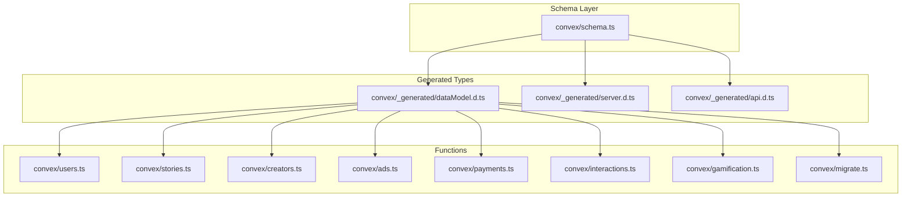
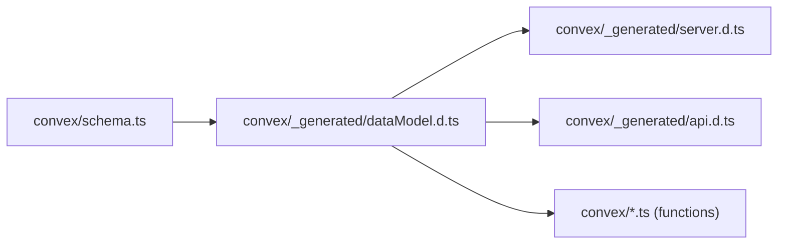

# Database Schema Design

<cite>
**Referenced Files in This Document**
- [schema.ts](file://convex/schema.ts)
- [dataModel.d.ts](file://convex/_generated/dataModel.d.ts)
- [server.d.ts](file://convex/_generated/server.d.ts)
- [api.d.ts](file://convex/_generated/api.d.ts)
- [migrate.ts](file://convex/migrate.ts)
- [users.ts](file://convex/users.ts)
- [stories.ts](file://convex/stories.ts)
- [creators.ts](file://convex/creators.ts)
- [ads.ts](file://convex/ads.ts)
- [payments.ts](file://convex/payments.ts)
- [interactions.ts](file://convex/interactions.ts)
- [gamification.ts](file://convex/gamification.ts)
</cite>

## Update Summary
**Changes Made**
- Updated Comments table section to document new dislikesCount and dislikedBy fields
- Added comprehensive coverage of comment interaction tracking functionality
- Updated Comments section to reflect bidirectional like/dislike capabilities
- Enhanced data access patterns to include dislike operations
- Updated architecture overview to include comment interaction relationships

## Table of Contents
1. [Introduction](#introduction)
2. [Project Structure](#project-structure)
3. [Core Components](#core-components)
4. [Architecture Overview](#architecture-overview)
5. [Detailed Component Analysis](#detailed-component-analysis)
6. [Dependency Analysis](#dependency-analysis)
7. [Performance Considerations](#performance-considerations)
8. [Troubleshooting Guide](#troubleshooting-guide)
9. [Conclusion](#conclusion)
10. [Appendices](#appendices)

## Introduction
This document describes the database schema design for the Lemonade platform, focusing on the Convex-defined schema and the relationships among 40+ tables. It covers table definitions, primary keys, foreign keys, indexes, constraints, data types, validation rules, indexing strategy, data access patterns via Convex functions, and operational aspects such as migrations and performance. The goal is to provide a comprehensive understanding of the data model for developers and operators.

## Project Structure
The schema is defined centrally and consumed by generated types and function modules:
- Central schema definition: [schema.ts](file://convex/schema.ts)
- Generated data model types: [dataModel.d.ts](file://convex/_generated/dataModel.d.ts)
- Generated server utilities for queries/mutations/actions: [server.d.ts](file://convex/_generated/server.d.ts)
- Public/internal API surface: [api.d.ts](file://convex/_generated/api.d.ts)
- Example migration: [migrate.ts](file://convex/migrate.ts)



**Diagram sources**
- [schema.ts:24-495](file://convex/schema.ts#L24-L495)
- [dataModel.d.ts:10-60](file://convex/_generated/dataModel.d.ts#L10-L60)
- [server.d.ts:11-144](file://convex/_generated/server.d.ts#L11-L144)
- [api.d.ts:33-77](file://convex/_generated/api.d.ts#L33-L77)

**Section sources**
- [schema.ts:1-495](file://convex/schema.ts#L1-L495)
- [dataModel.d.ts:1-61](file://convex/_generated/dataModel.d.ts#L1-L61)
- [server.d.ts:1-144](file://convex/_generated/server.d.ts#L1-L144)
- [api.d.ts:1-78](file://convex/_generated/api.d.ts#L1-L78)

## Core Components
This section outlines the schema's core tables, their fields, and indexes. Each table definition includes:
- Field names and types
- Enumerated unions for constrained values
- Index declarations for query performance
- Timestamp fields shared across many tables

Key observations:
- Many tables include createdAt and updatedAt timestamps.
- Several enums constrain values to a fixed set of literals.
- Indexes are declared per table to optimize frequent queries.

Representative table summaries:
- Users: identity, roles, premium status, wallet, preferences, and activity arrays.
- Creators: creator profiles linked to users, categories, and metrics.
- Stories: narrative content with status, ratings, and metadata.
- Creator Applications: application lifecycle for creator access.
- Content Reports: moderation and reporting workflow.
- Admin Activity: audit trail for administrative actions.
- Moderators: platform moderation staff.
- Wallet Transactions: financial activity with provider references.
- Reading History: user engagement tracking.
- Notifications: user-centric alerts.
- Comments: threaded discussions with likes and dislikes.
- Platform Settings: global configuration.
- Advertisers: campaign sponsors.
- Ad Campaigns: advertising content and targeting.
- Ad Events: impression/completion tracking and revenue attribution.
- Creator Ad Revenue: aggregated earnings per creator and period.
- Gamification: currencies, streaks, spin inventory, spin results, engagement events, XP events, achievements catalog, user achievements, leaderboards snapshots, creator quests, reward inventory, and fraud events.

**Section sources**
- [schema.ts:24-495](file://convex/schema.ts#L24-L495)

## Architecture Overview
The schema defines a cohesive relational-like model within a document database abstraction. Tables are connected by fields that act as foreign keys (via Convex document IDs and denormalized identifiers). The generated types ensure compile-time safety for queries and mutations.

```mermaid
erDiagram
USERS ||--o{ READING_HISTORY : "reads"
USERS ||--o{ WALLET_TRANSACTIONS : "initiates"
USERS ||--o{ NOTIFICATIONS : "receives"
USERS ||--o{ COMMENTS : "writes"
USERS ||--o{ ENGAGEMENT_EVENTS : "generates"
USERS ||--o{ XP_EVENTS : "earns"
USERS ||--o{ USER_CURRENCIES : "owns"
USERS ||--o{ USER_STREAKS : "tracks"
USERS ||--o{ SPIN_RESULTS : "wins"
USERS ||--o{ USER_ACHIEVEMENTS : "gains"
CREATORS ||--o{ STORIES : "creates"
CREATORS ||--o{ CREATOR_APPLICATIONS : "applies"
CREATORS ||--o{ CREATOR_AD_REVENUE : "earns"
AD_CAMPAIGNS ||--o{ AD_EVENTS : "targets"
ADVERTISERS ||--o{ AD_CAMPAIGNS : "funds"
ADVERTISERS ||--o{ AD_EVENTS : "sponsors"
STORY_ID : "stories._id"
USER_ID : "users._id"
CREATOR_ID : "creators._id"
ADVERT_ID : "advertisers._id"
AD_CAMPAIGN_ID : "adCampaigns._id"
```

**Diagram sources**
- [schema.ts:24-495](file://convex/schema.ts#L24-L495)

## Detailed Component Analysis

### Users
- Purpose: Core identity and profile management, roles, premium state, wallet, preferences, and activity arrays.
- Primary key: users._id
- Notable indexes:
  - by_externalId
  - by_firebaseUid
  - by_email
  - by_username
  - by_role
- Constraints and validations:
  - Username normalization and validation rules enforced in functions.
  - Role and premium status constrained to enumerated values.
  - Arrays for followed creators, saved stories, unlocked chapters, and badges.
- Typical queries/mutations:
  - Upsert by Firebase UID
  - Get by username
  - Update profile (including username change policy)
  - Manage wallet balance and notifications
  - Toggle saves and follows

**Section sources**
- [schema.ts:25-67](file://convex/schema.ts#L25-L67)
- [users.ts:15-360](file://convex/users.ts#L15-L360)

### Creators
- Purpose: Creator profiles, follower counts, categories, and metadata.
- Primary key: creators._id
- Notable indexes:
  - by_externalId
  - by_userId
  - by_username
- Constraints and validations:
  - Category normalized to array during upsert.
- Typical queries/mutations:
  - Upsert by username
  - Adjust follower counts

**Section sources**
- [schema.ts:69-93](file://convex/schema.ts#L69-L93)
- [creators.ts:1-87](file://convex/creators.ts#L1-L87)

### Stories
- Purpose: Narrative content with status, ratings, views, saves, episodes, and tags.
- Primary key: stories._id
- Notable indexes:
  - by_externalId
  - by_creatorId
  - by_creatorUsername
  - by_status
  - by_featured
- Constraints and validations:
  - Status constrained to enumerated values.
- Typical queries/mutations:
  - List published and featured
  - Create/update story
  - Increment views
  - Publish/unpublish

**Section sources**
- [schema.ts:95-125](file://convex/schema.ts#L95-L125)
- [stories.ts:1-180](file://convex/stories.ts#L1-L180)

### Creator Applications
- Purpose: Application lifecycle for creator access.
- Primary key: creatorApplications._id
- Notable indexes:
  - by_userId
  - by_status
- Constraints and validations:
  - Status constrained to enumerated values.

**Section sources**
- [schema.ts:127-149](file://convex/schema.ts#L127-L149)

### Content Reports
- Purpose: Reporting and moderation workflow.
- Primary key: contentReports._id
- Notable indexes:
  - by_status
  - by_targetId
- Constraints and validations:
  - Type and status constrained to enumerated values.

**Section sources**
- [schema.ts:151-174](file://convex/schema.ts#L151-L174)

### Admin Activity
- Purpose: Audit trail for admin actions.
- Primary key: adminActivity._id
- Notable indexes:
  - by_adminEmail

**Section sources**
- [schema.ts:176-181](file://convex/schema.ts#L176-L181)

### Moderators
- Purpose: Platform moderation staff.
- Primary key: moderators._id
- Notable indexes:
  - by_email
- Constraints and validations:
  - Role and status constrained to enumerated values.

**Section sources**
- [schema.ts:183-196](file://convex/schema.ts#L183-L196)

### Wallet Transactions
- Purpose: Financial activity with provider references.
- Primary key: walletTransactions._id
- Notable indexes:
  - by_userId
  - by_reference
  - by_status
- Constraints and validations:
  - Type and status constrained to enumerated values.

**Section sources**
- [schema.ts:198-223](file://convex/schema.ts#L198-L223)
- [payments.ts:1-291](file://convex/payments.ts#L1-L291)

### Reading History
- Purpose: Track user reading sessions.
- Primary key: readingHistory._id
- Notable indexes:
  - by_userId
  - by_user_story

**Section sources**
- [schema.ts:225-232](file://convex/schema.ts#L225-L232)
- [interactions.ts:74-109](file://convex/interactions.ts#L74-L109)

### Notifications
- Purpose: User-centric alerts.
- Primary key: notifications._id
- Notable indexes:
  - by_userId
- Constraints and validations:
  - Type constrained to enumerated values.

**Section sources**
- [schema.ts:234-250](file://convex/schema.ts#L234-L250)
- [users.ts:245-268](file://convex/users.ts#L245-L268)

### Comments
- Purpose: Threaded discussions with likes and dislikes functionality.
- Primary key: comments._id
- Notable indexes:
  - by_story
  - by_story_chapter
  - by_parentCommentId
- Constraints and validations:
  - LikedBy, likesCount, dislikedBy, and dislikesCount maintained consistently.
  - Bidirectional like/dislike operations ensure mutual exclusivity between like and dislike states.
  - Atomic operations maintain data consistency for comment interactions.

**Updated** Enhanced comment entity schema with comprehensive interaction tracking including dislikesCount and dislikedBy fields to support bidirectional like/dislike functionality alongside existing like functionality.

**Section sources**
- [schema.ts:252-269](file://convex/schema.ts#L252-L269)
- [interactions.ts:111-228](file://convex/interactions.ts#L111-L228)

### Platform Settings
- Purpose: Global configuration toggles.
- Primary key: platformSettings._id

**Section sources**
- [schema.ts:271-276](file://convex/schema.ts#L271-L276)

### Advertisers
- Purpose: Sponsors of campaigns.
- Primary key: advertisers._id
- Notable indexes:
  - by_status
- Constraints and validations:
  - Status constrained to enumerated values.

**Section sources**
- [schema.ts:278-286](file://convex/schema.ts#L278-L286)

### Ad Campaigns
- Purpose: Advertising content and targeting.
- Primary key: adCampaigns._id
- Notable indexes:
  - by_status
  - by_placement
  - by_status_and_placement
- Constraints and validations:
  - Type, placement, and status constrained to enumerated values.

**Section sources**
- [schema.ts:288-315](file://convex/schema.ts#L288-L315)
- [ads.ts:105-360](file://convex/ads.ts#L105-L360)

### Ad Events
- Purpose: Impression/completion tracking and revenue attribution.
- Primary key: adEvents._id
- Notable indexes:
  - by_adId
  - by_creatorUsername
  - by_storyId
  - by_eventType
- Constraints and validations:
  - Content type and event type constrained to enumerated values.

**Section sources**
- [schema.ts:317-335](file://convex/schema.ts#L317-L335)
- [ads.ts:167-236](file://convex/ads.ts#L167-L236)

### Creator Ad Revenue
- Purpose: Aggregated earnings per creator and period.
- Primary key: creatorAdRevenue._id
- Notable indexes:
  - by_creatorUsername
  - by_creator_and_period

**Section sources**
- [schema.ts:337-352](file://convex/schema.ts#L337-L352)
- [ads.ts:239-312](file://convex/ads.ts#L239-L312)

### Gamification Tables
- Purpose: Engagement, rewards, streaks, XP, achievements, leaderboards, quests, and fraud monitoring.
- Primary key: Each table's _id
- Notable indexes:
  - userCurrencies: by_userId
  - userStreaks: by_userId
  - weeklySpinInventory: by_active
  - spinResults: by_user_week
  - engagementEvents: by_user, by_session
  - xpEvents: by_user
  - achievementsCatalog: by_active
  - userAchievements: by_user
  - leaderboardsSnapshots: by_period_and_type
  - creatorQuests: by_creator, by_active
  - rewardInventory: by_rewardId
  - fraudEvents: by_user

**Section sources**
- [schema.ts:354-495](file://convex/schema.ts#L354-L495)
- [gamification.ts:1-331](file://convex/gamification.ts#L1-L331)

### Data Access Patterns and Function Interactions
- Queries and mutations are defined in modules under convex/ and consume the generated types for type safety.
- Functions commonly:
  - Resolve user identity via by_firebaseUid or by_username
  - Use table-specific indexes for filtering and sorting
  - Perform atomic writes within mutations
  - Cross-reference tables (e.g., creators and stories, users and transactions)

**Updated** Enhanced comment interaction patterns now include bidirectional like/dislike operations with automatic mutual exclusivity handling.

Examples:
- Users module uses indexes for lookup and profile updates.
- Stories module uses status and creator indexes for listing and publishing.
- Ads module selects campaigns by status/placement and tracks events with revenue aggregation.
- Payments module records transactions and credits wallets with provider references.
- Interactions module manages reading history, comments, likes, and dislikes with bidirectional state management.
- Gamification module records engagement, awards XP and currencies, and runs weekly spins.

**Section sources**
- [users.ts:15-360](file://convex/users.ts#L15-L360)
- [stories.ts:1-180](file://convex/stories.ts#L1-L180)
- [ads.ts:105-360](file://convex/ads.ts#L105-L360)
- [payments.ts:1-291](file://convex/payments.ts#L1-L291)
- [interactions.ts:1-267](file://convex/interactions.ts#L1-L267)
- [gamification.ts:1-331](file://convex/gamification.ts#L1-L331)

## Dependency Analysis
The schema and generated types form a tight coupling that ensures type-safe database access across modules. Dependencies:
- schema.ts defines tables and indexes
- dataModel.d.ts exposes typed document and table names
- server.d.ts exposes typed builders for queries, mutations, and actions
- api.d.ts aggregates modules into a public/internal API surface
- Functions depend on dataModel types for type-safe reads/writes



**Diagram sources**
- [schema.ts:1-495](file://convex/schema.ts#L1-L495)
- [dataModel.d.ts:10-60](file://convex/_generated/dataModel.d.ts#L10-L60)
- [server.d.ts:11-144](file://convex/_generated/server.d.ts#L11-L144)
- [api.d.ts:33-77](file://convex/_generated/api.d.ts#L33-L77)

**Section sources**
- [schema.ts:1-495](file://convex/schema.ts#L1-L495)
- [dataModel.d.ts:10-60](file://convex/_generated/dataModel.d.ts#L10-L60)
- [server.d.ts:11-144](file://convex/_generated/server.d.ts#L11-L144)
- [api.d.ts:33-77](file://convex/_generated/api.d.ts#L33-L77)

## Performance Considerations
Indexing strategy:
- Single-field indexes optimized for equality filters:
  - users.by_externalId, by_firebaseUid, by_email, by_username, by_role
  - creators.by_externalId, by_userId, by_username
  - stories.by_externalId, by_creatorId, by_creatorUsername, by_status, by_featured
  - creatorApplications.by_userId, by_status
  - contentReports.by_status, by_targetId
  - moderators.by_email
  - walletTransactions.by_userId, by_reference, by_status
  - readingHistory.by_userId, by_user_story
  - notifications.by_userId
  - comments.by_story, by_story_chapter, by_parentCommentId
  - advertisers.by_status
  - adCampaigns.by_status, by_placement, by_status_and_placement
  - adEvents.by_adId, by_creatorUsername, by_storyId, by_eventType
  - creatorAdRevenue.by_creatorUsername, by_creator_and_period
  - userCurrencies.by_userId
  - userStreaks.by_userId
  - weeklySpinInventory.by_active
  - spinResults.by_user_week
  - engagementEvents.by_user, by_session
  - xpEvents.by_user
  - achievementsCatalog.by_active
  - userAchievements.by_user
  - leaderboardsSnapshots.by_period_and_type
  - creatorQuests.by_creator, by_active
  - rewardInventory.by_rewardId
  - fraudEvents.by_user

**Updated** Comments table now includes additional indexes supporting dislike functionality and bidirectional interaction tracking.

Query patterns supported:
- Identity lookups by external identifiers and usernames
- Status-based filtering for content and campaigns
- User-scoped collections for notifications, transactions, and history
- Hierarchical queries for comments and reading history
- Aggregation by creator and period for ad revenue
- Bidirectional like/dislike operations with atomic state management

Optimization recommendations:
- Add composite indexes for frequently filtered combinations (e.g., stories by creator and status)
- Monitor slow queries and add targeted indexes for hot paths
- Use pagination for large collections (as seen in comments paging)
- Keep indexed fields selective to minimize index size and write overhead
- Consider adding indexes for comment interaction patterns (likesCount, dislikesCount)

## Troubleshooting Guide
Common issues and resolutions:
- Username conflicts: Validation prevents duplicates; ensure uniqueness checks are performed before updates.
- Insufficient balance: Wallet operations check balances prior to unlocking chapters or purchases.
- Missing user or creator: Functions defensively check existence and return null or throw errors as appropriate.
- Duplicate external IDs: Story creation checks for existing external IDs to avoid duplication.
- Migration of legacy data: A dedicated migration function normalizes category fields in creators.
- Comment interaction conflicts: Like/dislike operations automatically handle mutual exclusivity to prevent conflicting states.

**Updated** Added troubleshooting guidance for comment interaction conflicts and bidirectional state management.

Operational references:
- Username validation and normalization: [users.ts:9-13](file://convex/users.ts#L9-L13)
- Unlocking chapters and wallet transactions: [users.ts:269-310](file://convex/users.ts#L269-L310)
- Story creation and updates: [stories.ts:46-144](file://convex/stories.ts#L46-L144)
- Creator category normalization: [creators.ts:5-5](file://convex/creators.ts#L5-L5)
- Migration for category normalization: [migrate.ts:7-35](file://convex/migrate.ts#L7-L35)
- Comment like/dislike operations: [interactions.ts:196-228](file://convex/interactions.ts#L196-L228)

**Section sources**
- [users.ts:9-310](file://convex/users.ts#L9-L310)
- [stories.ts:46-144](file://convex/stories.ts#L46-L144)
- [creators.ts:5-66](file://convex/creators.ts#L5-L66)
- [migrate.ts:7-35](file://convex/migrate.ts#L7-L35)
- [interactions.ts:196-228](file://convex/interactions.ts#L196-L228)

## Conclusion
The Lemonade schema establishes a robust, type-safe foundation for identity, content, commerce, advertising, and gamification. The indexing strategy targets common query patterns, and the generated types ensure safe, maintainable function development. Operational practices such as migrations and defensive validations protect data integrity. The recent enhancement to comment entity schema with comprehensive interaction tracking (likes and dislikes) provides a more complete social interaction model. Future enhancements can focus on additional composite indexes, data retention policies, and automated cleanup procedures aligned with business needs.

## Appendices

### Appendix A: Index Reference
- users: by_externalId, by_firebaseUid, by_email, by_username, by_role
- creators: by_externalId, by_userId, by_username
- stories: by_externalId, by_creatorId, by_creatorUsername, by_status, by_featured
- creatorApplications: by_userId, by_status
- contentReports: by_status, by_targetId
- adminActivity: by_adminEmail
- moderators: by_email
- walletTransactions: by_userId, by_reference, by_status
- readingHistory: by_userId, by_user_story
- notifications: by_userId
- comments: by_story, by_story_chapter, by_parentCommentId
- advertisers: by_status
- adCampaigns: by_status, by_placement, by_status_and_placement
- adEvents: by_adId, by_creatorUsername, by_storyId, by_eventType
- creatorAdRevenue: by_creatorUsername, by_creator_and_period
- userCurrencies: by_userId
- userStreaks: by_userId
- weeklySpinInventory: by_active
- spinResults: by_user_week
- engagementEvents: by_user, by_session
- xpEvents: by_user
- achievementsCatalog: by_active
- userAchievements: by_user
- leaderboardsSnapshots: by_period_and_type
- creatorQuests: by_creator, by_active
- rewardInventory: by_rewardId
- fraudEvents: by_user

**Updated** Comments table now includes additional indexes supporting bidirectional interaction tracking.

**Section sources**
- [schema.ts:62-67](file://convex/schema.ts#L62-L67)
- [schema.ts:91-93](file://convex/schema.ts#L91-L93)
- [schema.ts:121-125](file://convex/schema.ts#L121-L125)
- [schema.ts:148-149](file://convex/schema.ts#L148-L149)
- [schema.ts:173-174](file://convex/schema.ts#L173-L174)
- [schema.ts:196-196](file://convex/schema.ts#L196-L196)
- [schema.ts:221-223](file://convex/schema.ts#L221-L223)
- [schema.ts:231-232](file://convex/schema.ts#L231-L232)
- [schema.ts:250-250](file://convex/schema.ts#L250-L250)
- [schema.ts:265-269](file://convex/schema.ts#L265-L269)
- [schema.ts:284-284](file://convex/schema.ts#L284-L284)
- [schema.ts:312-315](file://convex/schema.ts#L312-L315)
- [schema.ts:330-335](file://convex/schema.ts#L330-L335)
- [schema.ts:349-352](file://convex/schema.ts#L349-L352)
- [schema.ts:359-359](file://convex/schema.ts#L359-L359)
- [schema.ts:369-369](file://convex/schema.ts#L369-L369)
- [schema.ts:390-392](file://convex/schema.ts#L390-L392)
- [schema.ts:402-404](file://convex/schema.ts#L402-L404)
- [schema.ts:418-420](file://convex/schema.ts#L418-L420)
- [schema.ts:427-429](file://convex/schema.ts#L427-L429)
- [schema.ts:441-443](file://convex/schema.ts#L441-L443)
- [schema.ts:451-451](file://convex/schema.ts#L451-L451)
- [schema.ts:455-457](file://convex/schema.ts#L455-L457)
- [schema.ts:469-471](file://convex/schema.ts#L469-L471)
- [schema.ts:479-481](file://convex/schema.ts#L479-L481)
- [schema.ts:491-493](file://convex/schema.ts#L491-L493)

### Appendix B: Data Lifecycle Management
- Retention and cleanup:
  - No explicit TTL or retention policies are defined in the schema.
  - Consider adding createdAt-based pruning for logs, events, and temporary records.
  - Archive old ad events or engagement events by period for analytics.
  - Monitor comment interaction data growth for potential cleanup strategies.
- Migration strategy:
  - Use dedicated migration functions to normalize data (e.g., category normalization).
  - Maintain idempotency and track migration state to prevent repeated work.
  - Consider data migration strategies for comment interaction fields if schema evolves.
- Version management:
  - Evolve schema via incremental changes and migrations.
  - Use generated types to catch breaking changes early.
  - Test comment interaction functionality thoroughly during schema updates.

**Updated** Added considerations for comment interaction data lifecycle management.

**Section sources**
- [migrate.ts:7-35](file://convex/migrate.ts#L7-L35)
- [interactions.ts:196-228](file://convex/interactions.ts#L196-L228)