# Entity Relationships

<cite>
**Referenced Files in This Document**
- [schema.ts](file://convex/schema.ts)
- [users.ts](file://convex/users.ts)
- [creators.ts](file://convex/creators.ts)
- [stories.ts](file://convex/stories.ts)
- [interactions.ts](file://convex/interactions.ts)
- [payments.ts](file://convex/payments.ts)
- [ads.ts](file://convex/ads.ts)
- [admin.ts](file://convex/admin.ts)
- [gamification.ts](file://convex/gamification.ts)
- [applications.ts](file://convex/applications.ts)
- [settings.ts](file://convex/settings.ts)
- [seed.ts](file://convex/seed.ts)
- [migrate.ts](file://convex/migrate.ts)
</cite>

## Table of Contents
1. [Introduction](#introduction)
2. [Project Structure](#project-structure)
3. [Core Components](#core-components)
4. [Architecture Overview](#architecture-overview)
5. [Detailed Component Analysis](#detailed-component-analysis)
6. [Dependency Analysis](#dependency-analysis)
7. [Performance Considerations](#performance-considerations)
8. [Troubleshooting Guide](#troubleshooting-guide)
9. [Conclusion](#conclusion)

## Introduction
This document describes the complete entity relationship model for the Lemonade database schema. It covers all major tables, their fields, indexes, and relationships. It explains how users, creators, stories, chapters, and supporting entities connect, including role-based access control, content ownership, monetization pathways, and temporal auditing. It also outlines the indexing strategy that enables efficient joins and query performance across related entities.

## Project Structure
The Lemonade schema is defined declaratively in a single schema file and implemented through Convex query and mutation modules. The schema defines 40+ tables and indexes, while the modules implement business logic around users, creators, stories, interactions, payments, advertising, administration, and gamification.

```mermaid
graph TB
subgraph "Schema Tables"
U["users"]
C["creators"]
S["stories"]
CA["creatorApplications"]
CH["chapters"]
WT["walletTransactions"]
RH["readingHistory"]
N["notifications"]
CM["comments"]
AR["adRevenue"]
AE["adEvents"]
AC["adCampaigns"]
AD["advertisers"]
ME["moderators"]
CR["contentReports"]
AS["adminActivity"]
PS["platformSettings"]
UC["userCurrencies"]
US["userStreaks"]
WSI["weeklySpinInventory"]
SR["spinResults"]
EE["engagementEvents"]
XPE["xpEvents"]
ACAT["achievementsCatalog"]
UA["userAchievements"]
LB["leaderboardsSnapshots"]
CQ["creatorQuests"]
RI["rewardInventory"]
FE["fraudEvents"]
end
subgraph "Modules"
MU["users.ts"]
MC["creators.ts"]
MS["stories.ts"]
MI["interactions.ts"]
MP["payments.ts"]
MAD["ads.ts"]
MA["admin.ts"]
MG["gamification.ts"]
MAPP["applications.ts"]
MSP["settings.ts"]
MSEED["seed.ts"]
MMIG["migrate.ts"]
end
MU --> U
MC --> C
MS --> S
MI --> RH
MI --> CM
MP --> WT
MAD --> AE
MAD --> AR
MAD --> AC
MAD --> AD
MA --> CR
MA --> AS
MA --> FE
MG --> EE
MG --> UC
MG --> US
MG --> WSI
MG --> SR
MAPP --> CA
MSP --> PS
MSEED --> C
MSEED --> S
MMIG --> C
```

**Diagram sources**
- [schema.ts](file://convex/schema.ts)
- [users.ts](file://convex/users.ts)
- [creators.ts](file://convex/creators.ts)
- [stories.ts](file://convex/stories.ts)
- [interactions.ts](file://convex/interactions.ts)
- [payments.ts](file://convex/payments.ts)
- [ads.ts](file://convex/ads.ts)
- [admin.ts](file://convex/admin.ts)
- [gamification.ts](file://convex/gamification.ts)
- [applications.ts](file://convex/applications.ts)
- [settings.ts](file://convex/settings.ts)
- [seed.ts](file://convex/seed.ts)
- [migrate.ts](file://convex/migrate.ts)

**Section sources**
- [schema.ts](file://convex/schema.ts)
- [users.ts](file://convex/users.ts)
- [creators.ts](file://convex/creators.ts)
- [stories.ts](file://convex/stories.ts)
- [interactions.ts](file://convex/interactions.ts)
- [payments.ts](file://convex/payments.ts)
- [ads.ts](file://convex/ads.ts)
- [admin.ts](file://convex/admin.ts)
- [gamification.ts](file://convex/gamification.ts)
- [applications.ts](file://convex/applications.ts)
- [settings.ts](file://convex/settings.ts)
- [seed.ts](file://convex/seed.ts)
- [migrate.ts](file://convex/migrate.ts)

## Core Components
This section enumerates the primary entities and their roles in the Lemonade ecosystem.

- Users
  - Identity, roles, premium status, wallet balance, preferences, and activity.
  - Indexed by externalId, firebaseUid, email, username, role for fast lookups.
- Creators
  - Content creators with profiles, categories, follower counts, and metadata.
  - Indexed by externalId, userId, username.
- Stories
  - Published or draft works owned by creators, tagged, and tracked for views/saves.
  - Indexed by externalId, creatorId, creatorUsername, status, featured flag.
- Chapters
  - Individual units of stories; chapters are referenced by comments and reading history.
  - Not explicitly defined in the schema file; chapters are implied by story chapters and comments.
- Wallet Transactions
  - Monetization records: top-ups, chapter unlocks, creator support, premium purchases, refunds.
  - Indexed by userId, reference, status.
- Reading History
  - Tracks user reading sessions and progress per story/chapter.
  - Indexed by userId, composite (userId, storyId).
- Comments
  - Hierarchical comments per story and optional chapter.
  - Indexed by storyId, story+chapter, parentCommentId.
- Notifications
  - User-centric notifications for follows, saves, unlocks, premium, support, updates, wallet.
  - Indexed by userId.
- Creator Applications
  - Application lifecycle for creators: pending, needs_info, approved, rejected.
  - Indexed by userId, status.
- Moderators and Reports
  - Moderation roles and content reporting with statuses.
  - Indexed by email; reports indexed by status and targetId.
- Admin Activity
  - Audit trail of administrative actions.
  - Indexed by adminEmail.
- Advertising
  - Ad campaigns, events, and creator revenue tracking.
  - Indexed by status, placement, creatorUsername, storyId, eventType.
- Gamification
  - Engagement events, XP, currencies, streaks, spins, achievements, leaderboards.
  - Indexed by user, session, active spin inventory.
- Payments
  - Payment providers integration and premium subscriptions.
  - Indexed by reference, status, user.
- Platform Settings
  - Global platform flags and announcements.
- Migration and Seed
  - Data cleanup and initial content insertion.

**Section sources**
- [schema.ts](file://convex/schema.ts)
- [users.ts](file://convex/users.ts)
- [creators.ts](file://convex/creators.ts)
- [stories.ts](file://convex/stories.ts)
- [interactions.ts](file://convex/interactions.ts)
- [payments.ts](file://convex/payments.ts)
- [ads.ts](file://convex/ads.ts)
- [admin.ts](file://convex/admin.ts)
- [gamification.ts](file://convex/gamification.ts)
- [applications.ts](file://convex/applications.ts)
- [settings.ts](file://convex/settings.ts)
- [seed.ts](file://convex/seed.ts)
- [migrate.ts](file://convex/migrate.ts)

## Architecture Overview
The Lemonade schema enforces a strict ownership and access hierarchy:
- Users own wallets, notifications, reading history, and preferences.
- Creators are linked to users and own stories.
- Stories are owned by creators and contain chapters (referenced by comments and reading history).
- Monetization flows through wallet transactions and advertising revenue.
- Administration and moderation enforce platform policies.
- Gamification augments user engagement and retention.

```mermaid
erDiagram
USERS {
string _id
string externalId
string firebaseUid
string email
string name
string username
string role
string premiumStatus
number walletBalance
number xp
number level
string[] followedCreators
string[] savedStories
string[] unlockedChapters
string createdAt
string updatedAt
}
CREATORS {
string _id
string externalId
string userId
string username
string name
string avatar
number followers
string bio
string category
string location
number totalReads
number totalStories
string dropsomethingUrl
boolean supportEnabled
any profile
string createdAt
string updatedAt
}
STORIES {
string _id
string externalId
string creatorId
string creatorUsername
string title
string genre
string format
number rating
number views
number saves
number episodes
string synopsis
string[] tags
boolean isOriginal
boolean isFeatured
string status
any media
string createdAt
string updatedAt
}
CHAPTERS {
string _id
string storyId
number chapterNumber
string title
string content
string status
string createdAt
string updatedAt
}
WALLET_TRANSACTIONS {
string _id
string userId
string type
number amount
string currency
string status
string reference
string provider
any providerPayload
any metadata
string createdAt
}
READING_HISTORY {
string _id
string userId
string storyId
string chapterId
string timestamp
}
COMMENTS {
string _id
string storyId
string chapterId
string parentCommentId
string authorId
string authorName
string authorAvatar
string message
number likesCount
string[] likedBy
string createdAt
string updatedAt
}
NOTIFICATIONS {
string _id
string userId
string type
string title
string message
string timestamp
boolean read
string link
}
CREATOR_APPLICATIONS {
string _id
string userId
string creatorName
string[] category
string location
string bio
string portfolioLink
any socialLinks
string dropsomethingUrl
string studioMode
string studioName
string storyIntent
string mainGenre
boolean hasStoryReady
string whyLemonade
string status
string adminFeedback
string submittedAt
string reviewedAt
string reviewedBy
}
MODERATORS {
string _id
string name
string email
string role
string[] permissions
string status
string lastActive
string createdAt
string updatedAt
}
CONTENT_REPORTS {
string _id
string type
string targetId
string targetName
string reportedBy
string reason
string message
string status
string createdAt
string resolvedAt
string resolvedBy
}
ADMIN_ACTIVITY {
string _id
string action
string adminEmail
string timestamp
any metadata
}
ADVERTISERS {
string _id
string name
string contactEmail
string status
number budgetNaira
number spentNaira
string createdAt
string updatedAt
}
AD_CAMPAIGNS {
string _id
string advertiserId
string title
string type
string placement
string status
string mediaUrl
string clickUrl
string brandName
string headline
string description
number cpmNaira
string[] targetGenres
number frequencyCapHours
number priority
string startsAt
string endsAt
string createdAt
string updatedAt
}
AD_EVENTS {
string _id
string adId
string advertiserId
string userId
string storyId
string creatorUsername
string contentType
string chapterId
string eventType
number watchTimeMs
number revenueNaira
number creatorShareNaira
number platformShareNaira
string createdAt
}
CREATOR_AD_REVENUE {
string _id
string creatorUsername
string storyId
string period
number impressions
number completedViews
number skips
number clicks
number watchTimeMs
number grossRevenueNaira
number creatorRevenueNaira
number platformRevenueNaira
string updatedAt
}
USERS --> CREATORS : "creator profile linked by userId"
CREATORS --> STORIES : "owns"
STORIES --> CHAPTERS : "contains"
USERS --> WALLET_TRANSACTIONS : "initiates"
USERS --> READING_HISTORY : "records"
USERS --> COMMENTS : "authorId"
STORIES --> COMMENTS : "storyId"
CHAPTERS --> COMMENTS : "chapterId"
USERS --> NOTIFICATIONS : "userId"
USERS --> CREATOR_APPLICATIONS : "userId"
MODERATORS --> CONTENT_REPORTS : "resolvedBy"
ADMIN_ACTIVITY --> MODERATORS : "adminEmail"
ADVERTISERS --> AD_CAMPAIGNS : "advertiserId"
AD_CAMPAIGNS --> AD_EVENTS : "adId"
AD_EVENTS --> CREATOR_AD_REVENUE : "creatorUsername"
```

**Diagram sources**
- [schema.ts](file://convex/schema.ts)

**Section sources**
- [schema.ts](file://convex/schema.ts)

## Detailed Component Analysis

### Users and Role-Based Access Control
- Users are identified by externalId, firebaseUid, email, and username.
- Roles include guest, reader, creator, admin.
- Premium status supports free/trial/premium/expired with billing cycle and provider metadata.
- Wallet balance tracks funds for unlocking chapters and premium purchases.
- Indexes enable fast lookups by externalId, firebaseUid, email, username, role.

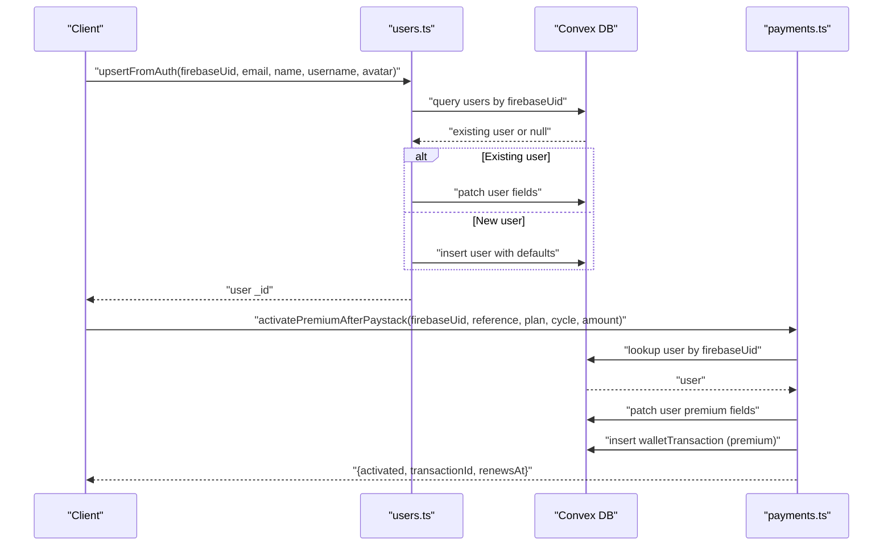

**Diagram sources**
- [users.ts](file://convex/users.ts)
- [payments.ts](file://convex/payments.ts)

**Section sources**
- [users.ts](file://convex/users.ts)
- [payments.ts](file://convex/payments.ts)
- [schema.ts](file://convex/schema.ts)

### Creators and Creator Applications
- Creators link to users via userId and maintain profiles, categories, follower counts, and support toggles.
- Creator applications manage access requests with status tracking and admin feedback.
- On approval, users’ roles and creator profiles are updated, and creator records are created or patched.

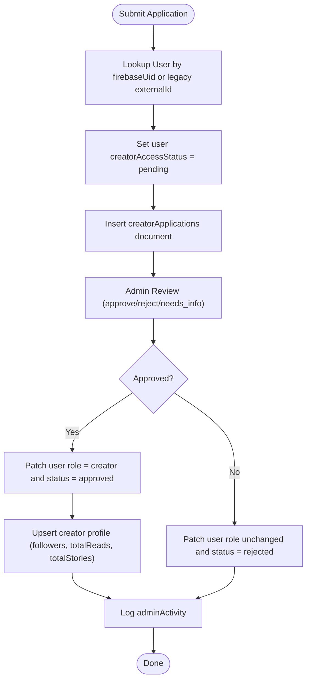

**Diagram sources**
- [applications.ts](file://convex/applications.ts)
- [users.ts](file://convex/users.ts)
- [creators.ts](file://convex/creators.ts)

**Section sources**
- [applications.ts](file://convex/applications.ts)
- [creators.ts](file://convex/creators.ts)
- [users.ts](file://convex/users.ts)

### Stories and Ownership Hierarchy
- Stories are owned by creators and indexed by creatorId, creatorUsername, status, and featured flag.
- Stories track views, saves, episodes, and content metadata.
- Publishing transitions status from draft to published.

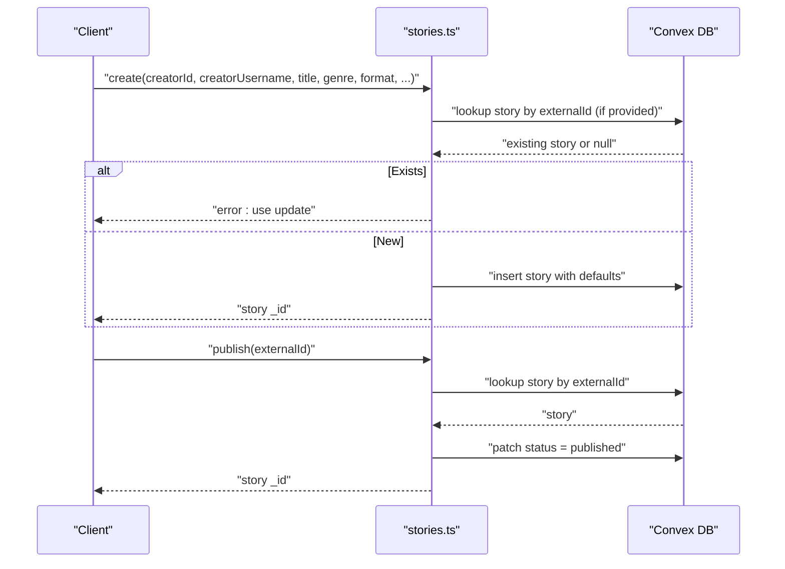

**Diagram sources**
- [stories.ts](file://convex/stories.ts)
- [schema.ts](file://convex/schema.ts)

**Section sources**
- [stories.ts](file://convex/stories.ts)
- [schema.ts](file://convex/schema.ts)

### Chapters and Reading Flow
- Chapters are referenced by comments and reading history.
- Unlocking chapters debits user wallet and records a transaction.
- Reading history tracks per-user progress per story/chapter.

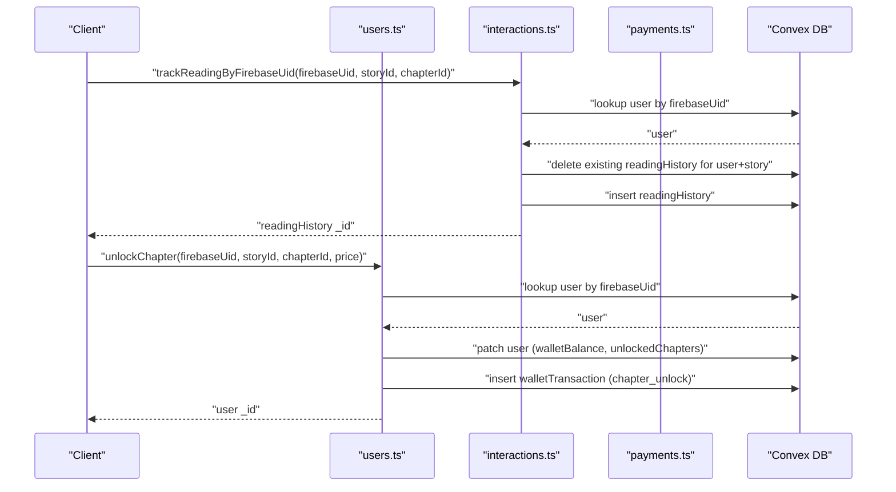

**Diagram sources**
- [interactions.ts](file://convex/interactions.ts)
- [users.ts](file://convex/users.ts)
- [payments.ts](file://convex/payments.ts)

**Section sources**
- [interactions.ts](file://convex/interactions.ts)
- [users.ts](file://convex/users.ts)
- [payments.ts](file://convex/payments.ts)

### Comments and Community
- Comments are hierarchical with optional chapter scoping.
- Indexes support listing by story, story+chapter, and parentCommentId.
- Likes are tracked per comment.

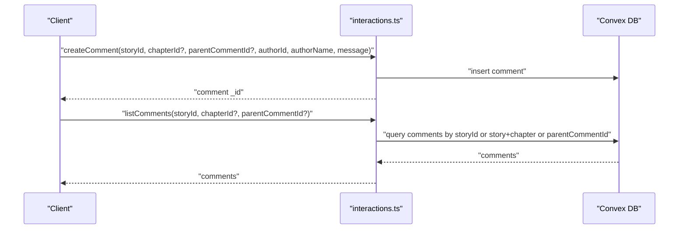

**Diagram sources**
- [interactions.ts](file://convex/interactions.ts)
- [schema.ts](file://convex/schema.ts)

**Section sources**
- [interactions.ts](file://convex/interactions.ts)
- [schema.ts](file://convex/schema.ts)

### Monetization: Wallet Transactions and Premium
- Wallet transactions capture all monetary events: top-ups, chapter unlocks, creator support, premium, refunds.
- Premium activation updates user fields and inserts a transaction.
- Payments module integrates with Paystack and deduplicates by reference.

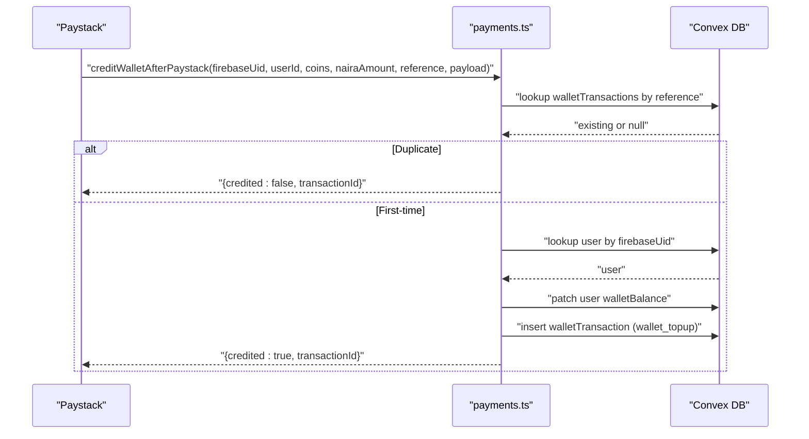

**Diagram sources**
- [payments.ts](file://convex/payments.ts)

**Section sources**
- [payments.ts](file://convex/payments.ts)
- [schema.ts](file://convex/schema.ts)

### Advertising Revenue and Creator Earnings
- Ad campaigns are filtered by status and placement; events are scored and aggregated.
- Revenue splits between creators and platform; monthly summaries are maintained.

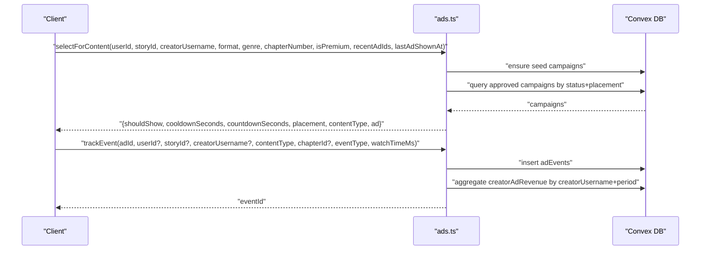

**Diagram sources**
- [ads.ts](file://convex/ads.ts)

**Section sources**
- [ads.ts](file://convex/ads.ts)
- [schema.ts](file://convex/schema.ts)

### Administration and Moderation
- Admins can view platform overview, analytics, and manage reports.
- Moderators handle content reports and platform settings.
- Fraud detection scans engagement events and logs suspicious activity.

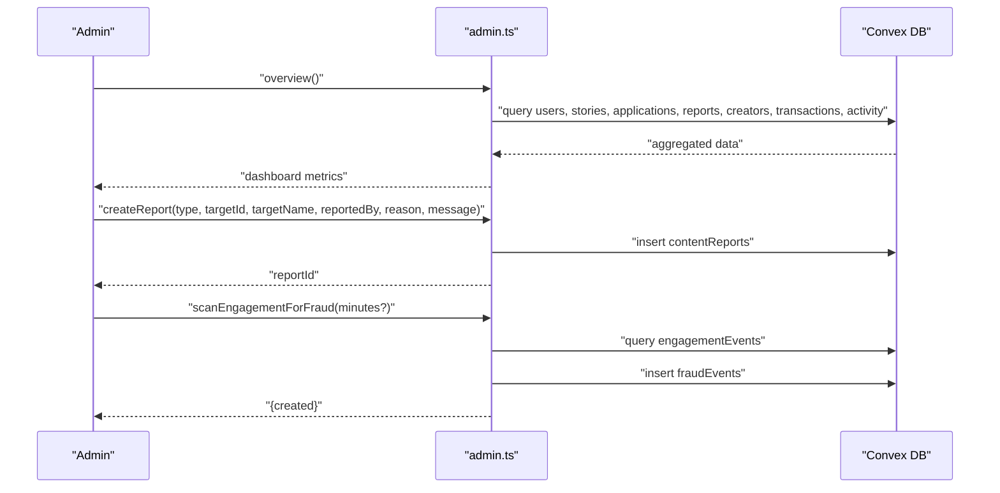

**Diagram sources**
- [admin.ts](file://convex/admin.ts)

**Section sources**
- [admin.ts](file://convex/admin.ts)
- [schema.ts](file://convex/schema.ts)

### Gamification and User Engagement
- Engagement events are recorded and used to award XP, Lemon Coins, and streak protection.
- Weekly spins draw from weighted inventory and update user currencies.

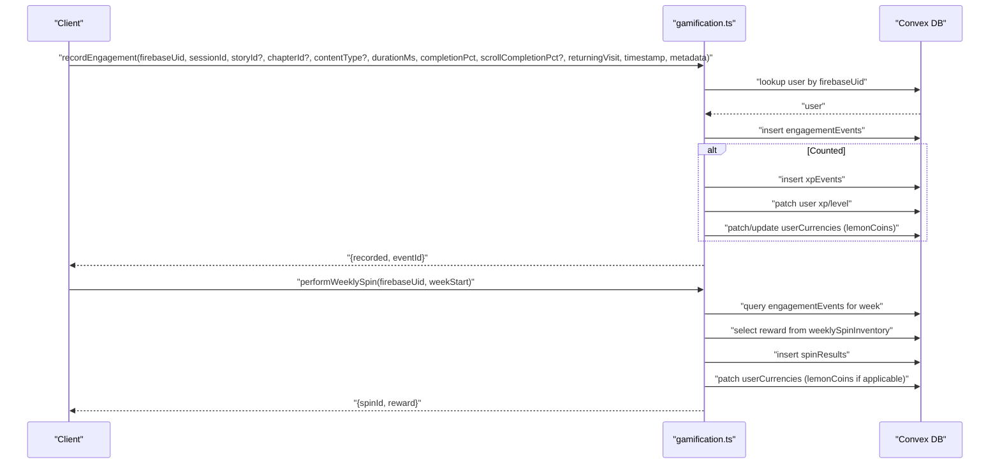

**Diagram sources**
- [gamification.ts](file://convex/gamification.ts)

**Section sources**
- [gamification.ts](file://convex/gamification.ts)
- [schema.ts](file://convex/schema.ts)

## Dependency Analysis
This section maps dependencies among modules and tables to understand control flow and coupling.

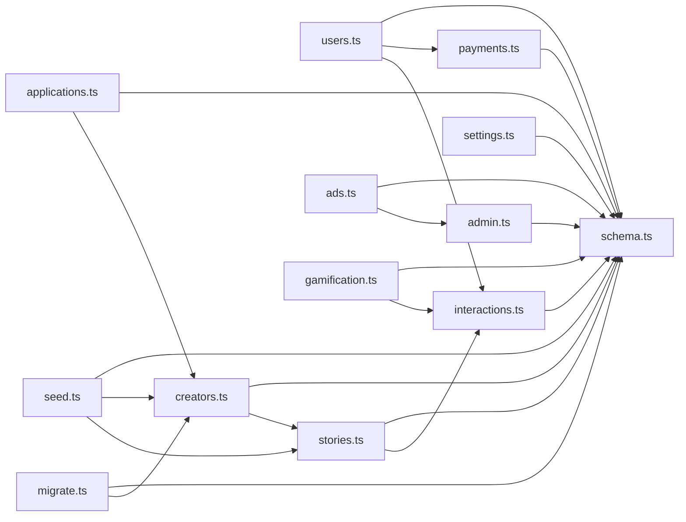

**Diagram sources**
- [schema.ts](file://convex/schema.ts)
- [users.ts](file://convex/users.ts)
- [creators.ts](file://convex/creators.ts)
- [stories.ts](file://convex/stories.ts)
- [interactions.ts](file://convex/interactions.ts)
- [payments.ts](file://convex/payments.ts)
- [ads.ts](file://convex/ads.ts)
- [admin.ts](file://convex/admin.ts)
- [gamification.ts](file://convex/gamification.ts)
- [applications.ts](file://convex/applications.ts)
- [settings.ts](file://convex/settings.ts)
- [seed.ts](file://convex/seed.ts)
- [migrate.ts](file://convex/migrate.ts)

**Section sources**
- [schema.ts](file://convex/schema.ts)
- [users.ts](file://convex/users.ts)
- [creators.ts](file://convex/creators.ts)
- [stories.ts](file://convex/stories.ts)
- [interactions.ts](file://convex/interactions.ts)
- [payments.ts](file://convex/payments.ts)
- [ads.ts](file://convex/ads.ts)
- [admin.ts](file://convex/admin.ts)
- [gamification.ts](file://convex/gamification.ts)
- [applications.ts](file://convex/applications.ts)
- [settings.ts](file://convex/settings.ts)
- [seed.ts](file://convex/seed.ts)
- [migrate.ts](file://convex/migrate.ts)

## Performance Considerations
- Indexes are strategically placed to optimize frequent queries:
  - Users: by_externalId, by_firebaseUid, by_email, by_username, by_role.
  - Creators: by_externalId, by_userId, by_username.
  - Stories: by_externalId, by_creatorId, by_creatorUsername, by_status, by_featured.
  - Wallet Transactions: by_userId, by_reference, by_status.
  - Reading History: by_userId, by_user_story.
  - Comments: by_story, by_story_chapter, by_parentCommentId.
  - Moderators: by_email.
  - Ad Campaigns: by_status, by_placement, by_status_and_placement.
  - Ad Events: by_adId, by_creatorUsername, by_storyId, by_eventType.
  - Creator Ad Revenue: by_creatorUsername, by_creator_and_period.
  - Gamification: by_user, by_session, by_active.
- Composite indexes reduce join costs for multi-field filters.
- Timestamp fields enable efficient time-series analytics and audits.

[No sources needed since this section provides general guidance]

## Troubleshooting Guide
- Username conflicts and change intervals:
  - Users can change usernames once every 90 days; duplicates are prevented.
- Insufficient balance:
  - Unlocking chapters requires sufficient wallet balance.
- Duplicate payment references:
  - Premium and wallet top-up handlers check references to avoid duplication.
- Fraud detection:
  - Engagement anomalies are logged as fraud events for manual review.
- Category normalization:
  - Creator category migration ensures consistent single-string values.

**Section sources**
- [users.ts](file://convex/users.ts)
- [payments.ts](file://convex/payments.ts)
- [admin.ts](file://convex/admin.ts)
- [migrate.ts](file://convex/migrate.ts)

## Conclusion
The Lemonade schema establishes a robust, indexed, and auditable data model that supports a complete creator economy: identity and roles, content ownership, community interactions, monetization, advertising, administration, and gamification. The indexing strategy and temporal fields enable efficient queries and comprehensive analytics, while the module-level logic enforces business rules and maintains data integrity.