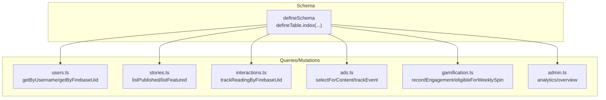
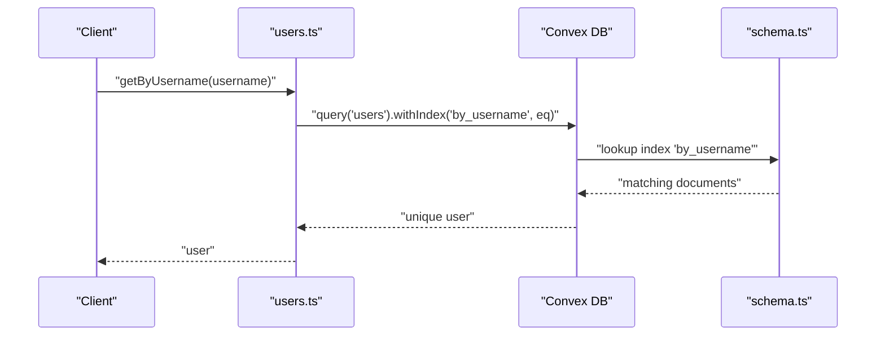
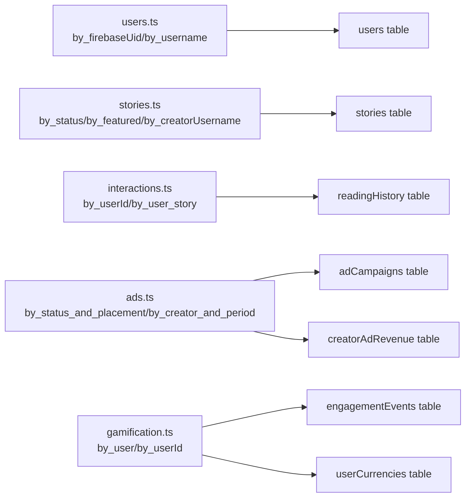

# Indexing Strategy

<cite>
**Referenced Files in This Document**
- [schema.ts](file://convex/schema.ts)
- [users.ts](file://convex/users.ts)
- [stories.ts](file://convex/stories.ts)
- [interactions.ts](file://convex/interactions.ts)
- [ads.ts](file://convex/ads.ts)
- [admin.ts](file://convex/admin.ts)
- [gamification.ts](file://convex/gamification.ts)
- [hot-path-rules.md](file://.agents/skills/convex-performance-audit/references/hot-path-rules.md)
</cite>

## Table of Contents
1. [Introduction](#introduction)
2. [Project Structure](#project-structure)
3. [Core Components](#core-components)
4. [Architecture Overview](#architecture-overview)
5. [Detailed Component Analysis](#detailed-component-analysis)
6. [Dependency Analysis](#dependency-analysis)
7. [Performance Considerations](#performance-considerations)
8. [Troubleshooting Guide](#troubleshooting-guide)
9. [Conclusion](#conclusion)

## Introduction
This document explains the database indexing strategy used across the Lemonade schema. It catalogs all indexes defined in the schema, explains the rationale behind each index, and demonstrates how they support common query patterns such as user authentication, content discovery, story search, notifications retrieval, and administrative filtering. It also covers performance implications of different index types, trade-offs between storage overhead and query performance, and guidance for adding new indexes based on observed query patterns and monitoring.

## Project Structure
The indexing strategy is defined centrally in the schema and consumed by query/mutation functions across modules. The schema defines tables and indexes; the modules issue queries using `.withIndex()` to leverage those indexes.

**Diagram sources**
- [schema.ts:24-494](file://convex/schema.ts#L24-L494)
- [users.ts:22-90](file://convex/users.ts#L22-L90)
- [stories.ts:6-44](file://convex/stories.ts#L6-L44)
- [interactions.ts:74-109](file://convex/interactions.ts#L74-L109)
- [ads.ts:105-164](file://convex/ads.ts#L105-L164)
- [gamification.ts:14-145](file://convex/gamification.ts#L14-L145)
- [admin.ts:31-127](file://convex/admin.ts#L31-L127)

**Section sources**
- [schema.ts:24-494](file://convex/schema.ts#L24-L494)

## Core Components
This section enumerates all indexes defined in the schema and summarizes their purpose and typical query patterns.

- Users table
  - Single-field indexes
    - by_externalId: supports lookup by external identifier
    - by_firebaseUid: supports authentication and profile lookups by Firebase UID
    - by_email: supports email-based lookups
    - by_username: supports username-based lookups and toggles (follow/save)
    - by_role: supports administrative filtering by role
  - Typical queries: user creation/update by Firebase UID, profile retrieval, role/status updates, username change validation, notifications retrieval by user

- Creators table
  - Single-field indexes
    - by_externalId
    - by_userId
    - by_username
  - Typical queries: creator profile retrieval, creator application linking

- Stories table
  - Single-field indexes
    - by_externalId
    - by_creatorId
    - by_creatorUsername
    - by_status
    - by_featured
  - Typical queries: list published stories, list featured stories, get story by external ID, list stories by creator

- Creator Applications table
  - Single-field indexes
    - by_userId
    - by_status
  - Typical queries: list applications by user, list applications by status

- Content Reports table
  - Single-field indexes
    - by_status
    - by_targetId
  - Typical queries: list reports by status, list reports by target

- Admin Activity table
  - Single-field index
    - by_adminEmail
  - Typical queries: list admin activity by admin email

- Moderators table
  - Single-field index
    - by_email
  - Typical queries: moderator lookups by email

- Wallet Transactions table
  - Single-field indexes
    - by_userId
    - by_reference
    - by_status
  - Typical queries: list transactions by user, reference-based reconciliation, status filtering

- Reading History table
  - Single-field indexes
    - by_userId
  - Composite index
    - by_user_story: supports efficient per-user story history and replacement semantics
  - Typical queries: list reading history by user, track reading with replace-if-exists semantics

- Notifications table
  - Single-field index
    - by_userId
  - Typical queries: list notifications by user

- Comments table
  - Single-field indexes
    - by_story
    - by_story_chapter
    - by_parentCommentId
  - Typical queries: list comments by story, by chapter, by parent comment

- Ad Campaigns table
  - Single-field indexes
    - by_status
    - by_placement
  - Composite index
    - by_status_and_placement: supports multi-dimensional filtering for ad selection
  - Typical queries: list campaigns by status, select campaigns by status and placement

- Ad Events table
  - Single-field indexes
    - by_adId
    - by_creatorUsername
    - by_storyId
    - by_eventType
  - Typical queries: list events by ad, creator, story, or event type

- Creator Ad Revenue table
  - Single-field indexes
    - by_creatorUsername
  - Composite index
    - by_creator_and_period: supports per-creator, per-month aggregation
  - Typical queries: creator summary, admin summary

- Weekly Spin Inventory table
  - Single-field index
    - by_active
  - Typical queries: list active spin rewards

- Engagement Events table
  - Single-field indexes
    - by_user
    - by_session
  - Typical queries: user engagement analytics, session-based metrics

- XP Events table
  - Single-field index
    - by_user
  - Typical queries: user XP history

- Leaderboards Snapshots table
  - Composite index
    - by_period_and_type: supports multi-dimensional filtering for leaderboards
  - Typical queries: leaderboard snapshots by period and type

- Creator Quests table
  - Single-field indexes
    - by_creator
    - by_active
  - Typical queries: quests by creator, active quests

- Reward Inventory table
  - Single-field index
    - by_rewardId
  - Typical queries: reward inventory lookup

- Fraud Events table
  - Single-field index
    - by_user
  - Typical queries: fraud detection by user

**Section sources**
- [schema.ts:25-494](file://convex/schema.ts#L25-L494)

## Architecture Overview
The indexing architecture follows a clear separation of concerns:
- Schema defines indexes aligned with query patterns
- Queries use .withIndex() to push filtering to storage
- Mutations update data and trigger reactive invalidations; indexes help minimize read amplification

**Diagram sources**
- [users.ts:22-30](file://convex/users.ts#L22-L30)
- [schema.ts:63-67](file://convex/schema.ts#L63-L67)

**Section sources**
- [users.ts:22-30](file://convex/users.ts#L22-L30)
- [schema.ts:25-494](file://convex/schema.ts#L25-L494)

## Detailed Component Analysis

### Users Indexes
- by_externalId: supports external identity lookups
- by_firebaseUid: central to authentication and profile retrieval
- by_email: supports email-based lookups
- by_username: supports username-based lookups and toggles (follow/save)
- by_role: supports administrative filtering

Rationale and usage:
- Authentication flows rely on by_firebaseUid for fast user resolution
- Username-based operations (toggle follow/save) rely on by_username
- Administrative dashboards can filter by role efficiently

Performance characteristics:
- Single-field indexes are compact and fast for equality predicates
- Write cost increases linearly with index count; however, reads are O(log N) seek plus collection

Common query patterns:
- Get user by username
- Upsert user from auth using firebaseUid
- Update role/status by username
- Retrieve user’s notifications/history/transactions by user

**Section sources**
- [schema.ts:63-67](file://convex/schema.ts#L63-L67)
- [users.ts:22-90](file://convex/users.ts#L22-L90)

### Stories Indexes
- by_externalId: supports content discovery by external identifiers
- by_creatorId/by_creatorUsername: supports creator-centric browsing
- by_status: supports listing published/featured content
- by_featured: supports featured content discovery

Rationale and usage:
- List published stories by status
- List featured stories by flag
- Get story by external ID for content management
- Filter by creator username for creator dashboards

Performance characteristics:
- Equality filters on status and boolean flags are efficient with single-field indexes
- Composite indexes are not used here because the query patterns are equality-only

Common query patterns:
- List published stories
- List featured stories
- Get story by external ID
- List stories by creator username

**Section sources**
- [schema.ts:121-125](file://convex/schema.ts#L121-L125)
- [stories.ts:6-44](file://convex/stories.ts#L6-L44)

### Reading History Indexes
- by_userId: supports listing a user’s reading history
- by_user_story (composite): supports per-user story history and replace-if-exists semantics

Rationale and usage:
- Track reading by user/story/chapter
- Replace existing history entries for the same user-story pair

Performance characteristics:
- Composite index enables efficient equality on both fields
- Write cost increases with composite index cardinality; however, it avoids scanning and deletion for replacement

Common query patterns:
- Track reading by Firebase UID with replace-if-exists
- List reading history by user

**Section sources**
- [schema.ts:231-232](file://convex/schema.ts#L231-L232)
- [interactions.ts:74-109](file://convex/interactions.ts#L74-L109)

### Notifications Indexes
- by_userId: supports retrieving a user’s notifications

Rationale and usage:
- Efficiently list notifications per user for the UI

Performance characteristics:
- Single-field index is optimal for equality on user ID

Common query patterns:
- List notifications by user ID

**Section sources**
- [schema.ts:250](file://convex/schema.ts#L250)
- [users.ts:149-181](file://convex/users.ts#L149-L181)

### Comments Indexes
- by_story: supports listing comments by story
- by_story_chapter: supports listing comments by story/chapter
- by_parentCommentId: supports threaded comments and replies

Rationale and usage:
- Threaded discussions require parent-child filtering
- Chapter-level comments enable granular navigation

Performance characteristics:
- Composite index by_story_chapter optimizes chapter-scoped queries
- Single-field indexes are efficient for equality filters

Common query patterns:
- List comments by story or chapter
- List replies by parent comment ID
- Count root comments per story/chapter

**Section sources**
- [schema.ts:267-269](file://convex/schema.ts#L267-L269)
- [interactions.ts:140-194](file://convex/interactions.ts#L140-L194)

### Ads Indexes
- by_status: supports listing campaigns by status
- by_placement: supports filtering by ad placement
- by_status_and_placement (composite): supports multi-dimensional filtering for ad selection

Rationale and usage:
- Ad selection requires filtering by status and placement
- Reporting and summaries benefit from per-creator and per-period aggregations

Performance characteristics:
- Composite index by_status_and_placement reduces scans for ad selection
- Additional composite index by_creator_and_period supports efficient per-creator, per-month revenue aggregation

Common query patterns:
- Select campaigns for content by status and placement
- Track ad events and update creator revenue per period
- Creator and admin summaries

**Section sources**
- [schema.ts:313-315](file://convex/schema.ts#L313-L315)
- [ads.ts:105-164](file://convex/ads.ts#L105-L164)
- [ads.ts:205-236](file://convex/ads.ts#L205-L236)

### Composite Indexes: Multi-Dimensional Filtering
Composite indexes enable efficient multi-dimensional filtering and sorting:
- by_user_story (readingHistory): equality on user and story for per-user story history
- by_status_and_placement (adCampaigns): equality on status and placement for ad selection
- by_creator_and_period (creatorAdRevenue): equality on creator and period for per-creator, per-month aggregation
- by_period_and_type (leaderboardsSnapshots): equality on period and type for leaderboard queries

Rationale:
- Reduce scans by pushing multiple predicates into the index
- Enable targeted queries without post-scan filtering

Trade-offs:
- Storage overhead increases with index cardinality
- Write amplification grows proportionally to the number of indexes maintained
- Migration safety: when adding indexes on partially backfilled fields, verify correctness across old and new documents

**Section sources**
- [schema.ts:232](file://convex/schema.ts#L232)
- [schema.ts:315](file://convex/schema.ts#L315)
- [schema.ts:352](file://convex/schema.ts#L352)
- [schema.ts:457](file://convex/schema.ts#L457)
- [hot-path-rules.md:98-124](file://.agents/skills/convex-performance-audit/references/hot-path-rules.md#L98-L124)

### High-Frequency Query Patterns and Indexing
- User lookups
  - by_firebaseUid (users)
  - by_username (users)
  - by_email (users)
  - by_externalId (users)
  - Rationale: Authentication, profile retrieval, and admin operations
- Story searches
  - by_status (stories)
  - by_featured (stories)
  - by_creatorUsername (stories)
  - by_externalId (stories)
  - Rationale: Content discovery, creator dashboards, and content management
- Notification retrieval
  - by_userId (notifications)
  - Rationale: Per-user notification feeds
- Reporting queries
  - by_status_and_placement (adCampaigns)
  - by_creator_and_period (creatorAdRevenue)
  - by_user (engagementEvents)
  - by_userId (userCurrencies, userStreaks)
  - Rationale: Ad selection, creator analytics, user engagement, and currency/streak tracking

Performance implications:
- Single-field indexes: low storage overhead, fast equality lookups
- Composite indexes: reduced scans for multi-predicate queries, higher storage and write costs
- Trade-offs: storage vs. read performance; monitor query patterns and adjust accordingly

**Section sources**
- [users.ts:22-90](file://convex/users.ts#L22-L90)
- [stories.ts:6-44](file://convex/stories.ts#L6-L44)
- [ads.ts:105-164](file://convex/ads.ts#L105-L164)
- [interactions.ts:74-109](file://convex/interactions.ts#L74-L109)
- [gamification.ts:14-145](file://convex/gamification.ts#L14-L145)
- [admin.ts:31-127](file://convex/admin.ts#L31-L127)

## Dependency Analysis
Indexes are consumed by query functions across modules. The following diagram shows representative dependencies:

**Diagram sources**
- [users.ts:22-90](file://convex/users.ts#L22-L90)
- [stories.ts:6-44](file://convex/stories.ts#L6-L44)
- [interactions.ts:74-109](file://convex/interactions.ts#L74-L109)
- [ads.ts:105-164](file://convex/ads.ts#L105-L164)
- [gamification.ts:14-145](file://convex/gamification.ts#L14-L145)

**Section sources**
- [users.ts:22-90](file://convex/users.ts#L22-L90)
- [stories.ts:6-44](file://convex/stories.ts#L6-L44)
- [interactions.ts:74-109](file://convex/interactions.ts#L74-L109)
- [ads.ts:105-164](file://convex/ads.ts#L105-L164)
- [gamification.ts:14-145](file://convex/gamification.ts#L14-L145)

## Performance Considerations
- Prefer .withIndex() over post-scan filtering to avoid unnecessary reads
- Composite indexes reduce scans for multi-predicate queries but increase storage and write costs
- Monitor hot-path functions and ensure sibling functions are audited for shared patterns
- Migration safety: verify correctness when rolling out indexes on partially backfilled fields

Guidance:
- Add indexes when:
  - A query pattern becomes frequent and currently relies on scans or post-scan filtering
  - The query benefits from pushing filters to storage
  - Monitoring indicates high latency or increased read volume for a given operation
- Remove or consolidate indexes when:
  - A query pattern is rarely used
  - Multiple single-field indexes can be replaced by a composite index that covers the dominant query shape
  - Storage overhead outweighs query performance gains

**Section sources**
- [hot-path-rules.md:44-96](file://.agents/skills/convex-performance-audit/references/hot-path-rules.md#L44-L96)
- [hot-path-rules.md:98-124](file://.agents/skills/convex-performance-audit/references/hot-path-rules.md#L98-L124)

## Troubleshooting Guide
- Symptom: Slow queries on lists filtered by status or placement
  - Check if the query uses .withIndex("by_status"|"by_placement"|"by_status_and_placement")
  - Confirm the index exists and is used by the query
- Symptom: Ad selection returns no inventory
  - Verify campaign status and placement filters align with the composite index
- Symptom: Creator revenue aggregation is slow
  - Ensure by_creator_and_period is used for per-creator, per-period queries
- Symptom: Username change fails due to duplicates
  - Confirm by_username is used for uniqueness checks before updates
- Symptom: Reading history replacement is slow
  - Confirm by_user_story composite index is used for replace-if-exists logic

**Section sources**
- [ads.ts:105-164](file://convex/ads.ts#L105-L164)
- [ads.ts:205-236](file://convex/ads.ts#L205-L236)
- [interactions.ts:74-109](file://convex/interactions.ts#L74-L109)
- [users.ts:222-235](file://convex/users.ts#L222-L235)

## Conclusion
The Lemonade schema employs a deliberate indexing strategy that pushes filtering to storage via .withIndex(), reducing read amplification and improving response times for high-frequency operations. Single-field indexes handle equality predicates efficiently, while composite indexes enable multi-dimensional filtering for complex queries. The strategy balances storage overhead against query performance and is guided by performance auditing and migration safety practices. As usage evolves, continue to monitor query patterns and adjust indexes accordingly to maintain optimal performance.