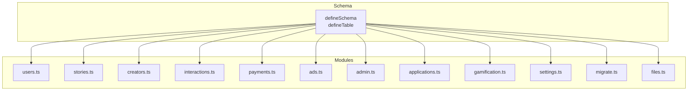
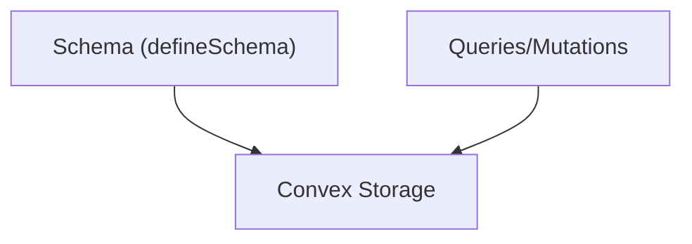
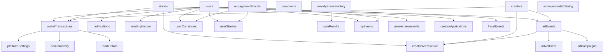

# Table Definitions

<cite>
**Referenced Files in This Document**
- [schema.ts](file://convex/schema.ts)
- [users.ts](file://convex/users.ts)
- [stories.ts](file://convex/stories.ts)
- [creators.ts](file://convex/creators.ts)
- [interactions.ts](file://convex/interactions.ts)
- [payments.ts](file://convex/payments.ts)
- [ads.ts](file://convex/ads.ts)
- [admin.ts](file://convex/admin.ts)
- [applications.ts](file://convex/applications.ts)
- [gamification.ts](file://convex/gamification.ts)
- [settings.ts](file://convex/settings.ts)
- [migrate.ts](file://convex/migrate.ts)
- [files.ts](file://convex/files.ts)
</cite>

## Table of Contents
1. [Introduction](#introduction)
2. [Project Structure](#project-structure)
3. [Core Components](#core-components)
4. [Architecture Overview](#architecture-overview)
5. [Detailed Component Analysis](#detailed-component-analysis)
6. [Dependency Analysis](#dependency-analysis)
7. [Performance Considerations](#performance-considerations)
8. [Troubleshooting Guide](#troubleshooting-guide)
9. [Conclusion](#conclusion)
10. [Appendices](#appendices)

## Introduction
This document provides comprehensive table definitions for the Lemonade schema, detailing the purpose, fields, data types, validation rules, and constraints for all 40+ tables. It focuses on critical tables such as users, stories, creators, walletTransactions, notifications, comments, and gamification-related tables. It also explains the timestamp pattern (createdAt, updatedAt), standardized user identifiers (externalId, firebaseUid), and the implications of data type choices for storage, querying, and performance.

## Project Structure
The schema is defined centrally and consumed by Convex queries and mutations. Key modules include:
- Schema definition and indices
- Domain-specific modules for users, stories, creators, interactions, payments, ads, admin, applications, gamification, settings, migrations, and files

**Diagram sources**
- [schema.ts:24-494](file://convex/schema.ts#L24-L494)
- [users.ts:1-360](file://convex/users.ts#L1-L360)
- [stories.ts:1-180](file://convex/stories.ts#L1-L180)
- [creators.ts:1-87](file://convex/creators.ts#L1-L87)
- [interactions.ts:1-267](file://convex/interactions.ts#L1-L267)
- [payments.ts:1-291](file://convex/payments.ts#L1-L291)
- [ads.ts:1-360](file://convex/ads.ts#L1-L360)
- [admin.ts:1-364](file://convex/admin.ts#L1-L364)
- [applications.ts:1-224](file://convex/applications.ts#L1-L224)
- [gamification.ts:1-331](file://convex/gamification.ts#L1-L331)
- [settings.ts:1-45](file://convex/settings.ts#L1-L45)
- [migrate.ts:1-36](file://convex/migrate.ts#L1-L36)
- [files.ts:1-21](file://convex/files.ts#L1-L21)

**Section sources**
- [schema.ts:24-494](file://convex/schema.ts#L24-L494)

## Core Components
This section summarizes the schema’s core tables and their primary roles:
- users: User profiles, roles, premium status, wallet, XP/level, and preferences
- stories: Story metadata, status, counts, and media
- creators: Creator profiles, categories, follower counts, and support settings
- walletTransactions: Financial transactions (top-ups, unlocks, support, premium)
- notifications: User-centric notifications with types and read state
- comments: Hierarchical comments with likes/dislikes and moderation hooks
- Platform and operational tables: contentReports, adminActivity, moderators, platformSettings
- Ads and revenue: advertisers, adCampaigns, adEvents, creatorAdRevenue
- Gamification: userCurrencies, userStreaks, weeklySpinInventory, spinResults, engagementEvents, xpEvents, achievementsCatalog, userAchievements, leaderboardsSnapshots, creatorQuests, rewardInventory
- Operational: readingHistory, fraudEvents

Validation patterns:
- Union types for enumerated fields (e.g., role, premiumStatus, status, type)
- Optional fields for nullable or conditionally present data
- Arrays for collections (e.g., followedCreators, savedStories, tags)
- Timestamps stored as ISO strings for consistency

**Section sources**
- [schema.ts:24-494](file://convex/schema.ts#L24-L494)

## Architecture Overview
The schema enforces strong typing and indexing via Convex’s defineSchema/defineTable. Queries and mutations in domain modules enforce business logic and maintain referential integrity.

**Diagram sources**
- [schema.ts:1-494](file://convex/schema.ts#L1-L494)

## Detailed Component Analysis

### users
Purpose:
- Store reader and creator identities, roles, premium subscriptions, wallet balance, XP/level, and preferences.

Key fields and types:
- externalId: optional string
- firebaseUid: optional string
- email: optional string
- name: string
- username: string
- usernameUpdatedAt: optional string
- usernameChangeLockedAt: optional string
- bio: optional string
- avatar: optional string
- banner: optional string
- role: union of guest, reader, creator, admin
- creatorAccessStatus: union of none, pending, needs_info, approved, rejected
- premiumStatus: union of free, trial, premium, expired
- premiumPlan: optional union of premium, patron
- premiumBillingCycle: optional union of monthly, yearly
- premiumStartedAt/premiumRenewsAt/premiumCancelledAt: optional strings
- premiumCancelAtPeriodEnd: optional boolean
- premiumProvider: optional string
- premiumReference: optional string
- walletBalance: number
- xp: optional number
- level: optional number
- followedCreators: array of strings
- savedStories: array of strings
- unlockedChapters: array of strings
- badges: array of strings
- settings: optional any
- status: union of active, suspended
- createdAt/updatedAt: strings (ISO)

Constraints and validation:
- Indexes: by_externalId, by_firebaseUid, by_email, by_username, by_role
- Business logic enforced by mutations (e.g., username normalization and uniqueness checks, profile updates, role/status changes, wallet balance adjustments)

Timestamp pattern:
- createdAt and updatedAt are ISO strings set on insert/update

User identifiers:
- externalId and firebaseUid are optional but commonly used for identity mapping and lookups

Optional fields and nullability:
- Many fields are optional to support gradual onboarding and optional features

Data type implications:
- Strings for identifiers and timestamps enable efficient indexing and sorting
- Numbers for balances and XP enable arithmetic operations
- Arrays enable scalable collection storage

**Section sources**
- [schema.ts:25-67](file://convex/schema.ts#L25-L67)
- [users.ts:9-13](file://convex/users.ts#L9-L13)
- [users.ts:183-242](file://convex/users.ts#L183-L242)
- [users.ts:42-90](file://convex/users.ts#L42-L90)

### stories
Purpose:
- Represent story metadata, counts, tags, and lifecycle status.

Key fields and types:
- externalId: optional string
- creatorId: string
- creatorUsername: string
- title: string
- genre: string
- format: string
- rating: number
- views: number
- saves: number
- episodes: number
- synopsis: string
- coverImage: optional string
- bannerImage: optional string
- tags: array of strings
- isOriginal: boolean
- isFeatured: boolean
- status: union of draft, published, hidden, archived
- media: optional any
- createdAt/updatedAt: strings

Constraints and validation:
- Indexes: by_externalId, by_creatorId, by_creatorUsername, by_status, by_featured
- Business logic: creation defaults (rating, views, saves, episodes, isFeatured), publishing rules, view increments

Timestamp pattern:
- createdAt and updatedAt are ISO strings

Optional fields and nullability:
- Cover and banner images are optional; media is optional structured data

Data type implications:
- Tags as arrays enable flexible filtering and faceting
- Numeric counters enable fast aggregations

**Section sources**
- [schema.ts:95-125](file://convex/schema.ts#L95-L125)
- [stories.ts:46-104](file://convex/stories.ts#L46-L104)
- [stories.ts:106-144](file://convex/stories.ts#L106-L144)
- [stories.ts:146-180](file://convex/stories.ts#L146-L180)

### creators
Purpose:
- Store creator profiles, categories, follower metrics, and support settings.

Key fields and types:
- externalId: optional string
- userId: optional string
- name: string
- username: string
- avatar: string
- followers: number
- bio: string
- category: union(array of strings, Artist, Writer, Studio)
- location: optional string
- totalReads: number
- totalStories: number
- dropsomethingUrl: optional string
- supportEnabled: boolean
- profile: optional any
- createdAt/updatedAt: strings

Constraints and validation:
- Indexes: by_externalId, by_userId, by_username
- Business logic: category normalization to array, follower adjustments, upsert behavior

Timestamp pattern:
- createdAt and updatedAt are ISO strings

Optional fields and nullability:
- Location, dropsomethingUrl, and profile are optional

Data type implications:
- Category union supports both scalar and array forms during migration and enrichment

**Section sources**
- [schema.ts:69-93](file://convex/schema.ts#L69-L93)
- [creators.ts:24-66](file://convex/creators.ts#L24-L66)
- [migrate.ts:7-35](file://convex/migrate.ts#L7-L35)

### walletTransactions
Purpose:
- Track financial events impacting user wallets and monetization.

Key fields and types:
- userId: string
- type: union of wallet_topup, chapter_unlock, creator_support, premium, refund
- amount: number
- currency: string
- status: union of pending, success, failed, refunded
- reference: string
- provider: optional string
- providerPayload: optional any
- metadata: optional any
- createdAt: string

Constraints and validation:
- Indexes: by_userId, by_reference, by_status
- Business logic: transaction recording, Paystack callbacks, premium activation, refund handling

Timestamp pattern:
- createdAt is an ISO string

Optional fields and nullability:
- Provider payload and metadata are optional structured data

Data type implications:
- Amounts as numbers enable precise accounting
- Reference enables idempotent reconciliation

**Section sources**
- [schema.ts:198-223](file://convex/schema.ts#L198-L223)
- [payments.ts:82-111](file://convex/payments.ts#L82-L111)
- [payments.ts:113-172](file://convex/payments.ts#L113-L172)
- [payments.ts:174-262](file://convex/payments.ts#L174-L262)

### notifications
Purpose:
- Deliver user-centric notifications with read state and links.

Key fields and types:
- userId: string
- type: union of follow, save, unlock, premium, support, update, wallet
- title: string
- message: string
- timestamp: string
- read: boolean
- link: optional string

Constraints and validation:
- Index: by_userId
- Business logic: creation with read=false and timestamp

Timestamp pattern:
- timestamp is an ISO string

Optional fields and nullability:
- Link is optional

Data type implications:
- Union type ensures consistent notification categorization

**Section sources**
- [schema.ts:234-250](file://convex/schema.ts#L234-L250)
- [users.ts:245-268](file://convex/users.ts#L245-L268)

### comments
Purpose:
- Support threaded comments with likes/dislikes and moderation.

Key fields and types:
- storyId: string
- chapterId: optional string
- parentCommentId: optional string
- authorId: string
- authorName: string
- authorAvatar: optional string
- message: string
- likesCount: number
- likedBy: array of strings
- dislikesCount: number
- dislikedBy: array of strings
- createdAt: string
- updatedAt: optional string

Constraints and validation:
- Indexes: by_story, by_story_chapter, by_parentCommentId
- Business logic: creation defaults, paging, toggling likes/dislikes, deletion with reply cascade

Timestamp pattern:
- createdAt is an ISO string; updatedAt is optional

Optional fields and nullability:
- ChapterId and parentCommentId enable hierarchical threading; authorAvatar is optional

Data type implications:
- Arrays for likedBy/dislikedBy enable lightweight voting without joins

**Section sources**
- [schema.ts:252-269](file://convex/schema.ts#L252-L269)
- [interactions.ts:111-138](file://convex/interactions.ts#L111-L138)
- [interactions.ts:196-227](file://convex/interactions.ts#L196-L227)
- [interactions.ts:230-252](file://convex/interactions.ts#L230-L252)

### Additional Core Tables

#### contentReports
Purpose:
- Track reported content with resolution status.

Key fields and types:
- type: union of story, chapter, user, comment
- targetId: string
- targetName: string
- reportedBy: string
- reason: string
- message: string
- status: union of open, reviewing, resolved, dismissed
- createdAt: string
- resolvedAt: optional string
- resolvedBy: optional string

Constraints and validation:
- Indexes: by_status, by_targetId
- Business logic: creation with open status, resolution updates

Timestamp pattern:
- createdAt is an ISO string; resolvedAt is optional

**Section sources**
- [schema.ts:151-174](file://convex/schema.ts#L151-L174)
- [admin.ts:186-223](file://convex/admin.ts#L186-L223)

#### adminActivity
Purpose:
- Log administrative actions with metadata.

Key fields and types:
- action: string
- adminEmail: string
- timestamp: string
- metadata: optional any

Constraints and validation:
- Index: by_adminEmail
- Business logic: logging with timestamp

Timestamp pattern:
- timestamp is an ISO string

**Section sources**
- [schema.ts:176-181](file://convex/schema.ts#L176-L181)
- [admin.ts:232-244](file://convex/admin.ts#L232-L244)

#### moderators
Purpose:
- Manage platform moderation staff.

Key fields and types:
- name: string
- email: string
- role: union of super_admin, moderator, content_reviewer, payment_reviewer
- permissions: array of strings
- status: union of active, disabled
- lastActive: string
- createdAt/updatedAt: strings

Constraints and validation:
- Index: by_email
- Business logic: status and role updates

Timestamp pattern:
- createdAt and updatedAt are ISO strings

**Section sources**
- [schema.ts:183-196](file://convex/schema.ts#L183-L196)

#### platformSettings
Purpose:
- Control global platform flags and announcements.

Key fields and types:
- showMockData: boolean
- maintenanceMode: boolean
- announcement: optional string
- updatedAt: string

Constraints and validation:
- Business logic: create-or-update with defaults

Timestamp pattern:
- updatedAt is an ISO string

**Section sources**
- [schema.ts:271-276](file://convex/schema.ts#L271-L276)
- [settings.ts:4-44](file://convex/settings.ts#L4-L44)

#### readingHistory
Purpose:
- Track user reading sessions.

Key fields and types:
- userId: string
- storyId: string
- chapterId: string
- timestamp: string

Constraints and validation:
- Indexes: by_userId, by_user_story
- Business logic: insertion with timestamp; replacement semantics on updates

Timestamp pattern:
- timestamp is an ISO string

**Section sources**
- [schema.ts:225-232](file://convex/schema.ts#L225-L232)
- [interactions.ts:74-109](file://convex/interactions.ts#L74-L109)

#### fraudEvents
Purpose:
- Detect suspicious engagement patterns.

Key fields and types:
- userId: optional string
- type: string
- description: string
- evidence: optional any
- score: optional number
- resolved: boolean
- createdAt: string
- resolvedAt: optional string
- reviewedBy: optional string

Constraints and validation:
- Index: by_user
- Business logic: scanning and flagging suspicious events

Timestamp pattern:
- createdAt is an ISO string; resolvedAt is optional

**Section sources**
- [schema.ts:483-493](file://convex/schema.ts#L483-L493)
- [admin.ts:312-347](file://convex/admin.ts#L312-L347)

### Ads and Revenue Tables

#### advertisers
Purpose:
- Manage advertising clients and budgets.

Key fields and types:
- name: string
- contactEmail: optional string
- status: union of active, paused, disabled
- budgetNaira: number
- spentNaira: number
- createdAt: string
- updatedAt: string

Constraints and validation:
- Index: by_status
- Business logic: budget/spending tracking

Timestamp pattern:
- createdAt and updatedAt are ISO strings

**Section sources**
- [schema.ts:278-286](file://convex/schema.ts#L278-L286)

#### adCampaigns
Purpose:
- Define ad placements, targeting, and scheduling.

Key fields and types:
- advertiserId: optional id("advertisers")
- title: string
- type: union of video, image, banner
- placement: union of chapter_preroll, movie_preroll, novel_midroll, sponsored_banner
- status: union of draft, pending, approved, paused, rejected
- mediaUrl: string
- clickUrl: optional string
- brandName: string
- headline: string
- description: optional string
- cpmNaira: number
- targetGenres: array of strings
- frequencyCapHours: number
- priority: number
- startsAt: optional string
- endsAt: optional string
- createdAt: string
- updatedAt: string

Constraints and validation:
- Indexes: by_status, by_placement, by_status_and_placement
- Business logic: campaign creation, status updates, selection for content gating

Timestamp pattern:
- createdAt and updatedAt are ISO strings

**Section sources**
- [schema.ts:288-315](file://convex/schema.ts#L288-L315)
- [ads.ts:321-345](file://convex/ads.ts#L321-L345)
- [ads.ts:347-359](file://convex/ads.ts#L347-L359)

#### adEvents
Purpose:
- Record ad exposure and engagement metrics.

Key fields and types:
- adId: id("adCampaigns")
- advertiserId: optional id("advertisers")
- userId: optional string
- storyId: optional string
- creatorUsername: optional string
- contentType: union of manga, manhwa, novel, movie, unknown
- chapterId: optional string
- eventType: union of impression, completed, skip, click
- watchTimeMs: number
- revenueNaira: number
- creatorShareNaira: number
- platformShareNaira: number
- createdAt: string

Constraints and validation:
- Indexes: by_adId, by_creatorUsername, by_storyId, by_eventType
- Business logic: event tracking, revenue split, creatorAdRevenue updates

Timestamp pattern:
- createdAt is an ISO string

**Section sources**
- [schema.ts:317-335](file://convex/schema.ts#L317-L335)
- [ads.ts:167-237](file://convex/ads.ts#L167-L237)

#### creatorAdRevenue
Purpose:
- Aggregate ad revenue per creator and period.

Key fields and types:
- creatorUsername: string
- storyId: optional string
- period: string (YYYY-MM)
- impressions: number
- completedViews: number
- skips: number
- clicks: number
- watchTimeMs: number
- grossRevenueNaira: number
- creatorRevenueNaira: number
- platformRevenueNaira: number
- updatedAt: string

Constraints and validation:
- Indexes: by_creatorUsername, by_creator_and_period
- Business logic: aggregation updates per event

Timestamp pattern:
- updatedAt is an ISO string

**Section sources**
- [schema.ts:337-352](file://convex/schema.ts#L337-L352)
- [ads.ts:203-233](file://convex/ads.ts#L203-L233)

### Gamification Tables

#### userCurrencies
Purpose:
- Track Lemon Coins and Golden Ink balances.

Key fields and types:
- userId: string
- lemonCoins: number
- goldenInk: number
- updatedAt: string

Constraints and validation:
- Index: by_userId
- Business logic: balance adjustments, initial creation

Timestamp pattern:
- updatedAt is an ISO string

**Section sources**
- [schema.ts:356-361](file://convex/schema.ts#L356-L361)
- [gamification.ts:94-112](file://convex/gamification.ts#L94-L112)
- [creatorQuests.ts:76-82](file://convex/creatorQuests.ts#L76-L82)

#### userStreaks
Purpose:
- Manage reading streaks and insurance.

Key fields and types:
- userId: string
- currentStreak: number
- lastActiveAt: optional string
- longestStreak: number
- protectedUntil: optional string
- insuranceUses: number
- updatedAt: string

Constraints and validation:
- Index: by_userId
- Business logic: streak updates, insurance usage

Timestamp pattern:
- updatedAt is an ISO string

**Section sources**
- [schema.ts:363-371](file://convex/schema.ts#L363-L371)
- [gamification.ts:234-286](file://convex/gamification.ts#L234-L286)

#### weeklySpinInventory
Purpose:
- Configure weekly reward pool with weights.

Key fields and types:
- rewardId: string
- type: union of airtime, data, cash, gift_card, bonus_spin, lemon_coins, cosmetic, badge
- amount: optional number
- metadata: optional any
- weight: number
- active: boolean
- createdAt: string
- updatedAt: string

Constraints and validation:
- Index: by_active
- Business logic: reward creation, updates, spin selection

Timestamp pattern:
- createdAt and updatedAt are ISO strings

**Section sources**
- [schema.ts:373-392](file://convex/schema.ts#L373-L392)
- [admin.ts:260-302](file://convex/admin.ts#L260-L302)

#### spinResults
Purpose:
- Record weekly spin outcomes and claims.

Key fields and types:
- userId: string
- weekStart: string (ISO week start)
- rewardId: optional string
- rewardType: string
- rewardValue: optional any
- awardedAt: string
- claimedAt: optional string
- status: union of awarded, claimed, expired
- metadata: optional any

Constraints and validation:
- Index: by_user_week
- Business logic: spin execution, immediate coin claims, expiration

Timestamp pattern:
- awardedAt and claimedAt are ISO strings

**Section sources**
- [schema.ts:394-404](file://convex/schema.ts#L394-L404)
- [gamification.ts:147-232](file://convex/gamification.ts#L147-L232)

#### engagementEvents
Purpose:
- Capture reading/session engagement metrics.

Key fields and types:
- userId: string
- sessionId: string
- storyId: optional string
- chapterId: optional string
- contentType: optional union of manga, novel, movie
- durationMs: number
- completionPct: number
- scrollCompletionPct: optional number
- sessionQuality: number
- returningVisit: boolean
- counted: boolean
- timestamp: string
- metadata: optional any

Constraints and validation:
- Indexes: by_user, by_session
- Business logic: event recording, counting thresholds, XP/coins awards

Timestamp pattern:
- timestamp is an ISO string

**Section sources**
- [schema.ts:406-420](file://convex/schema.ts#L406-L420)
- [gamification.ts:14-117](file://convex/gamification.ts#L14-L117)

#### xpEvents
Purpose:
- Track XP gains and reasons.

Key fields and types:
- userId: string
- amount: number
- reason: string
- source: optional string
- timestamp: string
- metadata: optional any

Constraints and validation:
- Index: by_user
- Business logic: XP accumulation and level progression

Timestamp pattern:
- timestamp is an ISO string

**Section sources**
- [schema.ts:422-429](file://convex/schema.ts#L422-L429)
- [gamification.ts:67-89](file://convex/gamification.ts#L67-L89)

#### achievementsCatalog and userAchievements
Purpose:
- Catalog and award achievements.

Key fields and types:
- achievementsCatalog:
  - achievementId: string
  - name: string
  - description: string
  - criteria: any
  - xpReward: number
  - coinReward: number
  - badgeId: optional string
  - icon: optional string
  - active: boolean
  - createdAt: string
  - updatedAt: string
- userAchievements:
  - userId: string
  - achievementId: string
  - awardedAt: string
  - metadata: optional any

Constraints and validation:
- Index: by_active (catalog)
- Index: by_user (userAchievements)
- Business logic: catalog activation, achievement claiming, XP/coins rewards

Timestamp pattern:
- createdAt and updatedAt are ISO strings; awardedAt is ISO string

**Section sources**
- [schema.ts:431-450](file://convex/schema.ts#L431-L450)
- [creatorQuests.ts:44-96](file://convex/creatorQuests.ts#L44-L96)

#### leaderboardsSnapshots
Purpose:
- Snapshot leaderboard entries.

Key fields and types:
- period: string
- type: union of xp, streak, coins
- entries: array of any
- createdAt: string

Constraints and validation:
- Index: by_period_and_type
- Business logic: periodic snapshots

Timestamp pattern:
- createdAt is an ISO string

**Section sources**
- [schema.ts:452-457](file://convex/schema.ts#L452-L457)

#### creatorQuests
Purpose:
- Define creator-driven quests.

Key fields and types:
- questId: string
- creatorId: string
- title: string
- description: string
- requirements: any
- rewards: any
- startsAt: string
- endsAt: string
- active: boolean
- createdAt: string
- updatedAt: string

Constraints and validation:
- Indexes: by_creator, by_active
- Business logic: quest creation, listing, claiming with eligibility checks

Timestamp pattern:
- createdAt and updatedAt are ISO strings

**Section sources**
- [schema.ts:459-471](file://convex/schema.ts#L459-L471)
- [creatorQuests.ts:6-32](file://convex/creatorQuests.ts#L6-L32)

#### rewardInventory
Purpose:
- Track physical/digital reward availability.

Key fields and types:
- rewardId: string
- provider: optional string
- type: string
- quantity: number
- reserved: number
- metadata: optional any
- updatedAt: string

Constraints and validation:
- Index: by_rewardId
- Business logic: stock tracking

Timestamp pattern:
- updatedAt is an ISO string

**Section sources**
- [schema.ts:473-481](file://convex/schema.ts#L473-L481)

### Operational and Utility Tables

#### creatorApplications
Purpose:
- Manage creator onboarding applications.

Key fields and types:
- userId: string
- creatorName: string
- category: array of strings
- location: string
- bio: string
- portfolioLink: string
- socialLinks: any
- dropsomethingUrl: optional string
- studioMode: optional union of solo, existing, new
- studioName: optional string
- storyIntent: string
- mainGenre: string
- hasStoryReady: boolean
- whyLemonade: string
- status: union of none, pending, needs_info, approved, rejected
- adminFeedback: optional string
- submittedAt: string
- reviewedAt: optional string
- reviewedBy: optional string

Constraints and validation:
- Indexes: by_userId, by_status
- Business logic: submission, review, role/status updates, creator profile creation

Timestamp pattern:
- submittedAt and reviewedAt are ISO strings

**Section sources**
- [schema.ts:127-149](file://convex/schema.ts#L127-L149)
- [applications.ts:70-118](file://convex/applications.ts#L70-L118)
- [applications.ts:120-223](file://convex/applications.ts#L120-L223)

#### files
Purpose:
- Generate upload URLs and resolve storage URLs.

Key fields and types:
- generateUploadUrl: mutation returning upload URL
- getUrl: mutation resolving storageId to URL

Constraints and validation:
- Business logic: secure URL generation and retrieval

**Section sources**
- [schema.ts:494](file://convex/schema.ts#L494)
- [files.ts:4-21](file://convex/files.ts#L4-L21)

## Dependency Analysis

**Diagram sources**
- [schema.ts:24-494](file://convex/schema.ts#L24-L494)
- [users.ts:149-181](file://convex/users.ts#L149-L181)
- [interactions.ts:74-109](file://convex/interactions.ts#L74-L109)
- [ads.ts:167-237](file://convex/ads.ts#L167-L237)
- [payments.ts:82-111](file://convex/payments.ts#L82-L111)
- [gamification.ts:14-117](file://convex/gamification.ts#L14-L117)

**Section sources**
- [schema.ts:24-494](file://convex/schema.ts#L24-L494)

## Performance Considerations
- Indexes: Strategic secondary indexes (e.g., by_externalId, by_firebaseUid, by_status, by_userId) optimize frequent lookups and filters.
- Data types:
  - Strings for identifiers and timestamps enable efficient sorting and range scans.
  - Numbers for counters and balances support fast aggregations and arithmetic.
  - Arrays enable compact storage of collections without joins.
- Timestamps: ISO string timestamps simplify cross-timezone comparisons and indexing.
- Optional fields: Reduce write overhead for optional data and avoid sparse columns.

[No sources needed since this section provides general guidance]

## Troubleshooting Guide
Common issues and resolutions:
- Username conflicts: Username change logic validates uniqueness and enforces a 90-day interval.
- Insufficient balance: Unlock and premium activation mutations check balances and reject invalid operations.
- Duplicate transactions: Paystack callbacks check references to prevent double crediting.
- Eligibility checks: Weekly spin requires a minimum number of counted engagement events within a week window.
- Suspicious activity: Fraud detection scans engagement events and creates fraudEvents for review.

**Section sources**
- [users.ts:210-235](file://convex/users.ts#L210-L235)
- [users.ts:269-310](file://convex/users.ts#L269-L310)
- [payments.ts:113-172](file://convex/payments.ts#L113-L172)
- [payments.ts:174-262](file://convex/payments.ts#L174-L262)
- [gamification.ts:147-232](file://convex/gamification.ts#L147-L232)
- [admin.ts:312-347](file://convex/admin.ts#L312-L347)

## Conclusion
The Lemonade schema defines a robust, strongly-typed data model with clear constraints and indexes. It supports core user, creator, monetization, engagement, and advertising workflows while maintaining performance and scalability. The standardized timestamp and identifier patterns, combined with union and array types, provide flexibility and consistency across the platform.

[No sources needed since this section summarizes without analyzing specific files]

## Appendices

### Field-by-Field Validation Rules Summary
- Enumerated fields use union literals (e.g., role, premiumStatus, status, type) to enforce strict values.
- Optional fields use v.optional(...) to indicate nullable presence.
- Arrays use v.array(...) for collections (e.g., tags, likedBy).
- Timestamps consistently use ISO strings for createdAt/updatedAt.
- User identifiers externalId and firebaseUid are optional but indexed for fast lookups.

**Section sources**
- [schema.ts:4-22](file://convex/schema.ts#L4-L22)
- [schema.ts:24-494](file://convex/schema.ts#L24-L494)