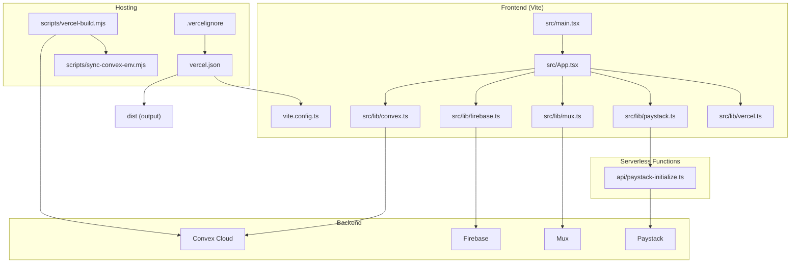
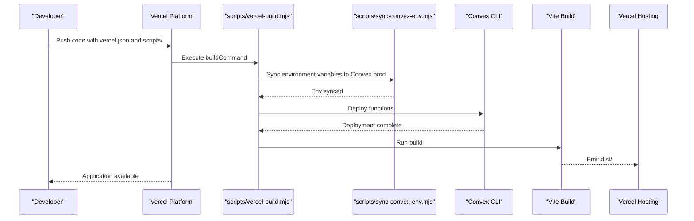
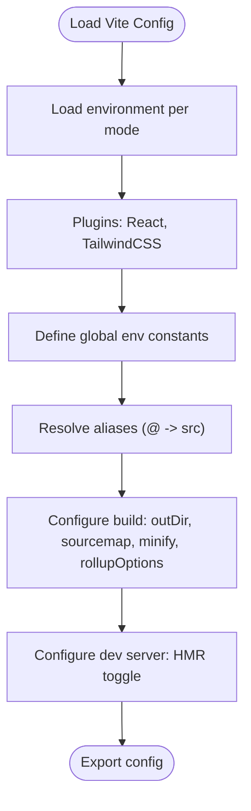
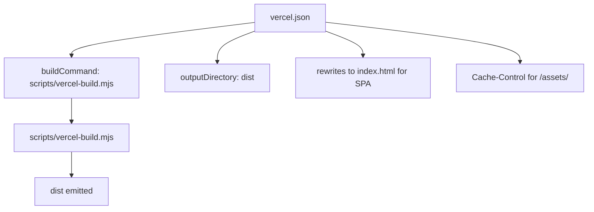
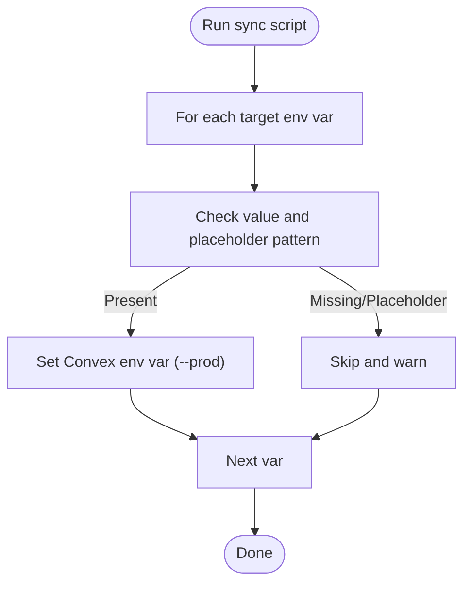
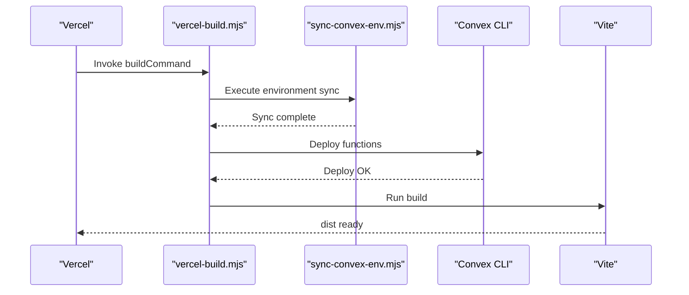
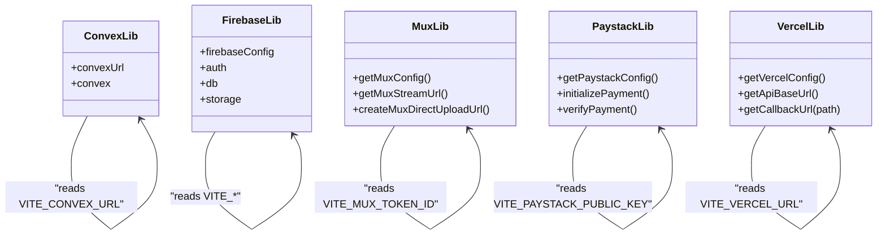
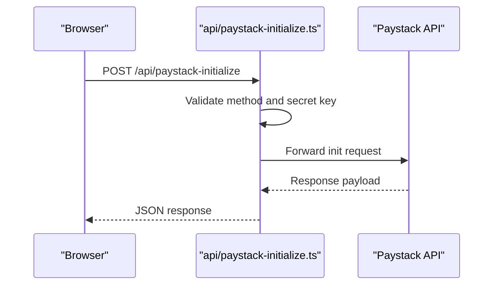
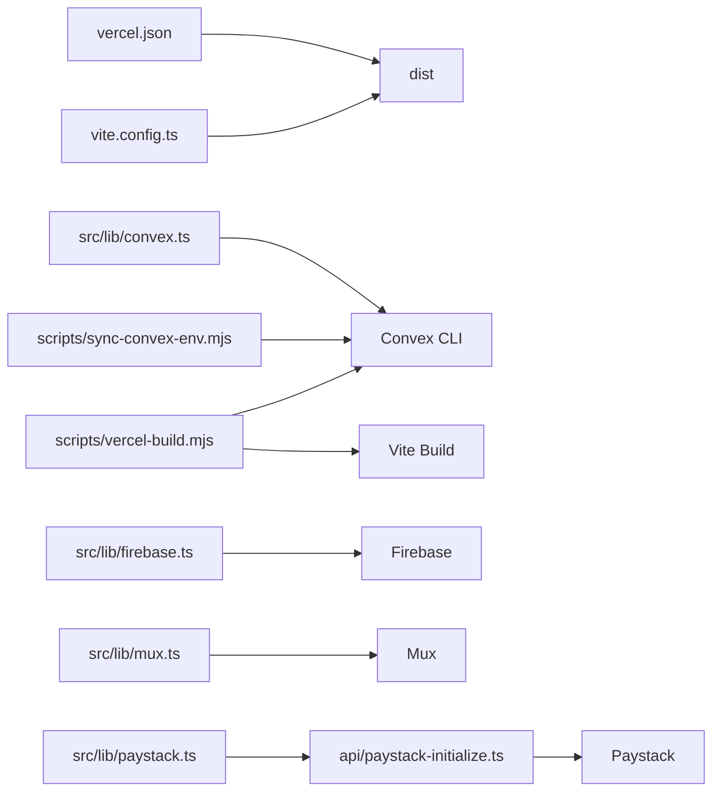

# Deployment and DevOps

<cite>
**Referenced Files in This Document**
- [package.json](file://package.json)
- [vite.config.ts](file://vite.config.ts)
- [vercel.json](file://vercel.json)
- [PRODUCTION_DEPLOYMENT.md](file://PRODUCTION_DEPLOYMENT.md)
- [VERCEL_DEPLOYMENT.md](file://VERCEL_DEPLOYMENT.md)
- [DEVELOPMENT_SETUP.md](file://DEVELOPMENT_SETUP.md)
- [scripts/vercel-build.mjs](file://scripts/vercel-build.mjs)
- [scripts/sync-convex-env.mjs](file://scripts/sync-convex-env.mjs)
- [.vercelignore](file://.vercelignore)
- [src/main.tsx](file://src/main.tsx)
- [src/App.tsx](file://src/App.tsx)
- [src/lib/vercel.ts](file://src/lib/vercel.ts)
- [src/lib/convex.ts](file://src/lib/convex.ts)
- [src/lib/firebase.ts](file://src/lib/firebase.ts)
- [src/lib/mux.ts](file://src/lib/mux.ts)
- [src/lib/paystack.ts](file://src/lib/paystack.ts)
- [api/paystack-initialize.ts](file://api/paystack-initialize.ts)
</cite>

## Table of Contents
1. [Introduction](#introduction)
2. [Project Structure](#project-structure)
3. [Core Components](#core-components)
4. [Architecture Overview](#architecture-overview)
5. [Detailed Component Analysis](#detailed-component-analysis)
6. [Dependency Analysis](#dependency-analysis)
7. [Performance Considerations](#performance-considerations)
8. [Troubleshooting Guide](#troubleshooting-guide)
9. [Conclusion](#conclusion)
10. [Appendices](#appendices)

## Introduction
This document provides comprehensive deployment and DevOps guidance for the Lemonade platform. It covers build configuration, environment setup, Convex environment synchronization, Vercel deployment, production deployment workflow, CI/CD considerations, environment-specific configurations and secrets management, monitoring and logging, rollback procedures, disaster recovery planning, and production performance optimization and scaling considerations.

## Project Structure
The project is a React + TypeScript frontend built with Vite, hosted on Vercel, with serverless functions under the api/ directory. Backend logic integrates with Convex (serverless functions and database), Firebase (authentication, storage, Firestore), Mux (video streaming), and Paystack (payments). Deployment automation is implemented via Vercel’s build pipeline and custom Node scripts.

**Diagram sources**
- [vite.config.ts:1-37](file://vite.config.ts#L1-L37)
- [vercel.json:1-27](file://vercel.json#L1-L27)
- [scripts/vercel-build.mjs:1-32](file://scripts/vercel-build.mjs#L1-L32)
- [scripts/sync-convex-env.mjs:1-18](file://scripts/sync-convex-env.mjs#L1-L18)
- [src/main.tsx:1-26](file://src/main.tsx#L1-L26)
- [src/App.tsx:1-375](file://src/App.tsx#L1-L375)
- [src/lib/convex.ts:1-12](file://src/lib/convex.ts#L1-L12)
- [src/lib/firebase.ts:1-55](file://src/lib/firebase.ts#L1-L55)
- [src/lib/mux.ts:1-66](file://src/lib/mux.ts#L1-L66)
- [src/lib/paystack.ts:1-115](file://src/lib/paystack.ts#L1-L115)
- [api/paystack-initialize.ts:1-47](file://api/paystack-initialize.ts#L1-L47)

**Section sources**
- [package.json:1-45](file://package.json#L1-L45)
- [vite.config.ts:1-37](file://vite.config.ts#L1-L37)
- [vercel.json:1-27](file://vercel.json#L1-L27)
- [scripts/vercel-build.mjs:1-32](file://scripts/vercel-build.mjs#L1-L32)
- [scripts/sync-convex-env.mjs:1-18](file://scripts/sync-convex-env.mjs#L1-L18)
- [src/main.tsx:1-26](file://src/main.tsx#L1-L26)
- [src/App.tsx:1-375](file://src/App.tsx#L1-L375)
- [src/lib/convex.ts:1-12](file://src/lib/convex.ts#L1-L12)
- [src/lib/firebase.ts:1-55](file://src/lib/firebase.ts#L1-L55)
- [src/lib/mux.ts:1-66](file://src/lib/mux.ts#L1-L66)
- [src/lib/paystack.ts:1-115](file://src/lib/paystack.ts#L1-L115)
- [api/paystack-initialize.ts:1-47](file://api/paystack-initialize.ts#L1-L47)

## Core Components
- Vite build configuration defines aliases, environment injection, output directory, source maps, minification, and chunk splitting for production.
- Vercel configuration sets build command, output directory, SPA rewrites, and caching headers.
- Convex environment synchronization script pushes selected environment variables to Convex production environment.
- Vercel build script orchestrates environment sync, Convex deployment, and frontend build.
- Runtime libraries encapsulate environment-aware initialization for Convex, Firebase, Mux, Paystack, and Vercel-specific base URLs.

**Section sources**
- [vite.config.ts:6-36](file://vite.config.ts#L6-L36)
- [vercel.json:1-27](file://vercel.json#L1-L27)
- [scripts/sync-convex-env.mjs:1-18](file://scripts/sync-convex-env.mjs#L1-L18)
- [scripts/vercel-build.mjs:1-32](file://scripts/vercel-build.mjs#L1-L32)
- [src/lib/convex.ts:1-12](file://src/lib/convex.ts#L1-L12)
- [src/lib/firebase.ts:1-55](file://src/lib/firebase.ts#L1-L55)
- [src/lib/mux.ts:1-66](file://src/lib/mux.ts#L1-L66)
- [src/lib/paystack.ts:1-115](file://src/lib/paystack.ts#L1-L115)
- [src/lib/vercel.ts:1-45](file://src/lib/vercel.ts#L1-L45)

## Architecture Overview
The deployment pipeline integrates frontend build, backend deployment, and hosting configuration. The Vercel build command invokes a Node script that synchronizes Convex environment variables, deploys Convex, sets Vercel-compatible Convex site URLs, and runs the Vite build. Vercel rewrites all routes to index.html for SPA routing and applies asset caching headers.

**Diagram sources**
- [vercel.json:2-4](file://vercel.json#L2-L4)
- [scripts/vercel-build.mjs:21-31](file://scripts/vercel-build.mjs#L21-L31)
- [scripts/sync-convex-env.mjs:6-17](file://scripts/sync-convex-env.mjs#L6-L17)

**Section sources**
- [vercel.json:1-27](file://vercel.json#L1-L27)
- [scripts/vercel-build.mjs:1-32](file://scripts/vercel-build.mjs#L1-L32)
- [scripts/sync-convex-env.mjs:1-18](file://scripts/sync-convex-env.mjs#L1-L18)

## Detailed Component Analysis

### Vite Build Configuration
- Aliasing: @ resolves to src for clean imports.
- Environment injection: GEMINI_API_KEY is injected into the app via define.
- Output: dist directory for production build.
- Source maps: Disabled for smaller production bundles.
- Minification: esbuild minifier for speed.
- Chunk splitting: Vendor chunk groups react, react-dom, react-router-dom.
- HMR: Controlled by DISABLE_HMR environment variable.

**Diagram sources**
- [vite.config.ts:6-36](file://vite.config.ts#L6-L36)

**Section sources**
- [vite.config.ts:1-37](file://vite.config.ts#L1-L37)

### Vercel Deployment Configuration
- Build command: Node script that orchestrates Convex sync and deployment, then builds the frontend.
- Output directory: dist for static hosting.
- SPA routing: Rewrites all unmatched routes to index.html.
- Headers: Assets under /assets/ receive long-lived caching headers.
- Environment variables: Managed in Vercel dashboard; client-side variables prefixed with VITE_.

**Diagram sources**
- [vercel.json:1-27](file://vercel.json#L1-L27)

**Section sources**
- [vercel.json:1-27](file://vercel.json#L1-L27)
- [VERCEL_DEPLOYMENT.md:1-119](file://VERCEL_DEPLOYMENT.md#L1-L119)

### Convex Environment Synchronization
- Purpose: Push selected environment variables (e.g., Paystack secret) from CI/CD environment to Convex production environment.
- Behavior: Iterates over a predefined list, validates values, and calls the Convex CLI to set environment variables.

**Diagram sources**
- [scripts/sync-convex-env.mjs:3-17](file://scripts/sync-convex-env.mjs#L3-L17)

**Section sources**
- [scripts/sync-convex-env.mjs:1-18](file://scripts/sync-convex-env.mjs#L1-L18)

### Vercel Build Script
- Sets a Convex deployment identifier for the build.
- Invokes the environment sync script.
- Deploys Convex functions.
- Sets VITE_CONVEX_URL and VITE_CONVEX_SITE_URL for the frontend build.
- Executes the Vite build.

**Diagram sources**
- [scripts/vercel-build.mjs:3-31](file://scripts/vercel-build.mjs#L3-L31)

**Section sources**
- [scripts/vercel-build.mjs:1-32](file://scripts/vercel-build.mjs#L1-L32)

### Runtime Environment Libraries
- Convex client initialization reads VITE_CONVEX_URL and warns if missing.
- Firebase initialization uses VITE_* variables with safe fallbacks and supports emulator connections in development.
- Mux integration requires VITE_MUX_TOKEN_ID and provides helpers for stream URLs and direct upload creation.
- Paystack integration requires VITE_PAYSTACK_PUBLIC_KEY and interacts with a serverless function that uses server-side PAYSTACK_SECRET_KEY.
- Vercel configuration helpers derive base URLs and callback URLs from environment variables.

**Diagram sources**
- [src/lib/convex.ts:1-12](file://src/lib/convex.ts#L1-L12)
- [src/lib/firebase.ts:1-55](file://src/lib/firebase.ts#L1-L55)
- [src/lib/mux.ts:1-66](file://src/lib/mux.ts#L1-L66)
- [src/lib/paystack.ts:1-115](file://src/lib/paystack.ts#L1-L115)
- [src/lib/vercel.ts:1-45](file://src/lib/vercel.ts#L1-L45)

**Section sources**
- [src/lib/convex.ts:1-12](file://src/lib/convex.ts#L1-L12)
- [src/lib/firebase.ts:1-55](file://src/lib/firebase.ts#L1-L55)
- [src/lib/mux.ts:1-66](file://src/lib/mux.ts#L1-L66)
- [src/lib/paystack.ts:1-115](file://src/lib/paystack.ts#L1-L115)
- [src/lib/vercel.ts:1-45](file://src/lib/vercel.ts#L1-L45)

### Serverless Functions and Webhooks
- Paystack initialization function validates method, reads secret key from environment, and forwards request to Paystack API.
- Frontend routes are defined in App.tsx with SPA navigation handled by React Router.

**Diagram sources**
- [api/paystack-initialize.ts:1-47](file://api/paystack-initialize.ts#L1-L47)
- [src/App.tsx:85-363](file://src/App.tsx#L85-L363)

**Section sources**
- [api/paystack-initialize.ts:1-47](file://api/paystack-initialize.ts#L1-L47)
- [src/App.tsx:1-375](file://src/App.tsx#L1-L375)

### Service Worker and PWA
- Service worker registration is enabled in production and registers the worker script from the root.

**Section sources**
- [src/main.tsx:19-25](file://src/main.tsx#L19-L25)

## Dependency Analysis
- Frontend depends on environment variables for backend integrations and hosting specifics.
- Vercel build depends on scripts/vercel-build.mjs, which depends on scripts/sync-convex-env.mjs and Convex CLI.
- Serverless functions depend on Paystack secret key and Convex site URL for payment flows.
- SPA routing depends on Vercel rewrites to index.html.

**Diagram sources**
- [vite.config.ts:1-37](file://vite.config.ts#L1-L37)
- [vercel.json:1-27](file://vercel.json#L1-L27)
- [scripts/vercel-build.mjs:1-32](file://scripts/vercel-build.mjs#L1-L32)
- [scripts/sync-convex-env.mjs:1-18](file://scripts/sync-convex-env.mjs#L1-L18)
- [src/lib/convex.ts:1-12](file://src/lib/convex.ts#L1-L12)
- [src/lib/firebase.ts:1-55](file://src/lib/firebase.ts#L1-L55)
- [src/lib/mux.ts:1-66](file://src/lib/mux.ts#L1-L66)
- [src/lib/paystack.ts:1-115](file://src/lib/paystack.ts#L1-L115)
- [api/paystack-initialize.ts:1-47](file://api/paystack-initialize.ts#L1-L47)

**Section sources**
- [package.json:1-45](file://package.json#L1-L45)
- [vite.config.ts:1-37](file://vite.config.ts#L1-L37)
- [vercel.json:1-27](file://vercel.json#L1-L27)
- [scripts/vercel-build.mjs:1-32](file://scripts/vercel-build.mjs#L1-L32)
- [scripts/sync-convex-env.mjs:1-18](file://scripts/sync-convex-env.mjs#L1-L18)
- [src/lib/convex.ts:1-12](file://src/lib/convex.ts#L1-L12)
- [src/lib/firebase.ts:1-55](file://src/lib/firebase.ts#L1-L55)
- [src/lib/mux.ts:1-66](file://src/lib/mux.ts#L1-L66)
- [src/lib/paystack.ts:1-115](file://src/lib/paystack.ts#L1-L115)
- [api/paystack-initialize.ts:1-47](file://api/paystack-initialize.ts#L1-L47)

## Performance Considerations
- Build optimization: esbuild minification, disabled source maps, and manual vendor chunk splitting reduce bundle size and improve load times.
- Asset caching: Long-term caching headers for static assets improve repeat visits.
- SPA routing: Rewrites avoid unnecessary server requests and keep client-side routing efficient.
- Recommendations:
  - Monitor bundle size and remove unused dependencies.
  - Use lazy loading for large routes.
  - Enable gzip/brotli compression at CDN level if not already enabled.
  - Consider CDN caching strategies for frequently accessed resources.

**Section sources**
- [vite.config.ts:18-29](file://vite.config.ts#L18-L29)
- [vercel.json:15-25](file://vercel.json#L15-L25)
- [DEVELOPMENT_SETUP.md:262-287](file://DEVELOPMENT_SETUP.md#L262-L287)

## Troubleshooting Guide
- Vercel 404 on routes:
  - Ensure vercel.json rewrites are present and correctly configured.
  - Verify environment variables are set in Vercel dashboard.
- Build failures:
  - Check Vercel logs for missing environment variables.
  - Confirm scripts/vercel-build.mjs executes successfully.
- Convex environment variables:
  - Ensure server-side secrets are marked as encrypted in Vercel.
  - Validate that scripts/sync-convex-env.mjs runs and sets variables.
- Paystack webhooks:
  - Verify webhook URL and secret key configuration.
  - Test with sandbox transactions and inspect logs.
- Firebase initialization:
  - Confirm VITE_* variables are set and not placeholders.
  - For development, ensure emulator toggles are correct.

**Section sources**
- [VERCEL_DEPLOYMENT.md:74-91](file://VERCEL_DEPLOYMENT.md#L74-L91)
- [PRODUCTION_DEPLOYMENT.md:91-98](file://PRODUCTION_DEPLOYMENT.md#L91-L98)
- [DEVELOPMENT_SETUP.md:213-259](file://DEVELOPMENT_SETUP.md#L213-L259)

## Conclusion
The Lemonade platform leverages Vite for optimized frontend builds, Vercel for hosting and SPA routing, and a robust serverless function layer for payments. Convex environment synchronization ensures secure and consistent backend configuration across environments. The documented workflow, environment variables, and troubleshooting steps provide a reliable path to production deployment and ongoing operations.

## Appendices

### Production Deployment Workflow
- Prepare staging with separate Vercel and Convex environments.
- Configure environment variables in Vercel dashboard, marking server-side secrets as encrypted.
- Set up Paystack webhook URL and events.
- Deploy Convex functions and verify availability.
- Build and deploy frontend via Vercel.
- Perform smoke tests and monitor logs for 24–72 hours.
- Switch DNS and re-run tests for cutover.

**Section sources**
- [PRODUCTION_DEPLOYMENT.md:37-75](file://PRODUCTION_DEPLOYMENT.md#L37-L75)

### CI/CD Pipeline Setup
- Trigger Vercel builds on commits to main branch.
- Ensure buildCommand runs scripts/vercel-build.mjs.
- Provide environment variables in Vercel project settings.
- Automate Convex environment sync using scripts/sync-convex-env.mjs in CI.

**Section sources**
- [vercel.json:2-4](file://vercel.json#L2-L4)
- [scripts/vercel-build.mjs:21-24](file://scripts/vercel-build.mjs#L21-L24)
- [scripts/sync-convex-env.mjs:1-18](file://scripts/sync-convex-env.mjs#L1-L18)

### Environment Variables and Secrets Management
- Client-side variables (VITE_*) for Firebase, Convex, Mux, Paystack, and Vercel.
- Server-side variables (non-VITE) for Paystack secret key and Convex webhook secret.
- Mark server-side secrets as encrypted in Vercel.

**Section sources**
- [PRODUCTION_DEPLOYMENT.md:9-34](file://PRODUCTION_DEPLOYMENT.md#L9-L34)
- [VERCEL_DEPLOYMENT.md:43-60](file://VERCEL_DEPLOYMENT.md#L43-L60)

### Monitoring and Logging
- Enable error tracking (e.g., Sentry) and configure DSN variables.
- Monitor Vercel logs, Convex dashboard, Firebase logs, and Paystack webhooks.
- Set up uptime checks for critical flows.

**Section sources**
- [PRODUCTION_DEPLOYMENT.md:108-112](file://PRODUCTION_DEPLOYMENT.md#L108-L112)

### Rollback Procedures and Disaster Recovery
- Frontend rollback: Revert to previous commit and redeploy via Vercel.
- Database: Use Convex backups or revert migrations if available.
- Payments: Disable Paystack webhook temporarily and revert to maintenance mode.

**Section sources**
- [PRODUCTION_DEPLOYMENT.md:101-105](file://PRODUCTION_DEPLOYMENT.md#L101-L105)

### Scaling Considerations
- Horizontal scaling: Vercel scales automatically; ensure stateless serverless functions.
- Database: Use Convex indexing and queries efficiently; monitor function budgets.
- CDN and caching: Rely on Vercel and asset caching headers for performance.

**Section sources**
- [DEVELOPMENT_SETUP.md:262-287](file://DEVELOPMENT_SETUP.md#L262-L287)