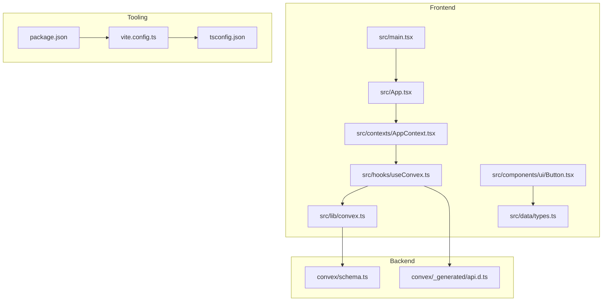
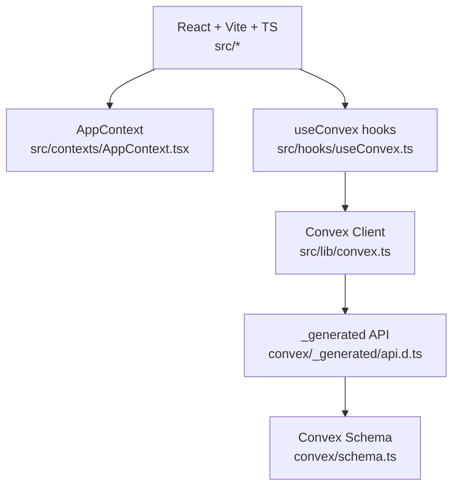
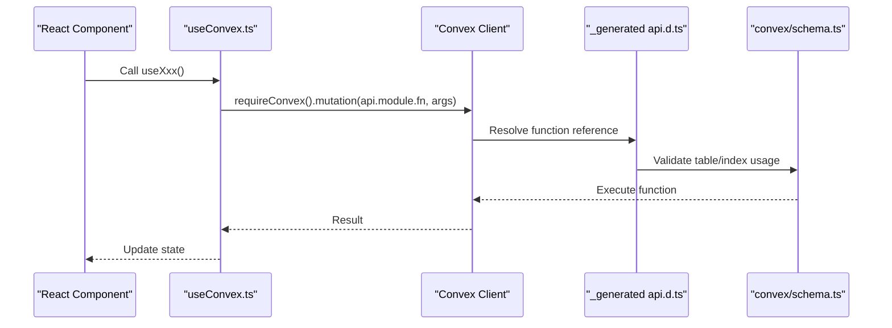
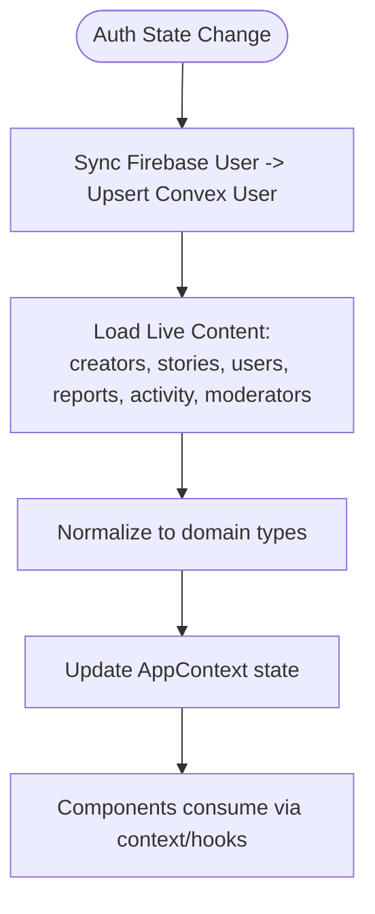
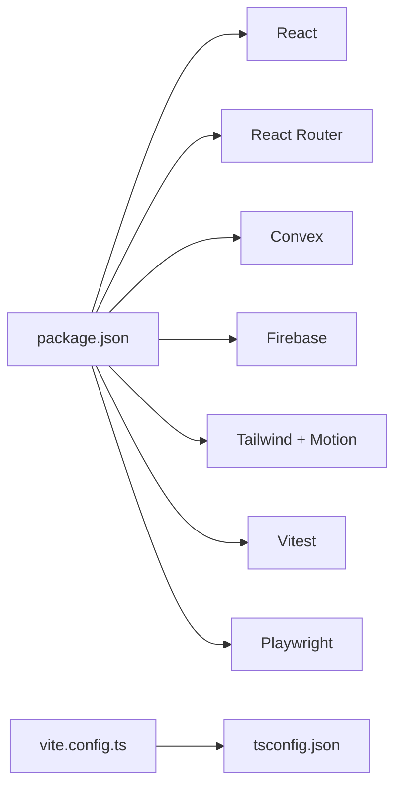

# Development Guidelines

<cite>
**Referenced Files in This Document**
- [README.md](file://README.md)
- [DEVELOPMENT_SETUP.md](file://DEVELOPMENT_SETUP.md)
- [TECH_STACK_SETUP.md](file://TECH_STACK_SETUP.md)
- [package.json](file://package.json)
- [tsconfig.json](file://tsconfig.json)
- [vite.config.ts](file://vite.config.ts)
- [src/main.tsx](file://src/main.tsx)
- [src/App.tsx](file://src/App.tsx)
- [src/lib/convex.ts](file://src/lib/convex.ts)
- [src/hooks/useConvex.ts](file://src/hooks/useConvex.ts)
- [convex/schema.ts](file://convex/schema.ts)
- [src/data/types.ts](file://src/data/types.ts)
- [src/contexts/AppContext.tsx](file://src/contexts/AppContext.tsx)
- [src/components/ui/Button.tsx](file://src/components/ui/Button.tsx)
- [convex/_generated/api.d.ts](file://convex/_generated/api.d.ts)
- [TESTING_CHECKLIST.md](file://TESTING_CHECKLIST.md)
- [INTEGRATION_TESTING_PLAN.md](file://INTEGRATION_TESTING_PLAN.md)
</cite>

## Table of Contents
1. [Introduction](#introduction)
2. [Project Structure](#project-structure)
3. [Core Components](#core-components)
4. [Architecture Overview](#architecture-overview)
5. [Detailed Component Analysis](#detailed-component-analysis)
6. [Dependency Analysis](#dependency-analysis)
7. [Performance Considerations](#performance-considerations)
8. [Troubleshooting Guide](#troubleshooting-guide)
9. [Conclusion](#conclusion)
10. [Appendices](#appendices)

## Introduction
This document defines comprehensive development guidelines for the Lemonade AI Studio application. It consolidates code standards, contribution processes, development best practices, and technical setup for React, TypeScript, and Convex backend functions. It also outlines branching and merge procedures, coding standards for React components and Convex functions, project structure conventions, debugging techniques, performance practices, and guidelines for adding new features while maintaining quality.

## Project Structure
The project follows a feature-based frontend structure with a dedicated backend under the convex/ directory. Key conventions:
- Frontend: src/screens, src/components, src/hooks, src/lib, src/contexts, src/data
- Backend: convex/ modules (users, stories, payments, etc.), generated client under convex/_generated
- Tooling: Vite, TypeScript, Tailwind CSS, Convex SDK, Playwright for E2E, Vitest for unit tests
- Environment: .env.local for local variables; Vercel for frontend deployment; Convex for backend deployment

**Diagram sources**
- [src/main.tsx:1-26](file://src/main.tsx#L1-L26)
- [src/App.tsx:1-375](file://src/App.tsx#L1-L375)
- [src/contexts/AppContext.tsx:1-800](file://src/contexts/AppContext.tsx#L1-L800)
- [src/hooks/useConvex.ts:1-213](file://src/hooks/useConvex.ts#L1-L213)
- [src/lib/convex.ts:1-12](file://src/lib/convex.ts#L1-L12)
- [src/components/ui/Button.tsx:1-43](file://src/components/ui/Button.tsx#L1-L43)
- [src/data/types.ts:1-155](file://src/data/types.ts#L1-L155)
- [convex/schema.ts:1-493](file://convex/schema.ts#L1-L493)
- [convex/_generated/api.d.ts:1-78](file://convex/_generated/api.d.ts#L1-L78)
- [vite.config.ts:1-37](file://vite.config.ts#L1-L37)
- [tsconfig.json:1-27](file://tsconfig.json#L1-L27)
- [package.json:1-45](file://package.json#L1-L45)

**Section sources**
- [README.md:1-21](file://README.md#L1-L21)
- [DEVELOPMENT_SETUP.md:3-34](file://DEVELOPMENT_SETUP.md#L3-L34)
- [src/App.tsx:1-375](file://src/App.tsx#L1-L375)
- [convex/schema.ts:1-493](file://convex/schema.ts#L1-L493)

## Core Components
- Application bootstrap and routing: [src/main.tsx:1-26](file://src/main.tsx#L1-L26), [src/App.tsx:1-375](file://src/App.tsx#L1-L375)
- State and data orchestration: [src/contexts/AppContext.tsx:1-800](file://src/contexts/AppContext.tsx#L1-L800)
- Convex client initialization and guards: [src/lib/convex.ts:1-12](file://src/lib/convex.ts#L1-L12)
- Frontend hooks for backend operations: [src/hooks/useConvex.ts:1-213](file://src/hooks/useConvex.ts#L1-L213)
- Backend schema and generated API: [convex/schema.ts:1-493](file://convex/schema.ts#L1-L493), [convex/_generated/api.d.ts:1-78](file://convex/_generated/api.d.ts#L1-L78)
- Shared types: [src/data/types.ts:1-155](file://src/data/types.ts#L1-L155)
- UI primitives: [src/components/ui/Button.tsx:1-43](file://src/components/ui/Button.tsx#L1-L43)

**Section sources**
- [src/main.tsx:1-26](file://src/main.tsx#L1-L26)
- [src/App.tsx:1-375](file://src/App.tsx#L1-L375)
- [src/contexts/AppContext.tsx:1-800](file://src/contexts/AppContext.tsx#L1-L800)
- [src/lib/convex.ts:1-12](file://src/lib/convex.ts#L1-L12)
- [src/hooks/useConvex.ts:1-213](file://src/hooks/useConvex.ts#L1-L213)
- [convex/schema.ts:1-493](file://convex/schema.ts#L1-L493)
- [convex/_generated/api.d.ts:1-78](file://convex/_generated/api.d.ts#L1-L78)
- [src/data/types.ts:1-155](file://src/data/types.ts#L1-L155)
- [src/components/ui/Button.tsx:1-43](file://src/components/ui/Button.tsx#L1-L43)

## Architecture Overview
The application uses a React + TypeScript frontend with Vite and Tailwind, integrating with Convex (serverless functions and database), Firebase (authentication and storage), Mux (video), Paystack (payments), and Vercel (deployment). The frontend initializes Firebase and Convex, manages global state in AppContext, and exposes typed Convex function references via the generated api client.

**Diagram sources**
- [src/App.tsx:1-375](file://src/App.tsx#L1-L375)
- [src/contexts/AppContext.tsx:1-800](file://src/contexts/AppContext.tsx#L1-L800)
- [src/hooks/useConvex.ts:1-213](file://src/hooks/useConvex.ts#L1-L213)
- [src/lib/convex.ts:1-12](file://src/lib/convex.ts#L1-L12)
- [convex/_generated/api.d.ts:1-78](file://convex/_generated/api.d.ts#L1-L78)
- [convex/schema.ts:1-493](file://convex/schema.ts#L1-L493)

## Detailed Component Analysis

### React + TypeScript Setup and Tooling
- Package scripts and dependencies: [package.json:1-45](file://package.json#L1-L45)
- TypeScript compiler options and path aliases: [tsconfig.json:1-27](file://tsconfig.json#L1-L27)
- Vite configuration (plugins, aliases, build, dev server): [vite.config.ts:1-37](file://vite.config.ts#L1-L37)
- App entry and service worker registration: [src/main.tsx:1-26](file://src/main.tsx#L1-L26)

Best practices:
- Keep TypeScript strictness high; enforce noEmit for type checks.
- Use path aliases (@/*) consistently for imports.
- Prefer esbuild minification and manualChunks for vendor separation.
- Disable HMR only when required by AI Studio environments.

**Section sources**
- [package.json:1-45](file://package.json#L1-L45)
- [tsconfig.json:1-27](file://tsconfig.json#L1-L27)
- [vite.config.ts:1-37](file://vite.config.ts#L1-L37)
- [src/main.tsx:1-26](file://src/main.tsx#L1-L26)

### Convex Integration and Function References
- Convex client initialization with environment guard: [src/lib/convex.ts:1-12](file://src/lib/convex.ts#L1-L12)
- Typed function references via generated api: [convex/_generated/api.d.ts:1-78](file://convex/_generated/api.d.ts#L1-L78)
- Frontend hooks invoking Convex mutations/queries: [src/hooks/useConvex.ts:1-213](file://src/hooks/useConvex.ts#L1-L213)
- Backend schema defining tables and indices: [convex/schema.ts:1-493](file://convex/schema.ts#L1-L493)

Guidelines:
- Always guard against missing VITE_CONVEX_URL; warn and disable Convex features gracefully.
- Use api.module.function for type-safe calls; avoid dynamic string concatenation.
- Keep mutation arguments normalized and validated before calling Convex.
- Maintain schema indices for frequent queries.

**Diagram sources**
- [src/hooks/useConvex.ts:163-177](file://src/hooks/useConvex.ts#L163-L177)
- [src/lib/convex.ts:1-12](file://src/lib/convex.ts#L1-L12)
- [convex/_generated/api.d.ts:59-62](file://convex/_generated/api.d.ts#L59-L62)
- [convex/schema.ts:24-67](file://convex/schema.ts#L24-L67)

**Section sources**
- [src/lib/convex.ts:1-12](file://src/lib/convex.ts#L1-L12)
- [convex/_generated/api.d.ts:1-78](file://convex/_generated/api.d.ts#L1-L78)
- [src/hooks/useConvex.ts:1-213](file://src/hooks/useConvex.ts#L1-L213)
- [convex/schema.ts:1-493](file://convex/schema.ts#L1-L493)

### Global State and Data Flow
- AppContext orchestrates authentication, user profiles, creators, stories, admin state, and actions: [src/contexts/AppContext.tsx:1-800](file://src/contexts/AppContext.tsx#L1-L800)
- Types define shared interfaces for users, creators, stories, and related entities: [src/data/types.ts:1-155](file://src/data/types.ts#L1-L155)

Patterns:
- Persist guest and authenticated sessions to localStorage with explicit logout detection.
- Normalize Convex documents into domain-specific types (Creator, Story, AppUser).
- Batch load live content on mount and refresh periodically.

**Diagram sources**
- [src/contexts/AppContext.tsx:509-601](file://src/contexts/AppContext.tsx#L509-L601)
- [src/contexts/AppContext.tsx:390-424](file://src/contexts/AppContext.tsx#L390-L424)
- [src/data/types.ts:1-155](file://src/data/types.ts#L1-L155)

**Section sources**
- [src/contexts/AppContext.tsx:1-800](file://src/contexts/AppContext.tsx#L1-L800)
- [src/data/types.ts:1-155](file://src/data/types.ts#L1-L155)

### UI Component Standards
- Button component demonstrates variants, sizes, and Tailwind-based styling with motion animations: [src/components/ui/Button.tsx:1-43](file://src/components/ui/Button.tsx#L1-L43)

Standards:
- Use forwardRef for accessibility and imperative control.
- Prefer variants and sizes for consistent styling.
- Keep className composition centralized via cn helper.

**Section sources**
- [src/components/ui/Button.tsx:1-43](file://src/components/ui/Button.tsx#L1-L43)

### Backend Schema and Indexing
- Define tables with required fields, optional fields, and indices for efficient queries: [convex/schema.ts:1-493](file://convex/schema.ts#L1-L493)

Guidelines:
- Add indices for all commonly filtered/sorted fields.
- Use union literals for enums to keep queries type-safe.
- Keep timestamps and soft-delete fields consistent across tables.

**Section sources**
- [convex/schema.ts:1-493](file://convex/schema.ts#L1-L493)

## Dependency Analysis
- Frontend dependencies include React, React Router, Convex, Tailwind, Framer Motion, and Firebase.
- Tooling dependencies include Vite, TypeScript, Vitest, Playwright, and Tailwind plugins.
- Aliases and build configuration centralize imports and optimize bundles.

**Diagram sources**
- [package.json:1-45](file://package.json#L1-L45)
- [tsconfig.json:1-27](file://tsconfig.json#L1-L27)
- [vite.config.ts:1-37](file://vite.config.ts#L1-L37)

**Section sources**
- [package.json:1-45](file://package.json#L1-L45)
- [tsconfig.json:1-27](file://tsconfig.json#L1-L27)
- [vite.config.ts:1-37](file://vite.config.ts#L1-L37)

## Performance Considerations
- Bundle size and chunking: configure manualChunks for vendor libraries; disable source maps in production builds.
- Runtime performance: batch Convex queries in AppContext; debounce or throttle UI interactions.
- Monitoring: use Lighthouse audits; track bundle size; monitor API call volume and latency.
- Memory: take heap snapshots to detect leaks; avoid unnecessary re-renders with useMemo/useCallback.

[No sources needed since this section provides general guidance]

## Troubleshooting Guide
Common issues and resolutions:
- Missing VITE_CONVEX_URL: ensure environment variable is set for local or production.
- Cannot find module 'convex/react': install convex and start convex dev.
- Firebase initialization failed: verify all Firebase env vars are present.
- Paystack payment not working: use test keys and test card; check CORS.
- Profile picture upload fails: verify storage rules, CORS, and file constraints.

Verification checklist:
- After starting dev servers, verify no critical console errors, Convex connection, Firebase initialization, and basic navigation.
- After code changes, ensure build succeeds, no TypeScript errors, no ESLint warnings, and tests pass.

**Section sources**
- [DEVELOPMENT_SETUP.md:213-286](file://DEVELOPMENT_SETUP.md#L213-L286)
- [DEVELOPMENT_SETUP.md:192-210](file://DEVELOPMENT_SETUP.md#L192-L210)

## Conclusion
These guidelines establish a consistent development workflow across the Lemonade platform. By adhering to the code standards, integration patterns, and quality practices outlined here—covering React/TypeScript tooling, Convex schema and function usage, testing, performance, and operational checks—you can efficiently contribute features, maintain code quality, and deliver reliable updates.

[No sources needed since this section summarizes without analyzing specific files]

## Appendices

### Contribution Process and Code Review
- Branching strategy: feature branches from main; small, focused commits with clear messages.
- Pull requests: include a summary, screenshots/demo if UI changes, and pass all checks.
- Code review: ensure type safety, minimal coupling, clear error handling, and performance considerations.

[No sources needed since this section provides general guidance]

### Quality Assurance Requirements
- Unit tests: Vitest for hooks and utilities; cover happy paths and error cases.
- Integration tests: screen-level tests validating auth, story, payment flows.
- E2E tests: Playwright scenarios for critical user journeys.
- Manual testing: use the official checklist to validate auth, stories, payments, media, and responsiveness.

**Section sources**
- [INTEGRATION_TESTING_PLAN.md:127-160](file://INTEGRATION_TESTING_PLAN.md#L127-L160)
- [TESTING_CHECKLIST.md:1-528](file://TESTING_CHECKLIST.md#L1-L528)

### Adding New Features and Extending Functionality
- Frontend:
  - Add new screens under src/screens and integrate routes in App.tsx.
  - Create reusable components under src/components; follow component standards.
  - Add hooks under src/hooks; expose typed Convex operations via useConvex.ts.
- Backend:
  - Extend convex/schema.ts with new tables and indices.
  - Implement Convex functions in modules under convex/ and regenerate the client.
  - Update types in src/data/types.ts if domain contracts change.

**Section sources**
- [src/App.tsx:1-375](file://src/App.tsx#L1-L375)
- [src/hooks/useConvex.ts:1-213](file://src/hooks/useConvex.ts#L1-L213)
- [convex/schema.ts:1-493](file://convex/schema.ts#L1-L493)
- [src/data/types.ts:1-155](file://src/data/types.ts#L1-L155)

### Debugging Techniques and Tools
- Frontend: inspect environment variables, check Convex connection, monitor network requests.
- Backend: use Convex dashboard to inspect tables and API logs.
- Storage: verify Firebase Storage files and metadata.
- Performance: use DevTools Lighthouse, bundle analyzers, and memory snapshots.

**Section sources**
- [DEVELOPMENT_SETUP.md:151-188](file://DEVELOPMENT_SETUP.md#L151-L188)