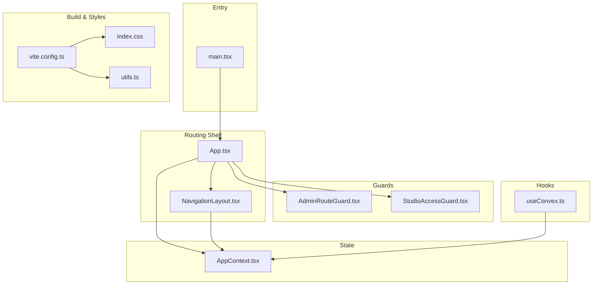
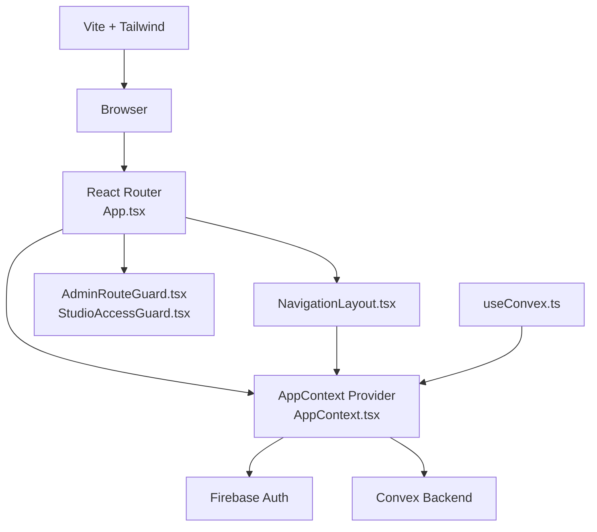
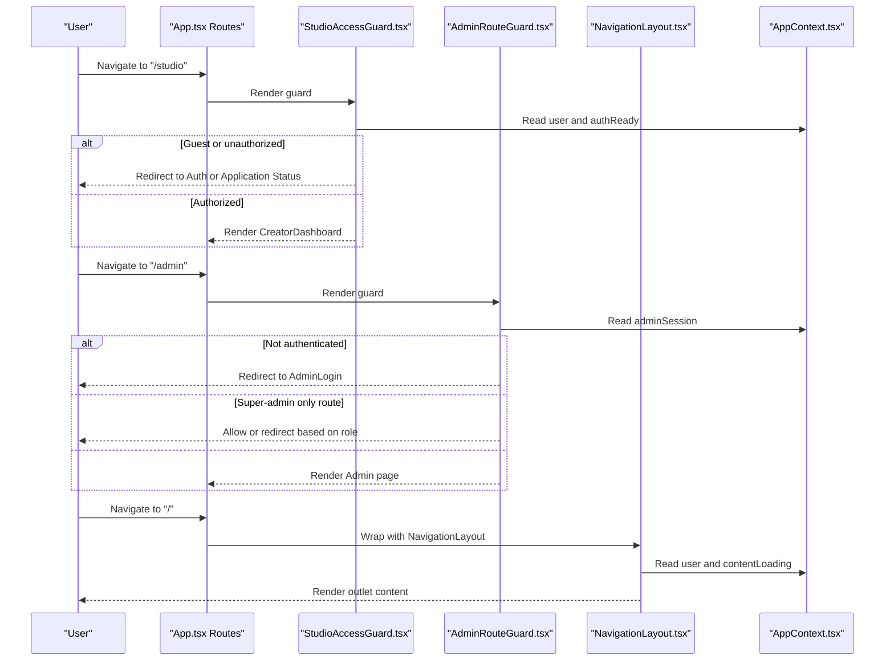
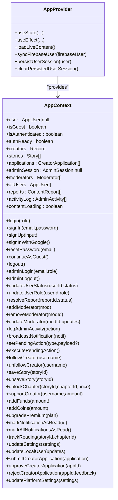
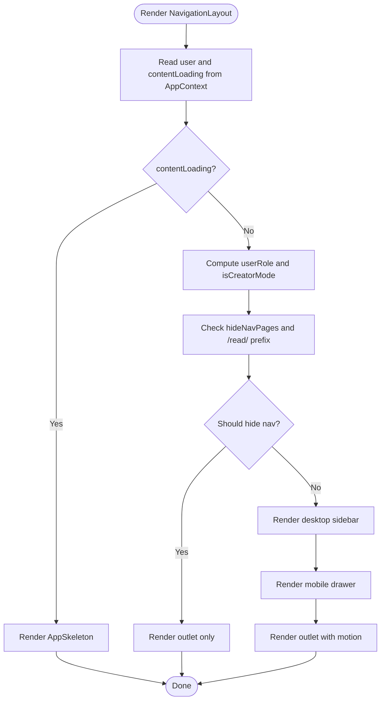
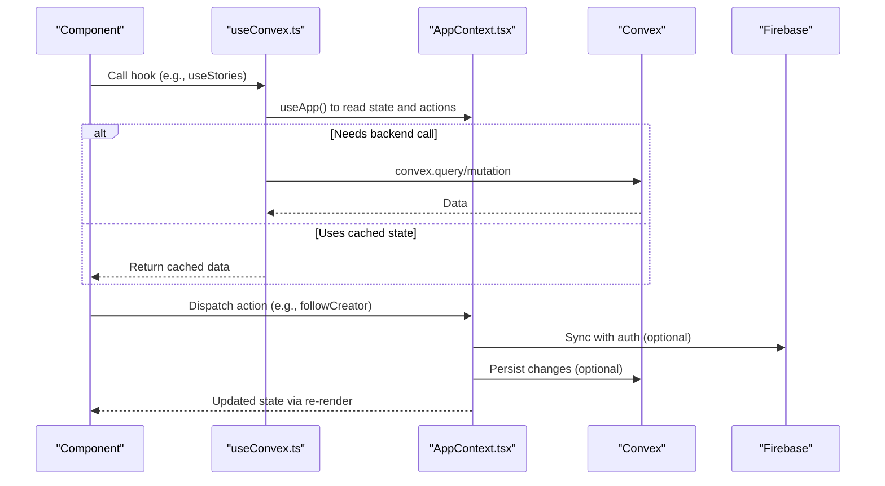
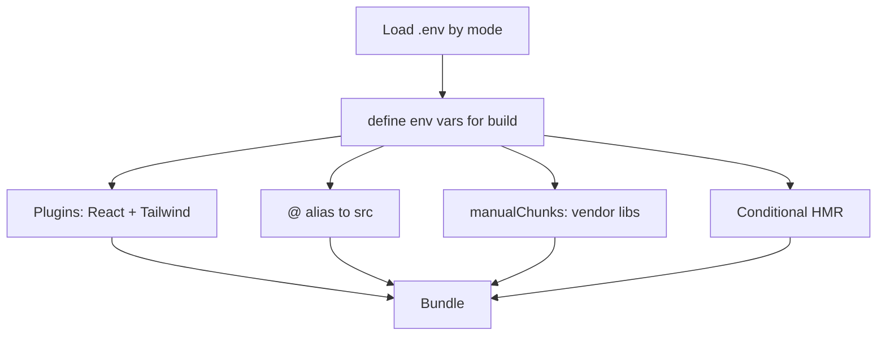
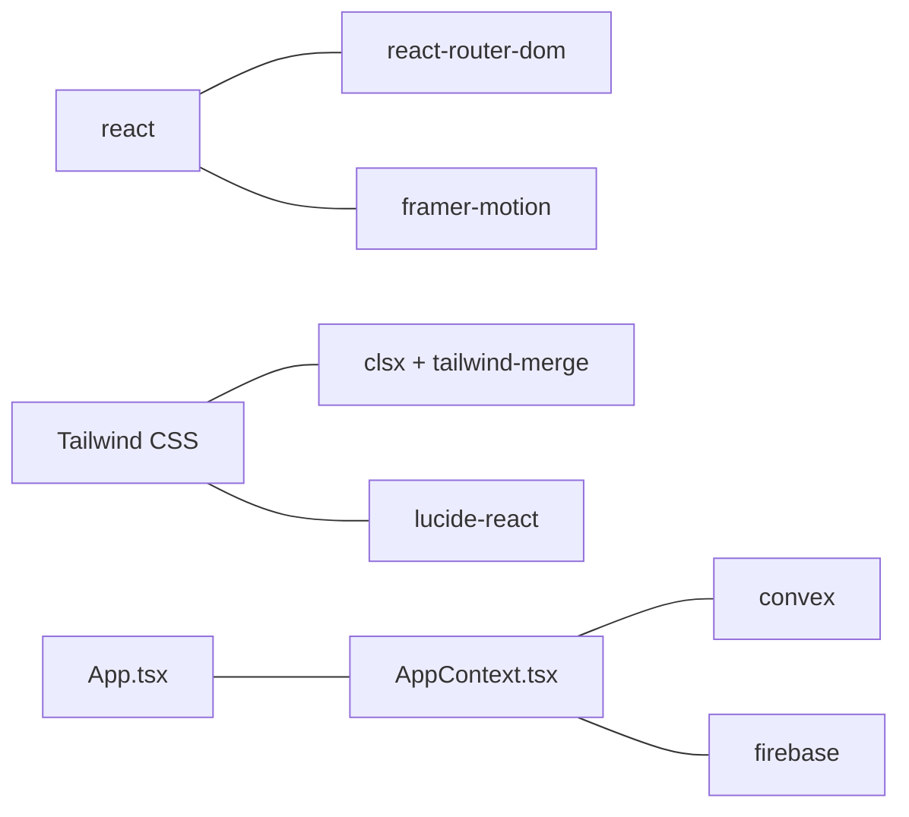

# Frontend Architecture

<cite>
**Referenced Files in This Document**
- [App.tsx](file://src/App.tsx)
- [NavigationLayout.tsx](file://src/components/NavigationLayout.tsx)
- [AppContext.tsx](file://src/contexts/AppContext.tsx)
- [AdminRouteGuard.tsx](file://src/components/admin/AdminRouteGuard.tsx)
- [StudioAccessGuard.tsx](file://src/components/StudioAccessGuard.tsx)
- [vite.config.ts](file://vite.config.ts)
- [package.json](file://package.json)
- [index.css](file://src/index.css)
- [utils.ts](file://src/lib/utils.ts)
- [CreatorDashboard.tsx](file://src/screens/CreatorDashboard.tsx)
- [useConvex.ts](file://src/hooks/useConvex.ts)
- [types.ts](file://src/data/types.ts)
- [main.tsx](file://src/main.tsx)
</cite>

## Table of Contents
1. [Introduction](#introduction)
2. [Project Structure](#project-structure)
3. [Core Components](#core-components)
4. [Architecture Overview](#architecture-overview)
5. [Detailed Component Analysis](#detailed-component-analysis)
6. [Dependency Analysis](#dependency-analysis)
7. [Performance Considerations](#performance-considerations)
8. [Troubleshooting Guide](#troubleshooting-guide)
9. [Conclusion](#conclusion)

## Introduction
This document explains the frontend architecture of the Lemonade React application. It focuses on the central routing component App.tsx, the shared navigation layout NavigationLayout.tsx, the React Context pattern in AppContext.tsx for centralized state management, the routing strategy and role-based access control, styling with Tailwind CSS and component composition, build configuration via Vite, environment variable handling, provider patterns, subscription to state changes, and performance considerations including lazy loading, code splitting, and memory management.

## Project Structure
The frontend is organized around a clear separation of concerns:
- Routing and shell: App.tsx defines routes and wraps the app with providers.
- Shared UI: NavigationLayout.tsx provides responsive navigation and layout.
- State management: AppContext.tsx implements a React Context provider for user, admin, and platform state.
- Guards: AdminRouteGuard.tsx and StudioAccessGuard.tsx enforce role-based access.
- Hooks: useConvex.ts exposes typed hooks that wrap AppContext actions and Convex calls.
- Styles: index.css defines theme tokens, variants, and animations; utils.ts composes Tailwind classes.
- Build: vite.config.ts configures Vite with Tailwind, aliases, and code splitting.

**Diagram sources**
- [main.tsx:1-26](file://src/main.tsx#L1-L26)
- [App.tsx:1-375](file://src/App.tsx#L1-L375)
- [NavigationLayout.tsx:1-324](file://src/components/NavigationLayout.tsx#L1-L324)
- [AppContext.tsx:1-800](file://src/contexts/AppContext.tsx#L1-L800)
- [AdminRouteGuard.tsx:1-24](file://src/components/admin/AdminRouteGuard.tsx#L1-L24)
- [StudioAccessGuard.tsx:1-36](file://src/components/StudioAccessGuard.tsx#L1-L36)
- [useConvex.ts:1-213](file://src/hooks/useConvex.ts#L1-L213)
- [vite.config.ts:1-37](file://vite.config.ts#L1-L37)
- [index.css:1-224](file://src/index.css#L1-L224)
- [utils.ts:1-7](file://src/lib/utils.ts#L1-L7)

**Section sources**
- [main.tsx:1-26](file://src/main.tsx#L1-L26)
- [App.tsx:1-375](file://src/App.tsx#L1-L375)
- [vite.config.ts:1-37](file://vite.config.ts#L1-L37)

## Core Components
- App.tsx: Central router that mounts providers, sets up route groups, and integrates animated transitions and guards.
- NavigationLayout.tsx: Responsive navigation shell with desktop sidebar and mobile drawer, role-aware items, and outlet rendering.
- AppContext.tsx: Provider that manages user, admin, and platform state, synchronizes with Firebase and Convex, persists sessions, and exposes actions.
- AdminRouteGuard.tsx and StudioAccessGuard.tsx: Route guards enforcing admin and creator access policies.
- useConvex.ts: Typed hooks that delegate to AppContext actions and call Convex APIs.
- index.css and utils.ts: Theme tokens, variants, animations, and class composition helpers.

**Section sources**
- [App.tsx:1-375](file://src/App.tsx#L1-L375)
- [NavigationLayout.tsx:1-324](file://src/components/NavigationLayout.tsx#L1-L324)
- [AppContext.tsx:1-800](file://src/contexts/AppContext.tsx#L1-L800)
- [AdminRouteGuard.tsx:1-24](file://src/components/admin/AdminRouteGuard.tsx#L1-L24)
- [StudioAccessGuard.tsx:1-36](file://src/components/StudioAccessGuard.tsx#L1-L36)
- [useConvex.ts:1-213](file://src/hooks/useConvex.ts#L1-L213)
- [index.css:1-224](file://src/index.css#L1-L224)
- [utils.ts:1-7](file://src/lib/utils.ts#L1-L7)

## Architecture Overview
The app follows a layered architecture:
- Presentation layer: App.tsx and NavigationLayout.tsx render UI and orchestrate routing.
- State layer: AppContext.tsx centralizes user, admin, and platform state with persistence and real-time-like refresh.
- Domain layer: useConvex.ts encapsulates domain operations against Convex and Firebase.
- Infrastructure layer: Vite config, Tailwind CSS, and environment variables.

**Diagram sources**
- [App.tsx:1-375](file://src/App.tsx#L1-L375)
- [NavigationLayout.tsx:1-324](file://src/components/NavigationLayout.tsx#L1-L324)
- [AppContext.tsx:1-800](file://src/contexts/AppContext.tsx#L1-L800)
- [AdminRouteGuard.tsx:1-24](file://src/components/admin/AdminRouteGuard.tsx#L1-L24)
- [StudioAccessGuard.tsx:1-36](file://src/components/StudioAccessGuard.tsx#L1-L36)
- [useConvex.ts:1-213](file://src/hooks/useConvex.ts#L1-L213)
- [vite.config.ts:1-37](file://vite.config.ts#L1-L37)

## Detailed Component Analysis

### Routing Strategy and Role-Based Access
- Root routes: Splash, Onboarding, Auth, Reader routes under NavigationLayout, Reader full-screen route (/read/:id/:chapterNum), Creator Studio routes guarded by StudioAccessGuard, Admin routes guarded by AdminRouteGuard, and nested Admin pages.
- Role awareness: NavigationLayout computes user role from AppContext and renders appropriate navigation items for readers and creators.
- Guards:
  - AdminRouteGuard enforces admin session and optional super-admin-only access.
  - StudioAccessGuard redirects guests, admins, and unauthorized creators to appropriate flows.

**Diagram sources**
- [App.tsx:134-155](file://src/App.tsx#L134-L155)
- [App.tsx:160-357](file://src/App.tsx#L160-L357)
- [StudioAccessGuard.tsx:1-36](file://src/components/StudioAccessGuard.tsx#L1-L36)
- [AdminRouteGuard.tsx:1-24](file://src/components/admin/AdminRouteGuard.tsx#L1-L24)
- [NavigationLayout.tsx:25-92](file://src/components/NavigationLayout.tsx#L25-L92)
- [AppContext.tsx:509-708](file://src/contexts/AppContext.tsx#L509-L708)

**Section sources**
- [App.tsx:1-375](file://src/App.tsx#L1-L375)
- [NavigationLayout.tsx:1-324](file://src/components/NavigationLayout.tsx#L1-L324)
- [StudioAccessGuard.tsx:1-36](file://src/components/StudioAccessGuard.tsx#L1-L36)
- [AdminRouteGuard.tsx:1-24](file://src/components/admin/AdminRouteGuard.tsx#L1-L24)

### React Context Pattern and State Management
- Provider: AppProvider initializes state, loads live content from Convex, syncs with Firebase, persists sessions, and exposes actions.
- Types: AppContext defines user, admin, and platform state interfaces and action signatures.
- Persistence: Local storage handles guest and explicit logout markers; persisted user restored on mount.
- Real-time updates: Periodic refresh of creators, stories, applications, users, reports, and activity logs.

**Diagram sources**
- [AppContext.tsx:139-203](file://src/contexts/AppContext.tsx#L139-L203)
- [AppContext.tsx:509-708](file://src/contexts/AppContext.tsx#L509-L708)

**Section sources**
- [AppContext.tsx:1-800](file://src/contexts/AppContext.tsx#L1-L800)

### Component Composition and Styling Approach
- Composition: NavigationLayout composes desktop sidebar, mobile drawer, and outlet rendering; it reads user role and contentLoading to decide visibility and items.
- Styling: index.css defines theme tokens, variant attributes for theme/accent/density, and animations; utils.ts merges Tailwind classes safely.

**Diagram sources**
- [NavigationLayout.tsx:25-92](file://src/components/NavigationLayout.tsx#L25-L92)
- [NavigationLayout.tsx:94-301](file://src/components/NavigationLayout.tsx#L94-L301)
- [index.css:1-224](file://src/index.css#L1-L224)
- [utils.ts:1-7](file://src/lib/utils.ts#L1-L7)

**Section sources**
- [NavigationLayout.tsx:1-324](file://src/components/NavigationLayout.tsx#L1-L324)
- [index.css:1-224](file://src/index.css#L1-L224)
- [utils.ts:1-7](file://src/lib/utils.ts#L1-L7)

### Provider Pattern and Subscription to State Changes
- Provider: App.tsx wraps the app with AppProvider so all components can consume state via useApp/useAuth.
- Subscription: Components call useApp/useAuth to read state and trigger actions; hooks like useConvex.ts expose typed operations that internally call AppContext actions and Convex APIs.

**Diagram sources**
- [App.tsx:83-83](file://src/App.tsx#L83-L83)
- [useConvex.ts:1-213](file://src/hooks/useConvex.ts#L1-L213)
- [AppContext.tsx:509-708](file://src/contexts/AppContext.tsx#L509-L708)

**Section sources**
- [App.tsx:83-83](file://src/App.tsx#L83-L83)
- [useConvex.ts:1-213](file://src/hooks/useConvex.ts#L1-L213)
- [AppContext.tsx:509-708](file://src/contexts/AppContext.tsx#L509-L708)

### Build Configuration and Environment Variables
- Vite config:
  - Plugins: React and Tailwind CSS.
  - Aliases: '@' resolves to src.
  - Define: Exposes selected environment variables at compile time.
  - Code splitting: Manual chunking for vendor libraries.
  - Dev server: HMR controlled by DISABLE_HMR environment variable.
- Dependencies: React, React Router, Framer Motion, Tailwind, Convex, Firebase, Lucide icons, clsx/tailwind-merge.

**Diagram sources**
- [vite.config.ts:6-36](file://vite.config.ts#L6-L36)
- [package.json:14-44](file://package.json#L14-L44)

**Section sources**
- [vite.config.ts:1-37](file://vite.config.ts#L1-L37)
- [package.json:1-45](file://package.json#L1-L45)

### Example Screen: Creator Dashboard
- Purpose: Creator Studio dashboard showing earnings, ad analytics, recent stories, and comments.
- Data sources: useConvex.ts hooks for stories, comments, and payouts; AppContext for user.
- UI composition: Tailwind classes, cards, and responsive grids; Lucide icons.

**Section sources**
- [CreatorDashboard.tsx:1-200](file://src/screens/CreatorDashboard.tsx#L1-L200)
- [useConvex.ts:1-213](file://src/hooks/useConvex.ts#L1-L213)
- [types.ts:1-155](file://src/data/types.ts#L1-L155)

## Dependency Analysis
Key runtime dependencies and their roles:
- React and Router: UI and routing.
- Framer Motion: Page transitions.
- Tailwind CSS: Utility-first styling.
- Convex: Backend queries and mutations.
- Firebase: Authentication state synchronization.
- lucide-react: Icons.
- clsx and tailwind-merge: Class composition.

**Diagram sources**
- [package.json:14-30](file://package.json#L14-L30)
- [App.tsx:1-375](file://src/App.tsx#L1-L375)
- [AppContext.tsx:1-800](file://src/contexts/AppContext.tsx#L1-L800)

**Section sources**
- [package.json:1-45](file://package.json#L1-L45)

## Performance Considerations
- Code splitting:
  - Vite manualChunks separates vendor libraries (React, Router, DOM) into a dedicated chunk to improve caching and load performance.
- Lazy loading:
  - Route groups under NavigationLayout enable logical grouping; consider React.lazy and Suspense for large route components to defer loading until navigation occurs.
- Memory management:
  - AppContext clears intervals and unsubscribes listeners on unmount to avoid leaks.
  - useConvex.ts memoizes derived data and avoids unnecessary re-renders by returning cached state when available.
- Real-time refresh:
  - Periodic refresh of live content balances freshness with performance; consider debouncing and selective updates for large datasets.
- Rendering:
  - NavigationLayout uses motion and AnimatePresence for smooth transitions; skeleton loaders during contentLoading prevent layout shifts.
- Build optimizations:
  - esbuild minification and disabling source maps in production reduce bundle size and parse time.

[No sources needed since this section provides general guidance]

## Troubleshooting Guide
- Authentication issues:
  - Verify Firebase initialization and auth persistence readiness; check persisted session keys and explicit logout markers.
- Route guard failures:
  - Confirm adminSession and creatorAccessStatus values; ensure guards receive proper props.
- State not updating:
  - Check that AppContext actions are called and that Convex mutations succeed; confirm useEffect cleanup and interval teardown.
- Styling anomalies:
  - Ensure Tailwind is properly scanning files and that variant attributes (theme/accent/density) are applied consistently.

**Section sources**
- [AppContext.tsx:509-708](file://src/contexts/AppContext.tsx#L509-L708)
- [AdminRouteGuard.tsx:1-24](file://src/components/admin/AdminRouteGuard.tsx#L1-L24)
- [StudioAccessGuard.tsx:1-36](file://src/components/StudioAccessGuard.tsx#L1-L36)
- [index.css:1-224](file://src/index.css#L1-L224)

## Conclusion
The Lemonade frontend leverages a clear routing shell, a robust React Context provider, and guard components to implement role-based access and a cohesive navigation experience. Styling is driven by Tailwind CSS with theme tokens and animations, while Vite provides efficient builds and development ergonomics. The architecture supports scalability through hooks, code splitting, and careful state management, with room to adopt lazy loading for further performance gains.