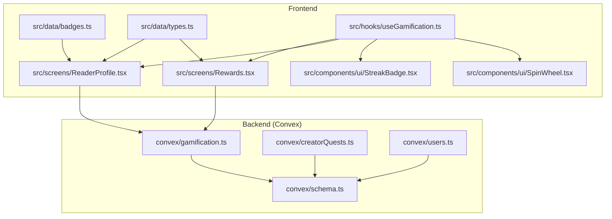
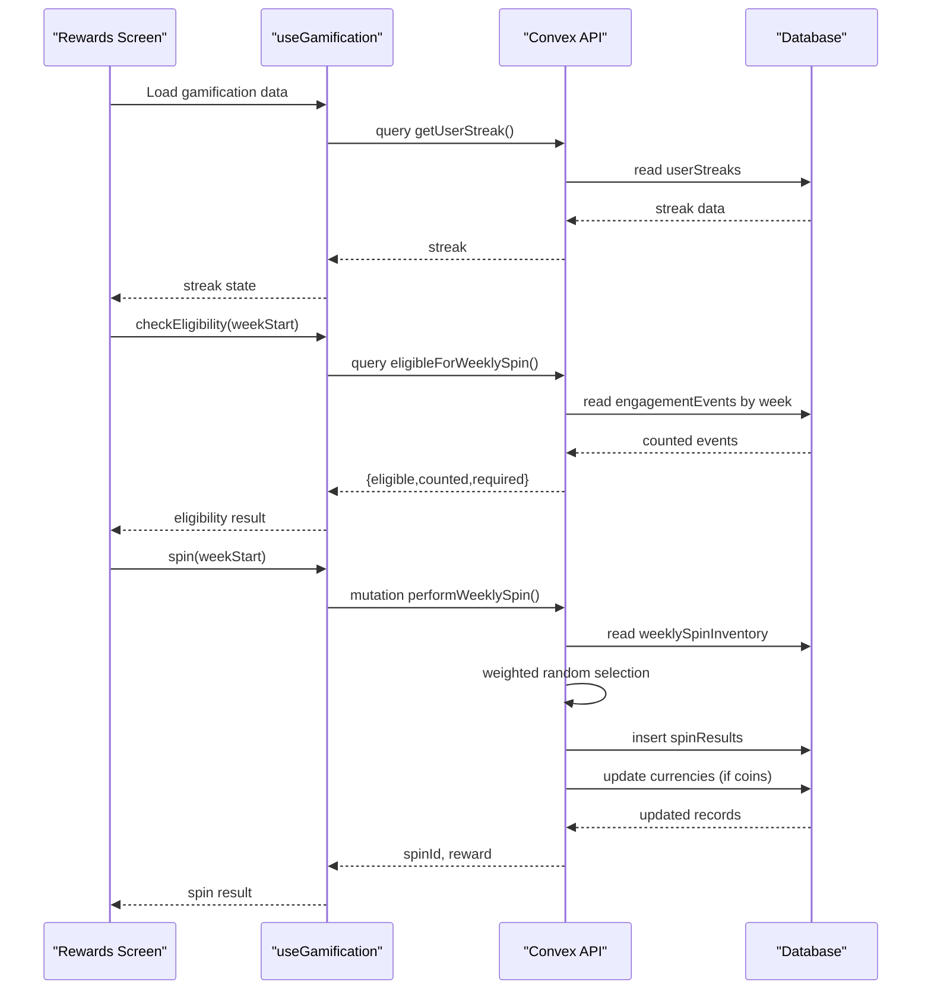
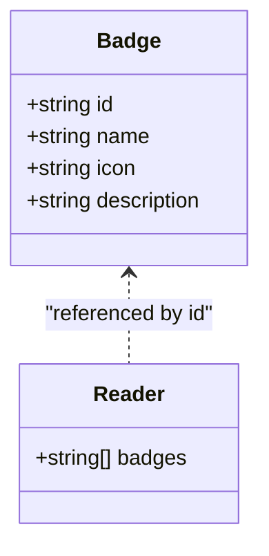
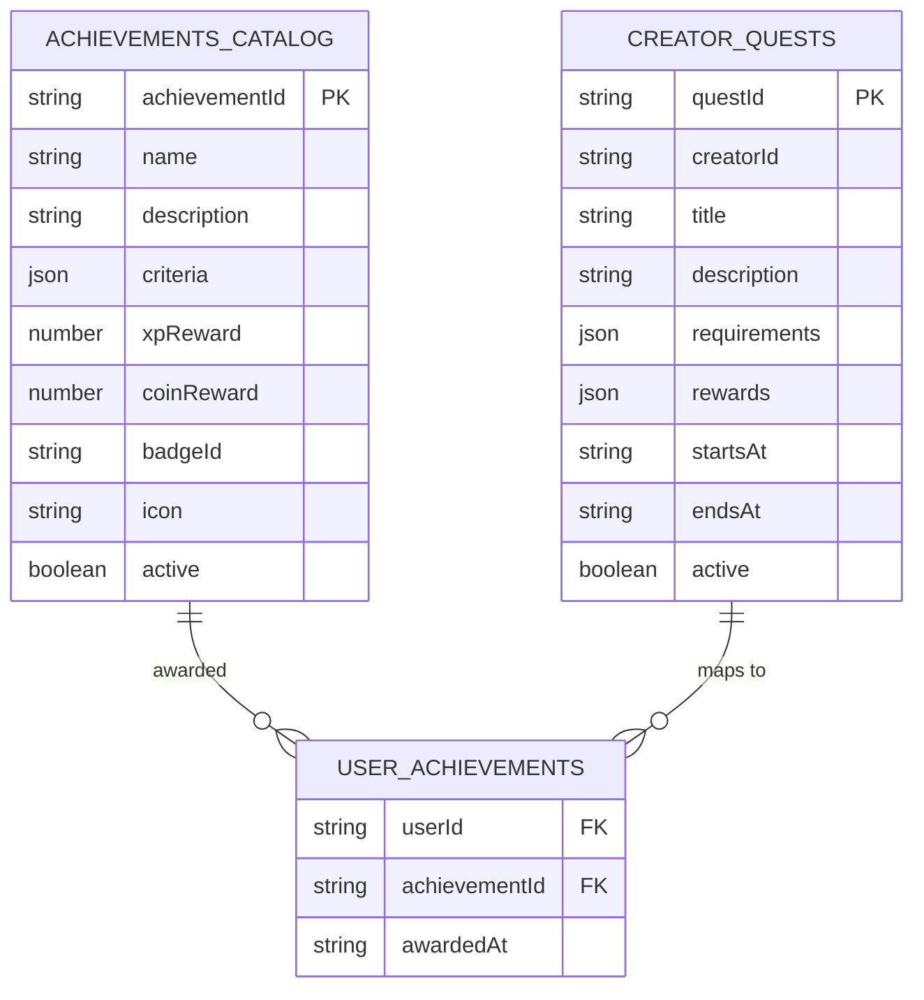
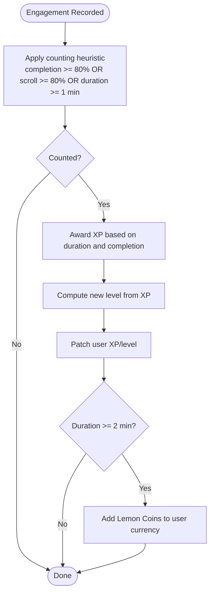
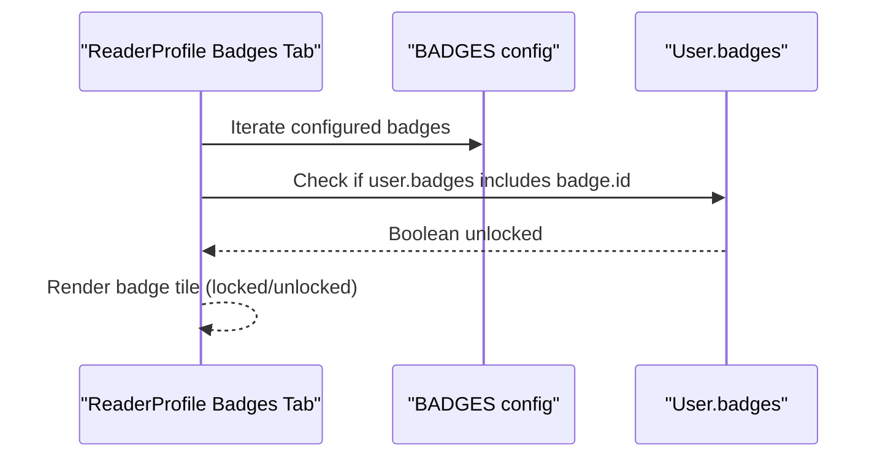
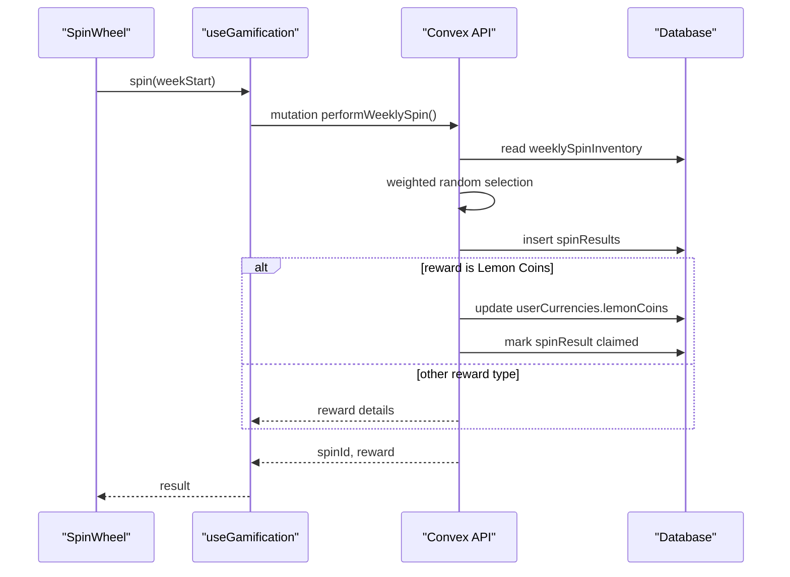
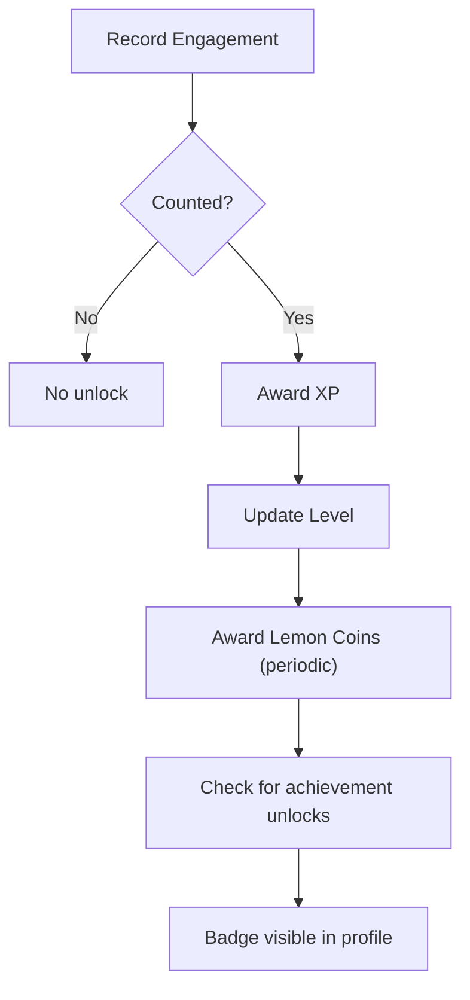
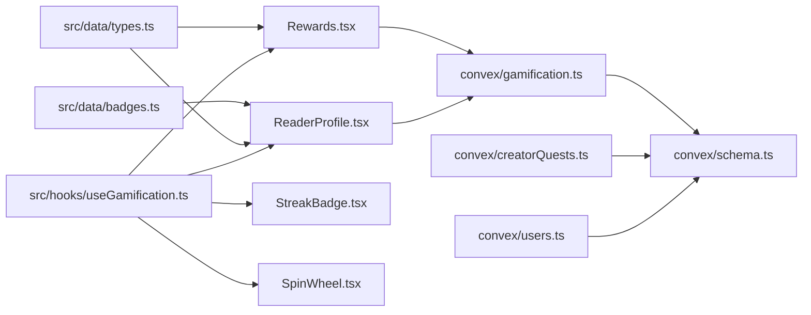

# Achievement and Badge System

<cite>
**Referenced Files in This Document**
- [badges.ts](file://src/data/badges.ts)
- [types.ts](file://src/data/types.ts)
- [schema.ts](file://convex/schema.ts)
- [gamification.ts](file://convex/gamification.ts)
- [creatorQuests.ts](file://convex/creatorQuests.ts)
- [Rewards.tsx](file://src/screens/Rewards.tsx)
- [ReaderProfile.tsx](file://src/screens/ReaderProfile.tsx)
- [StreakBadge.tsx](file://src/components/ui/StreakBadge.tsx)
- [SpinWheel.tsx](file://src/components/ui/SpinWheel.tsx)
- [useGamification.ts](file://src/hooks/useGamification.ts)
- [users.ts](file://convex/users.ts)
</cite>

## Table of Contents
1. [Introduction](#introduction)
2. [Project Structure](#project-structure)
3. [Core Components](#core-components)
4. [Architecture Overview](#architecture-overview)
5. [Detailed Component Analysis](#detailed-component-analysis)
6. [Dependency Analysis](#dependency-analysis)
7. [Performance Considerations](#performance-considerations)
8. [Troubleshooting Guide](#troubleshooting-guide)
9. [Conclusion](#conclusion)

## Introduction
This document explains the achievement and badge system in the platform, covering badge types, unlock conditions, progress tracking, backend gamification functions, frontend display components, and the reward redemption flow. It also outlines how achievements are modeled, how progress is evaluated, and how users can view and redeem rewards.

## Project Structure
The achievement and badge system spans frontend data definitions, UI components, and backend Convex functions and schemas:
- Frontend data model and UI: badge definitions, profile badges display, rewards screen, streak and spin UI widgets
- Backend data model: user badges, achievements catalog, user achievements, currencies, streaks, spin inventory, engagement events
- Backend functions: gamification queries/mutations for spins, streaks, currencies, and engagement recording; creator quest claims

**Diagram sources**
- [badges.ts:1-9](file://src/data/badges.ts#L1-L9)
- [types.ts:39-44](file://src/data/types.ts#L39-L44)
- [schema.ts:354-450](file://convex/schema.ts#L354-L450)
- [gamification.ts:1-331](file://convex/gamification.ts#L1-L331)
- [creatorQuests.ts:1-97](file://convex/creatorQuests.ts#L1-L97)
- [Rewards.tsx:1-121](file://src/screens/Rewards.tsx#L1-L121)
- [ReaderProfile.tsx:413-435](file://src/screens/ReaderProfile.tsx#L413-L435)
- [StreakBadge.tsx:1-21](file://src/components/ui/StreakBadge.tsx#L1-L21)
- [SpinWheel.tsx:1-94](file://src/components/ui/SpinWheel.tsx#L1-L94)
- [useGamification.ts:1-48](file://src/hooks/useGamification.ts#L1-L48)
- [users.ts:83-84](file://convex/users.ts#L83-L84)

**Section sources**
- [badges.ts:1-9](file://src/data/badges.ts#L1-L9)
- [types.ts:39-44](file://src/data/types.ts#L39-L44)
- [schema.ts:354-450](file://convex/schema.ts#L354-L450)
- [gamification.ts:1-331](file://convex/gamification.ts#L1-L331)
- [creatorQuests.ts:1-97](file://convex/creatorQuests.ts#L1-L97)
- [Rewards.tsx:1-121](file://src/screens/Rewards.tsx#L1-L121)
- [ReaderProfile.tsx:413-435](file://src/screens/ReaderProfile.tsx#L413-L435)
- [StreakBadge.tsx:1-21](file://src/components/ui/StreakBadge.tsx#L1-L21)
- [SpinWheel.tsx:1-94](file://src/components/ui/SpinWheel.tsx#L1-L94)
- [useGamification.ts:1-48](file://src/hooks/useGamification.ts#L1-L48)
- [users.ts:83-84](file://convex/users.ts#L83-L84)

## Core Components
- Badge configuration data structure: defines static badge metadata (id, name, icon, description) consumed by the frontend.
- Achievement catalog and user achievements: backend schema modeling achievements with criteria, rewards, and linking to badges; user records of awarded achievements.
- Gamification backend: engagement recording, XP/currency awards, weekly spin eligibility and draw, streak tracking, and streak insurance.
- Creator quests: creator-defined challenges with requirements and rewards, claimable by users.
- Frontend display: Rewards screen for streaks, spins, and currencies; Reader profile badges grid; reusable UI components for streak and spin.

**Section sources**
- [badges.ts:3-8](file://src/data/badges.ts#L3-L8)
- [types.ts:39-44](file://src/data/types.ts#L39-L44)
- [schema.ts:431-450](file://convex/schema.ts#L431-L450)
- [gamification.ts:14-117](file://convex/gamification.ts#L14-L117)
- [creatorQuests.ts:6-32](file://convex/creatorQuests.ts#L6-L32)
- [Rewards.tsx:9-121](file://src/screens/Rewards.tsx#L9-L121)
- [ReaderProfile.tsx:413-435](file://src/screens/ReaderProfile.tsx#L413-L435)
- [StreakBadge.tsx:4-20](file://src/components/ui/StreakBadge.tsx#L4-L20)
- [SpinWheel.tsx:16-94](file://src/components/ui/SpinWheel.tsx#L16-L94)

## Architecture Overview
The system integrates frontend UI with backend Convex functions and database tables. Users trigger engagement events, backend evaluates progress, and frontend displays progress and rewards.

**Diagram sources**
- [Rewards.tsx:9-121](file://src/screens/Rewards.tsx#L9-L121)
- [useGamification.ts:12-46](file://src/hooks/useGamification.ts#L12-L46)
- [gamification.ts:119-232](file://convex/gamification.ts#L119-L232)
- [schema.ts:363-404](file://convex/schema.ts#L363-L404)

## Detailed Component Analysis

### Badge Configuration and Categories
- Static badge definitions: id, name, icon, description. These are used to render the badges grid in the Reader profile.
- User badges: stored on the user record as an array of badge ids. Unlocking occurs when backend systems award achievements linked to badges.

**Diagram sources**
- [types.ts:39-44](file://src/data/types.ts#L39-L44)
- [users.ts:83-84](file://convex/users.ts#L83-L84)
- [badges.ts:3-8](file://src/data/badges.ts#L3-L8)

**Section sources**
- [badges.ts:3-8](file://src/data/badges.ts#L3-L8)
- [types.ts:39-44](file://src/data/types.ts#L39-L44)
- [users.ts:83-84](file://convex/users.ts#L83-L84)

### Achievement Catalog and Progress Tracking
- Achievements catalog: stores achievement definitions with criteria, XP and coin rewards, optional badge linkage, and active flag.
- User achievements: records awarded achievements per user, enabling progress tracking and preventing double claims.
- Creator quests: creator-defined tasks with requirements and rewards; claimable by users and recorded as user achievements.

**Diagram sources**
- [schema.ts:431-450](file://convex/schema.ts#L431-L450)
- [creatorQuests.ts:6-32](file://convex/creatorQuests.ts#L6-L32)

**Section sources**
- [schema.ts:431-450](file://convex/schema.ts#L431-L450)
- [creatorQuests.ts:44-97](file://convex/creatorQuests.ts#L44-L97)

### Backend Gamification Functions
- Engagement recording: validates sessions, determines if a read/view counts, awards XP and periodic Lemon Coins, and updates user level thresholds.
- Weekly spin eligibility and draw: checks counted engagement events within a week window and performs a weighted random selection from the active spin inventory.
- Streak tracking and insurance: maintains current/longest streak, protected window, and allows purchasing streak insurance with Lemon Coins.

**Diagram sources**
- [gamification.ts:14-117](file://convex/gamification.ts#L14-L117)

**Section sources**
- [gamification.ts:14-117](file://convex/gamification.ts#L14-L117)
- [gamification.ts:119-232](file://convex/gamification.ts#L119-L232)
- [gamification.ts:289-331](file://convex/gamification.ts#L289-L331)

### Frontend Badge Display and Progress Views
- Rewards screen: shows daily streak progress bar, weekly spin wheel, quest list, and user currencies.
- Reader profile badges grid: lists all configured badges, indicating locked/unlocked state based on user’s badge ids.
- Reusable UI components: StreakBadge displays current/longest streak; SpinWheel handles spin logic and eligibility checks.

**Diagram sources**
- [ReaderProfile.tsx:413-435](file://src/screens/ReaderProfile.tsx#L413-L435)
- [badges.ts:3-8](file://src/data/badges.ts#L3-L8)
- [users.ts:83-84](file://convex/users.ts#L83-L84)

**Section sources**
- [Rewards.tsx:9-121](file://src/screens/Rewards.tsx#L9-L121)
- [ReaderProfile.tsx:413-435](file://src/screens/ReaderProfile.tsx#L413-L435)
- [StreakBadge.tsx:4-20](file://src/components/ui/StreakBadge.tsx#L4-L20)
- [SpinWheel.tsx:16-94](file://src/components/ui/SpinWheel.tsx#L16-L94)
- [useGamification.ts:6-47](file://src/hooks/useGamification.ts#L6-L47)

### Reward Redemption and Currency Management
- Weekly spin rewards: drawn from weeklySpinInventory with weights; coin-type rewards are immediately claimed and credited to user currencies.
- Currencies: Lemon Coins and Golden Ink tracked per user; used for streak insurance purchases.
- Quest rewards: claimable by users and credited as Lemon Coins and/or XP.

**Diagram sources**
- [SpinWheel.tsx:24-45](file://src/components/ui/SpinWheel.tsx#L24-L45)
- [useGamification.ts:36-39](file://src/hooks/useGamification.ts#L36-L39)
- [gamification.ts:147-232](file://convex/gamification.ts#L147-L232)
- [schema.ts:373-404](file://convex/schema.ts#L373-L404)

**Section sources**
- [gamification.ts:147-232](file://convex/gamification.ts#L147-L232)
- [schema.ts:373-404](file://convex/schema.ts#L373-L404)
- [creatorQuests.ts:73-95](file://convex/creatorQuests.ts#L73-L95)

### Achievement Criteria and Unlock Conditions
- Engagement-based unlocks: reading sessions are evaluated for countability; upon counting, XP and Lemon Coins are awarded, and user level progresses.
- Weekly spin eligibility: requires a minimum number of counted engagement events within a weekly window.
- Quest-based unlocks: completing creator-defined quests grants rewards and marks an achievement for the user.
- Badge unlocks: achieved when user has an awarded achievement linked to a badge; badges are displayed in Reader profile.

**Diagram sources**
- [gamification.ts:14-117](file://convex/gamification.ts#L14-L117)
- [schema.ts:431-450](file://convex/schema.ts#L431-L450)
- [ReaderProfile.tsx:413-435](file://src/screens/ReaderProfile.tsx#L413-L435)

**Section sources**
- [gamification.ts:14-117](file://convex/gamification.ts#L14-L117)
- [schema.ts:431-450](file://convex/schema.ts#L431-L450)
- [ReaderProfile.tsx:413-435](file://src/screens/ReaderProfile.tsx#L413-L435)

## Dependency Analysis
- Frontend depends on Convex APIs exposed by gamification.ts and schema.ts tables.
- Reader profile depends on static badge definitions and user badge ids.
- Rewards screen depends on gamification hooks and UI components.
- Backend depends on schema-defined tables and enforces business rules for eligibility, weighting, and progression.

**Diagram sources**
- [badges.ts:1-9](file://src/data/badges.ts#L1-L9)
- [types.ts:39-44](file://src/data/types.ts#L39-L44)
- [Rewards.tsx:1-121](file://src/screens/Rewards.tsx#L1-L121)
- [ReaderProfile.tsx:413-435](file://src/screens/ReaderProfile.tsx#L413-L435)
- [StreakBadge.tsx:1-21](file://src/components/ui/StreakBadge.tsx#L1-L21)
- [SpinWheel.tsx:1-94](file://src/components/ui/SpinWheel.tsx#L1-L94)
- [useGamification.ts:1-48](file://src/hooks/useGamification.ts#L1-L48)
- [gamification.ts:1-331](file://convex/gamification.ts#L1-L331)
- [schema.ts:354-450](file://convex/schema.ts#L354-L450)
- [creatorQuests.ts:1-97](file://convex/creatorQuests.ts#L1-L97)
- [users.ts:83-84](file://convex/users.ts#L83-L84)

**Section sources**
- [badges.ts:1-9](file://src/data/badges.ts#L1-L9)
- [types.ts:39-44](file://src/data/types.ts#L39-L44)
- [Rewards.tsx:1-121](file://src/screens/Rewards.tsx#L1-L121)
- [ReaderProfile.tsx:413-435](file://src/screens/ReaderProfile.tsx#L413-L435)
- [StreakBadge.tsx:1-21](file://src/components/ui/StreakBadge.tsx#L1-L21)
- [SpinWheel.tsx:1-94](file://src/components/ui/SpinWheel.tsx#L1-L94)
- [useGamification.ts:1-48](file://src/hooks/useGamification.ts#L1-L48)
- [gamification.ts:1-331](file://convex/gamification.ts#L1-L331)
- [schema.ts:354-450](file://convex/schema.ts#L354-L450)
- [creatorQuests.ts:1-97](file://convex/creatorQuests.ts#L1-L97)
- [users.ts:83-84](file://convex/users.ts#L83-L84)

## Performance Considerations
- Engagement counting uses simple heuristics to avoid expensive computations and relies on indexed queries for user and events.
- Weekly spin eligibility scans counted events within a fixed week window; ensure indexes on timestamps and user ids are leveraged.
- Weighted spin draws iterate inventory; keep inventory sizes reasonable and weights precomputed.
- Frontend caching via React state avoids redundant network calls; use optimistic updates for spin results and streak UI.

## Troubleshooting Guide
- Weekly spin eligibility errors: verify weekStart ISO string and that counted engagement events exist for the user within the week window.
- Spin reward errors: confirm active spin inventory exists and has positive total weight; ensure user meets eligibility thresholds.
- Streak insurance errors: check Lemon Coin balance and cost calculation; verify streak protection extension logic.
- Achievement unlock issues: ensure achievement catalog entries are active and user achievements are properly recorded; verify badge linkage.

**Section sources**
- [gamification.ts:119-144](file://convex/gamification.ts#L119-L144)
- [gamification.ts:147-173](file://convex/gamification.ts#L147-L173)
- [gamification.ts:234-286](file://convex/gamification.ts#L234-L286)
- [schema.ts:431-450](file://convex/schema.ts#L431-L450)

## Conclusion
The achievement and badge system combines static badge definitions, dynamic achievement catalogs, and gamification mechanics to drive user engagement. Backend functions evaluate progress, award XP and currencies, and manage weekly spins and streak protections. Frontend components present progress, rewards, and badges, enabling users to track and celebrate milestones. The modular design supports extensibility for new badge categories, achievement criteria, and reward types.