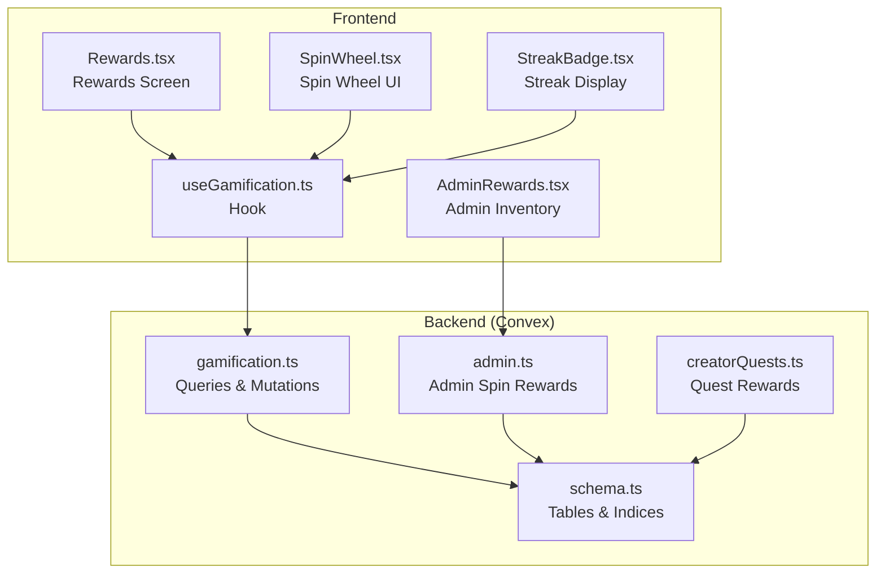
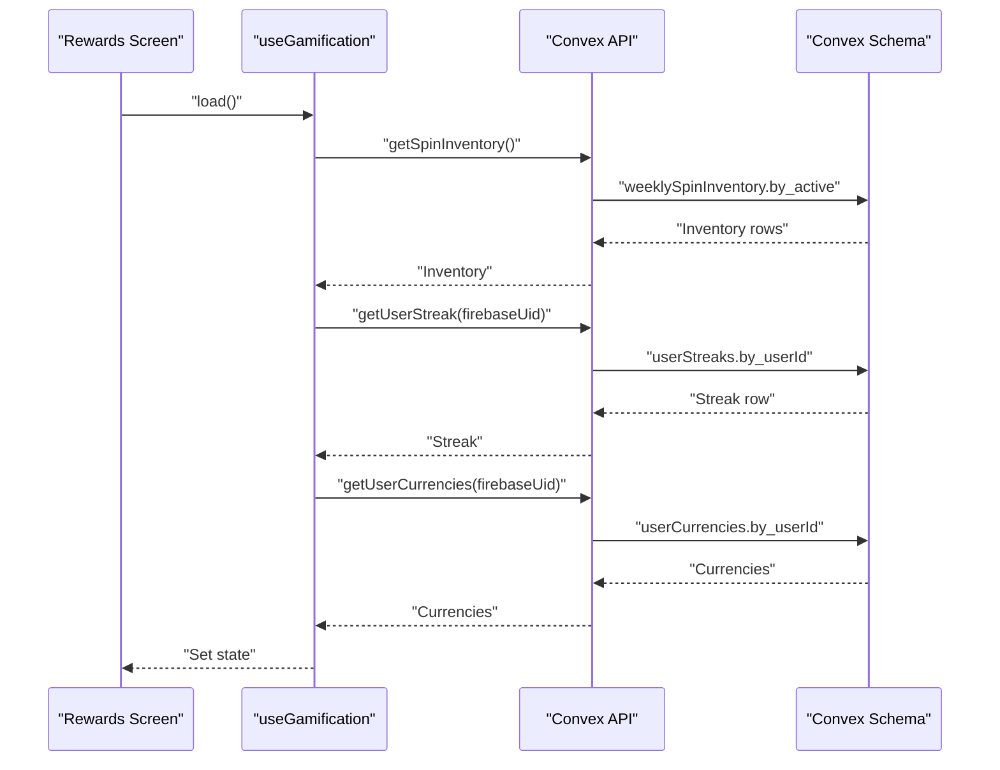
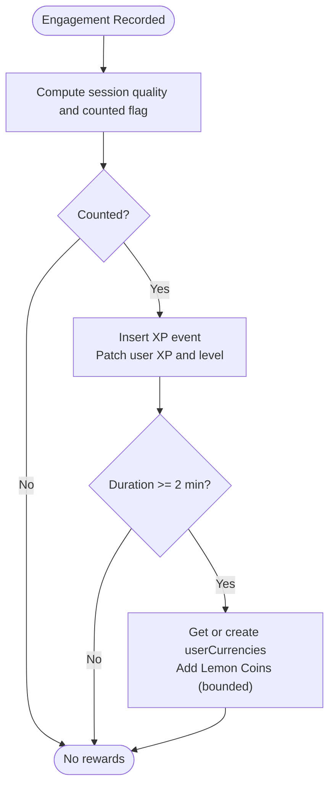
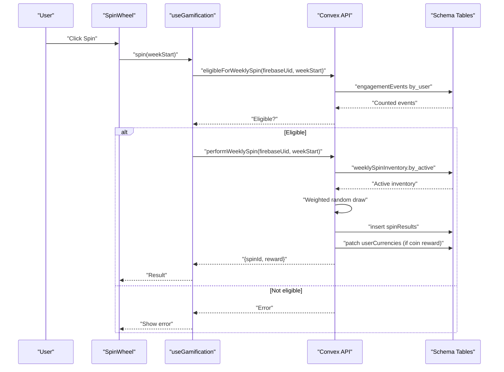
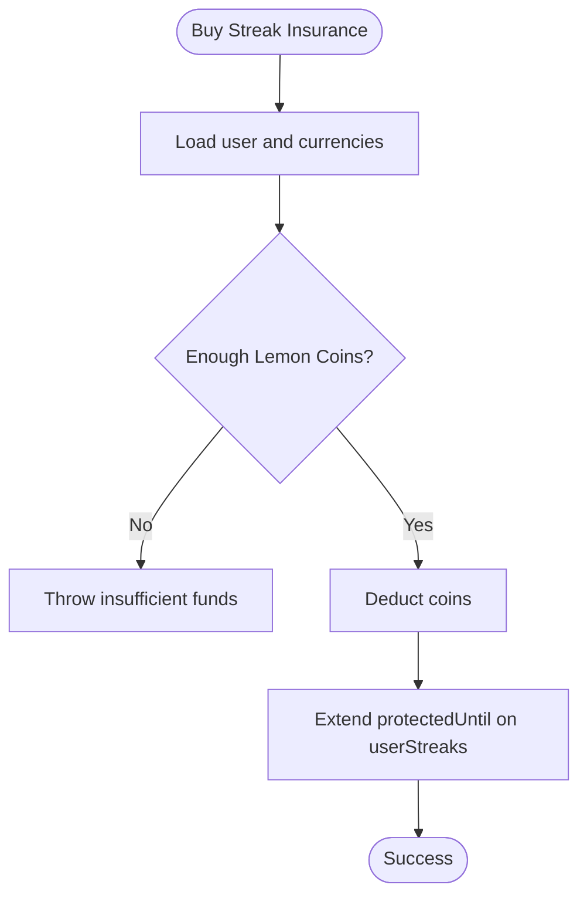
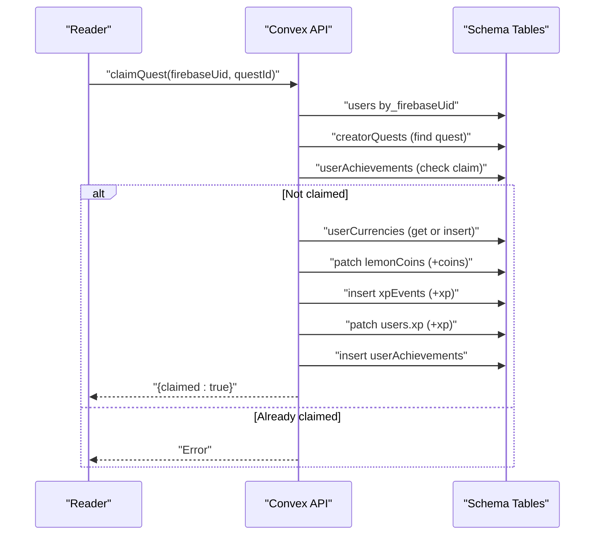
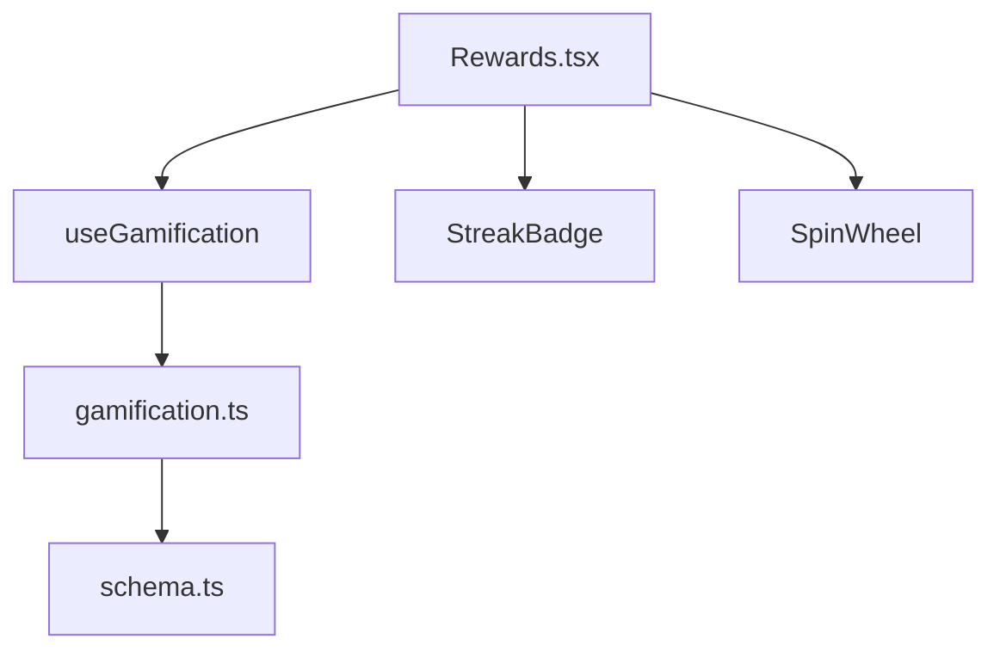
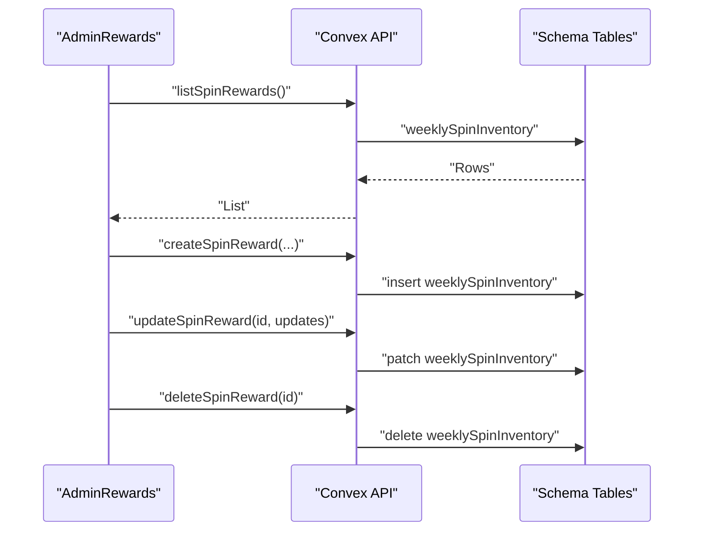
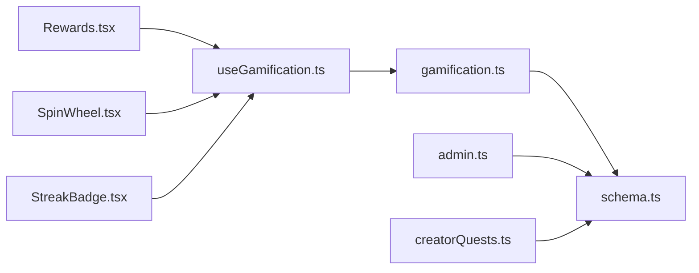

# Currency System and Rewards

<cite>
**Referenced Files in This Document**
- [gamification.ts](file://convex/gamification.ts)
- [schema.ts](file://convex/schema.ts)
- [Rewards.tsx](file://src/screens/Rewards.tsx)
- [useGamification.ts](file://src/hooks/useGamification.ts)
- [SpinWheel.tsx](file://src/components/ui/SpinWheel.tsx)
- [StreakBadge.tsx](file://src/components/ui/StreakBadge.tsx)
- [AdminRewards.tsx](file://src/screens/admin/AdminRewards.tsx)
- [admin.ts](file://convex/admin.ts)
- [creatorQuests.ts](file://convex/creatorQuests.ts)
</cite>

## Table of Contents
1. [Introduction](#introduction)
2. [Project Structure](#project-structure)
3. [Core Components](#core-components)
4. [Architecture Overview](#architecture-overview)
5. [Detailed Component Analysis](#detailed-component-analysis)
6. [Dependency Analysis](#dependency-analysis)
7. [Performance Considerations](#performance-considerations)
8. [Troubleshooting Guide](#troubleshooting-guide)
9. [Conclusion](#conclusion)

## Introduction
This document explains the currency system and rewards management in the gamification module. It covers how Lemon Coins are earned via engagement, how the weekly spin wheel works, how streak protection is managed, and how the frontend displays currency balances and reward availability. It also documents the backend Convex functions that manage currency transactions, spin eligibility, and reward inventory, and outlines the economic balance considerations to maintain a sustainable and motivating system.

## Project Structure
The gamification system spans backend Convex queries and mutations, a frontend hook for state management, and UI components for displaying streaks, spins, and currencies. Admin screens allow configuring weekly spin rewards.

**Diagram sources**
- [gamification.ts:1-331](file://convex/gamification.ts#L1-L331)
- [admin.ts:250-364](file://convex/admin.ts#L250-L364)
- [schema.ts:354-494](file://convex/schema.ts#L354-L494)
- [creatorQuests.ts:1-97](file://convex/creatorQuests.ts#L1-L97)
- [useGamification.ts:1-48](file://src/hooks/useGamification.ts#L1-L48)
- [Rewards.tsx:1-121](file://src/screens/Rewards.tsx#L1-L121)
- [SpinWheel.tsx:1-94](file://src/components/ui/SpinWheel.tsx#L1-L94)
- [StreakBadge.tsx:1-21](file://src/components/ui/StreakBadge.tsx#L1-L21)
- [AdminRewards.tsx:1-126](file://src/screens/admin/AdminRewards.tsx#L1-L126)

**Section sources**
- [gamification.ts:1-331](file://convex/gamification.ts#L1-L331)
- [schema.ts:354-494](file://convex/schema.ts#L354-L494)
- [useGamification.ts:1-48](file://src/hooks/useGamification.ts#L1-L48)
- [Rewards.tsx:1-121](file://src/screens/Rewards.tsx#L1-L121)
- [SpinWheel.tsx:1-94](file://src/components/ui/SpinWheel.tsx#L1-L94)
- [StreakBadge.tsx:1-21](file://src/components/ui/StreakBadge.tsx#L1-L21)
- [AdminRewards.tsx:1-126](file://src/screens/admin/AdminRewards.tsx#L1-L126)
- [admin.ts:250-364](file://convex/admin.ts#L250-L364)
- [creatorQuests.ts:1-97](file://convex/creatorQuests.ts#L1-L97)

## Core Components
- Currency model: Lemon Coins and Golden Ink tracked per user.
- Engagement scoring and XP: Earning XP and Lemon Coins based on session quality and duration.
- Weekly spin wheel: Eligibility determined by weekly counted engagements; rewards drawn from weighted inventory.
- Streak protection: Insurance purchase costs Lemon Coins and extends protection window.
- Quest rewards: Creator-defined quests award Lemon Coins and XP upon claim.
- Frontend state: Hook loads currencies, streak, and spin inventory; UI renders streak, spin wheel, and currency cards.

**Section sources**
- [schema.ts:356-361](file://convex/schema.ts#L356-L361)
- [gamification.ts:14-117](file://convex/gamification.ts#L14-L117)
- [gamification.ts:147-232](file://convex/gamification.ts#L147-L232)
- [gamification.ts:234-287](file://convex/gamification.ts#L234-L287)
- [creatorQuests.ts:44-97](file://convex/creatorQuests.ts#L44-L97)
- [useGamification.ts:6-47](file://src/hooks/useGamification.ts#L6-L47)
- [Rewards.tsx:9-121](file://src/screens/Rewards.tsx#L9-L121)

## Architecture Overview
The system is built around Convex queries and mutations that operate on typed tables. The frontend hook orchestrates data fetching and exposes convenience methods for spin and insurance actions. The admin screen manages the weekly spin inventory.

**Diagram sources**
- [useGamification.ts:12-29](file://src/hooks/useGamification.ts#L12-L29)
- [gamification.ts:4-12](file://convex/gamification.ts#L4-L12)
- [gamification.ts:289-311](file://convex/gamification.ts#L289-L311)
- [gamification.ts:313-331](file://convex/gamification.ts#L313-L331)
- [schema.ts:373-371](file://convex/schema.ts#L373-L371)

## Detailed Component Analysis

### Currency Model and Accumulation
- Tables: userCurrencies stores Lemon Coins and Golden Ink per user; engagementEvents and xpEvents track XP accrual.
- Accumulation rules:
  - Engagement-based XP: computed from duration and completion percentage.
  - Lemon Coins: awarded for sessions of sufficient duration with a cap based on minutes.
- Level progression: cumulative XP thresholds increase required XP per level.

**Diagram sources**
- [gamification.ts:14-117](file://convex/gamification.ts#L14-L117)
- [schema.ts:406-429](file://convex/schema.ts#L406-L429)
- [schema.ts:356-361](file://convex/schema.ts#L356-L361)

**Section sources**
- [gamification.ts:14-117](file://convex/gamification.ts#L14-L117)
- [schema.ts:356-361](file://convex/schema.ts#L356-L361)
- [schema.ts:406-429](file://convex/schema.ts#L406-L429)

### Weekly Spin Wheel Mechanics
- Eligibility: user must meet a weekly threshold of counted engagements within a week boundary.
- Draw process: weighted random selection from active weeklySpinInventory; coin-type rewards are instantly claimed and credited.
- Backend flow: eligibility check, inventory fetch, weighted draw, insert spinResult, and optional immediate claim.

**Diagram sources**
- [SpinWheel.tsx:24-45](file://src/components/ui/SpinWheel.tsx#L24-L45)
- [useGamification.ts:31-44](file://src/hooks/useGamification.ts#L31-L44)
- [gamification.ts:119-145](file://convex/gamification.ts#L119-L145)
- [gamification.ts:147-232](file://convex/gamification.ts#L147-L232)
- [schema.ts:373-404](file://convex/schema.ts#L373-L404)

**Section sources**
- [SpinWheel.tsx:16-94](file://src/components/ui/SpinWheel.tsx#L16-L94)
- [useGamification.ts:31-44](file://src/hooks/useGamification.ts#L31-L44)
- [gamification.ts:119-145](file://convex/gamification.ts#L119-L145)
- [gamification.ts:147-232](file://convex/gamification.ts#L147-L232)
- [schema.ts:373-404](file://convex/schema.ts#L373-L404)

### Streak Protection and Insurance
- Cost: 5 Lemon Coins per day of protection purchased.
- Extension: Adds or extends protectedUntil on userStreaks; creates streak record if missing.
- UI: StreakBadge displays current and longest streaks.

**Diagram sources**
- [gamification.ts:234-287](file://convex/gamification.ts#L234-L287)
- [schema.ts:363-371](file://convex/schema.ts#L363-L371)
- [StreakBadge.tsx:4-21](file://src/components/ui/StreakBadge.tsx#L4-L21)

**Section sources**
- [gamification.ts:234-287](file://convex/gamification.ts#L234-L287)
- [schema.ts:363-371](file://convex/schema.ts#L363-L371)
- [StreakBadge.tsx:4-21](file://src/components/ui/StreakBadge.tsx#L4-L21)

### Quest Rewards and Currency Spending
- Quest creation: Admin-defined quests with requirements and rewards.
- Claiming: Users claim quests once; rewards include Lemon Coins and XP; currencies updated accordingly.
- Achievement tracking: userAchievements records claims.

**Diagram sources**
- [creatorQuests.ts:44-97](file://convex/creatorQuests.ts#L44-L97)
- [schema.ts:459-471](file://convex/schema.ts#L459-L471)
- [schema.ts:473-481](file://convex/schema.ts#L473-L481)
- [schema.ts:445-450](file://convex/schema.ts#L445-L450)

**Section sources**
- [creatorQuests.ts:44-97](file://convex/creatorQuests.ts#L44-L97)
- [schema.ts:459-471](file://convex/schema.ts#L459-L471)
- [schema.ts:473-481](file://convex/schema.ts#L473-L481)
- [schema.ts:445-450](file://convex/schema.ts#L445-L450)

### Rewards Screen Implementation
- Displays streak progress and milestones.
- Shows weekly spin wheel with eligibility messaging.
- Lists active quests with coin rewards.
- Shows currency balances (Lemon Coins and Golden Ink) dynamically.

**Diagram sources**
- [Rewards.tsx:9-121](file://src/screens/Rewards.tsx#L9-L121)
- [useGamification.ts:6-47](file://src/hooks/useGamification.ts#L6-L47)
- [StreakBadge.tsx:4-21](file://src/components/ui/StreakBadge.tsx#L4-L21)
- [SpinWheel.tsx:16-94](file://src/components/ui/SpinWheel.tsx#L16-L94)
- [gamification.ts:4-12](file://convex/gamification.ts#L4-L12)
- [schema.ts:356-361](file://convex/schema.ts#L356-L361)

**Section sources**
- [Rewards.tsx:9-121](file://src/screens/Rewards.tsx#L9-L121)
- [useGamification.ts:6-47](file://src/hooks/useGamification.ts#L6-L47)
- [StreakBadge.tsx:4-21](file://src/components/ui/StreakBadge.tsx#L4-L21)
- [SpinWheel.tsx:16-94](file://src/components/ui/SpinWheel.tsx#L16-L94)

### Admin Rewards Management
- Admin screen lists, creates, updates, and deletes weekly spin rewards.
- Supports configuring reward types, amounts, weights, and activity flags.

**Diagram sources**
- [AdminRewards.tsx:13-52](file://src/screens/admin/AdminRewards.tsx#L13-L52)
- [admin.ts:253-310](file://convex/admin.ts#L253-L310)
- [schema.ts:373-392](file://convex/schema.ts#L373-L392)

**Section sources**
- [AdminRewards.tsx:1-126](file://src/screens/admin/AdminRewards.tsx#L1-L126)
- [admin.ts:253-310](file://convex/admin.ts#L253-L310)
- [schema.ts:373-392](file://convex/schema.ts#L373-L392)

## Dependency Analysis
- Backend dependencies:
  - gamification.ts depends on schema tables for users, userCurrencies, userStreaks, weeklySpinInventory, spinResults, engagementEvents, and xpEvents.
  - admin.ts depends on weeklySpinInventory for managing rewards.
  - creatorQuests.ts depends on userCurrencies, xpEvents, users, and userAchievements.
- Frontend dependencies:
  - useGamification.ts depends on Convex API bindings and Firebase auth.
  - Rewards.tsx composes UI components and uses the hook.
  - SpinWheel.tsx and StreakBadge.tsx depend on useGamification.

**Diagram sources**
- [gamification.ts:1-331](file://convex/gamification.ts#L1-L331)
- [admin.ts:250-364](file://convex/admin.ts#L250-L364)
- [creatorQuests.ts:1-97](file://convex/creatorQuests.ts#L1-L97)
- [schema.ts:354-494](file://convex/schema.ts#L354-L494)
- [useGamification.ts:1-48](file://src/hooks/useGamification.ts#L1-L48)
- [Rewards.tsx:1-121](file://src/screens/Rewards.tsx#L1-L121)
- [SpinWheel.tsx:1-94](file://src/components/ui/SpinWheel.tsx#L1-L94)
- [StreakBadge.tsx:1-21](file://src/components/ui/StreakBadge.tsx#L1-L21)

**Section sources**
- [gamification.ts:1-331](file://convex/gamification.ts#L1-L331)
- [admin.ts:250-364](file://convex/admin.ts#L250-L364)
- [creatorQuests.ts:1-97](file://convex/creatorQuests.ts#L1-L97)
- [schema.ts:354-494](file://convex/schema.ts#L354-L494)
- [useGamification.ts:1-48](file://src/hooks/useGamification.ts#L1-L48)
- [Rewards.tsx:1-121](file://src/screens/Rewards.tsx#L1-L121)
- [SpinWheel.tsx:1-94](file://src/components/ui/SpinWheel.tsx#L1-L94)
- [StreakBadge.tsx:1-21](file://src/components/ui/StreakBadge.tsx#L1-L21)

## Performance Considerations
- Indexed queries: weeklySpinInventory.by_active, userCurrencies.by_userId, userStreaks.by_userId, engagementEvents.by_user, and xpEvents.by_user leverage indices for efficient reads.
- Weighted selection: O(n) pass over active inventory; acceptable for small inventories but could be optimized with precomputed cumulative weights for very large sets.
- Frontend caching: useGamification caches loaded data and avoids redundant requests; consider adding optimistic updates for spin and insurance actions to improve perceived performance.

[No sources needed since this section provides general guidance]

## Troubleshooting Guide
- User not found errors:
  - Occur when authenticating or querying user-specific data; ensure Firebase auth is initialized and the user is logged in.
- Insufficient Lemon Coins:
  - Streak insurance throws when balances are low; prompt users to earn more coins via engagement or quests.
- Spin eligibility failures:
  - Eligibility requires a minimum number of counted engagements within the week; guide users to engage more and wait until the next week boundary.
- Spin inventory empty:
  - Admin must configure active weeklySpinInventory; otherwise, spins cannot be performed.

**Section sources**
- [gamification.ts:34-36](file://convex/gamification.ts#L34-L36)
- [gamification.ts:155-156](file://convex/gamification.ts#L155-L156)
- [gamification.ts:171-173](file://convex/gamification.ts#L171-L173)
- [gamification.ts:180-181](file://convex/gamification.ts#L180-L181)
- [gamification.ts:252-254](file://convex/gamification.ts#L252-L254)

## Conclusion
The gamification system integrates engagement scoring, streak tracking, weekly spins, and quest-based rewards to incentivize sustained reader participation. The backend provides robust, indexed queries and mutations, while the frontend offers responsive UI components and a convenient hook for state management. Admin controls enable dynamic reward configuration, ensuring the system remains flexible and engaging. Economic balance is maintained through bounded coin awards, insurance costs, and weighted reward distribution, supporting long-term sustainability.