# Daily Streak System

<cite>
**Referenced Files in This Document**
- [StreakBadge.tsx](file://src/components/ui/StreakBadge.tsx)
- [useGamification.ts](file://src/hooks/useGamification.ts)
- [useEngagement.ts](file://src/hooks/useEngagement.ts)
- [gamification.ts](file://convex/gamification.ts)
- [schema.ts](file://convex/schema.ts)
- [Rewards.tsx](file://src/screens/Rewards.tsx)
- [ReaderProfile.tsx](file://src/screens/ReaderProfile.tsx)
- [types.ts](file://src/data/types.ts)
</cite>

## Table of Contents
1. [Introduction](#introduction)
2. [Project Structure](#project-structure)
3. [Core Components](#core-components)
4. [Architecture Overview](#architecture-overview)
5. [Detailed Component Analysis](#detailed-component-analysis)
6. [Dependency Analysis](#dependency-analysis)
7. [Performance Considerations](#performance-considerations)
8. [Troubleshooting Guide](#troubleshooting-guide)
9. [Conclusion](#conclusion)

## Introduction
This document explains the daily streak system that powers reader engagement and streak maintenance in the application. It covers how reading sessions are detected and recorded, how streaks are computed and persisted, how streak protection and insurance work, and how the frontend displays streak information. It also documents the backend gamification functions responsible for streak persistence and the frontend hooks that manage streak state.

## Project Structure
The streak system spans frontend React components and Convex backend functions:
- Frontend
  - StreakBadge component renders current and longest streak
  - useGamification hook loads streak data and exposes actions
  - useEngagement hook records reading sessions
  - Screens integrate streak display and progress
- Backend
  - Convex gamification module defines queries and mutations for streaks, currencies, and engagement events
  - Convex schema defines the data model for user streaks, currencies, and engagement events

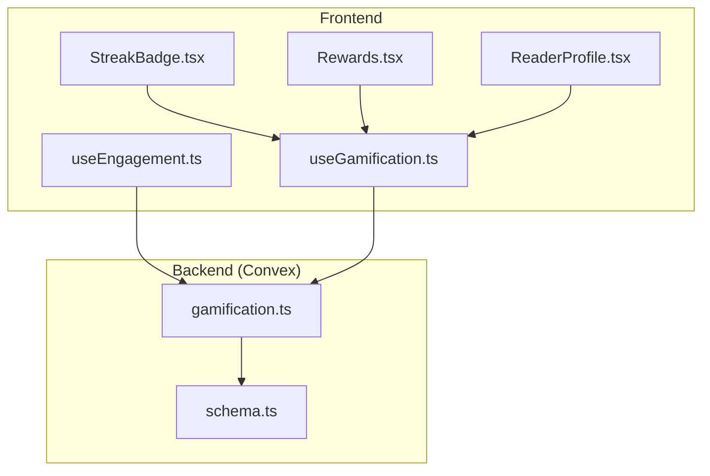

**Diagram sources**
- [StreakBadge.tsx:1-21](file://src/components/ui/StreakBadge.tsx#L1-L21)
- [useGamification.ts:1-48](file://src/hooks/useGamification.ts#L1-L48)
- [useEngagement.ts:1-63](file://src/hooks/useEngagement.ts#L1-L63)
- [gamification.ts:1-331](file://convex/gamification.ts#L1-L331)
- [schema.ts:354-429](file://convex/schema.ts#L354-L429)

**Section sources**
- [StreakBadge.tsx:1-21](file://src/components/ui/StreakBadge.tsx#L1-L21)
- [useGamification.ts:1-48](file://src/hooks/useGamification.ts#L1-L48)
- [useEngagement.ts:1-63](file://src/hooks/useEngagement.ts#L1-L63)
- [gamification.ts:1-331](file://convex/gamification.ts#L1-L331)
- [schema.ts:354-429](file://convex/schema.ts#L354-L429)

## Core Components
- StreakBadge: Displays current and longest streak values fetched via useGamification.
- useGamification: Loads streak data, currencies, and spin inventory; exposes actions for weekly spin eligibility and streak insurance purchase.
- useEngagement: Records reading sessions with timestamps and completion metrics; ensures sessions are captured even on visibility change or periodic intervals.
- Backend gamification functions: Persist engagement events, compute streak-related data, manage currencies, and handle streak protection.

Key frontend-to-backend interactions:
- StreakBadge depends on useGamification to fetch userStreak data.
- useGamification uses Convex queries/mutations to retrieve streaks, currencies, and perform actions.
- useEngagement uses Convex mutations to record engagement events.

**Section sources**
- [StreakBadge.tsx:1-21](file://src/components/ui/StreakBadge.tsx#L1-L21)
- [useGamification.ts:1-48](file://src/hooks/useGamification.ts#L1-L48)
- [useEngagement.ts:1-63](file://src/hooks/useEngagement.ts#L1-L63)
- [gamification.ts:14-117](file://convex/gamification.ts#L14-L117)
- [schema.ts:363-371](file://convex/schema.ts#L363-L371)

## Architecture Overview
The streak system architecture connects frontend components to backend Convex functions and data models.

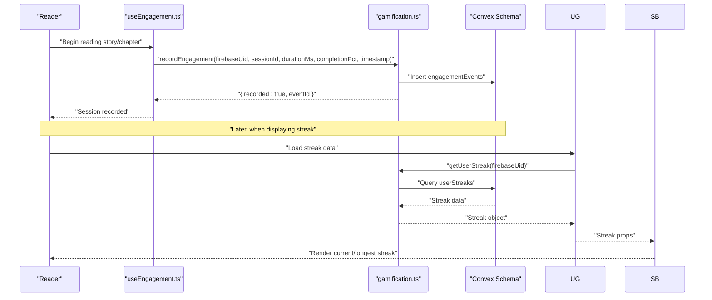

**Diagram sources**
- [useEngagement.ts:15-41](file://src/hooks/useEngagement.ts#L15-L41)
- [gamification.ts:14-117](file://convex/gamification.ts#L14-L117)
- [schema.ts:406-420](file://convex/schema.ts#L406-L420)
- [useGamification.ts:12-27](file://src/hooks/useGamification.ts#L12-L27)
- [StreakBadge.tsx:4-19](file://src/components/ui/StreakBadge.tsx#L4-L19)

## Detailed Component Analysis

### StreakBadge Component
StreakBadge renders the current streak count and the longest streak achieved. It relies on useGamification to fetch the streak data and gracefully handles loading and missing data.

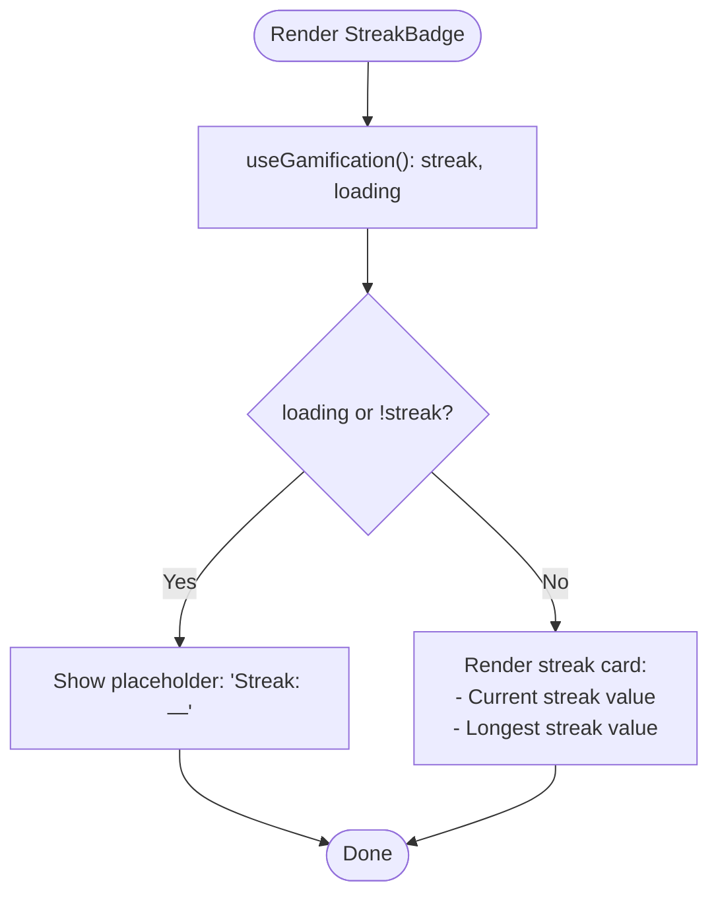

**Diagram sources**
- [StreakBadge.tsx:4-19](file://src/components/ui/StreakBadge.tsx#L4-L19)
- [useGamification.ts:6-27](file://src/hooks/useGamification.ts#L6-L27)

**Section sources**
- [StreakBadge.tsx:1-21](file://src/components/ui/StreakBadge.tsx#L1-L21)
- [useGamification.ts:1-48](file://src/hooks/useGamification.ts#L1-L48)

### useGamification Hook
useGamification orchestrates streak data retrieval and actions:
- Loads spin inventory, user streak, and currencies
- Provides eligibility checks for weekly spins
- Exposes mutation to perform weekly spins
- Exposes mutation to buy streak insurance

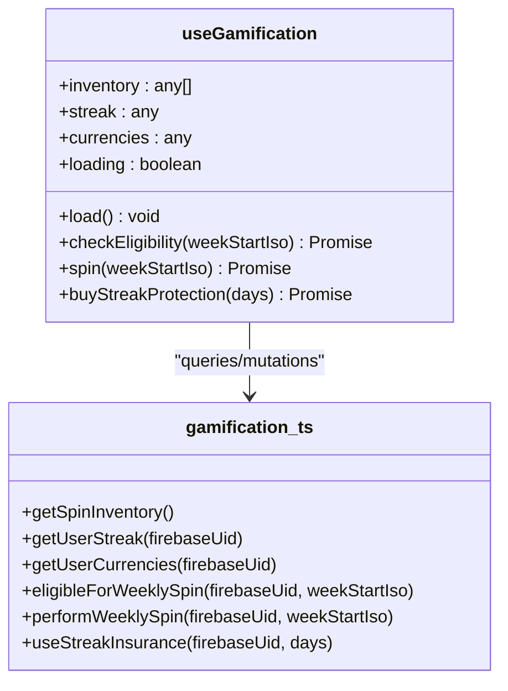

**Diagram sources**
- [useGamification.ts:6-46](file://src/hooks/useGamification.ts#L6-L46)
- [gamification.ts:4-12](file://convex/gamification.ts#L4-L12)

**Section sources**
- [useGamification.ts:1-48](file://src/hooks/useGamification.ts#L1-L48)
- [gamification.ts:4-12](file://convex/gamification.ts#L4-L12)

### useEngagement Hook
useEngagement tracks reading sessions and records them periodically and on visibility change. It computes scroll completion percentage and sends engagement events with timestamps.

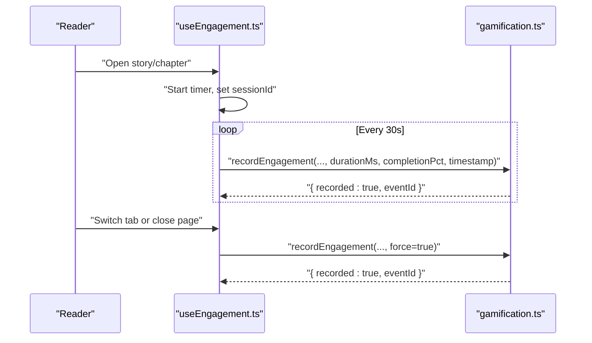

**Diagram sources**
- [useEngagement.ts:11-61](file://src/hooks/useEngagement.ts#L11-L61)
- [gamification.ts:14-117](file://convex/gamification.ts#L14-L117)

**Section sources**
- [useEngagement.ts:1-63](file://src/hooks/useEngagement.ts#L1-L63)
- [gamification.ts:14-117](file://convex/gamification.ts#L14-L117)

### Backend Gamification Functions
The backend manages:
- Recording engagement events with completion thresholds
- Computing XP and optional coin rewards
- Managing user streaks and protection
- Handling weekly spin eligibility and rewards
- Managing currencies and insurance purchases

Key backend functions and their roles:
- recordEngagement: Inserts engagement event and awards XP and coins when sessions meet thresholds.
- eligibleForWeeklySpin: Checks weekly read count against a requirement.
- performWeeklySpin: Performs weighted random draw from spin inventory and updates balances.
- useStreakInsurance: Deducts coins and extends protection window for streak maintenance.
- getUserStreak: Returns current streak data for a user.
- getUserCurrencies: Returns user's currency balance.

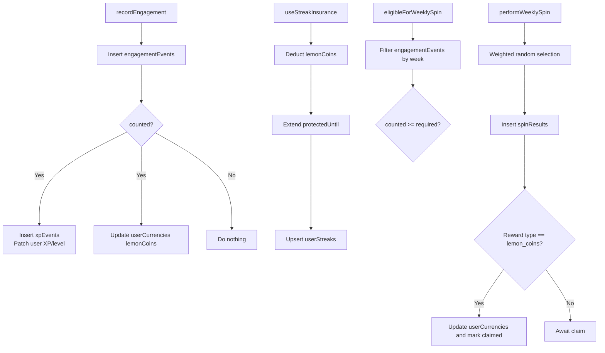

**Diagram sources**
- [gamification.ts:14-117](file://convex/gamification.ts#L14-L117)
- [gamification.ts:119-145](file://convex/gamification.ts#L119-L145)
- [gamification.ts:147-232](file://convex/gamification.ts#L147-L232)
- [gamification.ts:234-287](file://convex/gamification.ts#L234-L287)
- [gamification.ts:289-311](file://convex/gamification.ts#L289-L311)
- [gamification.ts:313-331](file://convex/gamification.ts#L313-L331)

**Section sources**
- [gamification.ts:14-117](file://convex/gamification.ts#L14-L117)
- [gamification.ts:119-145](file://convex/gamification.ts#L119-L145)
- [gamification.ts:147-232](file://convex/gamification.ts#L147-L232)
- [gamification.ts:234-287](file://convex/gamification.ts#L234-L287)
- [gamification.ts:289-331](file://convex/gamification.ts#L289-L331)

### Data Model for Streaks and Currencies
The Convex schema defines the core tables used by the streak system:
- userStreaks: Stores current streak, longest streak, last activity timestamp, protection window, and usage stats.
- userCurrencies: Tracks lemonCoins and goldenInk balances.
- engagementEvents: Stores reading session details used to compute streaks and weekly eligibility.

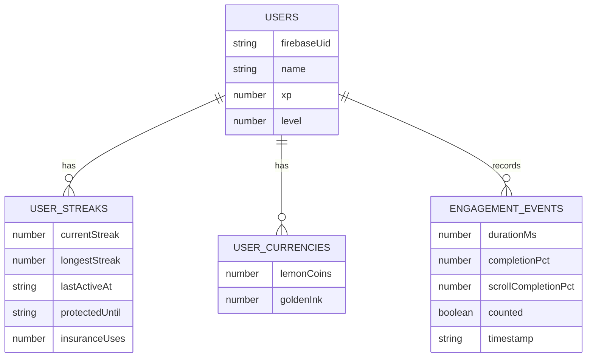

**Diagram sources**
- [schema.ts:363-371](file://convex/schema.ts#L363-L371)
- [schema.ts:356-361](file://convex/schema.ts#L356-L361)
- [schema.ts:406-420](file://convex/schema.ts#L406-L420)

**Section sources**
- [schema.ts:354-429](file://convex/schema.ts#L354-L429)

### Streak Detection Algorithm and Edge Cases
The streak detection relies on engagement events and a protection window:
- Engagement events are inserted with a counted flag determined by thresholds (completion percentage, scroll completion, or minimum duration).
- Weekly eligibility is computed by counting "counted" events within a week boundary derived from ISO weekStart.
- Streak protection extends a protection window during which streaks are not decremented.

Edge cases handled:
- Session gaps: If a day passes without a counted session, the streak resets unless protected.
- Timezone differences: The algorithm uses ISO strings for week boundaries and timestamps, minimizing timezone ambiguity by relying on consistent parsing.
- Session termination: Visibility change and forced sends ensure sessions are recorded even if the tab closes or loses focus.

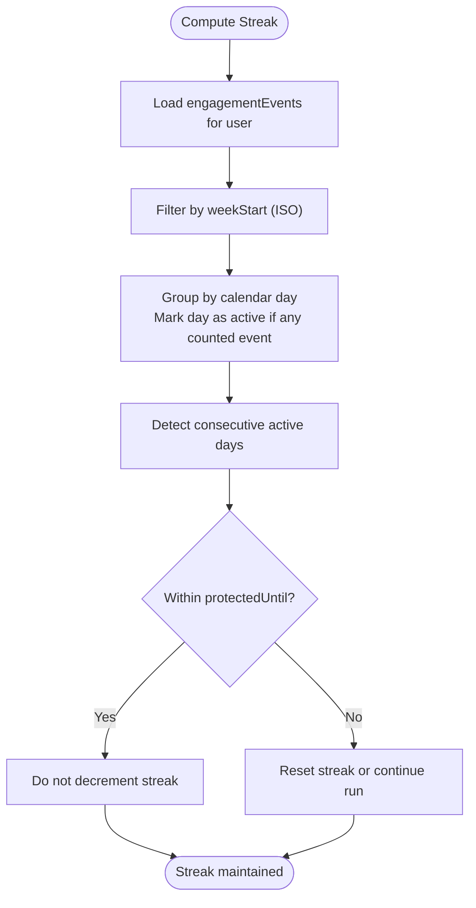

**Diagram sources**
- [gamification.ts:119-145](file://convex/gamification.ts#L119-L145)
- [gamification.ts:234-287](file://convex/gamification.ts#L234-L287)

**Section sources**
- [gamification.ts:14-117](file://convex/gamification.ts#L14-L117)
- [gamification.ts:119-145](file://convex/gamification.ts#L119-L145)
- [gamification.ts:234-287](file://convex/gamification.ts#L234-L287)

### Streak Protection Mechanism and Insurance System
Streak protection prevents streak loss during planned absences:
- Users can purchase insurance using Lemon Coins.
- Each day of insurance adds a 24-hour protection window extending from the latest protection end time.
- The protection window is stored in userStreaks.protectedUntil.

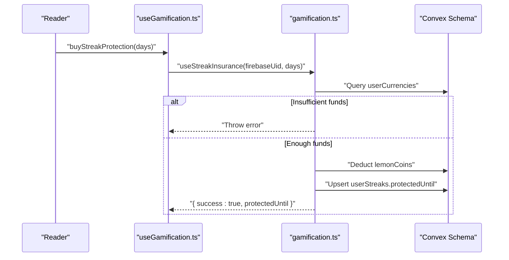

**Diagram sources**
- [useGamification.ts:41-44](file://src/hooks/useGamification.ts#L41-L44)
- [gamification.ts:234-287](file://convex/gamification.ts#L234-L287)
- [schema.ts:363-371](file://convex/schema.ts#L363-L371)

**Section sources**
- [useGamification.ts:41-44](file://src/hooks/useGamification.ts#L41-L44)
- [gamification.ts:234-287](file://convex/gamification.ts#L234-L287)
- [schema.ts:363-371](file://convex/schema.ts#L363-L371)

### Visual Representation and Frontend Integration
Streaks are displayed in multiple places:
- StreakBadge shows current and longest streaks.
- Rewards screen shows progress toward milestones and integrates StreakBadge.
- Reader profile shows daily streak prominently.

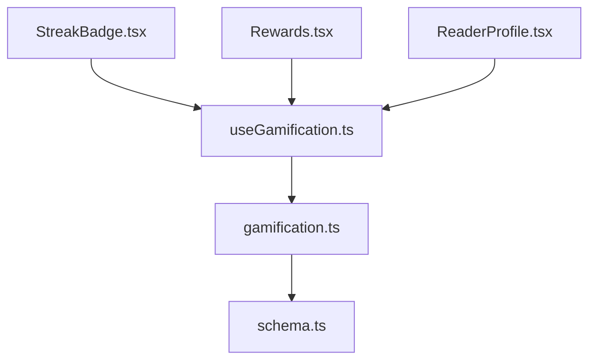

**Diagram sources**
- [StreakBadge.tsx:1-21](file://src/components/ui/StreakBadge.tsx#L1-L21)
- [Rewards.tsx:36-58](file://src/screens/Rewards.tsx#L36-L58)
- [ReaderProfile.tsx:242-248](file://src/screens/ReaderProfile.tsx#L242-L248)
- [useGamification.ts:1-48](file://src/hooks/useGamification.ts#L1-L48)
- [gamification.ts:289-311](file://convex/gamification.ts#L289-L311)
- [schema.ts:363-371](file://convex/schema.ts#L363-L371)

**Section sources**
- [StreakBadge.tsx:1-21](file://src/components/ui/StreakBadge.tsx#L1-L21)
- [Rewards.tsx:36-58](file://src/screens/Rewards.tsx#L36-L58)
- [ReaderProfile.tsx:242-248](file://src/screens/ReaderProfile.tsx#L242-L248)
- [useGamification.ts:1-48](file://src/hooks/useGamification.ts#L1-L48)

### Streak Bonus Multipliers and Extended Streak Benefits
- The backend currently awards XP and optional coins based on session duration and completion percentage but does not define explicit daily streak bonus multipliers in the provided code.
- Extended streaks are represented by longestStreak and currentStreak values, which inform UI displays and potential future bonus logic.

**Section sources**
- [gamification.ts:64-117](file://convex/gamification.ts#L64-L117)
- [gamification.ts:289-311](file://convex/gamification.ts#L289-L311)

### Streak Reset Scenarios and Recovery Mechanisms
- Resets occur when a day passes without a counted session outside the protection window.
- Recovery mechanisms:
  - Streak protection purchased with Lemon Coins extends the protection window.
  - Weekly spin eligibility requires a configurable number of counted sessions per week; meeting this can incentivize consistent reading.

**Section sources**
- [gamification.ts:119-145](file://convex/gamification.ts#L119-L145)
- [gamification.ts:234-287](file://convex/gamification.ts#L234-L287)

## Dependency Analysis
The streak system exhibits clear separation of concerns:
- Frontend components depend on hooks for data and actions.
- Hooks depend on Convex API generated bindings to call backend functions.
- Backend functions depend on the schema for data storage and retrieval.

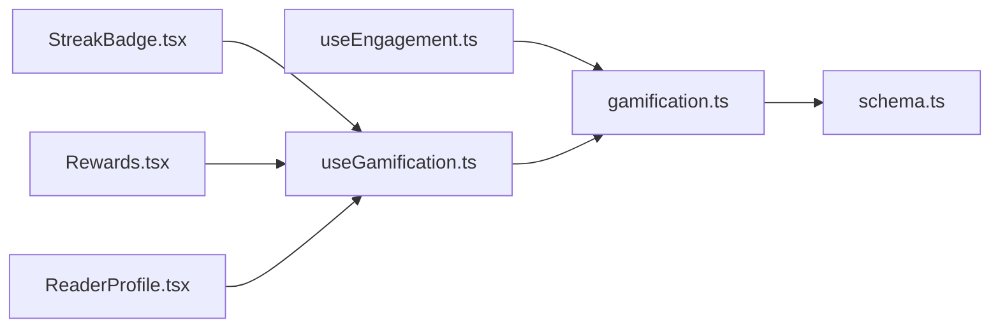

**Diagram sources**
- [StreakBadge.tsx:1-21](file://src/components/ui/StreakBadge.tsx#L1-L21)
- [useGamification.ts:1-48](file://src/hooks/useGamification.ts#L1-L48)
- [useEngagement.ts:1-63](file://src/hooks/useEngagement.ts#L1-L63)
- [gamification.ts:1-331](file://convex/gamification.ts#L1-L331)
- [schema.ts:354-429](file://convex/schema.ts#L354-L429)

**Section sources**
- [StreakBadge.tsx:1-21](file://src/components/ui/StreakBadge.tsx#L1-L21)
- [useGamification.ts:1-48](file://src/hooks/useGamification.ts#L1-L48)
- [useEngagement.ts:1-63](file://src/hooks/useEngagement.ts#L1-L63)
- [gamification.ts:1-331](file://convex/gamification.ts#L1-L331)
- [schema.ts:354-429](file://convex/schema.ts#L354-L429)

## Performance Considerations
- Engagement recording uses periodic polling and visibility change events to minimize missed sessions while avoiding excessive network calls.
- Queries for streaks and currencies are lightweight and scoped to the authenticated user.
- Consider batching or debouncing engagement updates if traffic increases significantly.

## Troubleshooting Guide
Common issues and resolutions:
- Streak not updating
  - Verify that useEngagement is active for the current story/chapter and that recordEngagement is being called.
  - Confirm that sessions meet the counted thresholds (completion percentage, scroll completion, or duration).
- Streak resets unexpectedly
  - Check if the current date falls outside the protectedUntil window.
  - Ensure protection was purchased and up-to-date.
- Streak display shows placeholders
  - Confirm that useGamification.load resolves successfully and streak data is present.
- Weekly spin eligibility errors
  - Ensure counted sessions meet the weekly requirement and weekStart is correctly passed as an ISO string.

**Section sources**
- [useEngagement.ts:1-63](file://src/hooks/useEngagement.ts#L1-L63)
- [gamification.ts:14-117](file://convex/gamification.ts#L14-L117)
- [gamification.ts:119-145](file://convex/gamification.ts#L119-L145)
- [useGamification.ts:12-27](file://src/hooks/useGamification.ts#L12-L27)

## Conclusion
The daily streak system combines frontend engagement tracking with backend persistence to maintain accurate streaks, protect against unintended losses, and provide meaningful visual feedback. The current implementation focuses on session counting and protection windows, with clear room to expand bonus mechanics and deeper analytics around streak milestones.